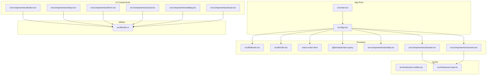
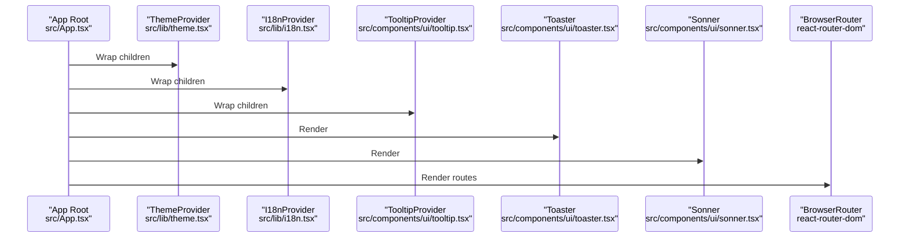
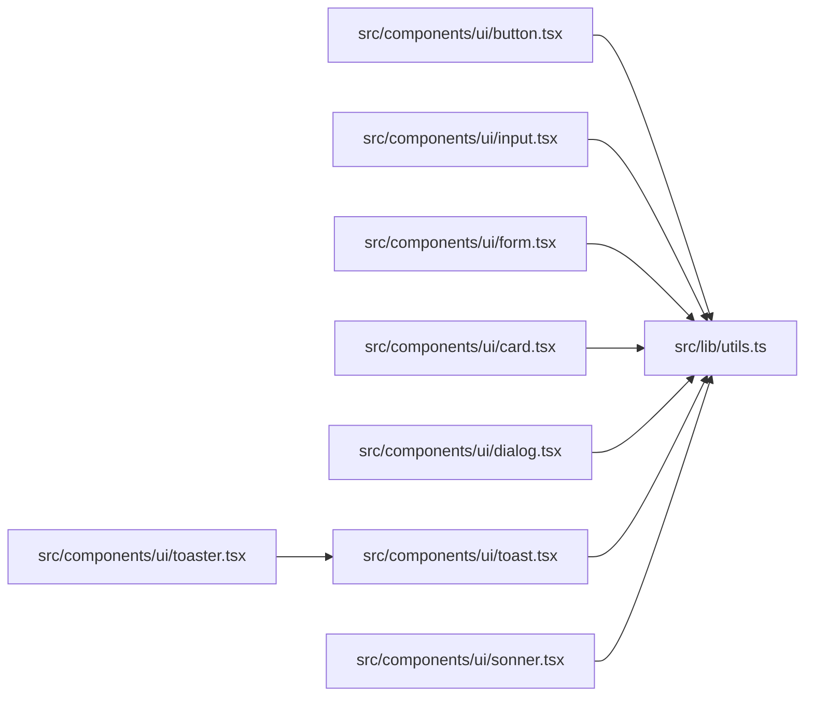

# API Reference

<cite>
**Referenced Files in This Document**
- [README.md](file://README.md)
- [package.json](file://package.json)
- [src/App.tsx](file://src/App.tsx)
- [src/main.tsx](file://src/main.tsx)
- [src/lib/utils.ts](file://src/lib/utils.ts)
- [src/lib/theme.tsx](file://src/lib/theme.tsx)
- [src/lib/i18n.tsx](file://src/lib/i18n.tsx)
- [src/hooks/use-mobile.tsx](file://src/hooks/use-mobile.tsx)
- [src/hooks/use-toast.ts](file://src/hooks/use-toast.ts)
- [src/components/ui/button.tsx](file://src/components/ui/button.tsx)
- [src/components/ui/input.tsx](file://src/components/ui/input.tsx)
- [src/components/ui/form.tsx](file://src/components/ui/form.tsx)
- [src/components/ui/card.tsx](file://src/components/ui/card.tsx)
- [src/components/ui/dialog.tsx](file://src/components/ui/dialog.tsx)
- [src/components/ui/toast.tsx](file://src/components/ui/toast.tsx)
- [src/components/ui/toaster.tsx](file://src/components/ui/toaster.tsx)
- [src/components/ui/sonner.tsx](file://src/components/ui/sonner.tsx)
- [src/components/ui/tooltip.tsx](file://src/components/ui/tooltip.tsx)
- [src/components/ui/use-toast.ts](file://src/components/ui/use-toast.ts)
</cite>

## Table of Contents
1. [Introduction](#introduction)
2. [Project Structure](#project-structure)
3. [Core Components](#core-components)
4. [Architecture Overview](#architecture-overview)
5. [Detailed Component Analysis](#detailed-component-analysis)
6. [Dependency Analysis](#dependency-analysis)
7. [Performance Considerations](#performance-considerations)
8. [Troubleshooting Guide](#troubleshooting-guide)
9. [Conclusion](#conclusion)
10. [Appendices](#appendices)

## Introduction
This API reference documents the public interfaces, components, hooks, and utilities used in the project. It covers UI components, custom hooks, utility functions, and configuration providers. For each element, we describe props/interfaces, return values, defaults, validation rules, usage examples, composition patterns, and integration guidelines. Versioning and deprecation notes are included where applicable.

## Project Structure
The project is a React + TypeScript application using shadcn/ui primitives and Radix UI under the hood. Providers for theme, internationalization, routing, and notifications are wired at the application root. UI components are organized under a shared ui module, while reusable hooks and utilities live under dedicated folders.

**Diagram sources**
- [src/main.tsx](file://src/main.tsx#L1-L6)
- [src/App.tsx](file://src/App.tsx#L1-L45)
- [src/lib/theme.tsx](file://src/lib/theme.tsx#L1-L36)
- [src/lib/i18n.tsx](file://src/lib/i18n.tsx#L1-L173)
- [src/components/ui/tooltip.tsx](file://src/components/ui/tooltip.tsx#L1-L29)
- [src/components/ui/toaster.tsx](file://src/components/ui/toaster.tsx#L1-L25)
- [src/components/ui/sonner.tsx](file://src/components/ui/sonner.tsx#L1-L28)
- [src/components/ui/button.tsx](file://src/components/ui/button.tsx#L1-L48)
- [src/components/ui/input.tsx](file://src/components/ui/input.tsx#L1-L23)
- [src/components/ui/form.tsx](file://src/components/ui/form.tsx#L1-L130)
- [src/components/ui/card.tsx](file://src/components/ui/card.tsx#L1-L44)
- [src/components/ui/dialog.tsx](file://src/components/ui/dialog.tsx#L1-L96)
- [src/components/ui/toast.tsx](file://src/components/ui/toast.tsx#L1-L112)
- [src/hooks/use-mobile.tsx](file://src/hooks/use-mobile.tsx#L1-L20)
- [src/hooks/use-toast.ts](file://src/hooks/use-toast.ts#L1-L187)
- [src/lib/utils.ts](file://src/lib/utils.ts#L1-L7)

**Section sources**
- [README.md](file://README.md#L53-L61)
- [package.json](file://package.json#L15-L64)
- [src/App.tsx](file://src/App.tsx#L1-L45)
- [src/main.tsx](file://src/main.tsx#L1-L6)

## Core Components
This section catalogs the primary public APIs grouped by category.

- UI Components
  - Button: Variants and sizes, forward ref, slot support, and className merging.
  - Input: Text input with consistent styling and accessibility attributes.
  - Card: Header, footer, title, description, and content slots.
  - Dialog: Root, Trigger, Portal, Overlay, Content, Header, Footer, Title, Description.
  - Toast: Provider, Viewport, Toast, Title, Description, Close, Action.
  - Toaster: Renders queued toasts from the toast store.
  - Sonner: Themed toast provider with theme-aware styling.
  - Tooltip: Provider, Root, Trigger, Content.

- Custom Hooks
  - useIsMobile: Returns a boolean indicating mobile viewport.
  - useToast: Toast store and imperative toast API.

- Utilities
  - cn: Class merging utility combining clsx and tailwind-merge.

- Providers
  - ThemeProvider: Manages light/dark theme with persistence and system preference fallback.
  - I18nProvider: Provides language switching, translation lookup, and persistence.

**Section sources**
- [src/components/ui/button.tsx](file://src/components/ui/button.tsx#L1-L48)
- [src/components/ui/input.tsx](file://src/components/ui/input.tsx#L1-L23)
- [src/components/ui/card.tsx](file://src/components/ui/card.tsx#L1-L44)
- [src/components/ui/dialog.tsx](file://src/components/ui/dialog.tsx#L1-L96)
- [src/components/ui/toast.tsx](file://src/components/ui/toast.tsx#L1-L112)
- [src/components/ui/toaster.tsx](file://src/components/ui/toaster.tsx#L1-L25)
- [src/components/ui/sonner.tsx](file://src/components/ui/sonner.tsx#L1-L28)
- [src/components/ui/tooltip.tsx](file://src/components/ui/tooltip.tsx#L1-L29)
- [src/hooks/use-mobile.tsx](file://src/hooks/use-mobile.tsx#L1-L20)
- [src/hooks/use-toast.ts](file://src/hooks/use-toast.ts#L1-L187)
- [src/lib/utils.ts](file://src/lib/utils.ts#L1-L7)
- [src/lib/theme.tsx](file://src/lib/theme.tsx#L1-L36)
- [src/lib/i18n.tsx](file://src/lib/i18n.tsx#L1-L173)

## Architecture Overview
The app composes providers at the root to deliver global state and UI capabilities. Theme and i18n providers encapsulate state and expose hooks. Toast systems integrate either with local hooks or external libraries. Routing is handled by react-router-dom.

**Diagram sources**
- [src/App.tsx](file://src/App.tsx#L1-L45)
- [src/lib/theme.tsx](file://src/lib/theme.tsx#L12-L31)
- [src/lib/i18n.tsx](file://src/lib/i18n.tsx#L148-L168)
- [src/components/ui/tooltip.tsx](file://src/components/ui/tooltip.tsx#L6-L26)
- [src/components/ui/toaster.tsx](file://src/components/ui/toaster.tsx#L4-L24)
- [src/components/ui/sonner.tsx](file://src/components/ui/sonner.tsx#L6-L25)

## Detailed Component Analysis

### UI Components

#### Button
- Purpose: Base button with variant and size variants, slot support, and className merging.
- Props
  - Inherits all HTML button attributes.
  - variant: "default" | "destructive" | "outline" | "secondary" | "ghost" | "link"
  - size: "default" | "sm" | "lg" | "icon"
  - asChild: boolean (forward to radix Slot)
- Defaults
  - variant: "default"
  - size: "default"
- Validation rules
  - variant and size must be from the allowed sets.
- Usage example
  - Render a destructive outlined small button with an icon.
- Composition patterns
  - Use asChild to render a Link or another component while preserving styles.

**Section sources**
- [src/components/ui/button.tsx](file://src/components/ui/button.tsx#L33-L47)

#### Input
- Purpose: Styled text input with consistent focus, disabled, and placeholder styling.
- Props
  - Inherits all HTML input attributes.
  - type: string
- Defaults
  - Inherits from native input.
- Validation rules
  - Follows browser input semantics.
- Usage example
  - Controlled input with onChange handler.
- Composition patterns
  - Combine with FormLabel and FormMessage for accessible forms.

**Section sources**
- [src/components/ui/input.tsx](file://src/components/ui/input.tsx#L5-L22)

#### Card
- Purpose: Semantic card layout with header, footer, title, description, and content.
- Slots
  - Card, CardHeader, CardFooter, CardTitle, CardDescription, CardContent
- Props
  - All slots accept standard HTML attributes.
- Defaults
  - None; relies on Tailwind base classes.
- Validation rules
  - None.
- Usage example
  - Compose CardHeader + CardTitle + CardContent + CardFooter.
- Composition patterns
  - Use CardTitle/CardDescription for accessible headings and metadata.

**Section sources**
- [src/components/ui/card.tsx](file://src/components/ui/card.tsx#L5-L43)

#### Dialog
- Purpose: Modal overlay with focus trapping and close controls.
- Exports
  - Dialog, DialogPortal, DialogOverlay, DialogClose, DialogTrigger, DialogContent, DialogHeader, DialogFooter, DialogTitle, DialogDescription
- Props
  - DialogContent accepts component props; DialogOverlay and DialogContent apply animations and positioning.
- Defaults
  - Overlay animation and centering.
- Validation rules
  - DialogTrigger must wrap actionable content.
- Usage example
  - Open dialog via DialogTrigger and close with DialogClose.
- Composition patterns
  - Pair DialogTrigger with DialogContent and include DialogHeader/DialogFooter.

**Section sources**
- [src/components/ui/dialog.tsx](file://src/components/ui/dialog.tsx#L7-L95)

#### Toast (Radix-based)
- Purpose: Lightweight notification primitive with provider and viewport.
- Exports
  - ToastProvider, ToastViewport, Toast, ToastTitle, ToastDescription, ToastClose, ToastAction
- Props
  - Toast accepts variant ("default" | "destructive").
- Defaults
  - variant: "default"
- Validation rules
  - variant must be from allowed set.
- Usage example
  - Render ToastProvider and Toast with title/description.
- Composition patterns
  - Use ToastViewport to position notifications globally.

**Section sources**
- [src/components/ui/toast.tsx](file://src/components/ui/toast.tsx#L8-L111)

#### Toaster (Local Store)
- Purpose: Renders toasts from the local toast store.
- Props
  - Accepts provider props compatible with ToastProvider.
- Defaults
  - None.
- Validation rules
  - None.
- Usage example
  - Render Toaster once at the app root.
- Composition patterns
  - Combine with useToast hook to enqueue messages.

**Section sources**
- [src/components/ui/toaster.tsx](file://src/components/ui/toaster.tsx#L4-L24)

#### Sonner (External Library)
- Purpose: Modern toast provider integrated with theme awareness.
- Props
  - Inherits from Sonner; theme resolved via next-themes.
- Defaults
  - theme: "system"
- Validation rules
  - theme must be supported by Sonner.
- Usage example
  - Render Sonner Toaster at the app root.
- Composition patterns
  - Use toast function exported by Sonner.

**Section sources**
- [src/components/ui/sonner.tsx](file://src/components/ui/sonner.tsx#L6-L27)

#### Tooltip
- Purpose: Tooltip provider and content with arrow positioning.
- Exports
  - TooltipProvider, Tooltip, TooltipTrigger, TooltipContent
- Props
  - TooltipContent supports sideOffset (default 4).
- Defaults
  - sideOffset: 4
- Validation rules
  - None.
- Usage example
  - Wrap actionable content with TooltipTrigger inside Tooltip.
- Composition patterns
  - Use TooltipProvider at the app root for global behavior.

**Section sources**
- [src/components/ui/tooltip.tsx](file://src/components/ui/tooltip.tsx#L6-L28)

### Custom Hooks

#### useIsMobile
- Purpose: Detects mobile viewport width.
- Returns
  - boolean indicating if current width is below the breakpoint.
- Defaults
  - undefined until measurement completes.
- Validation rules
  - Uses matchMedia; returns boolean coerced value.
- Usage example
  - Conditionally render mobile-specific layouts.
- Composition patterns
  - Combine with responsive components (e.g., Dialog vs Drawer).

**Section sources**
- [src/hooks/use-mobile.tsx](file://src/hooks/use-mobile.tsx#L5-L19)

#### useToast
- Purpose: Global toast store and imperative API.
- Returns
  - state: { toasts: Toast[] }
  - toast(props): { id, dismiss(), update() }
  - dismiss(id?): void
- Defaults
  - None; state initialized in-memory.
- Validation rules
  - Toast ids are generated internally.
- Usage example
  - Call toast({ title, description }) and dismiss() later.
- Composition patterns
  - Use with Toaster or Sonner to display notifications.

**Section sources**
- [src/hooks/use-toast.ts](file://src/hooks/use-toast.ts#L166-L186)

### Utilities

#### cn
- Purpose: Merge class names with Tailwind precedence.
- Signature
  - cn(...inputs: ClassValue[]): string
- Defaults
  - None.
- Validation rules
  - Accepts clsx-compatible inputs.
- Usage example
  - cn("bg-red-500", isOpen && "bg-blue-500")
- Composition patterns
  - Apply to all UI components for consistent styling.

**Section sources**
- [src/lib/utils.ts](file://src/lib/utils.ts#L4-L6)

### Providers

#### ThemeProvider
- Purpose: Manage theme state and persistence.
- Props
  - children: ReactNode
- Returns
  - Context exposes theme and toggleTheme.
- Defaults
  - Initial theme from localStorage or prefers-color-scheme.
- Validation rules
  - Theme must be "light" or "dark".
- Usage example
  - Wrap app with ThemeProvider and call toggleTheme.
- Composition patterns
  - Use useTheme hook to access theme state.

**Section sources**
- [src/lib/theme.tsx](file://src/lib/theme.tsx#L12-L35)

#### I18nProvider
- Purpose: Provide language and translations.
- Props
  - children: ReactNode
- Returns
  - Context exposes lang, setLang, and t(key).
- Defaults
  - lang: "en"
- Validation rules
  - Lang must be "en" | "ru" | "uz".
- Usage example
  - Use t("nav.home") to render localized text.
- Composition patterns
  - Use useI18n hook to access translation functions.

**Section sources**
- [src/lib/i18n.tsx](file://src/lib/i18n.tsx#L148-L172)

### Form Components

#### Form (react-hook-form integration)
- Purpose: Simplified form field wiring with accessible labeling and error handling.
- Exports
  - Form (alias of FormProvider), FormItem, FormLabel, FormControl, FormDescription, FormMessage, FormField, useFormField
- Props
  - FormField forwards ControllerProps; FormItem generates ids; FormLabel/FormControl/FormMessage handle accessibility.
- Defaults
  - None.
- Validation rules
  - useFormField throws if used outside FormField/FormProvider.
- Usage example
  - Wrap fields with FormField and compose FormItem/FormLabel/FormControl/FormMessage.
- Composition patterns
  - Use with react-hook-form and Zod resolvers for validation.

**Section sources**
- [src/components/ui/form.tsx](file://src/components/ui/form.tsx#L9-L129)

## Dependency Analysis
The following diagram shows how UI components depend on utilities and providers.

**Diagram sources**
- [src/lib/utils.ts](file://src/lib/utils.ts#L1-L7)
- [src/components/ui/button.tsx](file://src/components/ui/button.tsx#L5-L6)
- [src/components/ui/input.tsx](file://src/components/ui/input.tsx#L3-L4)
- [src/components/ui/form.tsx](file://src/components/ui/form.tsx#L6-L7)
- [src/components/ui/card.tsx](file://src/components/ui/card.tsx#L3-L4)
- [src/components/ui/dialog.tsx](file://src/components/ui/dialog.tsx#L5-L6)
- [src/components/ui/toast.tsx](file://src/components/ui/toast.tsx#L6-L7)
- [src/components/ui/toaster.tsx](file://src/components/ui/toaster.tsx#L1-L2)
- [src/components/ui/sonner.tsx](file://src/components/ui/sonner.tsx#L1-L2)

**Section sources**
- [package.json](file://package.json#L15-L64)

## Performance Considerations
- Toast rendering: The local toast store limits concurrent toasts and schedules removal to avoid UI thrash.
- Theme switching: Persisted preferences reduce reflows; system theme detection avoids unnecessary updates.
- i18n caching: Translation lookups are constant-time per key; language changes trigger minimal re-renders.
- Utility merging: cn leverages clsx and tailwind-merge to minimize class conflicts and DOM churn.

[No sources needed since this section provides general guidance]

## Troubleshooting Guide
- useFormField throws outside FormField/FormProvider
  - Ensure all form fields are wrapped in FormField and rendered within a FormProvider.
- Toast not visible
  - Confirm Toaster is mounted and useToast is imported from the correct module.
- Theme not persisting
  - Verify ThemeProvider is wrapping the app and localStorage is writable.
- Sonner theme mismatch
  - Ensure next-themes is configured and theme resolves to a supported value.

**Section sources**
- [src/components/ui/form.tsx](file://src/components/ui/form.tsx#L40-L43)
- [src/components/ui/toaster.tsx](file://src/components/ui/toaster.tsx#L4-L24)
- [src/lib/theme.tsx](file://src/lib/theme.tsx#L19-L22)
- [src/components/ui/sonner.tsx](file://src/components/ui/sonner.tsx#L7-L11)

## Conclusion
This API reference consolidates the public interfaces for UI components, hooks, utilities, and providers. By following the documented props, defaults, and composition patterns, teams can integrate and extend the UI system consistently. Providers enable global state, while hooks offer imperative APIs for notifications and responsive behavior.

[No sources needed since this section summarizes without analyzing specific files]

## Appendices

### Migration Notes
- Toast system
  - If migrating from a different toast library to Sonner, replace Toaster with Sonner Toaster and adjust toastOptions accordingly.
- Theme provider
  - If changing theme storage keys, update ThemeProvider persistence logic.
- Form components
  - When upgrading react-hook-form, verify ControllerProps compatibility and accessibility attributes remain intact.

[No sources needed since this section provides general guidance]