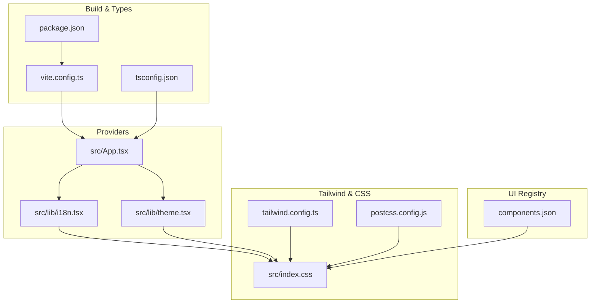
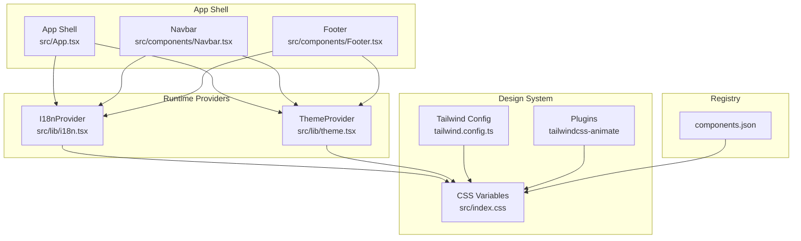
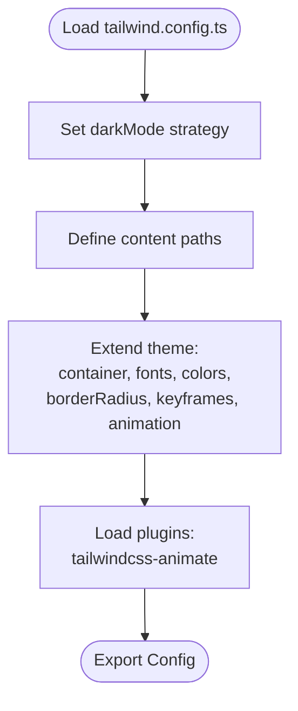
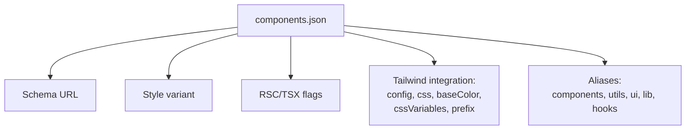
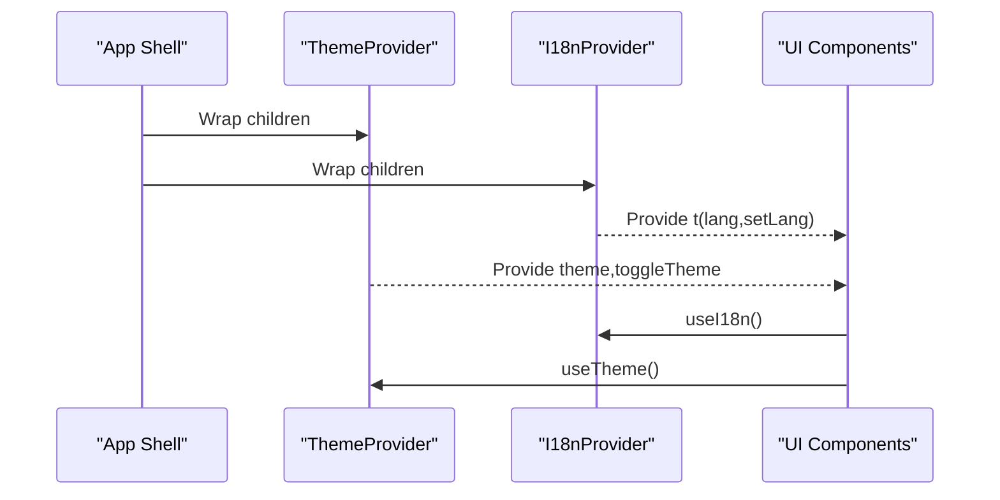
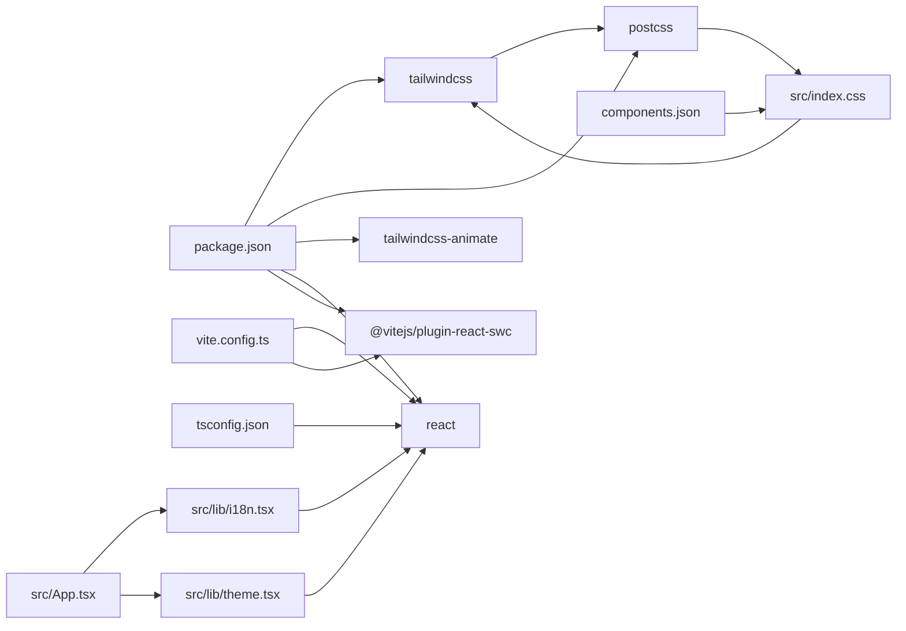

# Configuration Interfaces API

<cite>
**Referenced Files in This Document**
- [components.json](file://components.json)
- [tailwind.config.ts](file://tailwind.config.ts)
- [postcss.config.js](file://postcss.config.js)
- [src/index.css](file://src/index.css)
- [src/lib/i18n.tsx](file://src/lib/i18n.tsx)
- [src/lib/theme.tsx](file://src/lib/theme.tsx)
- [src/App.tsx](file://src/App.tsx)
- [src/components/Navbar.tsx](file://src/components/Navbar.tsx)
- [src/components/Footer.tsx](file://src/components/Footer.tsx)
- [vite.config.ts](file://vite.config.ts)
- [tsconfig.json](file://tsconfig.json)
- [package.json](file://package.json)
</cite>

## Table of Contents
1. [Introduction](#introduction)
2. [Project Structure](#project-structure)
3. [Core Components](#core-components)
4. [Architecture Overview](#architecture-overview)
5. [Detailed Component Analysis](#detailed-component-analysis)
6. [Dependency Analysis](#dependency-analysis)
7. [Performance Considerations](#performance-considerations)
8. [Troubleshooting Guide](#troubleshooting-guide)
9. [Conclusion](#conclusion)
10. [Appendices](#appendices)

## Introduction
This document provides comprehensive API documentation for configuration interfaces and type definitions across three core areas:
- Internationalization (i18n): translation key structures, locale definitions, and language switching configuration
- Theme configuration: color schemes, CSS variables, and provider setup
- Tailwind CSS configuration: custom breakpoints, color palettes, and plugin configurations
It also covers the shadcn/ui components.json configuration for component registry and aliases, along with type definitions for internationalization keys, theme variants, and component customization options. Finally, it outlines configuration validation rules and migration guidelines for version updates.

## Project Structure
The configuration system spans several files:
- Tailwind CSS and PostCSS configuration define design tokens and build pipeline
- CSS layers declare theme-aware CSS variables and utilities
- i18n and theme providers expose typed contexts and hooks
- shadcn/ui components.json defines component registry and aliases
- Vite and TypeScript configs support module resolution and build-time behavior



**Diagram sources**
- [tailwind.config.ts](file://tailwind.config.ts#L1-L86)
- [postcss.config.js](file://postcss.config.js#L1-L7)
- [src/index.css](file://src/index.css#L1-L146)
- [src/lib/i18n.tsx](file://src/lib/i18n.tsx#L1-L173)
- [src/lib/theme.tsx](file://src/lib/theme.tsx#L1-L36)
- [src/App.tsx](file://src/App.tsx#L1-L45)
- [components.json](file://components.json#L1-L21)
- [vite.config.ts](file://vite.config.ts#L1-L22)
- [tsconfig.json](file://tsconfig.json#L1-L17)
- [package.json](file://package.json#L1-L90)

**Section sources**
- [tailwind.config.ts](file://tailwind.config.ts#L1-L86)
- [postcss.config.js](file://postcss.config.js#L1-L7)
- [src/index.css](file://src/index.css#L1-L146)
- [src/lib/i18n.tsx](file://src/lib/i18n.tsx#L1-L173)
- [src/lib/theme.tsx](file://src/lib/theme.tsx#L1-L36)
- [src/App.tsx](file://src/App.tsx#L1-L45)
- [components.json](file://components.json#L1-L21)
- [vite.config.ts](file://vite.config.ts#L1-L22)
- [tsconfig.json](file://tsconfig.json#L1-L17)
- [package.json](file://package.json#L1-L90)

## Core Components
This section documents the configuration interfaces and type definitions used across the application.

- i18n configuration interface
  - Locale type: a union of supported locales
  - Translation key structure: dot-delimited hierarchical keys grouped by feature (e.g., nav, hero, booking)
  - Provider and hook APIs: context exposes current language, setter, and translation function
  - Language switching: persists selection in local storage and updates context

- Theme configuration interface
  - Theme type: light or dark
  - Provider and hook APIs: context exposes current theme, toggler, and applies class to document root
  - Persistence: saves theme preference in local storage and respects system preference

- Tailwind CSS configuration interface
  - Config export: dark mode strategy, content paths, prefix, theme extension, plugins
  - Color palette: semantic tokens mapped to CSS variables
  - Utilities: custom animations and layer utilities

- shadcn/ui components.json configuration interface
  - Style variant: default
  - RSC/TSX flags
  - Tailwind integration: config path, CSS file, base color, CSS variables flag, optional prefix
  - Aliases: component registry paths for components, utils, ui, lib, hooks

- Type definitions
  - Lang: locale union
  - Theme: light/dark union
  - I18nContextType and ThemeContextType: provider contract types

**Section sources**
- [src/lib/i18n.tsx](file://src/lib/i18n.tsx#L3-L173)
- [src/lib/theme.tsx](file://src/lib/theme.tsx#L3-L36)
- [tailwind.config.ts](file://tailwind.config.ts#L3-L86)
- [src/index.css](file://src/index.css#L6-L76)
- [components.json](file://components.json#L1-L21)

## Architecture Overview
The configuration architecture integrates Tailwind CSS, CSS variables, and React providers to deliver a cohesive theming and localization experience.



**Diagram sources**
- [src/lib/i18n.tsx](file://src/lib/i18n.tsx#L148-L173)
- [src/lib/theme.tsx](file://src/lib/theme.tsx#L12-L36)
- [src/index.css](file://src/index.css#L1-L146)
- [tailwind.config.ts](file://tailwind.config.ts#L3-L86)
- [components.json](file://components.json#L1-L21)
- [src/App.tsx](file://src/App.tsx#L19-L42)
- [src/components/Navbar.tsx](file://src/components/Navbar.tsx#L14-L15)
- [src/components/Footer.tsx](file://src/components/Footer.tsx#L14-L15)

## Detailed Component Analysis

### i18n Configuration API
The i18n system provides:
- Locale union type
- Hierarchical translation keys
- Provider with persistence and context
- Hook for consuming translations

```mermaid
classDiagram
class I18nContextType {
+Lang lang
+setLang(Lang) void
+t(string) string
}
class I18nProvider {
+ReactNode children
+useState(lang)
+useCallback(changeLang)
+useCallback(t)
}
class Lang {
<<union>>
"en"|"ru"|"uz"
}
I18nProvider --> I18nContextType : "provides"
I18nContextType --> Lang : "uses"
```

**Diagram sources**
- [src/lib/i18n.tsx](file://src/lib/i18n.tsx#L3-L173)

Translation key structure:
- Keys are dot-delimited and grouped by feature (e.g., nav.home, hero.title)
- Supported locales: en, ru, uz
- Fallback behavior: returns key if translation is missing

Language switching:
- Persists selected language in local storage
- Updates context and triggers re-render

Usage in UI:
- Navbar demonstrates language switcher and theme-aware branding
- Footer consumes localized strings and theme context

**Section sources**
- [src/lib/i18n.tsx](file://src/lib/i18n.tsx#L3-L173)
- [src/components/Navbar.tsx](file://src/components/Navbar.tsx#L48-L61)
- [src/components/Footer.tsx](file://src/components/Footer.tsx#L14-L15)

### Theme Configuration API
The theme system provides:
- Theme union type
- Provider with persistence and system preference detection
- Hook for toggling and applying theme classes

```mermaid
classDiagram
class ThemeContextType {
+Theme theme
+toggleTheme() void
}
class ThemeProvider {
+ReactNode children
+useState(theme)
+useEffect(syncClass)
+toggleTheme()
}
class Theme {
<<union>>
"light"|"dark"
}
ThemeProvider --> ThemeContextType : "provides"
ThemeContextType --> Theme : "uses"
```

**Diagram sources**
- [src/lib/theme.tsx](file://src/lib/theme.tsx#L3-L36)

Theme application:
- Adds/removes "dark" class on document root
- Persists theme in local storage
- Respects system preference when no saved theme exists

**Section sources**
- [src/lib/theme.tsx](file://src/lib/theme.tsx#L12-L36)
- [src/App.tsx](file://src/App.tsx#L21-L22)

### Tailwind CSS Configuration API
Tailwind configuration defines:
- Dark mode strategy
- Content scanning paths
- Theme extensions: container, fonts, colors, radii, keyframes, animations
- Plugins: tailwindcss-animate



**Diagram sources**
- [tailwind.config.ts](file://tailwind.config.ts#L3-L86)

CSS variable mapping:
- Root and dark mode CSS variables align with Tailwind color tokens
- Semantic variables for backgrounds, foregrounds, accents, borders, and sidebar tokens
- Layer utilities for glass morphism and animations

**Section sources**
- [tailwind.config.ts](file://tailwind.config.ts#L7-L84)
- [src/index.css](file://src/index.css#L6-L76)

### shadcn/ui components.json Configuration API
The components.json file configures:
- Schema URL for validation
- Style variant and RSC/TSX flags
- Tailwind integration: config path, CSS file, base color, CSS variables flag, optional prefix
- Aliases for components, utils, ui, lib, hooks



**Diagram sources**
- [components.json](file://components.json#L1-L21)

**Section sources**
- [components.json](file://components.json#L1-L21)

### Provider Composition and Usage
The App shell composes providers and passes them to UI components.



**Diagram sources**
- [src/App.tsx](file://src/App.tsx#L19-L42)
- [src/lib/i18n.tsx](file://src/lib/i18n.tsx#L148-L173)
- [src/lib/theme.tsx](file://src/lib/theme.tsx#L12-L36)

**Section sources**
- [src/App.tsx](file://src/App.tsx#L19-L42)
- [src/components/Navbar.tsx](file://src/components/Navbar.tsx#L14-L15)
- [src/components/Footer.tsx](file://src/components/Footer.tsx#L14-L15)

## Dependency Analysis
The configuration system relies on:
- Tailwind CSS and PostCSS for styling pipeline
- React context providers for i18n and theme
- shadcn/ui registry for component scaffolding
- Build-time tooling via Vite and TypeScript



**Diagram sources**
- [package.json](file://package.json#L15-L88)
- [vite.config.ts](file://vite.config.ts#L1-L22)
- [tsconfig.json](file://tsconfig.json#L1-L17)
- [src/index.css](file://src/index.css#L1-L3)
- [tailwind.config.ts](file://tailwind.config.ts#L84-L84)
- [postcss.config.js](file://postcss.config.js#L1-L7)
- [components.json](file://components.json#L1-L21)
- [src/lib/i18n.tsx](file://src/lib/i18n.tsx#L1-L1)
- [src/lib/theme.tsx](file://src/lib/theme.tsx#L1-L1)
- [src/App.tsx](file://src/App.tsx#L1-L1)

**Section sources**
- [package.json](file://package.json#L15-L88)
- [vite.config.ts](file://vite.config.ts#L1-L22)
- [tsconfig.json](file://tsconfig.json#L1-L17)
- [src/index.css](file://src/index.css#L1-L3)
- [tailwind.config.ts](file://tailwind.config.ts#L84-L84)
- [postcss.config.js](file://postcss.config.js#L1-L7)
- [components.json](file://components.json#L1-L21)
- [src/lib/i18n.tsx](file://src/lib/i18n.tsx#L1-L1)
- [src/lib/theme.tsx](file://src/lib/theme.tsx#L1-L1)
- [src/App.tsx](file://src/App.tsx#L1-L1)

## Performance Considerations
- CSS variables and Tailwind utilities minimize runtime style recalculation
- Theme and i18n providers use memoized callbacks to reduce re-renders
- Local storage persistence avoids repeated system queries on mount
- Tailwind content scanning targets specific paths to optimize rebuilds

## Troubleshooting Guide
Common configuration issues and resolutions:
- Missing translation fallback
  - Symptom: raw keys displayed instead of localized text
  - Resolution: ensure translation keys exist in the dictionary and locale is set correctly
  - Section sources
    - [src/lib/i18n.tsx](file://src/lib/i18n.tsx#L159-L161)

- Theme not applying on initial load
  - Symptom: theme mismatch until toggle
  - Resolution: verify provider composition order and document class synchronization
  - Section sources
    - [src/lib/theme.tsx](file://src/lib/theme.tsx#L19-L22)

- Tailwind utilities not generated
  - Symptom: custom utilities or colors not applied
  - Resolution: confirm content paths include component files and restart dev server
  - Section sources
    - [tailwind.config.ts](file://tailwind.config.ts#L5-L5)

- shadcn/ui component not resolving aliases
  - Symptom: import errors for aliased paths
  - Resolution: verify tsconfig paths and components.json aliases match project structure
  - Section sources
    - [tsconfig.json](file://tsconfig.json#L6-L8)
    - [components.json](file://components.json#L13-L19)

## Conclusion
The configuration system integrates Tailwind CSS, CSS variables, React providers, and shadcn/ui registry to deliver a scalable theming and localization framework. By adhering to the documented interfaces and validation rules, teams can maintain consistency across locales, themes, and component libraries while ensuring smooth upgrades and migrations.

## Appendices

### Configuration Validation Rules
- i18n
  - All translation keys must be present for each locale
  - Locale union must include only supported values
- Theme
  - Theme union must be limited to light or dark
  - CSS variables must align with Tailwind color tokens
- Tailwind
  - Content paths must include all component and page files
  - Color tokens must map to CSS variables
  - Plugins must be installed and configured
- shadcn/ui
  - Aliases must resolve to existing directories
  - Tailwind integration fields must point to valid files

### Migration Guidelines
- Version updates
  - Review Tailwind and PostCSS changelogs for breaking changes
  - Validate CSS variables after upgrading Tailwind
  - Reinstall plugins and update peer dependencies
- i18n
  - Add new locales to the Lang union and translation dictionary
  - Update language switcher UI and persistence logic
- Theme
  - Align new color tokens with CSS variables
  - Verify dark mode strategy and class application
- shadcn/ui
  - Update aliases and component paths after directory restructuring
  - Validate schema URL and style variant compatibility