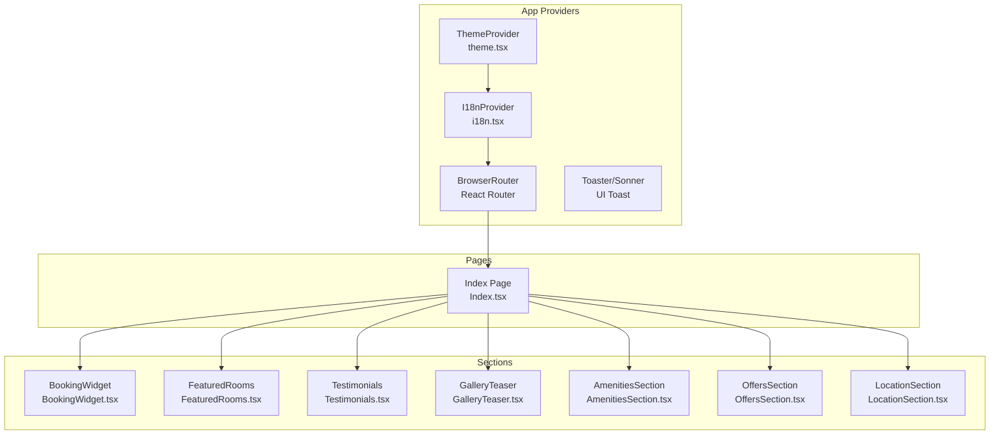
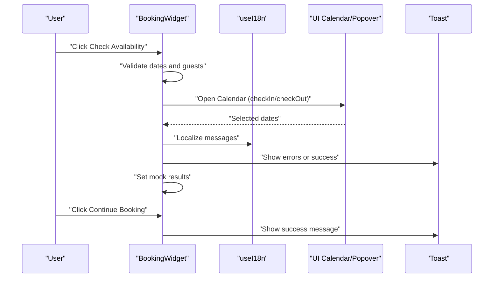
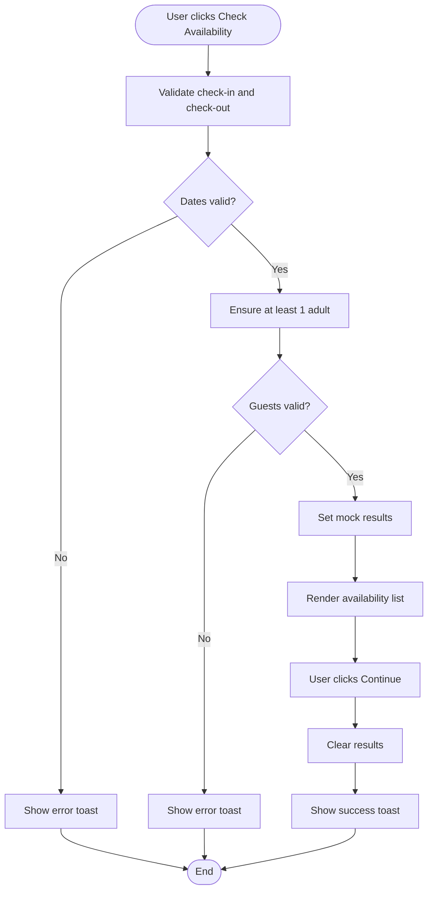
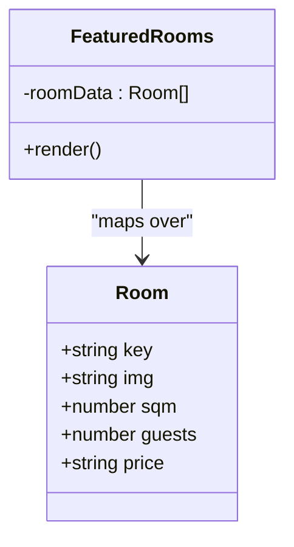
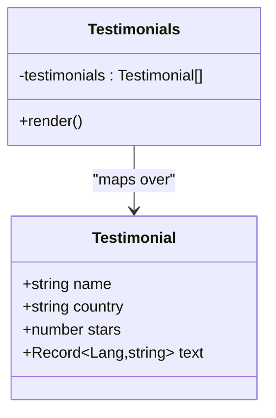
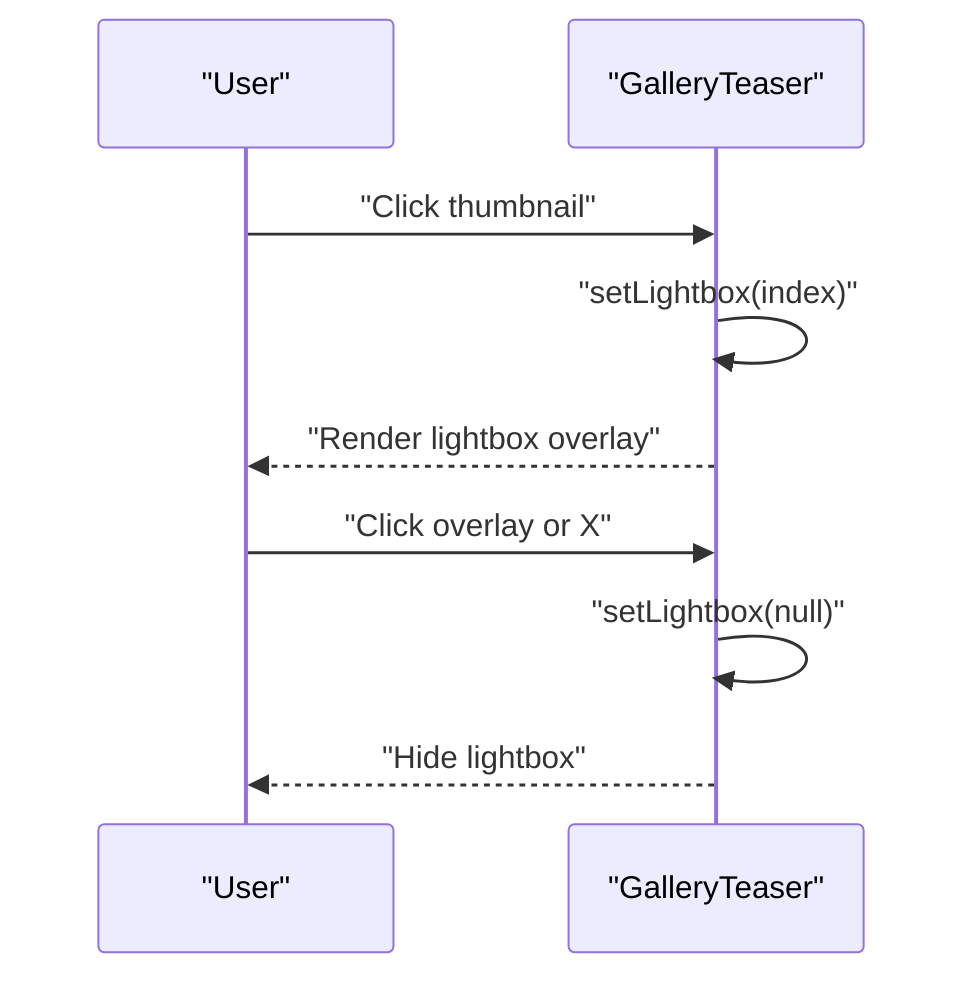
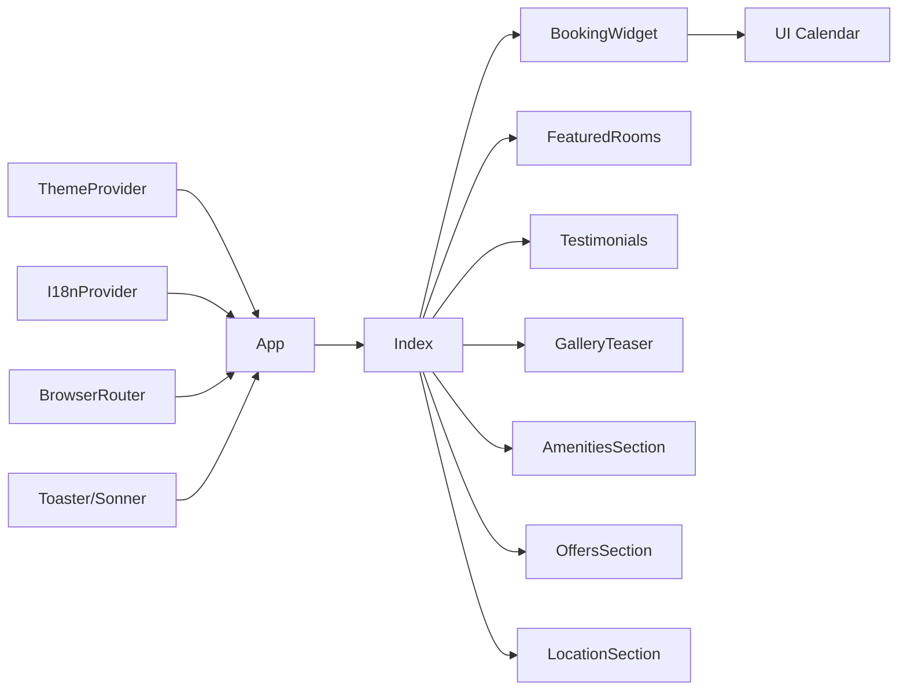

# Custom Components API

<cite>
**Referenced Files in This Document**
- [BookingWidget.tsx](file://src/components/BookingWidget.tsx)
- [FeaturedRooms.tsx](file://src/components/FeaturedRooms.tsx)
- [Testimonials.tsx](file://src/components/Testimonials.tsx)
- [GalleryTeaser.tsx](file://src/components/GalleryTeaser.tsx)
- [AmenitiesSection.tsx](file://src/components/AmenitiesSection.tsx)
- [LocationSection.tsx](file://src/components/LocationSection.tsx)
- [OffersSection.tsx](file://src/components/OffersSection.tsx)
- [i18n.tsx](file://src/lib/i18n.tsx)
- [theme.tsx](file://src/lib/theme.tsx)
- [utils.ts](file://src/lib/utils.ts)
- [calendar.tsx](file://src/components/ui/calendar.tsx)
- [ScrollReveal.tsx](file://src/components/ScrollReveal.tsx)
- [App.tsx](file://src/App.tsx)
- [Index.tsx](file://src/pages/Index.tsx)
- [Navbar.tsx](file://src/components/Navbar.tsx)
</cite>

## Table of Contents
1. [Introduction](#introduction)
2. [Project Structure](#project-structure)
3. [Core Components](#core-components)
4. [Architecture Overview](#architecture-overview)
5. [Detailed Component Analysis](#detailed-component-analysis)
6. [Dependency Analysis](#dependency-analysis)
7. [Performance Considerations](#performance-considerations)
8. [Troubleshooting Guide](#troubleshooting-guide)
9. [Conclusion](#conclusion)

## Introduction
This document provides detailed API documentation for the custom hotel management components used in the project. It focuses on component props interfaces, state management patterns, integration requirements, and data flow. The covered components include:
- BookingWidget: booking availability widget with date selection, guest counts, promo code, and mock availability results
- FeaturedRooms: featured room showcase with static room data and navigation
- Testimonials: guest testimonials with star ratings and localized content
- GalleryTeaser: image gallery with lightbox preview
Additionally, supporting components and libraries are documented to clarify integration patterns and customization options.

## Project Structure
The custom components are located under src/components and integrate with shared libraries under src/lib. The App wraps the application with providers for theming, internationalization, routing, and global UI toast notifications. The Index page composes the main sections of the landing page.

**Diagram sources**
- [App.tsx](file://src/App.tsx#L19-L42)
- [Index.tsx](file://src/pages/Index.tsx#L12-L25)
- [theme.tsx](file://src/lib/theme.tsx#L12-L31)
- [i18n.tsx](file://src/lib/i18n.tsx#L148-L168)

**Section sources**
- [App.tsx](file://src/App.tsx#L19-L42)
- [Index.tsx](file://src/pages/Index.tsx#L12-L25)

## Core Components

### BookingWidget API
- Purpose: Allows users to select check-in/check-out dates, guests, rooms, and apply a promo code, then displays mock available room results.
- Props:
  - className?: string (optional wrapper class)
- Internal state:
  - checkIn: Date | undefined
  - checkOut: Date | undefined
  - adults: number
  - children: number
  - rooms: number
  - promo: string
  - results: AvailableRoom[] | null
- Event handlers:
  - handleSearch(): Validates inputs and sets mock results
  - handleContinue(): Clears results and shows a success toast
- Availability checking logic:
  - Validates check-out is after check-in
  - Ensures at least one adult
  - Sets mock results array with room names and prices
- Integration requirements:
  - Uses useI18n for localized strings
  - Uses Popover and Calendar UI components
  - Uses toast for user feedback
  - Uses cn for class merging

**Section sources**
- [BookingWidget.tsx](file://src/components/BookingWidget.tsx#L15-L39)
- [BookingWidget.tsx](file://src/components/BookingWidget.tsx#L41-L44)
- [calendar.tsx](file://src/components/ui/calendar.tsx#L10-L51)
- [i18n.tsx](file://src/lib/i18n.tsx#L21-L34)
- [utils.ts](file://src/lib/utils.ts#L4-L6)

### FeaturedRooms API
- Purpose: Renders a grid of featured rooms with images, metrics, pricing, and navigation to the rooms page.
- Props: none
- Data structures:
  - roomData: Array of room objects with keys: key, img, sqm, guests, price
- Filtering options:
  - None in component; filtering can be added externally by passing a filtered subset
- Room selection pattern:
  - Clicking a room item navigates to "/rooms"
- Integration requirements:
  - Uses useI18n for localized strings
  - Uses ScrollReveal for staggered animations
  - Uses lucide-react icons for metrics

**Section sources**
- [FeaturedRooms.tsx](file://src/components/FeaturedRooms.tsx#L9-L13)
- [FeaturedRooms.tsx](file://src/components/FeaturedRooms.tsx#L29-L58)
- [i18n.tsx](file://src/lib/i18n.tsx#L42-L58)

### Testimonials API
- Purpose: Displays guest testimonials with star ratings and localized content.
- Props: none
- Data structures:
  - testimonials: Array of objects with name, country, stars, and text dictionary keyed by language
- Review display:
  - Renders star icons based on item.stars
  - Displays localized text using current language
- Rating system:
  - Numeric star count per testimonial
- Testimonial submission forms:
  - Not present in component; can be integrated via a form component and state updates
- Integration requirements:
  - Uses useI18n for localized strings
  - Uses ScrollReveal for staggered animations

**Section sources**
- [Testimonials.tsx](file://src/components/Testimonials.tsx#L5-L9)
- [Testimonials.tsx](file://src/components/Testimonials.tsx#L25-L46)
- [i18n.tsx](file://src/lib/i18n.tsx#L90-L93)

### GalleryTeaser API
- Purpose: Presents a responsive gallery grid with lightbox preview.
- Props: none
- Image handling:
  - images: Array of image assets
- Filtering capabilities:
  - None in component; filtering can be implemented by passing a filtered images array
- Lightbox integration:
  - Opens on click with overlay and close button
  - Displays current image with max height/width constraints
- Integration requirements:
  - Uses useI18n for localized strings
  - Uses ScrollReveal for staggered animations

**Section sources**
- [GalleryTeaser.tsx](file://src/components/GalleryTeaser.tsx#L12-L12)
- [GalleryTeaser.tsx](file://src/components/GalleryTeaser.tsx#L29-L52)

### Supporting Components and Libraries

#### ScrollReveal
- Purpose: Provides intersection-based reveal animations with configurable delay
- Props:
  - children: ReactNode
  - className?: string
  - delay?: number (default 0)
- Behavior: Observes element intersection and toggles visibility classes

**Section sources**
- [ScrollReveal.tsx](file://src/components/ScrollReveal.tsx#L10-L35)

#### Theme Provider
- Purpose: Manages theme state and persists preference
- Exposed hooks:
  - useTheme(): theme, toggleTheme()

**Section sources**
- [theme.tsx](file://src/lib/theme.tsx#L12-L31)

#### Internationalization (i18n)
- Purpose: Centralized translation keys and language switching
- Exposed hooks:
  - useI18n(): lang, setLang, t(key)
- Supported languages: en, ru, uz
- Keys used by components:
  - booking.*, rooms.*, testimonials.*, gallery.*, offers.*, location.*, nav.*

**Section sources**
- [i18n.tsx](file://src/lib/i18n.tsx#L148-L173)
- [i18n.tsx](file://src/lib/i18n.tsx#L5-L134)

#### Calendar UI
- Purpose: Styled date picker used by BookingWidget
- Props: Inherits from react-day-picker; supports single mode selection

**Section sources**
- [calendar.tsx](file://src/components/ui/calendar.tsx#L10-L51)

## Architecture Overview
The components rely on shared providers for theming and internationalization. The BookingWidget integrates with UI primitives for date selection and popover interactions. The Index page composes all sections, while the Navbar demonstrates language switching and theme toggling.

**Diagram sources**
- [BookingWidget.tsx](file://src/components/BookingWidget.tsx#L25-L39)
- [calendar.tsx](file://src/components/ui/calendar.tsx#L10-L51)
- [i18n.tsx](file://src/lib/i18n.tsx#L159-L161)

## Detailed Component Analysis

### BookingWidget State and Flow
- State management:
  - Local useState for dates, guests, rooms, promo, and results
- Validation:
  - Check-out after check-in
  - At least one adult
- Mock availability:
  - Sets predefined room options upon successful validation
- Events:
  - handleSearch and handleContinue manage lifecycle transitions

**Diagram sources**
- [BookingWidget.tsx](file://src/components/BookingWidget.tsx#L25-L44)

**Section sources**
- [BookingWidget.tsx](file://src/components/BookingWidget.tsx#L15-L44)

### FeaturedRooms Composition and Customization
- Composition pattern:
  - Static roomData array drives rendering
  - ScrollReveal applied per item with incremental delay
- Customization options:
  - Replace roomData with dynamic data
  - Add filters for type, price, guests
  - Modify layout grid classes

**Diagram sources**
- [FeaturedRooms.tsx](file://src/components/FeaturedRooms.tsx#L9-L13)

**Section sources**
- [FeaturedRooms.tsx](file://src/components/FeaturedRooms.tsx#L15-L62)

### Testimonials Data Model and Rendering
- Data model:
  - Array of testimonials with localized text dictionary
- Rendering:
  - Star icons rendered based on item.stars
  - Text selected by current language

**Diagram sources**
- [Testimonials.tsx](file://src/components/Testimonials.tsx#L5-L9)
- [i18n.tsx](file://src/lib/i18n.tsx#L3-L3)

**Section sources**
- [Testimonials.tsx](file://src/components/Testimonials.tsx#L11-L50)

### GalleryTeaser Lightbox Interaction
- State:
  - lightbox: index or null
- Interaction:
  - Click thumbnail opens lightbox
  - Overlay click closes lightbox
- Customization:
  - Filter images array to show subsets
  - Add keyboard navigation or swipe gestures

**Diagram sources**
- [GalleryTeaser.tsx](file://src/components/GalleryTeaser.tsx#L16-L52)

**Section sources**
- [GalleryTeaser.tsx](file://src/components/GalleryTeaser.tsx#L14-L55)

### Additional Sections (Integration Patterns)
- AmenitiesSection, OffersSection, LocationSection follow similar patterns:
  - useI18n for translations
  - ScrollReveal for staggered animations
  - Grid layouts with responsive breakpoints

**Section sources**
- [AmenitiesSection.tsx](file://src/components/AmenitiesSection.tsx#L5-L43)
- [OffersSection.tsx](file://src/components/OffersSection.tsx#L6-L48)
- [LocationSection.tsx](file://src/components/LocationSection.tsx#L5-L83)

## Dependency Analysis
- Provider stack:
  - ThemeProvider manages theme persistence and DOM classes
  - I18nProvider manages language and translations
  - Router enables navigation
  - Toast providers enable global notifications
- Component dependencies:
  - BookingWidget depends on Calendar UI and Popover
  - All components depend on useI18n for translations
  - ScrollReveal is used across multiple sections for animations

**Diagram sources**
- [App.tsx](file://src/App.tsx#L19-L42)
- [theme.tsx](file://src/lib/theme.tsx#L12-L31)
- [i18n.tsx](file://src/lib/i18n.tsx#L148-L168)
- [calendar.tsx](file://src/components/ui/calendar.tsx#L10-L51)

**Section sources**
- [App.tsx](file://src/App.tsx#L19-L42)
- [theme.tsx](file://src/lib/theme.tsx#L12-L31)
- [i18n.tsx](file://src/lib/i18n.tsx#L148-L168)

## Performance Considerations
- Memoization:
  - Consider memoizing translations and computed values if rendering frequently
- Animations:
  - ScrollReveal uses IntersectionObserver; ensure minimal reflows by avoiding layout thrashing
- Images:
  - Lazy-load gallery images and use appropriate sizes for thumbnails and lightbox
- State updates:
  - Keep BookingWidget state local; avoid unnecessary re-renders by using controlled inputs

## Troubleshooting Guide
- BookingWidget validation errors:
  - Ensure check-out is after check-in and adults >= 1
  - Verify toast integration is present in the app shell
- Translation keys missing:
  - Confirm keys exist in i18n translations and language is persisted
- Theme not applying:
  - Check ThemeProvider wrapping and localStorage persistence
- Gallery lightbox not closing:
  - Ensure overlay click handler sets lightbox to null

**Section sources**
- [BookingWidget.tsx](file://src/components/BookingWidget.tsx#L25-L33)
- [i18n.tsx](file://src/lib/i18n.tsx#L149-L157)
- [theme.tsx](file://src/lib/theme.tsx#L13-L22)
- [GalleryTeaser.tsx](file://src/components/GalleryTeaser.tsx#L46-L52)

## Conclusion
The custom components are designed with clear separation of concerns, leveraging shared providers for theming and internationalization. BookingWidget encapsulates booking logic with mock results, FeaturedRooms showcases room data, Testimonials renders localized reviews, and GalleryTeaser provides a lightbox experience. The architecture supports easy customization, such as adding filters, integrating real availability APIs, and extending testimonial submission flows.