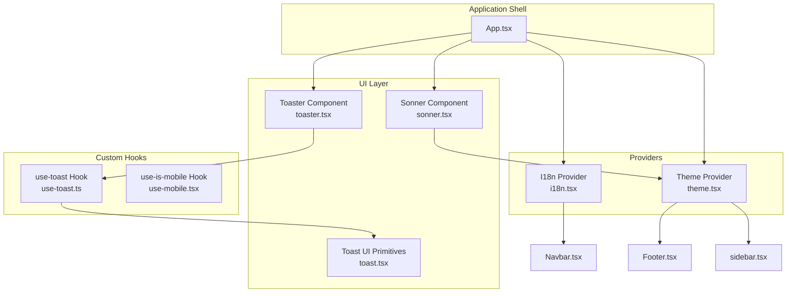
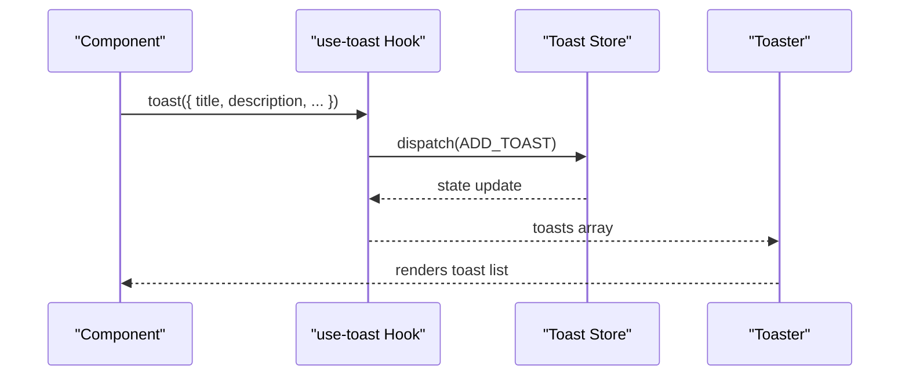
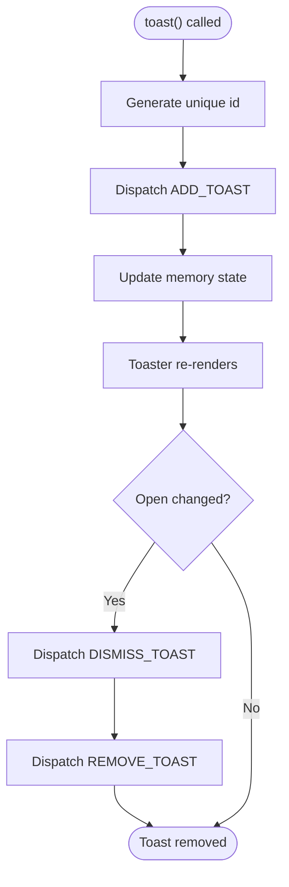
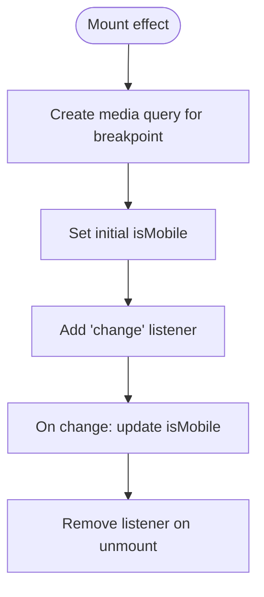
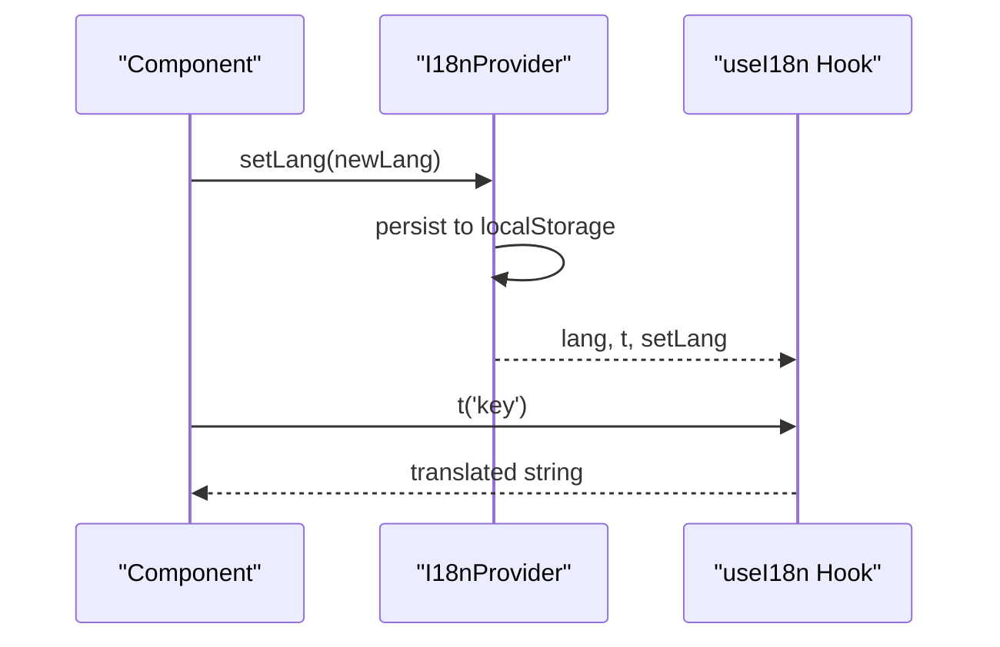
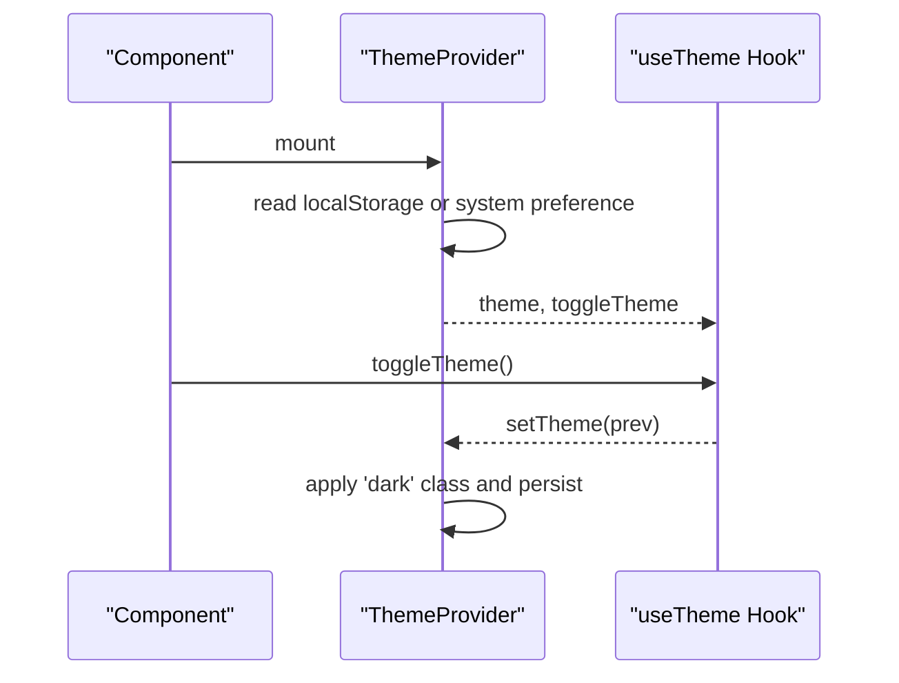
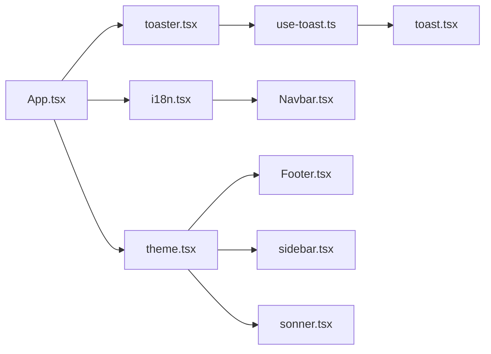

# Hooks API

<cite>
**Referenced Files in This Document**
- [use-toast.ts](file://src/hooks/use-toast.ts)
- [use-mobile.tsx](file://src/hooks/use-mobile.tsx)
- [i18n.tsx](file://src/lib/i18n.tsx)
- [theme.tsx](file://src/lib/theme.tsx)
- [toast.tsx](file://src/components/ui/toast.tsx)
- [toaster.tsx](file://src/components/ui/toaster.tsx)
- [use-toast-export.ts](file://src/components/ui/use-toast.ts)
- [App.tsx](file://src/App.tsx)
- [Navbar.tsx](file://src/components/Navbar.tsx)
- [Footer.tsx](file://src/components/Footer.tsx)
- [sonner.tsx](file://src/components/ui/sonner.tsx)
- [sidebar.tsx](file://src/components/ui/sidebar.tsx)
</cite>

## Table of Contents
1. [Introduction](#introduction)
2. [Project Structure](#project-structure)
3. [Core Components](#core-components)
4. [Architecture Overview](#architecture-overview)
5. [Detailed Component Analysis](#detailed-component-analysis)
6. [Dependency Analysis](#dependency-analysis)
7. [Performance Considerations](#performance-considerations)
8. [Troubleshooting Guide](#troubleshooting-guide)
9. [Conclusion](#conclusion)
10. [Appendices](#appendices)

## Introduction
This document provides comprehensive API documentation for the custom hooks and utility functions used in the project. It focuses on:
- Notification management via the use-toast hook and related UI components
- Responsive breakpoint detection via the use-is-mobile hook
- Internationalization (i18n) via the use-i18n hook and provider
- Theme management via the use-theme hook and provider
It also covers composition patterns, dependency management, and integration with React Query and other state management systems, along with usage examples and best practices.

## Project Structure
The hooks and providers are organized under dedicated folders and integrated into the application shell and UI components.

**Diagram sources**
- [App.tsx](file://src/App.tsx#L1-L45)
- [theme.tsx](file://src/lib/theme.tsx#L1-L36)
- [i18n.tsx](file://src/lib/i18n.tsx#L1-L173)
- [toaster.tsx](file://src/components/ui/toaster.tsx#L1-L25)
- [sonner.tsx](file://src/components/ui/sonner.tsx#L1-L20)
- [toast.tsx](file://src/components/ui/toast.tsx#L1-L112)
- [use-toast.ts](file://src/hooks/use-toast.ts#L1-L187)
- [use-mobile.tsx](file://src/hooks/use-mobile.tsx#L1-L20)
- [Navbar.tsx](file://src/components/Navbar.tsx#L1-L40)
- [Footer.tsx](file://src/components/Footer.tsx#L1-L40)
- [sidebar.tsx](file://src/components/ui/sidebar.tsx#L1-L120)

**Section sources**
- [App.tsx](file://src/App.tsx#L1-L45)
- [use-toast.ts](file://src/hooks/use-toast.ts#L1-L187)
- [use-mobile.tsx](file://src/hooks/use-mobile.tsx#L1-L20)
- [i18n.tsx](file://src/lib/i18n.tsx#L1-L173)
- [theme.tsx](file://src/lib/theme.tsx#L1-L36)
- [toast.tsx](file://src/components/ui/toast.tsx#L1-L112)
- [toaster.tsx](file://src/components/ui/toaster.tsx#L1-L25)
- [use-toast-export.ts](file://src/components/ui/use-toast.ts#L1-L4)

## Core Components
This section documents the APIs of the custom hooks and providers, including return values, configuration options, and usage patterns.

### use-toast Hook
Purpose: Centralized toast notification management with a simple imperative API and a React hook for state consumption.

- Imperative API
  - toast(options): Creates and displays a toast. Returns an object with:
    - id: Unique identifier for the toast
    - dismiss(): Dismisses the toast
    - update(updates): Updates the toast content and metadata
- Hook API
  - useToast(): Returns:
    - toasts: Array of current toast items
    - toast: Imperative function to create a toast
    - dismiss(toastId?): Dismisses a specific toast or all toasts
- Configuration options (toast options)
  - title: Optional title node
  - description: Optional description node
  - action: Optional action element
  - Other Radix Toast props (variant, etc.) as supported by the UI primitives
- Behavior highlights
  - Limits concurrent toasts to one
  - Auto-dismiss after a long delay with manual dismissal support
  - Maintains a global listener state and dispatches actions to update consumers

Integration points
- UI component: Toaster renders the toast list and attaches the viewport
- UI primitives: toast.tsx defines the underlying Toast components and variants

Best practices
- Prefer the imperative toast(options) for quick notifications
- Use update() to mutate existing toasts (e.g., replace description)
- Use dismiss() to programmatically close toasts
- Keep toast messages concise and actionable

**Section sources**
- [use-toast.ts](file://src/hooks/use-toast.ts#L1-L187)
- [toaster.tsx](file://src/components/ui/toaster.tsx#L1-L25)
- [toast.tsx](file://src/components/ui/toast.tsx#L1-L112)

### use-is-mobile Hook
Purpose: Detects whether the current device width is below the mobile breakpoint and updates reactively.

- Function signature
  - useIsMobile(): boolean
- Breakpoint
  - Mobile breakpoint is defined as 768 pixels
- Behavior
  - Initializes state based on current window width
  - Subscribes to media query change events for dynamic updates
  - Cleans up event listeners on unmount

Usage patterns
- Conditional rendering for mobile layouts
- Adjusting component behavior (e.g., sidebar visibility) based on mobile state

**Section sources**
- [use-mobile.tsx](file://src/hooks/use-mobile.tsx#L1-L20)

### use-i18n Hook
Purpose: Provides internationalization utilities and language switching with persistence.

- Provider: I18nProvider
  - Persists selected language to local storage
  - Initializes language from local storage or defaults to English
- Hook: useI18n()
  - Returns:
    - lang: Current language
    - setLang(lang): Switch language and persist
    - t(key): Translate a key to the current language
- Supported languages
  - English, Russian, Uzbek

Best practices
- Use t() for all user-facing strings
- Use setLang() to persist user language preference
- Keep translation keys consistent across components

**Section sources**
- [i18n.tsx](file://src/lib/i18n.tsx#L1-L173)

### use-theme Hook
Purpose: Manages theme switching with persistence and system preference fallback.

- Provider: ThemeProvider
  - Persists theme to local storage
  - Initializes from local storage or system preference (dark vs light)
  - Applies a class to document element for styling
- Hook: useTheme()
  - Returns:
    - theme: Current theme
    - toggleTheme(): Switch between light and dark themes

Best practices
- Call toggleTheme() from UI controls (e.g., Navbar, Footer)
- Keep theme-related styles scoped to the theme class
- Respect system preference while allowing user override

**Section sources**
- [theme.tsx](file://src/lib/theme.tsx#L1-L36)

## Architecture Overview
The hooks integrate with providers and UI components to deliver cohesive UX features.

**Diagram sources**
- [use-toast.ts](file://src/hooks/use-toast.ts#L137-L164)
- [toaster.tsx](file://src/components/ui/toaster.tsx#L4-L24)

## Detailed Component Analysis

### Notification Management (use-toast)
- State model
  - Single-toast limit enforced by slicing the list
  - Global action dispatcher updates subscribers
- Composition pattern
  - Imperative toast() creates a toast and returns helpers
  - useToast() exposes state and imperative functions
- UI integration
  - Toaster maps over toasts and renders UI primitives
  - On open-change, toasts dismiss automatically

**Diagram sources**
- [use-toast.ts](file://src/hooks/use-toast.ts#L137-L164)
- [use-toast.ts](file://src/hooks/use-toast.ts#L71-L122)
- [toaster.tsx](file://src/components/ui/toaster.tsx#L9-L20)

**Section sources**
- [use-toast.ts](file://src/hooks/use-toast.ts#L1-L187)
- [toaster.tsx](file://src/components/ui/toaster.tsx#L1-L25)
- [toast.tsx](file://src/components/ui/toast.tsx#L1-L112)

### Responsive Detection (use-is-mobile)
- Media query listener updates state on change
- Initial state derived from window width

**Diagram sources**
- [use-mobile.tsx](file://src/hooks/use-mobile.tsx#L8-L16)

**Section sources**
- [use-mobile.tsx](file://src/hooks/use-mobile.tsx#L1-L20)

### Internationalization (use-i18n)
- Provider manages language state and persistence
- Translation lookup with fallback to key if missing
- Hook exposes translation and setter

**Diagram sources**
- [i18n.tsx](file://src/lib/i18n.tsx#L148-L168)
- [i18n.tsx](file://src/lib/i18n.tsx#L170-L172)

**Section sources**
- [i18n.tsx](file://src/lib/i18n.tsx#L1-L173)

### Theme Management (use-theme)
- Provider initializes from persisted or system preference
- Applies a class to document element for styling
- Toggle switches between themes

**Diagram sources**
- [theme.tsx](file://src/lib/theme.tsx#L12-L31)
- [theme.tsx](file://src/lib/theme.tsx#L33-L35)

**Section sources**
- [theme.tsx](file://src/lib/theme.tsx#L1-L36)

## Dependency Analysis
The hooks depend on UI primitives and providers, and are consumed by components and pages.

**Diagram sources**
- [use-toast.ts](file://src/hooks/use-toast.ts#L1-L187)
- [toast.tsx](file://src/components/ui/toast.tsx#L1-L112)
- [toaster.tsx](file://src/components/ui/toaster.tsx#L1-L25)
- [i18n.tsx](file://src/lib/i18n.tsx#L1-L173)
- [theme.tsx](file://src/lib/theme.tsx#L1-L36)
- [App.tsx](file://src/App.tsx#L1-L45)
- [Navbar.tsx](file://src/components/Navbar.tsx#L1-L40)
- [Footer.tsx](file://src/components/Footer.tsx#L1-L40)
- [sidebar.tsx](file://src/components/ui/sidebar.tsx#L1-L120)
- [sonner.tsx](file://src/components/ui/sonner.tsx#L1-L20)

**Section sources**
- [App.tsx](file://src/App.tsx#L1-L45)
- [use-toast.ts](file://src/hooks/use-toast.ts#L1-L187)
- [i18n.tsx](file://src/lib/i18n.tsx#L1-L173)
- [theme.tsx](file://src/lib/theme.tsx#L1-L36)

## Performance Considerations
- use-toast
  - Single-toast limit reduces DOM overhead
  - Minimal re-renders via centralized state and listeners
  - Consider batching updates if generating many toasts rapidly
- use-is-mobile
  - Uses a single media query listener; cleanup prevents leaks
  - Debounce or throttle frequent resize events if needed
- i18n
  - Translation lookup is O(1); avoid excessive recomputation by memoizing keys
- theme
  - Class toggling is lightweight; avoid unnecessary re-renders by keeping theme logic minimal

## Troubleshooting Guide
- Toast does not appear
  - Ensure Toaster is rendered within the app shell
  - Verify toast() is called with valid props
- Toast not dismissing
  - Confirm onOpenChange is wired to dismiss
  - Use dismiss(id) or dismiss() to programmatically close
- Language not persisting
  - Check localStorage availability and permissions
  - Ensure setLang() is invoked and provider is mounted
- Theme not applying
  - Verify ThemeProvider wraps the app
  - Confirm the 'dark' class is applied to document element
  - Check for conflicting CSS overrides

**Section sources**
- [toaster.tsx](file://src/components/ui/toaster.tsx#L1-L25)
- [use-toast.ts](file://src/hooks/use-toast.ts#L137-L164)
- [i18n.tsx](file://src/lib/i18n.tsx#L148-L168)
- [theme.tsx](file://src/lib/theme.tsx#L19-L22)

## Conclusion
These hooks provide a cohesive foundation for notifications, responsiveness, internationalization, and theming. By composing them with providers and UI components, the application delivers a consistent and maintainable user experience. Follow the best practices and usage patterns outlined above to ensure predictable behavior and optimal performance.

## Appendices

### Usage Examples and Best Practices

- Notifications
  - Imperative creation: call toast({ title, description, action })
  - Update existing: const { update } = toast(...); update({ description })
  - Dismiss: const { dismiss } = toast(...); dismiss()
  - Hook consumption: const { toasts, toast, dismiss } = useToast()

- Responsive layout
  - const isMobile = useIsMobile()
  - Conditionally render mobile-only components or adjust layout

- Internationalization
  - const { t, setLang, lang } = useI18n()
  - Use t('key') for all translatable strings
  - Persist language choice with setLang(newLang)

- Theming
  - const { theme, toggleTheme } = useTheme()
  - Apply theme-aware styling and expose a toggle control

- Integration with React Query
  - Providers are mounted outside the QueryClientProvider boundary
  - No direct dependency between use-toast and React Query; use them independently

- UI component integration
  - Toaster renders the toast list and viewport
  - Sonner integrates with theme for toast appearance
  - Sidebar uses useIsMobile for responsive behavior

**Section sources**
- [use-toast.ts](file://src/hooks/use-toast.ts#L166-L184)
- [use-mobile.tsx](file://src/hooks/use-mobile.tsx#L5-L19)
- [i18n.tsx](file://src/lib/i18n.tsx#L170-L172)
- [theme.tsx](file://src/lib/theme.tsx#L33-L35)
- [toaster.tsx](file://src/components/ui/toaster.tsx#L4-L24)
- [sonner.tsx](file://src/components/ui/sonner.tsx#L1-L20)
- [sidebar.tsx](file://src/components/ui/sidebar.tsx#L1-L120)
- [App.tsx](file://src/App.tsx#L1-L45)