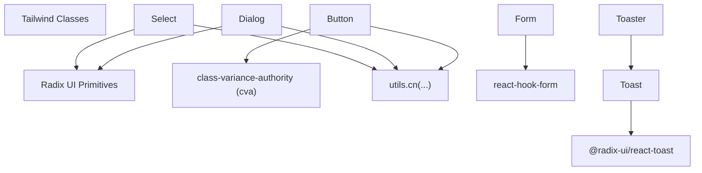
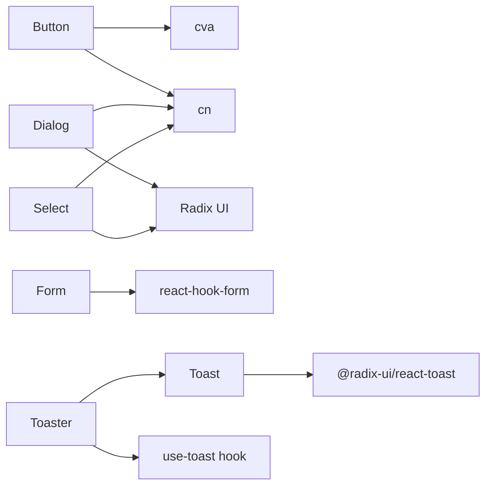

# UI Components API

<cite>
**Referenced Files in This Document**
- [button.tsx](file://src/components/ui/button.tsx)
- [input.tsx](file://src/components/ui/input.tsx)
- [card.tsx](file://src/components/ui/card.tsx)
- [dialog.tsx](file://src/components/ui/dialog.tsx)
- [form.tsx](file://src/components/ui/form.tsx)
- [select.tsx](file://src/components/ui/select.tsx)
- [tabs.tsx](file://src/components/ui/tabs.tsx)
- [table.tsx](file://src/components/ui/table.tsx)
- [badge.tsx](file://src/components/ui/badge.tsx)
- [avatar.tsx](file://src/components/ui/avatar.tsx)
- [checkbox.tsx](file://src/components/ui/checkbox.tsx)
- [switch.tsx](file://src/components/ui/switch.tsx)
- [slider.tsx](file://src/components/ui/slider.tsx)
- [toast.tsx](file://src/components/ui/toast.tsx)
- [toaster.tsx](file://src/components/ui/toaster.tsx)
- [use-toast.ts](file://src/hooks/use-toast.ts)
- [use-toast.ts](file://src/components/ui/use-toast.ts)
- [utils.ts](file://src/lib/utils.ts)
</cite>

## Table of Contents
1. [Introduction](#introduction)
2. [Project Structure](#project-structure)
3. [Core Components](#core-components)
4. [Architecture Overview](#architecture-overview)
5. [Detailed Component Analysis](#detailed-component-analysis)
6. [Dependency Analysis](#dependency-analysis)
7. [Performance Considerations](#performance-considerations)
8. [Troubleshooting Guide](#troubleshooting-guide)
9. [Conclusion](#conclusion)
10. [Appendices](#appendices)

## Introduction
This document provides comprehensive API documentation for the UI component library used in the project. It covers each component’s TypeScript interfaces, default values, event handlers, styling options, variant systems, accessibility attributes, keyboard navigation support, screen reader compatibility, and integration patterns with form libraries and state management. It also outlines component composition patterns, customization options, and extension mechanisms.

## Project Structure
The UI components are located under src/components/ui and are built with React and Radix UI primitives. Utility functions for class merging and Tailwind-based styling are centralized in src/lib/utils.ts. Hooks for toast notifications live under src/hooks and src/components/ui.

```mermaid
graph TB
subgraph "UI Components"
BTN["Button"]
INP["Input"]
CARD["Card<br/>CardHeader/CardTitle/CardDescription/CardContent/CardFooter"]
DLG["Dialog<br/>DialogPortal/Overlay/Content/Trigger/Close<br/>DialogHeader/Footer/Title/Description"]
F["Form<br/>Form/FormProvider/FormField<br/>FormItem/FormLabel/FormControl/FormDescription/FormMessage<br/>useFormField"]
SEL["Select<br/>Root/Group/Value/Trigger/Content/Label/Item/Separator<br/>ScrollUpButton/ScrollDownButton"]
TABS["Tabs<br/>Root/List/Trigger/Content"]
TBL["Table<br/>Table/TableHeader/TableBody/TableFooter/TableRow/TableHead/TableCell/TableCaption"]
BADGE["Badge"]
AV["Avatar<br/>Avatar/AvatarImage/AvatarFallback"]
CB["Checkbox"]
SW["Switch"]
SL["Slider"]
TS["Toast<br/>ToastProvider/ToastViewport/Toast/ToastTitle/ToastDescription/ToastClose/ToastAction"]
TSTR["Toaster"]
end
subgraph "Utilities"
U["utils.ts<br/>cn(...)"]
HT["hooks/use-toast.ts<br/>useToast()"]
HU["components/ui/use-toast.ts<br/>useToast()"]
end
BTN --> U
INP --> U
CARD --> U
DLG --> U
F --> U
SEL --> U
TABS --> U
TBL --> U
BADGE --> U
AV --> U
CB --> U
SW --> U
SL --> U
TS --> U
TSTR --> HT
TSTR --> HU
```

**Diagram sources**
- [button.tsx](file://src/components/ui/button.tsx#L1-L48)
- [input.tsx](file://src/components/ui/input.tsx#L1-L23)
- [card.tsx](file://src/components/ui/card.tsx#L1-L44)
- [dialog.tsx](file://src/components/ui/dialog.tsx#L1-L96)
- [form.tsx](file://src/components/ui/form.tsx#L1-L130)
- [select.tsx](file://src/components/ui/select.tsx#L1-L144)
- [tabs.tsx](file://src/components/ui/tabs.tsx#L1-L54)
- [table.tsx](file://src/components/ui/table.tsx#L1-L73)
- [badge.tsx](file://src/components/ui/badge.tsx#L1-L30)
- [avatar.tsx](file://src/components/ui/avatar.tsx#L1-L39)
- [checkbox.tsx](file://src/components/ui/checkbox.tsx#L1-L27)
- [switch.tsx](file://src/components/ui/switch.tsx#L1-L28)
- [slider.tsx](file://src/components/ui/slider.tsx#L1-L24)
- [toast.tsx](file://src/components/ui/toast.tsx#L1-L112)
- [toaster.tsx](file://src/components/ui/toaster.tsx#L1-L25)
- [use-toast.ts](file://src/hooks/use-toast.ts#L1-L200)
- [use-toast.ts](file://src/components/ui/use-toast.ts#L1-L200)
- [utils.ts](file://src/lib/utils.ts#L1-L200)

**Section sources**
- [button.tsx](file://src/components/ui/button.tsx#L1-L48)
- [input.tsx](file://src/components/ui/input.tsx#L1-L23)
- [card.tsx](file://src/components/ui/card.tsx#L1-L44)
- [dialog.tsx](file://src/components/ui/dialog.tsx#L1-L96)
- [form.tsx](file://src/components/ui/form.tsx#L1-L130)
- [select.tsx](file://src/components/ui/select.tsx#L1-L144)
- [tabs.tsx](file://src/components/ui/tabs.tsx#L1-L54)
- [table.tsx](file://src/components/ui/table.tsx#L1-L73)
- [badge.tsx](file://src/components/ui/badge.tsx#L1-L30)
- [avatar.tsx](file://src/components/ui/avatar.tsx#L1-L39)
- [checkbox.tsx](file://src/components/ui/checkbox.tsx#L1-L27)
- [switch.tsx](file://src/components/ui/switch.tsx#L1-L28)
- [slider.tsx](file://src/components/ui/slider.tsx#L1-L24)
- [toast.tsx](file://src/components/ui/toast.tsx#L1-L112)
- [toaster.tsx](file://src/components/ui/toaster.tsx#L1-L25)
- [use-toast.ts](file://src/hooks/use-toast.ts#L1-L200)
- [use-toast.ts](file://src/components/ui/use-toast.ts#L1-L200)
- [utils.ts](file://src/lib/utils.ts#L1-L200)

## Core Components
This section summarizes the primary UI components and their roles in the system.

- Button: Variants and sizes with optional slot composition.
- Input: Text input with consistent base styles.
- Card: Composite layout with header, title, description, content, and footer parts.
- Dialog: Modal overlay with portal rendering, trigger, close, and content areas.
- Form: Integration with react-hook-form via FormProvider, FormField, FormItem, FormLabel, FormControl, FormDescription, FormMessage, and useFormField.
- Select: Dropdown with group, label, item, separator, and scroll buttons.
- Tabs: Tabbed interface with list, triggers, and content.
- Table: Scrollable table with header, body, footer, rows, cells, and caption.
- Badge: Tag-like indicator with variants.
- Avatar: Image with fallback and primitive roots.
- Checkbox, Switch, Slider: Primitive-based interactive controls.
- Toast and Toaster: Notification system with provider, viewport, and renderer.

**Section sources**
- [button.tsx](file://src/components/ui/button.tsx#L33-L47)
- [input.tsx](file://src/components/ui/input.tsx#L5-L22)
- [card.tsx](file://src/components/ui/card.tsx#L5-L43)
- [dialog.tsx](file://src/components/ui/dialog.tsx#L7-L95)
- [form.tsx](file://src/components/ui/form.tsx#L9-L129)
- [select.tsx](file://src/components/ui/select.tsx#L7-L143)
- [tabs.tsx](file://src/components/ui/tabs.tsx#L6-L53)
- [table.tsx](file://src/components/ui/table.tsx#L5-L72)
- [badge.tsx](file://src/components/ui/badge.tsx#L23-L29)
- [avatar.tsx](file://src/components/ui/avatar.tsx#L6-L38)
- [checkbox.tsx](file://src/components/ui/checkbox.tsx#L7-L26)
- [switch.tsx](file://src/components/ui/switch.tsx#L6-L27)
- [slider.tsx](file://src/components/ui/slider.tsx#L6-L23)
- [toast.tsx](file://src/components/ui/toast.tsx#L8-L111)
- [toaster.tsx](file://src/components/ui/toaster.tsx#L4-L24)

## Architecture Overview
The UI components rely on:
- Radix UI primitives for accessible base behavior.
- class-variance-authority (cva) for variant-driven styling.
- Tailwind classes merged via cn from utils.ts.
- react-hook-form for form integration.
- A toast system built on @radix-ui/react-toast with a hook-based consumer.

**Diagram sources**
- [button.tsx](file://src/components/ui/button.tsx#L7-L31)
- [dialog.tsx](file://src/components/ui/dialog.tsx#L1-L96)
- [form.tsx](file://src/components/ui/form.tsx#L1-L130)
- [select.tsx](file://src/components/ui/select.tsx#L1-L144)
- [toast.tsx](file://src/components/ui/toast.tsx#L1-L112)
- [toaster.tsx](file://src/components/ui/toaster.tsx#L1-L25)
- [utils.ts](file://src/lib/utils.ts#L1-L200)

## Detailed Component Analysis

### Button
- Purpose: Base button with variant and size variants, optional slot composition.
- Props:
  - Inherits all HTML button attributes.
  - variant: "default" | "destructive" | "outline" | "secondary" | "ghost" | "link".
  - size: "default" | "sm" | "lg" | "icon".
  - asChild: boolean to render children as the button element.
- Defaults: variant "default", size "default".
- Events: Standard onClick, onKeyDown, onFocus, onBlur, etc.
- Styling: Uses cva with Tailwind classes; supports className override.
- Accessibility: Inherits focus-visible ring and disabled states; integrates with radix Slot for composition.
- Composition: asChild allows wrapping links or icons; useful for anchor-based buttons.

Usage example path
- [button.tsx](file://src/components/ui/button.tsx#L39-L47)

**Section sources**
- [button.tsx](file://src/components/ui/button.tsx#L7-L31)
- [button.tsx](file://src/components/ui/button.tsx#L33-L47)

### Input
- Purpose: Text input with consistent base styles and focus states.
- Props:
  - type: HTML input type.
  - Inherits all HTML input attributes.
- Defaults: No explicit defaults; relies on browser defaults.
- Events: onChange, onBlur, onFocus, onKeyDown, etc.
- Styling: Tailwind classes applied via cn; supports className override.
- Accessibility: Focus-visible ring and disabled states included.

Usage example path
- [input.tsx](file://src/components/ui/input.tsx#L5-L22)

**Section sources**
- [input.tsx](file://src/components/ui/input.tsx#L1-L23)

### Card
- Purpose: Composite layout container with semantic subcomponents.
- Subcomponents:
  - Card: Root container.
  - CardHeader: Top area with vertical spacing.
  - CardTitle: Heading element.
  - CardDescription: Secondary text.
  - CardContent: Body content area.
  - CardFooter: Bottom area with alignment.
- Props: All forward refs accept className and HTML attributes.
- Defaults: None; styling via Tailwind classes.
- Accessibility: No special ARIA roles; relies on semantic HTML.

Usage example path
- [card.tsx](file://src/components/ui/card.tsx#L5-L43)

**Section sources**
- [card.tsx](file://src/components/ui/card.tsx#L1-L44)

### Dialog
- Purpose: Modal overlay with portal rendering and close controls.
- Subcomponents:
  - Dialog, DialogPortal, DialogOverlay, DialogTrigger, DialogClose.
  - DialogContent: Centered modal with animations.
  - DialogHeader, DialogFooter: Layout helpers.
  - DialogTitle, DialogDescription: Headings and descriptions.
- Props: Content and overlays accept className and Radix UI props; Close includes sr-only span.
- Defaults: Overlay and content animations enabled by default.
- Accessibility: Uses Radix UI semantics; Close button labeled for screen readers.
- Keyboard: Escape closes; focus trapping handled by Radix UI.

Usage example path
- [dialog.tsx](file://src/components/ui/dialog.tsx#L15-L95)

**Section sources**
- [dialog.tsx](file://src/components/ui/dialog.tsx#L1-L96)

### Form (react-hook-form integration)
- Purpose: Provide form integration primitives for react-hook-form.
- Exports:
  - Form/FormProvider: Provider wrapper.
  - FormField: Context provider around Controller.
  - FormItem: Item container with generated ids.
  - FormLabel: Label bound to field id.
  - FormControl: Slot that injects aria-* attributes.
  - FormDescription: Helper text with generated id.
  - FormMessage: Validation message with error-awareness.
  - useFormField: Hook to access field state and ids.
- Props: All components accept className and HTML attributes where applicable.
- Defaults: None; integrates with useFormContext for state.
- Accessibility: Injects aria-describedby, aria-invalid, and ids for labels/descriptions/messages.

Usage example path
- [form.tsx](file://src/components/ui/form.tsx#L9-L129)

**Section sources**
- [form.tsx](file://src/components/ui/form.tsx#L1-L130)

### Select
- Purpose: Dropdown selection with groups, labels, items, separators, and scroll buttons.
- Subcomponents:
  - Select, SelectGroup, SelectValue, SelectTrigger, SelectContent, SelectLabel, SelectItem, SelectSeparator, SelectScrollUpButton, SelectScrollDownButton.
- Props: Trigger and content accept className and Radix UI props; position defaults to "popper".
- Defaults: position "popper"; styling via Tailwind classes.
- Accessibility: Uses Radix UI Select semantics; keyboard navigation supported by primitives.

Usage example path
- [select.tsx](file://src/components/ui/select.tsx#L13-L143)

**Section sources**
- [select.tsx](file://src/components/ui/select.tsx#L1-L144)

### Tabs
- Purpose: Tabbed interface with list, triggers, and content.
- Subcomponents:
  - Tabs, TabsList, TabsTrigger, TabsContent.
- Props: Accept className and Radix UI props.
- Defaults: Styling via Tailwind classes; active state transitions handled.
- Accessibility: Uses Radix UI Tabs; keyboard navigation supported.

Usage example path
- [tabs.tsx](file://src/components/ui/tabs.tsx#L8-L53)

**Section sources**
- [tabs.tsx](file://src/components/ui/tabs.tsx#L1-L54)

### Table
- Purpose: Scrollable table with semantic parts.
- Subcomponents:
  - Table, TableHeader, TableBody, TableFooter, TableRow, TableHead, TableCell, TableCaption.
- Props: Accept className and HTML attributes.
- Defaults: Scrollable wrapper; hover and selected states.
- Accessibility: Uses native table semantics; ensure captions and labels for complex tables.

Usage example path
- [table.tsx](file://src/components/ui/table.tsx#L5-L72)

**Section sources**
- [table.tsx](file://src/components/ui/table.tsx#L1-L73)

### Badge
- Purpose: Tag-like indicator with variants.
- Props:
  - variant: "default" | "secondary" | "destructive" | "outline".
- Defaults: variant "default".
- Styling: cva-based variants; className override supported.

Usage example path
- [badge.tsx](file://src/components/ui/badge.tsx#L23-L29)

**Section sources**
- [badge.tsx](file://src/components/ui/badge.tsx#L1-L30)

### Avatar
- Purpose: User avatar with image and fallback.
- Subcomponents:
  - Avatar, AvatarImage, AvatarFallback.
- Props: Accept className and primitive props.
- Defaults: None; styling via Tailwind classes.

Usage example path
- [avatar.tsx](file://src/components/ui/avatar.tsx#L6-L38)

**Section sources**
- [avatar.tsx](file://src/components/ui/avatar.tsx#L1-L39)

### Checkbox
- Purpose: Interactive checkbox with indicator.
- Props: Accept className and Radix UI Checkbox props.
- Defaults: None; styling via Tailwind classes.

Usage example path
- [checkbox.tsx](file://src/components/ui/checkbox.tsx#L7-L26)

**Section sources**
- [checkbox.tsx](file://src/components/ui/checkbox.tsx#L1-L27)

### Switch
- Purpose: Toggle switch.
- Props: Accept className and Radix UI Switch props.
- Defaults: None; styling via Tailwind classes.

Usage example path
- [switch.tsx](file://src/components/ui/switch.tsx#L6-L27)

**Section sources**
- [switch.tsx](file://src/components/ui/switch.tsx#L1-L28)

### Slider
- Purpose: Range slider control.
- Props: Accept className and Radix UI Slider props.
- Defaults: None; styling via Tailwind classes.

Usage example path
- [slider.tsx](file://src/components/ui/slider.tsx#L6-L23)

**Section sources**
- [slider.tsx](file://src/components/ui/slider.tsx#L1-L24)

### Toast and Toaster
- Purpose: Notification system with provider, viewport, and renderer.
- Subcomponents:
  - ToastProvider, ToastViewport, Toast, ToastTitle, ToastDescription, ToastClose, ToastAction.
  - Toaster: Consumer component that renders toasts from useToast().
- Props: Accept className and Radix UI props; Toast supports variant "default" | "destructive".
- Defaults: variant "default".
- Accessibility: Uses Radix UI toast semantics; close button labeled for screen readers.

Usage example path
- [toast.tsx](file://src/components/ui/toast.tsx#L8-L111)
- [toaster.tsx](file://src/components/ui/toaster.tsx#L4-L24)

**Section sources**
- [toast.tsx](file://src/components/ui/toast.tsx#L1-L112)
- [toaster.tsx](file://src/components/ui/toaster.tsx#L1-L25)
- [use-toast.ts](file://src/hooks/use-toast.ts#L1-L200)
- [use-toast.ts](file://src/components/ui/use-toast.ts#L1-L200)

## Dependency Analysis
- Component coupling:
  - Button depends on cva and cn for styling.
  - Dialog, Select, Tabs, Table, Badge, Avatar, Checkbox, Switch, Slider depend on cn and Tailwind classes.
  - Form depends on react-hook-form and Radix UI labels.
  - Toast and Toaster depend on @radix-ui/react-toast and use-toast hook.
- Cohesion:
  - Each component file encapsulates related subcomponents and styling.
- External dependencies:
  - @radix-ui/react-* for primitives.
  - class-variance-authority for variants.
  - lucide-react for icons.
  - react-hook-form for forms.

**Diagram sources**
- [button.tsx](file://src/components/ui/button.tsx#L1-L48)
- [dialog.tsx](file://src/components/ui/dialog.tsx#L1-L96)
- [form.tsx](file://src/components/ui/form.tsx#L1-L130)
- [select.tsx](file://src/components/ui/select.tsx#L1-L144)
- [toast.tsx](file://src/components/ui/toast.tsx#L1-L112)
- [toaster.tsx](file://src/components/ui/toaster.tsx#L1-L25)
- [use-toast.ts](file://src/hooks/use-toast.ts#L1-L200)
- [use-toast.ts](file://src/components/ui/use-toast.ts#L1-L200)

**Section sources**
- [button.tsx](file://src/components/ui/button.tsx#L1-L48)
- [dialog.tsx](file://src/components/ui/dialog.tsx#L1-L96)
- [form.tsx](file://src/components/ui/form.tsx#L1-L130)
- [select.tsx](file://src/components/ui/select.tsx#L1-L144)
- [toast.tsx](file://src/components/ui/toast.tsx#L1-L112)
- [toaster.tsx](file://src/components/ui/toaster.tsx#L1-L25)
- [use-toast.ts](file://src/hooks/use-toast.ts#L1-L200)
- [use-toast.ts](file://src/components/ui/use-toast.ts#L1-L200)

## Performance Considerations
- Prefer variant props over dynamic className concatenation to leverage cva caching.
- Use asChild patterns (e.g., Button with asChild) to avoid unnecessary DOM nodes.
- Memoize heavy form components and avoid re-rendering entire forms on minor changes.
- Limit portal usage to essential overlays to reduce DOM traversal overhead.
- Keep toast lists small and avoid frequent updates to minimize reflows.

## Troubleshooting Guide
- Button not responding to clicks:
  - Ensure the component is not disabled and that asChild is not wrapping a non-interactive element unintentionally.
- Dialog not closing:
  - Verify DialogClose is rendered inside DialogContent and that portals are correctly attached.
- Form validation not updating:
  - Confirm useFormField is used within FormItem/FormLabel/FormControl/FormDescription/FormMessage.
- Select items not selectable:
  - Ensure SelectItem is placed inside SelectContent and SelectPrimitive.Viewport.
- Toast not visible:
  - Check that Toaster is mounted and useToast returns toasts; verify ToastProvider is present.

**Section sources**
- [button.tsx](file://src/components/ui/button.tsx#L39-L47)
- [dialog.tsx](file://src/components/ui/dialog.tsx#L30-L52)
- [form.tsx](file://src/components/ui/form.tsx#L33-L54)
- [select.tsx](file://src/components/ui/select.tsx#L61-L91)
- [toaster.tsx](file://src/components/ui/toaster.tsx#L4-L24)

## Conclusion
The UI component library offers a cohesive set of accessible, composable, and customizable components. Variants and slots enable flexible styling and composition, while integrations with Radix UI and react-hook-form provide robust behavior and form handling. The toast system simplifies notification UX. Following the patterns documented here ensures consistent behavior, accessibility, and maintainability across the application.

## Appendices

### Accessibility and Keyboard Navigation
- Focus management:
  - Components expose focus-visible rings and preserve focus order.
- Screen reader support:
  - DialogClose includes an sr-only label; FormLabel binds to field ids; ToastClose includes accessible attributes.
- Keyboard interactions:
  - Tabs, Select, Checkbox, Switch, and Slider follow platform-specific keyboard patterns via Radix UI.

**Section sources**
- [dialog.tsx](file://src/components/ui/dialog.tsx#L45-L48)
- [form.tsx](file://src/components/ui/form.tsx#L75-L99)
- [toast.tsx](file://src/components/ui/toast.tsx#L63-L79)

### Integration Patterns
- With form libraries:
  - Wrap forms with Form/FormProvider; use FormField, FormItem, FormLabel, FormControl, FormDescription, FormMessage; consume useFormField for validation and ids.
- With state management:
  - Toast system uses a hook-based approach; integrate with global state by passing state to Toaster and reacting to actions.

**Section sources**
- [form.tsx](file://src/components/ui/form.tsx#L9-L129)
- [toaster.tsx](file://src/components/ui/toaster.tsx#L4-L24)
- [use-toast.ts](file://src/hooks/use-toast.ts#L1-L200)
- [use-toast.ts](file://src/components/ui/use-toast.ts#L1-L200)

### Extension Mechanisms
- Adding variants:
  - Extend cva variant sets in components that use it (Button, Badge, Toast).
- Custom styling:
  - Override className; ensure Tailwind utilities do not conflict with base styles.
- Composition:
  - Use asChild to wrap other components; compose subcomponents (e.g., Card parts).

**Section sources**
- [button.tsx](file://src/components/ui/button.tsx#L7-L31)
- [badge.tsx](file://src/components/ui/badge.tsx#L6-L21)
- [toast.tsx](file://src/components/ui/toast.tsx#L25-L38)
- [card.tsx](file://src/components/ui/card.tsx#L5-L43)