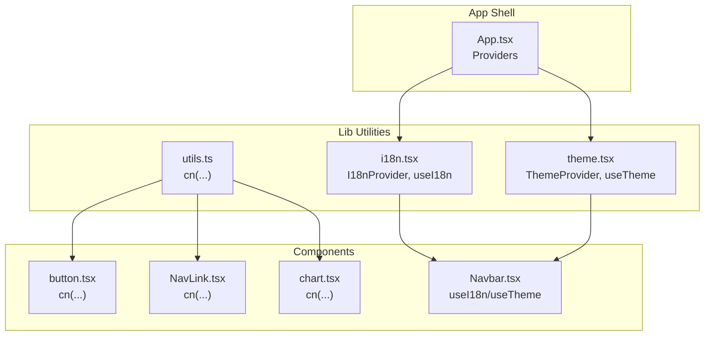
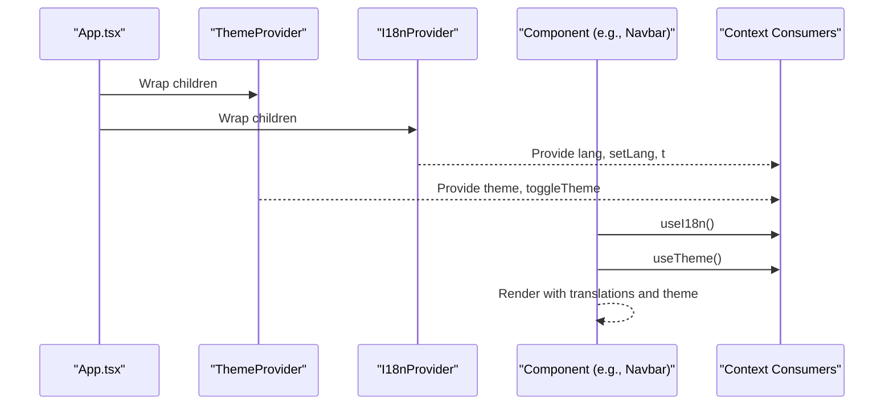
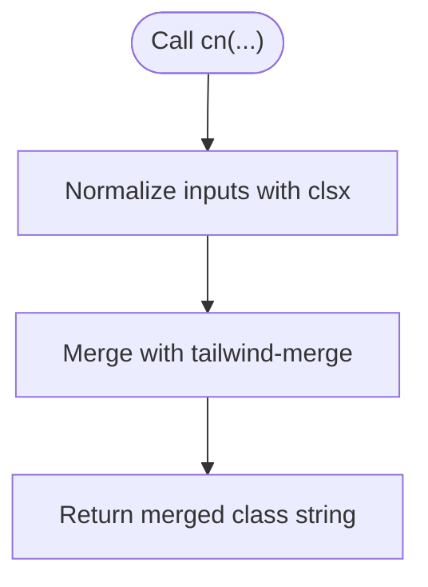
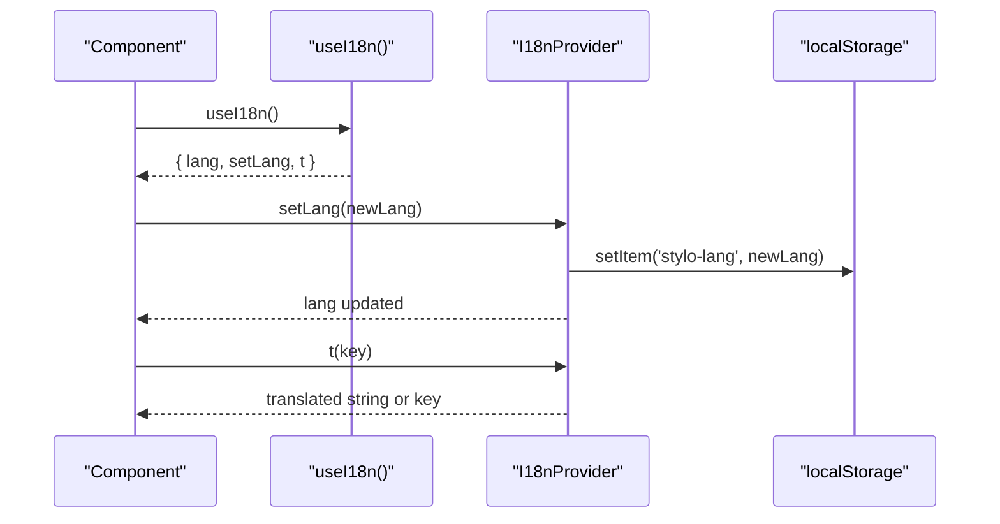
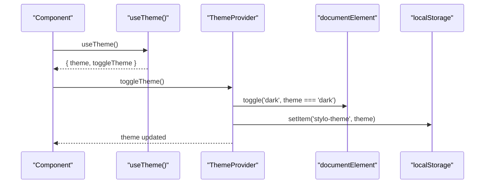
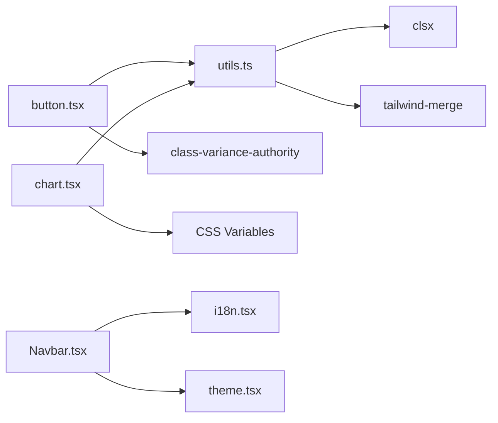

# Utility Functions API

<cite>
**Referenced Files in This Document**
- [utils.ts](file://src/lib/utils.ts)
- [i18n.tsx](file://src/lib/i18n.tsx)
- [theme.tsx](file://src/lib/theme.tsx)
- [App.tsx](file://src/App.tsx)
- [button.tsx](file://src/components/ui/button.tsx)
- [NavLink.tsx](file://src/components/NavLink.tsx)
- [chart.tsx](file://src/components/ui/chart.tsx)
- [Navbar.tsx](file://src/components/Navbar.tsx)
- [package.json](file://package.json)
</cite>

## Table of Contents
1. [Introduction](#introduction)
2. [Project Structure](#project-structure)
3. [Core Components](#core-components)
4. [Architecture Overview](#architecture-overview)
5. [Detailed Component Analysis](#detailed-component-analysis)
6. [Dependency Analysis](#dependency-analysis)
7. [Performance Considerations](#performance-considerations)
8. [Troubleshooting Guide](#troubleshooting-guide)
9. [Conclusion](#conclusion)

## Introduction
This document provides comprehensive API documentation for utility functions and helper modules in the project. It focuses on:
- Conditional class merging with cn for Tailwind CSS composition
- Internationalization utilities for translation key resolution and locale switching
- Theme utilities for theme detection, persistence, and provider configuration
- Function composition patterns, memoization strategies, and performance considerations
- Integration examples with components and hooks

## Project Structure
The utility modules live under src/lib and are consumed by components and pages. Providers wrap the application to enable global state for i18n and theme.

**Diagram sources**
- [App.tsx](file://src/App.tsx#L19-L42)
- [utils.ts](file://src/lib/utils.ts#L4-L6)
- [i18n.tsx](file://src/lib/i18n.tsx#L148-L168)
- [theme.tsx](file://src/lib/theme.tsx#L12-L31)
- [button.tsx](file://src/components/ui/button.tsx#L5-L44)
- [NavLink.tsx](file://src/components/NavLink.tsx#L11-L24)
- [chart.tsx](file://src/components/ui/chart.tsx#L4-L88)
- [Navbar.tsx](file://src/components/Navbar.tsx#L13-L131)

**Section sources**
- [App.tsx](file://src/App.tsx#L19-L42)
- [utils.ts](file://src/lib/utils.ts#L4-L6)
- [i18n.tsx](file://src/lib/i18n.tsx#L148-L168)
- [theme.tsx](file://src/lib/theme.tsx#L12-L31)

## Core Components

### cn: Conditional Class Merging
Purpose: Merge Tailwind CSS classes while avoiding duplicates and conflicts.
- Signature: cn(...inputs: ClassValue[]): string
- Parameters:
  - inputs: A spread of class values compatible with clsx
- Behavior:
  - Uses clsx to normalize and merge inputs
  - Applies tailwind-merge to deduplicate and resolve conflicts
- Return: A single merged class string suitable for React className props
- Usage contexts:
  - Component variants and base styles composition
  - Dynamic class composition with conditionals and variants

Integration examples:
- Button component composes variants with cn
- NavLink composes active/pending classes with base class
- Chart components compose theme-aware classes

**Section sources**
- [utils.ts](file://src/lib/utils.ts#L4-L6)
- [button.tsx](file://src/components/ui/button.tsx#L39-L44)
- [NavLink.tsx](file://src/components/NavLink.tsx#L11-L24)
- [chart.tsx](file://src/components/ui/chart.tsx#L32-L88)

### I18n Provider and Hooks
Purpose: Provide internationalization state and translation resolution across the app.
- Types:
  - Lang: union of supported locales
  - I18nContextType: exposes lang, setLang, and t
- I18nProvider:
  - Initializes lang from localStorage or prefers-color-scheme
  - Exposes changeLang and t via context
  - Persists language selection to localStorage
- useI18n:
  - Hook to consume I18nContext
  - Returns lang, setLang, and t
- Translation keys:
  - Hierarchical keys for navigation, hero, booking, trust, rooms, amenities, gallery, offers, testimonials, location, footer, about, contact
- Locale-specific formatting:
  - Translations include multi-line strings and locale-appropriate phrasing

Integration examples:
- Navbar renders navigation links and call-to-action using t
- Language switcher updates lang via setLang

**Section sources**
- [i18n.tsx](file://src/lib/i18n.tsx#L3-L134)
- [i18n.tsx](file://src/lib/i18n.tsx#L136-L146)
- [i18n.tsx](file://src/lib/i18n.tsx#L148-L168)
- [i18n.tsx](file://src/lib/i18n.tsx#L170-L172)
- [Navbar.tsx](file://src/components/Navbar.tsx#L13-L131)

### Theme Provider and Hooks
Purpose: Manage theme state and persist theme preference.
- Types:
  - Theme: union of 'light' | 'dark'
  - ThemeContextType: exposes theme and toggleTheme
- ThemeProvider:
  - Initializes theme from localStorage or OS preference
  - Updates documentElement.classList for dark mode
  - Persists theme to localStorage
  - Provides toggleTheme to flip between themes
- useTheme:
  - Hook to consume ThemeContext
  - Returns theme and toggleTheme
- CSS variable management:
  - Chart components use CSS variables scoped by theme
  - Theme-aware color mapping via data attributes

Integration examples:
- Navbar toggles theme and switches logo based on theme
- Chart components apply theme-specific colors via CSS variables

**Section sources**
- [theme.tsx](file://src/lib/theme.tsx#L3-L10)
- [theme.tsx](file://src/lib/theme.tsx#L12-L31)
- [theme.tsx](file://src/lib/theme.tsx#L33-L35)
- [Navbar.tsx](file://src/components/Navbar.tsx#L13-L131)
- [chart.tsx](file://src/components/ui/chart.tsx#L6-L88)

## Architecture Overview
The application wraps the UI tree with providers to enable global state. Components consume hooks to access localized strings and theme state.

**Diagram sources**
- [App.tsx](file://src/App.tsx#L19-L42)
- [i18n.tsx](file://src/lib/i18n.tsx#L148-L168)
- [theme.tsx](file://src/lib/theme.tsx#L12-L31)
- [Navbar.tsx](file://src/components/Navbar.tsx#L13-L131)

## Detailed Component Analysis

### cn Function API
- Purpose: Compose Tailwind classes safely
- Signature: cn(...inputs: ClassValue[]): string
- Inputs:
  - Spread of class values (strings, objects, arrays, null/undefined)
- Output: Single merged class string
- Implementation details:
  - Delegates normalization to clsx
  - Resolves conflicts with tailwind-merge
- Performance characteristics:
  - Pure function; no side effects
  - Efficient for repeated invocations in render paths
- Composition patterns:
  - Base classes + variant modifiers
  - Conditional classes with logical OR patterns
  - Dynamic class composition with runtime conditions

**Diagram sources**
- [utils.ts](file://src/lib/utils.ts#L4-L6)

**Section sources**
- [utils.ts](file://src/lib/utils.ts#L4-L6)
- [button.tsx](file://src/components/ui/button.tsx#L39-L44)
- [NavLink.tsx](file://src/components/NavLink.tsx#L11-L24)
- [chart.tsx](file://src/components/ui/chart.tsx#L32-L88)

### I18n Provider API
- Provider: I18nProvider
  - Props: children: ReactNode
  - State: lang: Lang
  - Methods: setLang, t
  - Persistence: localStorage('stylo-lang')
- Hook: useI18n
  - Returns: { lang, setLang, t }
- Translation Resolution:
  - t(key: string): string
  - Falls back to key if translation missing
- Locale switching:
  - setLang updates state and persists to localStorage
- Supported locales: 'en' | 'ru' | 'uz'

**Diagram sources**
- [i18n.tsx](file://src/lib/i18n.tsx#L148-L168)
- [i18n.tsx](file://src/lib/i18n.tsx#L170-L172)

**Section sources**
- [i18n.tsx](file://src/lib/i18n.tsx#L148-L168)
- [i18n.tsx](file://src/lib/i18n.tsx#L170-L172)
- [Navbar.tsx](file://src/components/Navbar.tsx#L13-L131)

### Theme Provider API
- Provider: ThemeProvider
  - Props: children: ReactNode
  - State: theme: Theme
  - Effects: updates documentElement.classList('dark'), persists to localStorage
  - Methods: toggleTheme
- Hook: useTheme
  - Returns: { theme, toggleTheme }
- Theme detection:
  - Reads localStorage('stylo-theme') if valid
  - Falls back to OS preference (prefers-color-scheme)
- CSS variable management:
  - Chart components define CSS variables per theme
  - Theme-aware color mapping via data attributes

**Diagram sources**
- [theme.tsx](file://src/lib/theme.tsx#L12-L31)
- [theme.tsx](file://src/lib/theme.tsx#L33-L35)

**Section sources**
- [theme.tsx](file://src/lib/theme.tsx#L12-L31)
- [theme.tsx](file://src/lib/theme.tsx#L33-L35)
- [chart.tsx](file://src/components/ui/chart.tsx#L6-L88)
- [Navbar.tsx](file://src/components/Navbar.tsx#L13-L131)

### Integration Examples

#### cn in Components
- Button component:
  - Composes base classes with variant and size modifiers
  - Uses cn to merge dynamic className with computed variants
- NavLink component:
  - Composes base class with active and pending classes
  - Uses cn to merge conditional classes
- Chart component:
  - Composes container classes with theme-aware styling
  - Uses cn to merge chart-specific classes

**Section sources**
- [button.tsx](file://src/components/ui/button.tsx#L39-L44)
- [NavLink.tsx](file://src/components/NavLink.tsx#L11-L24)
- [chart.tsx](file://src/components/ui/chart.tsx#L32-L88)

#### useI18n in Components
- Navbar:
  - Renders navigation links using t with hierarchical keys
  - Implements language switcher using setLang
  - Uses t for call-to-action buttons

**Section sources**
- [Navbar.tsx](file://src/components/Navbar.tsx#L13-L131)
- [i18n.tsx](file://src/lib/i18n.tsx#L148-L168)

#### useTheme in Components
- Navbar:
  - Toggles theme via toggleTheme
  - Switches logo based on current theme
- Chart:
  - Applies theme-specific colors via CSS variables

**Section sources**
- [Navbar.tsx](file://src/components/Navbar.tsx#L13-L131)
- [chart.tsx](file://src/components/ui/chart.tsx#L6-L88)

## Dependency Analysis
External libraries used by utilities:
- clsx: Normalizes class values
- tailwind-merge: Merges Tailwind classes and resolves conflicts
- class-variance-authority: Defines component variants
- lucide-react: Icons for theme toggle and navigation
- recharts: Charting library with theme-aware styling

**Diagram sources**
- [utils.ts](file://src/lib/utils.ts#L1-L2)
- [button.tsx](file://src/components/ui/button.tsx#L3-L5)
- [chart.tsx](file://src/components/ui/chart.tsx#L6-L7)
- [Navbar.tsx](file://src/components/Navbar.tsx#L4-L5)

**Section sources**
- [package.json](file://package.json#L45-L64)
- [utils.ts](file://src/lib/utils.ts#L1-L2)
- [button.tsx](file://src/components/ui/button.tsx#L3-L5)
- [chart.tsx](file://src/components/ui/chart.tsx#L6-L7)
- [Navbar.tsx](file://src/components/Navbar.tsx#L4-L5)

## Performance Considerations
- cn:
  - Pure function; safe to call frequently
  - tailwind-merge ensures minimal class count and avoids conflicts
- useI18n:
  - t is memoized via useCallback; stable across renders
  - setLang persists efficiently to localStorage
- useTheme:
  - Toggle is constant-time; effect runs only on theme change
  - CSS class toggling is efficient; localStorage persistence is lightweight
- Composition patterns:
  - Prefer composing variants with cn to minimize conditional branches
  - Use class-variance-authority for predictable variant combinations
- Memoization strategies:
  - useCallback for t and changeLang to prevent unnecessary re-renders
  - useMemo for derived values when needed in heavy components

[No sources needed since this section provides general guidance]

## Troubleshooting Guide
- cn returns unexpected classes:
  - Ensure inputs are valid class values
  - Verify order of inputs; later values take precedence in tailwind-merge
- Translation not found:
  - Confirm key exists in translations
  - Check that lang is set correctly and persisted
- Theme not applying:
  - Verify documentElement.classList contains 'dark' when theme is dark
  - Confirm localStorage('stylo-theme') is set appropriately
- Provider not wrapping components:
  - Ensure ThemeProvider and I18nProvider are at the root of the app

**Section sources**
- [utils.ts](file://src/lib/utils.ts#L4-L6)
- [i18n.tsx](file://src/lib/i18n.tsx#L148-L168)
- [theme.tsx](file://src/lib/theme.tsx#L12-L31)
- [App.tsx](file://src/App.tsx#L19-L42)

## Conclusion
The utility modules provide a robust foundation for class composition, internationalization, and theme management. By leveraging cn for Tailwind CSS composition, useI18n for translation resolution, and useTheme for theme state, components remain clean, maintainable, and performant. The integration patterns demonstrated in components show how to compose utilities effectively while preserving performance and developer ergonomics.