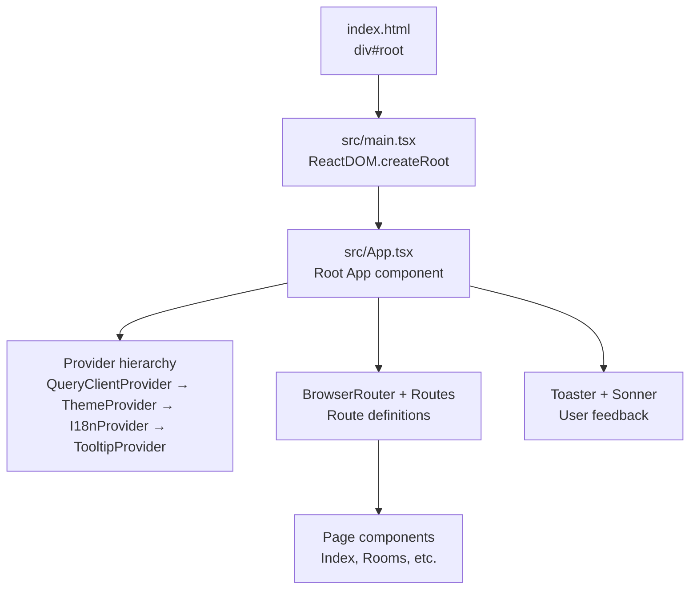
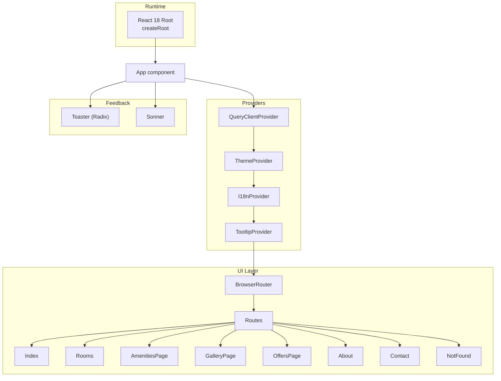
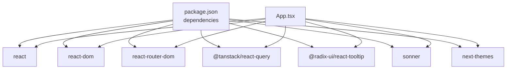

# Application Entry Point

<cite>
**Referenced Files in This Document**
- [main.tsx](file://src/main.tsx)
- [App.tsx](file://src/App.tsx)
- [i18n.tsx](file://src/lib/i18n.tsx)
- [theme.tsx](file://src/lib/theme.tsx)
- [tooltip.tsx](file://src/components/ui/tooltip.tsx)
- [toaster.tsx](file://src/components/ui/toaster.tsx)
- [sonner.tsx](file://src/components/ui/sonner.tsx)
- [use-toast.ts](file://src/hooks/use-toast.ts)
- [Index.tsx](file://src/pages/Index.tsx)
- [package.json](file://package.json)
- [index.html](file://index.html)
</cite>

## Table of Contents
1. [Introduction](#introduction)
2. [Project Structure](#project-structure)
3. [Core Components](#core-components)
4. [Architecture Overview](#architecture-overview)
5. [Detailed Component Analysis](#detailed-component-analysis)
6. [Dependency Analysis](#dependency-analysis)
7. [Performance Considerations](#performance-considerations)
8. [Troubleshooting Guide](#troubleshooting-guide)
9. [Conclusion](#conclusion)

## Introduction
This document explains the React application entry point architecture for the STYLO Residence & Suites hotel booking website. It covers the initialization process, ReactDOM rendering, provider hierarchy, routing configuration, and toast integration. It also highlights the importance of provider ordering and React 18 concurrent features usage.

## Project Structure
The application follows a conventional Vite + React + TypeScript setup with a clear separation between application bootstrap, providers, routing, and page components.

**Diagram sources**
- [index.html](file://index.html#L32-L34)
- [main.tsx](file://src/main.tsx#L1-L6)
- [App.tsx](file://src/App.tsx#L1-L45)

**Section sources**
- [index.html](file://index.html#L1-L37)
- [main.tsx](file://src/main.tsx#L1-L6)
- [App.tsx](file://src/App.tsx#L1-L45)

## Core Components
- Application bootstrap: Initializes the React root and renders the root App component.
- Root App component: Sets up the provider hierarchy, routing, and toast providers.
- Provider stack: QueryClientProvider, ThemeProvider, I18nProvider, TooltipProvider.
- Routing: BrowserRouter with static routes to page components.
- Toast integration: Two toast systems coexist—Radix UI toast and Sonner.

**Section sources**
- [main.tsx](file://src/main.tsx#L1-L6)
- [App.tsx](file://src/App.tsx#L1-L45)
- [theme.tsx](file://src/lib/theme.tsx#L1-L36)
- [i18n.tsx](file://src/lib/i18n.tsx#L1-L173)
- [tooltip.tsx](file://src/components/ui/tooltip.tsx#L1-L29)
- [toaster.tsx](file://src/components/ui/toaster.tsx#L1-L25)
- [sonner.tsx](file://src/components/ui/sonner.tsx#L1-L28)

## Architecture Overview
The application initializes React 18 with a concurrent root and composes providers around the routing tree. The provider order ensures downstream consumers receive theme, internationalization, and tooltip contexts correctly.

**Diagram sources**
- [main.tsx](file://src/main.tsx#L1-L6)
- [App.tsx](file://src/App.tsx#L17-L42)
- [Index.tsx](file://src/pages/Index.tsx#L1-L28)

## Detailed Component Analysis

### React Application Initialization
- The application bootstraps using React 18’s createRoot API and mounts the App component into the DOM element with id root.
- The HTML template defines the mount target and loads the module script.

Key behaviors:
- Uses React 18 concurrent features via createRoot.
- Hydration occurs automatically when the server-rendered HTML matches the client-side render.

**Section sources**
- [main.tsx](file://src/main.tsx#L1-L6)
- [index.html](file://index.html#L32-L34)

### Root App Component Composition
The App component composes providers and routing in a strict order to ensure proper context propagation:

1. QueryClientProvider: Enables TanStack Query caching and state management.
2. ThemeProvider: Manages light/dark theme and persists preference.
3. I18nProvider: Provides localization keys and language switching.
4. TooltipProvider: Enables Radix UI tooltips across the app.
5. Toaster (Radix): Renders toast notifications.
6. Sonner: Renders toast notifications with advanced theming.
7. BrowserRouter: Wraps Routes for client-side navigation.
8. Routes: Defines static routes to page components.

Provider order matters because:
- Child components rely on theme and i18n contexts.
- TooltipProvider depends on Radix UI context.
- Toast providers depend on their respective contexts and theme.

**Section sources**
- [App.tsx](file://src/App.tsx#L17-L42)

### Provider Hierarchy Details

#### QueryClientProvider
- Creates a singleton QueryClient instance and wraps the entire app.
- Enables caching, invalidation, and optimistic updates for data fetching.

**Section sources**
- [App.tsx](file://src/App.tsx#L17-L17)

#### ThemeProvider
- Manages theme state with persistence in localStorage and prefers-color-scheme detection.
- Applies a CSS class to the document element for Tailwind dark mode support.

**Section sources**
- [theme.tsx](file://src/lib/theme.tsx#L12-L31)

#### I18nProvider
- Maintains language state and translation lookup.
- Persists language selection in localStorage and exposes a t function for translations.

**Section sources**
- [i18n.tsx](file://src/lib/i18n.tsx#L148-L168)

#### TooltipProvider
- Exposes Radix UI tooltip primitives for global tooltip usage.

**Section sources**
- [tooltip.tsx](file://src/components/ui/tooltip.tsx#L6-L6)

### Routing Configuration
- BrowserRouter wraps Routes to enable client-side routing.
- Static routes map to page components including Index, Rooms, AmenitiesPage, GalleryPage, OffersPage, About, Contact, and a catch-all NotFound.

Routing behavior:
- Exact path matching for known routes.
- Catch-all route handles unknown paths.

**Section sources**
- [App.tsx](file://src/App.tsx#L26-L37)
- [Index.tsx](file://src/pages/Index.tsx#L12-L25)

### Toast Providers Integration
Two toast systems are integrated:

1. Radix UI Toaster
   - Implemented via a custom Toaster component that maps state to toast items.
   - Uses a local hook-based toast manager with controlled lifecycle.

2. Sonner
   - A modern toast library integrated with next-themes for automatic theme detection.
   - Applies Tailwind-based styling classes and respects the current theme.

Coexistence considerations:
- Both systems can render concurrently, but ensure they do not conflict if both are used for the same UX.
- Sonner integrates with the theme provider for seamless dark/light mode.

**Section sources**
- [toaster.tsx](file://src/components/ui/toaster.tsx#L4-L24)
- [use-toast.ts](file://src/hooks/use-toast.ts#L166-L184)
- [sonner.tsx](file://src/components/ui/sonner.tsx#L6-L25)

### Example: Provider Order Importance
Incorrect order can break functionality:
- If ThemeProvider is placed after TooltipProvider without proper wrapping, tooltip components may not inherit theme-aware styles.
- If I18nProvider is not above components using the t function, translations will fall back to keys.
- If QueryClientProvider is not outermost, data fetching hooks may not have access to the query client.

Correct order ensures:
- Theme-aware styling for tooltips and toasts.
- Access to translations for UI labels.
- Proper caching and state management for data operations.

**Section sources**
- [App.tsx](file://src/App.tsx#L19-L42)
- [theme.tsx](file://src/lib/theme.tsx#L19-L22)
- [tooltip.tsx](file://src/components/ui/tooltip.tsx#L12-L26)
- [i18n.tsx](file://src/lib/i18n.tsx#L159-L161)

### React 18 Concurrent Features and Hydration
- The app uses React 18 createRoot for concurrent features such as automatic batching and transitions.
- Hydration is implicit when the server-rendered HTML matches the client render; the index.html template provides the #root element for mounting.

Best practices:
- Keep the provider order consistent between server and client builds.
- Avoid dynamic content that would cause mismatches during hydration.

**Section sources**
- [main.tsx](file://src/main.tsx#L1-L6)
- [index.html](file://index.html#L32-L34)

## Dependency Analysis
External libraries and their roles:
- react, react-dom: Core React runtime and DOM renderer.
- react-router-dom: Client-side routing.
- @tanstack/react-query: Data fetching and caching.
- @radix-ui/react-tooltip: Accessible tooltip primitives.
- sonner: Modern toast notifications with theming.
- next-themes: Theme management for toast theming.

**Diagram sources**
- [package.json](file://package.json#L15-L64)
- [App.tsx](file://src/App.tsx#L1-L7)

**Section sources**
- [package.json](file://package.json#L15-L64)

## Performance Considerations
- Provider depth: Keep the provider stack shallow to minimize re-renders. The current stack is minimal and efficient.
- Toast management: Limit concurrent toasts and use dismissal timeouts judiciously to avoid UI clutter.
- Theme persistence: Local storage reads/writes are lightweight but avoid excessive writes during rapid toggles.
- Query caching: Configure cache times appropriately to balance freshness and performance.

## Troubleshooting Guide
Common issues and resolutions:
- Missing theme or tooltip styles:
  - Ensure ThemeProvider and TooltipProvider are both present and ordered correctly.
- Translations not applied:
  - Verify I18nProvider wraps components using the t function and that the language is persisted in localStorage.
- Toasts not appearing:
  - Confirm both Toaster (Radix) and Sonner are rendered within the provider hierarchy.
- Routing not working:
  - Ensure BrowserRouter wraps Routes and that routes match the intended paths.

**Section sources**
- [App.tsx](file://src/App.tsx#L19-L42)
- [theme.tsx](file://src/lib/theme.tsx#L19-L22)
- [i18n.tsx](file://src/lib/i18n.tsx#L148-L168)
- [toaster.tsx](file://src/components/ui/toaster.tsx#L4-L24)
- [sonner.tsx](file://src/components/ui/sonner.tsx#L6-L25)

## Conclusion
The application entry point establishes a robust provider hierarchy that enables theme-aware UI, internationalization, accessible tooltips, and dual toast systems. The routing configuration provides clear navigation, while React 18’s createRoot ensures modern concurrency features. Adhering to the documented provider order guarantees predictable behavior across components.