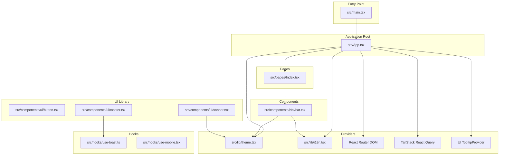
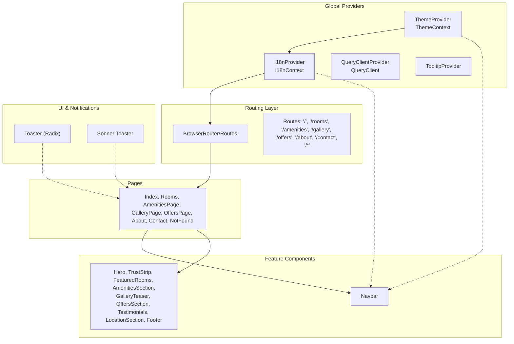
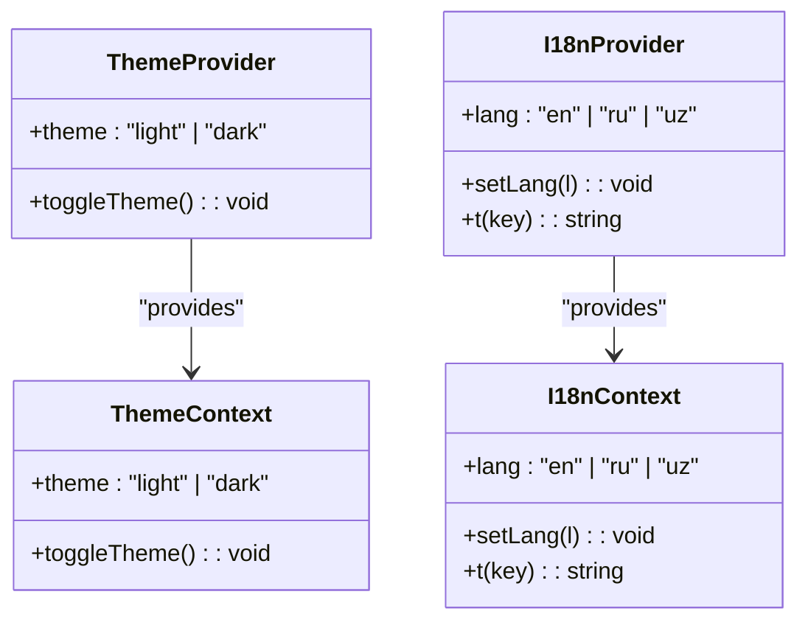
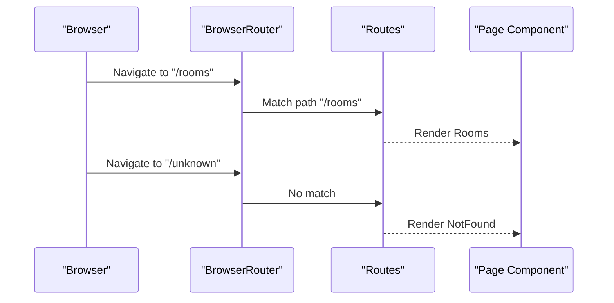
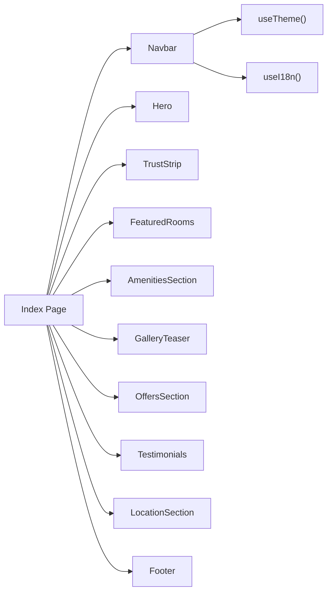
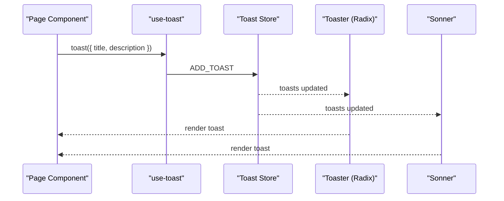
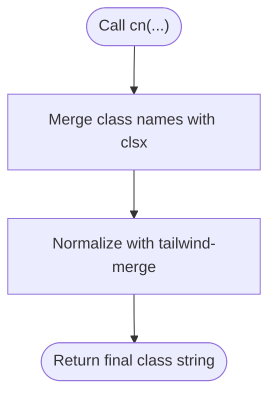
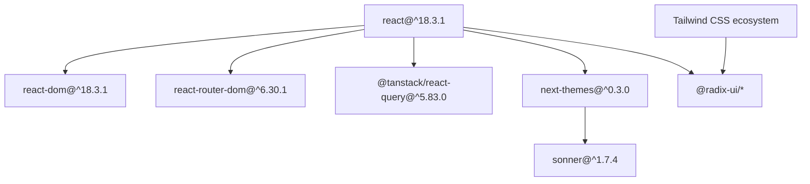

# Architecture Overview

<cite>
**Referenced Files in This Document**
- [main.tsx](file://src/main.tsx)
- [App.tsx](file://src/App.tsx)
- [theme.tsx](file://src/lib/theme.tsx)
- [i18n.tsx](file://src/lib/i18n.tsx)
- [utils.ts](file://src/lib/utils.ts)
- [Navbar.tsx](file://src/components/Navbar.tsx)
- [Index.tsx](file://src/pages/Index.tsx)
- [use-toast.ts](file://src/hooks/use-toast.ts)
- [use-mobile.tsx](file://src/hooks/use-mobile.tsx)
- [button.tsx](file://src/components/ui/button.tsx)
- [toaster.tsx](file://src/components/ui/toaster.tsx)
- [sonner.tsx](file://src/components/ui/sonner.tsx)
- [package.json](file://package.json)
- [tsconfig.json](file://tsconfig.json)
</cite>

## Table of Contents
1. [Introduction](#introduction)
2. [Project Structure](#project-structure)
3. [Core Components](#core-components)
4. [Architecture Overview](#architecture-overview)
5. [Detailed Component Analysis](#detailed-component-analysis)
6. [Dependency Analysis](#dependency-analysis)
7. [Performance Considerations](#performance-considerations)
8. [Troubleshooting Guide](#troubleshooting-guide)
9. [Conclusion](#conclusion)

## Introduction
This document describes the architecture of the Stylo Residence Luxe application. It focuses on the high-level design patterns, including the Provider Pattern for global state management, component composition strategy, and routing architecture. It documents the application entry point, provider hierarchy (ThemeProvider, I18nProvider, QueryClientProvider), and component organization. It also explains the separation of concerns between pages, components, hooks, and utilities, along with system boundaries, data flow patterns, and integration points. Finally, it covers React 18 concurrent features, TypeScript type safety enforcement, and performance considerations, and provides architectural diagrams.

## Project Structure
The project follows a feature-based and layer-based organization:
- Entry point initializes the React root and renders the root App component.
- App composes providers for theming, internationalization, routing, and UI toast systems.
- Pages define route handlers and compose domain components.
- Components are grouped under a UI library and feature-specific components.
- Hooks encapsulate reusable logic such as toasts and responsive detection.
- Utilities centralize shared helpers like class merging.

**Diagram sources**
- [main.tsx](file://src/main.tsx#L1-L6)
- [App.tsx](file://src/App.tsx#L1-L45)
- [theme.tsx](file://src/lib/theme.tsx#L1-L36)
- [i18n.tsx](file://src/lib/i18n.tsx#L1-L173)
- [Index.tsx](file://src/pages/Index.tsx#L1-L28)
- [Navbar.tsx](file://src/components/Navbar.tsx#L1-L133)
- [use-toast.ts](file://src/hooks/use-toast.ts#L1-L187)
- [button.tsx](file://src/components/ui/button.tsx#L1-L48)
- [toaster.tsx](file://src/components/ui/toaster.tsx#L1-L25)
- [sonner.tsx](file://src/components/ui/sonner.tsx#L1-L28)

**Section sources**
- [main.tsx](file://src/main.tsx#L1-L6)
- [App.tsx](file://src/App.tsx#L1-L45)
- [tsconfig.json](file://tsconfig.json#L1-L17)

## Core Components
- Application entry point initializes the React 18 root and mounts the App component.
- App composes providers in a strict order to ensure global state availability:
  - TanStack QueryClientProvider for caching and data fetching.
  - ThemeProvider for light/dark mode and persisted preferences.
  - I18nProvider for multi-language support and persisted language selection.
  - TooltipProvider for UI tooltips.
  - React Router DOM for page routing.
  - UI toast systems (Toaster and Sonner) for notifications.
- Pages are thin route handlers that render feature components.
- Components consume providers via custom hooks (useTheme, useI18n).
- Hooks encapsulate cross-cutting concerns like toasts and responsive checks.

**Section sources**
- [main.tsx](file://src/main.tsx#L1-L6)
- [App.tsx](file://src/App.tsx#L1-L45)
- [theme.tsx](file://src/lib/theme.tsx#L1-L36)
- [i18n.tsx](file://src/lib/i18n.tsx#L1-L173)
- [Index.tsx](file://src/pages/Index.tsx#L1-L28)
- [Navbar.tsx](file://src/components/Navbar.tsx#L1-L133)
- [use-toast.ts](file://src/hooks/use-toast.ts#L1-L187)
- [use-mobile.tsx](file://src/hooks/use-mobile.tsx#L1-L20)

## Architecture Overview
The application employs a layered Provider Pattern to manage global concerns:
- Global state: Theme and language selections are stored in React Context and persisted in localStorage.
- Routing: React Router DOM defines routes and navigates between pages.
- Data fetching: TanStack Query manages server state and caching.
- UI notifications: Two toast systems coexist (Radix-based Toaster and Sonner), both integrated via hooks and providers.
- Component composition: Pages assemble feature components; components use UI primitives and custom hooks.

**Diagram sources**
- [App.tsx](file://src/App.tsx#L1-L45)
- [theme.tsx](file://src/lib/theme.tsx#L1-L36)
- [i18n.tsx](file://src/lib/i18n.tsx#L1-L173)
- [Index.tsx](file://src/pages/Index.tsx#L1-L28)
- [Navbar.tsx](file://src/components/Navbar.tsx#L1-L133)
- [toaster.tsx](file://src/components/ui/toaster.tsx#L1-L25)
- [sonner.tsx](file://src/components/ui/sonner.tsx#L1-L28)

## Detailed Component Analysis

### Provider Pattern and Global State Management
- ThemeProvider
  - Manages theme state (light/dark) with persistence in localStorage and prefers system preference initially.
  - Exposes a toggle function and a hook to consume the context.
- I18nProvider
  - Manages language state with persistence and provides a translation function keyed by string identifiers.
  - Exposes a hook to consume the context and change language.
- QueryClientProvider
  - Wraps the app to enable React Query’s caching and data fetching capabilities.
- TooltipProvider
  - Enables tooltip behavior across UI components.

**Diagram sources**
- [theme.tsx](file://src/lib/theme.tsx#L1-L36)
- [i18n.tsx](file://src/lib/i18n.tsx#L1-L173)

**Section sources**
- [theme.tsx](file://src/lib/theme.tsx#L1-L36)
- [i18n.tsx](file://src/lib/i18n.tsx#L1-L173)

### Routing Architecture
- BrowserRouter and Routes define the application routes.
- Each route maps to a page component.
- A catch-all route handles 404 scenarios.

**Diagram sources**
- [App.tsx](file://src/App.tsx#L26-L36)

**Section sources**
- [App.tsx](file://src/App.tsx#L1-L45)

### Component Composition Strategy
- Pages are composed of feature components.
- Navbar demonstrates composition by consuming useTheme and useI18n hooks and rendering localized links.
- UI library components expose variants and sizes for consistent styling.

**Diagram sources**
- [Index.tsx](file://src/pages/Index.tsx#L1-L28)
- [Navbar.tsx](file://src/components/Navbar.tsx#L1-L133)
- [theme.tsx](file://src/lib/theme.tsx#L33-L35)
- [i18n.tsx](file://src/lib/i18n.tsx#L170-L172)

**Section sources**
- [Index.tsx](file://src/pages/Index.tsx#L1-L28)
- [Navbar.tsx](file://src/components/Navbar.tsx#L1-L133)

### Notification Systems and Data Flow
- Toaster (Radix-based) and Sonner are integrated at the root level.
- use-toast implements a toast store with actions and a reducer.
- Components trigger toasts via exported toast functions.

**Diagram sources**
- [use-toast.ts](file://src/hooks/use-toast.ts#L1-L187)
- [toaster.tsx](file://src/components/ui/toaster.tsx#L1-L25)
- [sonner.tsx](file://src/components/ui/sonner.tsx#L1-L28)

**Section sources**
- [use-toast.ts](file://src/hooks/use-toast.ts#L1-L187)
- [toaster.tsx](file://src/components/ui/toaster.tsx#L1-L25)
- [sonner.tsx](file://src/components/ui/sonner.tsx#L1-L28)

### Utility Functions and Design System
- cn utility merges Tailwind classes safely using clsx and tailwind-merge.
- UI components use class variance authority for consistent variants and sizes.

**Diagram sources**
- [utils.ts](file://src/lib/utils.ts#L1-L7)
- [button.tsx](file://src/components/ui/button.tsx#L1-L48)

**Section sources**
- [utils.ts](file://src/lib/utils.ts#L1-L7)
- [button.tsx](file://src/components/ui/button.tsx#L1-L48)

## Dependency Analysis
External dependencies relevant to architecture:
- React 18 and React DOM for concurrent features and rendering.
- React Router DOM for declarative routing.
- TanStack React Query for caching and data fetching.
- next-themes and Sonner for theme-aware notifications.
- Radix UI components for accessible UI primitives.
- Tailwind CSS ecosystem for styling utilities.

**Diagram sources**
- [package.json](file://package.json#L15-L64)

**Section sources**
- [package.json](file://package.json#L1-L90)

## Performance Considerations
- Provider ordering ensures efficient propagation of theme and language contexts to all components.
- React 18 concurrent features can be leveraged via the root renderer and future enhancements (e.g., automatic batching, transitions).
- TanStack Query caching reduces network requests and improves perceived performance.
- Utility functions like cn minimize class conflicts and reduce reflows.
- Responsive hook useIsMobile enables adaptive rendering for mobile devices.

[No sources needed since this section provides general guidance]

## Troubleshooting Guide
- Theme not persisting: Verify localStorage keys and effect toggling in ThemeProvider.
- Language not switching: Confirm I18nProvider lang state and translation key existence.
- Toasts not appearing: Ensure Toaster and Sonner are rendered at root and use-toast is properly imported.
- Navigation issues: Validate route paths and catch-all behavior in Routes.

**Section sources**
- [theme.tsx](file://src/lib/theme.tsx#L13-L22)
- [i18n.tsx](file://src/lib/i18n.tsx#L149-L161)
- [toaster.tsx](file://src/components/ui/toaster.tsx#L4-L24)
- [sonner.tsx](file://src/components/ui/sonner.tsx#L6-L25)
- [App.tsx](file://src/App.tsx#L26-L36)

## Conclusion
The Stylo Residence Luxe application adopts a clean Provider Pattern to centralize global concerns (theme, language, routing, data fetching, and notifications). Pages are thin compositions of feature components, promoting separation of concerns and maintainability. The architecture leverages React 18, TypeScript, and a robust UI system to deliver a scalable and accessible frontend. Future enhancements can utilize React 18 concurrent features and expand the provider stack for advanced caching and analytics integrations.