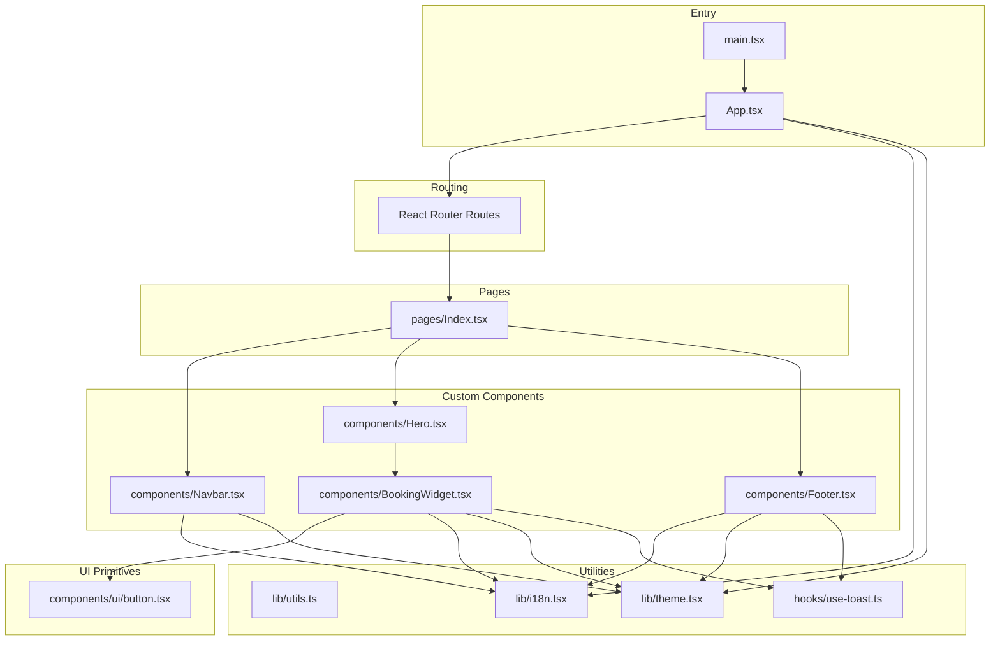
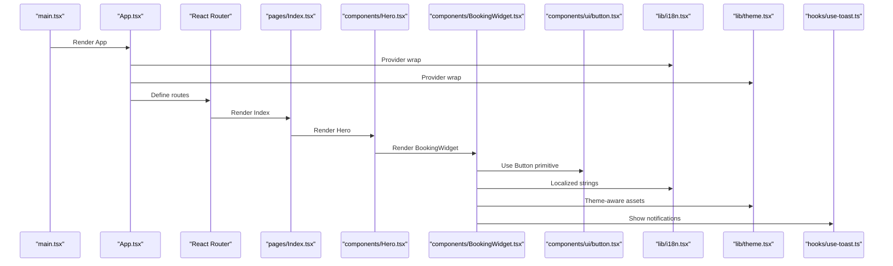
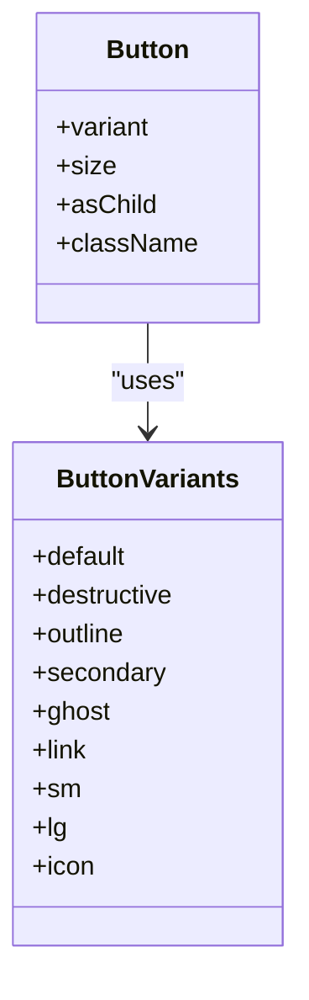
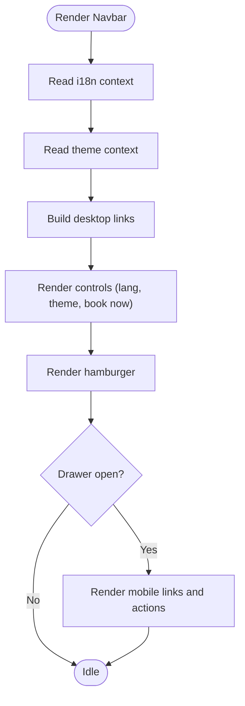
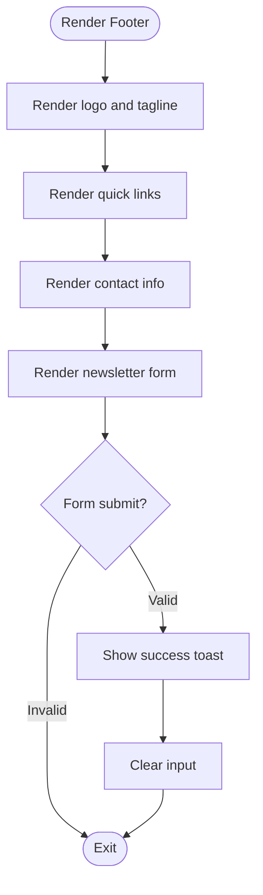
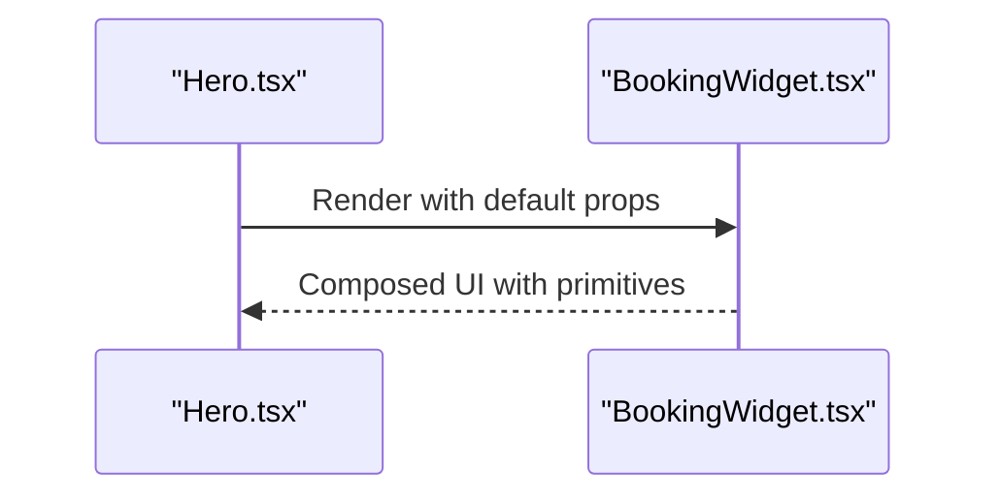
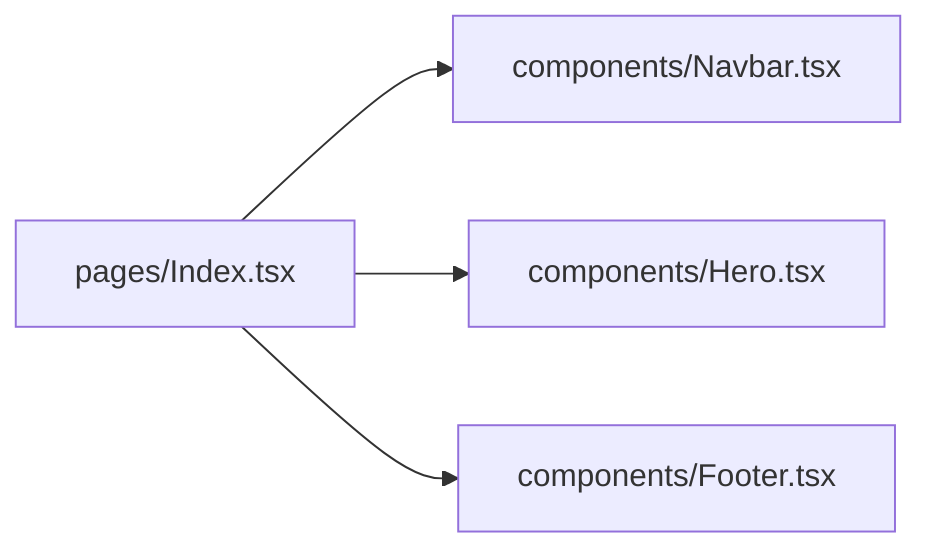
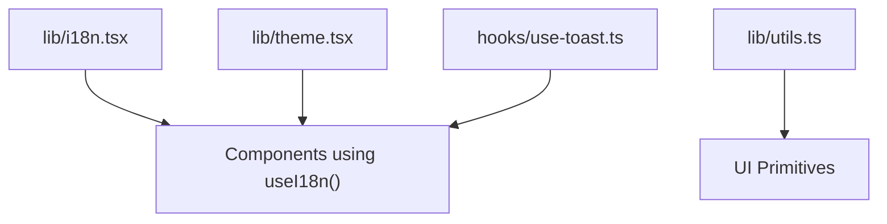
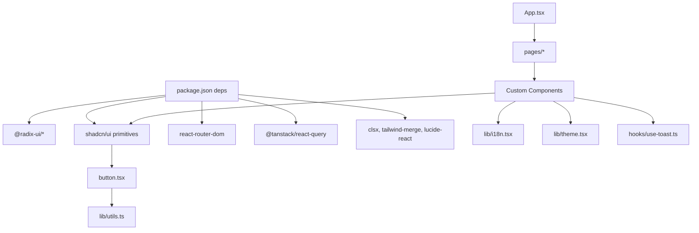

# Component Organization and Structure

<cite>
**Referenced Files in This Document**
- [App.tsx](file://src/App.tsx)
- [main.tsx](file://src/main.tsx)
- [components.json](file://components.json)
- [package.json](file://package.json)
- [tailwind.config.ts](file://tailwind.config.ts)
- [button.tsx](file://src/components/ui/button.tsx)
- [Navbar.tsx](file://src/components/Navbar.tsx)
- [Footer.tsx](file://src/components/Footer.tsx)
- [Hero.tsx](file://src/components/Hero.tsx)
- [BookingWidget.tsx](file://src/components/BookingWidget.tsx)
- [Index.tsx](file://src/pages/Index.tsx)
- [utils.ts](file://src/lib/utils.ts)
- [i18n.tsx](file://src/lib/i18n.tsx)
- [theme.tsx](file://src/lib/theme.tsx)
- [use-toast.ts](file://src/hooks/use-toast.ts)
</cite>

## Table of Contents
1. [Introduction](#introduction)
2. [Project Structure](#project-structure)
3. [Core Components](#core-components)
4. [Architecture Overview](#architecture-overview)
5. [Detailed Component Analysis](#detailed-component-analysis)
6. [Dependency Analysis](#dependency-analysis)
7. [Performance Considerations](#performance-considerations)
8. [Troubleshooting Guide](#troubleshooting-guide)
9. [Conclusion](#conclusion)

## Introduction
This document explains the component organization architecture of the project, focusing on how UI primitives (shadcn/ui components), custom components, page components, and utility modules are separated and composed. It also documents naming conventions, prop interfaces, TypeScript integration, and guidelines for reusability and extension decisions.

## Project Structure
The project follows a clear, layered structure:
- Root app bootstrap and routing orchestration
- Pages as route-level compositions of custom components
- UI primitives under a dedicated ui folder
- Custom components for domain-specific UI
- Utility modules for styling, internationalization, theming, and notifications
- Hooks for cross-cutting concerns

**Diagram sources**
- [main.tsx](file://src/main.tsx#L1-L6)
- [App.tsx](file://src/App.tsx#L1-L45)
- [Index.tsx](file://src/pages/Index.tsx#L1-L28)
- [Navbar.tsx](file://src/components/Navbar.tsx#L1-L131)
- [Footer.tsx](file://src/components/Footer.tsx#L1-L103)
- [Hero.tsx](file://src/components/Hero.tsx#L1-L53)
- [BookingWidget.tsx](file://src/components/BookingWidget.tsx#L1-L154)
- [button.tsx](file://src/components/ui/button.tsx#L1-L48)
- [utils.ts](file://src/lib/utils.ts#L1-L7)
- [i18n.tsx](file://src/lib/i18n.tsx#L1-L173)
- [theme.tsx](file://src/lib/theme.tsx#L1-L36)
- [use-toast.ts](file://src/hooks/use-toast.ts#L1-L187)

**Section sources**
- [main.tsx](file://src/main.tsx#L1-L6)
- [App.tsx](file://src/App.tsx#L1-L45)
- [components.json](file://components.json#L1-L21)
- [tailwind.config.ts](file://tailwind.config.ts#L1-L86)

## Core Components
- UI primitives: Reusable base building blocks (buttons, inputs, modals, etc.) with variant and size support and consistent styling via Tailwind and class variance authority.
- Custom components: Domain-focused components such as navigation, footer, hero, and booking widgets that encapsulate layout, behavior, and integration with utilities.
- Page components: Route-level compositions that assemble custom components into coherent views.
- Utilities: Shared helpers for styling, internationalization, theming, and toast notifications.

Key characteristics:
- UI primitives define props via TypeScript interfaces and forward refs, enabling consistent composition.
- Custom components integrate with i18n, theme, and toast hooks to provide localized, theme-aware behavior.
- Pages compose custom components and pass minimal, focused props to achieve separation of concerns.

**Section sources**
- [button.tsx](file://src/components/ui/button.tsx#L1-L48)
- [Navbar.tsx](file://src/components/Navbar.tsx#L1-L131)
- [Footer.tsx](file://src/components/Footer.tsx#L1-L103)
- [Hero.tsx](file://src/components/Hero.tsx#L1-L53)
- [BookingWidget.tsx](file://src/components/BookingWidget.tsx#L1-L154)
- [Index.tsx](file://src/pages/Index.tsx#L1-L28)
- [utils.ts](file://src/lib/utils.ts#L1-L7)
- [i18n.tsx](file://src/lib/i18n.tsx#L1-L173)
- [theme.tsx](file://src/lib/theme.tsx#L1-L36)
- [use-toast.ts](file://src/hooks/use-toast.ts#L1-L187)

## Architecture Overview
The app initializes providers for theming, internationalization, tooltips, and query caching. Pages render custom components, which in turn use UI primitives and utilities. The booking widget demonstrates composition of multiple primitives and local state.

**Diagram sources**
- [main.tsx](file://src/main.tsx#L1-L6)
- [App.tsx](file://src/App.tsx#L1-L45)
- [Index.tsx](file://src/pages/Index.tsx#L1-L28)
- [Hero.tsx](file://src/components/Hero.tsx#L1-L53)
- [BookingWidget.tsx](file://src/components/BookingWidget.tsx#L1-L154)
- [button.tsx](file://src/components/ui/button.tsx#L1-L48)
- [i18n.tsx](file://src/lib/i18n.tsx#L1-L173)
- [theme.tsx](file://src/lib/theme.tsx#L1-L36)
- [use-toast.ts](file://src/hooks/use-toast.ts#L1-L187)

## Detailed Component Analysis

### UI Primitives: Button
- Purpose: Base button with variant and size variants, slot composition, and ref forwarding.
- Props: Inherits HTML attributes plus variant/size from the variant config and optional asChild behavior.
- Composition: Used inside custom components to maintain consistent styles and interactions.

**Diagram sources**
- [button.tsx](file://src/components/ui/button.tsx#L1-L48)

**Section sources**
- [button.tsx](file://src/components/ui/button.tsx#L1-L48)

### Custom Components: Navbar
- Purpose: Responsive navigation with language switching, theme toggle, and mobile drawer.
- Integration: Uses i18n for labels and theme for branding assets; integrates with routing.
- Props: None; consumes context and router state internally.

**Diagram sources**
- [Navbar.tsx](file://src/components/Navbar.tsx#L1-L131)
- [i18n.tsx](file://src/lib/i18n.tsx#L1-L173)
- [theme.tsx](file://src/lib/theme.tsx#L1-L36)

**Section sources**
- [Navbar.tsx](file://src/components/Navbar.tsx#L1-L131)
- [i18n.tsx](file://src/lib/i18n.tsx#L1-L173)
- [theme.tsx](file://src/lib/theme.tsx#L1-L36)

### Custom Components: Footer
- Purpose: Multi-column layout with newsletter subscription, social links, and quick links.
- Integration: Uses i18n, theme, and toast hook for UX feedback.
- Props: None; manages local state for newsletter email.

**Diagram sources**
- [Footer.tsx](file://src/components/Footer.tsx#L1-L103)
- [i18n.tsx](file://src/lib/i18n.tsx#L1-L173)
- [theme.tsx](file://src/lib/theme.tsx#L1-L36)
- [use-toast.ts](file://src/hooks/use-toast.ts#L1-L187)

**Section sources**
- [Footer.tsx](file://src/components/Footer.tsx#L1-L103)
- [use-toast.ts](file://src/hooks/use-toast.ts#L1-L187)

### Custom Components: Hero
- Purpose: Full-viewport hero with background image, gradient overlay, and booking widget.
- Integration: Renders the booking widget and uses i18n for copy.
- Props: None; composes the booking widget by ID anchor.

**Diagram sources**
- [Hero.tsx](file://src/components/Hero.tsx#L1-L53)
- [BookingWidget.tsx](file://src/components/BookingWidget.tsx#L1-L154)

**Section sources**
- [Hero.tsx](file://src/components/Hero.tsx#L1-L53)

### Custom Components: Booking Widget
- Purpose: Search form for availability with date pickers, guest selection, and promo code.
- Integration: Uses UI primitives (calendar, popover), i18n, theme-aware assets, and toast notifications.
- Props: Optional className for wrapper styling.
- State: Manages check-in/out dates, guests, rooms, promo code, and mock results.

```mermaid
flowchart TD
Start(["Render BookingWidget"]) --> Inputs["Render date pickers and selectors"]
Inputs --> Search["Handle search"]
Search --> Validate{"Validate inputs"}
Validate --> |Invalid| Error["Show toast error"]
Validate --> |Valid| Mock["Set mock results"]
Mock --> Continue["Handle continue"]
Continue --> Clear["Show success toast and reset"]
Error --> End(["Exit"])
Clear --> End
```

**Diagram sources**
- [BookingWidget.tsx](file://src/components/BookingWidget.tsx#L1-L154)
- [i18n.tsx](file://src/lib/i18n.tsx#L1-L173)
- [use-toast.ts](file://src/hooks/use-toast.ts#L1-L187)

**Section sources**
- [BookingWidget.tsx](file://src/components/BookingWidget.tsx#L1-L154)
- [i18n.tsx](file://src/lib/i18n.tsx#L1-L173)
- [use-toast.ts](file://src/hooks/use-toast.ts#L1-L187)

### Page Components: Index
- Purpose: Route-level composition of the home page using custom components.
- Props: None; orchestrates rendering order and layout.

**Diagram sources**
- [Index.tsx](file://src/pages/Index.tsx#L1-L28)

**Section sources**
- [Index.tsx](file://src/pages/Index.tsx#L1-L28)

### Utilities: i18n, Theme, and Toast
- i18n: Provides translation keys and language switching with persistence.
- Theme: Manages light/dark theme with system preference fallback and persistence.
- Toast: Centralized toast notifications with queue limits and dismissal logic.

**Diagram sources**
- [i18n.tsx](file://src/lib/i18n.tsx#L1-L173)
- [theme.tsx](file://src/lib/theme.tsx#L1-L36)
- [use-toast.ts](file://src/hooks/use-toast.ts#L1-L187)
- [utils.ts](file://src/lib/utils.ts#L1-L7)

**Section sources**
- [i18n.tsx](file://src/lib/i18n.tsx#L1-L173)
- [theme.tsx](file://src/lib/theme.tsx#L1-L36)
- [use-toast.ts](file://src/hooks/use-toast.ts#L1-L187)
- [utils.ts](file://src/lib/utils.ts#L1-L7)

## Dependency Analysis
- UI primitives depend on shared utilities for class merging and variant configuration.
- Custom components depend on utilities for i18n, theme, and toast.
- Pages depend on custom components and route configuration.
- Providers in the root app initialize global contexts for i18n, theme, and UI libraries.

**Diagram sources**
- [package.json](file://package.json#L15-L64)
- [button.tsx](file://src/components/ui/button.tsx#L1-L48)
- [utils.ts](file://src/lib/utils.ts#L1-L7)
- [i18n.tsx](file://src/lib/i18n.tsx#L1-L173)
- [theme.tsx](file://src/lib/theme.tsx#L1-L36)
- [use-toast.ts](file://src/hooks/use-toast.ts#L1-L187)
- [App.tsx](file://src/App.tsx#L1-L45)

**Section sources**
- [package.json](file://package.json#L15-L64)
- [components.json](file://components.json#L1-L21)
- [tailwind.config.ts](file://tailwind.config.ts#L1-L86)

## Performance Considerations
- Prefer variant-based primitives to minimize component duplication and reduce bundle size.
- Memoize translation lookups and avoid unnecessary re-renders in frequently used components.
- Keep custom components stateless where possible and lift state to parent components or hooks to improve reuse.
- Use lazy loading for heavy assets and defer non-critical UI until after hydration.

## Troubleshooting Guide
- If UI primitives appear unstyled, verify Tailwind content paths and ensure the alias configuration matches imports.
- If toasts do not appear, confirm the toast provider is rendered at the root and the hook is used correctly.
- If theme or language switches do not persist, check local storage availability and provider initialization order.

**Section sources**
- [components.json](file://components.json#L13-L19)
- [tailwind.config.ts](file://tailwind.config.ts#L4-L5)
- [App.tsx](file://src/App.tsx#L1-L45)
- [use-toast.ts](file://src/hooks/use-toast.ts#L1-L187)

## Conclusion
The project’s component architecture cleanly separates UI primitives, custom components, and pages while leveraging shared utilities for i18n, theming, and notifications. This structure promotes reusability, maintainability, and scalability. Following the naming conventions and composition patterns outlined here ensures consistent development across the codebase.