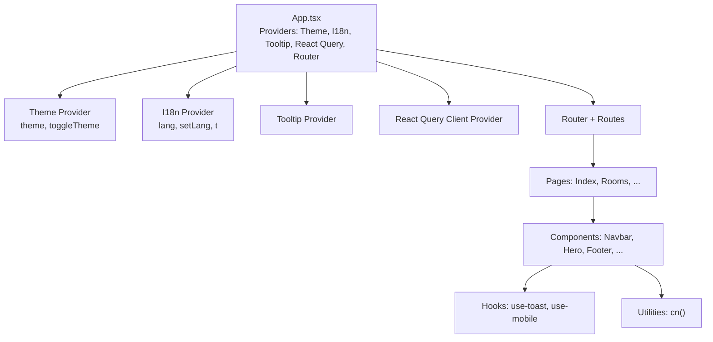
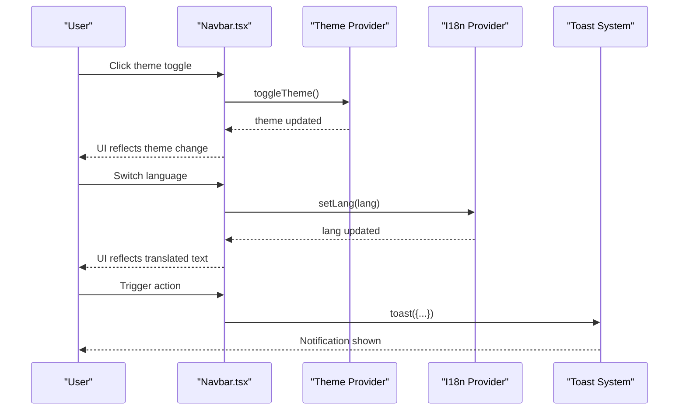
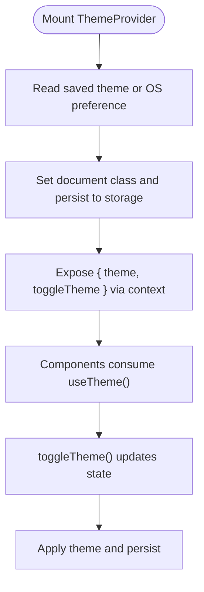
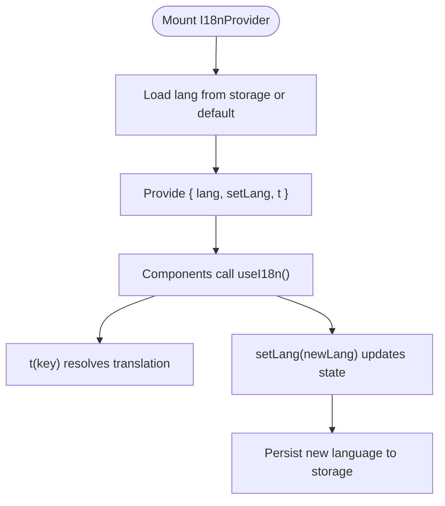
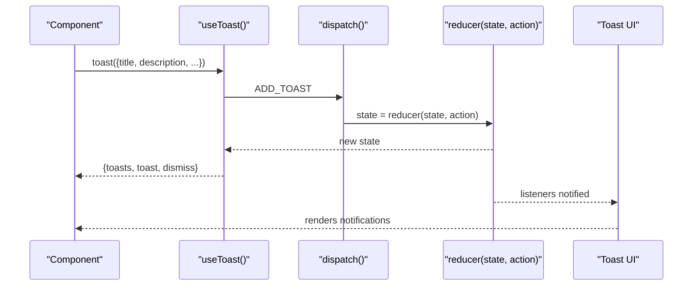
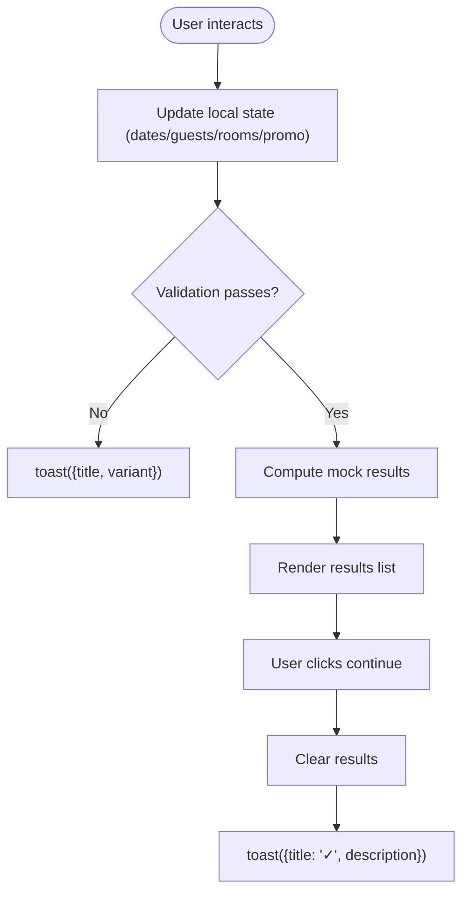
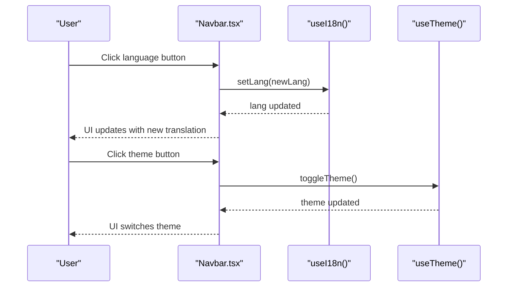
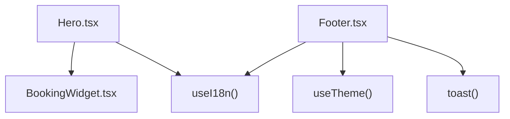
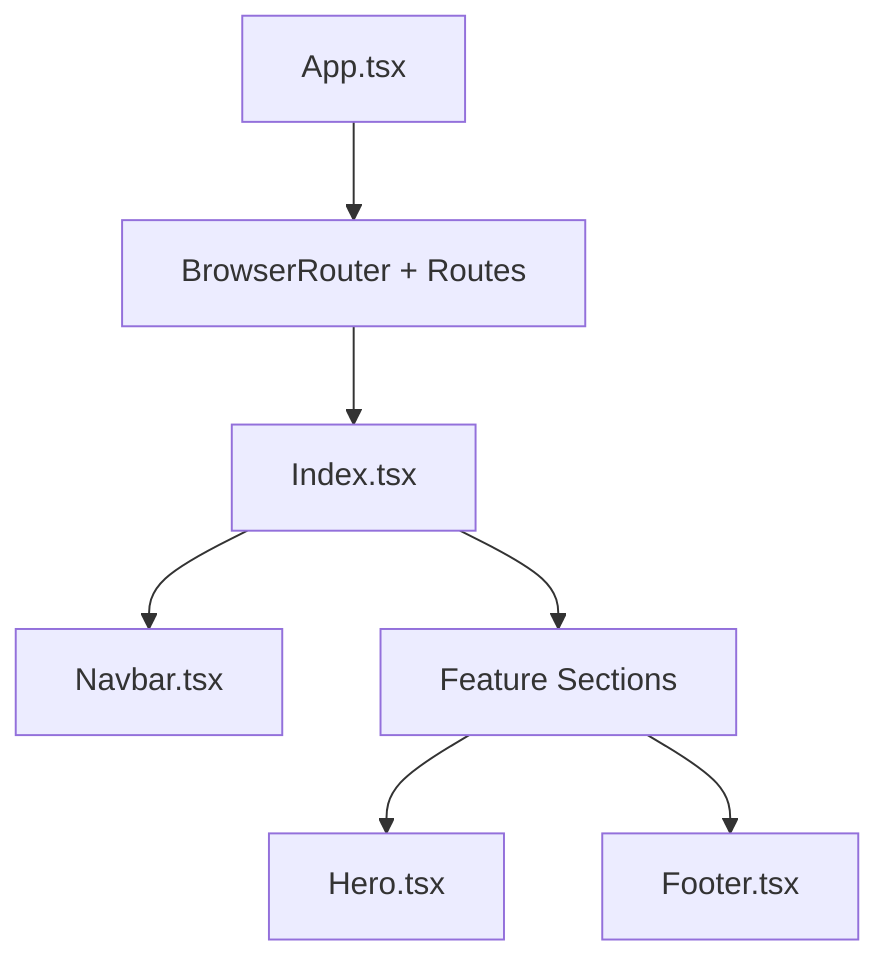
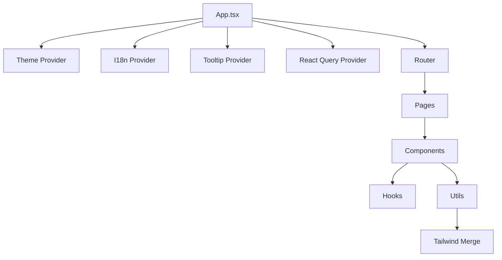

# Data Flow and Communication Patterns

<cite>
**Referenced Files in This Document**
- [App.tsx](file://src/App.tsx)
- [main.tsx](file://src/main.tsx)
- [theme.tsx](file://src/lib/theme.tsx)
- [i18n.tsx](file://src/lib/i18n.tsx)
- [use-toast.ts](file://src/hooks/use-toast.ts)
- [use-toast.ts (UI)](file://src/components/ui/use-toast.ts)
- [Navbar.tsx](file://src/components/Navbar.tsx)
- [Hero.tsx](file://src/components/Hero.tsx)
- [BookingWidget.tsx](file://src/components/BookingWidget.tsx)
- [Footer.tsx](file://src/components/Footer.tsx)
- [Index.tsx](file://src/pages/Index.tsx)
- [utils.ts](file://src/lib/utils.ts)
- [package.json](file://package.json)
</cite>

## Table of Contents
1. [Introduction](#introduction)
2. [Project Structure](#project-structure)
3. [Core Components](#core-components)
4. [Architecture Overview](#architecture-overview)
5. [Detailed Component Analysis](#detailed-component-analysis)
6. [Dependency Analysis](#dependency-analysis)
7. [Performance Considerations](#performance-considerations)
8. [Troubleshooting Guide](#troubleshooting-guide)
9. [Conclusion](#conclusion)

## Introduction
This document explains how data flows and communicates across the application. It focuses on unidirectional data flow principles, context-based state sharing, and how data moves between components. It also documents provider integration patterns, alternatives to prop drilling, event handling and callback chains, state synchronization, data transformation, caching strategies using React Query, local state management, the role of hooks, and performance considerations to avoid unnecessary re-renders.

## Project Structure
The application initializes providers at the root and composes page-level components. Providers supply global state and services to the component tree. Routing is handled by the router, and UI components rely on shared contexts and utilities.

**Diagram sources**
- [App.tsx](file://src/App.tsx#L1-L45)
- [theme.tsx](file://src/lib/theme.tsx#L1-L36)
- [i18n.tsx](file://src/lib/i18n.tsx#L1-L173)

**Section sources**
- [App.tsx](file://src/App.tsx#L1-L45)
- [main.tsx](file://src/main.tsx#L1-L6)

## Core Components
- Providers and Global State
  - Theme provider manages light/dark mode and persists preferences.
  - Internationalization provider manages language selection and translation lookup.
  - Toast system provides a global notification bus with reducer-driven updates.
  - React Query provider enables caching and server state management.
  - Tooltip provider enhances interactive UI affordances.
- Page and Component Composition
  - The Index page composes multiple feature sections.
  - Components consume context and manage local state for UI interactions.

Key implementation references:
- Provider composition and routing: [App.tsx](file://src/App.tsx#L1-L45)
- Theme context and hook: [theme.tsx](file://src/lib/theme.tsx#L1-L36)
- I18n context and hook: [i18n.tsx](file://src/lib/i18n.tsx#L1-L173)
- Toast system internals and hook: [use-toast.ts](file://src/hooks/use-toast.ts#L1-L187), [use-toast.ts (UI)](file://src/components/ui/use-toast.ts#L1-L4)
- Utility for class merging: [utils.ts](file://src/lib/utils.ts#L1-L7)

**Section sources**
- [App.tsx](file://src/App.tsx#L1-L45)
- [theme.tsx](file://src/lib/theme.tsx#L1-L36)
- [i18n.tsx](file://src/lib/i18n.tsx#L1-L173)
- [use-toast.ts](file://src/hooks/use-toast.ts#L1-L187)
- [use-toast.ts (UI)](file://src/components/ui/use-toast.ts#L1-L4)
- [utils.ts](file://src/lib/utils.ts#L1-L7)

## Architecture Overview
The app follows a unidirectional data flow pattern:
- Providers own global state and expose it via React Context.
- Components read from context and call callbacks to mutate state.
- Local state is used for UI-only concerns (e.g., form inputs, visibility toggles).
- Event handlers trigger state updates, which propagate down the component tree.
- Notifications are dispatched globally through the toast system.

**Diagram sources**
- [Navbar.tsx](file://src/components/Navbar.tsx#L1-L131)
- [theme.tsx](file://src/lib/theme.tsx#L1-L36)
- [i18n.tsx](file://src/lib/i18n.tsx#L1-L173)
- [use-toast.ts](file://src/hooks/use-toast.ts#L1-L187)

## Detailed Component Analysis

### Theme Provider and Context
- Purpose: Manage theme state and persist preference.
- Data flow:
  - Reads initial theme from storage or prefers-color-scheme.
  - Updates DOM class and persists to storage on change.
  - Exposes toggle function to components.
- Unidirectional flow: Consumers read theme and call toggle; state updates are synchronous and immediate.

**Diagram sources**
- [theme.tsx](file://src/lib/theme.tsx#L1-L36)

**Section sources**
- [theme.tsx](file://src/lib/theme.tsx#L1-L36)

### Internationalization Provider and Context
- Purpose: Manage language and translate keys.
- Data flow:
  - Loads language from storage with fallback to default.
  - Provides translation function and setter.
  - Translations are resolved via a centralized map keyed by language.
- Unidirectional flow: Consumers call setLang and t; updates propagate immediately.

**Diagram sources**
- [i18n.tsx](file://src/lib/i18n.tsx#L1-L173)

**Section sources**
- [i18n.tsx](file://src/lib/i18n.tsx#L1-L173)

### Toast System (Global Notifications)
- Purpose: Provide a global notification bus with controlled lifecycle.
- Data flow:
  - Centralized reducer manages toasts array and limits.
  - Dispatch actions to add/update/dismiss/remove toasts.
  - Hook subscribes to state and exposes toast helpers.
  - UI toast components subscribe to the same state.
- Unidirectional flow: Components call toast() or dismiss(); dispatcher updates state; subscribers re-render.

**Diagram sources**
- [use-toast.ts](file://src/hooks/use-toast.ts#L1-L187)
- [use-toast.ts (UI)](file://src/components/ui/use-toast.ts#L1-L4)

**Section sources**
- [use-toast.ts](file://src/hooks/use-toast.ts#L1-L187)
- [use-toast.ts (UI)](file://src/components/ui/use-toast.ts#L1-L4)

### Booking Widget (Local State and Validation)
- Purpose: Collect booking criteria, validate inputs, and display mock availability.
- Data flow:
  - Local state holds dates, guests, rooms, promo code, and results.
  - Validation runs before setting results; errors show via toast.
  - Continue triggers reset and success notification.
- Unidirectional flow: Events update local state; side effects (toast) are triggered synchronously.

**Diagram sources**
- [BookingWidget.tsx](file://src/components/BookingWidget.tsx#L1-L154)
- [use-toast.ts](file://src/hooks/use-toast.ts#L1-L187)

**Section sources**
- [BookingWidget.tsx](file://src/components/BookingWidget.tsx#L1-L154)
- [use-toast.ts](file://src/hooks/use-toast.ts#L1-L187)

### Navbar (Context Consumption and UI Actions)
- Purpose: Language switching, theme toggle, navigation, and mobile menu.
- Data flow:
  - Consumes useI18n() and useTheme() to render and react to changes.
  - Triggers setLang and toggleTheme via user events.
  - Uses translation keys for labels and links.
- Unidirectional flow: Events call setters; consumers re-render with new context values.

**Diagram sources**
- [Navbar.tsx](file://src/components/Navbar.tsx#L1-L131)
- [i18n.tsx](file://src/lib/i18n.tsx#L1-L173)
- [theme.tsx](file://src/lib/theme.tsx#L1-L36)

**Section sources**
- [Navbar.tsx](file://src/components/Navbar.tsx#L1-L131)
- [i18n.tsx](file://src/lib/i18n.tsx#L1-L173)
- [theme.tsx](file://src/lib/theme.tsx#L1-L36)

### Hero and Footer (Composition and Local Forms)
- Hero composes the booking widget and uses translations for CTAs.
- Footer handles newsletter subscription with local form state and toast feedback.
- Both demonstrate unidirectional data flow: props for static content, local state for inputs, and callbacks for actions.

**Diagram sources**
- [Hero.tsx](file://src/components/Hero.tsx#L1-L53)
- [BookingWidget.tsx](file://src/components/BookingWidget.tsx#L1-L154)
- [Footer.tsx](file://src/components/Footer.tsx#L1-L103)
- [i18n.tsx](file://src/lib/i18n.tsx#L1-L173)
- [theme.tsx](file://src/lib/theme.tsx#L1-L36)
- [use-toast.ts](file://src/hooks/use-toast.ts#L1-L187)

**Section sources**
- [Hero.tsx](file://src/components/Hero.tsx#L1-L53)
- [Footer.tsx](file://src/components/Footer.tsx#L1-L103)

### Page Composition and Routing
- The Index page composes feature sections and the Navbar/Footer.
- Routing is configured at the root; components navigate via Link and react to location changes.

**Diagram sources**
- [App.tsx](file://src/App.tsx#L1-L45)
- [Index.tsx](file://src/pages/Index.tsx#L1-L28)

**Section sources**
- [Index.tsx](file://src/pages/Index.tsx#L1-L28)
- [App.tsx](file://src/App.tsx#L1-L45)

## Dependency Analysis
- Provider stack: Theme, I18n, Tooltip, React Query, Router.
- Components depend on contexts for state and services.
- Utilities like cn() support conditional class composition.
- External libraries include React Query, date-fns, radix UI, and others.

**Diagram sources**
- [App.tsx](file://src/App.tsx#L1-L45)
- [utils.ts](file://src/lib/utils.ts#L1-L7)
- [package.json](file://package.json#L15-L64)

**Section sources**
- [App.tsx](file://src/App.tsx#L1-L45)
- [utils.ts](file://src/lib/utils.ts#L1-L7)
- [package.json](file://package.json#L15-L64)

## Performance Considerations
- Minimize re-renders by:
  - Keeping heavy computations outside render or memoizing with appropriate hooks.
  - Using shallow comparisons for props and avoiding inline object/function creation in render.
  - Leveraging context to avoid deep prop drilling for frequently accessed values.
- Toast system:
  - Listeners are attached per consumer; avoid excessive subscriptions.
  - Limit concurrent notifications and batch updates when possible.
- Translation lookups:
  - Keep translation keys small and consistent; avoid dynamic keys that cause frequent re-renders.
- Local state:
  - Group related state updates to reduce re-renders; split unrelated state into separate useState calls.
- Utilities:
  - Use cn() for conditional classes to avoid expensive DOM manipulations.

[No sources needed since this section provides general guidance]

## Troubleshooting Guide
- Theme not persisting:
  - Verify local storage key and effect logic for applying classes.
  - Confirm theme toggle is invoked and state updates are reflected.
- Language not changing:
  - Ensure setLang is called and translation keys exist in the dictionary.
  - Check that t() resolves to the expected value.
- Toast not appearing:
  - Confirm toast() is called and listeners are subscribed.
  - Verify that the toast UI component is rendered and subscribed to the same state.
- Booking validation failures:
  - Inspect validation conditions and toast messages for user feedback.
  - Ensure results are cleared appropriately after continuation.

**Section sources**
- [theme.tsx](file://src/lib/theme.tsx#L1-L36)
- [i18n.tsx](file://src/lib/i18n.tsx#L1-L173)
- [use-toast.ts](file://src/hooks/use-toast.ts#L1-L187)
- [BookingWidget.tsx](file://src/components/BookingWidget.tsx#L1-L154)

## Conclusion
The application implements a clean, unidirectional data flow:
- Providers own global state and expose it via React Context.
- Components consume context and manage local state for UI concerns.
- Events trigger state updates and side effects (e.g., notifications).
- Utilities and hooks encapsulate cross-cutting concerns (theming, i18n, toasts).
- For remote data, React Query can be integrated at the root to centralize caching and synchronization.
- Following the patterns documented here helps maintain predictable state transitions, reduces prop drilling, and improves performance.

[No sources needed since this section summarizes without analyzing specific files]