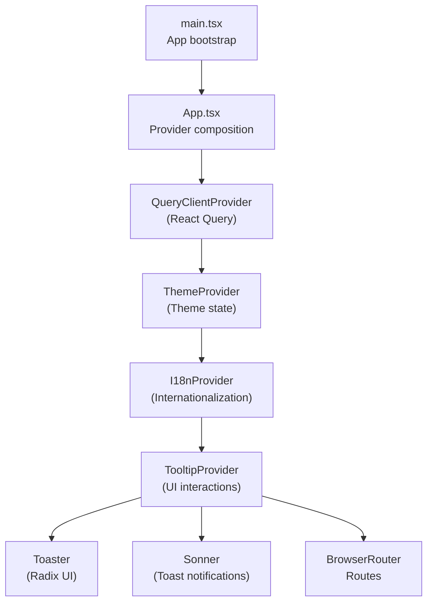
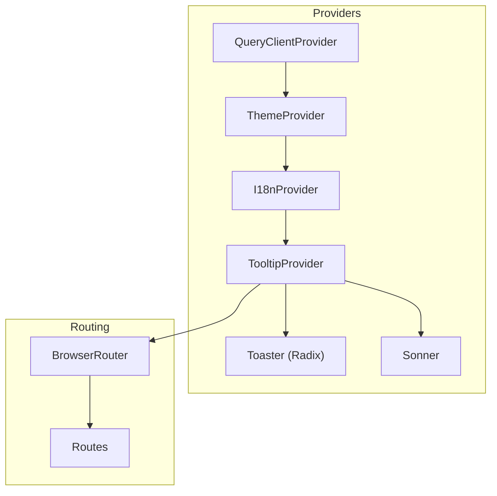
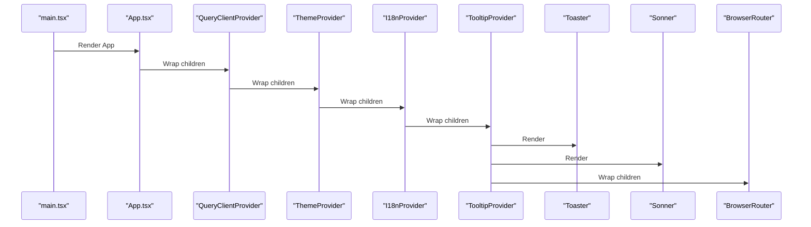
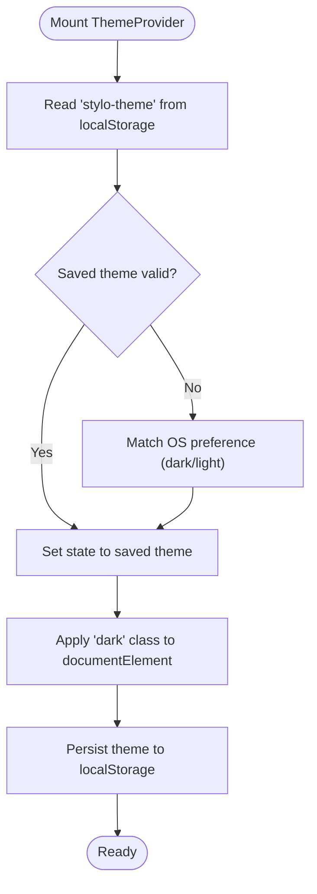
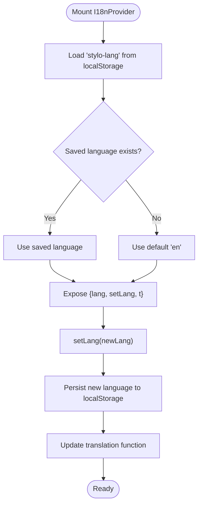
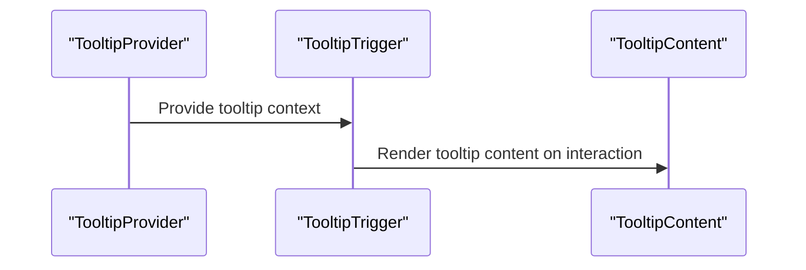
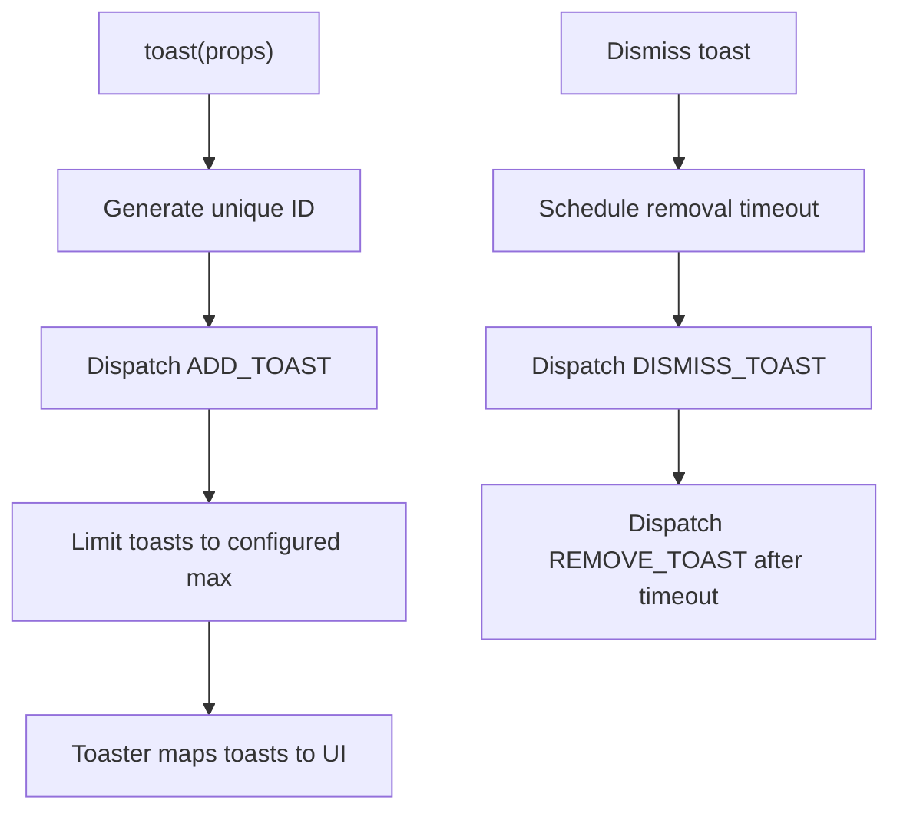
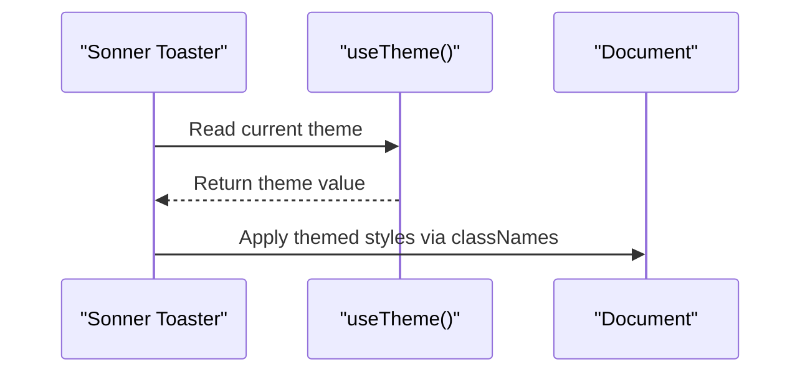
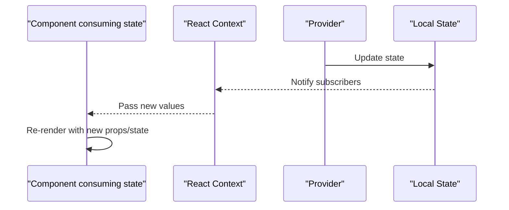
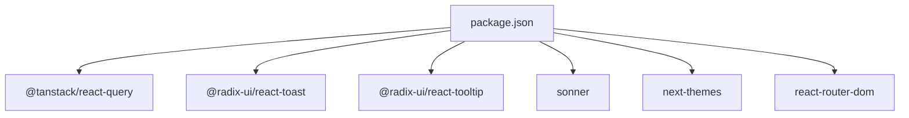

# Provider Hierarchy and State Management

<cite>
**Referenced Files in This Document**
- [App.tsx](file://src/App.tsx)
- [main.tsx](file://src/main.tsx)
- [i18n.tsx](file://src/lib/i18n.tsx)
- [theme.tsx](file://src/lib/theme.tsx)
- [use-toast.ts](file://src/hooks/use-toast.ts)
- [toast.tsx](file://src/components/ui/toast.tsx)
- [toaster.tsx](file://src/components/ui/toaster.tsx)
- [tooltip.tsx](file://src/components/ui/tooltip.tsx)
- [sonner.tsx](file://src/components/ui/sonner.tsx)
- [utils.ts](file://src/lib/utils.ts)
- [package.json](file://package.json)
</cite>

## Table of Contents
1. [Introduction](#introduction)
2. [Project Structure](#project-structure)
3. [Core Components](#core-components)
4. [Architecture Overview](#architecture-overview)
5. [Detailed Component Analysis](#detailed-component-analysis)
6. [Dependency Analysis](#dependency-analysis)
7. [Performance Considerations](#performance-considerations)
8. [Troubleshooting Guide](#troubleshooting-guide)
9. [Conclusion](#conclusion)

## Introduction
This document explains the provider hierarchy and state management patterns implemented in the application. It focuses on how the Provider Pattern is used to manage global state and cross-component communication, specifically covering:
- QueryClientProvider for React Query data fetching and caching
- ThemeProvider for theme management
- I18nProvider for internationalization
- TooltipProvider for UI interactions
- Toast notification systems via Radix UI and Sonner
- React Context API usage and provider ordering requirements
- Data flow between providers and its impact on component re-renders
- Performance implications and optimization strategies

## Project Structure
The application bootstraps at the root level and composes providers in a nested hierarchy. Providers wrap UI components and routing, enabling shared state and behavior across the entire app.

**Diagram sources**
- [main.tsx](file://src/main.tsx#L1-L6)
- [App.tsx](file://src/App.tsx#L1-L45)

**Section sources**
- [main.tsx](file://src/main.tsx#L1-L6)
- [App.tsx](file://src/App.tsx#L1-L45)

## Core Components
This section documents the primary providers and their roles in state management and cross-component communication.

- QueryClientProvider
  - Purpose: Provides React Query cache and data fetching capabilities to the app.
  - Composition: Created once and placed at the top of the provider tree.
  - Impact: Enables caching, background updates, and optimistic updates across components.

- ThemeProvider
  - Purpose: Manages theme state (light/dark) and persists user preference.
  - Implementation: Uses React Context and local storage to persist theme selection.
  - Effects: Applies theme classes to the document element and toggles UI appearance.

- I18nProvider
  - Purpose: Centralizes translation keys and language switching.
  - Implementation: Stores current language in local storage and exposes a translation function.
  - Scope: Makes language and translation available to all components.

- TooltipProvider
  - Purpose: Enables interactive tooltips across the UI using Radix UI.
  - Scope: Wraps components that use TooltipTrigger and TooltipContent.

- Toast Systems
  - Radix UI Toaster: Local toast state managed via a reducer and Context.
  - Sonner Toaster: Global toast notifications integrated with theme awareness.

**Section sources**
- [App.tsx](file://src/App.tsx#L17-L42)
- [theme.tsx](file://src/lib/theme.tsx#L12-L31)
- [i18n.tsx](file://src/lib/i18n.tsx#L148-L168)
- [tooltip.tsx](file://src/components/ui/tooltip.tsx#L6-L28)
- [toaster.tsx](file://src/components/ui/toaster.tsx#L4-L24)
- [use-toast.ts](file://src/hooks/use-toast.ts#L1-L4)

## Architecture Overview
The provider hierarchy establishes a unidirectional data flow from parent providers to child components. Changes in a provider’s state propagate down the tree, causing downstream components to re-render when they consume that state.

**Diagram sources**
- [App.tsx](file://src/App.tsx#L19-L42)
- [theme.tsx](file://src/lib/theme.tsx#L12-L31)
- [i18n.tsx](file://src/lib/i18n.tsx#L148-L168)
- [tooltip.tsx](file://src/components/ui/tooltip.tsx#L6-L28)
- [toaster.tsx](file://src/components/ui/toaster.tsx#L4-L24)
- [sonner.tsx](file://src/components/ui/sonner.tsx#L6-L25)

## Detailed Component Analysis

### Provider Hierarchy and Ordering Requirements
Provider ordering is crucial because React Context values are resolved from the nearest parent provider. The current order ensures:
- QueryClientProvider wraps all other providers so React Query can manage data for any component.
- ThemeProvider wraps I18nProvider so theme-aware components can render consistently.
- TooltipProvider wraps toast components and routing to ensure tooltips and toasts work across routes.
- Toaster and Sonner are siblings under TooltipProvider to share tooltip context and theme.

**Diagram sources**
- [main.tsx](file://src/main.tsx#L1-L6)
- [App.tsx](file://src/App.tsx#L19-L42)

**Section sources**
- [App.tsx](file://src/App.tsx#L19-L42)

### ThemeProvider and Theme State Management
ThemeProvider manages theme state using React Context and persists the user’s choice in local storage. It also applies a class to the document element to reflect the selected theme.

Key behaviors:
- Reads initial theme from local storage or prefers-color-scheme media query.
- Updates document class when theme changes.
- Exposes a toggle function to switch themes.

**Diagram sources**
- [theme.tsx](file://src/lib/theme.tsx#L12-L31)

**Section sources**
- [theme.tsx](file://src/lib/theme.tsx#L12-L31)

### I18nProvider and Internationalization State
I18nProvider centralizes language selection and translation lookup. It:
- Initializes language from local storage or defaults to English.
- Persists language changes to local storage.
- Provides a translation function that resolves keys to localized strings.

**Diagram sources**
- [i18n.tsx](file://src/lib/i18n.tsx#L148-L168)

**Section sources**
- [i18n.tsx](file://src/lib/i18n.tsx#L148-L168)

### TooltipProvider and UI Interactions
TooltipProvider enables interactive tooltips using Radix UI primitives. Components using TooltipTrigger and TooltipContent receive context from TooltipProvider.

**Diagram sources**
- [tooltip.tsx](file://src/components/ui/tooltip.tsx#L6-L28)

**Section sources**
- [tooltip.tsx](file://src/components/ui/tooltip.tsx#L6-L28)

### Toast Notification Systems
The application integrates two toast systems:
- Radix UI Toaster: Local state management via a reducer and Context.
- Sonner Toaster: Global toast notifications with theme-aware styling.

#### Radix UI Toaster
- State management: A reducer controls adding, updating, dismissing, and removing toasts.
- Concurrency: A queue tracks timeouts per toast ID to remove stale toasts.
- Consumption: Toaster renders toasts from the shared state.

**Diagram sources**
- [use-toast.ts](file://src/hooks/use-toast.ts#L71-L122)
- [toaster.tsx](file://src/components/ui/toaster.tsx#L4-L24)

**Section sources**
- [use-toast.ts](file://src/hooks/use-toast.ts#L1-L187)
- [toaster.tsx](file://src/components/ui/toaster.tsx#L4-L24)

#### Sonner Toaster
- Integration: Uses next-themes to align with the current theme.
- Styling: Applies theme-specific class names for consistent look and feel.

**Diagram sources**
- [sonner.tsx](file://src/components/ui/sonner.tsx#L6-L25)

**Section sources**
- [sonner.tsx](file://src/components/ui/sonner.tsx#L6-L25)

### Data Flow Between Providers and Component Re-renders
Changes in provider state trigger re-renders in descendant components that consume that state. For example:
- Theme changes cause components using theme-dependent styling to re-render.
- Language changes cause components using the translation function to re-render.
- Toast actions update the shared state, causing Toaster to re-render.

**Diagram sources**
- [theme.tsx](file://src/lib/theme.tsx#L12-L31)
- [i18n.tsx](file://src/lib/i18n.tsx#L148-L168)
- [use-toast.ts](file://src/hooks/use-toast.ts#L124-L133)

**Section sources**
- [theme.tsx](file://src/lib/theme.tsx#L12-L31)
- [i18n.tsx](file://src/lib/i18n.tsx#L148-L168)
- [use-toast.ts](file://src/hooks/use-toast.ts#L124-L133)

## Dependency Analysis
External libraries and their roles:
- @tanstack/react-query: Provides QueryClientProvider and caching mechanisms.
- @radix-ui/react-tooltip and @radix-ui/react-toast: Enable tooltip and toast primitives.
- sonner: Provides a modern, theme-aware toast notification system.
- next-themes: Integrates theme awareness with Sonner.
- react-router-dom: Enables routing around providers.

**Diagram sources**
- [package.json](file://package.json#L15-L64)

**Section sources**
- [package.json](file://package.json#L15-L64)

## Performance Considerations
- Minimize unnecessary re-renders:
  - Keep provider state granular; avoid storing large objects in shared contexts.
  - Memoize callbacks passed to providers to prevent prop drift.
- Toast performance:
  - Limit concurrent toasts to reduce rendering overhead.
  - Use dismissal timeouts judiciously to avoid excessive state churn.
- Theme persistence:
  - Persist theme to local storage to avoid repeated reads during mount.
- Tooltip and routing:
  - Ensure TooltipProvider wraps only necessary components to limit context propagation.
- React Query:
  - Configure cache times and invalidation strategies to balance freshness and performance.

## Troubleshooting Guide
- Provider not found errors:
  - Ensure all consumers are wrapped within the appropriate provider.
  - Verify provider ordering so child providers are nested inside parent providers.
- Theme not applying:
  - Confirm the theme provider is mounted and the document class is being applied.
  - Check local storage persistence for theme selection.
- Toasts not appearing:
  - Verify Toaster is rendered and connected to the toast state.
  - Ensure Sonner is properly integrated with theme awareness.
- Tooltip not working:
  - Confirm TooltipProvider is present and wrapping components using TooltipTrigger and TooltipContent.

## Conclusion
The provider hierarchy establishes a clean separation of concerns and enables efficient cross-component communication through React Context. By carefully ordering providers and managing state at appropriate levels, the application achieves predictable data flow, consistent UI behavior, and maintainable architecture. Integrating React Query, theme management, internationalization, tooltips, and toast systems creates a cohesive foundation for scalable UI development.