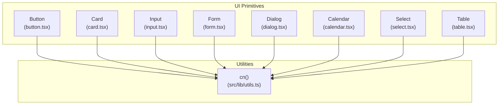
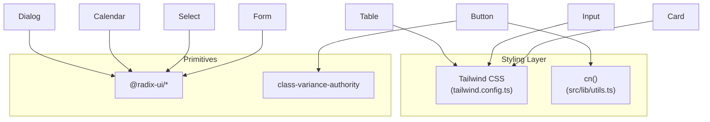
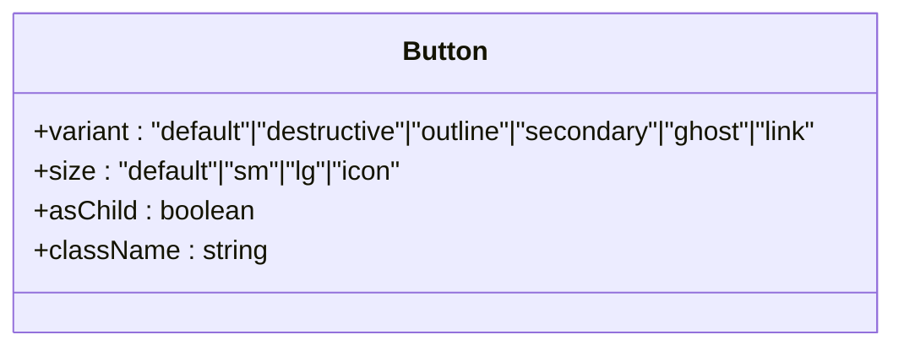
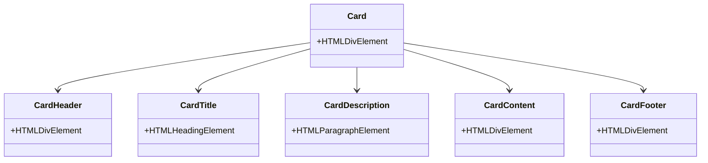
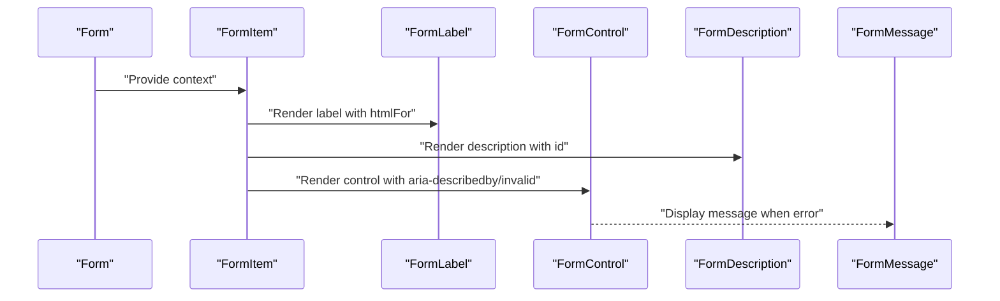
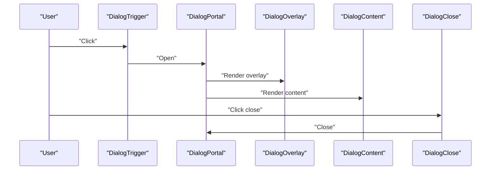
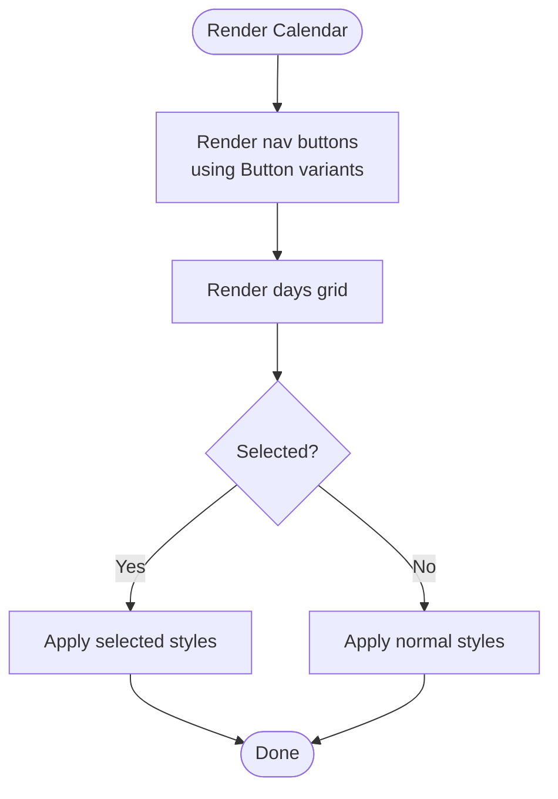
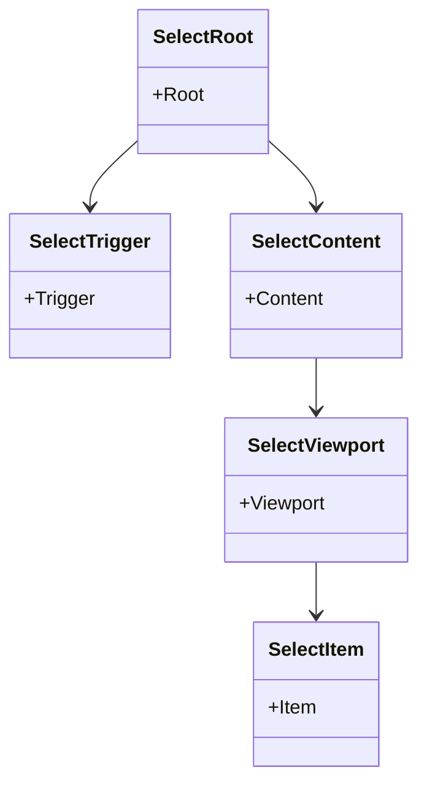
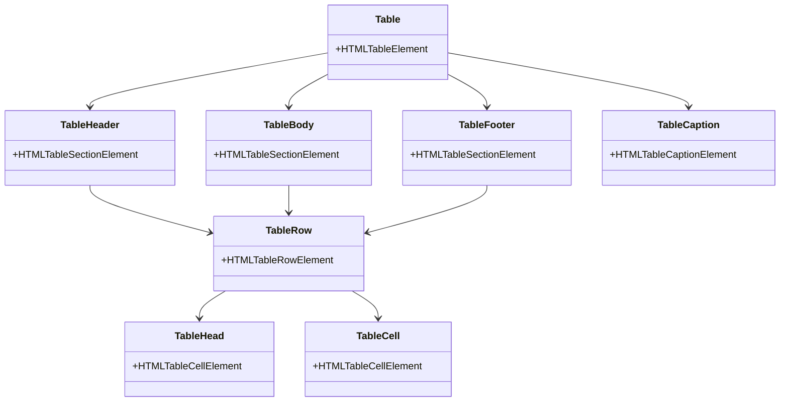
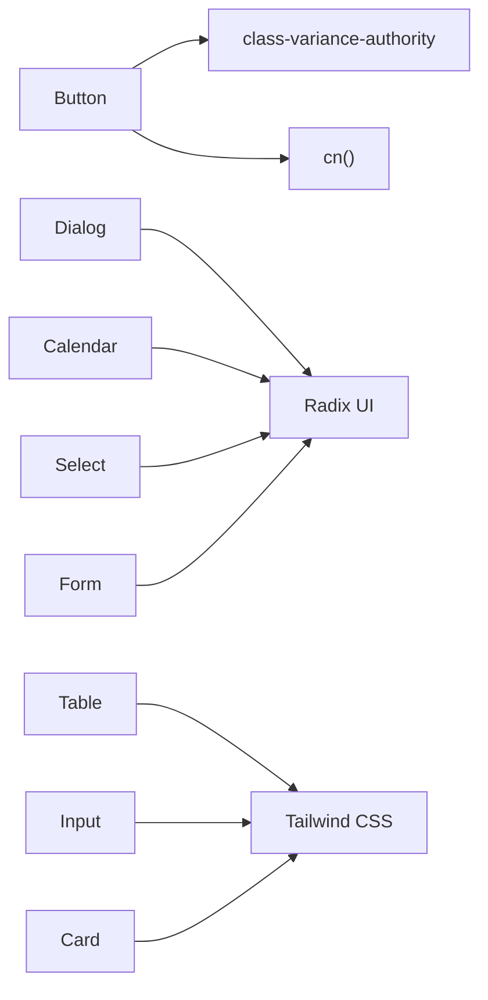

# Component Library

<cite>
**Referenced Files in This Document**
- [README.md](file://README.md)
- [package.json](file://package.json)
- [tailwind.config.ts](file://tailwind.config.ts)
- [src/lib/utils.ts](file://src/lib/utils.ts)
- [src/components/ui/button.tsx](file://src/components/ui/button.tsx)
- [src/components/ui/card.tsx](file://src/components/ui/card.tsx)
- [src/components/ui/input.tsx](file://src/components/ui/input.tsx)
- [src/components/ui/form.tsx](file://src/components/ui/form.tsx)
- [src/components/ui/dialog.tsx](file://src/components/ui/dialog.tsx)
- [src/components/ui/calendar.tsx](file://src/components/ui/calendar.tsx)
- [src/components/ui/select.tsx](file://src/components/ui/select.tsx)
- [src/components/ui/table.tsx](file://src/components/ui/table.tsx)
- [src/components/BookingWidget.tsx](file://src/components/BookingWidget.tsx)
- [src/components/Navbar.tsx](file://src/components/Navbar.tsx)
</cite>

## Table of Contents
1. [Introduction](#introduction)
2. [Project Structure](#project-structure)
3. [Core Components](#core-components)
4. [Architecture Overview](#architecture-overview)
5. [Detailed Component Analysis](#detailed-component-analysis)
6. [Dependency Analysis](#dependency-analysis)
7. [Performance Considerations](#performance-considerations)
8. [Troubleshooting Guide](#troubleshooting-guide)
9. [Conclusion](#conclusion)
10. [Appendices](#appendices)

## Introduction
This document describes the component library built with shadcn/ui primitives. It focuses on the following UI primitives: Button, Card, Input, Form, Dialog, Calendar, Select, and Table. For each component, we explain visual appearance, behavior, props interface, customization options, and usage patterns. We also cover accessibility features, responsive behavior, styling customization via Tailwind CSS, composition patterns, state management integration, performance considerations, and guidelines for extending components while maintaining design consistency.

The project uses:
- React with TypeScript
- Radix UI for accessible base primitives
- class-variance-authority for variant-driven styling
- Tailwind CSS for styling and responsive behavior
- react-hook-form for form handling

**Section sources**
- [README.md](file://README.md#L53-L61)
- [package.json](file://package.json#L15-L64)

## Project Structure
The component library resides under src/components/ui. Each primitive is implemented as a small, composable module exporting one or more components and helpers. Shared utilities live under src/lib, including a centralized cn function for merging Tailwind classes.



**Diagram sources**
- [src/components/ui/button.tsx](file://src/components/ui/button.tsx#L1-L48)
- [src/components/ui/card.tsx](file://src/components/ui/card.tsx#L1-L44)
- [src/components/ui/input.tsx](file://src/components/ui/input.tsx#L1-L23)
- [src/components/ui/form.tsx](file://src/components/ui/form.tsx#L1-L130)
- [src/components/ui/dialog.tsx](file://src/components/ui/dialog.tsx#L1-L96)
- [src/components/ui/calendar.tsx](file://src/components/ui/calendar.tsx#L1-L55)
- [src/components/ui/select.tsx](file://src/components/ui/select.tsx#L1-L144)
- [src/components/ui/table.tsx](file://src/components/ui/table.tsx#L1-L73)
- [src/lib/utils.ts](file://src/lib/utils.ts#L1-L7)

**Section sources**
- [src/lib/utils.ts](file://src/lib/utils.ts#L1-L7)
- [tailwind.config.ts](file://tailwind.config.ts#L1-L86)

## Core Components
This section summarizes the core UI primitives and their primary responsibilities.

- Button: Variants and sizes with accessible focus states and SVG support.
- Card: Composite layout with header, title, description, content, and footer slots.
- Input: Styled text input with focus and disabled states.
- Form: Integration with react-hook-form, accessible labels, descriptions, and messages.
- Dialog: Modal overlay with animated content and close controls.
- Calendar: Date picker built on react-day-picker with integrated button styles.
- Select: Dropdown with trigger, content, items, and scroll buttons.
- Table: Scrollable table wrapper with semantic headers, rows, cells, and captions.

**Section sources**
- [src/components/ui/button.tsx](file://src/components/ui/button.tsx#L1-L48)
- [src/components/ui/card.tsx](file://src/components/ui/card.tsx#L1-L44)
- [src/components/ui/input.tsx](file://src/components/ui/input.tsx#L1-L23)
- [src/components/ui/form.tsx](file://src/components/ui/form.tsx#L1-L130)
- [src/components/ui/dialog.tsx](file://src/components/ui/dialog.tsx#L1-L96)
- [src/components/ui/calendar.tsx](file://src/components/ui/calendar.tsx#L1-L55)
- [src/components/ui/select.tsx](file://src/components/ui/select.tsx#L1-L144)
- [src/components/ui/table.tsx](file://src/components/ui/table.tsx#L1-L73)

## Architecture Overview
The components rely on:
- Radix UI for accessible semantics and keyboard interactions
- class-variance-authority for variant-driven class composition
- Tailwind CSS for styling and responsive breakpoints
- cn utility for safe class merging



**Diagram sources**
- [tailwind.config.ts](file://tailwind.config.ts#L1-L86)
- [src/lib/utils.ts](file://src/lib/utils.ts#L1-L7)
- [src/components/ui/button.tsx](file://src/components/ui/button.tsx#L1-L48)
- [src/components/ui/dialog.tsx](file://src/components/ui/dialog.tsx#L1-L96)
- [src/components/ui/calendar.tsx](file://src/components/ui/calendar.tsx#L1-L55)
- [src/components/ui/select.tsx](file://src/components/ui/select.tsx#L1-L144)
- [src/components/ui/form.tsx](file://src/components/ui/form.tsx#L1-L130)
- [src/components/ui/table.tsx](file://src/components/ui/table.tsx#L1-L73)
- [src/components/ui/input.tsx](file://src/components/ui/input.tsx#L1-L23)
- [src/components/ui/card.tsx](file://src/components/ui/card.tsx#L1-L44)

## Detailed Component Analysis

### Button
- Visual appearance: Rounded, padded, with ring focus and disabled state handling. Variants include default, destructive, outline, secondary, ghost, and link. Sizes include default, small, large, and icon.
- Behavior: Supports asChild forwarding to render any element. Inherits native button attributes and integrates with SVG icons.
- Props interface: Extends HTMLButtonElement attributes plus variant, size, and asChild.
- Customization: Use variant and size to change appearance. Add extra Tailwind classes via className.
- Accessibility: Focus-visible ring, proper disabled pointer-events and opacity.
- Responsive behavior: Uses fluid spacing and typography classes; adjust sizes for mobile/desktop.
- Usage patterns:
  - As a link-like button: use variant "link".
  - Icon-only button: use size "icon".
  - Compose with icons: place SVG inside the button element.
- Integration examples:
  - See usage in [src/components/BookingWidget.tsx](file://src/components/BookingWidget.tsx#L129-L134) and [src/components/Navbar.tsx](file://src/components/Navbar.tsx#L75-L80).



**Diagram sources**
- [src/components/ui/button.tsx](file://src/components/ui/button.tsx#L33-L44)

**Section sources**
- [src/components/ui/button.tsx](file://src/components/ui/button.tsx#L1-L48)
- [src/components/BookingWidget.tsx](file://src/components/BookingWidget.tsx#L129-L134)
- [src/components/Navbar.tsx](file://src/components/Navbar.tsx#L75-L80)

### Card
- Visual appearance: Rounded border, background, and subtle shadow. Provides structured slots for header, title, description, content, and footer.
- Behavior: Each slot is a forwardRef component exposing className passthrough.
- Props interface: All slots accept standard HTML attributes; header/title/description/content/footer expose HTML attributes for their respective elements.
- Customization: Apply Tailwind classes to any slot via className.
- Accessibility: No explicit ARIA roles; structure via semantic HTML.
- Responsive behavior: Header and footer layouts adapt to stacking vs. flex alignment.
- Usage patterns:
  - Combine CardHeader with CardTitle and CardDescription.
  - Use CardContent for body content and CardFooter for actions.
- Integration examples:
  - See composite usage in [src/components/BookingWidget.tsx](file://src/components/BookingWidget.tsx#L47-L151).



**Diagram sources**
- [src/components/ui/card.tsx](file://src/components/ui/card.tsx#L5-L43)

**Section sources**
- [src/components/ui/card.tsx](file://src/components/ui/card.tsx#L1-L44)
- [src/components/BookingWidget.tsx](file://src/components/BookingWidget.tsx#L47-L151)

### Input
- Visual appearance: Full-width input with rounded borders, background, placeholder styling, and focus ring.
- Behavior: Accepts standard input attributes and forwards ref.
- Props interface: Extends ComponentProps for input; supports type and className.
- Customization: Extend via className; responsive text sizing applied conditionally.
- Accessibility: Inherits native input semantics and focus management.
- Responsive behavior: Uses larger base font on mobile and smaller on larger screens.
- Usage patterns:
  - Use within forms and dialogs.
  - Combine with icons or labels for clarity.
- Integration examples:
  - See usage in [src/components/BookingWidget.tsx](file://src/components/BookingWidget.tsx#L120-L127).

```mermermaid
classDiagram
  class Input {
    +type: string
    +className: string
  }
```

**Diagram sources**
- [src/components/ui/input.tsx](file://src/components/ui/input.tsx#L5-L19)

**Section sources**
- [src/components/ui/input.tsx](file://src/components/ui/input.tsx#L1-L23)
- [src/components/BookingWidget.tsx](file://src/components/BookingWidget.tsx#L120-L127)

### Form
- Visual appearance: Provides accessible form field composition with labels, descriptions, controls, and error messages.
- Behavior: Integrates with react-hook-form via FormProvider and Controller. Generates unique IDs for accessibility and manages aria-invalid and aria-describedby.
- Props interface: Form, FormItem, FormLabel, FormControl, FormDescription, FormMessage, FormField accept standard attributes and react-hook-form props.
- Customization: Style labels, descriptions, and messages via className; errors propagate automatically.
- Accessibility: Ensures aria-* attributes are set for assistive tech.
- Responsive behavior: Layout is agnostic; combine with grid/flex utilities.
- Usage patterns:
  - Wrap fields in FormItem.
  - Use FormLabel and FormDescription for clarity.
  - Render FormControl with child components (e.g., Input, Select).
  - Display FormMessage for validation feedback.
- Integration examples:
  - See usage in [src/components/BookingWidget.tsx](file://src/components/BookingWidget.tsx#L25-L39).



**Diagram sources**
- [src/components/ui/form.tsx](file://src/components/ui/form.tsx#L62-L127)

**Section sources**
- [src/components/ui/form.tsx](file://src/components/ui/form.tsx#L1-L130)
- [src/components/BookingWidget.tsx](file://src/components/BookingWidget.tsx#L25-L39)

### Dialog
- Visual appearance: Centered modal with backdrop overlay and animated entrance/exit. Includes header, footer, title, and description areas.
- Behavior: Uses Radix UI primitives for portal rendering, overlay, and content. Close button is accessible and visually hidden for screen readers.
- Props interface: Dialog, DialogTrigger, DialogPortal, DialogOverlay, DialogClose, DialogContent, DialogHeader, DialogFooter, DialogTitle, DialogDescription.
- Customization: Pass className to content and overlay; adjust animations via Tailwind utilities.
- Accessibility: Focus trapping, escape key handling, and ARIA attributes managed by Radix UI.
- Responsive behavior: Content centers and scales; footer stacks on small screens.
- Usage patterns:
  - Trigger opens the dialog; overlay and close handle dismissal.
  - Use DialogHeader/DialogFooter for structured layouts.
- Integration examples:
  - See usage in [src/components/BookingWidget.tsx](file://src/components/BookingWidget.tsx#L52-L81).



**Diagram sources**
- [src/components/ui/dialog.tsx](file://src/components/ui/dialog.tsx#L7-L52)

**Section sources**
- [src/components/ui/dialog.tsx](file://src/components/ui/dialog.tsx#L1-L96)
- [src/components/BookingWidget.tsx](file://src/components/BookingWidget.tsx#L52-L81)

### Calendar
- Visual appearance: Month grid with navigation buttons and day cells styled as ghost or primary buttons.
- Behavior: Delegates to react-day-picker; integrates with Button variants for nav and day cells.
- Props interface: Extends DayPicker props; accepts className and classNames overrides.
- Customization: Override classNames for months, caption, table, head_row, head_cell, row, cell, day, and others.
- Accessibility: Uses DayPicker’s native keyboard navigation and ARIA attributes.
- Responsive behavior: Stacks months vertically on small screens; horizontal layout on larger screens.
- Usage patterns:
  - Use as a popover content for date selection.
  - Control selected date via state and pass to Calendar.
- Integration examples:
  - See usage in [src/components/BookingWidget.tsx](file://src/components/BookingWidget.tsx#L62-L81).



**Diagram sources**
- [src/components/ui/calendar.tsx](file://src/components/ui/calendar.tsx#L10-L51)

**Section sources**
- [src/components/ui/calendar.tsx](file://src/components/ui/calendar.tsx#L1-L55)
- [src/components/BookingWidget.tsx](file://src/components/BookingWidget.tsx#L62-L81)

### Select
- Visual appearance: Trigger with chevron icon; dropdown content with viewport and scroll buttons.
- Behavior: Uses Radix UI Select primitives; supports groups, labels, items, separators, and scrolling.
- Props interface: Select, SelectGroup, SelectValue, SelectTrigger, SelectContent, SelectLabel, SelectItem, SelectSeparator, SelectScrollUpButton, SelectScrollDownButton.
- Customization: Customize trigger, content, items, and separators via className; adjust positioning with popper behavior.
- Accessibility: Keyboard navigation, ARIA attributes, and focus management handled by Radix UI.
- Responsive behavior: Content adapts to available space; popper side adjustments apply.
- Usage patterns:
  - Use SelectTrigger as child of Popover/Dialog for inline selection.
  - Populate items dynamically and handle selection via controlled state.
- Integration examples:
  - See usage in [src/components/BookingWidget.tsx](file://src/components/BookingWidget.tsx#L88-L114).



**Diagram sources**
- [src/components/ui/select.tsx](file://src/components/ui/select.tsx#L7-L143)

**Section sources**
- [src/components/ui/select.tsx](file://src/components/ui/select.tsx#L1-L144)
- [src/components/BookingWidget.tsx](file://src/components/BookingWidget.tsx#L88-L114)

### Table
- Visual appearance: Scrollable container with striped rows and hover effects; semantic header/body/footer and caption.
- Behavior: Wraps table in a scroll container; applies hover and selection states via data attributes.
- Props interface: Table, TableHeader, TableBody, TableFooter, TableHead, TableRow, TableCell, TableCaption.
- Customization: Adjust paddings, alignments, and colors via className; caption styling supported.
- Accessibility: Semantic HTML table structure; ensure headers and captions are present.
- Responsive behavior: Horizontal scrolling container enables viewing on small screens.
- Usage patterns:
  - Use TableHeader/TableBody/TableFooter for structure.
  - Apply hover and selection styling via data attributes.
- Integration examples:
  - See usage in [src/components/BookingWidget.tsx](file://src/components/BookingWidget.tsx#L137-L150).



**Diagram sources**
- [src/components/ui/table.tsx](file://src/components/ui/table.tsx#L5-L72)

**Section sources**
- [src/components/ui/table.tsx](file://src/components/ui/table.tsx#L1-L73)
- [src/components/BookingWidget.tsx](file://src/components/BookingWidget.tsx#L137-L150)

## Dependency Analysis
The components depend on:
- Radix UI primitives for accessible base behavior
- class-variance-authority for variant composition
- Tailwind CSS for styling and responsive utilities
- cn utility for safe class merging



**Diagram sources**
- [src/components/ui/button.tsx](file://src/components/ui/button.tsx#L1-L48)
- [src/components/ui/dialog.tsx](file://src/components/ui/dialog.tsx#L1-L96)
- [src/components/ui/calendar.tsx](file://src/components/ui/calendar.tsx#L1-L55)
- [src/components/ui/select.tsx](file://src/components/ui/select.tsx#L1-L144)
- [src/components/ui/form.tsx](file://src/components/ui/form.tsx#L1-L130)
- [src/components/ui/table.tsx](file://src/components/ui/table.tsx#L1-L73)
- [src/components/ui/input.tsx](file://src/components/ui/input.tsx#L1-L23)
- [src/components/ui/card.tsx](file://src/components/ui/card.tsx#L1-L44)
- [src/lib/utils.ts](file://src/lib/utils.ts#L1-L7)
- [tailwind.config.ts](file://tailwind.config.ts#L1-L86)

**Section sources**
- [package.json](file://package.json#L15-L64)
- [tailwind.config.ts](file://tailwind.config.ts#L1-L86)
- [src/lib/utils.ts](file://src/lib/utils.ts#L1-L7)

## Performance Considerations
- Prefer variant composition over runtime style objects to keep renders fast.
- Use className to extend styles rather than heavy wrappers to minimize DOM depth.
- For large tables, consider virtualization libraries to reduce DOM nodes.
- Avoid unnecessary re-renders by lifting state and memoizing derived values.
- Keep animations minimal; leverage Tailwind transitions sparingly.

[No sources needed since this section provides general guidance]

## Troubleshooting Guide
- Button disabled state: Ensure disabled prop is set; pointer-events and opacity are handled internally.
- Form accessibility: If labels or messages do not appear, confirm useFormField is used within FormItem and that react-hook-form context is provided.
- Dialog focus trap: If focus escapes, ensure DialogPortal and DialogOverlay are rendered and DialogContent is mounted.
- Calendar navigation: Verify showOutsideDays and classNames overrides do not hide essential controls.
- Select scrolling: If items are clipped, ensure viewport sizing and scroll buttons are included.
- Table responsiveness: On narrow screens, ensure parent containers allow horizontal scrolling.

**Section sources**
- [src/components/ui/button.tsx](file://src/components/ui/button.tsx#L33-L44)
- [src/components/ui/form.tsx](file://src/components/ui/form.tsx#L33-L54)
- [src/components/ui/dialog.tsx](file://src/components/ui/dialog.tsx#L30-L52)
- [src/components/ui/calendar.tsx](file://src/components/ui/calendar.tsx#L10-L51)
- [src/components/ui/select.tsx](file://src/components/ui/select.tsx#L61-L90)
- [src/components/ui/table.tsx](file://src/components/ui/table.tsx#L5-L11)

## Conclusion
The component library leverages shadcn/ui primitives with Radix UI and Tailwind CSS to deliver accessible, customizable, and responsive UI components. By composing Button, Card, Input, Form, Dialog, Calendar, Select, and Table, teams can maintain consistent design and behavior across the application. Follow the usage patterns and customization guidelines to extend components safely and efficiently.

[No sources needed since this section summarizes without analyzing specific files]

## Appendices

### A. Props Reference Summary
- Button: variant, size, asChild, className, and native button attributes.
- Card: className for Card/CardHeader/CardTitle/CardDescription/CardContent/CardFooter.
- Input: type, className, and native input attributes.
- Form: Form, FormItem, FormLabel, FormControl, FormDescription, FormMessage, FormField with react-hook-form props.
- Dialog: Dialog, DialogTrigger, DialogPortal, DialogOverlay, DialogClose, DialogContent, DialogHeader, DialogFooter, DialogTitle, DialogDescription.
- Calendar: DayPicker props, className, classNames overrides.
- Select: Root, Group, Value, Trigger, Content, Label, Item, Separator, ScrollUp/Down buttons.
- Table: Table, TableHeader, TableBody, TableFooter, TableHead, TableRow, TableCell, TableCaption.

**Section sources**
- [src/components/ui/button.tsx](file://src/components/ui/button.tsx#L33-L44)
- [src/components/ui/card.tsx](file://src/components/ui/card.tsx#L5-L43)
- [src/components/ui/input.tsx](file://src/components/ui/input.tsx#L5-L19)
- [src/components/ui/form.tsx](file://src/components/ui/form.tsx#L9-L129)
- [src/components/ui/dialog.tsx](file://src/components/ui/dialog.tsx#L7-L95)
- [src/components/ui/calendar.tsx](file://src/components/ui/calendar.tsx#L8-L51)
- [src/components/ui/select.tsx](file://src/components/ui/select.tsx#L7-L143)
- [src/components/ui/table.tsx](file://src/components/ui/table.tsx#L5-L72)

### B. Styling and Theming
- Tailwind configuration defines color scales, border radius, and animations; use semantic color names for consistent theming.
- cn utility merges classes safely; avoid conflicting Tailwind utilities.

**Section sources**
- [tailwind.config.ts](file://tailwind.config.ts#L1-L86)
- [src/lib/utils.ts](file://src/lib/utils.ts#L1-L7)