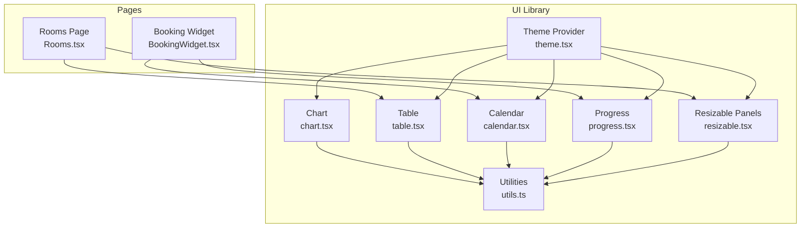
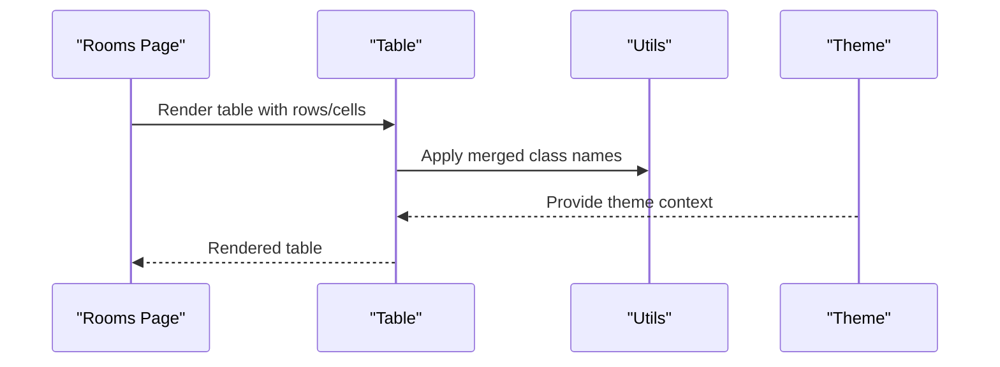
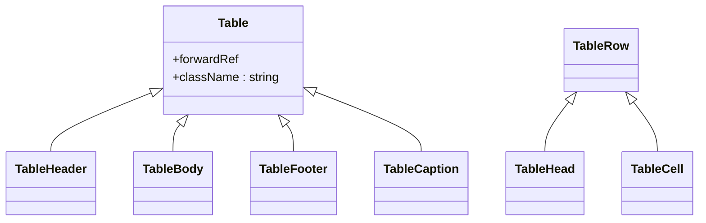
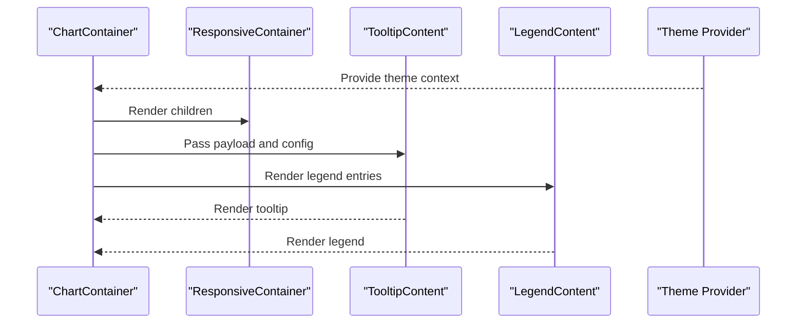
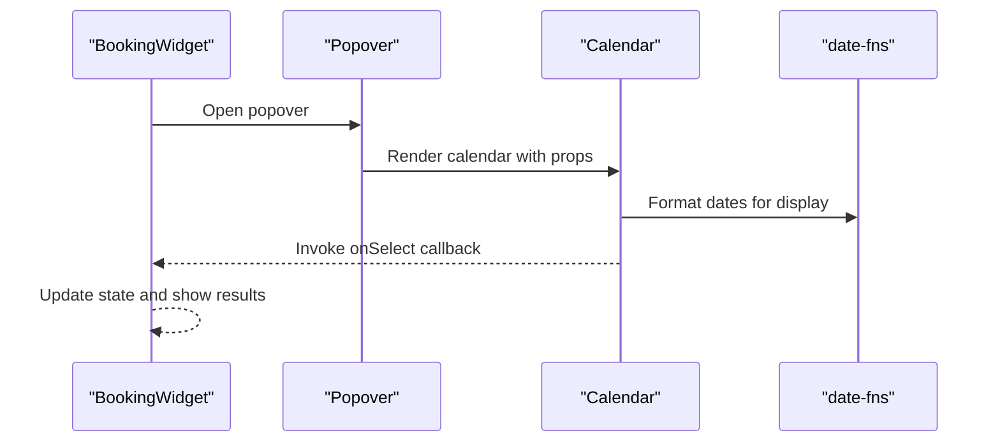
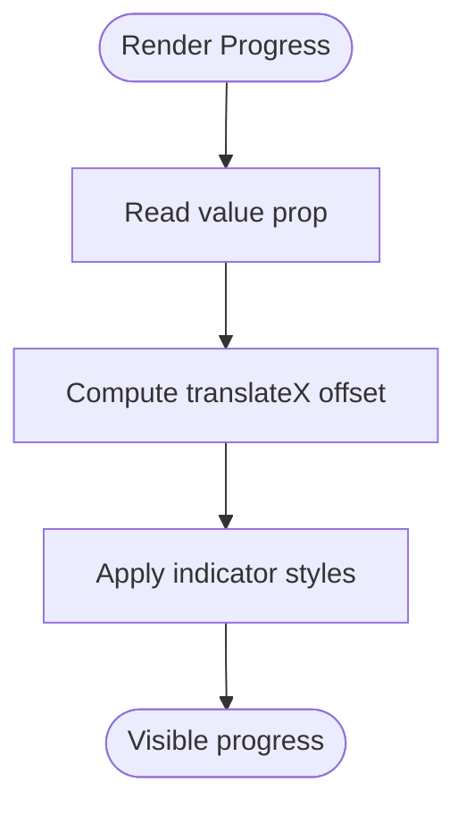
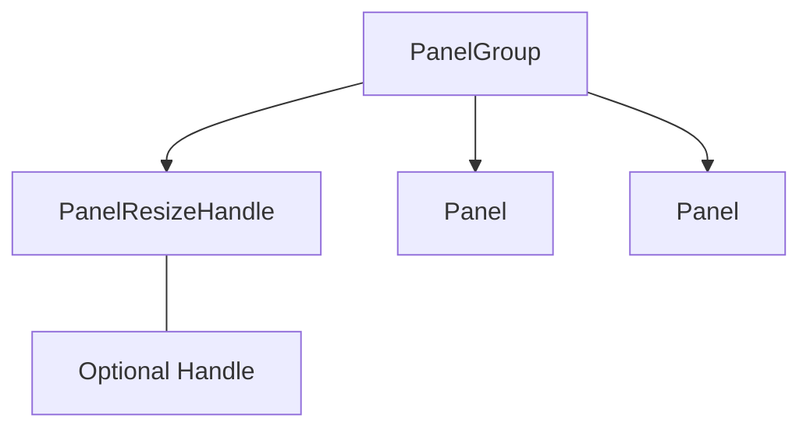
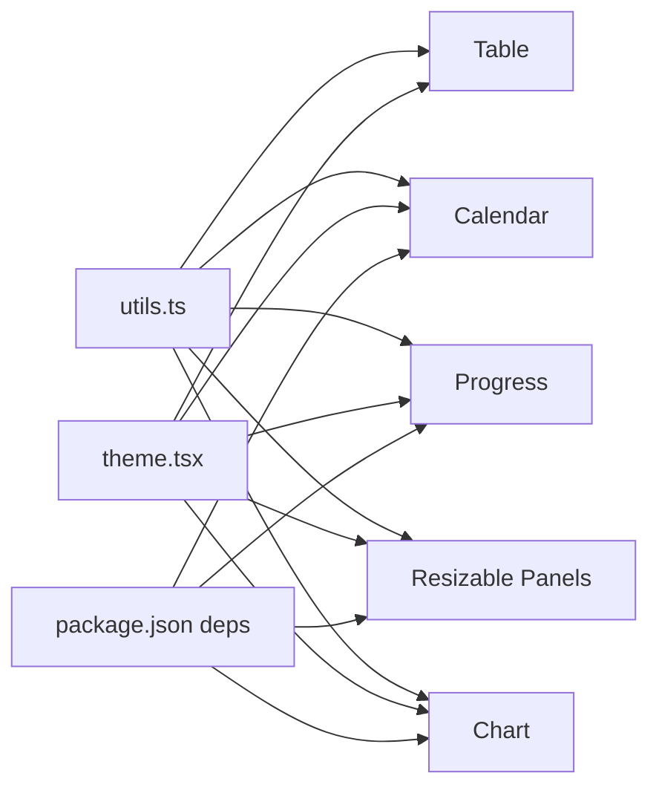

# Data Display Components

<cite>
**Referenced Files in This Document**
- [table.tsx](file://src/components/ui/table.tsx)
- [chart.tsx](file://src/components/ui/chart.tsx)
- [calendar.tsx](file://src/components/ui/calendar.tsx)
- [progress.tsx](file://src/components/ui/progress.tsx)
- [resizable.tsx](file://src/components/ui/resizable.tsx)
- [utils.ts](file://src/lib/utils.ts)
- [theme.tsx](file://src/lib/theme.tsx)
- [package.json](file://package.json)
- [Rooms.tsx](file://src/pages/Rooms.tsx)
- [BookingWidget.tsx](file://src/components/BookingWidget.tsx)
</cite>

## Table of Contents
1. [Introduction](#introduction)
2. [Project Structure](#project-structure)
3. [Core Components](#core-components)
4. [Architecture Overview](#architecture-overview)
5. [Detailed Component Analysis](#detailed-component-analysis)
6. [Dependency Analysis](#dependency-analysis)
7. [Performance Considerations](#performance-considerations)
8. [Troubleshooting Guide](#troubleshooting-guide)
9. [Conclusion](#conclusion)

## Introduction
This document provides comprehensive documentation for data display and visualization components that present information in structured formats. It focuses on Table, Chart, Calendar, Progress, and Resizable components, covering their data binding patterns, rendering optimizations, interaction capabilities, customization options, and integration with external data sources and state management systems. It also addresses virtualization techniques for large datasets, accessibility features for screen readers and keyboard navigation, and responsive design adaptations.

## Project Structure
The data display components are implemented as reusable UI primitives under the UI library. They integrate with utility helpers for styling and theming, and are consumed by page-level components such as Rooms and BookingWidget.

**Diagram sources**
- [table.tsx](file://src/components/ui/table.tsx#L1-L73)
- [chart.tsx](file://src/components/ui/chart.tsx#L1-L304)
- [calendar.tsx](file://src/components/ui/calendar.tsx#L1-L55)
- [progress.tsx](file://src/components/ui/progress.tsx#L1-L24)
- [resizable.tsx](file://src/components/ui/resizable.tsx#L1-L38)
- [utils.ts](file://src/lib/utils.ts#L1-L7)
- [theme.tsx](file://src/lib/theme.tsx#L1-L36)
- [Rooms.tsx](file://src/pages/Rooms.tsx#L1-L102)
- [BookingWidget.tsx](file://src/components/BookingWidget.tsx#L1-L154)

**Section sources**
- [table.tsx](file://src/components/ui/table.tsx#L1-L73)
- [chart.tsx](file://src/components/ui/chart.tsx#L1-L304)
- [calendar.tsx](file://src/components/ui/calendar.tsx#L1-L55)
- [progress.tsx](file://src/components/ui/progress.tsx#L1-L24)
- [resizable.tsx](file://src/components/ui/resizable.tsx#L1-L38)
- [utils.ts](file://src/lib/utils.ts#L1-L7)
- [theme.tsx](file://src/lib/theme.tsx#L1-L36)
- [Rooms.tsx](file://src/pages/Rooms.tsx#L1-L102)
- [BookingWidget.tsx](file://src/components/BookingWidget.tsx#L1-L154)

## Core Components
This section summarizes the responsibilities and key features of each component.

- Table: Provides a responsive, accessible table container with header, body, footer, rows, cells, and captions. It supports hover and selection states and integrates with Tailwind-based styling via a shared utility.
- Chart: A wrapper around a responsive charting library with theme-aware color configuration, tooltips, legends, and a styled container. It exposes typed configuration for series and themes.
- Calendar: A localized, accessible date picker built on a third-party library, with consistent styling and keyboard navigation support.
- Progress: A simple progress bar primitive backed by a UI component library, supporting numeric values and smooth transitions.
- Resizable: A panel layout system enabling draggable resizing handles with optional visual grips, suitable for split views and dashboards.

**Section sources**
- [table.tsx](file://src/components/ui/table.tsx#L1-L73)
- [chart.tsx](file://src/components/ui/chart.tsx#L1-L304)
- [calendar.tsx](file://src/components/ui/calendar.tsx#L1-L55)
- [progress.tsx](file://src/components/ui/progress.tsx#L1-L24)
- [resizable.tsx](file://src/components/ui/resizable.tsx#L1-L38)

## Architecture Overview
The components share a cohesive architecture:
- Utilities: A centralized utility function merges Tailwind classes safely.
- Theming: A theme provider toggles light/dark modes and persists preferences.
- Composition: Higher-level components (e.g., ChartContainer) encapsulate third-party primitives while exposing consistent APIs and styling hooks.
- Data flow: Page-level components manage state and pass data to primitives. For example, Rooms filters and renders room data, while BookingWidget manages booking inputs and displays availability results.

**Diagram sources**
- [Rooms.tsx](file://src/pages/Rooms.tsx#L55-L74)
- [table.tsx](file://src/components/ui/table.tsx#L1-L73)
- [utils.ts](file://src/lib/utils.ts#L1-L7)
- [theme.tsx](file://src/lib/theme.tsx#L1-L36)

## Detailed Component Analysis

### Table Component
- Purpose: Present tabular data with semantic markup and responsive scrolling.
- Data structures accepted:
  - Rows and cells are plain objects; the component renders them into HTML table elements.
  - Selection and hover states are supported via attributes and CSS classes.
- Rendering and accessibility:
  - Uses semantic table elements for screen readers.
  - Hover and selection states are styled for clarity.
- Customization:
  - Accepts standard HTML attributes and Tailwind classes via a shared utility.
  - Wraps the table in an overflow container to maintain responsiveness on small screens.
- Interaction:
  - No built-in sorting/filtering; these are typically handled by upstream data transformations.

**Diagram sources**
- [table.tsx](file://src/components/ui/table.tsx#L1-L73)

**Section sources**
- [table.tsx](file://src/components/ui/table.tsx#L1-L73)
- [Rooms.tsx](file://src/pages/Rooms.tsx#L55-L74)

### Chart Component
- Purpose: Provide a theme-aware, responsive chart container with tooltips and legends.
- Data structures accepted:
  - A typed configuration object defines series labels, icons, and colors per theme.
  - Children are passed to a responsive container from a charting library.
- Rendering and performance:
  - Uses a context to propagate configuration to tooltip/legend components.
  - Applies CSS custom properties per theme to align colors with the current theme.
- Customization:
  - Supports theme-specific colors and label/icon overrides.
  - Tooltip and legend components expose formatting and alignment options.
- Integration:
  - Designed to wrap chart primitives from a charting library.

**Diagram sources**
- [chart.tsx](file://src/components/ui/chart.tsx#L1-L304)
- [theme.tsx](file://src/lib/theme.tsx#L1-L36)

**Section sources**
- [chart.tsx](file://src/components/ui/chart.tsx#L1-L304)
- [theme.tsx](file://src/lib/theme.tsx#L1-L36)

### Calendar Component
- Purpose: Provide an accessible date selection interface with navigation controls.
- Data structures accepted:
  - Props compatible with a third-party calendar library, including selected dates and callbacks.
- Rendering and accessibility:
  - Keyboard navigable and styled consistently with the design system.
  - Navigation buttons and day cells are styled for clarity and contrast.
- Interaction:
  - Supports single-date selection and outside-day visibility toggles.
- Integration:
  - Used inside overlays/popovers to capture user selections.

**Diagram sources**
- [BookingWidget.tsx](file://src/components/BookingWidget.tsx#L1-L154)
- [calendar.tsx](file://src/components/ui/calendar.tsx#L1-L55)

**Section sources**
- [calendar.tsx](file://src/components/ui/calendar.tsx#L1-L55)
- [BookingWidget.tsx](file://src/components/BookingWidget.tsx#L1-L154)

### Progress Component
- Purpose: Visualize completion percentage with smooth transitions.
- Data structures accepted:
  - Numeric value representing progress percentage.
- Rendering and performance:
  - Uses a UI component library primitive with a simple indicator element.
  - Transition animation is applied via inline styles.
- Customization:
  - Background and indicator colors are derived from theme classes.

**Diagram sources**
- [progress.tsx](file://src/components/ui/progress.tsx#L1-L24)

**Section sources**
- [progress.tsx](file://src/components/ui/progress.tsx#L1-L24)

### Resizable Panels Component
- Purpose: Enable draggable resizing of panel layouts with optional visual handles.
- Data structures accepted:
  - Panel group, panel, and resize handle components from a panel library.
- Rendering and performance:
  - Handles are positioned and sized to support both horizontal and vertical orientations.
  - Focus styles are included for keyboard accessibility.
- Interaction:
  - Drag handles adjust panel sizes; orientation is controlled by direction.

**Diagram sources**
- [resizable.tsx](file://src/components/ui/resizable.tsx#L1-L38)

**Section sources**
- [resizable.tsx](file://src/components/ui/resizable.tsx#L1-L38)

## Dependency Analysis
External libraries and their roles:
- Charting and UI primitives: The Chart component integrates with a charting library and UI primitives for tooltips and legends.
- Calendar: Built on a date picker library for rich date interaction.
- Progress: Uses a UI progress primitive for consistent styling.
- Resizable Panels: Uses a panel resizing library for draggable layouts.
- Utilities and Theming: Shared utilities merge Tailwind classes; theme provider toggles dark/light modes.

**Diagram sources**
- [utils.ts](file://src/lib/utils.ts#L1-L7)
- [theme.tsx](file://src/lib/theme.tsx#L1-L36)
- [package.json](file://package.json#L15-L64)
- [chart.tsx](file://src/components/ui/chart.tsx#L1-L304)
- [calendar.tsx](file://src/components/ui/calendar.tsx#L1-L55)
- [progress.tsx](file://src/components/ui/progress.tsx#L1-L24)
- [resizable.tsx](file://src/components/ui/resizable.tsx#L1-L38)
- [table.tsx](file://src/components/ui/table.tsx#L1-L73)

**Section sources**
- [package.json](file://package.json#L15-L64)
- [utils.ts](file://src/lib/utils.ts#L1-L7)
- [theme.tsx](file://src/lib/theme.tsx#L1-L36)

## Performance Considerations
- Virtualization for large datasets:
  - For very large tables, consider implementing virtualized row rendering to limit DOM nodes and improve scroll performance. This pattern is commonly achieved with libraries that render only visible rows plus a buffer.
- Rendering optimizations:
  - Memoize expensive computations in tooltips and legends to avoid re-renders when payload data does not change.
  - Prefer shallow comparisons for props to minimize unnecessary updates.
- Memory management:
  - Dispose of event listeners and timers in components that mount/unmount frequently.
  - Avoid retaining references to large arrays or objects in component state; pass data as needed.
- Accessibility:
  - Ensure keyboard navigation is supported for interactive elements (e.g., calendar days, resizable handles).
  - Provide ARIA attributes and labels for screen readers where applicable.
- Responsive design:
  - Use container queries or breakpoint-based layouts to adapt components to different screen sizes.
  - Keep charts and tables responsive by wrapping containers and using appropriate widths.

[No sources needed since this section provides general guidance]

## Troubleshooting Guide
- Chart color mismatches:
  - Verify that the chart configuration includes theme-specific colors or global colors for each series.
- Tooltip/legend misalignment:
  - Confirm that payload keys match configuration keys and that label/name keys are correctly set.
- Calendar selection issues:
  - Ensure selected dates are valid and that the onSelect handler updates state appropriately.
- Progress indicator not visible:
  - Check that the value prop is a number and that the indicator styles are applied.
- Resizable handle not draggable:
  - Confirm that the panel group direction is set correctly and that focus styles are enabled.

**Section sources**
- [chart.tsx](file://src/components/ui/chart.tsx#L1-L304)
- [calendar.tsx](file://src/components/ui/calendar.tsx#L1-L55)
- [progress.tsx](file://src/components/ui/progress.tsx#L1-L24)
- [resizable.tsx](file://src/components/ui/resizable.tsx#L1-L38)

## Conclusion
The data display components provide a robust foundation for presenting structured information across the application. By leveraging shared utilities, theme-aware styling, and third-party integrations, they offer flexibility and consistency. For advanced scenarios involving large datasets, consider adding virtualization and memoization strategies. Integrating these components with state management systems and external data sources enables scalable, accessible, and performant user experiences.