# Feedback Components

<cite>
**Referenced Files in This Document**
- [alert.tsx](file://src/components/ui/alert.tsx)
- [alert-dialog.tsx](file://src/components/ui/alert-dialog.tsx)
- [dialog.tsx](file://src/components/ui/dialog.tsx)
- [drawer.tsx](file://src/components/ui/drawer.tsx)
- [sheet.tsx](file://src/components/ui/sheet.tsx)
- [toast.tsx](file://src/components/ui/toast.tsx)
- [toaster.tsx](file://src/components/ui/toaster.tsx)
- [sonner.tsx](file://src/components/ui/sonner.tsx)
- [tooltip.tsx](file://src/components/ui/tooltip.tsx)
- [hover-card.tsx](file://src/components/ui/hover-card.tsx)
- [use-toast.ts](file://src/hooks/use-toast.ts)
- [App.tsx](file://src/App.tsx)
</cite>

## Table of Contents
1. [Introduction](#introduction)
2. [Project Structure](#project-structure)
3. [Core Components](#core-components)
4. [Architecture Overview](#architecture-overview)
5. [Detailed Component Analysis](#detailed-component-analysis)
6. [Dependency Analysis](#dependency-analysis)
7. [Performance Considerations](#performance-considerations)
8. [Troubleshooting Guide](#troubleshooting-guide)
9. [Conclusion](#conclusion)

## Introduction
This document describes the feedback and overlay components used to communicate information, collect user input, and provide contextual assistance. It covers Alert, AlertDialog, Dialog, Drawer, Sheet, Toast, Toaster, Sonner, Tooltip, and HoverCard. For each component, we explain interaction models, animation behaviors, accessibility features, use cases, triggers, state management, UX patterns, z-index/backdrop handling, focus trapping, escape key behavior, and mobile considerations. We also address performance optimization for frequent notifications, accessibility compliance, and customization options.

## Project Structure
The feedback components are organized under src/components/ui and supported by a shared state management hook for toasts. Providers are mounted at the application root to enable global overlays and tooltips.

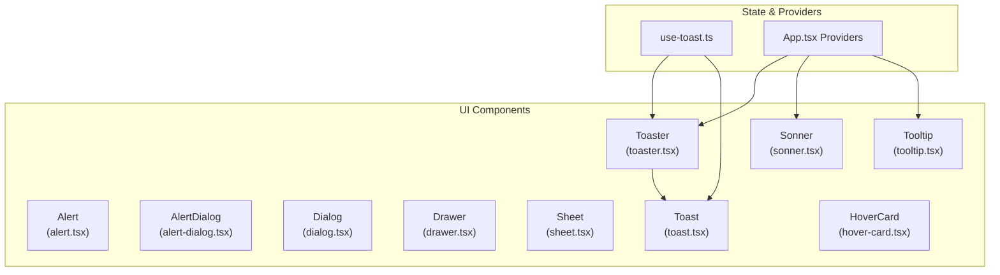

**Diagram sources**
- [App.tsx](file://src/App.tsx#L19-L42)
- [toaster.tsx](file://src/components/ui/toaster.tsx#L1-L24)
- [toast.tsx](file://src/components/ui/toast.tsx#L1-L112)
- [use-toast.ts](file://src/hooks/use-toast.ts#L1-L187)
- [alert.tsx](file://src/components/ui/alert.tsx#L1-L44)
- [alert-dialog.tsx](file://src/components/ui/alert-dialog.tsx#L1-L105)
- [dialog.tsx](file://src/components/ui/dialog.tsx#L1-L96)
- [drawer.tsx](file://src/components/ui/drawer.tsx#L1-L88)
- [sheet.tsx](file://src/components/ui/sheet.tsx#L1-L108)
- [tooltip.tsx](file://src/components/ui/tooltip.tsx#L1-L29)
- [hover-card.tsx](file://src/components/ui/hover-card.tsx#L1-L28)
- [sonner.tsx](file://src/components/ui/sonner.tsx#L1-L28)

**Section sources**
- [App.tsx](file://src/App.tsx#L19-L42)

## Core Components
- Alert: Non-modal informational container with title and description, supporting default and destructive variants. Accessibility role is set to alert.
- AlertDialog: Modal dialog for critical confirmations with overlay, actions, and cancel behavior.
- Dialog: Generic modal dialog with overlay, close button, header/footer/title/description slots.
- Drawer: Bottom-sheet drawer for mobile-first navigation and compact forms, using vaul.
- Sheet: Slide-in panel from a side (top/bottom/left/right), with overlay and close control.
- Toast: Lightweight, non-blocking notification with viewport positioning and swipe/close controls.
- Toaster: Provider-driven renderer that maps state to individual toast components.
- Sonner: Third-party toast library wrapper with theming and class customization.
- Tooltip: Short-form contextual help triggered by hover or keyboard focus.
- HoverCard: Extended contextual content that opens on hover with alignment and offset support.

**Section sources**
- [alert.tsx](file://src/components/ui/alert.tsx#L1-L44)
- [alert-dialog.tsx](file://src/components/ui/alert-dialog.tsx#L1-L105)
- [dialog.tsx](file://src/components/ui/dialog.tsx#L1-L96)
- [drawer.tsx](file://src/components/ui/drawer.tsx#L1-L88)
- [sheet.tsx](file://src/components/ui/sheet.tsx#L1-L108)
- [toast.tsx](file://src/components/ui/toast.tsx#L1-L112)
- [toaster.tsx](file://src/components/ui/toaster.tsx#L1-L24)
- [sonner.tsx](file://src/components/ui/sonner.tsx#L1-L28)
- [tooltip.tsx](file://src/components/ui/tooltip.tsx#L1-L29)
- [hover-card.tsx](file://src/components/ui/hover-card.tsx#L1-L28)

## Architecture Overview
The feedback system relies on providers to manage global state and animations:
- TooltipProvider wraps the app to enable tooltip behavior across components.
- Toaster renders Radix toast roots via a local state hook.
- Sonner provides a drop-in toast solution with theming and class overrides.
- Dialog, AlertDialog, Sheet, and Drawer use portals and overlays to render above page content.

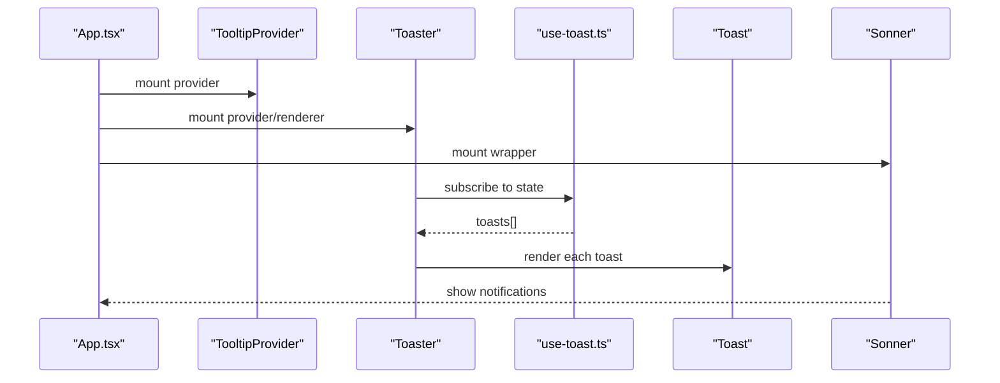

**Diagram sources**
- [App.tsx](file://src/App.tsx#L19-L42)
- [toaster.tsx](file://src/components/ui/toaster.tsx#L1-L24)
- [use-toast.ts](file://src/hooks/use-toast.ts#L166-L184)
- [toast.tsx](file://src/components/ui/toast.tsx#L1-L112)
- [sonner.tsx](file://src/components/ui/sonner.tsx#L1-L28)

## Detailed Component Analysis

### Alert
- Purpose: Display non-modal messages (info, warnings, errors).
- Interaction model: Stateless container; no triggers or state management included.
- Accessibility: Uses role="alert" for screen readers.
- Variants: default, destructive.
- Usage: Wrap message content with title and description.

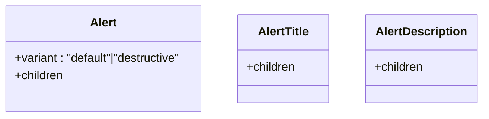

**Diagram sources**
- [alert.tsx](file://src/components/ui/alert.tsx#L6-L43)

**Section sources**
- [alert.tsx](file://src/components/ui/alert.tsx#L1-L44)

### AlertDialog
- Purpose: Critical confirmation dialogs requiring explicit user choice.
- Interaction model: Root/Trigger/Portal/Overlay/Content/Header/Footer/Title/Description/Action/Cancel.
- Animation: Fade and zoom transitions keyed by open/closed state.
- Backdrop: Fullscreen overlay with z-index; clicking overlay does not dismiss by default.
- Focus: Content receives focus; Escape typically handled by underlying primitive.
- Triggers: Trigger element opens the dialog; Action/Clear buttons handle outcomes.

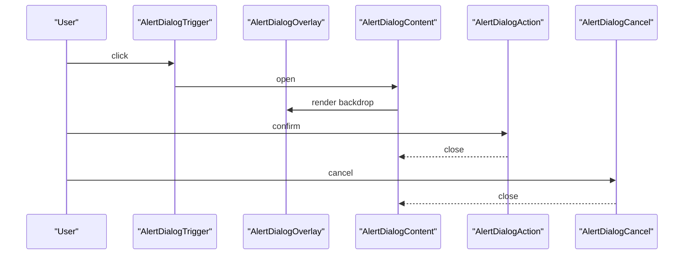

**Diagram sources**
- [alert-dialog.tsx](file://src/components/ui/alert-dialog.tsx#L7-L104)

**Section sources**
- [alert-dialog.tsx](file://src/components/ui/alert-dialog.tsx#L1-L105)

### Dialog
- Purpose: General-purpose modal with optional close button.
- Interaction model: Root/Trigger/Portal/Overlay/Content/Header/Footer/Title/Description/Close.
- Animation: Fade and zoom transitions keyed by open/closed state.
- Backdrop: Fullscreen overlay with z-index; Close button available inside content.
- Focus: Content receives focus; Escape typically handled by underlying primitive.
- Triggers: Trigger opens; Close button dismisses.

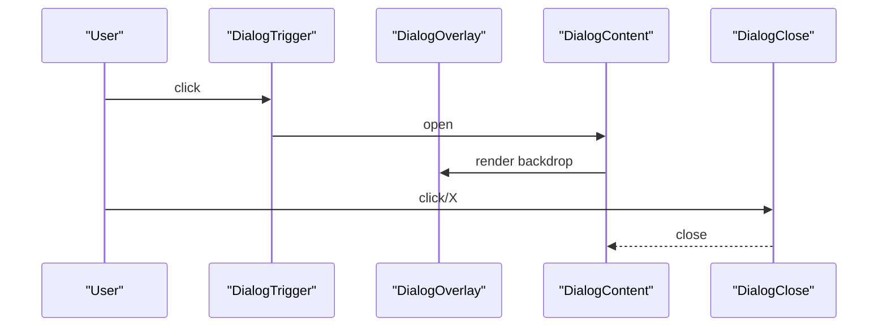

**Diagram sources**
- [dialog.tsx](file://src/components/ui/dialog.tsx#L7-L95)

**Section sources**
- [dialog.tsx](file://src/components/ui/dialog.tsx#L1-L96)

### Drawer
- Purpose: Mobile-first bottom drawer for navigation or compact forms.
- Interaction model: Root/Trigger/Portal/Overlay/Content/Header/Footer/Title/Description/Close.
- Animation: Slides up from bottom; overlay fixed at z-index.
- Backdrop: Fullscreen overlay with z-index.
- Focus: Drawer content receives focus; Escape typically handled by underlying primitive.
- Triggers: Trigger opens; Close button dismisses.

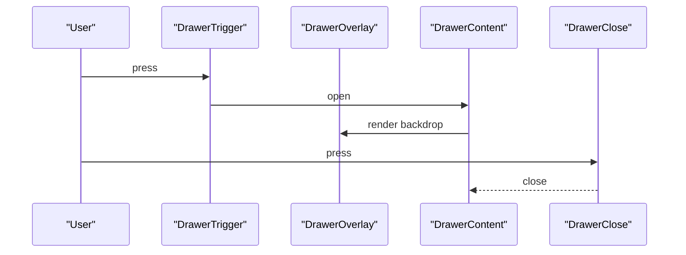

**Diagram sources**
- [drawer.tsx](file://src/components/ui/drawer.tsx#L6-L87)

**Section sources**
- [drawer.tsx](file://src/components/ui/drawer.tsx#L1-L88)

### Sheet
- Purpose: Slide-in panel from a side (top/bottom/left/right) for navigation or filters.
- Interaction model: Root/Trigger/Portal/Overlay/Content/Header/Footer/Title/Description/Close.
- Animation: Side-specific slide-in/out; overlay fixed at z-index.
- Backdrop: Fullscreen overlay with z-index.
- Focus: Content receives focus; Escape typically handled by underlying primitive.
- Triggers: Trigger opens; Close button dismisses.

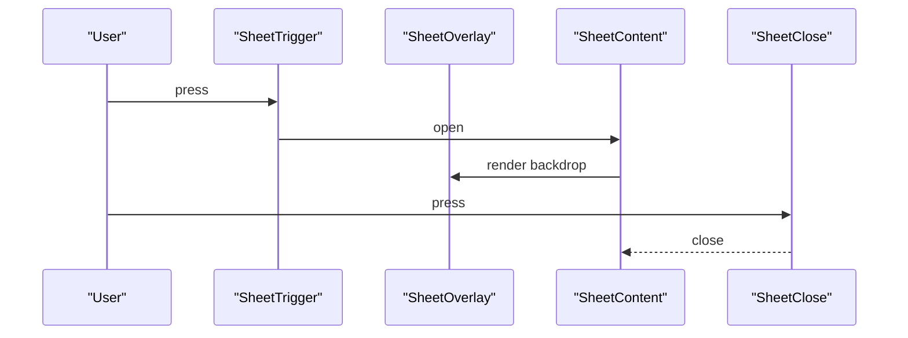

**Diagram sources**
- [sheet.tsx](file://src/components/ui/sheet.tsx#L8-L107)

**Section sources**
- [sheet.tsx](file://src/components/ui/sheet.tsx#L1-L108)

### Toast and Toaster
- Purpose: Lightweight, non-blocking notifications with optional actions and auto-dismiss.
- State management: Centralized reducer manages add/update/dismiss/remove with a queue of timeouts.
- Rendering: Toaster maps state to Toast roots; ToastViewport positions notifications.
- Animation: Slide/fade in/out and swipe gestures; z-index managed for stacking.
- Interaction: Auto-dismiss after a long delay; user can dismiss immediately; actions supported.
- Performance: Limit number of concurrent toasts; reuse timers; avoid unnecessary re-renders.

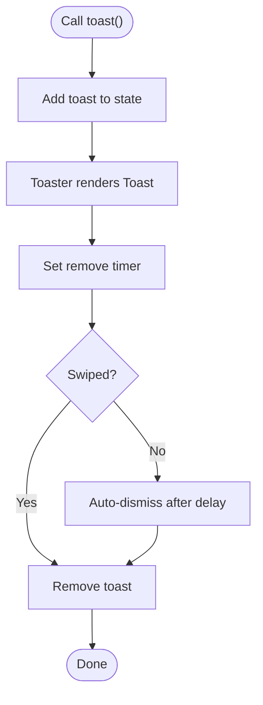

**Diagram sources**
- [toast.tsx](file://src/components/ui/toast.tsx#L8-L111)
- [toaster.tsx](file://src/components/ui/toaster.tsx#L4-L24)
- [use-toast.ts](file://src/hooks/use-toast.ts#L53-L121)

**Section sources**
- [toast.tsx](file://src/components/ui/toast.tsx#L1-L112)
- [toaster.tsx](file://src/components/ui/toaster.tsx#L1-L24)
- [use-toast.ts](file://src/hooks/use-toast.ts#L1-L187)

### Sonner
- Purpose: Drop-in toast notifications with theming and class customization.
- Integration: Wraps external library with theme detection and class overrides.
- Usage: Import Toaster and toast from the module to enqueue notifications.

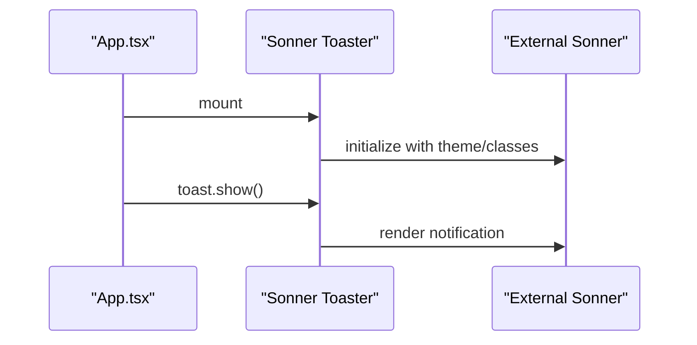

**Diagram sources**
- [sonner.tsx](file://src/components/ui/sonner.tsx#L6-L25)
- [App.tsx](file://src/App.tsx#L2-L2)

**Section sources**
- [sonner.tsx](file://src/components/ui/sonner.tsx#L1-L28)
- [App.tsx](file://src/App.tsx#L19-L42)

### Tooltip
- Purpose: Short-form contextual help or labels.
- Interaction model: Provider/Root/Trigger/Content.
- Animation: Fade and zoom transitions keyed by open state; side offset configurable.
- Accessibility: Content positioned near trigger; focus behavior depends on trigger type.

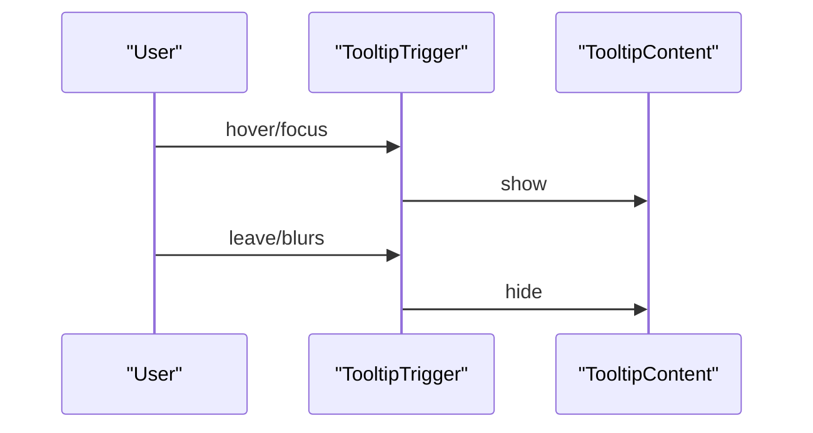

**Diagram sources**
- [tooltip.tsx](file://src/components/ui/tooltip.tsx#L6-L28)

**Section sources**
- [tooltip.tsx](file://src/components/ui/tooltip.tsx#L1-L29)

### HoverCard
- Purpose: Extended contextual content on hover with alignment and offset.
- Interaction model: Root/Trigger/Content; similar to tooltip but supports richer content.
- Animation: Fade and zoom transitions keyed by open state.
- Accessibility: Content appears on hover; consider keyboard alternatives for touch devices.

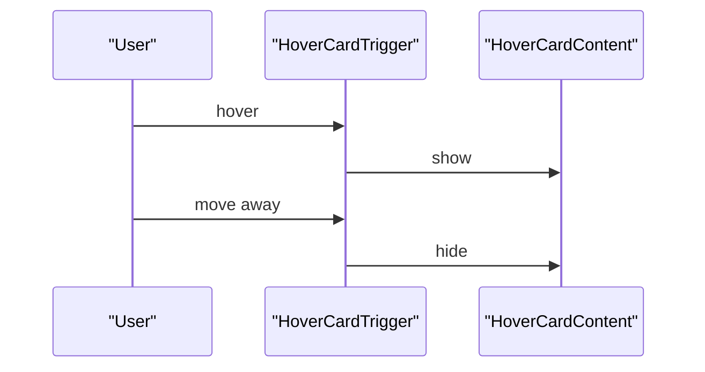

**Diagram sources**
- [hover-card.tsx](file://src/components/ui/hover-card.tsx#L6-L27)

**Section sources**
- [hover-card.tsx](file://src/components/ui/hover-card.tsx#L1-L28)

## Dependency Analysis
- Providers: TooltipProvider is mounted at the app root to enable tooltip behavior globally.
- Toast stack: Toaster depends on use-toast state; toast roots depend on Radix primitives.
- External libraries: Sonner wrapper depends on next-themes and external toast library.
- Overlays: Dialogs, Drawers, Sheets, and Alert dialogs all rely on portal rendering and overlay z-index management.

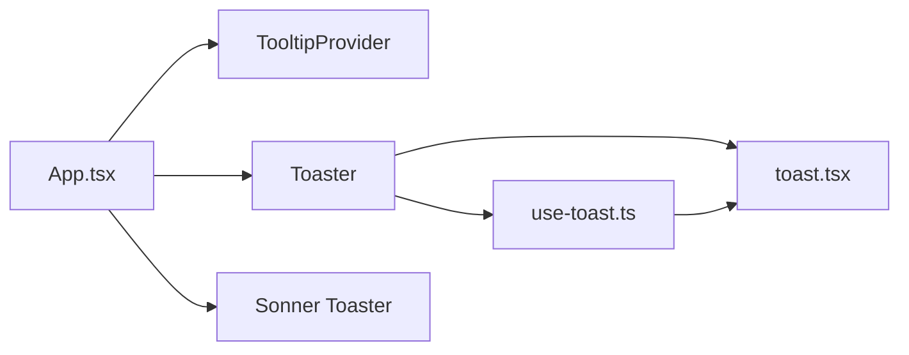

**Diagram sources**
- [App.tsx](file://src/App.tsx#L19-L42)
- [toaster.tsx](file://src/components/ui/toaster.tsx#L1-L24)
- [toast.tsx](file://src/components/ui/toast.tsx#L1-L112)
- [use-toast.ts](file://src/hooks/use-toast.ts#L1-L187)

**Section sources**
- [App.tsx](file://src/App.tsx#L19-L42)
- [toaster.tsx](file://src/components/ui/toaster.tsx#L1-L24)
- [toast.tsx](file://src/components/ui/toast.tsx#L1-L112)
- [use-toast.ts](file://src/hooks/use-toast.ts#L1-L187)

## Performance Considerations
- Toast limits: Keep a small limit of concurrent toasts to reduce DOM churn.
- Timers: Reuse and clean up timeouts to prevent memory leaks.
- Portals: Prefer portals to minimize layout thrashing during overlay rendering.
- Animations: Use CSS transitions and avoid heavy JS animations for frequent notifications.
- Theming: Defer expensive computations in theme switching; Sonner wrapper already handles theme resolution efficiently.

[No sources needed since this section provides general guidance]

## Troubleshooting Guide
- Overlays not appearing: Ensure providers are mounted at the app root and portals are rendered.
- Focus issues: Verify that content receives focus on open; consider adding explicit focus management for custom triggers.
- Escape key behavior: Confirm underlying primitives handle Escape; override if needed for custom workflows.
- Mobile drawer/sheet behavior: Test gesture handling and backdrop interactions; adjust side offsets and z-index as needed.
- Toast stacking: If too many toasts appear, reduce limit or consolidate messages.

**Section sources**
- [App.tsx](file://src/App.tsx#L19-L42)
- [use-toast.ts](file://src/hooks/use-toast.ts#L53-L121)

## Conclusion
The feedback and overlay components provide a cohesive system for communication, confirmation, and contextual assistance. By leveraging providers, portals, and consistent animation patterns, the UI remains predictable and accessible. For optimal UX, pair modals with proper focus management, use non-blocking toasts for routine updates, and ensure mobile-friendly drawers and sheets. Customize themes and classes thoughtfully, and monitor performance when emitting frequent notifications.