# Input Enhancement Components

<cite>
**Referenced Files in This Document**
- [input-otp.tsx](file://src/components/ui/input-otp.tsx)
- [textarea.tsx](file://src/components/ui/textarea.tsx)
- [command.tsx](file://src/components/ui/command.tsx)
- [popover.tsx](file://src/components/ui/popover.tsx)
- [collapsible.tsx](file://src/components/ui/collapsible.tsx)
- [accordion.tsx](file://src/components/ui/accordion.tsx)
- [carousel.tsx](file://src/components/ui/carousel.tsx)
- [scroll-area.tsx](file://src/components/ui/scroll-area.tsx)
- [utils.ts](file://src/lib/utils.ts)
- [package.json](file://package.json)
- [BookingWidget.tsx](file://src/components/BookingWidget.tsx)
</cite>

## Table of Contents
1. [Introduction](#introduction)
2. [Project Structure](#project-structure)
3. [Core Components](#core-components)
4. [Architecture Overview](#architecture-overview)
5. [Detailed Component Analysis](#detailed-component-analysis)
6. [Dependency Analysis](#dependency-analysis)
7. [Performance Considerations](#performance-considerations)
8. [Troubleshooting Guide](#troubleshooting-guide)
9. [Conclusion](#conclusion)

## Introduction
This document focuses on input enhancement and content organization components that improve user interaction and content presentation. It covers InputOTP, Textarea, Command, Popover, Collapsible, Accordion, Carousel, and ScrollArea. For each component, we describe extended functionality beyond basic inputs, state management, and UX improvements. We also provide examples of OTP entry interfaces, command palette implementations, contextual overlays, expandable content sections, image carousels, and custom scroll behaviors. Accessibility, keyboard shortcuts, touch interactions, responsiveness, performance, and integration with form systems are addressed.

## Project Structure
These components are organized under the UI library and integrated with shared utilities and third-party libraries. The UI components wrap primitives and external libraries to provide consistent styling and behavior.

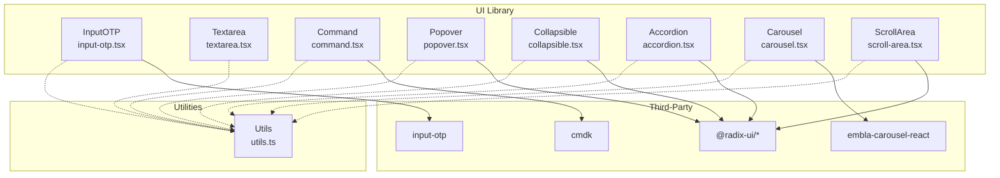

**Diagram sources**
- [input-otp.tsx](file://src/components/ui/input-otp.tsx#L1-L62)
- [textarea.tsx](file://src/components/ui/textarea.tsx#L1-L22)
- [command.tsx](file://src/components/ui/command.tsx#L1-L133)
- [popover.tsx](file://src/components/ui/popover.tsx#L1-L30)
- [collapsible.tsx](file://src/components/ui/collapsible.tsx#L1-L10)
- [accordion.tsx](file://src/components/ui/accordion.tsx#L1-L53)
- [carousel.tsx](file://src/components/ui/carousel.tsx#L1-L225)
- [scroll-area.tsx](file://src/components/ui/scroll-area.tsx#L1-L39)
- [utils.ts](file://src/lib/utils.ts#L1-L7)
- [package.json](file://package.json#L15-L64)

**Section sources**
- [input-otp.tsx](file://src/components/ui/input-otp.tsx#L1-L62)
- [textarea.tsx](file://src/components/ui/textarea.tsx#L1-L22)
- [command.tsx](file://src/components/ui/command.tsx#L1-L133)
- [popover.tsx](file://src/components/ui/popover.tsx#L1-L30)
- [collapsible.tsx](file://src/components/ui/collapsible.tsx#L1-L10)
- [accordion.tsx](file://src/components/ui/accordion.tsx#L1-L53)
- [carousel.tsx](file://src/components/ui/carousel.tsx#L1-L225)
- [scroll-area.tsx](file://src/components/ui/scroll-area.tsx#L1-L39)
- [utils.ts](file://src/lib/utils.ts#L1-L7)
- [package.json](file://package.json#L15-L64)

## Core Components
- InputOTP: Enhanced OTP input with individual slots, caret animation, separators, and container styling.
- Textarea: Rich text area with focus styles, disabled states, and responsive height behavior.
- Command: Command palette built on cmdk with dialog wrapper, input field, list, groups, items, and shortcuts.
- Popover: Contextual overlay with triggers and animated content positioning.
- Collapsible: Expandable/collapsible regions using Radix UI primitives.
- Accordion: Multi-section collapsible panels with smooth animations and chevron indicators.
- Carousel: Touch-friendly image/content carousel with keyboard navigation and programmatic controls.
- ScrollArea: Custom scrollbar with horizontal/vertical support and corner element.

**Section sources**
- [input-otp.tsx](file://src/components/ui/input-otp.tsx#L7-L61)
- [textarea.tsx](file://src/components/ui/textarea.tsx#L7-L19)
- [command.tsx](file://src/components/ui/command.tsx#L9-L132)
- [popover.tsx](file://src/components/ui/popover.tsx#L6-L27)
- [collapsible.tsx](file://src/components/ui/collapsible.tsx#L3-L7)
- [accordion.tsx](file://src/components/ui/accordion.tsx#L7-L50)
- [carousel.tsx](file://src/components/ui/carousel.tsx#L41-L224)
- [scroll-area.tsx](file://src/components/ui/scroll-area.tsx#L6-L36)

## Architecture Overview
The components follow a consistent pattern:
- Forward refs for DOM access
- Tailwind-based styling via a shared cn utility
- Integration with Radix UI primitives for accessibility and state
- Optional wrappers around external libraries (cmdk, embla-carousel-react, input-otp)

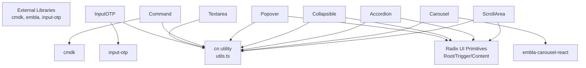

**Diagram sources**
- [utils.ts](file://src/lib/utils.ts#L4-L6)
- [input-otp.tsx](file://src/components/ui/input-otp.tsx#L2-L2)
- [command.tsx](file://src/components/ui/command.tsx#L3-L3)
- [popover.tsx](file://src/components/ui/popover.tsx#L2-L2)
- [collapsible.tsx](file://src/components/ui/collapsible.tsx#L1-L1)
- [accordion.tsx](file://src/components/ui/accordion.tsx#L2-L3)
- [carousel.tsx](file://src/components/ui/carousel.tsx#L2-L2)
- [scroll-area.tsx](file://src/components/ui/scroll-area.tsx#L2-L2)

## Detailed Component Analysis

### InputOTP
Extended functionality:
- Individual character slots with active state and fake caret animation
- Container-level styling and disabled opacity
- Separator slot for visual grouping
- Composition with input-otp primitives

State and UX:
- Tracks active slot and caret blink animation
- Keyboard-friendly with automatic focus movement
- Disabled state handled gracefully

Accessibility:
- Proper focus management and visual indication
- Screen-reader compatible structure

Customization:
- Slot styling, container classes, and separator icons

Example usage patterns:
- OTP entry interfaces for authentication or verification
- Form integration with controlled values and validation

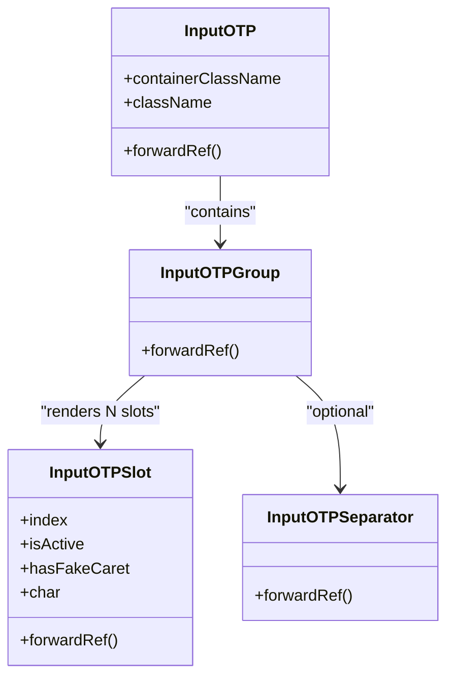

**Diagram sources**
- [input-otp.tsx](file://src/components/ui/input-otp.tsx#L7-L61)

**Section sources**
- [input-otp.tsx](file://src/components/ui/input-otp.tsx#L7-L61)
- [package.json](file://package.json#L50-L50)

### Textarea
Extended functionality:
- Consistent focus-visible ring, disabled opacity, and placeholder styling
- Minimum height and padding for readability
- Inherits native textarea semantics and events

UX improvements:
- Clear focus states for accessibility
- Disabled state feedback

Integration:
- Works seamlessly with form libraries and validation

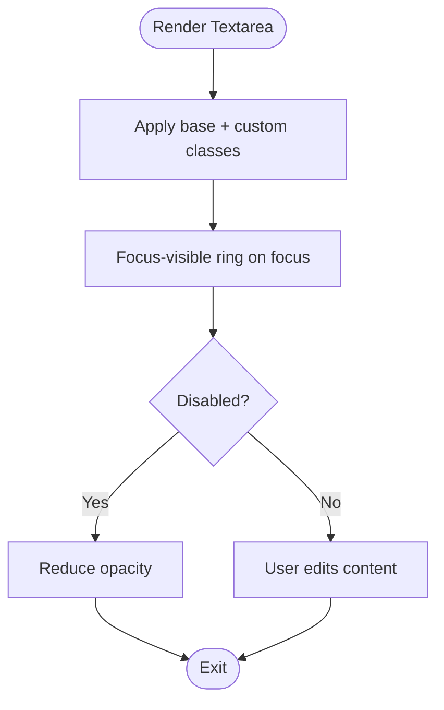

**Diagram sources**
- [textarea.tsx](file://src/components/ui/textarea.tsx#L7-L19)

**Section sources**
- [textarea.tsx](file://src/components/ui/textarea.tsx#L5-L19)

### Command (Command Palette)
Extended functionality:
- Dialog wrapper for constrained viewport
- Search icon in input wrapper
- Group headings, separators, and item selection states
- Keyboard navigation and filtering via cmdk

UX improvements:
- Smooth animations for open/close
- Visual selection feedback
- Shortcuts display for discoverability

Accessibility:
- Proper ARIA roles and keyboard handling
- Focus trapping within dialog

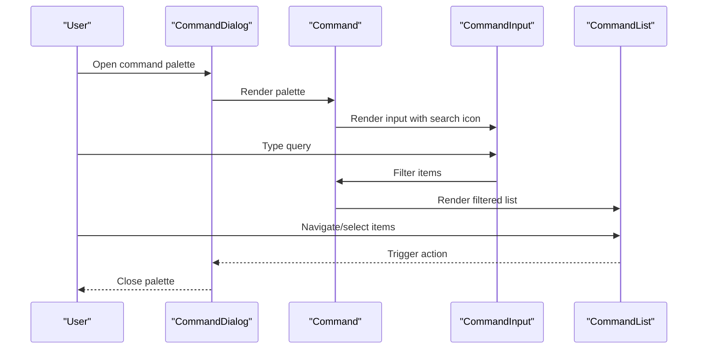

**Diagram sources**
- [command.tsx](file://src/components/ui/command.tsx#L26-L35)
- [command.tsx](file://src/components/ui/command.tsx#L38-L53)
- [command.tsx](file://src/components/ui/command.tsx#L57-L66)

**Section sources**
- [command.tsx](file://src/components/ui/command.tsx#L9-L132)
- [package.json](file://package.json#L47-L47)

### Popover
Extended functionality:
- Root, Trigger, and Content primitives
- Animated open/close transitions
- Alignment and offset configuration

UX improvements:
- Contextual overlays with pointer events
- Portal rendering for layout stability

Accessibility:
- Proper focus management and ARIA attributes

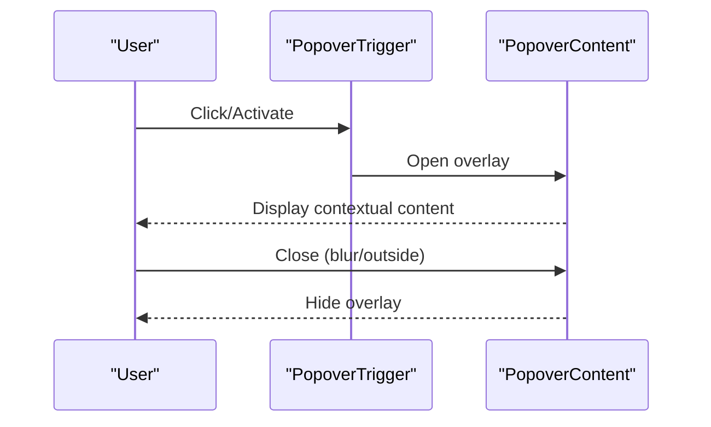

**Diagram sources**
- [popover.tsx](file://src/components/ui/popover.tsx#L6-L27)

**Section sources**
- [popover.tsx](file://src/components/ui/popover.tsx#L6-L27)
- [package.json](file://package.json#L30-L30)

### Collapsible
Extended functionality:
- Root, Trigger, and Content primitives
- Minimal API surface for expand/collapse

UX improvements:
- Clean, accessible expandable regions
- No extra styling by default

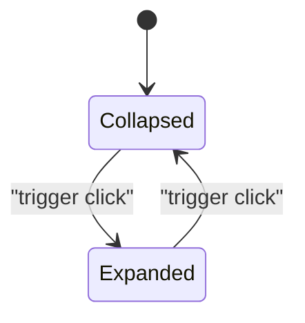

**Diagram sources**
- [collapsible.tsx](file://src/components/ui/collapsible.tsx#L3-L7)

**Section sources**
- [collapsible.tsx](file://src/components/ui/collapsible.tsx#L1-L10)
- [package.json](file://package.json#L22-L22)

### Accordion
Extended functionality:
- Item, Trigger, and Content components
- Chevron rotation on open/close
- Smooth animations for content expansion

UX improvements:
- Visual affordance for expandable sections
- Hover effects and transition timing

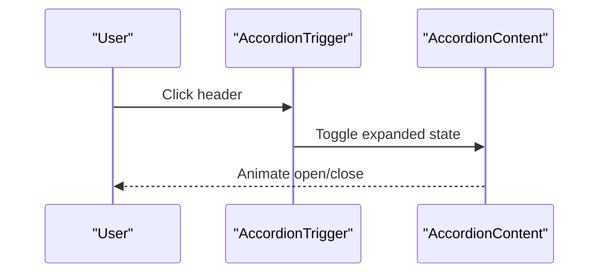

**Diagram sources**
- [accordion.tsx](file://src/components/ui/accordion.tsx#L17-L34)
- [accordion.tsx](file://src/components/ui/accordion.tsx#L37-L49)

**Section sources**
- [accordion.tsx](file://src/components/ui/accordion.tsx#L7-L50)
- [package.json](file://package.json#L17-L17)

### Carousel
Extended functionality:
- Horizontal/vertical orientation
- Programmatic controls and keyboard navigation (arrow keys)
- Previous/next buttons with disabled states
- Slide boundaries and scroll capability flags

UX improvements:
- Touch-friendly with Embla carousel
- Accessible ARIA roles and labels
- Responsive positioning of navigation buttons

Accessibility:
- Region and group roles for slides
- Screen-reader friendly navigation labels

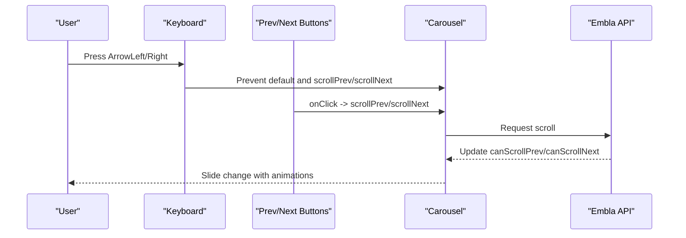

**Diagram sources**
- [carousel.tsx](file://src/components/ui/carousel.tsx#L70-L81)
- [carousel.tsx](file://src/components/ui/carousel.tsx#L168-L194)
- [carousel.tsx](file://src/components/ui/carousel.tsx#L196-L222)

**Section sources**
- [carousel.tsx](file://src/components/ui/carousel.tsx#L41-L224)
- [package.json](file://package.json#L49-L49)

### ScrollArea
Extended functionality:
- Custom scrollbar with vertical/horizontal orientation
- Corner element for overlap handling
- Touch scrolling support

UX improvements:
- Subtle, non-intrusive scrollbars
- Consistent appearance across platforms

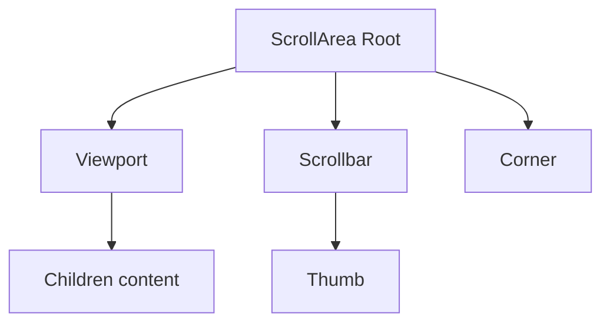

**Diagram sources**
- [scroll-area.tsx](file://src/components/ui/scroll-area.tsx#L6-L36)

**Section sources**
- [scroll-area.tsx](file://src/components/ui/scroll-area.tsx#L6-L36)
- [package.json](file://package.json#L33-L33)

## Dependency Analysis
External dependencies and their roles:
- input-otp: OTP input primitives and slot management
- cmdk: Command palette search and item selection
- @radix-ui/react-*: Popover, Accordion, Collapsible, ScrollArea primitives
- embla-carousel-react: Carousel engine and API
- lucide-react: Icons used across components
- tailwind-merge/clsx: Utility class merging

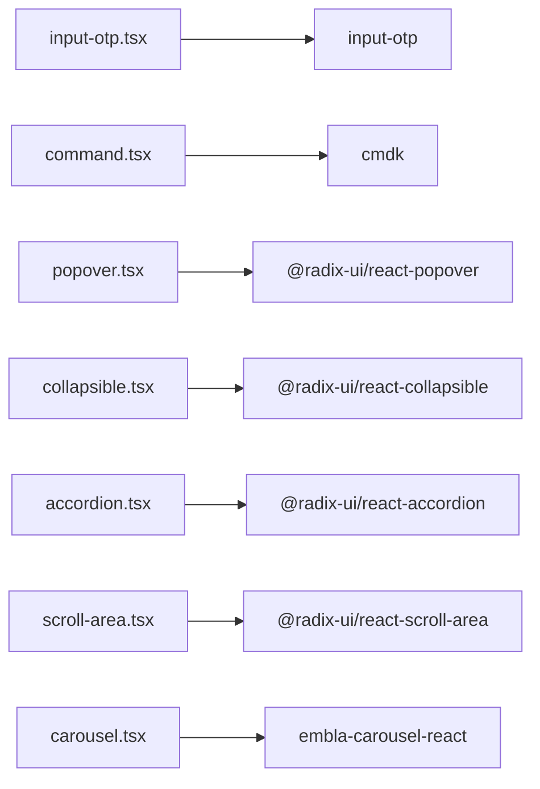

**Diagram sources**
- [package.json](file://package.json#L15-L64)
- [input-otp.tsx](file://src/components/ui/input-otp.tsx#L2-L2)
- [command.tsx](file://src/components/ui/command.tsx#L3-L3)
- [popover.tsx](file://src/components/ui/popover.tsx#L2-L2)
- [collapsible.tsx](file://src/components/ui/collapsible.tsx#L1-L1)
- [accordion.tsx](file://src/components/ui/accordion.tsx#L2-L3)
- [scroll-area.tsx](file://src/components/ui/scroll-area.tsx#L2-L2)
- [carousel.tsx](file://src/components/ui/carousel.tsx#L2-L2)

**Section sources**
- [package.json](file://package.json#L15-L64)

## Performance Considerations
- Carousel
  - Prefer lazy-loading images and offloading heavy assets
  - Limit the number of slides rendered at once
  - Use virtualization for very long lists (external consideration)
- ScrollArea
  - Keep content inside viewport lightweight
  - Avoid excessive nested scroll containers
- Command
  - Debounce input for large datasets
  - Use efficient filtering and memoization
- Textarea
  - For very large content, consider virtualized text editors (external consideration)
- Popover/Collapsible/Accordion
  - Avoid heavy computations in open/close handlers
  - Defer rendering heavy content until expanded

## Troubleshooting Guide
- InputOTP
  - Ensure all slots receive a single character; separators are optional
  - Verify containerClassName and className composition via cn
- Textarea
  - Confirm focus-visible ring does not conflict with custom outlines
  - Check disabled state classes for proper feedback
- Command
  - Dialog wrapper ensures constrained viewport; verify padding/shadow classes
  - Ensure items have unique keys and selection state is handled
- Popover
  - Triggers must be immediate children of Root; use asChild when wrapping buttons
  - Content alignment and offsets can be adjusted via props
- Collapsible/Accordion
  - Ensure Trigger wraps the header content
  - Verify animation classes are present for smooth transitions
- Carousel
  - UseCarousel must be called within a Carousel provider
  - Keyboard handlers prevent default behavior; ensure no conflicting listeners
  - Navigation buttons disable when unable to scroll further
- ScrollArea
  - Corner element helps with scrollbar overlap; ensure parent has overflow hidden

**Section sources**
- [input-otp.tsx](file://src/components/ui/input-otp.tsx#L19-L61)
- [textarea.tsx](file://src/components/ui/textarea.tsx#L7-L19)
- [command.tsx](file://src/components/ui/command.tsx#L26-L35)
- [popover.tsx](file://src/components/ui/popover.tsx#L6-L27)
- [collapsible.tsx](file://src/components/ui/collapsible.tsx#L3-L7)
- [accordion.tsx](file://src/components/ui/accordion.tsx#L17-L49)
- [carousel.tsx](file://src/components/ui/carousel.tsx#L31-L39)
- [scroll-area.tsx](file://src/components/ui/scroll-area.tsx#L6-L36)

## Conclusion
These input enhancement and content organization components provide robust, accessible, and customizable building blocks for modern user interfaces. They integrate seamlessly with Radix UI primitives and external libraries while maintaining consistent styling and behavior. By leveraging keyboard shortcuts, touch interactions, and responsive adaptations, they improve usability across devices and assist users with disabilities. For large content areas, consider performance optimizations such as virtualization and lazy loading. For form integration, pair these components with validation libraries and controlled state patterns to deliver reliable user experiences.