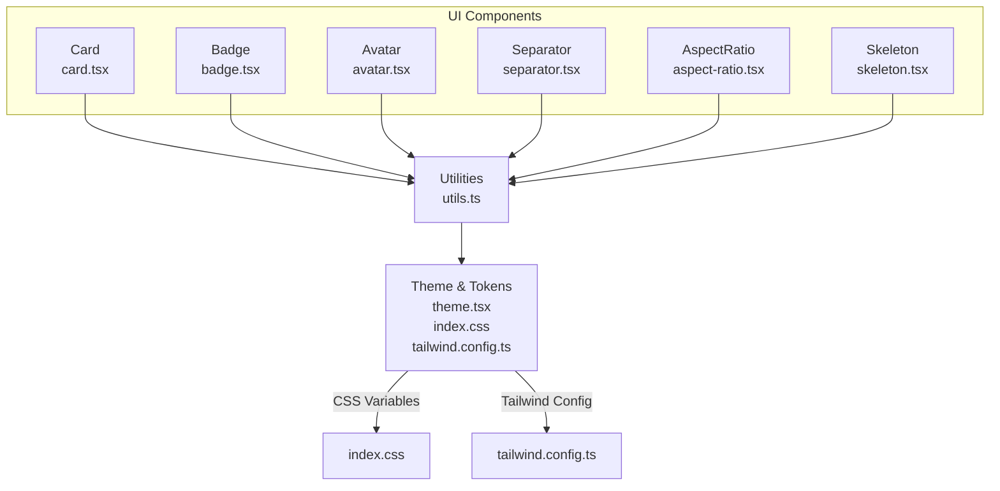
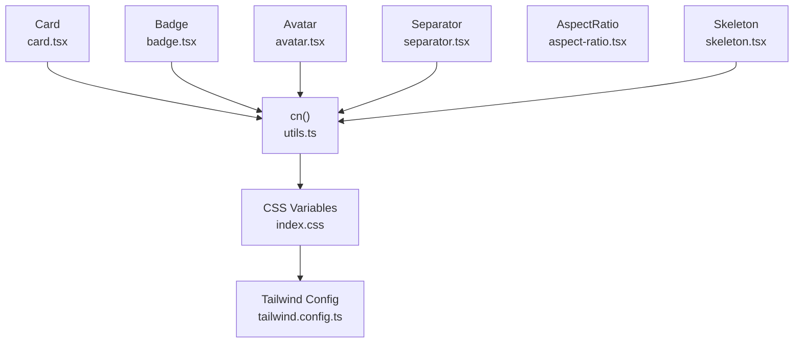
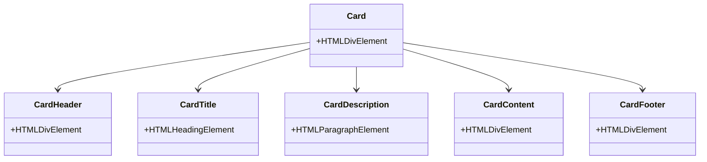
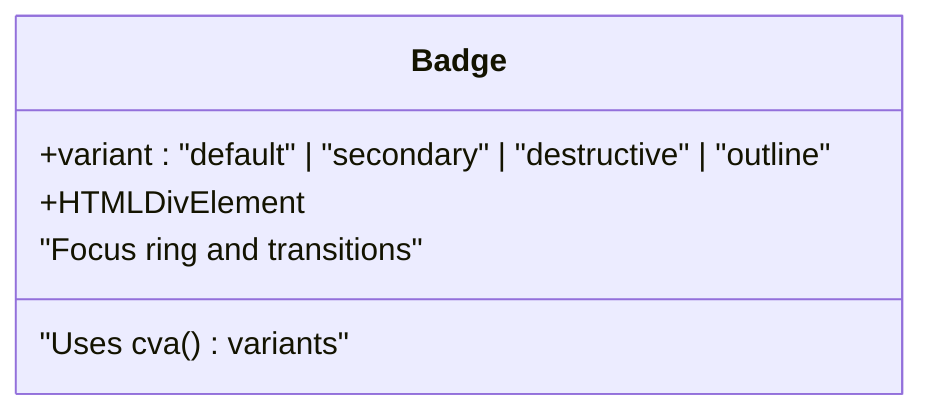
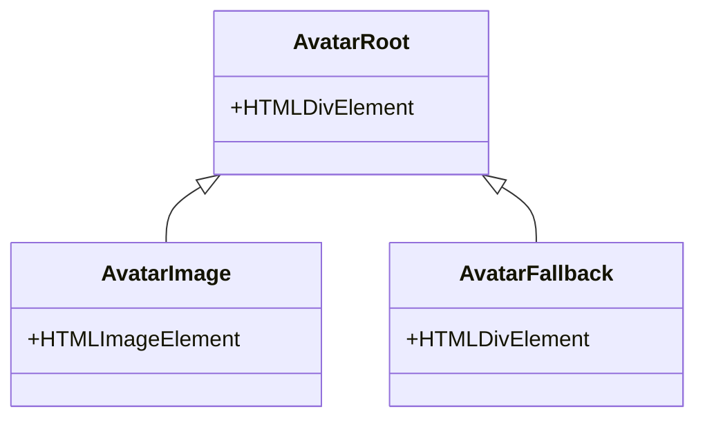
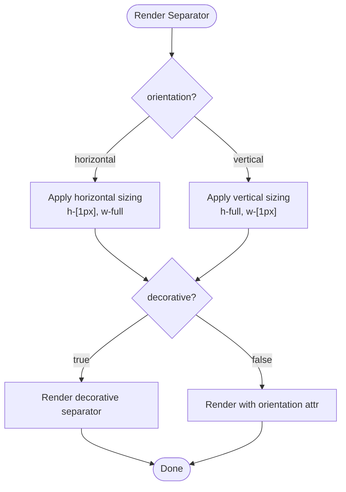
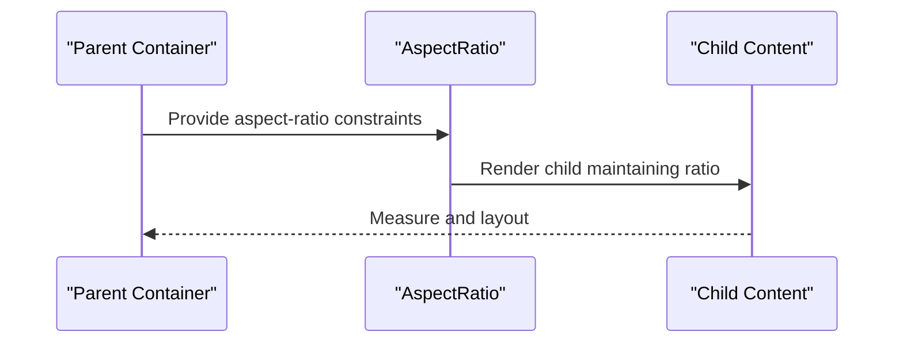
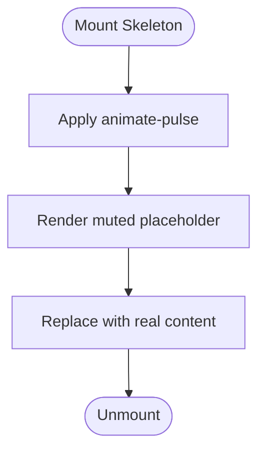
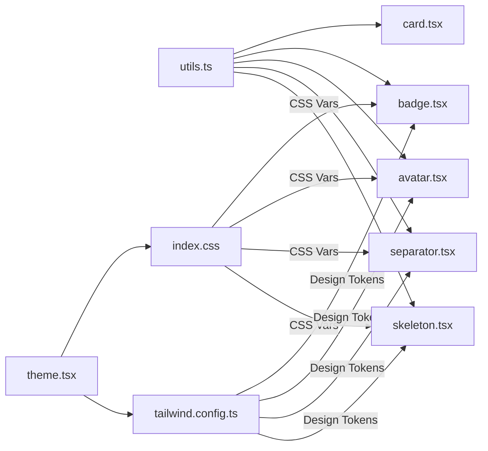

# Layout Components

<cite>
**Referenced Files in This Document**
- [card.tsx](file://src/components/ui/card.tsx)
- [badge.tsx](file://src/components/ui/badge.tsx)
- [avatar.tsx](file://src/components/ui/avatar.tsx)
- [separator.tsx](file://src/components/ui/separator.tsx)
- [aspect-ratio.tsx](file://src/components/ui/aspect-ratio.tsx)
- [skeleton.tsx](file://src/components/ui/skeleton.tsx)
- [utils.ts](file://src/lib/utils.ts)
- [theme.tsx](file://src/lib/theme.tsx)
- [tailwind.config.ts](file://src/tailwind.config.ts)
- [index.css](file://src/index.css)
- [App.css](file://src/App.css)
- [FeaturedRooms.tsx](file://src/components/FeaturedRooms.tsx)
- [Testimonials.tsx](file://src/components/Testimonials.tsx)
</cite>

## Table of Contents
1. [Introduction](#introduction)
2. [Project Structure](#project-structure)
3. [Core Components](#core-components)
4. [Architecture Overview](#architecture-overview)
5. [Detailed Component Analysis](#detailed-component-analysis)
6. [Dependency Analysis](#dependency-analysis)
7. [Performance Considerations](#performance-considerations)
8. [Troubleshooting Guide](#troubleshooting-guide)
9. [Conclusion](#conclusion)
10. [Appendices](#appendices)

## Introduction
This document focuses on layout and presentation-focused components that shape visual structure and content display: Card, Badge, Avatar, Separator, AspectRatio, and Skeleton. It explains each component’s role in the design system, prop interfaces, variant combinations, and integration patterns. It also demonstrates how these components collaborate to build cohesive layouts, manage visual hierarchy, and support responsive design. Accessibility, performance, customization via CSS variables and Tailwind classes, and composition strategies are covered to guide effective usage.

## Project Structure
These components live under the UI module and integrate with shared utilities and design tokens:
- UI components: Card, Badge, Avatar, Separator, AspectRatio, Skeleton
- Utilities: Tailwind merging and class composition
- Theming: CSS variables and dark mode support
- Global styles: Base tokens, animations, and utility classes

**Diagram sources**
- [card.tsx](file://src/components/ui/card.tsx#L1-L44)
- [badge.tsx](file://src/components/ui/badge.tsx#L1-L30)
- [avatar.tsx](file://src/components/ui/avatar.tsx#L1-L39)
- [separator.tsx](file://src/components/ui/separator.tsx#L1-L21)
- [aspect-ratio.tsx](file://src/components/ui/aspect-ratio.tsx#L1-L6)
- [skeleton.tsx](file://src/components/ui/skeleton.tsx#L1-L8)
- [utils.ts](file://src/lib/utils.ts#L1-L7)
- [theme.tsx](file://src/lib/theme.tsx#L1-L36)
- [index.css](file://src/index.css#L1-L146)
- [tailwind.config.ts](file://src/tailwind.config.ts#L1-L86)

**Section sources**
- [card.tsx](file://src/components/ui/card.tsx#L1-L44)
- [badge.tsx](file://src/components/ui/badge.tsx#L1-L30)
- [avatar.tsx](file://src/components/ui/avatar.tsx#L1-L39)
- [separator.tsx](file://src/components/ui/separator.tsx#L1-L21)
- [aspect-ratio.tsx](file://src/components/ui/aspect-ratio.tsx#L1-L6)
- [skeleton.tsx](file://src/components/ui/skeleton.tsx#L1-L8)
- [utils.ts](file://src/lib/utils.ts#L1-L7)
- [theme.tsx](file://src/lib/theme.tsx#L1-L36)
- [index.css](file://src/index.css#L1-L146)
- [tailwind.config.ts](file://src/tailwind.config.ts#L1-L86)

## Core Components
This section summarizes each component’s purpose, props, variants, and styling behavior.

- Card
  - Role: Container for grouped content with header, title, description, content, and footer regions.
  - Props: Standard HTML div attributes; composed via forwardRef.
  - Variants: None; relies on design tokens for colors and spacing.
  - Styling: Uses card and foreground tokens; spacing and typography applied per sub-part.
  - Accessibility: No explicit ARIA roles; ensure semantic headings and landmarks externally.

- Badge
  - Role: Short label for categorization, status, or metadata.
  - Props: Inherits HTML div attributes plus variant selection.
  - Variants: default, secondary, destructive, outline.
  - Styling: Uses primary/secondary/accent palettes and ring focus styles; transitions on hover.
  - Accessibility: Keep concise text; pair with ARIA labels if used as controls.

- Avatar
  - Role: Display a person or entity’s image with fallback initials.
  - Props: Root, Image, and Fallback accept Radix primitives’ props; composed via forwardRef.
  - Styling: Circular container with overflow hidden; fallback centered with muted background.
  - Accessibility: Provide alt text on images; ensure contrast for fallback initials.

- Separator
  - Role: Visual divider between content blocks.
  - Props: Orientation (horizontal or vertical); decorative flag; Radix primitive props.
  - Styling: Thin bar sized by orientation; uses border token.
  - Accessibility: Use decorative=true when purely presentational; otherwise mark as aria-orientation.

- AspectRatio
  - Role: Maintain a fixed aspect ratio for media containers.
  - Props: Radix primitive props; exposes Root as-is.
  - Styling: No extra classes; relies on parent layout and CSS containment.
  - Accessibility: Transparent to assistive tech; ensure content inside remains accessible.

- Skeleton
  - Role: Temporary placeholder while content loads.
  - Props: Standard HTML div attributes; animate-pulse applied.
  - Styling: Muted background with rounded corners; pulse animation.
  - Accessibility: Avoid replacing meaningful content with skeletons; keep loading states short.

**Section sources**
- [card.tsx](file://src/components/ui/card.tsx#L1-L44)
- [badge.tsx](file://src/components/ui/badge.tsx#L1-L30)
- [avatar.tsx](file://src/components/ui/avatar.tsx#L1-L39)
- [separator.tsx](file://src/components/ui/separator.tsx#L1-L21)
- [aspect-ratio.tsx](file://src/components/ui/aspect-ratio.tsx#L1-L6)
- [skeleton.tsx](file://src/components/ui/skeleton.tsx#L1-L8)

## Architecture Overview
The components share a consistent architecture:
- ForwardRef pattern for DOM access and className merging
- Utility-driven class composition via a unified cn function
- Design tokens from CSS variables and Tailwind config
- Optional variant systems (Badge) and primitive wrappers (Avatar, Separator, AspectRatio)

**Diagram sources**
- [utils.ts](file://src/lib/utils.ts#L1-L7)
- [index.css](file://src/index.css#L1-L146)
- [tailwind.config.ts](file://src/tailwind.config.ts#L1-L86)
- [card.tsx](file://src/components/ui/card.tsx#L1-L44)
- [badge.tsx](file://src/components/ui/badge.tsx#L1-L30)
- [avatar.tsx](file://src/components/ui/avatar.tsx#L1-L39)
- [separator.tsx](file://src/components/ui/separator.tsx#L1-L21)
- [aspect-ratio.tsx](file://src/components/ui/aspect-ratio.tsx#L1-L6)
- [skeleton.tsx](file://src/components/ui/skeleton.tsx#L1-L8)

## Detailed Component Analysis

### Card
- Composition: Card, CardHeader, CardTitle, CardDescription, CardContent, CardFooter
- Layout behavior: Header stacks title and description with tight vertical spacing; footer aligns items; content paddings are normalized
- Styling options: Inherits card/background tokens; typography scales for title; muted text for description
- Integration patterns: Pair with grid or stack layouts; use within glass backgrounds for depth

**Diagram sources**
- [card.tsx](file://src/components/ui/card.tsx#L1-L44)

**Section sources**
- [card.tsx](file://src/components/ui/card.tsx#L1-L44)

### Badge
- Prop interface: variant selection among default, secondary, destructive, outline
- Variant combinations: Each variant maps to a distinct color scheme using primary/secondary/accent tokens
- Styling options: Focus ring, transitions, and inline alignment for compact labeling
- Integration patterns: Use alongside headings, lists, or action chips; avoid long text

**Diagram sources**
- [badge.tsx](file://src/components/ui/badge.tsx#L1-L30)

**Section sources**
- [badge.tsx](file://src/components/ui/badge.tsx#L1-L30)

### Avatar
- Prop interface: Root, Image, Fallback accept Radix props; composed via forwardRef
- Layout behavior: Circular container with overflow hidden; image fills container; fallback centers content
- Styling options: Rounded-full, aspect-square image; muted fallback background
- Integration patterns: Combine with names, badges, or user lists; ensure alt text on images

**Diagram sources**
- [avatar.tsx](file://src/components/ui/avatar.tsx#L1-L39)

**Section sources**
- [avatar.tsx](file://src/components/ui/avatar.tsx#L1-L39)

### Separator
- Prop interface: orientation (horizontal or vertical), decorative flag, Radix props
- Layout behavior: Thin bar sized by orientation; shrink-to-fit content
- Styling options: Uses border token; suitable for grouping or dividing content
- Integration patterns: Place between lists, cards, or sections; ensure semantics match intent

**Diagram sources**
- [separator.tsx](file://src/components/ui/separator.tsx#L1-L21)

**Section sources**
- [separator.tsx](file://src/components/ui/separator.tsx#L1-L21)

### AspectRatio
- Prop interface: Exposes Radix AspectRatio Root; accepts standard props
- Layout behavior: Maintains aspect ratio for nested content
- Styling options: Minimal; rely on parent container and child media
- Integration patterns: Wrap images, videos, or grids requiring proportional sizing

**Diagram sources**
- [aspect-ratio.tsx](file://src/components/ui/aspect-ratio.tsx#L1-L6)

**Section sources**
- [aspect-ratio.tsx](file://src/components/ui/aspect-ratio.tsx#L1-L6)

### Skeleton
- Prop interface: Standard HTML div attributes
- Layout behavior: Full-bleed placeholder with rounded corners
- Styling options: Animate-pulse for subtle motion; muted background
- Integration patterns: Wrap text, images, or cards during async load; remove after data arrives

**Diagram sources**
- [skeleton.tsx](file://src/components/ui/skeleton.tsx#L1-L8)

**Section sources**
- [skeleton.tsx](file://src/components/ui/skeleton.tsx#L1-L8)

## Dependency Analysis
Shared dependencies and coupling:
- All components depend on the cn utility for safe class merging
- Theming depends on CSS variables and Tailwind configuration
- Primitive wrappers depend on Radix UI for accessible semantics

**Diagram sources**
- [utils.ts](file://src/lib/utils.ts#L1-L7)
- [theme.tsx](file://src/lib/theme.tsx#L1-L36)
- [index.css](file://src/index.css#L1-L146)
- [tailwind.config.ts](file://src/tailwind.config.ts#L1-L86)
- [card.tsx](file://src/components/ui/card.tsx#L1-L44)
- [badge.tsx](file://src/components/ui/badge.tsx#L1-L30)
- [avatar.tsx](file://src/components/ui/avatar.tsx#L1-L39)
- [separator.tsx](file://src/components/ui/separator.tsx#L1-L21)
- [skeleton.tsx](file://src/components/ui/skeleton.tsx#L1-L8)

**Section sources**
- [utils.ts](file://src/lib/utils.ts#L1-L7)
- [theme.tsx](file://src/lib/theme.tsx#L1-L36)
- [index.css](file://src/index.css#L1-L146)
- [tailwind.config.ts](file://src/tailwind.config.ts#L1-L86)
- [card.tsx](file://src/components/ui/card.tsx#L1-L44)
- [badge.tsx](file://src/components/ui/badge.tsx#L1-L30)
- [avatar.tsx](file://src/components/ui/avatar.tsx#L1-L39)
- [separator.tsx](file://src/components/ui/separator.tsx#L1-L21)
- [skeleton.tsx](file://src/components/ui/skeleton.tsx#L1-L8)

## Performance Considerations
- Minimize reflows: Prefer aspect-ratio containers and fixed-size placeholders to reduce layout thrashing
- Avoid heavy animations: Limit pulse and transition-heavy effects on low-end devices
- Lazy-load images: Pair Skeleton with image lazy-loading to improve perceived performance
- Reduce className churn: Use cn consistently to merge classes efficiently
- Theme switching: CSS variable updates are fast; avoid frequent DOM restructuring during theme toggles

[No sources needed since this section provides general guidance]

## Troubleshooting Guide
- Bad contrast with Avatar fallback: Ensure sufficient luminance contrast against the muted background; adjust text color or background
- Separator misalignment: Verify orientation and container flex properties; confirm decorative vs. semantic usage
- Badge overflow: Keep text short; wrap text or truncate when necessary
- Skeleton not animating: Confirm animate-pulse is not overridden by custom styles; ensure Tailwind utilities are included
- Aspect-ratio not respected: Ensure parent container defines width or aspect; avoid conflicting height constraints

**Section sources**
- [avatar.tsx](file://src/components/ui/avatar.tsx#L1-L39)
- [separator.tsx](file://src/components/ui/separator.tsx#L1-L21)
- [badge.tsx](file://src/components/ui/badge.tsx#L1-L30)
- [skeleton.tsx](file://src/components/ui/skeleton.tsx#L1-L8)
- [aspect-ratio.tsx](file://src/components/ui/aspect-ratio.tsx#L1-L6)

## Conclusion
These layout and presentation components form a cohesive toolkit for building structured, accessible, and visually consistent interfaces. By leveraging design tokens, consistent class composition, and primitive wrappers, teams can compose complex layouts while maintaining responsiveness and performance. Use variants thoughtfully, apply Skeleton strategically, and ensure semantic markup for accessibility.

[No sources needed since this section summarizes without analyzing specific files]

## Appendices

### Accessibility Considerations
- Use decorative separators when they serve only visual grouping; otherwise expose orientation semantics
- Provide alt text for Avatar images; ensure fallback initials remain readable
- Keep Badge text concise and descriptive; pair with ARIA labels for interactive badges
- Avoid long Skeleton sequences; replace with real content promptly

**Section sources**
- [separator.tsx](file://src/components/ui/separator.tsx#L1-L21)
- [avatar.tsx](file://src/components/ui/avatar.tsx#L1-L39)
- [badge.tsx](file://src/components/ui/badge.tsx#L1-L30)
- [skeleton.tsx](file://src/components/ui/skeleton.tsx#L1-L8)

### Customization Through CSS Variables and Tailwind
- Customize design tokens via CSS variables in the base layer; update radius, colors, and spacing
- Extend Tailwind theme to introduce new semantic tokens or scale adjustments
- Use utility classes for quick overrides while preserving component contracts

**Section sources**
- [index.css](file://src/index.css#L1-L146)
- [tailwind.config.ts](file://src/tailwind.config.ts#L1-L86)

### Composition Strategies
- Combine Card with Skeleton for loading states; swap content when ready
- Layer Avatar with Badge to indicate status or roles
- Use Separator to organize lists and forms; alternate orientations for dense layouts
- Wrap media with AspectRatio to maintain consistent proportions across breakpoints

**Section sources**
- [card.tsx](file://src/components/ui/card.tsx#L1-L44)
- [badge.tsx](file://src/components/ui/badge.tsx#L1-L30)
- [avatar.tsx](file://src/components/ui/avatar.tsx#L1-L39)
- [separator.tsx](file://src/components/ui/separator.tsx#L1-L21)
- [aspect-ratio.tsx](file://src/components/ui/aspect-ratio.tsx#L1-L6)

### Example Integrations in the Application
- FeaturedRooms showcases glass backgrounds, aspect ratios, and responsive grids; integrates layout components for room cards
- Testimonials uses glass panels, avatars, and separators to structure reviews and author info

**Section sources**
- [FeaturedRooms.tsx](file://src/components/FeaturedRooms.tsx#L1-L64)
- [Testimonials.tsx](file://src/components/Testimonials.tsx#L1-L52)