# Navigation Components

<cite>
**Referenced Files in This Document**
- [navigation-menu.tsx](file://src/components/ui/navigation-menu.tsx)
- [menubar.tsx](file://src/components/ui/menubar.tsx)
- [dropdown-menu.tsx](file://src/components/ui/dropdown-menu.tsx)
- [context-menu.tsx](file://src/components/ui/context-menu.tsx)
- [breadcrumb.tsx](file://src/components/ui/breadcrumb.tsx)
- [pagination.tsx](file://src/components/ui/pagination.tsx)
- [tabs.tsx](file://src/components/ui/tabs.tsx)
- [sidebar.tsx](file://src/components/ui/sidebar.tsx)
- [Navbar.tsx](file://src/components/Navbar.tsx)
- [NavLink.tsx](file://src/components/NavLink.tsx)
- [use-mobile.tsx](file://src/hooks/use-mobile.tsx)
- [App.tsx](file://src/App.tsx)
- [Index.tsx](file://src/pages/Index.tsx)
</cite>

## Table of Contents
1. [Introduction](#introduction)
2. [Project Structure](#project-structure)
3. [Core Components](#core-components)
4. [Architecture Overview](#architecture-overview)
5. [Detailed Component Analysis](#detailed-component-analysis)
6. [Dependency Analysis](#dependency-analysis)
7. [Performance Considerations](#performance-considerations)
8. [Troubleshooting Guide](#troubleshooting-guide)
9. [Conclusion](#conclusion)
10. [Appendices](#appendices)

## Introduction
This document provides comprehensive documentation for navigation and organizational UI components that enable users to move through content and organize information. It covers NavigationMenu, Menubar, DropdownMenu, ContextMenu, Breadcrumb, Pagination, Tabs, and Sidebar. For each component, we describe interaction patterns, state management, accessibility features, keyboard shortcuts, screen reader support, responsive behavior, and integration with routing systems. We also address open/close states, focus management, click-outside detection, and performance considerations for large navigation trees.

## Project Structure
The navigation components are implemented as reusable UI primitives built on Radix UI and styled with Tailwind CSS. They are organized under src/components/ui and integrated with routing via react-router-dom. The Navbar demonstrates practical usage of routing links and responsive behavior. The Sidebar component provides a robust, mobile-first navigation container with keyboard shortcuts and persistent state.

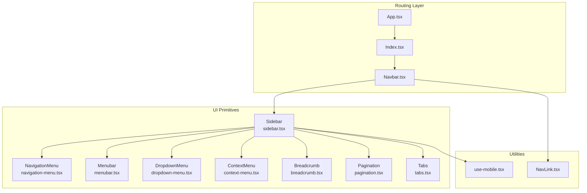

**Diagram sources**
- [App.tsx](file://src/App.tsx#L19-L42)
- [Index.tsx](file://src/pages/Index.tsx#L12-L25)
- [Navbar.tsx](file://src/components/Navbar.tsx#L13-L129)
- [navigation-menu.tsx](file://src/components/ui/navigation-menu.tsx#L8-L121)
- [menubar.tsx](file://src/components/ui/menubar.tsx#L17-L208)
- [dropdown-menu.tsx](file://src/components/ui/dropdown-menu.tsx#L7-L180)
- [context-menu.tsx](file://src/components/ui/context-menu.tsx#L7-L179)
- [breadcrumb.tsx](file://src/components/ui/breadcrumb.tsx#L7-L91)
- [pagination.tsx](file://src/components/ui/pagination.tsx#L7-L82)
- [tabs.tsx](file://src/components/ui/tabs.tsx#L6-L54)
- [sidebar.tsx](file://src/components/ui/sidebar.tsx#L43-L216)
- [use-mobile.tsx](file://src/hooks/use-mobile.tsx#L5-L18)
- [NavLink.tsx](file://src/components/NavLink.tsx#L11-L24)

**Section sources**
- [App.tsx](file://src/App.tsx#L19-L42)
- [Index.tsx](file://src/pages/Index.tsx#L12-L25)
- [Navbar.tsx](file://src/components/Navbar.tsx#L13-L129)
- [sidebar.tsx](file://src/components/ui/sidebar.tsx#L43-L216)

## Core Components
This section summarizes the primary navigation components and their responsibilities:
- NavigationMenu: Horizontal navigation with animated dropdown content and viewport sizing.
- Menubar: Application menu bar with nested submenus and keyboard navigation.
- DropdownMenu: Trigger-driven overlays for actions and selections.
- ContextMenu: Right-click triggered menus for contextual actions.
- Breadcrumb: Hierarchical navigation trail with separators and ellipsis.
- Pagination: Numeric and directional navigation for paginated content.
- Tabs: Organized content sections with keyboard activation.
- Sidebar: Collapsible, responsive navigation container with keyboard shortcut and persistent state.

Each component leverages Radix UI primitives for accessible state management and animations, and Tailwind classes for styling.

**Section sources**
- [navigation-menu.tsx](file://src/components/ui/navigation-menu.tsx#L8-L121)
- [menubar.tsx](file://src/components/ui/menubar.tsx#L17-L208)
- [dropdown-menu.tsx](file://src/components/ui/dropdown-menu.tsx#L7-L180)
- [context-menu.tsx](file://src/components/ui/context-menu.tsx#L7-L179)
- [breadcrumb.tsx](file://src/components/ui/breadcrumb.tsx#L7-L91)
- [pagination.tsx](file://src/components/ui/pagination.tsx#L7-L82)
- [tabs.tsx](file://src/components/ui/tabs.tsx#L6-L54)
- [sidebar.tsx](file://src/components/ui/sidebar.tsx#L43-L216)

## Architecture Overview
The navigation architecture centers on:
- Routing integration: Links use react-router-dom with a custom NavLink wrapper for active/pending states.
- Responsive behavior: useIsMobile hook detects breakpoints to switch between desktop and off-canvas mobile layouts.
- State management: Sidebar maintains expanded/collapsed state, supports controlled/uncontrolled modes, and persists state via cookies.
- Accessibility: All interactive components use proper ARIA roles, labels, and keyboard navigation patterns.
- Composition: Components expose primitive parts (Root, Trigger, Content, Item, etc.) enabling flexible composition.

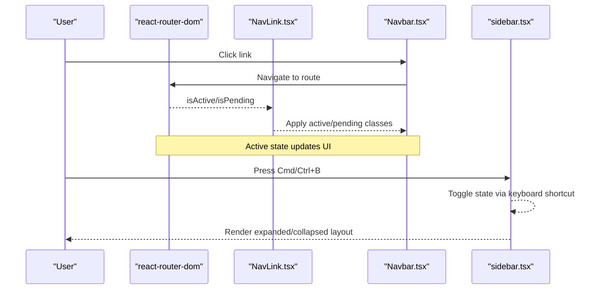

**Diagram sources**
- [NavLink.tsx](file://src/components/NavLink.tsx#L11-L24)
- [Navbar.tsx](file://src/components/Navbar.tsx#L13-L129)
- [sidebar.tsx](file://src/components/ui/sidebar.tsx#L79-L89)

## Detailed Component Analysis

### NavigationMenu
- Interaction pattern: Hover/focus triggers reveal content; chevron indicates open state.
- State management: Uses Radix NavigationMenu state attributes for animations and positioning.
- Accessibility: Supports keyboard navigation and screen reader announcements via data attributes.
- Responsive behavior: Content adapts to viewport width; motion classes animate transitions.
- Composition: Root, List, Item, Trigger, Content, Link, Viewport, Indicator.

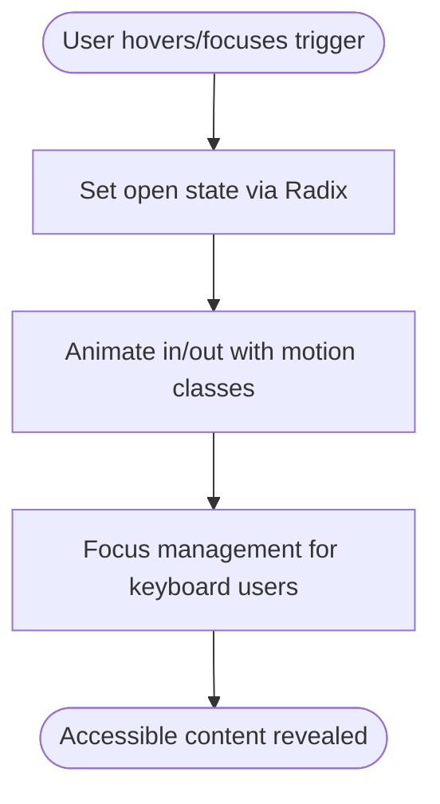

**Diagram sources**
- [navigation-menu.tsx](file://src/components/ui/navigation-menu.tsx#L8-L121)

**Section sources**
- [navigation-menu.tsx](file://src/components/ui/navigation-menu.tsx#L8-L121)

### Menubar
- Interaction pattern: Click or keyboard activation opens submenus; chevrons indicate nested items.
- State management: Submenu roots coordinate open/close via Radix state.
- Accessibility: Proper ARIA roles and keyboard navigation across nested groups.
- Composition: Root, Menu, Group, Portal, Sub, RadioGroup, Trigger, Content, Item, CheckboxItem, RadioItem, Label, Separator, Shortcut.

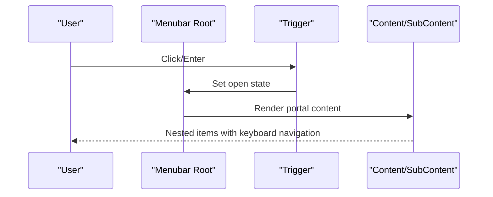

**Diagram sources**
- [menubar.tsx](file://src/components/ui/menubar.tsx#L17-L208)

**Section sources**
- [menubar.tsx](file://src/components/ui/menubar.tsx#L17-L208)

### DropdownMenu
- Interaction pattern: Trigger toggles overlay; supports nested submenus.
- State management: Controlled via Radix state; portal renders outside parent stacking context.
- Accessibility: Focus trapping and keyboard navigation within overlay.
- Composition: Root, Trigger, Content, Item, CheckboxItem, RadioItem, Label, Separator, Shortcut, Group, Portal, Sub, SubContent, SubTrigger, RadioGroup.

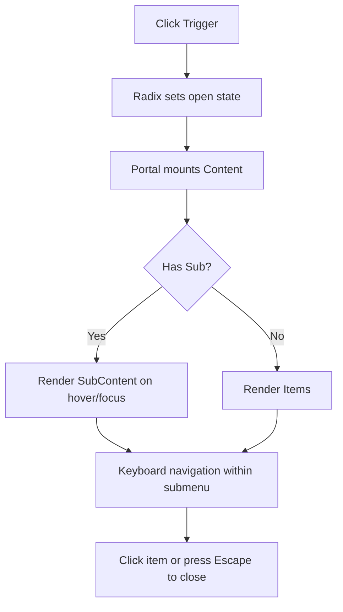

**Diagram sources**
- [dropdown-menu.tsx](file://src/components/ui/dropdown-menu.tsx#L7-L180)

**Section sources**
- [dropdown-menu.tsx](file://src/components/ui/dropdown-menu.tsx#L7-L180)

### ContextMenu
- Interaction pattern: Right-click or keyboard invocation opens context menu.
- State management: Overlay positioned near pointer; portal ensures correct stacking.
- Accessibility: Screen reader announcements and keyboard navigation within context.
- Composition: Root, Trigger, Content, Item, CheckboxItem, RadioItem, Label, Separator, Shortcut, Group, Portal, Sub, SubContent, SubTrigger, RadioGroup.

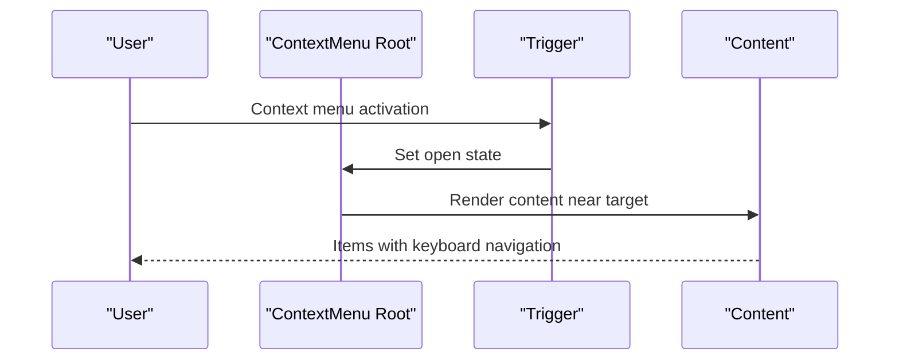

**Diagram sources**
- [context-menu.tsx](file://src/components/ui/context-menu.tsx#L7-L179)

**Section sources**
- [context-menu.tsx](file://src/components/ui/context-menu.tsx#L7-L179)

### Breadcrumb
- Interaction pattern: Links navigate to parent pages; last item indicates current page.
- State management: Current page marked with aria-current; separators configurable.
- Accessibility: nav landmark, aria-disabled on current page, sr-only “More” for ellipsis.
- Composition: nav, ol, li, a (asChild), span (current), li (separator), span (ellipsis).

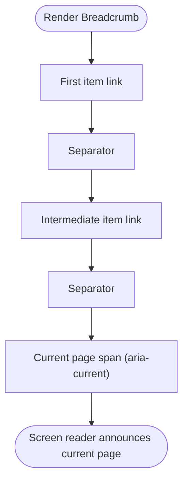

**Diagram sources**
- [breadcrumb.tsx](file://src/components/ui/breadcrumb.tsx#L7-L91)

**Section sources**
- [breadcrumb.tsx](file://src/components/ui/breadcrumb.tsx#L7-L91)

### Pagination
- Interaction pattern: Previous/Next buttons and numbered links navigate pages.
- State management: Active link marked with aria-current; ellipsis for skipped ranges.
- Accessibility: Navigation landmark, aria-labels on Previous/Next, sr-only text for ellipsis.
- Composition: nav, ul (content), li (item), a (link), Previous/Next, Ellipsis.

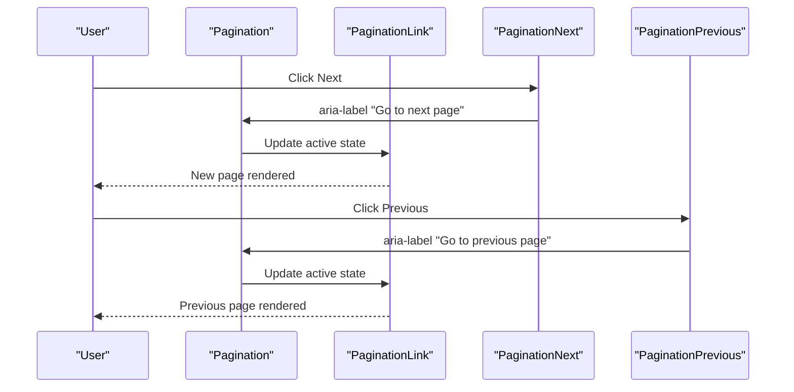

**Diagram sources**
- [pagination.tsx](file://src/components/ui/pagination.tsx#L7-L82)

**Section sources**
- [pagination.tsx](file://src/components/ui/pagination.tsx#L7-L82)

### Tabs
- Interaction pattern: Click or keyboard navigation switches content panels.
- State management: Active tab indicated via data-state; content visibility tied to selection.
- Accessibility: Proper tablist/tabpanel roles, focus management, and keyboard navigation.
- Composition: Root, List, Trigger, Content.

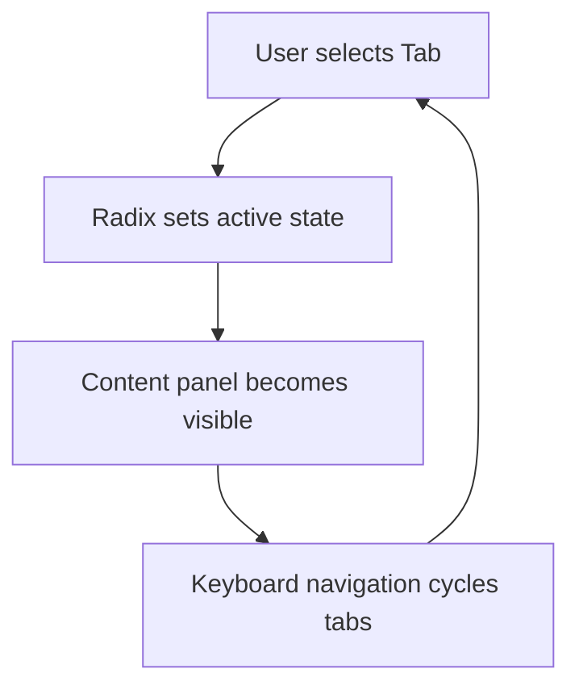

**Diagram sources**
- [tabs.tsx](file://src/components/ui/tabs.tsx#L6-L54)

**Section sources**
- [tabs.tsx](file://src/components/ui/tabs.tsx#L6-L54)

### Sidebar
- Interaction patterns:
  - Trigger toggles expanded/collapsed state.
  - Rail resizes or toggles depending on collapsible mode.
  - Keyboard shortcut (Cmd/Ctrl+B) toggles sidebar.
  - Mobile uses off-canvas Sheet for navigation.
- State management:
  - Internal state with controlled/uncontrolled modes.
  - Persists expanded/collapsed state in a cookie.
  - Tracks mobile/desktop via useIsMobile hook.
- Accessibility:
  - Proper labels and ARIA attributes on trigger and rail.
  - Focus management for keyboard users.
- Responsive behavior:
  - Desktop: fixed sidebar with collapsible modes (offcanvas, icon, none).
  - Mobile: Sheet overlay with full-width navigation.
- Composition:
  - Provider, Sidebar, Header, Footer, Content, Menu, MenuItem, MenuButton, MenuAction, MenuBadge, MenuSkeleton, MenuSub, MenuSubButton, Separator, Input, Trigger, Rail, Inset.

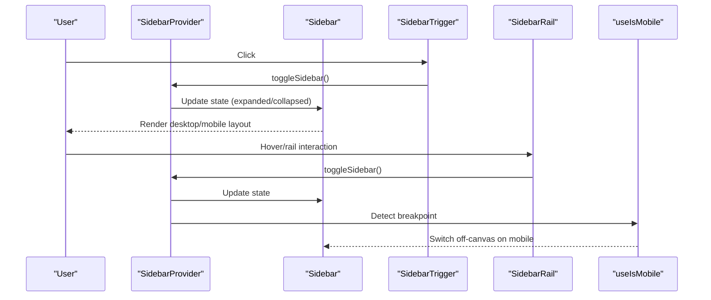

**Diagram sources**
- [sidebar.tsx](file://src/components/ui/sidebar.tsx#L43-L216)
- [use-mobile.tsx](file://src/hooks/use-mobile.tsx#L5-L18)

**Section sources**
- [sidebar.tsx](file://src/components/ui/sidebar.tsx#L43-L216)
- [use-mobile.tsx](file://src/hooks/use-mobile.tsx#L5-L18)

## Dependency Analysis
The navigation components depend on:
- Radix UI primitives for accessible state and animations.
- Tailwind CSS for styling and responsive utilities.
- react-router-dom for routing integration.
- Custom hooks/utilities for responsive behavior and state persistence.

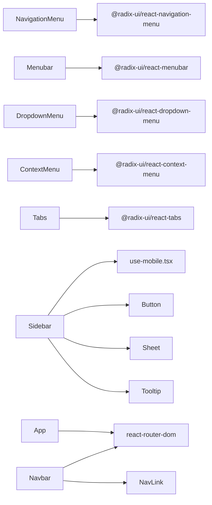

**Diagram sources**
- [navigation-menu.tsx](file://src/components/ui/navigation-menu.tsx#L1-L6)
- [menubar.tsx](file://src/components/ui/menubar.tsx#L1-L5)
- [dropdown-menu.tsx](file://src/components/ui/dropdown-menu.tsx#L1-L5)
- [context-menu.tsx](file://src/components/ui/context-menu.tsx#L1-L5)
- [tabs.tsx](file://src/components/ui/tabs.tsx#L1-L4)
- [sidebar.tsx](file://src/components/ui/sidebar.tsx#L1-L13)
- [Navbar.tsx](file://src/components/Navbar.tsx#L1-L8)
- [NavLink.tsx](file://src/components/NavLink.tsx#L1-L3)
- [App.tsx](file://src/App.tsx#L5-L5)

**Section sources**
- [navigation-menu.tsx](file://src/components/ui/navigation-menu.tsx#L1-L6)
- [menubar.tsx](file://src/components/ui/menubar.tsx#L1-L5)
- [dropdown-menu.tsx](file://src/components/ui/dropdown-menu.tsx#L1-L5)
- [context-menu.tsx](file://src/components/ui/context-menu.tsx#L1-L5)
- [tabs.tsx](file://src/components/ui/tabs.tsx#L1-L4)
- [sidebar.tsx](file://src/components/ui/sidebar.tsx#L1-L13)
- [Navbar.tsx](file://src/components/Navbar.tsx#L1-L8)
- [NavLink.tsx](file://src/components/NavLink.tsx#L1-L3)
- [App.tsx](file://src/App.tsx#L5-L5)

## Performance Considerations
- Large navigation trees:
  - Prefer lazy loading for deep submenus and virtualization for long lists.
  - Defer rendering of inactive tabs and offscreen content until needed.
  - Use CSS containment and transform-based animations to minimize layout thrash.
- Rendering cost:
  - Memoize computed props and avoid unnecessary re-renders in Sidebar provider.
  - Limit DOM nodes in Breadcrumb and Pagination by truncating or using ellipsis.
- Accessibility:
  - Keep focus order predictable; avoid removing tabindex unless necessary.
  - Ensure sufficient color contrast and scalable text sizes for readability.
- Responsiveness:
  - Use CSS media queries and useIsMobile to avoid expensive JS calculations during layout.
  - Minimize heavy computations in keyboard handlers and event listeners.

[No sources needed since this section provides general guidance]

## Troubleshooting Guide
- Dropdown/ContextMenu does not close on outside click:
  - Ensure the overlay is rendered via a portal and that click-outside logic is handled by the primitive’s state.
  - Verify that focus is managed properly to prevent focus traps.
- Sidebar keyboard shortcut not working:
  - Confirm the handler listens to metaKey or ctrlKey combinations and prevents default behavior.
  - Check that the shortcut is registered only once and removed on unmount.
- Breadcrumb current page not announced:
  - Ensure aria-current is applied to the current page element and that the nav landmark is present.
- Pagination active state incorrect:
  - Verify aria-current is set only on the active link and that previous/next buttons update state correctly.
- Menubar/MenubarSub navigation issues:
  - Confirm nested submenus are portals and that keyboard navigation moves between groups as expected.

**Section sources**
- [dropdown-menu.tsx](file://src/components/ui/dropdown-menu.tsx#L58-L71)
- [context-menu.tsx](file://src/components/ui/context-menu.tsx#L58-L70)
- [sidebar.tsx](file://src/components/ui/sidebar.tsx#L79-L89)
- [breadcrumb.tsx](file://src/components/ui/breadcrumb.tsx#L48-L61)
- [pagination.tsx](file://src/components/ui/pagination.tsx#L34-L46)
- [menubar.tsx](file://src/components/ui/menubar.tsx#L83-L97)

## Conclusion
The navigation components provide a cohesive, accessible, and responsive foundation for building complex navigation experiences. By leveraging Radix UI primitives, Tailwind CSS, and react-router-dom, they offer predictable state management, strong accessibility, and flexible composition. The Sidebar integrates seamlessly with routing and responsive behavior, while other components like Breadcrumb, Pagination, and Tabs support diverse navigation patterns. Following the performance and troubleshooting guidance ensures smooth, inclusive user experiences across devices and assistive technologies.

[No sources needed since this section summarizes without analyzing specific files]

## Appendices

### Integration Examples
- Complex navigation hierarchy:
  - Combine Menubar with DropdownMenu for app-level actions and nested submenus.
  - Use Sidebar with MenuButton, MenuSub, and MenuAction to build hierarchical navigation.
- Responsive behavior:
  - Use useIsMobile to switch between desktop fixed sidebar and mobile off-canvas Sheet.
  - Ensure keyboard shortcuts remain functional across breakpoints.
- Routing integration:
  - Use NavLink to reflect active/pending states in Navbar and Sidebar.
  - Pair Breadcrumb with route segments to reflect current location.

**Section sources**
- [Navbar.tsx](file://src/components/Navbar.tsx#L13-L129)
- [NavLink.tsx](file://src/components/NavLink.tsx#L11-L24)
- [sidebar.tsx](file://src/components/ui/sidebar.tsx#L131-L216)
- [menubar.tsx](file://src/components/ui/menubar.tsx#L17-L208)
- [dropdown-menu.tsx](file://src/components/ui/dropdown-menu.tsx#L7-L180)
- [breadcrumb.tsx](file://src/components/ui/breadcrumb.tsx#L7-L91)