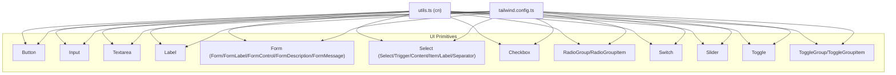
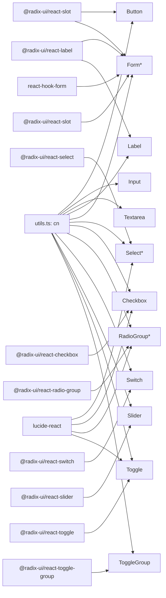

# UI Primitives

<cite>
**Referenced Files in This Document**
- [button.tsx](file://src/components/ui/button.tsx)
- [input.tsx](file://src/components/ui/input.tsx)
- [form.tsx](file://src/components/ui/form.tsx)
- [label.tsx](file://src/components/ui/label.tsx)
- [select.tsx](file://src/components/ui/select.tsx)
- [checkbox.tsx](file://src/components/ui/checkbox.tsx)
- [radio-group.tsx](file://src/components/ui/radio-group.tsx)
- [switch.tsx](file://src/components/ui/switch.tsx)
- [slider.tsx](file://src/components/ui/slider.tsx)
- [toggle.tsx](file://src/components/ui/toggle.tsx)
- [toggle-group.tsx](file://src/components/ui/toggle-group.tsx)
- [textarea.tsx](file://src/components/ui/textarea.tsx)
- [utils.ts](file://src/lib/utils.ts)
- [tailwind.config.ts](file://tailwind.config.ts)
</cite>

## Table of Contents
1. [Introduction](#introduction)
2. [Project Structure](#project-structure)
3. [Core Components](#core-components)
4. [Architecture Overview](#architecture-overview)
5. [Detailed Component Analysis](#detailed-component-analysis)
6. [Dependency Analysis](#dependency-analysis)
7. [Performance Considerations](#performance-considerations)
8. [Troubleshooting Guide](#troubleshooting-guide)
9. [Conclusion](#conclusion)
10. [Appendices](#appendices)

## Introduction
This document describes the foundational UI primitives that underpin the component library. It focuses on interactive primitives commonly used in forms and general UI: Button, Input, Form, Label, Select, Checkbox, RadioGroup, Switch, Slider, Toggle, and ToggleGroup. For each component, we explain visual appearance, behavior, accessibility features, and the complete props interface. We also provide usage guidance for variants, sizes, states, and customization via Tailwind CSS classes, along with focus management, keyboard navigation, screen reader support, composition patterns, form integration, validation handling, and responsive design considerations.

## Project Structure
The primitives live under src/components/ui and share a consistent styling approach powered by Tailwind CSS and a small utility for merging classes. Variants are defined with class-variance-authority (CVA) for predictable, composable styles.

**Diagram sources**
- [button.tsx](file://src/components/ui/button.tsx#L1-L48)
- [input.tsx](file://src/components/ui/input.tsx#L1-L23)
- [textarea.tsx](file://src/components/ui/textarea.tsx#L1-L22)
- [label.tsx](file://src/components/ui/label.tsx#L1-L18)
- [form.tsx](file://src/components/ui/form.tsx#L1-L130)
- [select.tsx](file://src/components/ui/select.tsx#L1-L144)
- [checkbox.tsx](file://src/components/ui/checkbox.tsx#L1-L27)
- [radio-group.tsx](file://src/components/ui/radio-group.tsx#L1-L37)
- [switch.tsx](file://src/components/ui/switch.tsx#L1-L28)
- [slider.tsx](file://src/components/ui/slider.tsx#L1-L24)
- [toggle.tsx](file://src/components/ui/toggle.tsx#L1-L38)
- [toggle-group.tsx](file://src/components/ui/toggle-group.tsx#L1-L50)
- [utils.ts](file://src/lib/utils.ts#L1-L7)
- [tailwind.config.ts](file://tailwind.config.ts#L1-L86)

**Section sources**
- [button.tsx](file://src/components/ui/button.tsx#L1-L48)
- [input.tsx](file://src/components/ui/input.tsx#L1-L23)
- [form.tsx](file://src/components/ui/form.tsx#L1-L130)
- [label.tsx](file://src/components/ui/label.tsx#L1-L18)
- [select.tsx](file://src/components/ui/select.tsx#L1-L144)
- [checkbox.tsx](file://src/components/ui/checkbox.tsx#L1-L27)
- [radio-group.tsx](file://src/components/ui/radio-group.tsx#L1-L37)
- [switch.tsx](file://src/components/ui/switch.tsx#L1-L28)
- [slider.tsx](file://src/components/ui/slider.tsx#L1-L24)
- [toggle.tsx](file://src/components/ui/toggle.tsx#L1-L38)
- [toggle-group.tsx](file://src/components/ui/toggle-group.tsx#L1-L50)
- [utils.ts](file://src/lib/utils.ts#L1-L7)
- [tailwind.config.ts](file://tailwind.config.ts#L1-L86)

## Core Components
This section summarizes the shared patterns and cross-cutting concerns across the primitives.

- Styling and composition
  - Utilities: A centralized cn function merges and deduplicates Tailwind classes.
  - Variants: CVA is used for Button and Toggle to define variant and size scales.
  - Theme tokens: Tailwind theme defines semantic color tokens and radii used across components.

- Accessibility and focus
  - Focus-visible rings and outlines are consistently applied for keyboard navigation.
  - Disabled states prevent pointer events and reduce opacity.
  - Form components integrate with react-hook-form and expose aria attributes for assistive technologies.

- Responsive behavior
  - Many components include responsive text sizing and spacing (e.g., base vs. md text classes).

**Section sources**
- [utils.ts](file://src/lib/utils.ts#L1-L7)
- [button.tsx](file://src/components/ui/button.tsx#L7-L31)
- [toggle.tsx](file://src/components/ui/toggle.tsx#L7-L26)
- [tailwind.config.ts](file://tailwind.config.ts#L13-L67)

## Architecture Overview
The primitives follow a consistent pattern:
- Forward refs to native elements or Radix UI primitives
- Optional slot composition (asChild) for flexible DOM rendering
- CVA-based variants and sizes
- Tailwind classes for layout, colors, and transitions
- Form integration via react-hook-form contexts and helpers

```mermaid
classDiagram
class Button {
+variant : "default|destructive|outline|secondary|ghost|link"
+size : "default|sm|lg|icon"
+asChild : boolean
}
class Toggle {
+variant : "default|outline"
+size : "default|sm|lg"
}
class Input {
+type : string
}
class Textarea {
}
class Checkbox {
}
class RadioGroup {
}
class RadioGroupItem {
}
class Switch {
}
class Slider {
}
class SelectTrigger {
}
class SelectContent {
}
class SelectItem {
}
class Form {
}
class FormItem {
}
class FormLabel {
}
class FormControl {
}
class FormDescription {
}
class FormMessage {
}
class Label {
}
class ToggleGroup {
}
class ToggleGroupItem {
}
Button --> "uses" cn
Toggle --> "uses" cn
Input --> "uses" cn
Textarea --> "uses" cn
Checkbox --> "uses" cn
RadioGroup --> "uses" cn
RadioGroupItem --> "uses" cn
Switch --> "uses" cn
Slider --> "uses" cn
SelectTrigger --> "uses" cn
SelectContent --> "uses" cn
SelectItem --> "uses" cn
Form --> "uses" cn
FormItem --> "uses" cn
FormLabel --> "uses" cn
FormControl --> "uses" cn
FormDescription --> "uses" cn
FormMessage --> "uses" cn
Label --> "uses" cn
ToggleGroup --> "uses" cn
ToggleGroupItem --> "uses" cn
```

**Diagram sources**
- [button.tsx](file://src/components/ui/button.tsx#L33-L45)
- [toggle.tsx](file://src/components/ui/toggle.tsx#L28-L33)
- [input.tsx](file://src/components/ui/input.tsx#L5-L19)
- [textarea.tsx](file://src/components/ui/textarea.tsx#L7-L19)
- [checkbox.tsx](file://src/components/ui/checkbox.tsx#L7-L24)
- [radio-group.tsx](file://src/components/ui/radio-group.tsx#L7-L34)
- [switch.tsx](file://src/components/ui/switch.tsx#L6-L24)
- [slider.tsx](file://src/components/ui/slider.tsx#L6-L21)
- [select.tsx](file://src/components/ui/select.tsx#L13-L91)
- [form.tsx](file://src/components/ui/form.tsx#L9-L129)
- [label.tsx](file://src/components/ui/label.tsx#L9-L15)
- [toggle-group.tsx](file://src/components/ui/toggle-group.tsx#L13-L47)

## Detailed Component Analysis

### Button
- Purpose: A versatile button with variants and sizes, supporting both native button and custom element rendering via asChild.
- Props
  - Inherits standard button attributes
  - variant: default | destructive | outline | secondary | ghost | link
  - size: default | sm | lg | icon
  - asChild: boolean (render child as a slot)
- Behavior
  - Uses forwardRef to pass ref to either a slot or button element
  - Merges variant and size classes with incoming className
- Accessibility
  - Focus-visible ring and outline for keyboard navigation
  - Disabled state prevents interaction and reduces opacity
- Styling
  - Variant and size scales defined via CVA
  - Includes ring offsets and transitions for visual feedback
- Usage examples (descriptive)
  - Variants: default, destructive, outline, secondary, ghost, link
  - Sizes: default, sm, lg, icon
  - Composition: asChild with Link or Icon to render a custom anchor-like button

**Section sources**
- [button.tsx](file://src/components/ui/button.tsx#L7-L45)
- [utils.ts](file://src/lib/utils.ts#L4-L6)
- [tailwind.config.ts](file://tailwind.config.ts#L18-L67)

### Input
- Purpose: A single-line text input with consistent focus states and responsive typography.
- Props
  - Inherits standard input attributes
  - type: string (supports all HTML input types)
- Behavior
  - Renders an input element with merged classes
  - Focus-visible ring and offset applied
  - Disabled state handled with cursor and opacity
- Accessibility
  - Standard input semantics; integrates with labels and forms
- Styling
  - Uses theme tokens for borders, backgrounds, and focus rings
  - Responsive text sizing (base vs. md)
- Usage examples (descriptive)
  - Password, email, number, text inputs
  - Controlled/uncontrolled patterns
  - With icons or addons via wrapper composition

**Section sources**
- [input.tsx](file://src/components/ui/input.tsx#L5-L19)
- [utils.ts](file://src/lib/utils.ts#L4-L6)
- [tailwind.config.ts](file://tailwind.config.ts#L18-L67)

### Form (Form/FormLabel/FormControl/FormDescription/FormMessage/FormField)
- Purpose: A cohesive form system built on react-hook-form with accessible labeling and error reporting.
- Key parts
  - Form: Provider wrapping react-hook-form context
  - FormField: Context provider around Controller
  - FormItem: Container that generates ids and spaces items
  - FormLabel: Accessible label bound to a field
  - FormControl: Slot that injects aria attributes and ids
  - FormDescription: Helper text with accessible id
  - FormMessage: Error message with accessible id and role
- Accessibility
  - Generates unique ids per field
  - Sets aria-invalid and aria-describedby on controls
  - Error messages are surfaced to assistive tech
- Behavior
  - useFormField reads field state and ids from context
  - Conditional error messaging and styling
- Usage examples (descriptive)
  - Wrap a form with Form
  - For each field, use FormField -> FormItem -> FormLabel + FormControl -> FormDescription/FormMessage
  - Integrate with validation libraries and submit handlers

**Section sources**
- [form.tsx](file://src/components/ui/form.tsx#L9-L129)
- [label.tsx](file://src/components/ui/label.tsx#L9-L15)

### Label
- Purpose: A styled label for form controls with disabled and error-aware states.
- Props
  - Inherits standard label attributes
  - No explicit variant props here; relies on CVA for baseline styles
- Behavior
  - Wraps Radix UI Label with merged classes
  - Integrates with FormLabel for error styling
- Accessibility
  - Proper htmlFor binding via formItemId
- Styling
  - Peer-disabled cursor and opacity for disabled states

**Section sources**
- [label.tsx](file://src/components/ui/label.tsx#L7-L15)
- [form.tsx](file://src/components/ui/form.tsx#L75-L83)

### Select
- Purpose: A composite component for selection with trigger, content, items, and scrolling helpers.
- Parts
  - Root, Group, Value
  - Trigger: renders trigger with icon
  - Content: portal-bound overlay with animations
  - Item, Label, Separator
  - ScrollUpButton, ScrollDownButton
- Behavior
  - Uses Radix UI primitives for robust keyboard and focus behavior
  - Supports popper positioning and viewport sizing
- Accessibility
  - Keyboard navigation, ARIA roles, and focus management via Radix
- Styling
  - Trigger, content, items, and separators use theme tokens and transitions
- Usage examples (descriptive)
  - Single select, grouped options, long lists with scroll buttons
  - Controlled vs. uncontrolled patterns

**Section sources**
- [select.tsx](file://src/components/ui/select.tsx#L7-L143)
- [utils.ts](file://src/lib/utils.ts#L4-L6)
- [tailwind.config.ts](file://tailwind.config.ts#L18-L67)

### Checkbox
- Purpose: A single checkbox with indicator and focus-visible styling.
- Props
  - Inherits standard checkbox attributes
- Behavior
  - Uses Radix UI Checkbox with indicator glyph
  - Focus-visible ring and disabled state
- Accessibility
  - Native semantics and state indicators
- Styling
  - Theme-based border, checked background/text, and transitions

**Section sources**
- [checkbox.tsx](file://src/components/ui/checkbox.tsx#L7-L24)
- [utils.ts](file://src/lib/utils.ts#L4-L6)
- [tailwind.config.ts](file://tailwind.config.ts#L18-L67)

### RadioGroup
- Purpose: A group of radio buttons with consistent focus and checked indicators.
- Parts
  - RadioGroup: container grid layout
  - RadioGroupItem: individual radio with indicator
- Behavior
  - Uses Radix UI RadioGroup for selection semantics
  - Focus-visible ring and disabled state
- Accessibility
  - Group semantics and keyboard navigation
- Styling
  - Square aspect, border, and filled indicator

**Section sources**
- [radio-group.tsx](file://src/components/ui/radio-group.tsx#L7-L34)
- [utils.ts](file://src/lib/utils.ts#L4-L6)
- [tailwind.config.ts](file://tailwind.config.ts#L18-L67)

### Switch
- Purpose: An on/off toggle with smooth thumb animation.
- Props
  - Inherits standard switch attributes
- Behavior
  - Uses Radix UI Switch with animated thumb
  - Focus-visible ring and disabled state
- Accessibility
  - Native toggle semantics
- Styling
  - Track and thumb colors based on theme tokens

**Section sources**
- [switch.tsx](file://src/components/ui/switch.tsx#L6-L24)
- [utils.ts](file://src/lib/utils.ts#L4-L6)
- [tailwind.config.ts](file://tailwind.config.ts#L18-L67)

### Slider
- Purpose: A draggable range control with track and thumb.
- Props
  - Inherits standard slider attributes
- Behavior
  - Uses Radix UI Slider with track and range visuals
  - Focus-visible ring and disabled state
- Accessibility
  - Keyboard and pointer interaction via Radix
- Styling
  - Track and thumb with theme colors and transitions

**Section sources**
- [slider.tsx](file://src/components/ui/slider.tsx#L6-L21)
- [utils.ts](file://src/lib/utils.ts#L4-L6)
- [tailwind.config.ts](file://tailwind.config.ts#L18-L67)

### Toggle
- Purpose: A dual-state button with variants and sizes.
- Props
  - Inherits standard toggle attributes
  - variant: default | outline
  - size: default | sm | lg
- Behavior
  - Uses Radix UI Toggle with CVA variants
  - Focus-visible ring and disabled state
- Accessibility
  - Toggle semantics with aria-pressed
- Styling
  - Variant and size scales via CVA

**Section sources**
- [toggle.tsx](file://src/components/ui/toggle.tsx#L7-L33)
- [utils.ts](file://src/lib/utils.ts#L4-L6)
- [tailwind.config.ts](file://tailwind.config.ts#L18-L67)

### ToggleGroup
- Purpose: A group of toggles with shared variant and size defaults.
- Parts
  - ToggleGroup: root that provides defaults via context
  - ToggleGroupItem: individual toggle inheriting defaults
- Behavior
  - Uses Radix UI ToggleGroup with context-provided variant/size
  - Items merge inherited and local overrides
- Accessibility
  - Toggle group semantics
- Styling
  - Inherits Toggle variants and sizes

**Section sources**
- [toggle-group.tsx](file://src/components/ui/toggle-group.tsx#L8-L47)
- [toggle.tsx](file://src/components/ui/toggle.tsx#L7-L33)

### Textarea
- Purpose: A multi-line text area with consistent focus states.
- Props
  - Inherits standard textarea attributes
- Behavior
  - Renders textarea with merged classes
  - Focus-visible ring and disabled state
- Accessibility
  - Standard textarea semantics
- Styling
  - Uses theme tokens for borders and backgrounds

**Section sources**
- [textarea.tsx](file://src/components/ui/textarea.tsx#L5-L19)
- [utils.ts](file://src/lib/utils.ts#L4-L6)
- [tailwind.config.ts](file://tailwind.config.ts#L18-L67)

## Dependency Analysis
- Internal dependencies
  - All components depend on cn for class merging
  - Button and Toggle use CVA for variants
  - Form components depend on react-hook-form and @radix-ui/react-label/@radix-ui/react-slot
  - Select, Checkbox, RadioGroup, Switch, Slider, Toggle, and ToggleGroup depend on @radix-ui/react-* primitives
- External dependencies
  - lucide-react icons are used in Select, Checkbox, RadioGroup, and Toggle
  - Tailwind CSS and theme tokens drive visual consistency

**Diagram sources**
- [button.tsx](file://src/components/ui/button.tsx#L2-L3)
- [form.tsx](file://src/components/ui/form.tsx#L2-L4)
- [select.tsx](file://src/components/ui/select.tsx#L1-L3)
- [checkbox.tsx](file://src/components/ui/checkbox.tsx#L1-L3)
- [radio-group.tsx](file://src/components/ui/radio-group.tsx#L1-L3)
- [switch.tsx](file://src/components/ui/switch.tsx#L1-L3)
- [slider.tsx](file://src/components/ui/slider.tsx#L1-L3)
- [toggle.tsx](file://src/components/ui/toggle.tsx#L1-L3)
- [toggle-group.tsx](file://src/components/ui/toggle-group.tsx#L1-L3)
- [utils.ts](file://src/lib/utils.ts#L1-L2)

**Section sources**
- [button.tsx](file://src/components/ui/button.tsx#L1-L6)
- [form.tsx](file://src/components/ui/form.tsx#L1-L8)
- [select.tsx](file://src/components/ui/select.tsx#L1-L6)
- [checkbox.tsx](file://src/components/ui/checkbox.tsx#L1-L6)
- [radio-group.tsx](file://src/components/ui/radio-group.tsx#L1-L6)
- [switch.tsx](file://src/components/ui/switch.tsx#L1-L5)
- [slider.tsx](file://src/components/ui/slider.tsx#L1-L5)
- [toggle.tsx](file://src/components/ui/toggle.tsx#L1-L6)
- [toggle-group.tsx](file://src/components/ui/toggle-group.tsx#L1-L7)
- [utils.ts](file://src/lib/utils.ts#L1-L7)

## Performance Considerations
- Prefer CVA variants for consistent hashing and minimal re-renders
- Keep className merging lightweight; avoid excessive dynamic classes
- Use asChild sparingly to prevent unnecessary DOM wrappers
- For large lists (Select, RadioGroup), leverage Radix primitives’ virtualization-friendly APIs where applicable
- Minimize nested portals; Select’s Portal is necessary for overlay but keep content scoped

## Troubleshooting Guide
- Focus ring not visible
  - Ensure focus-visible ring utilities are present in Tailwind config and not overridden by global resets
- Disabled state not applying
  - Verify disabled prop is passed and that pointer-events and opacity classes are included
- Form errors not announced
  - Confirm FormControl is used inside FormField and aria-invalid and aria-describedby are set
- Select overlay clipped
  - Check Portal rendering and ensure parent containers do not clip overflow
- ToggleGroup item styles not inheriting
  - Ensure ToggleGroup wraps items and items inherit context-provided variant/size

**Section sources**
- [form.tsx](file://src/components/ui/form.tsx#L85-L99)
- [select.tsx](file://src/components/ui/select.tsx#L65-L90)
- [toggle-group.tsx](file://src/components/ui/toggle-group.tsx#L16-L47)

## Conclusion
These primitives establish a consistent, accessible, and extensible foundation for building forms and general UI. They emphasize composability, theme-driven styling, and robust accessibility through Radix UI and react-hook-form. By following the patterns documented here—variants, sizes, focus management, and form integration—you can extend the library while maintaining design consistency across the application.

## Appendices

### Props Reference Summary
- Button
  - variant: default | destructive | outline | secondary | ghost | link
  - size: default | sm | lg | icon
  - asChild: boolean
- Toggle
  - variant: default | outline
  - size: default | sm | lg
- Input/Textarea
  - type: string (Input), inherits textarea attributes
- Select
  - Trigger: inherits trigger attributes
  - Content: inherits content attributes (includes position)
  - Item: inherits item attributes
- Checkbox/RadioGroupItem/Switch/Slider/Toggle
  - Inherits respective primitive attributes
- Form
  - Form: provider props
  - FormField: Controller props
  - FormItem: div attributes
  - FormLabel: label attributes
  - FormControl: slot attributes
  - FormDescription: paragraph attributes
  - FormMessage: paragraph attributes

**Section sources**
- [button.tsx](file://src/components/ui/button.tsx#L33-L37)
- [toggle.tsx](file://src/components/ui/toggle.tsx#L28-L33)
- [input.tsx](file://src/components/ui/input.tsx#L5-L19)
- [textarea.tsx](file://src/components/ui/textarea.tsx#L5-L19)
- [select.tsx](file://src/components/ui/select.tsx#L13-L143)
- [checkbox.tsx](file://src/components/ui/checkbox.tsx#L7-L24)
- [radio-group.tsx](file://src/components/ui/radio-group.tsx#L7-L34)
- [switch.tsx](file://src/components/ui/switch.tsx#L6-L24)
- [slider.tsx](file://src/components/ui/slider.tsx#L6-L21)
- [toggle.tsx](file://src/components/ui/toggle.tsx#L28-L33)
- [form.tsx](file://src/components/ui/form.tsx#L20-L129)

### Accessibility and Keyboard Navigation Checklist
- Focus management
  - All interactive primitives apply focus-visible rings
  - Disabled states suppress interaction and adjust opacity
- Screen reader support
  - Form components set aria-invalid and aria-describedby
  - Labels associate with inputs via htmlFor
  - Radix primitives manage roles and states
- Keyboard navigation
  - Select, RadioGroup, ToggleGroup, Slider, and Switch are keyboard accessible via Radix
  - Buttons and toggles support activation via Enter/Space

**Section sources**
- [form.tsx](file://src/components/ui/form.tsx#L75-L129)
- [select.tsx](file://src/components/ui/select.tsx#L13-L91)
- [radio-group.tsx](file://src/components/ui/radio-group.tsx#L7-L34)
- [toggle-group.tsx](file://src/components/ui/toggle-group.tsx#L13-L47)
- [slider.tsx](file://src/components/ui/slider.tsx#L6-L21)
- [switch.tsx](file://src/components/ui/switch.tsx#L6-L24)

### Styling and Theme Tokens
- Tailwind theme defines semantic tokens for borders, input, ring, backgrounds, foregrounds, primary/secondary/destructive/accent/muted, popover/card, and sidebar
- Components consume these tokens for consistent colors and radii
- Responsive text sizing is applied where appropriate

**Section sources**
- [tailwind.config.ts](file://tailwind.config.ts#L18-L67)