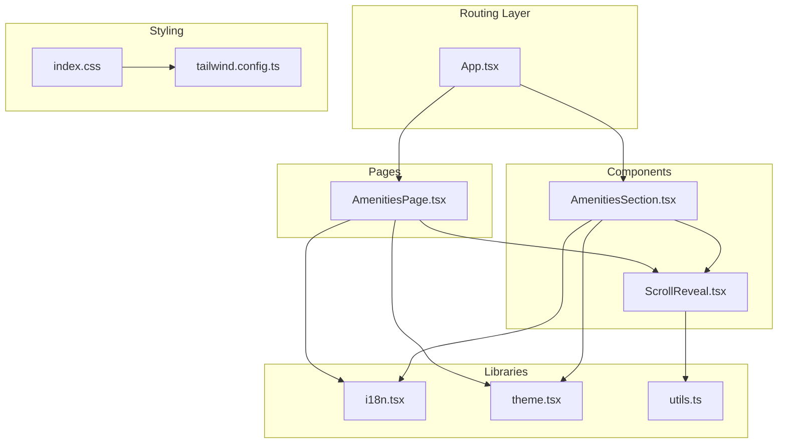
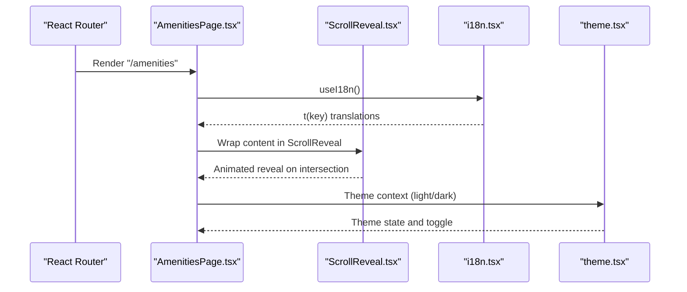
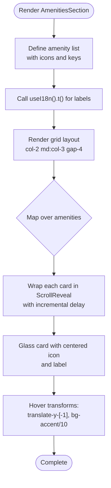
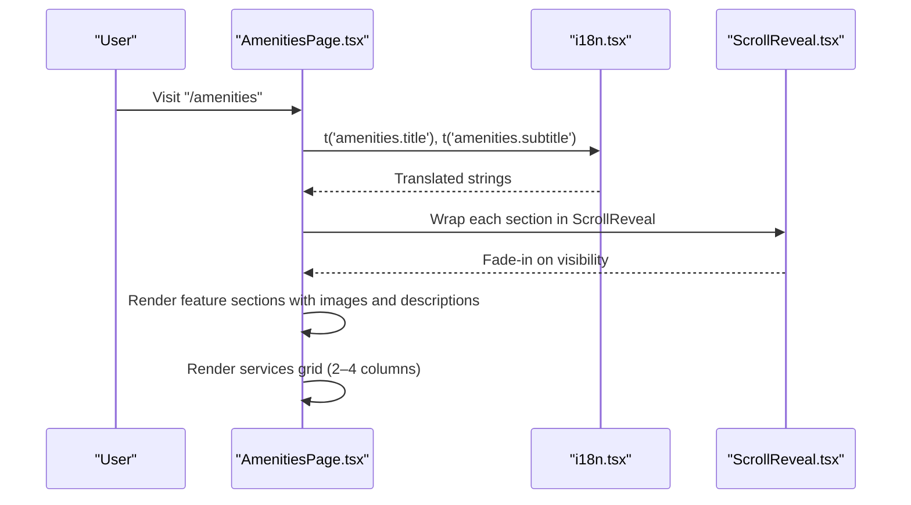
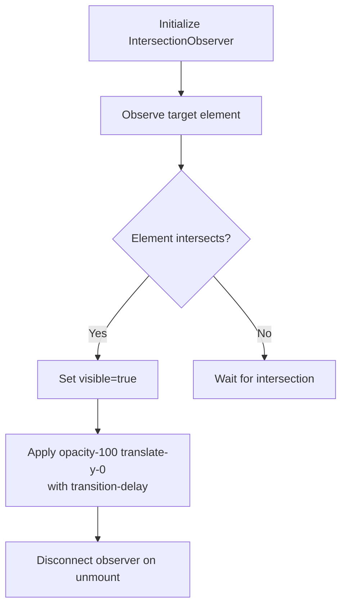
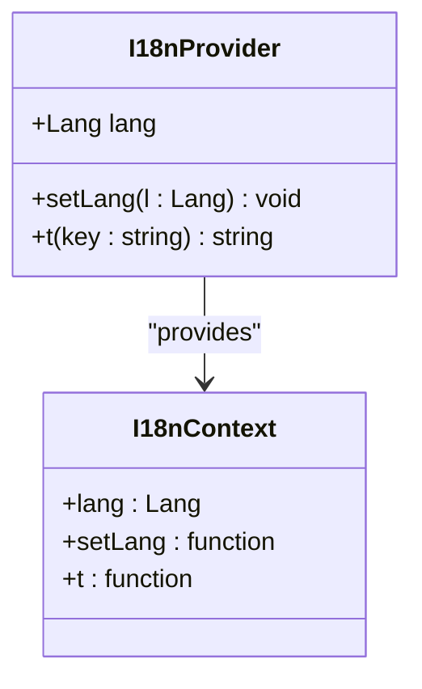
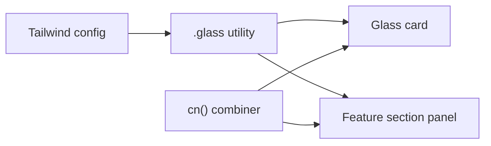
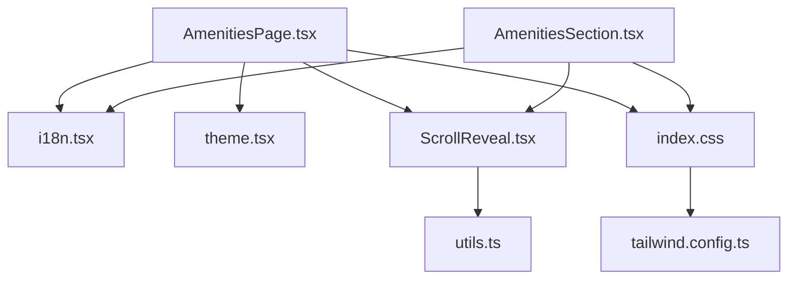

# Amenities Showcase

<cite>
**Referenced Files in This Document**
- [AmenitiesSection.tsx](file://src/components/AmenitiesSection.tsx)
- [AmenitiesPage.tsx](file://src/pages/AmenitiesPage.tsx)
- [i18n.tsx](file://src/lib/i18n.tsx)
- [card.tsx](file://src/components/ui/card.tsx)
- [ScrollReveal.tsx](file://src/components/ScrollReveal.tsx)
- [App.tsx](file://src/App.tsx)
- [index.css](file://src/index.css)
- [tailwind.config.ts](file://tailwind.config.ts)
- [utils.ts](file://src/lib/utils.ts)
- [theme.tsx](file://src/lib/theme.tsx)
- [use-mobile.tsx](file://src/hooks/use-mobile.tsx)
</cite>

## Table of Contents
1. [Introduction](#introduction)
2. [Project Structure](#project-structure)
3. [Core Components](#core-components)
4. [Architecture Overview](#architecture-overview)
5. [Detailed Component Analysis](#detailed-component-analysis)
6. [Dependency Analysis](#dependency-analysis)
7. [Performance Considerations](#performance-considerations)
8. [Troubleshooting Guide](#troubleshooting-guide)
9. [Conclusion](#conclusion)

## Introduction
This document describes the amenities showcase system, covering amenity categories, facility descriptions, and visual presentation. It explains the responsive grid layout, card-based design patterns, interactive elements, multi-language support, and integration with the overall design system. It also documents component composition patterns, styling approaches, and responsive behavior across screen sizes.

## Project Structure
The amenities showcase spans two primary areas:
- A compact amenities overview component used across the site
- A dedicated amenities page with detailed sections and service listings

Key supporting systems include internationalization, theme management, animations, and design tokens.

**Diagram sources**
- [App.tsx](file://src/App.tsx#L19-L42)
- [AmenitiesPage.tsx](file://src/pages/AmenitiesPage.tsx#L1-L65)
- [AmenitiesSection.tsx](file://src/components/AmenitiesSection.tsx#L1-L43)
- [ScrollReveal.tsx](file://src/components/ScrollReveal.tsx#L1-L37)
- [i18n.tsx](file://src/lib/i18n.tsx#L148-L173)
- [theme.tsx](file://src/lib/theme.tsx#L12-L31)
- [utils.ts](file://src/lib/utils.ts#L4-L6)
- [index.css](file://src/index.css#L1-L146)
- [tailwind.config.ts](file://tailwind.config.ts#L1-L86)

**Section sources**
- [App.tsx](file://src/App.tsx#L19-L42)
- [AmenitiesPage.tsx](file://src/pages/AmenitiesPage.tsx#L1-L65)
- [AmenitiesSection.tsx](file://src/components/AmenitiesSection.tsx#L1-L43)
- [i18n.tsx](file://src/lib/i18n.tsx#L148-L173)
- [theme.tsx](file://src/lib/theme.tsx#L12-L31)
- [index.css](file://src/index.css#L1-L146)
- [tailwind.config.ts](file://tailwind.config.ts#L1-L86)

## Core Components
- AmenitiesSection: Presents a responsive grid of amenity cards with animated reveals and hover effects.
- AmenitiesPage: Full-page layout featuring image-text sections for major amenities and a grid of service cards.
- ScrollReveal: IntersectionObserver-based reveal animation with configurable delays.
- i18n: Multi-language provider supporting English, Russian, and Uzbek with persistent language selection.
- Design system: Glass effect utilities, typography tokens, and responsive grid classes.

**Section sources**
- [AmenitiesSection.tsx](file://src/components/AmenitiesSection.tsx#L5-L43)
- [AmenitiesPage.tsx](file://src/pages/AmenitiesPage.tsx#L9-L65)
- [ScrollReveal.tsx](file://src/components/ScrollReveal.tsx#L10-L37)
- [i18n.tsx](file://src/lib/i18n.tsx#L3-L173)
- [index.css](file://src/index.css#L92-L129)

## Architecture Overview
The amenities showcase integrates routing, localization, theming, and animations to deliver a cohesive experience. The page composes reusable reveal animations and glass-styled cards, while the i18n provider supplies translations for all text content.

**Diagram sources**
- [App.tsx](file://src/App.tsx#L26-L36)
- [AmenitiesPage.tsx](file://src/pages/AmenitiesPage.tsx#L1-L65)
- [ScrollReveal.tsx](file://src/components/ScrollReveal.tsx#L14-L21)
- [i18n.tsx](file://src/lib/i18n.tsx#L159-L161)
- [theme.tsx](file://src/lib/theme.tsx#L19-L22)

## Detailed Component Analysis

### AmenitiesSection Component
Purpose: Display a compact, responsive grid of amenity icons with localized labels and subtle hover animations.

Key features:
- Responsive grid: Two columns on small screens, three columns on medium and larger.
- Hover effects: Cards lift slightly and icon containers pulse with accent color on hover.
- Localized labels: Uses the i18n provider to render amenity names.
- Reveal animation: Each card fades in with a staggered delay.

**Diagram sources**
- [AmenitiesSection.tsx](file://src/components/AmenitiesSection.tsx#L8-L39)
- [ScrollReveal.tsx](file://src/components/ScrollReveal.tsx#L10-L37)
- [i18n.tsx](file://src/lib/i18n.tsx#L159-L161)

**Section sources**
- [AmenitiesSection.tsx](file://src/components/AmenitiesSection.tsx#L5-L43)
- [ScrollReveal.tsx](file://src/components/ScrollReveal.tsx#L10-L37)
- [i18n.tsx](file://src/lib/i18n.tsx#L60-L68)

### AmenitiesPage Component
Purpose: Present detailed sections for major amenities (e.g., spa, restaurant) alongside a grid of additional services.

Structure:
- Page header with localized title and subtitle.
- Feature sections alternating image and content blocks with responsive layout.
- Additional services grid with icons and labels.

Responsive behavior:
- Sections stack vertically on small screens and align side-by-side on large screens.
- Alternate direction for odd/even sections to create visual rhythm.
- Services grid adjusts from two to four columns based on viewport width.

**Diagram sources**
- [AmenitiesPage.tsx](file://src/pages/AmenitiesPage.tsx#L12-L59)
- [i18n.tsx](file://src/lib/i18n.tsx#L60-L68)
- [ScrollReveal.tsx](file://src/components/ScrollReveal.tsx#L14-L21)

**Section sources**
- [AmenitiesPage.tsx](file://src/pages/AmenitiesPage.tsx#L9-L65)

### ScrollReveal Animation Component
Purpose: Provide fade-in and slide-up animations triggered by element intersection in the viewport.

Implementation highlights:
- Uses IntersectionObserver with a low threshold to trigger early.
- Applies opacity and vertical translation transitions.
- Supports optional delay to create cascading reveals.

**Diagram sources**
- [ScrollReveal.tsx](file://src/components/ScrollReveal.tsx#L14-L21)

**Section sources**
- [ScrollReveal.tsx](file://src/components/ScrollReveal.tsx#L1-L37)

### Multi-Language Support
The i18n provider supports three languages and persists user preference in local storage. Keys for amenities are organized under a dedicated namespace.

Supported languages:
- English (default)
- Russian
- Uzbek

Translation keys used:
- Navigation: nav.amenities
- Page headings: amenities.title, amenities.subtitle
- Amenity labels: amenities.spa, amenities.pool, amenities.restaurant, amenities.gym, amenities.concierge, amenities.transfer

**Diagram sources**
- [i18n.tsx](file://src/lib/i18n.tsx#L142-L167)

**Section sources**
- [i18n.tsx](file://src/lib/i18n.tsx#L3-L173)

### Design System and Styling
Design tokens and utilities:
- Glass effect utilities (.glass, .glass-strong, .glass-subtle) provide frosted panels with backdrop filters.
- Typography: serif family for headings, sans for body text.
- Color palette: accent color for icons and highlights, secondary backgrounds for sections.
- Responsive grids: grid-cols-2 on small, grid-cols-3/4 on larger breakpoints.

Composition patterns:
- Reusable glass cards for both feature sections and service grids.
- Consistent spacing and rounded corners across components.
- Hover states unified via shared transition utilities.

**Diagram sources**
- [index.css](file://src/index.css#L92-L129)
- [tailwind.config.ts](file://tailwind.config.ts#L13-L67)
- [utils.ts](file://src/lib/utils.ts#L4-L6)

**Section sources**
- [index.css](file://src/index.css#L92-L129)
- [tailwind.config.ts](file://tailwind.config.ts#L13-L67)
- [utils.ts](file://src/lib/utils.ts#L4-L6)

### Responsive Behavior Across Screen Sizes
- Small screens: Two-column grid for services; stacked sections; minimal spacing adjustments.
- Medium screens: Three-column grid for the compact amenities overview; maintain two-column services.
- Large screens: Four-column grid for services; feature sections display side-by-side with alternate reversal for visual interest.

Breakpoint references:
- md: 768px (used for grid column changes)
- lg: 1024px (used for section layout and spacing)

**Section sources**
- [AmenitiesSection.tsx](file://src/components/AmenitiesSection.tsx#L28-L39)
- [AmenitiesPage.tsx](file://src/pages/AmenitiesPage.tsx#L38-L59)
- [use-mobile.tsx](file://src/hooks/use-mobile.tsx#L3-L18)

## Dependency Analysis
The amenities showcase depends on:
- Routing: React Router for page rendering.
- Internationalization: i18n provider for translations.
- Theming: Theme provider for light/dark mode persistence.
- Utilities: cn() for safe class merging.
- Animations: ScrollReveal for viewport-triggered transitions.

**Diagram sources**
- [AmenitiesPage.tsx](file://src/pages/AmenitiesPage.tsx#L1-L65)
- [AmenitiesSection.tsx](file://src/components/AmenitiesSection.tsx#L1-L43)
- [i18n.tsx](file://src/lib/i18n.tsx#L148-L173)
- [theme.tsx](file://src/lib/theme.tsx#L12-L31)
- [ScrollReveal.tsx](file://src/components/ScrollReveal.tsx#L1-L37)
- [utils.ts](file://src/lib/utils.ts#L4-L6)
- [index.css](file://src/index.css#L1-L146)
- [tailwind.config.ts](file://tailwind.config.ts#L1-L86)

**Section sources**
- [App.tsx](file://src/App.tsx#L19-L42)
- [AmenitiesPage.tsx](file://src/pages/AmenitiesPage.tsx#L1-L65)
- [AmenitiesSection.tsx](file://src/components/AmenitiesSection.tsx#L1-L43)
- [i18n.tsx](file://src/lib/i18n.tsx#L148-L173)
- [theme.tsx](file://src/lib/theme.tsx#L12-L31)
- [ScrollReveal.tsx](file://src/components/ScrollReveal.tsx#L1-L37)
- [utils.ts](file://src/lib/utils.ts#L4-L6)
- [index.css](file://src/index.css#L1-L146)
- [tailwind.config.ts](file://tailwind.config.ts#L1-L86)

## Performance Considerations
- IntersectionObserver usage ensures animations only run when elements are near the viewport, reducing unnecessary reflows.
- Minimal DOM nesting in cards keeps rendering lightweight.
- CSS transitions leverage GPU-friendly properties (opacity, transform).
- Class merging via cn() avoids excessive inline styles.

## Troubleshooting Guide
Common issues and resolutions:
- Translations not appearing: Verify the i18n keys match the expected namespace and that the provider is initialized at the app root.
- Animations not triggering: Confirm the element enters the viewport and IntersectionObserver thresholds are met.
- Glass effects missing: Ensure the glass utility classes are present and Tailwind is processing the base layer styles.
- Hover effects not smooth: Check transition utilities and avoid conflicting transform properties.

**Section sources**
- [i18n.tsx](file://src/lib/i18n.tsx#L159-L161)
- [ScrollReveal.tsx](file://src/components/ScrollReveal.tsx#L14-L21)
- [index.css](file://src/index.css#L92-L129)

## Conclusion
The amenities showcase combines responsive design, localized content, and subtle animations to present hotel facilities effectively. The modular component architecture, robust i18n integration, and consistent design tokens enable scalable enhancements while maintaining visual coherence across devices and themes.