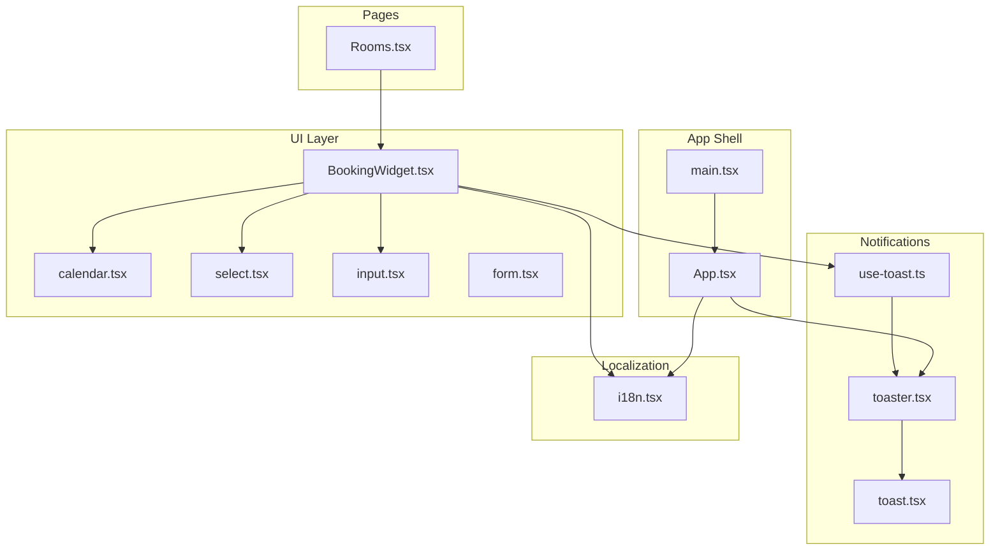
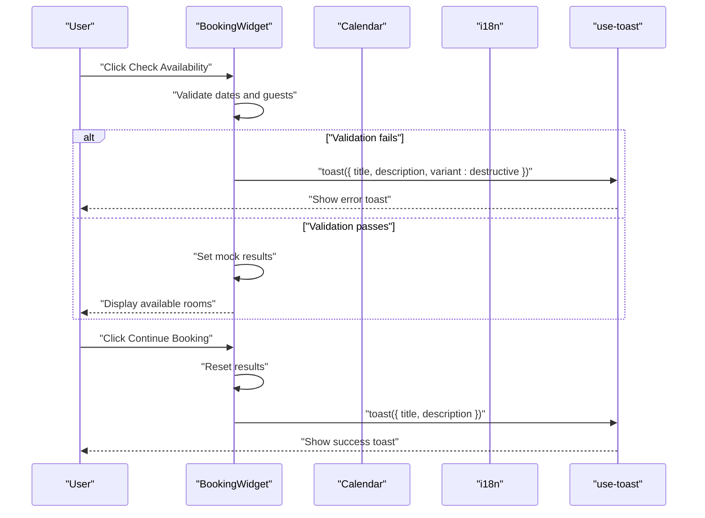
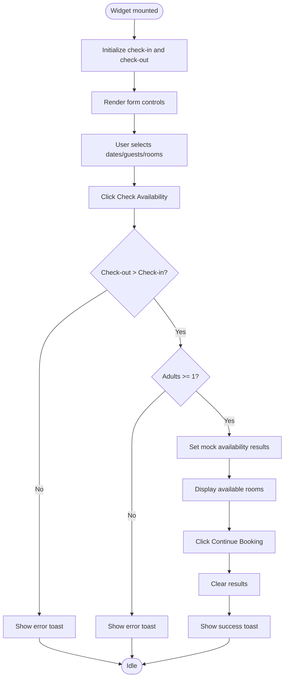
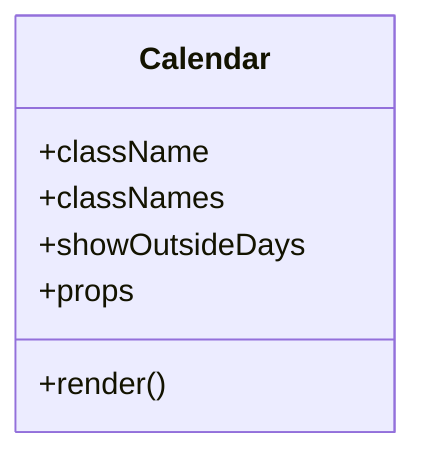
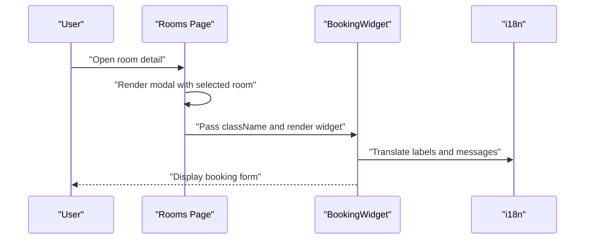
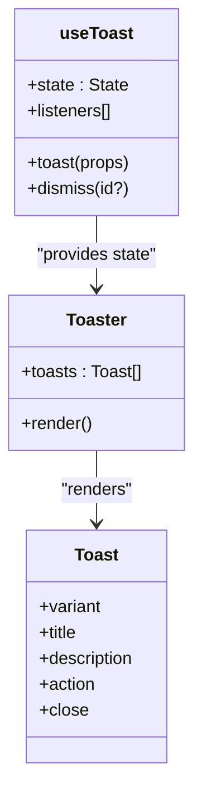
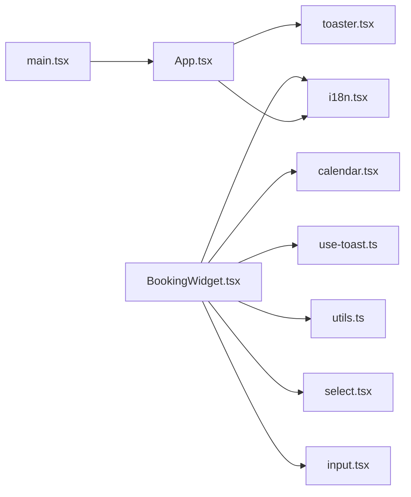

# Booking System

<cite>
**Referenced Files in This Document**
- [BookingWidget.tsx](file://src/components/BookingWidget.tsx)
- [calendar.tsx](file://src/components/ui/calendar.tsx)
- [Rooms.tsx](file://src/pages/Rooms.tsx)
- [use-toast.ts](file://src/hooks/use-toast.ts)
- [toast.tsx](file://src/components/ui/toast.tsx)
- [toaster.tsx](file://src/components/ui/toaster.tsx)
- [i18n.tsx](file://src/lib/i18n.tsx)
- [utils.ts](file://src/lib/utils.ts)
- [form.tsx](file://src/components/ui/form.tsx)
- [select.tsx](file://src/components/ui/select.tsx)
- [input.tsx](file://src/components/ui/input.tsx)
- [App.tsx](file://src/App.tsx)
- [main.tsx](file://src/main.tsx)
</cite>

## Table of Contents
1. [Introduction](#introduction)
2. [Project Structure](#project-structure)
3. [Core Components](#core-components)
4. [Architecture Overview](#architecture-overview)
5. [Detailed Component Analysis](#detailed-component-analysis)
6. [Dependency Analysis](#dependency-analysis)
7. [Performance Considerations](#performance-considerations)
8. [Troubleshooting Guide](#troubleshooting-guide)
9. [Conclusion](#conclusion)
10. [Appendices](#appendices)

## Introduction
This document explains the booking system functionality implemented in the frontend. It covers the booking widget that allows users to select dates, manage guests and rooms, and check availability. It also documents the current validation approach, the mock data integration for availability and pricing, the toast notification system for user feedback, and practical examples of the booking flow. Finally, it outlines performance considerations for date calculations and availability checks.

## Project Structure
The booking system spans several components and pages:
- The booking widget is a self-contained UI component that manages state for check-in/check-out dates, guests, rooms, and promo code.
- The calendar component is a reusable UI element used inside the booking widget.
- The rooms page integrates the booking widget into a room detail modal.
- The toast system provides global user feedback via a custom hook and UI components.
- Internationalization keys support localized labels and messages.

**Diagram sources**
- [BookingWidget.tsx](file://src/components/BookingWidget.tsx#L1-L154)
- [calendar.tsx](file://src/components/ui/calendar.tsx#L1-L55)
- [Rooms.tsx](file://src/pages/Rooms.tsx#L1-L102)
- [use-toast.ts](file://src/hooks/use-toast.ts#L1-L187)
- [toast.tsx](file://src/components/ui/toast.tsx#L1-L112)
- [toaster.tsx](file://src/components/ui/toaster.tsx#L1-L25)
- [i18n.tsx](file://src/lib/i18n.tsx#L1-L173)
- [App.tsx](file://src/App.tsx#L1-L45)
- [main.tsx](file://src/main.tsx#L1-L6)

**Section sources**
- [BookingWidget.tsx](file://src/components/BookingWidget.tsx#L1-L154)
- [Rooms.tsx](file://src/pages/Rooms.tsx#L1-L102)
- [App.tsx](file://src/App.tsx#L1-L45)
- [main.tsx](file://src/main.tsx#L1-L6)

## Core Components
- BookingWidget: Central UI for date selection, guest controls, room selection, promo code, availability search, and results display.
- Calendar: Reusable date picker used by the booking widget.
- Rooms page: Hosts the booking widget in a room detail modal.
- Toast system: Provides global notifications for success and errors.
- Internationalization: Supplies localized strings for labels and messages.

Key responsibilities:
- Date selection: Uses a popover-wrapped calendar for single-day selection for check-in and check-out.
- Guest and room controls: Uses HTML select inputs for adults, children, and rooms.
- Availability: Currently displays mock room results upon search.
- Notifications: Uses a custom toast hook and UI components for user feedback.

**Section sources**
- [BookingWidget.tsx](file://src/components/BookingWidget.tsx#L15-L154)
- [calendar.tsx](file://src/components/ui/calendar.tsx#L10-L51)
- [Rooms.tsx](file://src/pages/Rooms.tsx#L78-L96)
- [use-toast.ts](file://src/hooks/use-toast.ts#L137-L164)
- [toast.tsx](file://src/components/ui/toast.tsx#L40-L46)
- [toaster.tsx](file://src/components/ui/toaster.tsx#L4-L24)
- [i18n.tsx](file://src/lib/i18n.tsx#L21-L33)

## Architecture Overview
The booking flow is event-driven:
- Users interact with the booking widget to set dates, guests, rooms, and promo code.
- On search, the widget validates inputs and displays mock availability results.
- On continue, the widget resets results and shows a success message via toast.

**Diagram sources**
- [BookingWidget.tsx](file://src/components/BookingWidget.tsx#L25-L44)
- [use-toast.ts](file://src/hooks/use-toast.ts#L137-L164)
- [i18n.tsx](file://src/lib/i18n.tsx#L33-L33)

## Detailed Component Analysis

### Booking Widget
The booking widget encapsulates:
- State for check-in/check-out dates, guests (adults/children), rooms, and promo code.
- A search handler that performs basic validation and sets mock availability results.
- A continue handler that clears results and sends a success toast.
- Integration with the calendar component for date picking and with i18n for labels.

**Diagram sources**
- [BookingWidget.tsx](file://src/components/BookingWidget.tsx#L17-L44)

**Section sources**
- [BookingWidget.tsx](file://src/components/BookingWidget.tsx#L15-L154)

### Calendar Component
The calendar is a thin wrapper around a date picker library, exposing a single-mode calendar suitable for check-in/check-out selection. It defines styling and navigation icons and forwards props to the underlying calendar.

**Diagram sources**
- [calendar.tsx](file://src/components/ui/calendar.tsx#L10-L51)

**Section sources**
- [calendar.tsx](file://src/components/ui/calendar.tsx#L1-L55)

### Rooms Page Integration
The rooms page hosts the booking widget inside a room detail modal. It also provides room listings and filtering, and passes localized strings from the i18n provider.

**Diagram sources**
- [Rooms.tsx](file://src/pages/Rooms.tsx#L78-L96)
- [i18n.tsx](file://src/lib/i18n.tsx#L21-L33)

**Section sources**
- [Rooms.tsx](file://src/pages/Rooms.tsx#L1-L102)

### Toast Notification System
The toast system provides a global notification layer:
- A custom hook manages state, IDs, timeouts, and listeners.
- A UI component renders toasts and supports destructive styling.
- A provider component renders the toast list and viewport.

**Diagram sources**
- [use-toast.ts](file://src/hooks/use-toast.ts#L71-L122)
- [toaster.tsx](file://src/components/ui/toaster.tsx#L4-L24)
- [toast.tsx](file://src/components/ui/toast.tsx#L40-L46)

**Section sources**
- [use-toast.ts](file://src/hooks/use-toast.ts#L1-L187)
- [toast.tsx](file://src/components/ui/toast.tsx#L1-L112)
- [toaster.tsx](file://src/components/ui/toaster.tsx#L1-L25)

### Internationalization
The i18n provider supplies localized strings for the booking widget, including labels for dates, guests, rooms, and messages. The widget consumes these via a hook.

**Section sources**
- [i18n.tsx](file://src/lib/i18n.tsx#L21-L33)
- [BookingWidget.tsx](file://src/components/BookingWidget.tsx#L16-L16)

### Validation and Zod Schemas
Current implementation performs basic validation directly in the booking widget’s search handler. There is no explicit Zod schema integration in the provided files. The validation checks:
- Check-out is after check-in.
- At least one adult guest.

Future enhancements could integrate React Hook Form with Zod for robust client-side validation.

**Section sources**
- [BookingWidget.tsx](file://src/components/BookingWidget.tsx#L25-L33)
- [form.tsx](file://src/components/ui/form.tsx#L1-L130)

### Mock Data and Availability
The widget sets mock availability results upon successful validation. These results include room names and nightly rates. Pricing is currently hardcoded.

**Section sources**
- [BookingWidget.tsx](file://src/components/BookingWidget.tsx#L34-L38)

## Dependency Analysis
The booking widget depends on:
- Calendar for date selection.
- i18n for localized labels.
- Toast hook for user feedback.
- Utility functions for class merging.

**Diagram sources**
- [BookingWidget.tsx](file://src/components/BookingWidget.tsx#L1-L10)
- [calendar.tsx](file://src/components/ui/calendar.tsx#L1-L7)
- [i18n.tsx](file://src/lib/i18n.tsx#L1-L10)
- [use-toast.ts](file://src/hooks/use-toast.ts#L1-L3)
- [utils.ts](file://src/lib/utils.ts#L1-L7)
- [select.tsx](file://src/components/ui/select.tsx#L1-L6)
- [input.tsx](file://src/components/ui/input.tsx#L1-L6)
- [toaster.tsx](file://src/components/ui/toaster.tsx#L1-L2)
- [App.tsx](file://src/App.tsx#L1-L8)
- [main.tsx](file://src/main.tsx#L1-L6)

**Section sources**
- [BookingWidget.tsx](file://src/components/BookingWidget.tsx#L1-L10)
- [App.tsx](file://src/App.tsx#L1-L8)
- [main.tsx](file://src/main.tsx#L1-L6)

## Performance Considerations
- Date calculations: The widget uses a date utility for formatting and adding days. Keep date operations lightweight and avoid recalculating unnecessarily during renders.
- Availability checks: With mock data, rendering is fast. If integrating real availability queries, consider debouncing and caching to reduce network requests.
- Toast lifecycle: The toast hook manages timeouts per toast ID. Limit concurrent toasts to prevent UI thrashing.
- Rendering cost: The booking widget re-renders on state changes. Memoize derived values and avoid unnecessary re-renders of child components.

[No sources needed since this section provides general guidance]

## Troubleshooting Guide
Common issues and resolutions:
- Dates invalid: Ensure check-out is later than check-in; otherwise, an error toast is shown.
- No adults: At least one adult is required; otherwise, an error toast is shown.
- Toast not appearing: Verify the app shell wraps the UI with the toast provider and that the hook is called correctly.
- Localization missing: Confirm i18n keys exist for the current language and that the provider is initialized at the root.

**Section sources**
- [BookingWidget.tsx](file://src/components/BookingWidget.tsx#L25-L33)
- [use-toast.ts](file://src/hooks/use-toast.ts#L137-L164)
- [toaster.tsx](file://src/components/ui/toaster.tsx#L4-L24)
- [i18n.tsx](file://src/lib/i18n.tsx#L21-L33)

## Conclusion
The booking system provides a functional, localized booking widget with a clean UI and immediate feedback via toasts. While the current validation and availability logic are basic, the architecture supports future enhancements such as integrating React Hook Form with Zod schemas and replacing mock data with real-time availability checks.

[No sources needed since this section summarizes without analyzing specific files]

## Appendices

### Practical Examples
- Booking flow example:
  - Select check-in and check-out dates.
  - Choose number of adults and children.
  - Optionally enter a promo code.
  - Click “Check Availability” to see mock results.
  - Click “Continue Booking” to receive a success toast and reset results.
- Date validation rules:
  - Check-out must be after check-in.
  - Must have at least one adult guest.
- Integration patterns:
  - Wrap the app with providers for i18n, theme, and toasts.
  - Embed the booking widget in room modals or landing pages.

[No sources needed since this section provides general guidance]