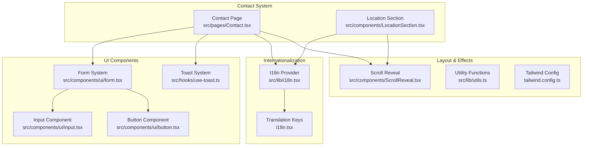
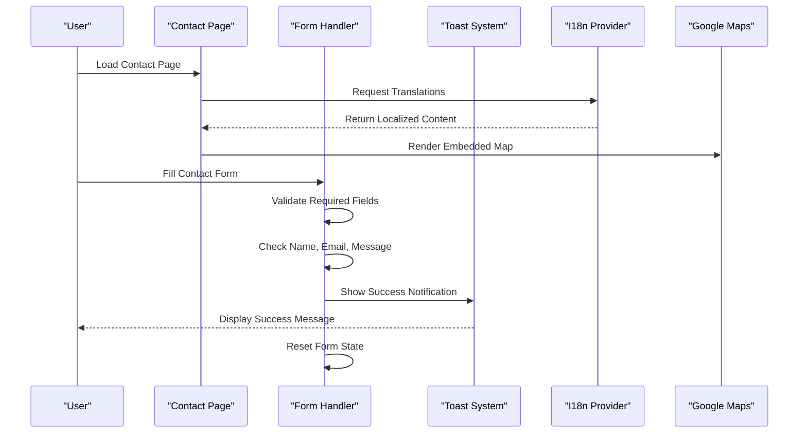
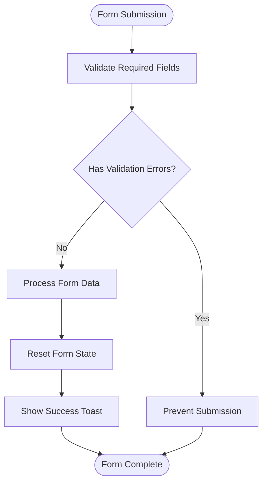
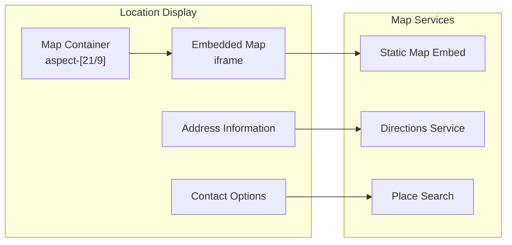
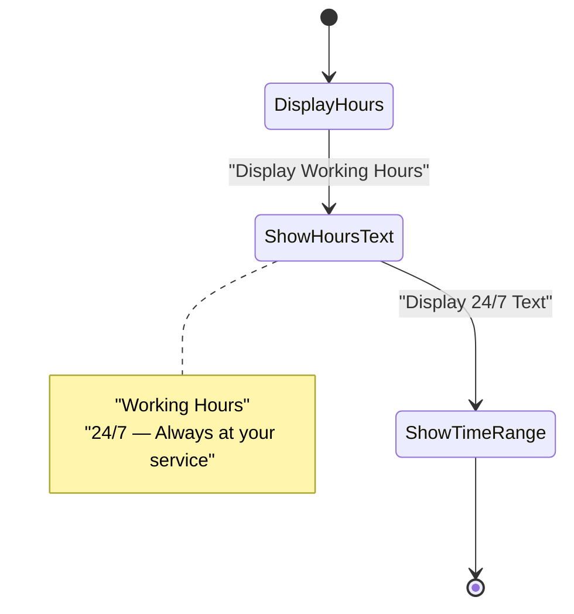
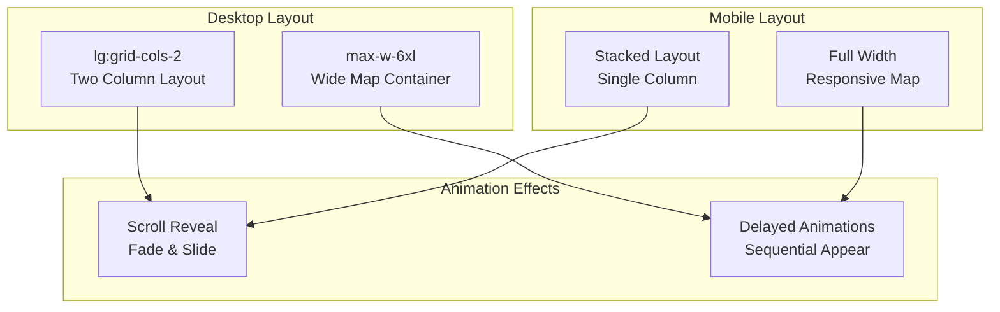
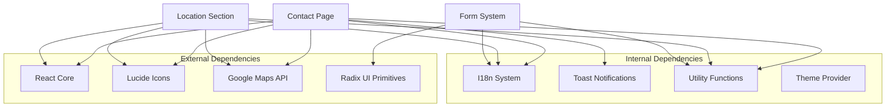

# Contact and Location Information

<cite>
**Referenced Files in This Document**
- [Contact.tsx](file://src/pages/Contact.tsx)
- [LocationSection.tsx](file://src/components/LocationSection.tsx)
- [i18n.tsx](file://src/lib/i18n.tsx)
- [form.tsx](file://src/components/ui/form.tsx)
- [input.tsx](file://src/components/ui/input.tsx)
- [button.tsx](file://src/components/ui/button.tsx)
- [ScrollReveal.tsx](file://src/components/ScrollReveal.tsx)
- [use-toast.ts](file://src/hooks/use-toast.ts)
- [App.tsx](file://src/App.tsx)
- [main.tsx](file://src/main.tsx)
- [utils.ts](file://src/lib/utils.ts)
- [tailwind.config.ts](file://tailwind.config.ts)
</cite>

## Table of Contents
1. [Introduction](#introduction)
2. [Project Structure](#project-structure)
3. [Core Components](#core-components)
4. [Architecture Overview](#architecture-overview)
5. [Detailed Component Analysis](#detailed-component-analysis)
6. [Dependency Analysis](#dependency-analysis)
7. [Performance Considerations](#performance-considerations)
8. [Accessibility Features](#accessibility-features)
9. [Troubleshooting Guide](#troubleshooting-guide)
10. [Conclusion](#conclusion)

## Introduction
This document provides comprehensive documentation for the contact and location information system. It covers the contact form implementation with validation and submission handling, the location display with Google Maps integration, business hours presentation, and responsive layout patterns. The system includes internationalization support, toast notifications, and accessibility features designed for a luxury hospitality experience.

## Project Structure
The contact and location system is organized around two primary components:
- Contact page: Full-page contact form with integrated location information and map
- Location section: Dedicated location display with directions and contact options

**Diagram sources**
- [Contact.tsx](file://src/pages/Contact.tsx#L1-L150)
- [LocationSection.tsx](file://src/components/LocationSection.tsx#L1-L91)
- [i18n.tsx](file://src/lib/i18n.tsx#L1-L173)

**Section sources**
- [Contact.tsx](file://src/pages/Contact.tsx#L1-L150)
- [LocationSection.tsx](file://src/components/LocationSection.tsx#L1-L91)
- [App.tsx](file://src/App.tsx#L1-L45)

## Core Components
The system consists of three main components:

### Contact Page Component
The primary contact page implements a responsive two-column layout featuring:
- Glass-morphism contact form with validation
- Location information panel with multiple contact channels
- Integrated Google Maps iframe for location display
- Business hours presentation with 24/7 availability messaging

### Location Section Component
A dedicated location display component offering:
- Embedded Google Maps with responsive aspect ratio
- Comprehensive contact information (address, phone, email)
- Interactive directions and social media links
- Call-to-action buttons for immediate engagement

### Form System
Built-in form validation using React state management with:
- Required field validation (name, email, message)
- Real-time state updates
- Success notification system
- Accessible form controls with proper labeling

**Section sources**
- [Contact.tsx](file://src/pages/Contact.tsx#L9-L149)
- [LocationSection.tsx](file://src/components/LocationSection.tsx#L5-L90)
- [form.tsx](file://src/components/ui/form.tsx#L1-L130)

## Architecture Overview
The contact and location system follows a modular architecture with clear separation of concerns:

**Diagram sources**
- [Contact.tsx](file://src/pages/Contact.tsx#L13-L18)
- [use-toast.ts](file://src/hooks/use-toast.ts#L137-L164)
- [i18n.tsx](file://src/lib/i18n.tsx#L159-L161)

The architecture ensures:
- **Separation of Concerns**: UI components handle presentation while form logic manages validation
- **Internationalization**: Centralized translation management with fallback mechanisms
- **Responsive Design**: Mobile-first approach with grid-based layouts
- **Accessibility**: Proper ARIA attributes and keyboard navigation support

## Detailed Component Analysis

### Contact Form Implementation
The contact form implements essential validation and submission handling:

**Diagram sources**
- [Contact.tsx](file://src/pages/Contact.tsx#L13-L18)

Key validation features:
- **Required Fields**: Name, email, and message are mandatory
- **Real-time Updates**: Form state updates immediately with user input
- **Success Feedback**: Toast notification confirms successful submission
- **State Management**: Form resets automatically after successful submission

### Location Display with Map Integration
The location system integrates multiple Google Maps services:

**Diagram sources**
- [Contact.tsx](file://src/pages/Contact.tsx#L129-L142)
- [LocationSection.tsx](file://src/components/LocationSection.tsx#L20-L34)

Map integration features:
- **Responsive Aspect Ratio**: Maintains 21:9 ratio for optimal display
- **Lazy Loading**: Improves initial page load performance
- **Accessibility**: Proper title attribute for screen readers
- **Cross-platform Links**: External navigation to Google Maps applications

### Business Hours Display
The system presents business hours with clear communication:

**Diagram sources**
- [Contact.tsx](file://src/pages/Contact.tsx#L117-L123)
- [i18n.tsx](file://src/lib/i18n.tsx#L132-L133)

Business hours implementation:
- **Clear Labeling**: "Working Hours" header with prominent display
- **Service Availability**: "24/7 — Always at your service" messaging
- **Internationalization**: Localized business hours text support

### Responsive Layout Patterns
The system employs modern responsive design patterns:

**Diagram sources**
- [Contact.tsx](file://src/pages/Contact.tsx#L31-L143)
- [ScrollReveal.tsx](file://src/components/ScrollReveal.tsx#L10-L36)

Responsive features:
- **Grid System**: Two-column layout on large screens, stacked on mobile
- **Aspect Ratios**: Maintained map proportions across devices
- **Animation Delays**: Sequential reveal effects for enhanced UX
- **Glass Morphism**: Consistent visual treatment across breakpoints

**Section sources**
- [Contact.tsx](file://src/pages/Contact.tsx#L1-L150)
- [LocationSection.tsx](file://src/components/LocationSection.tsx#L1-L91)
- [ScrollReveal.tsx](file://src/components/ScrollReveal.tsx#L1-L37)

## Dependency Analysis
The contact and location system has well-defined dependencies:

**Diagram sources**
- [Contact.tsx](file://src/pages/Contact.tsx#L1-L8)
- [LocationSection.tsx](file://src/components/LocationSection.tsx#L1-L3)
- [form.tsx](file://src/components/ui/form.tsx#L1-L8)

Key dependency relationships:
- **React Ecosystem**: Core framework with ecosystem libraries
- **Internationalization**: Centralized translation management
- **UI Components**: Reusable component library with consistent APIs
- **State Management**: Minimal external dependencies for form handling

**Section sources**
- [Contact.tsx](file://src/pages/Contact.tsx#L1-L10)
- [LocationSection.tsx](file://src/components/LocationSection.tsx#L1-L6)
- [form.tsx](file://src/components/ui/form.tsx#L1-L8)

## Performance Considerations
The system implements several performance optimization strategies:

### Lazy Loading and Resource Management
- **Map Lazy Loading**: Google Maps iframe uses lazy loading to improve initial page load
- **Intersection Observer**: Scroll reveal animations trigger only when elements are in viewport
- **CSS-in-JS**: Utility functions minimize CSS bundle size through conditional class merging

### State Management Efficiency
- **Minimal State Updates**: Form state updates only when user input changes
- **Local Storage Caching**: Theme and language preferences cached locally
- **Toast Memory Management**: Controlled toast queue prevents memory leaks

### Accessibility and SEO
- **Semantic HTML**: Proper heading hierarchy and landmark roles
- **ARIA Attributes**: Screen reader friendly form controls and notifications
- **Alt Text**: Descriptive alt attributes for icons and images
- **Keyboard Navigation**: Full keyboard accessibility for all interactive elements

**Section sources**
- [Contact.tsx](file://src/pages/Contact.tsx#L129-L142)
- [ScrollReveal.tsx](file://src/components/ScrollReveal.tsx#L14-L21)
- [use-toast.ts](file://src/hooks/use-toast.ts#L5-L7)

## Accessibility Features
The system incorporates comprehensive accessibility features:

### Keyboard Navigation
- **Focus Management**: Logical tab order through form fields
- **Accessible Buttons**: Proper role attributes and keyboard activation
- **Skip Links**: Alternative navigation methods for screen reader users

### Screen Reader Support
- **Descriptive Labels**: Clear form field labeling with associated labels
- **Status Messages**: Dynamic updates announce form submission results
- **Landmark Roles**: Semantic sectioning for improved navigation

### Visual Accessibility
- **Color Contrast**: Sufficient contrast ratios for text and interactive elements
- **Focus Indicators**: Visible focus rings for keyboard navigation
- **Reduced Motion**: Respects user preferences for motion reduction

### Internationalization Accessibility
- **Right-to-Left Support**: Translation keys accommodate RTL languages
- **Cultural Adaptation**: Localized date/time formats and number systems
- **Voice Control**: Natural language processing-friendly content structure

**Section sources**
- [i18n.tsx](file://src/lib/i18n.tsx#L3-L134)
- [form.tsx](file://src/components/ui/form.tsx#L85-L98)

## Troubleshooting Guide

### Common Issues and Solutions

#### Form Validation Problems
**Issue**: Form submission triggers without validation
**Solution**: Ensure all required fields have the `required` attribute and validation logic checks for empty values

#### Map Loading Failures
**Issue**: Google Maps fails to load or displays blank
**Solution**: Verify embed URL validity and check network connectivity; ensure proper referrer policy configuration

#### Toast Notification Issues
**Issue**: Success messages don't appear after form submission
**Solution**: Confirm toast provider is properly configured in the app shell and translation keys are correctly defined

#### Responsive Layout Breakdown
**Issue**: Elements overlap or stack incorrectly on mobile devices
**Solution**: Review grid classes and ensure proper breakpoint configurations in Tailwind CSS

### Debugging Tools and Techniques
- **Console Logging**: Monitor form state changes and submission flow
- **Network Inspection**: Verify Google Maps API requests and responses
- **Accessibility Audit**: Use browser developer tools to check ARIA attributes and keyboard navigation
- **Performance Profiling**: Monitor intersection observer performance and memory usage

**Section sources**
- [Contact.tsx](file://src/pages/Contact.tsx#L13-L18)
- [use-toast.ts](file://src/hooks/use-toast.ts#L137-L164)
- [ScrollReveal.tsx](file://src/components/ScrollReveal.tsx#L14-L21)

## Conclusion
The contact and location information system provides a comprehensive solution for luxury hospitality communication. It successfully combines modern UI patterns with robust functionality, delivering an intuitive user experience across all devices. The system's modular architecture, internationalization support, and accessibility features position it as a scalable foundation for future enhancements.

Key strengths include:
- **Seamless Integration**: Contact form and location display work harmoniously
- **Performance Optimization**: Lazy loading and efficient state management
- **Accessibility Compliance**: Comprehensive accessibility features and standards
- **Internationalization Ready**: Built-in support for multiple languages and cultural adaptations

The system serves as an excellent foundation for hospitality websites requiring professional contact and location presentation capabilities.