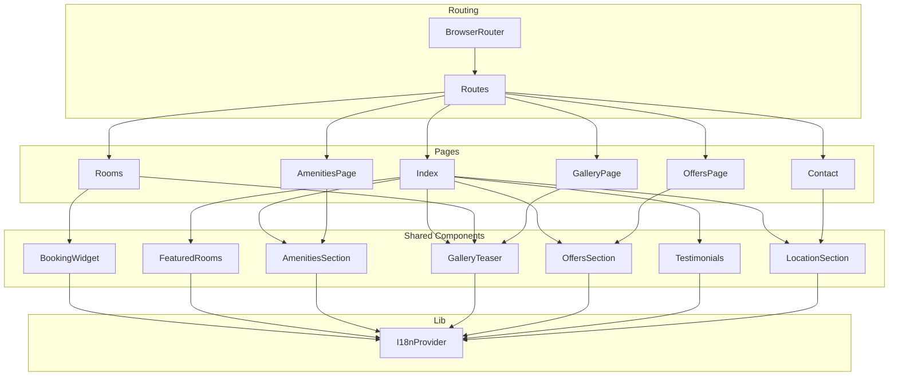
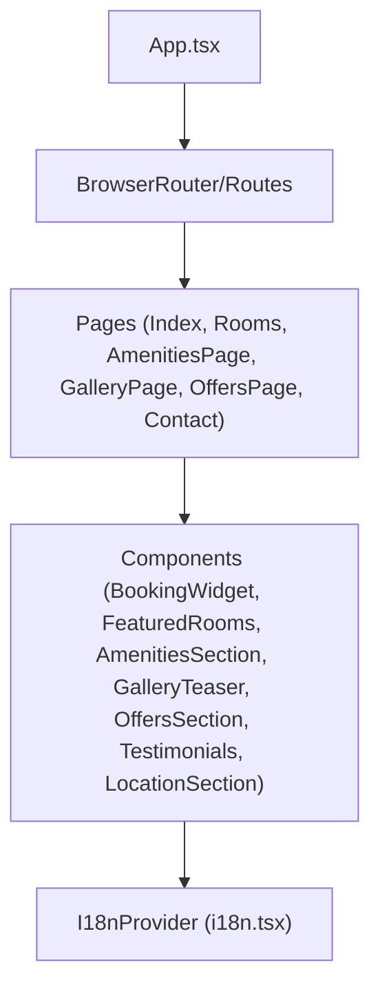
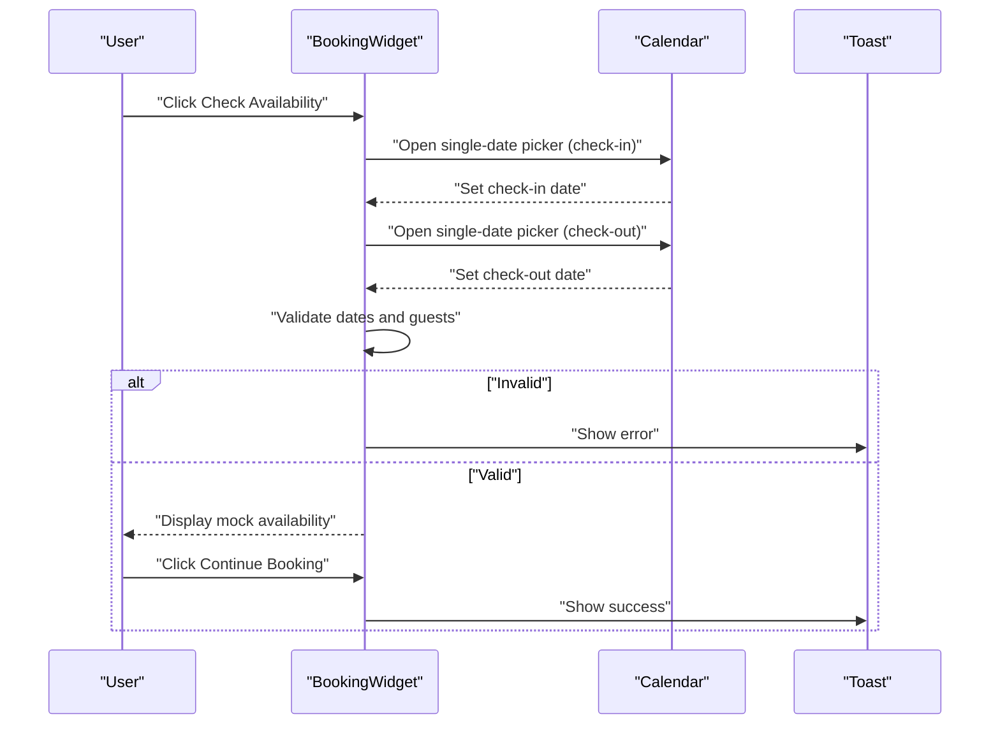
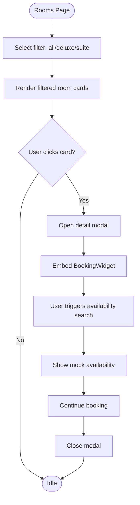
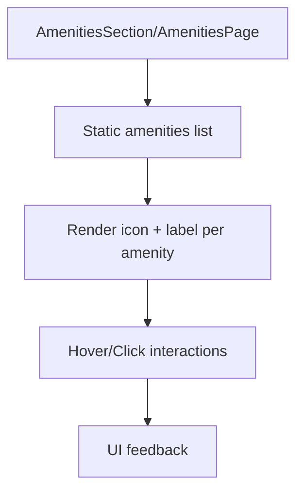
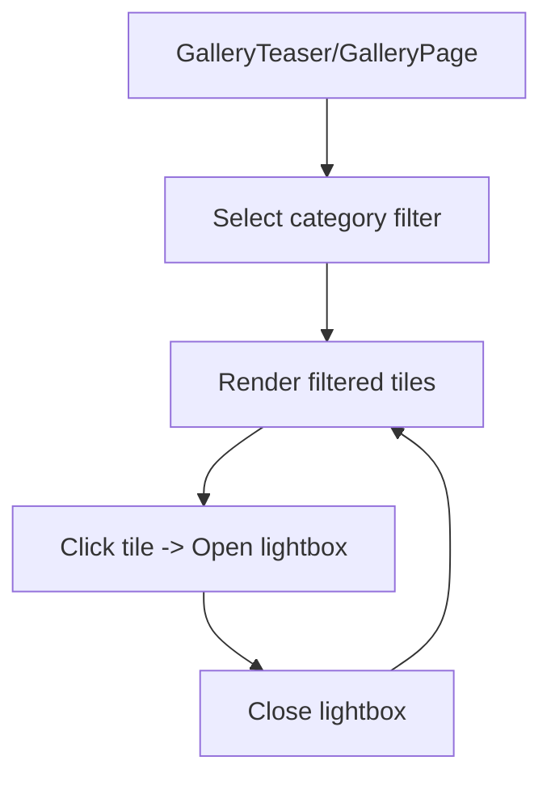
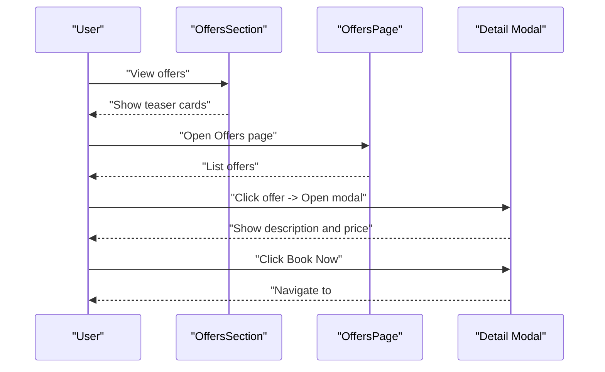
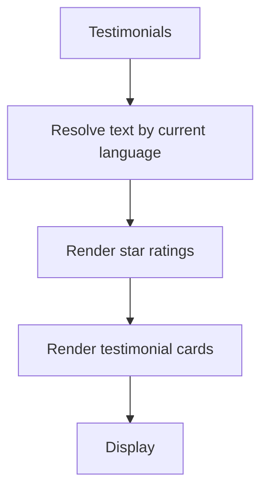
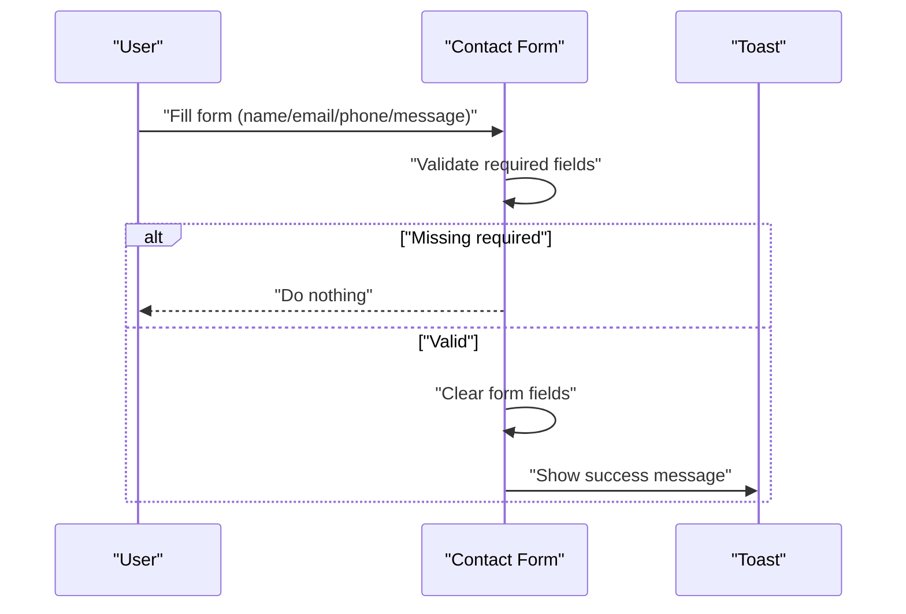
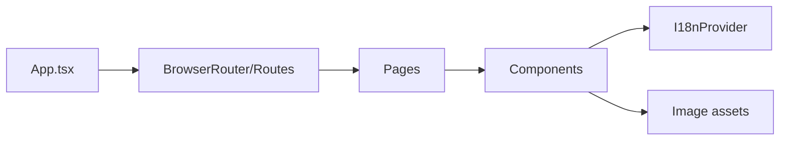

# Core Features

<cite>
**Referenced Files in This Document**
- [README.md](file://README.md)
- [App.tsx](file://src/App.tsx)
- [Index.tsx](file://src/pages/Index.tsx)
- [Rooms.tsx](file://src/pages/Rooms.tsx)
- [AmenitiesPage.tsx](file://src/pages/AmenitiesPage.tsx)
- [GalleryPage.tsx](file://src/pages/GalleryPage.tsx)
- [OffersPage.tsx](file://src/pages/OffersPage.tsx)
- [Contact.tsx](file://src/pages/Contact.tsx)
- [BookingWidget.tsx](file://src/components/BookingWidget.tsx)
- [FeaturedRooms.tsx](file://src/components/FeaturedRooms.tsx)
- [AmenitiesSection.tsx](file://src/components/AmenitiesSection.tsx)
- [GalleryTeaser.tsx](file://src/components/GalleryTeaser.tsx)
- [OffersSection.tsx](file://src/components/OffersSection.tsx)
- [Testimonials.tsx](file://src/components/Testimonials.tsx)
- [LocationSection.tsx](file://src/components/LocationSection.tsx)
- [i18n.tsx](file://src/lib/i18n.tsx)
</cite>

## Table of Contents
1. [Introduction](#introduction)
2. [Project Structure](#project-structure)
3. [Core Components](#core-components)
4. [Architecture Overview](#architecture-overview)
5. [Detailed Component Analysis](#detailed-component-analysis)
6. [Dependency Analysis](#dependency-analysis)
7. [Performance Considerations](#performance-considerations)
8. [Troubleshooting Guide](#troubleshooting-guide)
9. [Conclusion](#conclusion)
10. [Appendices](#appendices)

## Introduction
This document explains the core features of Stylo Residence Luxe as implemented in the frontend codebase. It covers the booking system (date selection, availability simulation, and reservation flow), room management (filtering, pricing display, and detail modals), amenities showcase, gallery system with filtering, special offers management, testimonials display, and contact information. For each feature, we describe implementation approaches, user workflows, data models, integration patterns, practical examples, configuration options, customization possibilities, and performance considerations.

## Project Structure
The application is a React + TypeScript SPA using Vite, styled with Tailwind CSS and UI components from shadcn/ui. Routing is handled by react-router-dom, internationalization is provided by a custom provider, and global state for UI is managed via local state in components. The app is structured by pages and shared components.

**Diagram sources**
- [App.tsx](file://src/App.tsx#L1-L45)
- [Index.tsx](file://src/pages/Index.tsx#L1-L28)
- [Rooms.tsx](file://src/pages/Rooms.tsx#L1-L102)
- [AmenitiesPage.tsx](file://src/pages/AmenitiesPage.tsx#L1-L66)
- [GalleryPage.tsx](file://src/pages/GalleryPage.tsx#L1-L79)
- [OffersPage.tsx](file://src/pages/OffersPage.tsx#L1-L62)
- [Contact.tsx](file://src/pages/Contact.tsx#L1-L133)
- [BookingWidget.tsx](file://src/components/BookingWidget.tsx#L1-L154)
- [FeaturedRooms.tsx](file://src/components/FeaturedRooms.tsx#L1-L64)
- [AmenitiesSection.tsx](file://src/components/AmenitiesSection.tsx#L1-L44)
- [GalleryTeaser.tsx](file://src/components/GalleryTeaser.tsx#L1-L56)
- [OffersSection.tsx](file://src/components/OffersSection.tsx#L1-L49)
- [Testimonials.tsx](file://src/components/Testimonials.tsx#L1-L52)
- [LocationSection.tsx](file://src/components/LocationSection.tsx#L1-L84)
- [i18n.tsx](file://src/lib/i18n.tsx#L1-L173)

**Section sources**
- [README.md](file://README.md#L53-L61)
- [App.tsx](file://src/App.tsx#L1-L45)

## Core Components
- BookingWidget: Implements date selection, guest/room selectors, promo code input, availability simulation, and reservation continuation.
- Rooms page: Provides room listing with filtering, pricing display, and a detail modal that embeds the booking widget.
- FeaturedRooms: Displays highlighted rooms on the homepage.
- AmenitiesSection and AmenitiesPage: Showcase hotel amenities and services.
- GalleryTeaser and GalleryPage: Present image galleries with category filtering and lightbox.
- OffersSection and OffersPage: Feature special offers with detail modals and a “Book Now” action.
- Testimonials: Displays guest reviews with star ratings and localized content.
- LocationSection and Contact: Provide contact information, directions, and a contact form.

**Section sources**
- [BookingWidget.tsx](file://src/components/BookingWidget.tsx#L1-L154)
- [Rooms.tsx](file://src/pages/Rooms.tsx#L1-L102)
- [FeaturedRooms.tsx](file://src/components/FeaturedRooms.tsx#L1-L64)
- [AmenitiesSection.tsx](file://src/components/AmenitiesSection.tsx#L1-L44)
- [AmenitiesPage.tsx](file://src/pages/AmenitiesPage.tsx#L1-L66)
- [GalleryTeaser.tsx](file://src/components/GalleryTeaser.tsx#L1-L56)
- [GalleryPage.tsx](file://src/pages/GalleryPage.tsx#L1-L79)
- [OffersSection.tsx](file://src/components/OffersSection.tsx#L1-L49)
- [OffersPage.tsx](file://src/pages/OffersPage.tsx#L1-L62)
- [Testimonials.tsx](file://src/components/Testimonials.tsx#L1-L52)
- [LocationSection.tsx](file://src/components/LocationSection.tsx#L1-L84)
- [Contact.tsx](file://src/pages/Contact.tsx#L1-L133)

## Architecture Overview
The app composes feature pages from reusable components. Internationalization is centralized via a provider that stores language preference in local storage. Components use local state for UI interactions and mock data for content. The booking widget simulates availability checks and reservation continuation.

**Diagram sources**
- [App.tsx](file://src/App.tsx#L1-L45)
- [i18n.tsx](file://src/lib/i18n.tsx#L148-L173)

## Detailed Component Analysis

### Booking System
Implements date selection, guest/room configuration, promo code input, availability simulation, and reservation continuation.

- Date selection: Uses a popover-triggered calendar for check-in and check-out dates. Validation ensures check-out is after check-in and at least one adult is selected.
- Availability simulation: On search, displays mock available room options with prices.
- Reservation continuation: Clears results and shows a success notification upon continue.
- Integration: Embedded inside room detail modals and featured room cards.

**Diagram sources**
- [BookingWidget.tsx](file://src/components/BookingWidget.tsx#L15-L154)

**Section sources**
- [BookingWidget.tsx](file://src/components/BookingWidget.tsx#L1-L154)
- [Rooms.tsx](file://src/pages/Rooms.tsx#L78-L96)

### Room Management System
Provides filtering, pricing display, and detail modals with embedded booking.

- Filtering: Filter by room type (all/deluxe/suite) using local state.
- Pricing display: Shows per-night pricing with locale-aware suffix.
- Detail modal: Opens on card click, shows room image, description, attributes, and a booking widget.
- Integration: Used on the Rooms page and in FeaturedRooms on the home page.

**Diagram sources**
- [Rooms.tsx](file://src/pages/Rooms.tsx#L21-L102)
- [BookingWidget.tsx](file://src/components/BookingWidget.tsx#L15-L154)

**Section sources**
- [Rooms.tsx](file://src/pages/Rooms.tsx#L1-L102)
- [FeaturedRooms.tsx](file://src/components/FeaturedRooms.tsx#L1-L64)

### Amenities Showcase
Displays hotel services and facilities in two forms:
- Section on homepage: Grid of amenity icons with hover effects.
- Dedicated page: Two-column layout with service blocks and icon cards.

**Diagram sources**
- [AmenitiesSection.tsx](file://src/components/AmenitiesSection.tsx#L1-L44)
- [AmenitiesPage.tsx](file://src/pages/AmenitiesPage.tsx#L1-L66)

**Section sources**
- [AmenitiesSection.tsx](file://src/components/AmenitiesSection.tsx#L1-L44)
- [AmenitiesPage.tsx](file://src/pages/AmenitiesPage.tsx#L1-L66)

### Gallery System with Photo Filtering
- Teaser on homepage: Grid of thumbnails with lightbox preview.
- Full gallery page: Category filter (all/rooms/lobby/spa/restaurant) and lightbox.

**Diagram sources**
- [GalleryTeaser.tsx](file://src/components/GalleryTeaser.tsx#L1-L56)
- [GalleryPage.tsx](file://src/pages/GalleryPage.tsx#L1-L79)

**Section sources**
- [GalleryTeaser.tsx](file://src/components/GalleryTeaser.tsx#L1-L56)
- [GalleryPage.tsx](file://src/pages/GalleryPage.tsx#L1-L79)

### Special Offers Management
- Homepage teaser: Three offer cards with icons, descriptions, and prices.
- Offers page: Expandable cards with detail modal and “Book Now” link.

**Diagram sources**
- [OffersSection.tsx](file://src/components/OffersSection.tsx#L1-L49)
- [OffersPage.tsx](file://src/pages/OffersPage.tsx#L1-L62)

**Section sources**
- [OffersSection.tsx](file://src/components/OffersSection.tsx#L1-L49)
- [OffersPage.tsx](file://src/pages/OffersPage.tsx#L1-L62)

### Testimonials Display
- Localized content: Each testimonial includes multilingual text resolved by the i18n provider.
- UI: Star ratings, initials avatar, and country badges.

**Diagram sources**
- [Testimonials.tsx](file://src/components/Testimonials.tsx#L1-L52)
- [i18n.tsx](file://src/lib/i18n.tsx#L1-L173)

**Section sources**
- [Testimonials.tsx](file://src/components/Testimonials.tsx#L1-L52)
- [i18n.tsx](file://src/lib/i18n.tsx#L1-L173)

### Contact Information and Form
- Contact page: Two-column layout with a form and contact info cards.
- Form validation: Requires name, email, and message; clears on submit and shows a success toast.
- Location section: Map placeholder, address, phone, email, directions, and messaging links.

**Diagram sources**
- [Contact.tsx](file://src/pages/Contact.tsx#L9-L19)

**Section sources**
- [Contact.tsx](file://src/pages/Contact.tsx#L1-L133)
- [LocationSection.tsx](file://src/components/LocationSection.tsx#L1-L84)

## Dependency Analysis
- Routing: Pages are registered under routes and rendered by BrowserRouter.
- Internationalization: All pages and components consume the I18nProvider context.
- UI primitives: Components rely on shadcn/ui primitives (e.g., popover, calendar).
- Asset usage: Components import static assets for images; galleries maintain arrays of image objects with categories.

**Diagram sources**
- [App.tsx](file://src/App.tsx#L1-L45)
- [i18n.tsx](file://src/lib/i18n.tsx#L148-L173)

**Section sources**
- [App.tsx](file://src/App.tsx#L1-L45)
- [i18n.tsx](file://src/lib/i18n.tsx#L1-L173)

## Performance Considerations
- Rendering cost: The Rooms and Gallery pages render grids of images. Consider virtualizing long lists or lazy-loading images for large datasets.
- State updates: Filtering and lightbox toggling use local state; keep re-renders minimal by avoiding unnecessary props drilling.
- Toast usage: Notifications are lightweight but avoid spamming frequent toasts during rapid interactions.
- Images: Preload critical hero images and optimize asset sizes to reduce CLS and LCP.
- Internationalization: Translation lookups are O(1); caching language preference avoids repeated reads.

[No sources needed since this section provides general guidance]

## Troubleshooting Guide
- Booking validation errors: The widget validates check-out after check-in and minimum adults. Confirm user sees appropriate toasts when invalid.
- Lightbox not closing: Ensure click-outside handlers and escape behaviors are attached to overlay containers.
- Form submission: Verify required fields are present; confirm toast appears and form resets.
- Language switching: Changing language persists in local storage; ensure translations exist for keys used by components.

**Section sources**
- [BookingWidget.tsx](file://src/components/BookingWidget.tsx#L25-L44)
- [Contact.tsx](file://src/pages/Contact.tsx#L13-L18)
- [i18n.tsx](file://src/lib/i18n.tsx#L148-L173)

## Conclusion
The Stylo Residence Luxe frontend delivers a cohesive set of hospitality features centered around booking, room presentation, amenities, gallery, offers, testimonials, and contact. Components are modular and localized, with routing and internationalization integrated at the app level. The current implementation uses local state and mock data; extending to a backend involves replacing mock availability and form submissions with API integrations while preserving existing UI patterns.

[No sources needed since this section summarizes without analyzing specific files]

## Appendices

### Practical Examples and Customization
- Add real availability: Replace mock availability array with API calls using date range and guest counts.
- Integrate booking API: Wire the continue action to submit booking details and redirect to a confirmation route.
- Extend offers: Load offers dynamically from a CMS or API and support multi-language descriptions.
- Gallery enhancements: Add captions, tags, and infinite scroll for large image sets.
- Localization: Add new languages by extending translation keys and persisting language preference.

[No sources needed since this section provides general guidance]