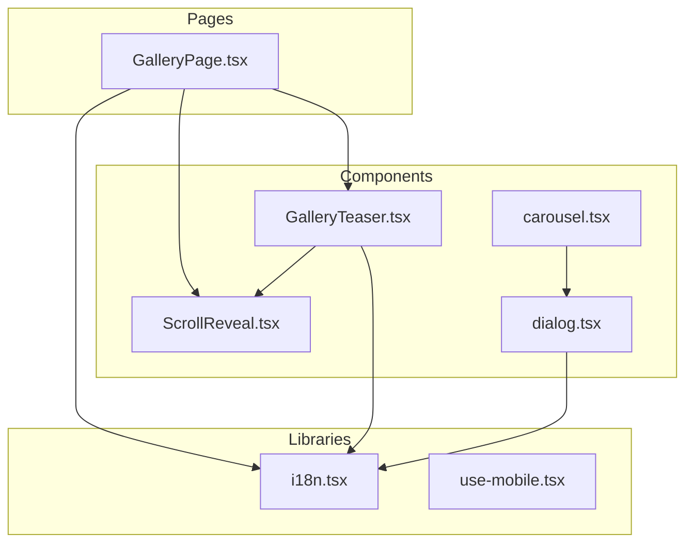
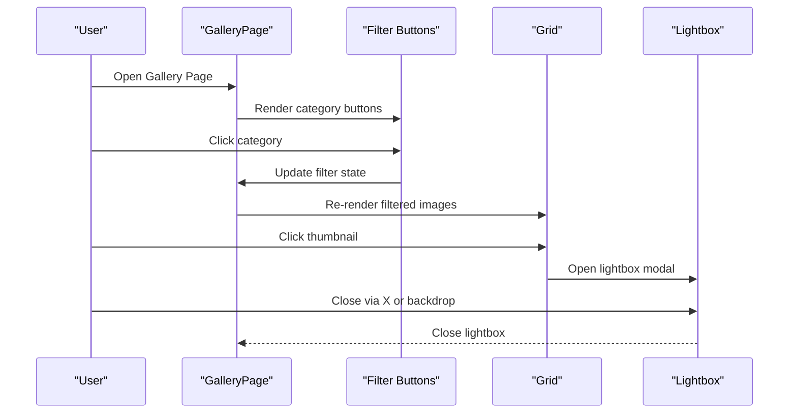
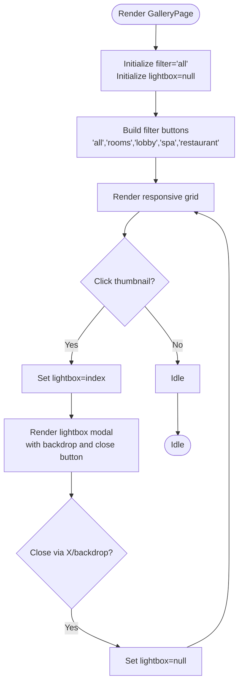
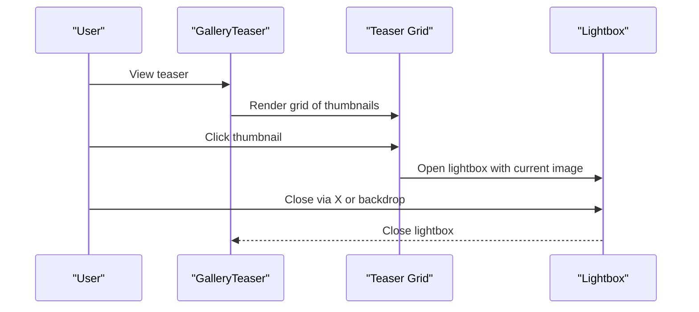
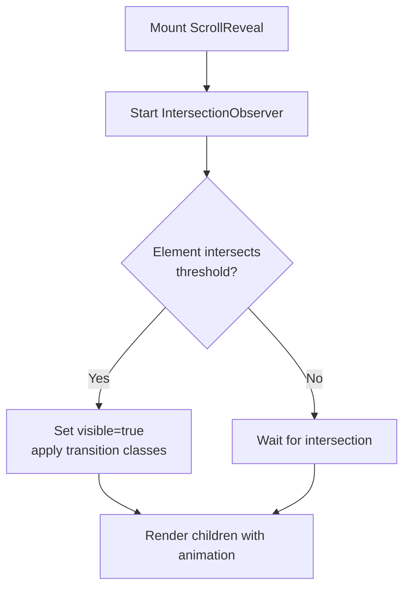
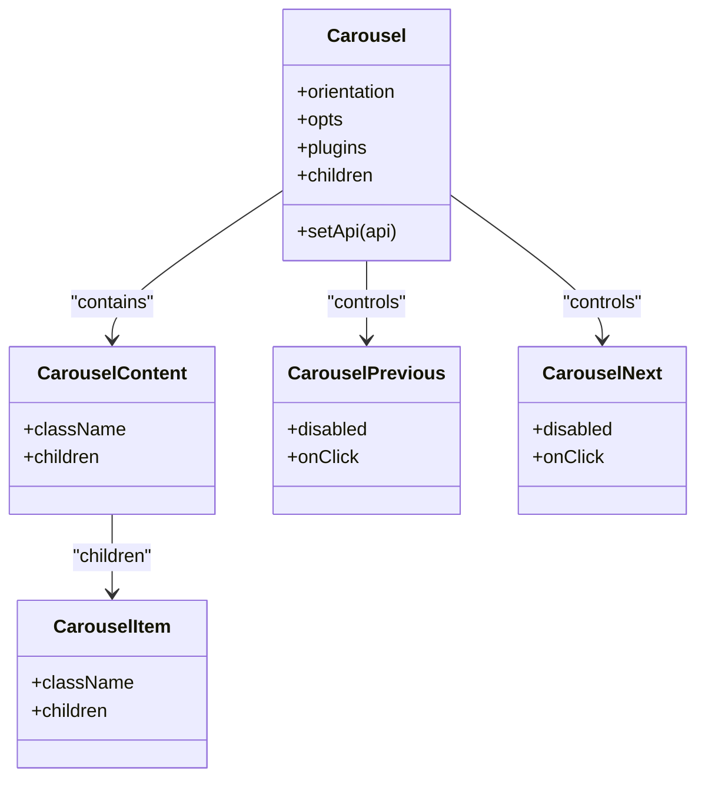
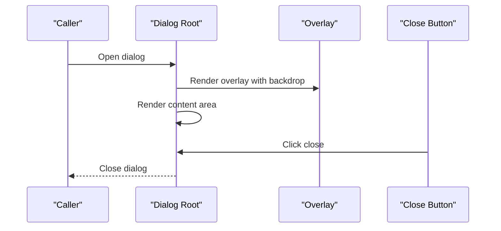
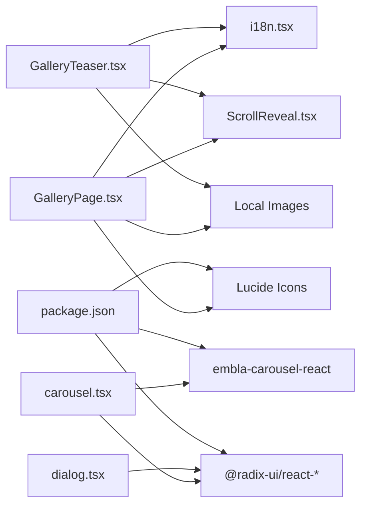

# Gallery System

<cite>
**Referenced Files in This Document**
- [GalleryPage.tsx](file://src/pages/GalleryPage.tsx)
- [GalleryTeaser.tsx](file://src/components/GalleryTeaser.tsx)
- [carousel.tsx](file://src/components/ui/carousel.tsx)
- [dialog.tsx](file://src/components/ui/dialog.tsx)
- [ScrollReveal.tsx](file://src/components/ScrollReveal.tsx)
- [i18n.tsx](file://src/lib/i18n.tsx)
- [use-mobile.tsx](file://src/hooks/use-mobile.tsx)
- [package.json](file://package.json)
</cite>

## Table of Contents
1. [Introduction](#introduction)
2. [Project Structure](#project-structure)
3. [Core Components](#core-components)
4. [Architecture Overview](#architecture-overview)
5. [Detailed Component Analysis](#detailed-component-analysis)
6. [Dependency Analysis](#dependency-analysis)
7. [Performance Considerations](#performance-considerations)
8. [Troubleshooting Guide](#troubleshooting-guide)
9. [Conclusion](#conclusion)

## Introduction
This document describes the gallery system functionality, focusing on:
- Photo filtering by category
- Lightbox implementation with modal dialogs
- Responsive grid layout
- Image optimization strategies and lazy loading techniques
- Carousel component integration
- Gallery data model, category management, and user interaction patterns
- Modal navigation system, image transitions, and accessibility features
- Examples of gallery filtering logic, modal implementations, and performance optimizations for large image collections

## Project Structure
The gallery system spans two primary areas:
- A dedicated gallery page with category filtering and lightbox
- A teaser gallery used on landing pages with similar lightbox behavior
- Shared UI primitives for modals and carousels
- Internationalization support for gallery labels
- Scroll reveal animations for progressive image loading

**Diagram sources**
- [GalleryPage.tsx](file://src/pages/GalleryPage.tsx#L1-L79)
- [GalleryTeaser.tsx](file://src/components/GalleryTeaser.tsx#L1-L56)
- [ScrollReveal.tsx](file://src/components/ScrollReveal.tsx#L1-L37)
- [carousel.tsx](file://src/components/ui/carousel.tsx#L1-L225)
- [dialog.tsx](file://src/components/ui/dialog.tsx#L1-L96)
- [i18n.tsx](file://src/lib/i18n.tsx#L1-L173)
- [use-mobile.tsx](file://src/hooks/use-mobile.tsx#L1-L19)

**Section sources**
- [GalleryPage.tsx](file://src/pages/GalleryPage.tsx#L1-L79)
- [GalleryTeaser.tsx](file://src/components/GalleryTeaser.tsx#L1-L56)
- [ScrollReveal.tsx](file://src/components/ScrollReveal.tsx#L1-L37)
- [carousel.tsx](file://src/components/ui/carousel.tsx#L1-L225)
- [dialog.tsx](file://src/components/ui/dialog.tsx#L1-L96)
- [i18n.tsx](file://src/lib/i18n.tsx#L1-L173)
- [use-mobile.tsx](file://src/hooks/use-mobile.tsx#L1-L19)

## Core Components
- GalleryPage: Implements category filtering, responsive grid, and lightbox modal
- GalleryTeaser: Provides a compact gallery teaser with lightbox
- ScrollReveal: Progressive reveal animation for images
- carousel: Embla-based carousel with keyboard navigation and accessibility
- dialog: Radix UI dialog primitive with overlay and close controls
- i18n: Translation keys for gallery labels and categories
- use-mobile: Mobile breakpoint hook for responsive behavior

**Section sources**
- [GalleryPage.tsx](file://src/pages/GalleryPage.tsx#L1-L79)
- [GalleryTeaser.tsx](file://src/components/GalleryTeaser.tsx#L1-L56)
- [ScrollReveal.tsx](file://src/components/ScrollReveal.tsx#L1-L37)
- [carousel.tsx](file://src/components/ui/carousel.tsx#L1-L225)
- [dialog.tsx](file://src/components/ui/dialog.tsx#L1-L96)
- [i18n.tsx](file://src/lib/i18n.tsx#L70-L78)
- [use-mobile.tsx](file://src/hooks/use-mobile.tsx#L1-L19)

## Architecture Overview
The gallery system composes:
- Data model: An array of image objects with category metadata
- Filtering logic: Filter by category or show all
- Rendering: Responsive grid layout with aspect ratio containers
- Interaction: Clickable thumbnails open a lightbox modal
- Animations: Scroll reveal for progressive image appearance
- Accessibility: Keyboard navigation and screen-reader-friendly labels

**Diagram sources**
- [GalleryPage.tsx](file://src/pages/GalleryPage.tsx#L25-L78)

## Detailed Component Analysis

### GalleryPage: Filtering, Grid, and Lightbox
- Data model: Array of objects with image source and category
- Filtering: One-line filter condition selects matching category or all
- Grid: Responsive 2-column on small screens, 3-column on medium+ screens
- Lightbox: Fixed-position modal with backdrop blur and close button
- Interactions: Hover scaling effect on thumbnails; click opens lightbox

**Diagram sources**
- [GalleryPage.tsx](file://src/pages/GalleryPage.tsx#L14-L30)
- [GalleryPage.tsx](file://src/pages/GalleryPage.tsx#L42-L73)

**Section sources**
- [GalleryPage.tsx](file://src/pages/GalleryPage.tsx#L14-L30)
- [GalleryPage.tsx](file://src/pages/GalleryPage.tsx#L56-L73)
- [i18n.tsx](file://src/lib/i18n.tsx#L70-L78)

### GalleryTeaser: Teaser Gallery with Lightbox
- Data model: Simple array of image sources
- Grid: Same responsive grid as GalleryPage
- Lightbox: Identical modal implementation to GalleryPage
- Interactions: Hover overlay effect and click to open lightbox

**Diagram sources**
- [GalleryTeaser.tsx](file://src/components/GalleryTeaser.tsx#L14-L55)

**Section sources**
- [GalleryTeaser.tsx](file://src/components/GalleryTeaser.tsx#L12-L55)

### ScrollReveal: Progressive Image Appearance
- Uses IntersectionObserver to trigger fade-in and vertical slide
- Accepts optional delay per item for staggered reveals
- Applied around each grid item to improve perceived performance

**Diagram sources**
- [ScrollReveal.tsx](file://src/components/ScrollReveal.tsx#L10-L36)

**Section sources**
- [ScrollReveal.tsx](file://src/components/ScrollReveal.tsx#L10-L36)

### carousel: Embla-Based Carousel
- Horizontal or vertical orientation
- Keyboard navigation (arrow keys)
- Programmatic scrolling and state tracking
- Accessibility attributes for region and slides

**Diagram sources**
- [carousel.tsx](file://src/components/ui/carousel.tsx#L41-L132)
- [carousel.tsx](file://src/components/ui/carousel.tsx#L134-L149)
- [carousel.tsx](file://src/components/ui/carousel.tsx#L151-L166)
- [carousel.tsx](file://src/components/ui/carousel.tsx#L168-L194)
- [carousel.tsx](file://src/components/ui/carousel.tsx#L196-L222)

**Section sources**
- [carousel.tsx](file://src/components/ui/carousel.tsx#L1-L225)

### dialog: Radix UI Modal Overlay
- Portal-based overlay with animated open/close
- Close button with semantic label for assistive technologies
- Content container centered with responsive max-width

**Diagram sources**
- [dialog.tsx](file://src/components/ui/dialog.tsx#L7-L28)
- [dialog.tsx](file://src/components/ui/dialog.tsx#L30-L51)
- [dialog.tsx](file://src/components/ui/dialog.tsx#L45-L48)

**Section sources**
- [dialog.tsx](file://src/components/ui/dialog.tsx#L1-L96)

### i18n: Gallery Translations and Categories
- Keys for gallery title, subtitle, and category labels
- Used to render filter buttons and page headings

**Section sources**
- [i18n.tsx](file://src/lib/i18n.tsx#L70-L78)

### use-mobile: Responsive Breakpoint Hook
- Detects mobile viewport width for responsive behavior
- Useful for adapting gallery interactions on smaller screens

**Section sources**
- [use-mobile.tsx](file://src/hooks/use-mobile.tsx#L1-L19)

## Dependency Analysis
- GalleryPage depends on:
  - i18n for labels
  - ScrollReveal for animations
  - Local asset imports for images
  - Lucide React for close icon
- GalleryTeaser mirrors GalleryPage’s dependencies
- carousel relies on Embla Carousel and Radix UI primitives
- dialog relies on @radix-ui/react-dialog

**Diagram sources**
- [GalleryPage.tsx](file://src/pages/GalleryPage.tsx#L1-L12)
- [GalleryTeaser.tsx](file://src/components/GalleryTeaser.tsx#L1-L10)
- [carousel.tsx](file://src/components/ui/carousel.tsx#L1-L6)
- [dialog.tsx](file://src/components/ui/dialog.tsx#L1-L5)
- [package.json](file://package.json#L15-L64)

**Section sources**
- [package.json](file://package.json#L15-L64)

## Performance Considerations
- Current implementation loads all images synchronously; consider lazy loading for large galleries:
  - Replace static imports with dynamic imports and load on demand
  - Use IntersectionObserver to defer loading until near viewport
  - Implement placeholder skeletons while images load
- Optimize image sizes and formats:
  - Serve appropriately sized images for grid breakpoints
  - Prefer modern formats (WebP) when supported
- Virtualize long lists:
  - For very large galleries, consider virtualized rendering to limit DOM nodes
- Minimize reflows:
  - Keep aspect ratio containers to avoid layout shifts
  - Defer heavy computations during scroll (throttle/debounce)
- Accessibility and UX:
  - Ensure lightbox images have descriptive alt text
  - Provide keyboard navigation and focus management in modals
  - Announce current slide and navigation actions for screen readers

[No sources needed since this section provides general guidance]

## Troubleshooting Guide
- Lightbox does not close:
  - Verify backdrop click handler and close button handler are attached to the modal container
  - Confirm state updates properly reset the lightbox index
- Filter buttons not updating:
  - Ensure filter state is initialized and updated on button clicks
  - Confirm filtered array is recalculated when filter changes
- Images not appearing:
  - Check that local image imports resolve correctly
  - Validate responsive grid classes and aspect ratio containers
- Carousel not scrolling:
  - Confirm Embla API is initialized and events are bound
  - Verify keyboard handlers and button disabled states
- Dialog not closing:
  - Ensure overlay and close button are rendered and interactive
  - Check portal rendering and z-index stacking context

**Section sources**
- [GalleryPage.tsx](file://src/pages/GalleryPage.tsx#L27-L30)
- [GalleryPage.tsx](file://src/pages/GalleryPage.tsx#L68-L73)
- [GalleryTeaser.tsx](file://src/components/GalleryTeaser.tsx#L16-L52)
- [carousel.tsx](file://src/components/ui/carousel.tsx#L62-L81)
- [dialog.tsx](file://src/components/ui/dialog.tsx#L30-L51)

## Conclusion
The gallery system combines straightforward filtering, responsive grids, and modal lightboxes with progressive reveal animations. For production-scale deployments, augment the implementation with lazy loading, optimized image delivery, and virtualization to maintain smooth interactions across large image collections. The existing modular components (carousel, dialog) and hooks (use-mobile) provide a solid foundation for extending functionality while preserving accessibility and responsiveness.