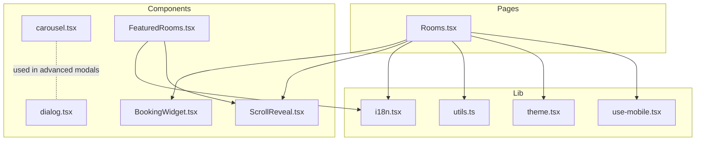
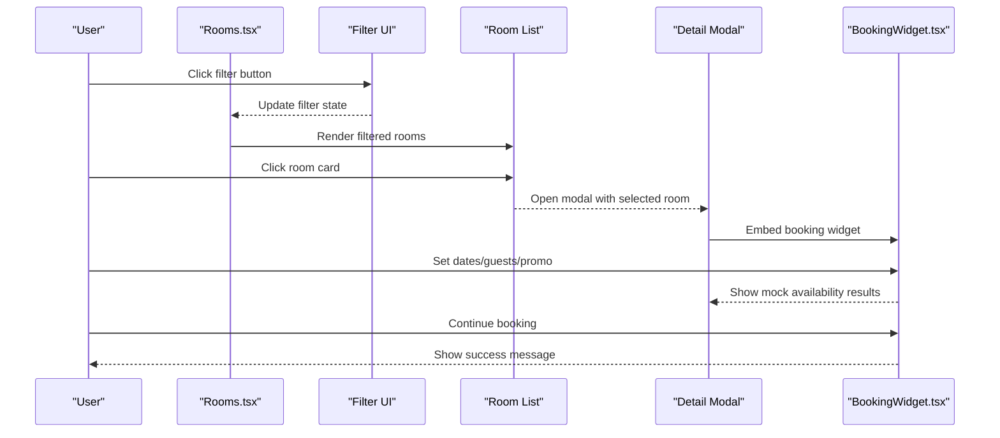
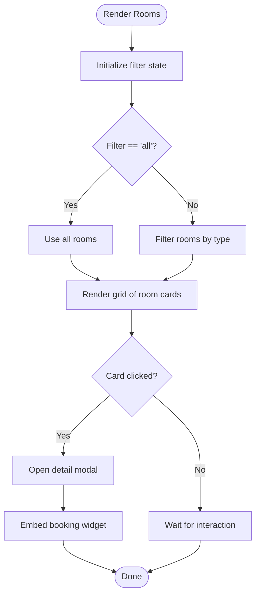
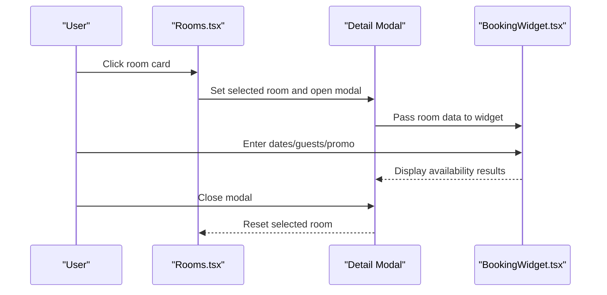
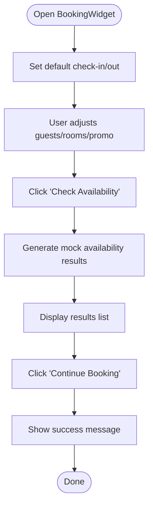
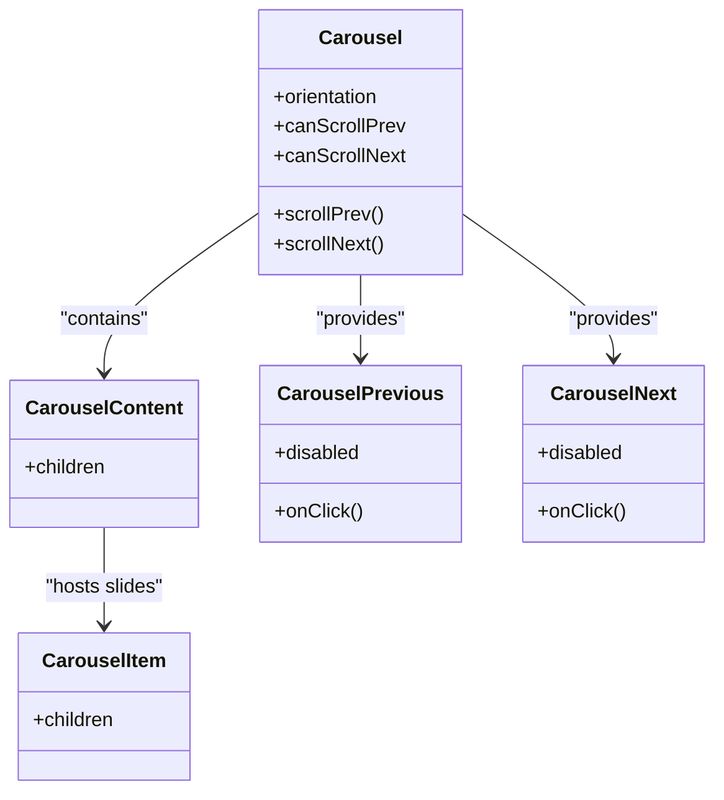
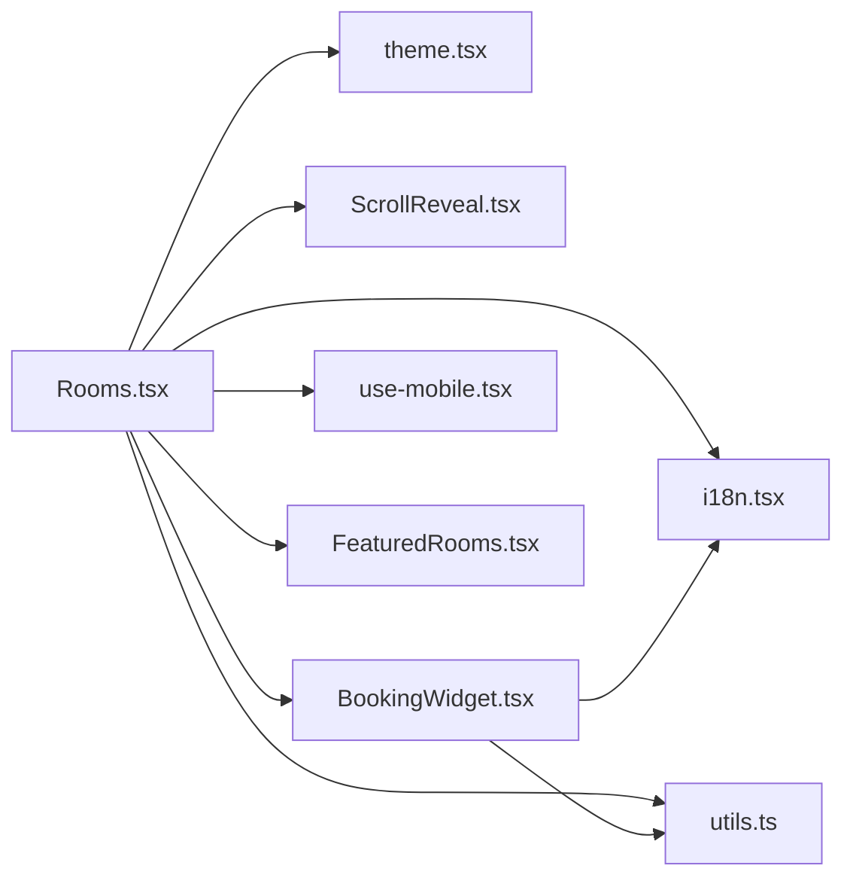

# Room Management

<cite>
**Referenced Files in This Document**
- [Rooms.tsx](file://src/pages/Rooms.tsx)
- [BookingWidget.tsx](file://src/components/BookingWidget.tsx)
- [i18n.tsx](file://src/lib/i18n.tsx)
- [ScrollReveal.tsx](file://src/components/ScrollReveal.tsx)
- [carousel.tsx](file://src/components/ui/carousel.tsx)
- [dialog.tsx](file://src/components/ui/dialog.tsx)
- [utils.ts](file://src/lib/utils.ts)
- [theme.tsx](file://src/lib/theme.tsx)
- [use-mobile.tsx](file://src/hooks/use-mobile.tsx)
- [FeaturedRooms.tsx](file://src/components/FeaturedRooms.tsx)
</cite>

## Table of Contents
1. [Introduction](#introduction)
2. [Project Structure](#project-structure)
3. [Core Components](#core-components)
4. [Architecture Overview](#architecture-overview)
5. [Detailed Component Analysis](#detailed-component-analysis)
6. [Dependency Analysis](#dependency-analysis)
7. [Performance Considerations](#performance-considerations)
8. [Troubleshooting Guide](#troubleshooting-guide)
9. [Conclusion](#conclusion)
10. [Appendices](#appendices)

## Introduction
This document describes the room management system implemented in the frontend. It focuses on:
- Room listing with filtering, pricing display, and availability indicators
- Room detail modal with image presentation, feature descriptions, and booking integration
- Room data model, pricing representation, and inventory management considerations
- Responsive design patterns and accessibility features
- Examples of filtering logic, modal interactions, and image optimization strategies
- Performance considerations for large room inventories and lazy-loading approaches

## Project Structure
The room management feature spans several files:
- Listing page: renders room cards, filters, and the detail modal
- Booking widget: handles check-in/out, guests, rooms, promo code, and mock availability results
- Internationalization: provides localized strings for UI labels and pricing units
- UI primitives: carousel and dialog components for advanced modals
- Utilities: Tailwind class merging and theme management
- Hooks: mobile breakpoint detection

**Diagram sources**
- [Rooms.tsx](file://src/pages/Rooms.tsx#L1-L101)
- [BookingWidget.tsx](file://src/components/BookingWidget.tsx#L1-L153)
- [i18n.tsx](file://src/lib/i18n.tsx#L1-L173)
- [ScrollReveal.tsx](file://src/components/ScrollReveal.tsx#L1-L37)
- [carousel.tsx](file://src/components/ui/carousel.tsx#L1-L225)
- [dialog.tsx](file://src/components/ui/dialog.tsx#L1-L96)
- [utils.ts](file://src/lib/utils.ts#L1-L7)
- [theme.tsx](file://src/lib/theme.tsx#L1-L36)
- [use-mobile.tsx](file://src/hooks/use-mobile.tsx#L1-L19)
- [FeaturedRooms.tsx](file://src/components/FeaturedRooms.tsx#L1-L63)

**Section sources**
- [Rooms.tsx](file://src/pages/Rooms.tsx#L1-L101)
- [i18n.tsx](file://src/lib/i18n.tsx#L1-L173)

## Core Components
- Room listing page with:
  - Filtering by room type
  - Grid layout with animated reveal
  - Pricing display and guest capacity indicators
  - Detail modal with booking widget integration
- Booking widget with:
  - Check-in/out date selection
  - Guest and room selectors
  - Promo code field
  - Mock availability results and continue action
- Internationalization provider for labels and units
- UI utilities for responsive behavior and theme switching

**Section sources**
- [Rooms.tsx](file://src/pages/Rooms.tsx#L21-L101)
- [BookingWidget.tsx](file://src/components/BookingWidget.tsx#L15-L153)
- [i18n.tsx](file://src/lib/i18n.tsx#L5-L173)

## Architecture Overview
The room management feature is composed of:
- Page-level state for filtering and selected room
- Local room dataset with type, images, area, guests, and price
- Modal rendering that displays selected room details and embeds the booking widget
- Internationalized labels and units for pricing and UI text
- Utility hooks and libraries for responsive behavior and theme

**Diagram sources**
- [Rooms.tsx](file://src/pages/Rooms.tsx#L21-L101)
- [BookingWidget.tsx](file://src/components/BookingWidget.tsx#L15-L153)

## Detailed Component Analysis

### Room Listing and Filtering
- Data model:
  - Array of room objects with keys: type, image, area (sqm), guests, price
  - Example entries include deluxe and suite variants with varying sizes and prices
- Filtering:
  - Single-select filter toggles between all, deluxe, and suite
  - Filter expression selects rooms matching the chosen type
- Rendering:
  - Grid layout adapts to breakpoints (md, lg)
  - Cards show image, title, description, area, guests, and price
  - Hover scaling effect on images
  - Animated reveal on scroll
- Accessibility:
  - Images render without alt text; consider adding descriptive alt attributes for screen readers
  - Buttons use semantic roles and keyboard navigation support via UI primitives

**Diagram sources**
- [Rooms.tsx](file://src/pages/Rooms.tsx#L21-L101)
- [ScrollReveal.tsx](file://src/components/ScrollReveal.tsx#L10-L36)

**Section sources**
- [Rooms.tsx](file://src/pages/Rooms.tsx#L12-L26)
- [Rooms.tsx](file://src/pages/Rooms.tsx#L55-L74)
- [Rooms.tsx](file://src/pages/Rooms.tsx#L40-L53)
- [ScrollReveal.tsx](file://src/components/ScrollReveal.tsx#L10-L36)

### Room Detail Modal Implementation
- Modal lifecycle:
  - Opens when a room card is clicked
  - Closes on overlay click or close button
  - Prevents event propagation to avoid accidental closure
- Content:
  - Large image with aspect ratio
  - Description and feature badges (area, guests)
  - Price display with per-night unit
  - Embedded booking widget for availability checks
- Accessibility:
  - Overlay and close button provide clear dismissal
  - Consider adding focus trapping and ARIA roles for improved accessibility

**Diagram sources**
- [Rooms.tsx](file://src/pages/Rooms.tsx#L78-L96)
- [BookingWidget.tsx](file://src/components/BookingWidget.tsx#L15-L153)

**Section sources**
- [Rooms.tsx](file://src/pages/Rooms.tsx#L78-L96)
- [Rooms.tsx](file://src/pages/Rooms.tsx#L82-L93)

### Booking Widget and Availability Integration
- Inputs:
  - Check-in/out dates initialized to current and future dates
  - Adults, children, rooms selectors
  - Promo code input
- Behavior:
  - Search triggers mock availability results
  - Results list shows room names and prices
  - Continue action triggers a success notification
- Localization:
  - All labels and units are translated via the i18n provider

**Diagram sources**
- [BookingWidget.tsx](file://src/components/BookingWidget.tsx#L15-L153)
- [i18n.tsx](file://src/lib/i18n.tsx#L21-L33)

**Section sources**
- [BookingWidget.tsx](file://src/components/BookingWidget.tsx#L15-L153)
- [i18n.tsx](file://src/lib/i18n.tsx#L21-L33)

### Image Carousel and Advanced Modals
- Carousel component:
  - Horizontal/vertical orientation support
  - Navigation buttons with keyboard accessibility
  - API callbacks for scroll state and events
- Dialog component:
  - Portal-based overlay with smooth animations
  - Close button with assistive text
- Usage:
  - Carousel can be used inside advanced modals for multi-image galleries
  - Dialog provides a standardized modal surface

**Diagram sources**
- [carousel.tsx](file://src/components/ui/carousel.tsx#L41-L224)

**Section sources**
- [carousel.tsx](file://src/components/ui/carousel.tsx#L1-L225)
- [dialog.tsx](file://src/components/ui/dialog.tsx#L1-L96)

### Responsive Design Patterns and Accessibility Features
- Responsive grid:
  - Uses Tailwind classes to adjust columns at md and lg breakpoints
- Mobile detection:
  - Hook detects viewport width below a threshold for conditional behavior
- Accessibility:
  - Keyboard navigation supported in carousel
  - Dialog overlay and close button include assistive labels
  - Consider adding ARIA attributes to images and modal container for screen readers

**Section sources**
- [Rooms.tsx](file://src/pages/Rooms.tsx#L55-L74)
- [use-mobile.tsx](file://src/hooks/use-mobile.tsx#L3-L18)
- [carousel.tsx](file://src/components/ui/carousel.tsx#L70-L81)
- [dialog.tsx](file://src/components/ui/dialog.tsx#L45-L48)

### Room Data Model, Pricing Algorithms, and Inventory Management
- Data model:
  - Room object fields: type, image, area, guests, price
  - Filtering compares against type
- Pricing:
  - Price is stored as a numeric value
  - Display uses localized currency/unit labels
- Inventory:
  - Current implementation uses static room list
  - Availability checks are simulated in the booking widget
  - Recommendations:
    - Introduce inventory counts per room type
    - Add real-time availability queries and date-based pricing rules
    - Implement rate rules (weekends vs. weekdays) and dynamic pricing

**Section sources**
- [Rooms.tsx](file://src/pages/Rooms.tsx#L12-L19)
- [Rooms.tsx](file://src/pages/Rooms.tsx#L26)
- [BookingWidget.tsx](file://src/components/BookingWidget.tsx#L15-L153)
- [i18n.tsx](file://src/lib/i18n.tsx#L21-L33)

### Examples and Best Practices
- Filtering logic:
  - Single-select filter toggling between all, deluxe, suite
  - Conditional rendering based on filter state
- Modal interactions:
  - Event propagation prevention to keep modal open while interacting
  - Embedded booking widget for seamless conversion
- Image optimization:
  - Use appropriately sized assets and lazy loading for thumbnails
  - Consider WebP format and srcset for responsiveness
  - For advanced galleries, integrate the carousel component

**Section sources**
- [Rooms.tsx](file://src/pages/Rooms.tsx#L23-L26)
- [Rooms.tsx](file://src/pages/Rooms.tsx#L78-L96)
- [carousel.tsx](file://src/components/ui/carousel.tsx#L1-L225)

## Dependency Analysis
The room management feature depends on:
- Internationalization for labels and units
- UI utilities for class composition and theme management
- Scroll reveal animation for perceived performance
- Booking widget for availability simulation
- Optional carousel and dialog for advanced gallery/modals

**Diagram sources**
- [Rooms.tsx](file://src/pages/Rooms.tsx#L1-L101)
- [i18n.tsx](file://src/lib/i18n.tsx#L1-L173)
- [utils.ts](file://src/lib/utils.ts#L1-L7)
- [theme.tsx](file://src/lib/theme.tsx#L1-L36)
- [ScrollReveal.tsx](file://src/components/ScrollReveal.tsx#L1-L37)
- [BookingWidget.tsx](file://src/components/BookingWidget.tsx#L1-L153)
- [use-mobile.tsx](file://src/hooks/use-mobile.tsx#L1-L19)
- [FeaturedRooms.tsx](file://src/components/FeaturedRooms.tsx#L1-L63)

**Section sources**
- [Rooms.tsx](file://src/pages/Rooms.tsx#L1-L101)
- [BookingWidget.tsx](file://src/components/BookingWidget.tsx#L1-L153)
- [i18n.tsx](file://src/lib/i18n.tsx#L1-L173)

## Performance Considerations
- Large room inventories:
  - Virtualize the room list to limit DOM nodes
  - Paginate or lazy-load additional rooms on scroll
- Image optimization:
  - Preload hero images; defer non-critical thumbnails
  - Use modern formats (WebP) and appropriate sizes
- Rendering:
  - Keep filter computations memoized
  - Debounce filter updates if extended to include price or guest range
- Animations:
  - Use IntersectionObserver efficiently (already implemented)
  - Avoid layout thrashing during modal open/close

[No sources needed since this section provides general guidance]

## Troubleshooting Guide
- Modal does not close:
  - Ensure overlay click handler and close button are wired correctly
  - Verify event propagation is stopped when clicking modal content
- Booking widget shows no results:
  - Confirm mock results are generated after search
  - Check that dates are valid and in the correct order
- Images not displaying:
  - Verify asset imports and paths
  - Ensure alt attributes are present for accessibility
- Responsive layout issues:
  - Confirm Tailwind breakpoints align with design
  - Use the mobile hook to adapt behavior on small screens

**Section sources**
- [Rooms.tsx](file://src/pages/Rooms.tsx#L78-L96)
- [BookingWidget.tsx](file://src/components/BookingWidget.tsx#L137-L150)

## Conclusion
The room management system provides a clean, localized, and accessible interface for browsing rooms, applying filters, and initiating bookings. The current implementation uses static data and simulated availability, suitable for demonstration. To scale to production, introduce dynamic inventory, real-time availability, and robust image optimization. Enhance accessibility by adding ARIA attributes and focus management. The modular structure supports incremental improvements, including advanced modals with carousels and dialogs.

[No sources needed since this section summarizes without analyzing specific files]

## Appendices

### Room Data Model Reference
- Fields:
  - type: string (e.g., deluxe, suite)
  - img: imported image asset
  - sqm: number (area)
  - guests: number (maximum occupancy)
  - price: number (nightly rate)

**Section sources**
- [Rooms.tsx](file://src/pages/Rooms.tsx#L12-L19)

### Pricing Display and Units
- Display pattern:
  - Prefix localized "from" label
  - Numeric price with currency unit
  - Per-night suffix localized via i18n

**Section sources**
- [Rooms.tsx](file://src/pages/Rooms.tsx#L69)
- [Rooms.tsx](file://src/pages/Rooms.tsx#L91)
- [i18n.tsx](file://src/lib/i18n.tsx#L46-L32)

### Filtering Logic Reference
- Options: all, deluxe, suite
- Behavior: filter equals all → show all; otherwise filter by type

**Section sources**
- [Rooms.tsx](file://src/pages/Rooms.tsx#L23-L26)
- [Rooms.tsx](file://src/pages/Rooms.tsx#L42-L52)