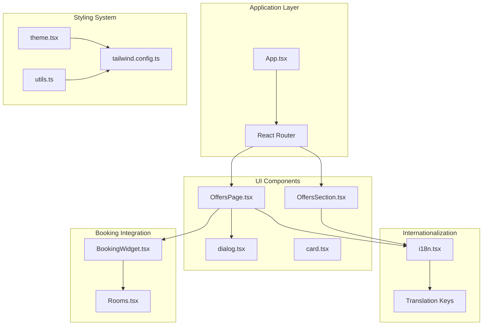
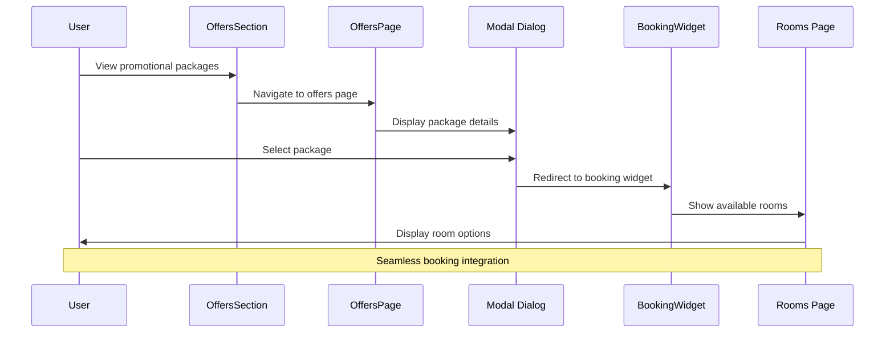
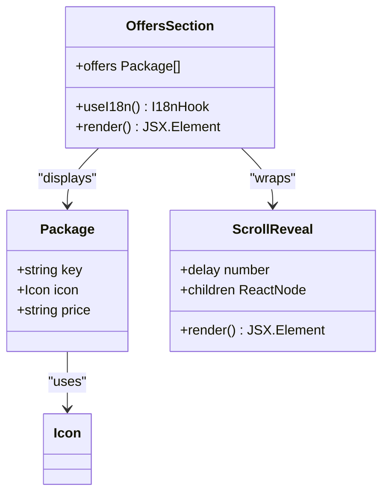
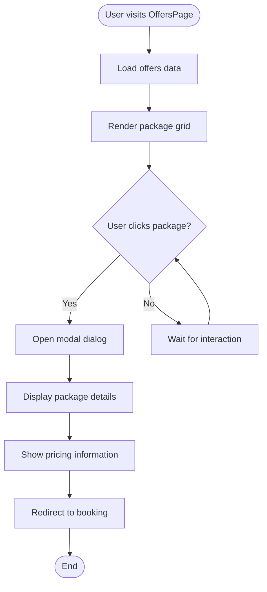
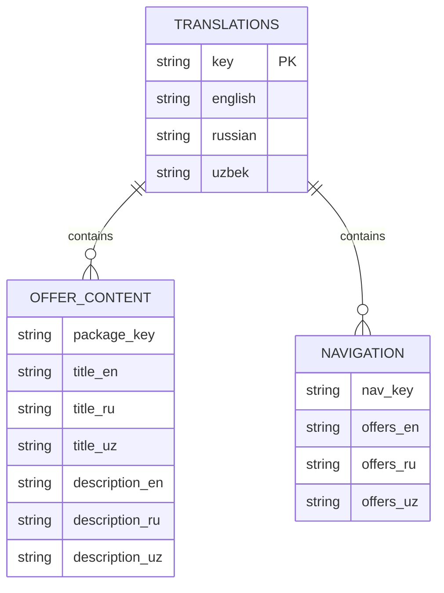
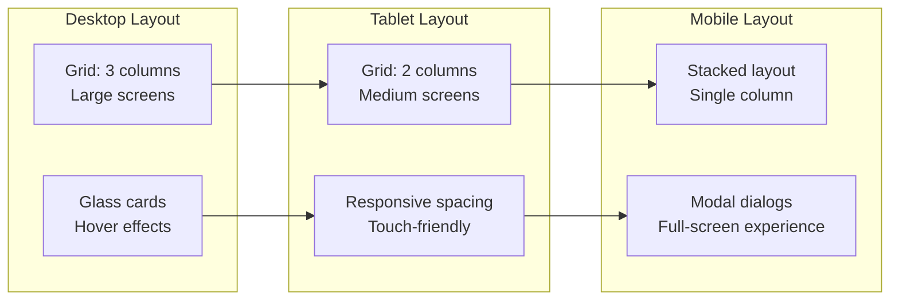
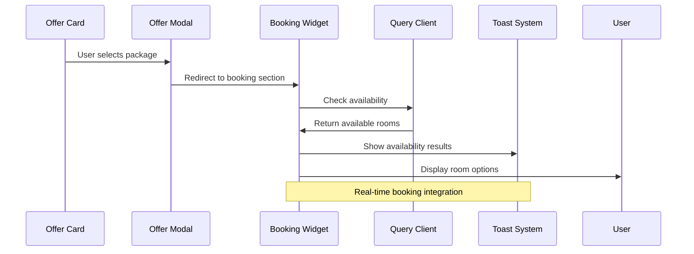
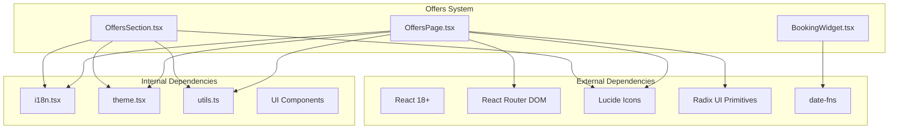

# Special Offers

<cite>
**Referenced Files in This Document**
- [OffersSection.tsx](file://src/components/OffersSection.tsx)
- [OffersPage.tsx](file://src/pages/OffersPage.tsx)
- [i18n.tsx](file://src/lib/i18n.tsx)
- [BookingWidget.tsx](file://src/components/BookingWidget.tsx)
- [Rooms.tsx](file://src/pages/Rooms.tsx)
- [dialog.tsx](file://src/components/ui/dialog.tsx)
- [card.tsx](file://src/components/ui/card.tsx)
- [theme.tsx](file://src/lib/theme.tsx)
- [utils.ts](file://src/lib/utils.ts)
- [use-mobile.tsx](file://src/hooks/use-mobile.tsx)
- [App.tsx](file://src/App.tsx)
- [main.tsx](file://src/main.tsx)
- [tailwind.config.ts](file://tailwind.config.ts)
</cite>

## Table of Contents
1. [Introduction](#introduction)
2. [Project Structure](#project-structure)
3. [Core Components](#core-components)
4. [Architecture Overview](#architecture-overview)
5. [Detailed Component Analysis](#detailed-component-analysis)
6. [Dependency Analysis](#dependency-analysis)
7. [Performance Considerations](#performance-considerations)
8. [Troubleshooting Guide](#troubleshooting-guide)
9. [Conclusion](#conclusion)

## Introduction
This document provides comprehensive documentation for the special offers system within the Stylo Residence & Suites hotel booking platform. The system enables guests to browse curated promotional packages, view detailed information, and seamlessly transition to the booking process. It features multilingual support, responsive design patterns, and integration with the broader booking ecosystem.

The offers system consists of two primary interfaces:
- A promotional showcase on the homepage featuring three distinct packages
- A dedicated offers page with interactive modals for detailed package information and immediate booking redirection

## Project Structure
The offers system is implemented using React components with a modular architecture that emphasizes reusability and maintainability. The system leverages a comprehensive internationalization framework and follows modern React patterns with TypeScript.

**Diagram sources**
- [App.tsx](file://src/App.tsx#L1-L45)
- [OffersSection.tsx](file://src/components/OffersSection.tsx#L1-L49)
- [OffersPage.tsx](file://src/pages/OffersPage.tsx#L1-L62)
- [i18n.tsx](file://src/lib/i18n.tsx#L1-L173)

**Section sources**
- [App.tsx](file://src/App.tsx#L1-L45)
- [main.tsx](file://src/main.tsx#L1-L6)

## Core Components
The offers system comprises several interconnected components that work together to deliver a cohesive user experience:

### OffersSection Component
The homepage offers showcase presents three promotional packages in a responsive grid layout. Each package card displays:
- Icon-based visual identifier
- Package title and description
- Pricing information with "from" prefix
- Navigation link to the full offers page

### OffersPage Component
The dedicated offers page provides comprehensive package details with interactive modals:
- Grid layout of available packages
- Click-to-expand modal with detailed information
- Pricing display with currency formatting
- Direct booking redirection to the booking widget

### Internationalization System
The system supports three languages (English, Russian, Uzbek) with comprehensive translation keys for all offer-related content, ensuring global accessibility.

**Section sources**
- [OffersSection.tsx](file://src/components/OffersSection.tsx#L6-L48)
- [OffersPage.tsx](file://src/pages/OffersPage.tsx#L14-L61)
- [i18n.tsx](file://src/lib/i18n.tsx#L79-L88)

## Architecture Overview
The offers system follows a component-based architecture with clear separation of concerns and robust integration patterns.

**Diagram sources**
- [OffersSection.tsx](file://src/components/OffersSection.tsx#L37-L39)
- [OffersPage.tsx](file://src/pages/OffersPage.tsx#L44-L56)
- [BookingWidget.tsx](file://src/components/BookingWidget.tsx#L15-L153)

The architecture ensures smooth transitions between promotional content and booking functionality while maintaining consistent styling and user experience.

## Detailed Component Analysis

### OffersSection Component Analysis
The homepage offers showcase demonstrates key design patterns and functionality:

**Diagram sources**
- [OffersSection.tsx](file://src/components/OffersSection.tsx#L6-L48)

Key features include:
- Responsive grid layout using Tailwind CSS (`md:grid-cols-3`)
- Hover animations with transform effects
- Consistent styling using glass morphism design
- Internationalized content rendering

**Section sources**
- [OffersSection.tsx](file://src/components/OffersSection.tsx#L9-L44)

### OffersPage Component Analysis
The dedicated offers page implements advanced interactive patterns:

**Diagram sources**
- [OffersPage.tsx](file://src/pages/OffersPage.tsx#L14-L61)

The modal implementation utilizes Radix UI dialog primitives for accessibility and proper focus management.

**Section sources**
- [OffersPage.tsx](file://src/pages/OffersPage.tsx#L44-L56)
- [dialog.tsx](file://src/components/ui/dialog.tsx#L30-L51)

### Internationalization and Content Management
The system employs a centralized translation management approach:

**Diagram sources**
- [i18n.tsx](file://src/lib/i18n.tsx#L79-L88)

**Section sources**
- [i18n.tsx](file://src/lib/i18n.tsx#L79-L88)

### Responsive Design Patterns
The offers system implements comprehensive responsive design using Tailwind CSS breakpoints:

**Diagram sources**
- [OffersSection.tsx](file://src/components/OffersSection.tsx#L26-L44)
- [OffersPage.tsx](file://src/pages/OffersPage.tsx#L29-L40)

**Section sources**
- [OffersSection.tsx](file://src/components/OffersSection.tsx#L26-L44)
- [OffersPage.tsx](file://src/pages/OffersPage.tsx#L29-L40)

### Booking Integration System
The offers system integrates seamlessly with the booking infrastructure:

**Diagram sources**
- [OffersPage.tsx](file://src/pages/OffersPage.tsx#L53-L54)
- [BookingWidget.tsx](file://src/components/BookingWidget.tsx#L25-L39)

**Section sources**
- [OffersPage.tsx](file://src/pages/OffersPage.tsx#L53-L54)
- [BookingWidget.tsx](file://src/components/BookingWidget.tsx#L25-L39)

## Dependency Analysis
The offers system maintains clean dependency relationships with minimal coupling between components.

**Diagram sources**
- [OffersSection.tsx](file://src/components/OffersSection.tsx#L1-L4)
- [OffersPage.tsx](file://src/pages/OffersPage.tsx#L1-L6)
- [BookingWidget.tsx](file://src/components/BookingWidget.tsx#L1-L8)

**Section sources**
- [OffersSection.tsx](file://src/components/OffersSection.tsx#L1-L4)
- [OffersPage.tsx](file://src/pages/OffersPage.tsx#L1-L6)
- [BookingWidget.tsx](file://src/components/BookingWidget.tsx#L1-L8)

## Performance Considerations
The offers system implements several performance optimization strategies:

### Lazy Loading and Code Splitting
- Separate route-based loading for the offers page
- Conditional modal rendering only when needed
- Optimized icon imports using Lucide React

### State Management Efficiency
- Minimal state updates with React's built-in memoization
- Efficient event handling with proper cleanup
- Optimized re-render cycles through selective state updates

### Styling Performance
- Utility-first CSS with Tailwind for efficient bundle sizes
- Glass morphism effects optimized for modern browsers
- Responsive design avoiding unnecessary media queries

## Troubleshooting Guide

### Common Issues and Solutions

**Issue: Modal not closing properly**
- Verify click-outside-to-close functionality is enabled
- Check event propagation blocking implementation
- Ensure proper cleanup of event listeners

**Issue: Translation keys not displaying**
- Confirm translation keys exist in i18n.tsx
- Verify language persistence in localStorage
- Check for typos in translation key references

**Issue: Booking integration not working**
- Verify redirect URL format `/#booking`
- Check booking widget accessibility
- Ensure query client is properly configured

**Issue: Responsive layout problems**
- Verify Tailwind breakpoint configuration
- Check container width settings
- Ensure proper viewport meta tag configuration

**Section sources**
- [OffersPage.tsx](file://src/pages/OffersPage.tsx#L44-L56)
- [i18n.tsx](file://src/lib/i18n.tsx#L148-L167)
- [BookingWidget.tsx](file://src/components/BookingWidget.tsx#L25-L39)

## Conclusion
The special offers system represents a well-architected solution that effectively combines promotional content delivery with seamless booking integration. The system demonstrates strong design principles through its component-based architecture, comprehensive internationalization support, and responsive design patterns.

Key strengths include:
- Clean separation of promotional content and booking functionality
- Comprehensive multilingual support with consistent content management
- Modern UI patterns with glass morphism design and smooth animations
- Robust integration with the broader booking ecosystem
- Scalable architecture supporting future expansion

The system provides an excellent foundation for hotel marketing campaigns while maintaining technical excellence and user experience standards. Future enhancements could include dynamic offer management, advanced filtering capabilities, and enhanced analytics tracking.