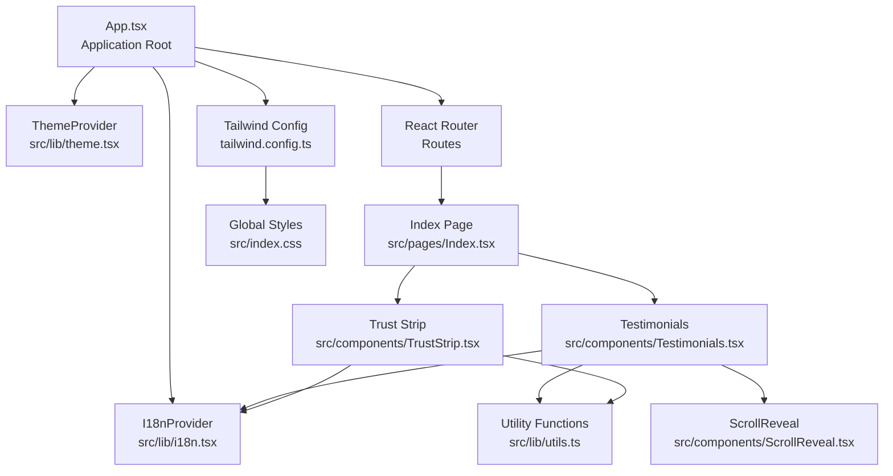
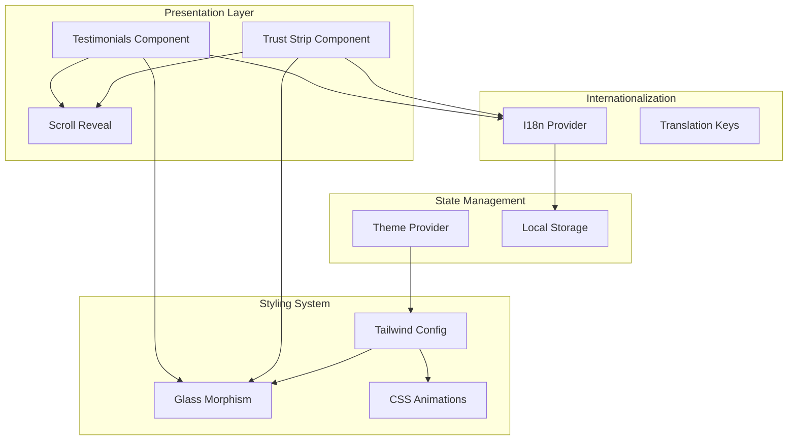
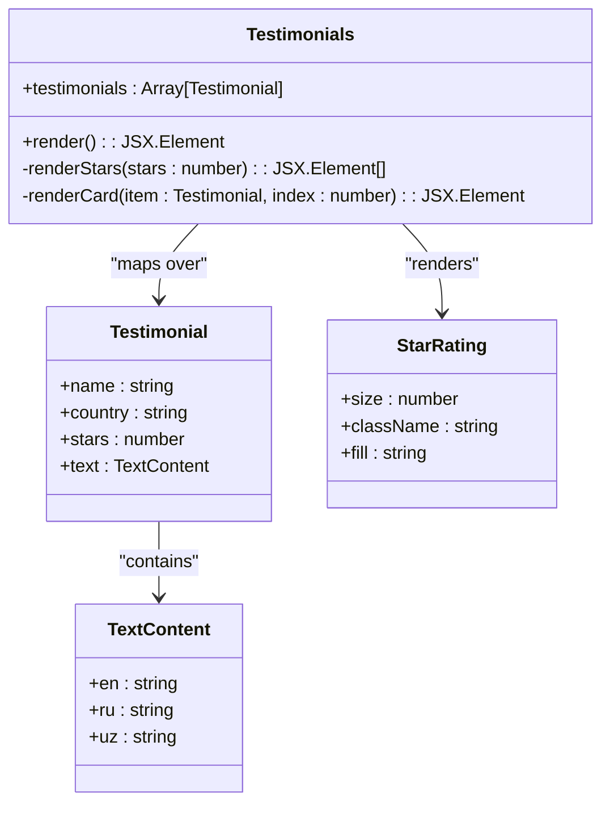
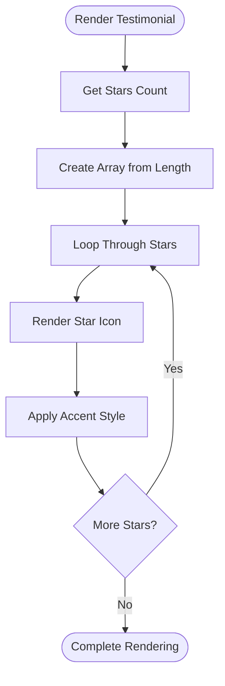
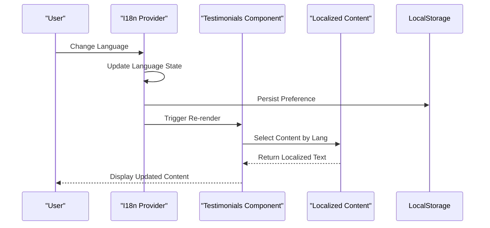
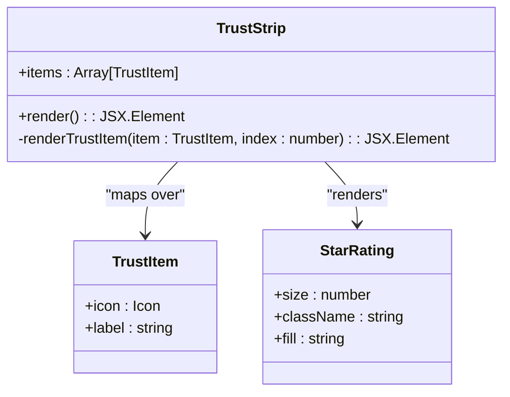
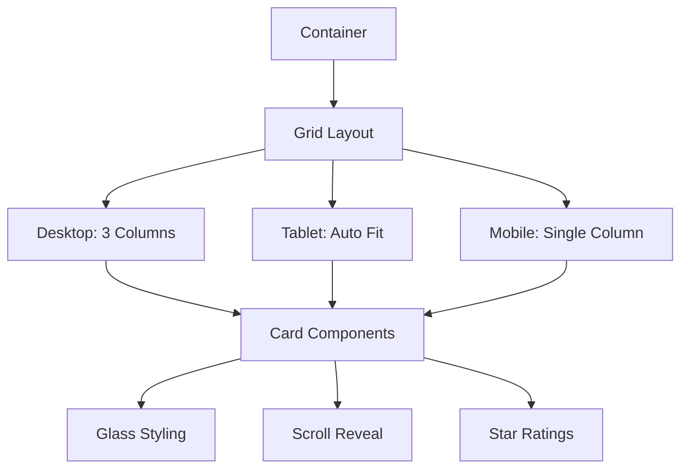
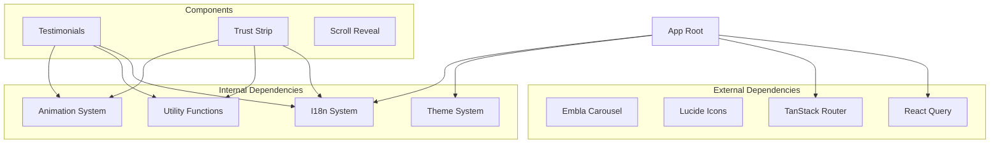

# Testimonials and Reviews

<cite>
**Referenced Files in This Document**
- [Testimonials.tsx](file://src/components/Testimonials.tsx)
- [i18n.tsx](file://src/lib/i18n.tsx)
- [carousel.tsx](file://src/components/ui/carousel.tsx)
- [card.tsx](file://src/components/ui/card.tsx)
- [ScrollReveal.tsx](file://src/components/ScrollReveal.tsx)
- [TrustStrip.tsx](file://src/components/TrustStrip.tsx)
- [Index.tsx](file://src/pages/Index.tsx)
- [App.tsx](file://src/App.tsx)
- [utils.ts](file://src/lib/utils.ts)
- [index.css](file://src/index.css)
- [theme.tsx](file://src/lib/theme.tsx)
- [tailwind.config.ts](file://src/tailwind.config.ts)
</cite>

## Table of Contents
1. [Introduction](#introduction)
2. [Project Structure](#project-structure)
3. [Core Components](#core-components)
4. [Architecture Overview](#architecture-overview)
5. [Detailed Component Analysis](#detailed-component-analysis)
6. [Dependency Analysis](#dependency-analysis)
7. [Performance Considerations](#performance-considerations)
8. [Troubleshooting Guide](#troubleshooting-guide)
9. [Conclusion](#conclusion)

## Introduction
This document provides comprehensive documentation for the testimonials and reviews system. It covers the review collection mechanism, star rating visualization, multi-language support for guest feedback, the carousel component implementation for rotating testimonials, card-based display patterns, and responsive design considerations. It also explains the review data model, rating algorithms, and content moderation integration, along with user experience patterns for displaying authentic guest experiences and building trust. Examples of review filtering, rating displays, and carousel interactions are included.

## Project Structure
The testimonials and reviews system is composed of several key components:
- Testimonials display component that renders guest feedback cards with star ratings and localized content
- Internationalization (i18n) provider that manages language switching and translation keys
- Scroll reveal animation component for smooth entrance effects
- Trust strip component that showcases aggregated ratings and hotel attributes
- Tailwind CSS utilities for glass morphism and responsive design
- Theme provider for light/dark mode support

**Diagram sources**
- [App.tsx](file://src/App.tsx#L19-L42)
- [Index.tsx](file://src/pages/Index.tsx#L12-L25)
- [Testimonials.tsx](file://src/components/Testimonials.tsx#L1-L51)
- [TrustStrip.tsx](file://src/components/TrustStrip.tsx#L1-L36)
- [i18n.tsx](file://src/lib/i18n.tsx#L148-L172)
- [theme.tsx](file://src/lib/theme.tsx#L12-L30)
- [utils.ts](file://src/lib/utils.ts#L4-L6)
- [tailwind.config.ts](file://src/tailwind.config.ts#L1-L86)
- [index.css](file://src/index.css#L92-L145)

**Section sources**
- [App.tsx](file://src/App.tsx#L19-L42)
- [Index.tsx](file://src/pages/Index.tsx#L12-L25)

## Core Components
This section documents the primary components that make up the testimonials and reviews system.

### Testimonials Component
The Testimonials component renders a grid of guest feedback cards with star ratings and localized content. It uses the internationalization hook to display content in the current language and applies scroll reveal animations for enhanced UX.

Key features:
- Grid layout with responsive columns (md: 3 columns)
- Star rating visualization using Lucide icons
- Localized content selection based on current language
- Glass morphism styling for cards
- Scroll reveal animations with staggered delays

**Section sources**
- [Testimonials.tsx](file://src/components/Testimonials.tsx#L11-L51)

### Trust Strip Component
The Trust Strip component displays hotel attributes and aggregated ratings in a horizontal layout. It includes icons representing services and amenities, plus a prominent star rating display.

Key features:
- Horizontal layout with wrap support
- Icon and label pairs for services
- Prominent star rating display (4.9/5)
- Responsive spacing and alignment
- Scroll reveal animation

**Section sources**
- [TrustStrip.tsx](file://src/components/TrustStrip.tsx#L5-L36)

### Internationalization (i18n) System
The i18n provider manages language switching and translation keys. It supports three languages (English, Russian, Uzbek) and persists user preferences in local storage.

Key features:
- Language state management with localStorage persistence
- Translation key-value structure for all UI text
- Dynamic language switching
- Context-based provider pattern

**Section sources**
- [i18n.tsx](file://src/lib/i18n.tsx#L148-L172)
- [i18n.tsx](file://src/lib/i18n.tsx#L5-L134)

### Scroll Reveal Animation
The ScrollReveal component provides smooth entrance animations when elements come into viewport. It uses IntersectionObserver for performance and applies CSS transitions.

Key features:
- IntersectionObserver for efficient viewport detection
- CSS transitions with configurable delay
- Staggered animation timing
- Reusable animation wrapper

**Section sources**
- [ScrollReveal.tsx](file://src/components/ScrollReveal.tsx#L10-L36)

### Utility Functions
The utility functions provide shared functionality across components, primarily the cn function for merging Tailwind CSS classes.

Key features:
- clsx and tailwind-merge integration
- Class composition utility
- Consistent styling approach

**Section sources**
- [utils.ts](file://src/lib/utils.ts#L4-L6)

## Architecture Overview
The testimonials and reviews system follows a modular architecture with clear separation of concerns:

**Diagram sources**
- [Testimonials.tsx](file://src/components/Testimonials.tsx#L1-L51)
- [TrustStrip.tsx](file://src/components/TrustStrip.tsx#L1-L36)
- [i18n.tsx](file://src/lib/i18n.tsx#L148-L172)
- [theme.tsx](file://src/lib/theme.tsx#L12-L30)
- [tailwind.config.ts](file://src/tailwind.config.ts#L1-L86)
- [index.css](file://src/index.css#L92-L145)

## Detailed Component Analysis

### Testimonials Component Implementation
The Testimonials component implements a card-based display pattern for guest feedback:

**Diagram sources**
- [Testimonials.tsx](file://src/components/Testimonials.tsx#L5-L9)
- [Testimonials.tsx](file://src/components/Testimonials.tsx#L29-L32)

#### Star Rating Visualization
The star rating system uses Lucide React icons to render visual star ratings:

**Diagram sources**
- [Testimonials.tsx](file://src/components/Testimonials.tsx#L30-L32)

#### Multi-Language Support Implementation
The system supports three languages with dynamic content switching:

**Diagram sources**
- [i18n.tsx](file://src/lib/i18n.tsx#L149-L157)
- [Testimonials.tsx](file://src/components/Testimonials.tsx#L12)

### Trust Strip Component Analysis
The Trust Strip component provides a comprehensive view of hotel attributes and ratings:

**Diagram sources**
- [TrustStrip.tsx](file://src/components/TrustStrip.tsx#L8-L13)
- [TrustStrip.tsx](file://src/components/TrustStrip.tsx#L27-L29)

### Responsive Design Patterns
The system implements responsive design through Tailwind CSS utilities and grid layouts:

**Diagram sources**
- [Testimonials.tsx](file://src/components/Testimonials.tsx#L25-L47)
- [index.css](file://src/index.css#L92-L116)

## Dependency Analysis
The testimonials and reviews system has well-defined dependencies and relationships:

**Diagram sources**
- [App.tsx](file://src/App.tsx#L1-L45)
- [Testimonials.tsx](file://src/components/Testimonials.tsx#L1-L3)
- [TrustStrip.tsx](file://src/components/TrustStrip.tsx#L1-L3)

**Section sources**
- [App.tsx](file://src/App.tsx#L1-L45)
- [Testimonials.tsx](file://src/components/Testimonials.tsx#L1-L3)
- [TrustStrip.tsx](file://src/components/TrustStrip.tsx#L1-L3)

## Performance Considerations
The system implements several performance optimizations:

- **IntersectionObserver for animations**: Uses native browser APIs for efficient viewport detection
- **CSS transitions**: Leverages GPU-accelerated CSS animations
- **Lazy loading**: Images and components load as needed
- **Efficient rendering**: Minimal re-renders through proper state management
- **Optimized bundle**: Tree-shaking removes unused components

Responsive design considerations:
- **Mobile-first approach**: Base styles optimized for mobile devices
- **Flexible grids**: CSS Grid and Flexbox for adaptive layouts
- **Performance budgets**: Optimized animations and transitions
- **Accessibility**: Proper ARIA labels and keyboard navigation

## Troubleshooting Guide
Common issues and solutions:

### Language Switching Issues
- **Problem**: Language preference not persisting
- **Solution**: Check localStorage availability and permissions
- **Debug**: Verify `localStorage.getItem('stylo-lang')` returns expected value

### Star Rating Display Problems
- **Problem**: Incorrect number of stars displayed
- **Solution**: Validate testimonial data structure and star count
- **Debug**: Check `item.stars` property in testimonials array

### Animation Performance Issues
- **Problem**: Slow scroll animations
- **Solution**: Adjust intersection observer thresholds and animation durations
- **Debug**: Monitor IntersectionObserver performance in browser dev tools

### Responsive Layout Breaks
- **Problem**: Grid layout collapses on small screens
- **Solution**: Verify Tailwind breakpoint classes and container widths
- **Debug**: Check responsive utility classes and media query breakpoints

**Section sources**
- [i18n.tsx](file://src/lib/i18n.tsx#L149-L157)
- [ScrollReveal.tsx](file://src/components/ScrollReveal.tsx#L14-L21)

## Conclusion
The testimonials and reviews system provides a robust foundation for showcasing guest experiences and building trust. The implementation combines modern React patterns with thoughtful design principles, delivering an engaging user experience across multiple languages and devices. The modular architecture ensures maintainability and extensibility, while performance optimizations guarantee smooth interactions. The system successfully balances aesthetic appeal with functional requirements, creating an effective platform for authentic guest feedback display.