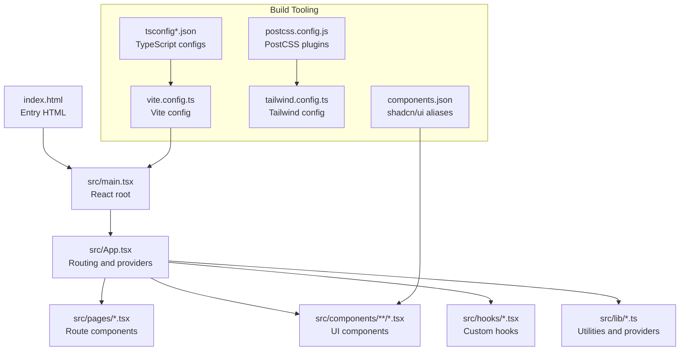
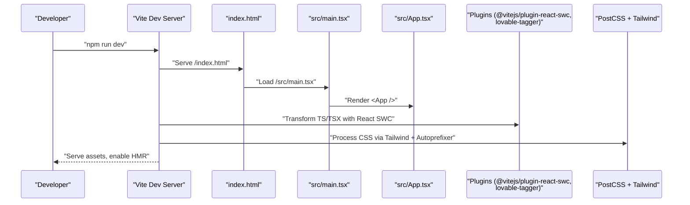
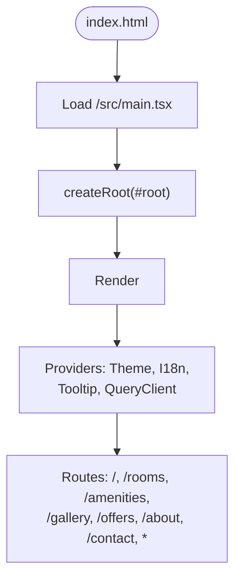
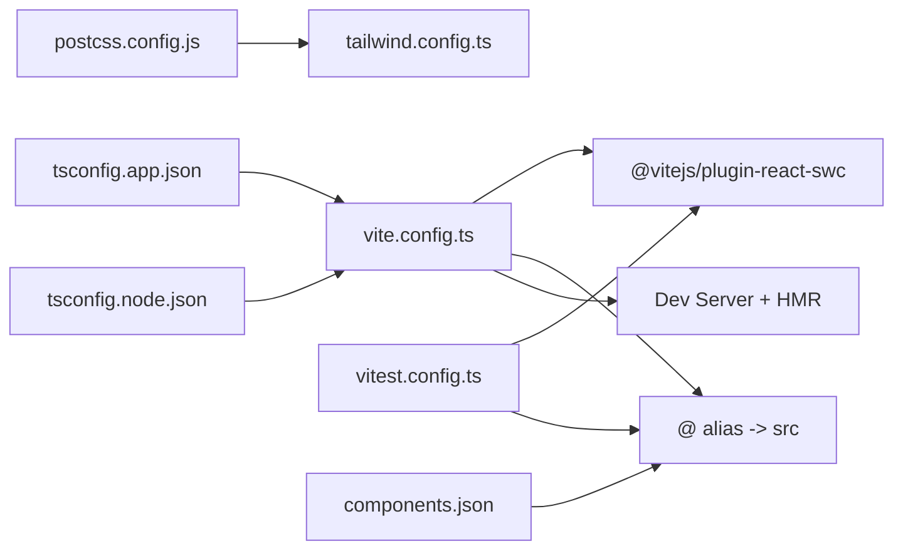

# Build System and Vite Configuration

<cite>
**Referenced Files in This Document**
- [vite.config.ts](file://vite.config.ts)
- [package.json](file://package.json)
- [tsconfig.json](file://tsconfig.json)
- [tsconfig.app.json](file://tsconfig.app.json)
- [tsconfig.node.json](file://tsconfig.node.json)
- [tailwind.config.ts](file://tailwind.config.ts)
- [postcss.config.js](file://postcss.config.js)
- [index.html](file://index.html)
- [components.json](file://components.json)
- [vitest.config.ts](file://vitest.config.ts)
- [eslint.config.js](file://eslint.config.js)
- [src/main.tsx](file://src/main.tsx)
- [src/App.tsx](file://src/App.tsx)
- [src/lib/theme.tsx](file://src/lib/theme.tsx)
</cite>

## Table of Contents
1. [Introduction](#introduction)
2. [Project Structure](#project-structure)
3. [Core Components](#core-components)
4. [Architecture Overview](#architecture-overview)
5. [Detailed Component Analysis](#detailed-component-analysis)
6. [Dependency Analysis](#dependency-analysis)
7. [Performance Considerations](#performance-considerations)
8. [Troubleshooting Guide](#troubleshooting-guide)
9. [Conclusion](#conclusion)
10. [Appendices](#appendices)

## Introduction
This document explains the Vite build system configuration for a modern React + TypeScript project using Tailwind CSS and shadcn/ui. It covers development server setup, hot module replacement (HMR), plugin integrations, alias resolution, PostCSS/Tailwind pipeline, and testing configuration. It also outlines production build considerations, optimization strategies, and troubleshooting guidance.

## Project Structure
The project follows a conventional Vite + React + TypeScript layout with shared configuration across multiple tsconfig files and a centralized Vite config. The HTML entry point mounts the React application, which is structured around pages, components, hooks, and shared libraries.

**Diagram sources**
- [index.html](file://index.html#L32-L36)
- [src/main.tsx](file://src/main.tsx#L1-L6)
- [src/App.tsx](file://src/App.tsx#L1-L45)
- [vite.config.ts](file://vite.config.ts#L7-L21)
- [tsconfig.json](file://tsconfig.json#L1-L17)
- [tsconfig.app.json](file://tsconfig.app.json#L1-L32)
- [tsconfig.node.json](file://tsconfig.node.json#L1-L23)
- [postcss.config.js](file://postcss.config.js#L1-L7)
- [tailwind.config.ts](file://tailwind.config.ts#L1-L86)
- [components.json](file://components.json#L1-L21)

**Section sources**
- [index.html](file://index.html#L1-L37)
- [src/main.tsx](file://src/main.tsx#L1-L6)
- [src/App.tsx](file://src/App.tsx#L1-L45)
- [vite.config.ts](file://vite.config.ts#L1-L22)
- [tsconfig.json](file://tsconfig.json#L1-L17)
- [tsconfig.app.json](file://tsconfig.app.json#L1-L32)
- [tsconfig.node.json](file://tsconfig.node.json#L1-L23)
- [postcss.config.js](file://postcss.config.js#L1-L7)
- [tailwind.config.ts](file://tailwind.config.ts#L1-L86)
- [components.json](file://components.json#L1-L21)

## Core Components
- Vite configuration defines the development server, HMR behavior, plugin activation, and path aliases.
- TypeScript configurations enable bundler-style resolution, JSX transform, and path mapping aligned with Vite and ESLint.
- Tailwind CSS and PostCSS handle utility-first styling and vendor prefixing.
- shadcn/ui aliases streamline component imports and maintain consistency.
- Vitest configuration mirrors Vite’s React plugin and path aliasing for unit tests.

Key configuration highlights:
- Development server: host, port, and HMR overlay disabled.
- Plugins: React SWC and a conditional component tagger plugin for development.
- Aliases: @ resolves to src for concise imports.
- Testing: React plugin, jsdom environment, global setup, and aliasing.

**Section sources**
- [vite.config.ts](file://vite.config.ts#L7-L21)
- [package.json](file://package.json#L6-L14)
- [tsconfig.app.json](file://tsconfig.app.json#L10-L28)
- [tsconfig.node.json](file://tsconfig.node.json#L8-L21)
- [postcss.config.js](file://postcss.config.js#L1-L7)
- [tailwind.config.ts](file://tailwind.config.ts#L1-L86)
- [components.json](file://components.json#L13-L19)
- [vitest.config.ts](file://vitest.config.ts#L5-L16)

## Architecture Overview
The build pipeline integrates Vite, React, TypeScript, Tailwind CSS, and PostCSS. The development server serves the HTML entry point, which loads the compiled React application. During development, Vite injects HMR code and hot-swaps module updates. For production builds, Vite bundles assets, resolves aliases, and optimizes output.

**Diagram sources**
- [vite.config.ts](file://vite.config.ts#L7-L21)
- [index.html](file://index.html#L32-L36)
- [src/main.tsx](file://src/main.tsx#L1-L6)
- [src/App.tsx](file://src/App.tsx#L1-L45)
- [postcss.config.js](file://postcss.config.js#L1-L7)
- [tailwind.config.ts](file://tailwind.config.ts#L1-L86)

## Detailed Component Analysis

### Vite Configuration
- Development server:
  - Host binding and port selection for network accessibility.
  - HMR overlay disabled to reduce UI noise during development.
- Plugins:
  - React SWC for fast JSX/TypeScript transforms.
  - Conditional component tagger activated only in development mode.
- Path aliases:
  - @ resolves to src for consistent imports across the app.

Recommended customization examples (described):
- Build targets: adjust target in TypeScript configs for browser/engine compatibility.
- Aliasing: extend the alias map for feature folders or shared modules.
- Proxy servers: add server.proxy configuration for API routing during development.
- Environment-specific builds: use Vite mode to toggle plugins or define constants.

**Section sources**
- [vite.config.ts](file://vite.config.ts#L7-L21)

### TypeScript Configuration
- Root tsconfig orchestrates app and node configs and sets baseUrl/paths for Vite and ESLint alignment.
- App config:
  - Bundler module resolution, JSX transform, and path mapping.
  - Includes src and disables emits for Vite’s inlining.
- Node config:
  - Targets Vite config for type checking and bundler detection.

Best practices:
- Keep path aliases synchronized between tsconfig, Vite, and ESLint.
- Use strictness levels appropriate for your team’s standards.

**Section sources**
- [tsconfig.json](file://tsconfig.json#L1-L17)
- [tsconfig.app.json](file://tsconfig.app.json#L1-L32)
- [tsconfig.node.json](file://tsconfig.node.json#L1-L23)

### Tailwind CSS and PostCSS
- Tailwind:
  - Dark mode strategy via class.
  - Content globs scan pages, components, app, and src directories.
  - Extends theme tokens, animations, and spacing scales.
- PostCSS:
  - Enables Tailwind and Autoprefixer plugins.

Integration tips:
- Ensure content paths match your project structure to avoid purging unused styles.
- Keep Tailwind and PostCSS configs in sync with your CSS entry.

**Section sources**
- [tailwind.config.ts](file://tailwind.config.ts#L1-L86)
- [postcss.config.js](file://postcss.config.js#L1-L7)

### shadcn/ui Aliases
- components.json defines standardized aliases for components, utils, ui, lib, and hooks.
- These aliases align with Vite and TypeScript path mapping for predictable imports.

Usage:
- Import UI components using configured aliases for consistency across the codebase.

**Section sources**
- [components.json](file://components.json#L1-L21)
- [tsconfig.app.json](file://tsconfig.app.json#L25-L28)
- [vite.config.ts](file://vite.config.ts#L16-L20)

### Testing Configuration (Vitest)
- Mirrors Vite’s React plugin and path aliasing.
- Uses jsdom environment, global setup, and includes test/spec files under src.

Recommendations:
- Add coverage configuration and environment variables for test isolation.
- Extend setup files for global mocks or providers.

**Section sources**
- [vitest.config.ts](file://vitest.config.ts#L1-L17)

### Application Bootstrap
- index.html mounts the React root and loads the main entry script.
- src/main.tsx renders the root React element.
- src/App.tsx composes providers (theme, i18n, tooltips, router) and routes.

**Diagram sources**
- [index.html](file://index.html#L32-L36)
- [src/main.tsx](file://src/main.tsx#L1-L6)
- [src/App.tsx](file://src/App.tsx#L1-L45)

**Section sources**
- [index.html](file://index.html#L32-L36)
- [src/main.tsx](file://src/main.tsx#L1-L6)
- [src/App.tsx](file://src/App.tsx#L1-L45)

## Dependency Analysis
- Vite depends on:
  - React plugin for transforms.
  - Optional component tagger for development insights.
  - Path aliases for module resolution.
- TypeScript configs depend on Vite’s module resolution and path mapping.
- Tailwind and PostCSS depend on each other and on CSS entry.
- Vitest depends on Vite’s plugin stack and path mapping.

**Diagram sources**
- [vite.config.ts](file://vite.config.ts#L7-L21)
- [tsconfig.app.json](file://tsconfig.app.json#L10-L28)
- [tsconfig.node.json](file://tsconfig.node.json#L8-L21)
- [postcss.config.js](file://postcss.config.js#L1-L7)
- [tailwind.config.ts](file://tailwind.config.ts#L1-L86)
- [vitest.config.ts](file://vitest.config.ts#L1-L17)
- [components.json](file://components.json#L13-L19)

**Section sources**
- [vite.config.ts](file://vite.config.ts#L7-L21)
- [tsconfig.app.json](file://tsconfig.app.json#L10-L28)
- [tsconfig.node.json](file://tsconfig.node.json#L8-L21)
- [postcss.config.js](file://postcss.config.js#L1-L7)
- [tailwind.config.ts](file://tailwind.config.ts#L1-L86)
- [vitest.config.ts](file://vitest.config.ts#L1-L17)
- [components.json](file://components.json#L13-L19)

## Performance Considerations
- Prefer React SWC plugin for faster transforms in development and production.
- Keep alias paths short and consistent to improve module resolution performance.
- Configure Tailwind content globs precisely to avoid scanning unnecessary directories.
- Use lazy loading for route-based code splitting to reduce initial bundle size.
- Enable minification and asset inlining for production builds.
- Monitor HMR performance by disabling overlays and unnecessary plugins in development.

[No sources needed since this section provides general guidance]

## Troubleshooting Guide
Common issues and resolutions:
- Alias resolution errors:
  - Ensure @ alias is defined in Vite, tsconfig, and ESLint configs.
  - Verify path mapping matches directory structure.
- HMR not working:
  - Confirm HMR overlay is enabled/disabled intentionally and network host/port are reachable.
- Tailwind utilities missing:
  - Update content globs to include new component directories.
  - Re-run dev server after Tailwind config changes.
- Type errors in Vite config:
  - Align tsconfig.node with Vite’s module resolution and bundler detection.
- Test environment mismatches:
  - Confirm Vitest uses jsdom and setup files are loaded.

**Section sources**
- [vite.config.ts](file://vite.config.ts#L16-L20)
- [tsconfig.app.json](file://tsconfig.app.json#L25-L28)
- [tsconfig.node.json](file://tsconfig.node.json#L8-L21)
- [tailwind.config.ts](file://tailwind.config.ts#L5-L5)
- [vitest.config.ts](file://vitest.config.ts#L7-L12)

## Conclusion
This project’s Vite configuration provides a solid foundation for a modern React + TypeScript application with Tailwind CSS and shadcn/ui. By aligning Vite, TypeScript, and PostCSS configurations, enabling efficient plugins, and leveraging path aliases, teams can achieve fast development feedback and optimized production builds. Extending the configuration with proxy servers, environment modes, and advanced bundling strategies will further enhance developer experience and performance.

[No sources needed since this section summarizes without analyzing specific files]

## Appendices

### Development Workflow Enhancements
- Use Vite mode to toggle plugins and environment-specific behavior.
- Integrate a proxy server in development for API requests.
- Set up environment variables per mode for feature flags or endpoints.

**Section sources**
- [vite.config.ts](file://vite.config.ts#L7-L15)
- [package.json](file://package.json#L6-L14)

### Production Build Guidance
- Target modern browsers for smaller bundles.
- Enable code splitting for routes and heavy components.
- Optimize images and fonts; configure asset hashing and caching headers.

[No sources needed since this section provides general guidance]

### Debugging and Monitoring
- Use console logging and React DevTools for component inspection.
- Leverage ESLint rules for hooks and refresh best practices.
- Monitor bundle size and analyze chunks with Vite’s build analyzer plugins.

**Section sources**
- [eslint.config.js](file://eslint.config.js#L1-L27)