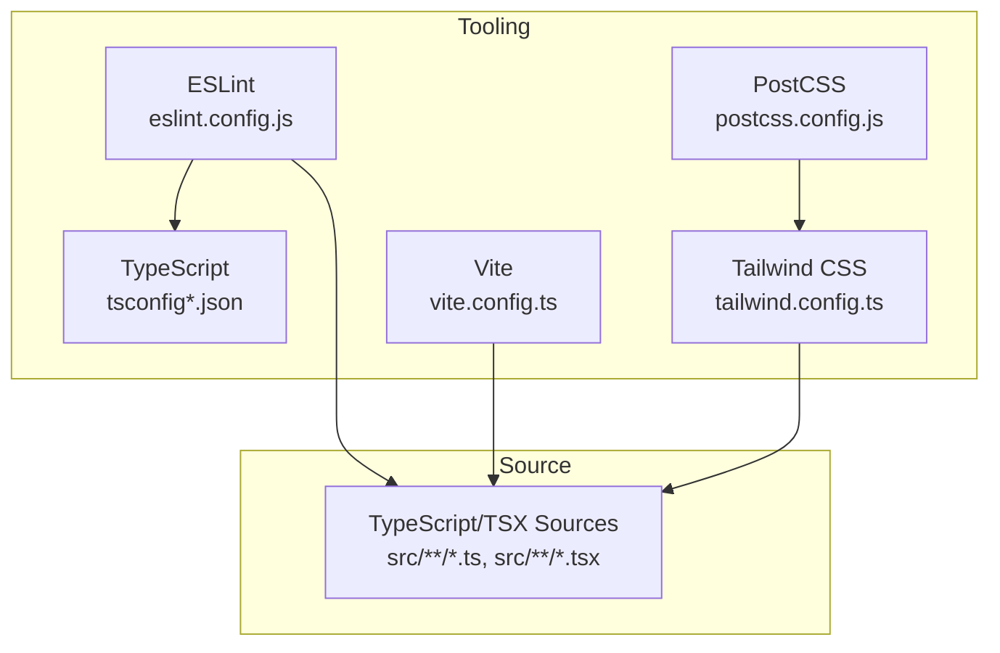
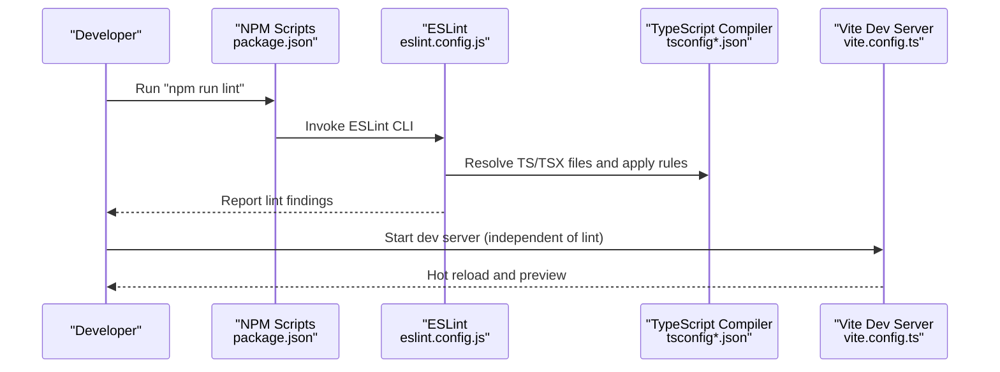
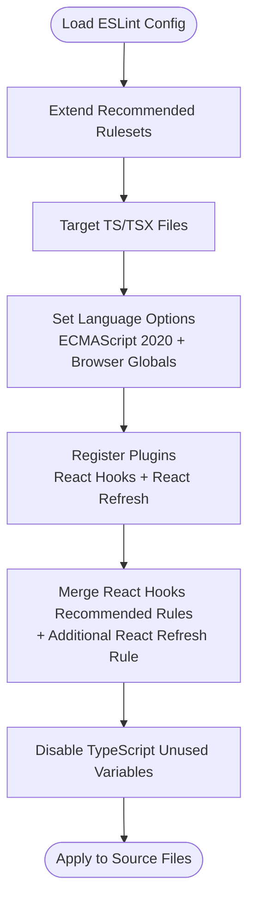
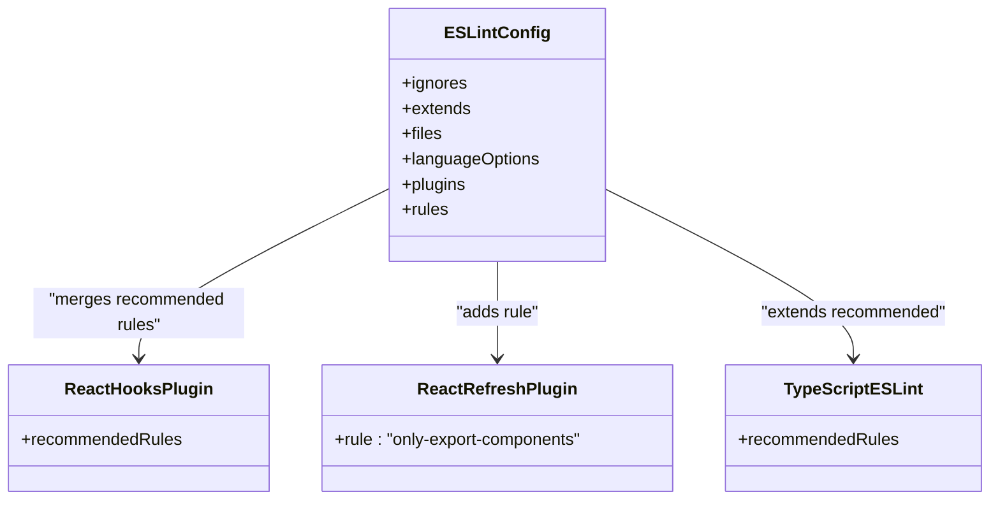
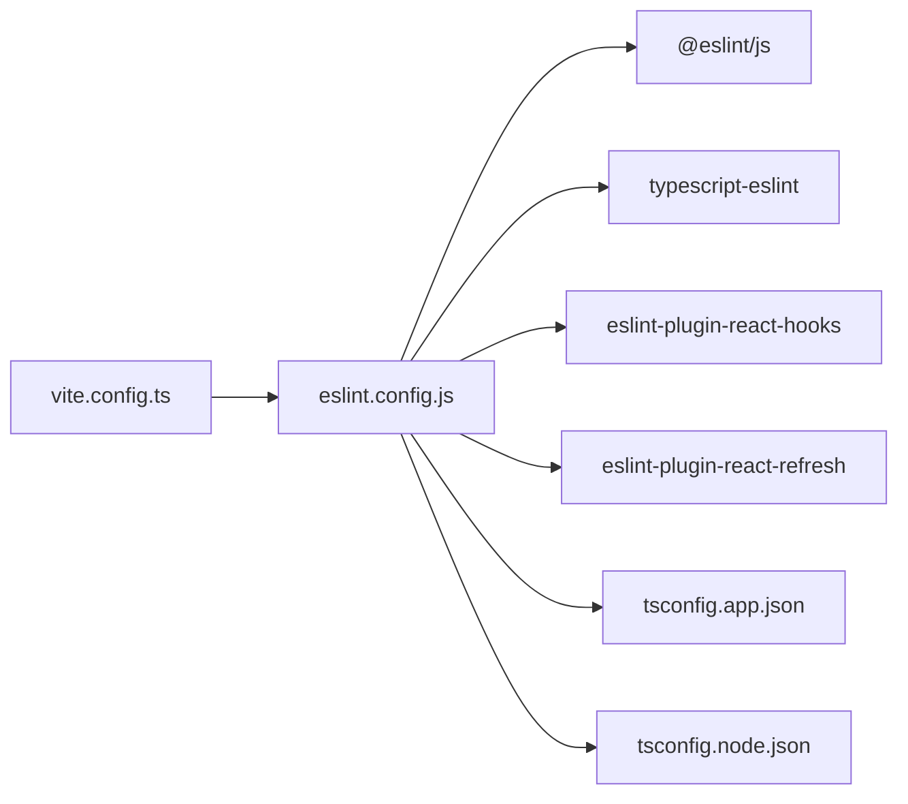

# Code Quality and ESLint Configuration

<cite>
**Referenced Files in This Document**
- [eslint.config.js](file://eslint.config.js)
- [package.json](file://package.json)
- [vite.config.ts](file://vite.config.ts)
- [tsconfig.json](file://tsconfig.json)
- [tsconfig.app.json](file://tsconfig.app.json)
- [tsconfig.node.json](file://tsconfig.node.json)
- [postcss.config.js](file://postcss.config.js)
- [tailwind.config.ts](file://tailwind.config.ts)
- [components.json](file://components.json)
- [README.md](file://README.md)
- [src/App.tsx](file://src/App.tsx)
- [src/main.tsx](file://src/main.tsx)
</cite>

## Table of Contents
1. [Introduction](#introduction)
2. [Project Structure](#project-structure)
3. [Core Components](#core-components)
4. [Architecture Overview](#architecture-overview)
5. [Detailed Component Analysis](#detailed-component-analysis)
6. [Dependency Analysis](#dependency-analysis)
7. [Performance Considerations](#performance-considerations)
8. [Troubleshooting Guide](#troubleshooting-guide)
9. [Conclusion](#conclusion)
10. [Appendices](#appendices)

## Introduction
This document explains the ESLint configuration and code quality enforcement strategy for the project. It covers the ESLint configuration structure, plugin integrations, and rule definitions. It also documents React-specific rules, TypeScript integration, and formatting standards. Guidance is provided for customizing lint rules, adding new plugins, configuring autofixing, pre-commit hooks, CI integration, automated code quality checks, common linting issues, rule conflicts, performance optimization, maintaining consistent code style across the team, and troubleshooting linting problems.

## Project Structure
The project uses a modern frontend stack: Vite, React, TypeScript, and Tailwind CSS. ESLint is configured centrally via a flat config file and integrates with TypeScript and React tooling. The configuration targets TypeScript/TSX files and applies recommended base rules plus React-specific plugins.

**Diagram sources**
- [eslint.config.js](file://eslint.config.js#L1-L27)
- [tsconfig.json](file://tsconfig.json#L1-L17)
- [tsconfig.app.json](file://tsconfig.app.json#L1-L32)
- [tsconfig.node.json](file://tsconfig.node.json#L1-L23)
- [vite.config.ts](file://vite.config.ts#L1-L22)
- [tailwind.config.ts](file://tailwind.config.ts#L1-L86)
- [postcss.config.js](file://postcss.config.js#L1-L7)

**Section sources**
- [eslint.config.js](file://eslint.config.js#L1-L27)
- [package.json](file://package.json#L1-L90)
- [vite.config.ts](file://vite.config.ts#L1-L22)
- [tsconfig.json](file://tsconfig.json#L1-L17)
- [tsconfig.app.json](file://tsconfig.app.json#L1-L32)
- [tsconfig.node.json](file://tsconfig.node.json#L1-L23)
- [postcss.config.js](file://postcss.config.js#L1-L7)
- [tailwind.config.ts](file://tailwind.config.ts#L1-L86)
- [components.json](file://components.json#L1-L21)
- [README.md](file://README.md#L1-L74)

## Core Components
- ESLint configuration: Centralized flat config that extends recommended base rules, enables TypeScript linting, and adds React-specific plugins and rules.
- TypeScript integration: The config targets TS/TSX files and leverages TypeScript ESLint’s recommended rulesets.
- React-specific rules: React Hooks and React Refresh plugins are enabled with recommended rules and a custom rule for export components.
- Formatting standards: Formatting is handled by PostCSS/Tailwind; ESLint focuses on logic and style rules rather than formatting.

Key configuration highlights:
- Targets TypeScript/TSX files and ignores the dist folder.
- Extends recommended base and TypeScript ESLint recommended sets.
- Enables globals for browser environments.
- Applies React Hooks recommended rules and a React Refresh rule.
- Disables a specific TypeScript unused variables rule.

**Section sources**
- [eslint.config.js](file://eslint.config.js#L1-L27)
- [package.json](file://package.json#L66-L88)

## Architecture Overview
The linting pipeline integrates with the development workflow and build process. ESLint runs against TS/TSX sources, leveraging TypeScript’s type-checking context and React tooling.

**Diagram sources**
- [package.json](file://package.json#L6-L14)
- [eslint.config.js](file://eslint.config.js#L1-L27)
- [tsconfig.app.json](file://tsconfig.app.json#L1-L32)
- [vite.config.ts](file://vite.config.ts#L1-L22)

## Detailed Component Analysis

### ESLint Configuration Structure
The ESLint configuration is a flat config that:
- Ignores the dist directory.
- Extends recommended base and TypeScript ESLint recommended rulesets.
- Targets TS/TSX files.
- Sets language options for ECMAScript 2020 and browser globals.
- Registers React Hooks and React Refresh plugins.
- Merges React Hooks recommended rules with additional React Refresh rule.
- Includes a custom rule disabling TypeScript unused variables.

**Diagram sources**
- [eslint.config.js](file://eslint.config.js#L7-L26)

**Section sources**
- [eslint.config.js](file://eslint.config.js#L1-L27)

### Plugin Integrations
- @eslint/js: Provides recommended base rules for JavaScript.
- typescript-eslint: Provides recommended rulesets for TypeScript projects.
- eslint-plugin-react-hooks: Enforces React Hooks rules.
- eslint-plugin-react-refresh: Prevents invalid refresh boundaries and enforces safe exports for fast refresh.

These plugins are registered and their recommended rules are applied, with additional overrides as needed.

**Section sources**
- [eslint.config.js](file://eslint.config.js#L1-L27)
- [package.json](file://package.json#L66-L88)

### Rule Definitions and React/TypeScript Integration
- React Hooks recommended rules are merged into the configuration.
- A React Refresh rule is added with a specific option allowing constant exports.
- The TypeScript unused variables rule is disabled to avoid conflicts with other tooling decisions.

**Diagram sources**
- [eslint.config.js](file://eslint.config.js#L7-L26)

**Section sources**
- [eslint.config.js](file://eslint.config.js#L1-L27)

### TypeScript Configuration and Linting Alignment
TypeScript configurations align with ESLint:
- Root tsconfig references app and node configs.
- App config targets ES2020, JSX with react-jsx, bundler module resolution, and disables strictness for developer ergonomics.
- Node config targets ES2022/ESNext with stricter lint-related options for non-application code.

These choices influence how ESLint interprets code and applies rules.

**Section sources**
- [tsconfig.json](file://tsconfig.json#L1-L17)
- [tsconfig.app.json](file://tsconfig.app.json#L1-L32)
- [tsconfig.node.json](file://tsconfig.node.json#L1-L23)

### Formatting Standards
Formatting is managed by Tailwind CSS and PostCSS:
- Tailwind CSS scans components and pages for class usage and generates styles.
- PostCSS applies Tailwind and Autoprefixer during builds.
- ESLint does not enforce formatting; formatting consistency is achieved via Tailwind and PostCSS tooling.

**Section sources**
- [tailwind.config.ts](file://tailwind.config.ts#L1-L86)
- [postcss.config.js](file://postcss.config.js#L1-L7)
- [components.json](file://components.json#L1-L21)

### Customization Examples
- To customize a rule: Add or override a rule in the rules section of the ESLint config.
- To add a new plugin: Import the plugin, add it to the plugins section, and reference its rules in the rules section.
- To configure autofixing: Run ESLint with the fix flag via the lint script; note that not all rules support autofix.

These actions should be performed while keeping the existing structure intact.

**Section sources**
- [eslint.config.js](file://eslint.config.js#L1-L27)
- [package.json](file://package.json#L10-L10)

### Pre-commit Hooks and CI Integration
- Pre-commit hooks: Integrate a linter runner (e.g., lint-staged with Husky) to run ESLint on staged files before commits.
- CI integration: Add a job to run the lint script in your CI pipeline to enforce code quality on pull requests and merges.

These practices ensure consistent code quality across the team.

**Section sources**
- [package.json](file://package.json#L6-L14)

### Automated Code Quality Checks
- Local checks: Run the lint script to validate code quality before committing.
- Editor integration: Configure your editor to show ESLint diagnostics inline for immediate feedback.

**Section sources**
- [package.json](file://package.json#L10-L10)

### Common Linting Issues, Conflicts, and Resolutions
- Unused variables: The TypeScript unused variables rule is disabled; if you enable it, resolve or ignore specific cases as needed.
- React Refresh errors: Adjust the React Refresh rule configuration if encountering issues with exports or component boundaries.
- Performance: Keep ignore patterns minimal and targeted to reduce scan time.

**Section sources**
- [eslint.config.js](file://eslint.config.js#L20-L24)

### Performance Optimization
- Targeted file selection: The config already restricts linting to TS/TSX files.
- Ignore large directories: The dist folder is ignored.
- Minimize rule churn: Avoid overly strict or conflicting rules that cause frequent failures.

**Section sources**
- [eslint.config.js](file://eslint.config.js#L8-L11)

### Maintaining Consistent Code Style Across the Team
- Document the ESLint configuration and rationale in your repository.
- Use the same editor extensions and CI checks across the team.
- Periodically review and update rules to balance strictness and developer productivity.

[No sources needed since this section provides general guidance]

### Troubleshooting Linting Problems
- Verify the lint script exists and runs without errors.
- Confirm TypeScript configs align with ESLint’s expectations.
- Check for conflicting rules and adjust as needed.
- Ensure the dev server and linting are not blocking each other.

**Section sources**
- [package.json](file://package.json#L6-L14)
- [tsconfig.app.json](file://tsconfig.app.json#L18-L24)
- [eslint.config.js](file://eslint.config.js#L1-L27)

## Dependency Analysis
The ESLint configuration depends on:
- Base JS rules and TypeScript ESLint recommended rules.
- React Hooks and React Refresh plugins.
- TypeScript compiler options and module resolution.

**Diagram sources**
- [eslint.config.js](file://eslint.config.js#L1-L27)
- [package.json](file://package.json#L66-L88)
- [tsconfig.app.json](file://tsconfig.app.json#L1-L32)
- [tsconfig.node.json](file://tsconfig.node.json#L1-L23)
- [vite.config.ts](file://vite.config.ts#L1-L22)

**Section sources**
- [eslint.config.js](file://eslint.config.js#L1-L27)
- [package.json](file://package.json#L66-L88)
- [tsconfig.app.json](file://tsconfig.app.json#L1-L32)
- [tsconfig.node.json](file://tsconfig.node.json#L1-L23)
- [vite.config.ts](file://vite.config.ts#L1-L22)

## Performance Considerations
- Keep ignore patterns focused to avoid scanning unnecessary files.
- Limit rule scope to what is necessary for your project’s needs.
- Prefer incremental linting in editors and pre-commit hooks to reduce overhead.

[No sources needed since this section provides general guidance]

## Troubleshooting Guide
- If linting fails locally but passes in CI, verify local tool versions match CI.
- If React Refresh warnings appear, adjust the React Refresh rule configuration.
- If TypeScript rules conflict with other tooling, disable or tune the conflicting rule.

**Section sources**
- [eslint.config.js](file://eslint.config.js#L20-L24)
- [package.json](file://package.json#L66-L88)

## Conclusion
The project’s ESLint configuration provides a solid foundation for code quality by extending recommended base and TypeScript ESLint rules, integrating React Hooks and React Refresh plugins, and targeting TS/TSX sources. Formatting is handled separately via Tailwind and PostCSS. By following the customization, pre-commit, and CI guidance, teams can maintain consistent, high-quality code.

[No sources needed since this section summarizes without analyzing specific files]

## Appendices
- Example scripts and tooling references are available in the repository configuration files.

**Section sources**
- [package.json](file://package.json#L6-L14)
- [README.md](file://README.md#L1-L74)