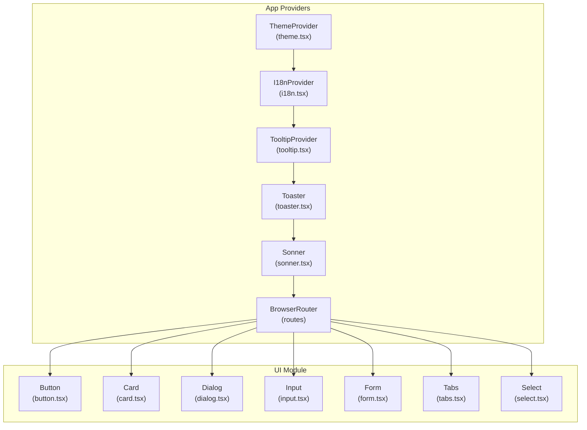
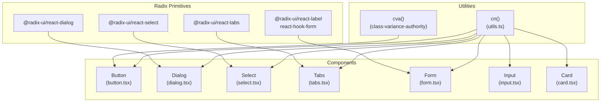
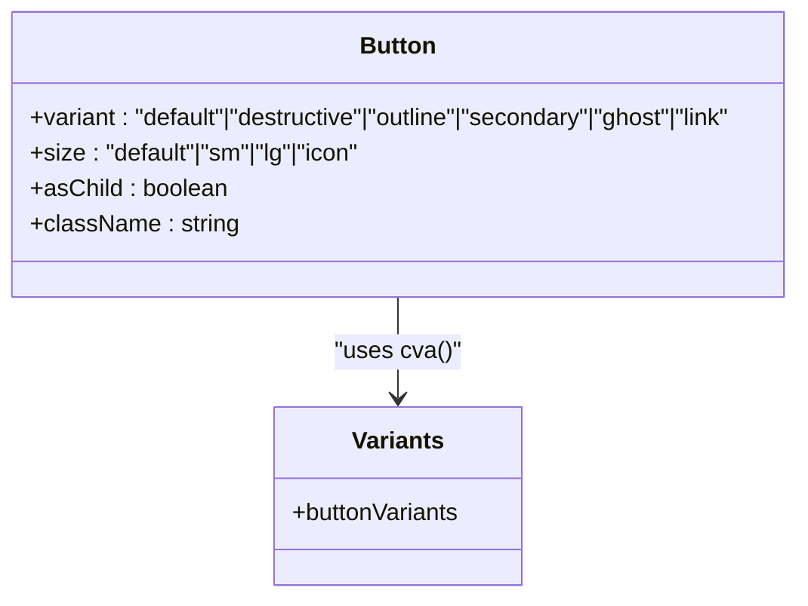
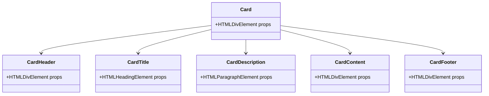
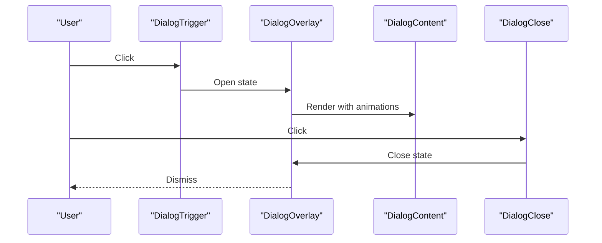
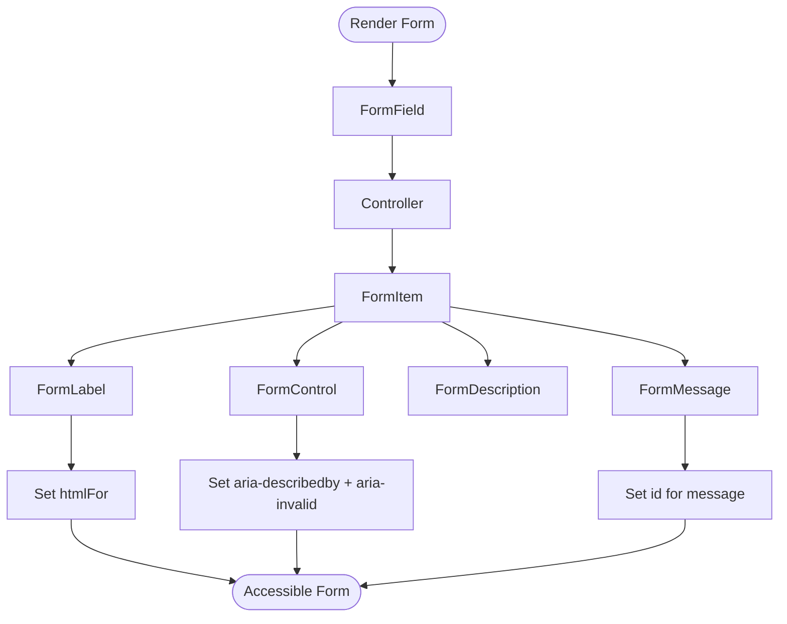
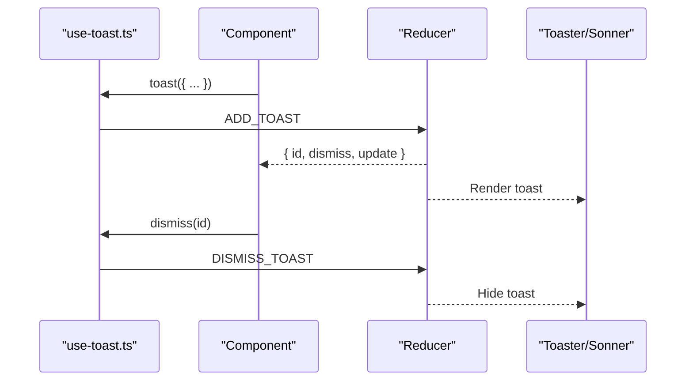
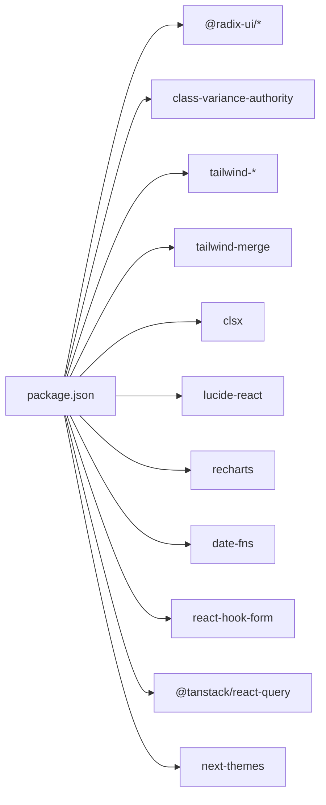

# Component Library Integration (shadcn/ui)

<cite>
**Referenced Files in This Document**
- [components.json](file://components.json)
- [tailwind.config.ts](file://tailwind.config.ts)
- [package.json](file://package.json)
- [src/lib/utils.ts](file://src/lib/utils.ts)
- [src/lib/theme.tsx](file://src/lib/theme.tsx)
- [src/App.tsx](file://src/App.tsx)
- [src/components/ui/button.tsx](file://src/components/ui/button.tsx)
- [src/components/ui/card.tsx](file://src/components/ui/card.tsx)
- [src/components/ui/dialog.tsx](file://src/components/ui/dialog.tsx)
- [src/components/ui/input.tsx](file://src/components/ui/input.tsx)
- [src/components/ui/form.tsx](file://src/components/ui/form.tsx)
- [src/components/ui/tabs.tsx](file://src/components/ui/tabs.tsx)
- [src/components/ui/select.tsx](file://src/components/ui/select.tsx)
- [src/components/ui/use-toast.ts](file://src/components/ui/use-toast.ts)
- [src/hooks/use-toast.ts](file://src/hooks/use-toast.ts)
</cite>

## Table of Contents
1. [Introduction](#introduction)
2. [Project Structure](#project-structure)
3. [Core Components](#core-components)
4. [Architecture Overview](#architecture-overview)
5. [Detailed Component Analysis](#detailed-component-analysis)
6. [Dependency Analysis](#dependency-analysis)
7. [Performance Considerations](#performance-considerations)
8. [Troubleshooting Guide](#troubleshooting-guide)
9. [Conclusion](#conclusion)
10. [Appendices](#appendices)

## Introduction
This document explains how the shadcn/ui component library is integrated into the project. It covers installation and configuration via the official schema, component architecture and prop interfaces, styling and className merging strategies, customization patterns, theme configuration, accessibility and keyboard navigation, and practical guidance for maintaining and updating the integration.

## Project Structure
The project follows a conventional React + Vite + TypeScript setup with Tailwind CSS configured for CSS variables and a dark mode strategy. The shadcn/ui components live under a dedicated UI module, and shared utilities (className merging) and theme provider are centralized in the lib folder. Application-wide providers (theme, i18n, tooltips, toasts) wrap the routing tree.

**Diagram sources**
- [src/App.tsx](file://src/App.tsx#L1-L45)
- [src/components/ui/button.tsx](file://src/components/ui/button.tsx#L1-L48)
- [src/components/ui/card.tsx](file://src/components/ui/card.tsx#L1-L44)
- [src/components/ui/dialog.tsx](file://src/components/ui/dialog.tsx#L1-L96)
- [src/components/ui/input.tsx](file://src/components/ui/input.tsx#L1-L23)
- [src/components/ui/form.tsx](file://src/components/ui/form.tsx#L1-L130)
- [src/components/ui/tabs.tsx](file://src/components/ui/tabs.tsx#L1-L54)
- [src/components/ui/select.tsx](file://src/components/ui/select.tsx#L1-L144)

**Section sources**
- [src/App.tsx](file://src/App.tsx#L1-L45)

## Core Components
This section outlines the integration essentials: configuration, className merging, and theme management.

- shadcn/ui configuration
  - Style and TSX preferences, Tailwind config and CSS variables, and alias mapping are defined in the schema file.
  - Aliases map internal references to project paths for components, utils, UI module, lib, and hooks.

- className merging strategy
  - A centralized cn() helper merges Tailwind classes safely using clsx and tailwind-merge.

- Theme configuration
  - A ThemeProvider manages light/dark mode, persists user preference, and toggles a root class for Tailwind dark mode.

**Section sources**
- [components.json](file://components.json#L1-L21)
- [src/lib/utils.ts](file://src/lib/utils.ts#L1-L7)
- [src/lib/theme.tsx](file://src/lib/theme.tsx#L1-L36)
- [tailwind.config.ts](file://tailwind.config.ts#L1-L86)

## Architecture Overview
The UI components are thin wrappers around Radix UI primitives, styled with Tailwind and composed via className merging. Variants are defined with class-variance-authority for consistent, composable styles. Forms integrate with react-hook-form and provide accessible labeling and ARIA attributes. Toast systems are provided by both the built-in Toaster and Sonner.

**Diagram sources**
- [src/lib/utils.ts](file://src/lib/utils.ts#L1-L7)
- [src/components/ui/button.tsx](file://src/components/ui/button.tsx#L1-L48)
- [src/components/ui/dialog.tsx](file://src/components/ui/dialog.tsx#L1-L96)
- [src/components/ui/select.tsx](file://src/components/ui/select.tsx#L1-L144)
- [src/components/ui/tabs.tsx](file://src/components/ui/tabs.tsx#L1-L54)
- [src/components/ui/form.tsx](file://src/components/ui/form.tsx#L1-L130)
- [src/components/ui/input.tsx](file://src/components/ui/input.tsx#L1-L23)
- [src/components/ui/card.tsx](file://src/components/ui/card.tsx#L1-L44)

## Detailed Component Analysis

### Button (Variants and Composition)
- Purpose: Base button with variant and size variants, optional child rendering via Slot.
- Props: Inherits base button attributes plus variant and size from class-variance-authority, plus asChild for composition.
- Styling: Uses cva() to define variant and size tokens; className merging ensures overrides work predictably.
- Accessibility: Inherits focus-visible ring styles and maintains pointer-event behavior for disabled states.

**Diagram sources**
- [src/components/ui/button.tsx](file://src/components/ui/button.tsx#L1-L48)

**Section sources**
- [src/components/ui/button.tsx](file://src/components/ui/button.tsx#L1-L48)

### Card (Composition Pattern)
- Purpose: Composite layout with header, title, description, content, and footer slots.
- Props: Accepts generic HTML attributes; each subcomponent forwards refs and merges className.
- Styling: Each part applies Tailwind classes and merges incoming className.

**Diagram sources**
- [src/components/ui/card.tsx](file://src/components/ui/card.tsx#L1-L44)

**Section sources**
- [src/components/ui/card.tsx](file://src/components/ui/card.tsx#L1-L44)

### Dialog (Overlay, Portal, Primitive Composition)
- Purpose: Modal overlay with animated content, close trigger, and structured header/footer/title/description.
- Props: Forwards primitive props; uses Portal to render overlay outside normal DOM order.
- Accessibility: Close button includes screen reader text; overlays animate in/out; focus-visible rings applied to interactive elements.

**Diagram sources**
- [src/components/ui/dialog.tsx](file://src/components/ui/dialog.tsx#L1-L96)

**Section sources**
- [src/components/ui/dialog.tsx](file://src/components/ui/dialog.tsx#L1-L96)

### Input (Base Input)
- Purpose: Styled input with focus-visible rings and disabled state handling.
- Props: Inherits standard input attributes; className merging allows overrides.

**Section sources**
- [src/components/ui/input.tsx](file://src/components/ui/input.tsx#L1-L23)

### Form (Accessible Form Stack)
- Purpose: Integrates react-hook-form with accessible labels, descriptions, and error messaging.
- Features:
  - useFormField reads contextual ids and error state.
  - FormControl sets aria-describedby and aria-invalid.
  - FormLabel conditionally styles based on error.
  - FormMessage renders error messages with proper ids.
- Accessibility: Ensures ARIA attributes and ids are consistently generated and linked.

**Diagram sources**
- [src/components/ui/form.tsx](file://src/components/ui/form.tsx#L1-L130)

**Section sources**
- [src/components/ui/form.tsx](file://src/components/ui/form.tsx#L1-L130)

### Tabs (Keyboard-Navigable)
- Purpose: Tab list with triggers and content areas.
- Accessibility: Uses Radix UI primitives that provide native keyboard navigation and ARIA roles.

**Section sources**
- [src/components/ui/tabs.tsx](file://src/components/ui/tabs.tsx#L1-L54)

### Select (Scrollable Dropdown)
- Purpose: Styled select with scroll buttons, viewport, and item indicators.
- Accessibility: Uses Radix Select primitives; items expose selection state and focus styles.

**Section sources**
- [src/components/ui/select.tsx](file://src/components/ui/select.tsx#L1-L144)

### Toast Systems (Toaster and Sonner)
- Purpose: Global notifications with queue limits and dismissal timers.
- Implementation: A lightweight hook-based toast manager exposes toast and useToast, while Sonner provides a modern toast container.

**Diagram sources**
- [src/hooks/use-toast.ts](file://src/hooks/use-toast.ts#L1-L187)
- [src/components/ui/use-toast.ts](file://src/components/ui/use-toast.ts#L1-L4)

**Section sources**
- [src/hooks/use-toast.ts](file://src/hooks/use-toast.ts#L1-L187)
- [src/components/ui/use-toast.ts](file://src/components/ui/use-toast.ts#L1-L4)

## Dependency Analysis
The integration relies on:
- Radix UI primitives for accessible component foundations.
- class-variance-authority for variant composition.
- Tailwind CSS with CSS variables and tailwind-merge for safe className merging.
- Optional libraries like cmdk, date-fns, recharts, and others for extended functionality.

**Diagram sources**
- [package.json](file://package.json#L15-L64)

**Section sources**
- [package.json](file://package.json#L15-L64)

## Performance Considerations
- Prefer className merging via cn() to avoid redundant classes and reduce bundle size.
- Keep variant sets minimal to limit CSS output from cva().
- Use portals judiciously (e.g., dialogs) to avoid unnecessary DOM traversal.
- Memoize heavy computations in forms and lists; leverage react-hook-form’s controlled updates.
- Enable tree-shaking and ensure Tailwind purges unused classes appropriately.

## Troubleshooting Guide
Common integration issues and resolutions:
- Missing className merging
  - Symptom: Overridden classes not taking effect.
  - Fix: Ensure cn() is used to merge incoming className with component defaults.

- Dark mode not applying
  - Symptom: Theme toggle does not change visuals.
  - Fix: Verify ThemeProvider wraps the app and that the root element receives the dark class on toggle.

- Dialog overlay not visible or focus issues
  - Symptom: Overlay not covering content or focus not trapped.
  - Fix: Confirm Portal rendering and that overlay/content classes include required z-index and positioning.

- Form accessibility errors
  - Symptom: Screen readers announce missing labels or invalid states.
  - Fix: Use FormField/FormLabel/FormControl/FormDescription/FormMessage consistently; ensure ids and aria attributes are present.

- Toast stacking or timing issues
  - Symptom: Multiple toasts overlap or disappear unexpectedly.
  - Fix: Review toast queue limits and timeouts; adjust TOAST_LIMIT and durations if needed.

**Section sources**
- [src/lib/utils.ts](file://src/lib/utils.ts#L1-L7)
- [src/lib/theme.tsx](file://src/lib/theme.tsx#L1-L36)
- [src/components/ui/dialog.tsx](file://src/components/ui/dialog.tsx#L1-L96)
- [src/components/ui/form.tsx](file://src/components/ui/form.tsx#L1-L130)
- [src/hooks/use-toast.ts](file://src/hooks/use-toast.ts#L1-L187)

## Conclusion
The project integrates shadcn/ui components through a clean, maintainable pattern: Radix primitives, Tailwind CSS variables, className merging with cn(), and variant composition via class-variance-authority. Centralized theme and provider setup ensures consistent behavior across components. Accessibility is addressed through primitive semantics and explicit ARIA attributes. Following the customization and maintenance guidelines herein will help keep the integration robust and upgradable.

## Appendices

### Installation and Configuration Workflow
- Initialize or update the schema
  - Configure style, TSX flag, Tailwind config path, CSS variables, and aliases in the schema file.
- Install dependencies
  - Add Radix UI packages, class-variance-authority, clsx, tailwind-merge, and icons as needed.
- Configure Tailwind
  - Enable CSS variables for Tailwind color tokens and register animations plugin.
- Alias mapping
  - Ensure aliases in the schema match project paths for components, utils, UI module, lib, and hooks.

**Section sources**
- [components.json](file://components.json#L1-L21)
- [tailwind.config.ts](file://tailwind.config.ts#L1-L86)
- [package.json](file://package.json#L15-L64)

### Customization Patterns
- Creating custom variants
  - Extend cva() with new variant and size tokens; compose className with cn() to merge defaults and overrides.
- Extending component functionality
  - Wrap primitives with additional UI concerns (e.g., dialogs with custom headers) while preserving className merging and ref forwarding.
- className merging strategy
  - Always pass component defaults and incoming className into cn(); this prevents conflicts and ensures predictable overrides.

**Section sources**
- [src/components/ui/button.tsx](file://src/components/ui/button.tsx#L1-L48)
- [src/lib/utils.ts](file://src/lib/utils.ts#L1-L7)

### Accessibility and Keyboard Navigation
- Buttons and inputs
  - Focus-visible rings and disabled pointer-events improve keyboard and screen reader UX.
- Dialogs
  - Close button includes screen reader text; overlays animate in/out; portal rendering avoids focus trapping issues.
- Tabs and Select
  - Radix UI primitives provide native keyboard navigation and ARIA roles.
- Forms
  - useFormField generates ids and aria attributes; FormControl sets aria-invalid and aria-describedby dynamically.

**Section sources**
- [src/components/ui/dialog.tsx](file://src/components/ui/dialog.tsx#L1-L96)
- [src/components/ui/tabs.tsx](file://src/components/ui/tabs.tsx#L1-L54)
- [src/components/ui/select.tsx](file://src/components/ui/select.tsx#L1-L144)
- [src/components/ui/form.tsx](file://src/components/ui/form.tsx#L1-L130)

### Maintaining Consistency and Upgrades
- Keep aliases aligned with project structure to prevent import path drift.
- Pin compatible versions of Radix UI packages and Tailwind plugins.
- Run linters and type checks regularly; ensure className merging remains consistent across components.
- Periodically audit Tailwind content globs to avoid purging essential classes.

**Section sources**
- [components.json](file://components.json#L1-L21)
- [tailwind.config.ts](file://tailwind.config.ts#L1-L86)
- [package.json](file://package.json#L15-L64)