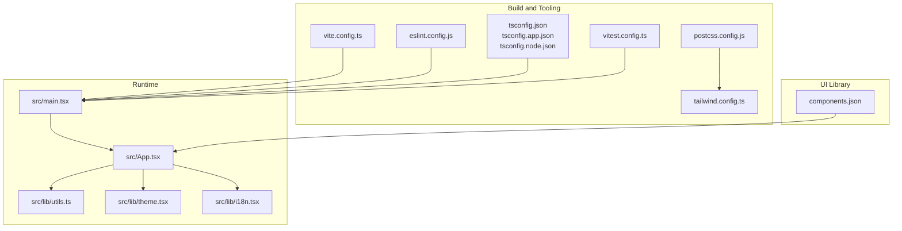
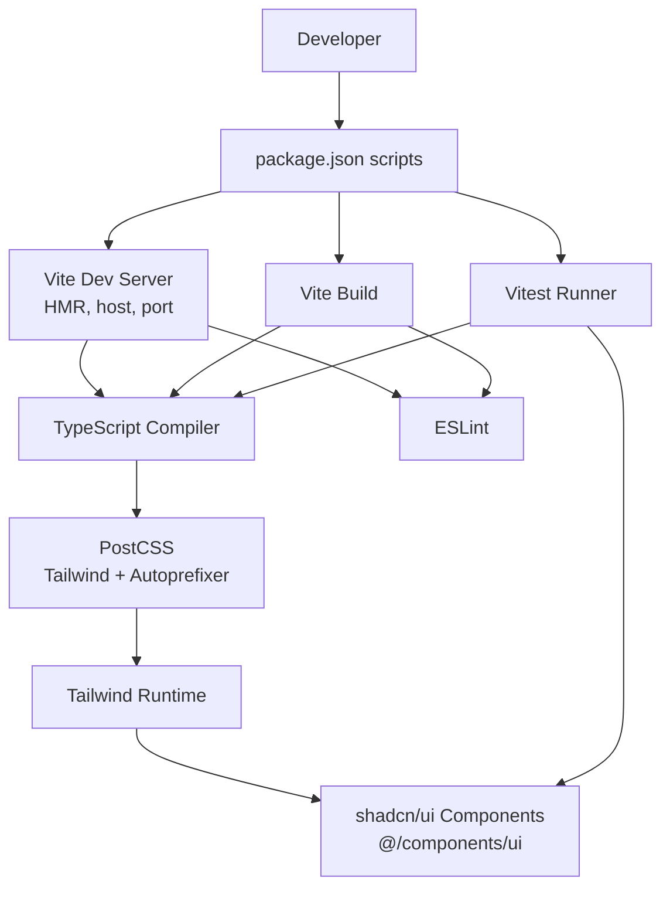
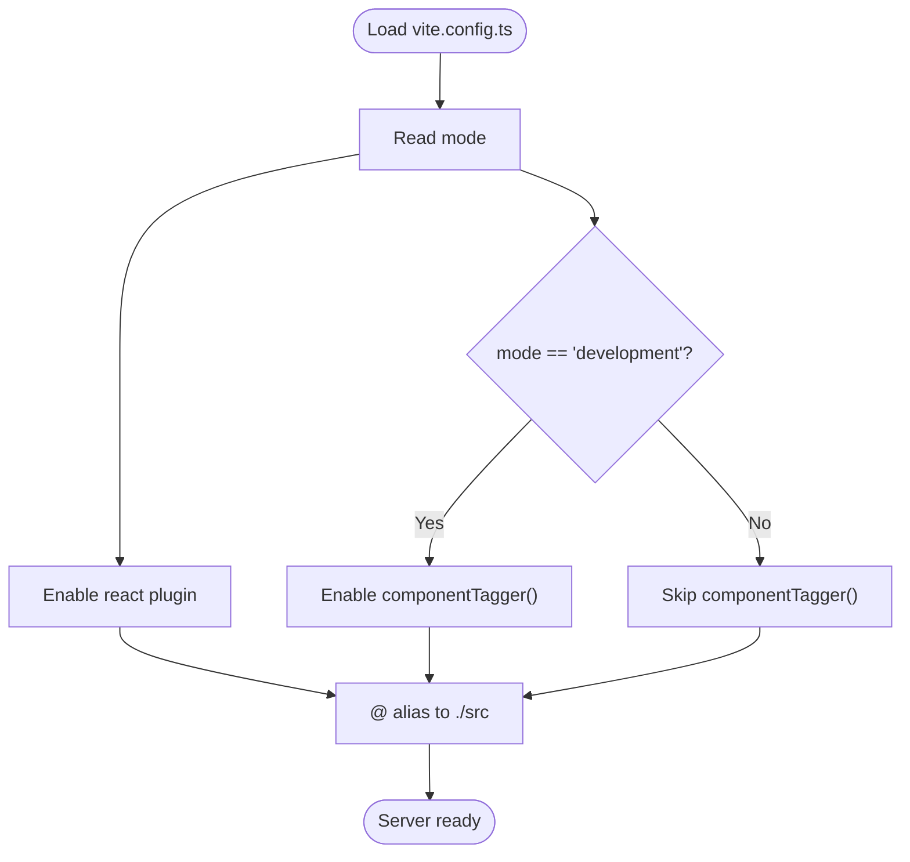
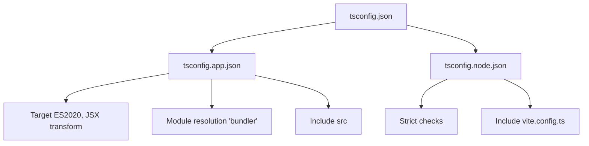
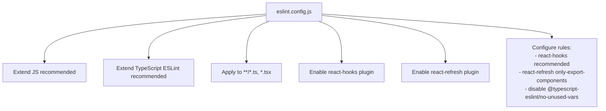
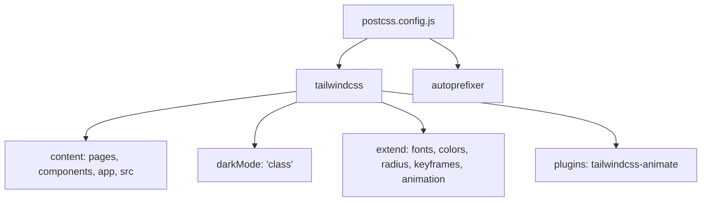
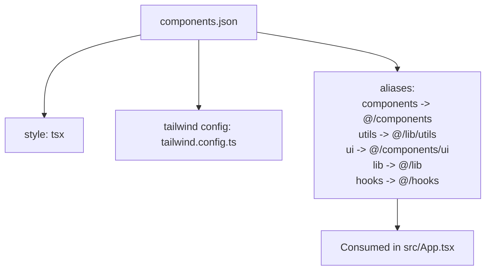
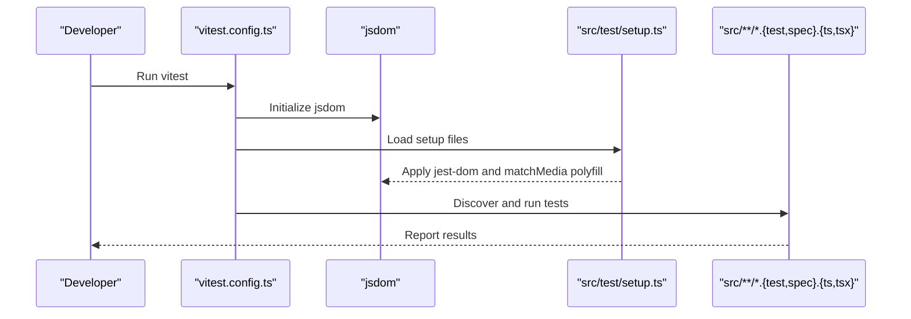
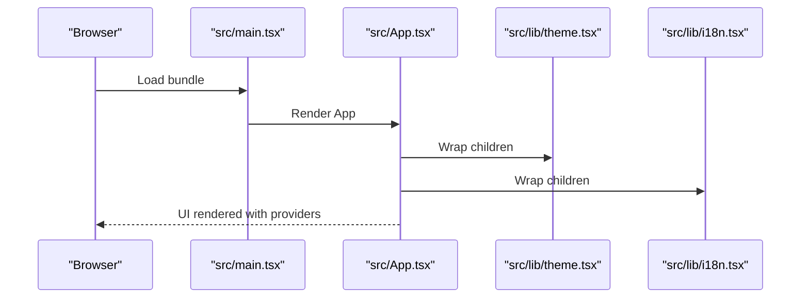
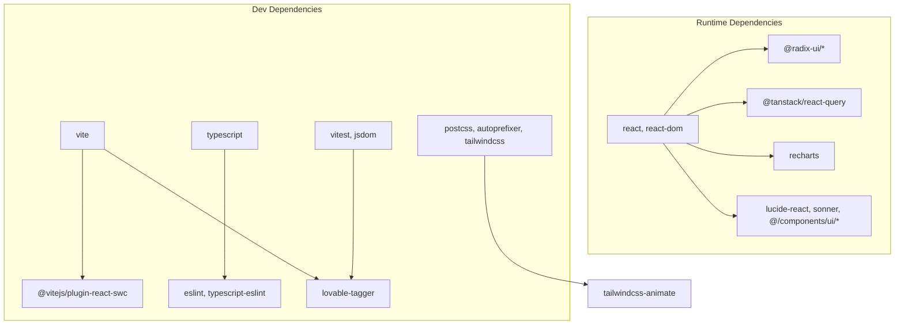

# Development Tools and Configuration

<cite>
**Referenced Files in This Document**
- [package.json](file://package.json)
- [vite.config.ts](file://vite.config.ts)
- [vitest.config.ts](file://vitest.config.ts)
- [eslint.config.js](file://eslint.config.js)
- [postcss.config.js](file://postcss.config.js)
- [tailwind.config.ts](file://tailwind.config.ts)
- [tsconfig.json](file://tsconfig.json)
- [tsconfig.app.json](file://tsconfig.app.json)
- [tsconfig.node.json](file://tsconfig.node.json)
- [components.json](file://components.json)
- [src/main.tsx](file://src/main.tsx)
- [src/App.tsx](file://src/App.tsx)
- [src/lib/utils.ts](file://src/lib/utils.ts)
- [src/lib/theme.tsx](file://src/lib/theme.tsx)
- [src/lib/i18n.tsx](file://src/lib/i18n.tsx)
- [src/test/setup.ts](file://src/test/setup.ts)
- [src/vite-env.d.ts](file://src/vite-env.d.ts)
</cite>

## Table of Contents
1. [Introduction](#introduction)
2. [Project Structure](#project-structure)
3. [Core Components](#core-components)
4. [Architecture Overview](#architecture-overview)
5. [Detailed Component Analysis](#detailed-component-analysis)
6. [Dependency Analysis](#dependency-analysis)
7. [Performance Considerations](#performance-considerations)
8. [Troubleshooting Guide](#troubleshooting-guide)
9. [Conclusion](#conclusion)
10. [Appendices](#appendices)

## Introduction
This document explains the development tools and configuration used in the project, focusing on the Vite build setup, TypeScript compilation, ESLint rules, PostCSS/Tailwind processing, shadcn/ui component library integration, Vitest testing, and development workflow optimization. It also covers environment variables, build optimization strategies, deployment preparation, debugging tools, performance profiling, and troubleshooting guidance.

## Project Structure
The project follows a conventional React + TypeScript + Vite monorepo-like configuration split across multiple tsconfig files, a Vite config, ESLint flat config, PostCSS/Tailwind setup, and Vitest configuration. Aliasing is configured via Vite and tsconfig to simplify imports using the @ prefix.

**Diagram sources**
- [vite.config.ts](file://vite.config.ts#L1-L22)
- [tsconfig.json](file://tsconfig.json#L1-L17)
- [tsconfig.app.json](file://tsconfig.app.json#L1-L32)
- [tsconfig.node.json](file://tsconfig.node.json#L1-L23)
- [eslint.config.js](file://eslint.config.js#L1-L27)
- [postcss.config.js](file://postcss.config.js#L1-L7)
- [tailwind.config.ts](file://tailwind.config.ts#L1-L86)
- [vitest.config.ts](file://vitest.config.ts#L1-L17)
- [src/main.tsx](file://src/main.tsx#L1-L6)
- [src/App.tsx](file://src/App.tsx#L1-L45)
- [src/lib/utils.ts](file://src/lib/utils.ts#L1-L7)
- [src/lib/theme.tsx](file://src/lib/theme.tsx#L1-L36)
- [src/lib/i18n.tsx](file://src/lib/i18n.tsx#L1-L173)
- [components.json](file://components.json#L1-L21)

**Section sources**
- [package.json](file://package.json#L1-L90)
- [vite.config.ts](file://vite.config.ts#L1-L22)
- [tsconfig.json](file://tsconfig.json#L1-L17)
- [tsconfig.app.json](file://tsconfig.app.json#L1-L32)
- [tsconfig.node.json](file://tsconfig.node.json#L1-L23)
- [eslint.config.js](file://eslint.config.js#L1-L27)
- [postcss.config.js](file://postcss.config.js#L1-L7)
- [tailwind.config.ts](file://tailwind.config.ts#L1-L86)
- [vitest.config.ts](file://vitest.config.ts#L1-L17)
- [components.json](file://components.json#L1-L21)
- [src/main.tsx](file://src/main.tsx#L1-L6)
- [src/App.tsx](file://src/App.tsx#L1-L45)
- [src/lib/utils.ts](file://src/lib/utils.ts#L1-L7)
- [src/lib/theme.tsx](file://src/lib/theme.tsx#L1-L36)
- [src/lib/i18n.tsx](file://src/lib/i18n.tsx#L1-L173)

## Core Components
- Vite build and dev server configuration with React SWC plugin, HMR, host binding, and aliasing.
- TypeScript configuration split into app and node contexts with bundler module resolution and JSX transform.
- ESLint flat config extending TypeScript and recommended rules with React Hooks and React Refresh plugins.
- PostCSS pipeline with Tailwind and Autoprefixer.
- Tailwind configuration with dark mode, content paths, theme extensions, and animations.
- Vitest configuration for DOM testing with jsdom, global setup, and aliases.
- shadcn/ui integration via components.json specifying style, TSX, Tailwind settings, and aliases.

**Section sources**
- [vite.config.ts](file://vite.config.ts#L1-L22)
- [tsconfig.app.json](file://tsconfig.app.json#L1-L32)
- [tsconfig.node.json](file://tsconfig.node.json#L1-L23)
- [eslint.config.js](file://eslint.config.js#L1-L27)
- [postcss.config.js](file://postcss.config.js#L1-L7)
- [tailwind.config.ts](file://tailwind.config.ts#L1-L86)
- [vitest.config.ts](file://vitest.config.ts#L1-L17)
- [components.json](file://components.json#L1-L21)

## Architecture Overview
The development stack integrates Vite for fast builds and HMR, TypeScript for type safety, ESLint for code quality, Tailwind CSS for styling, and Vitest for unit and component tests. shadcn/ui components are consumed through local aliases configured in components.json and tsconfig.

**Diagram sources**
- [package.json](file://package.json#L6-L14)
- [vite.config.ts](file://vite.config.ts#L7-L21)
- [tsconfig.app.json](file://tsconfig.app.json#L1-L32)
- [eslint.config.js](file://eslint.config.js#L1-L27)
- [postcss.config.js](file://postcss.config.js#L1-L7)
- [tailwind.config.ts](file://tailwind.config.ts#L1-L86)
- [vitest.config.ts](file://vitest.config.ts#L1-L17)
- [components.json](file://components.json#L1-L21)

## Detailed Component Analysis

### Vite Configuration
Key aspects:
- Dev server binds to all interfaces and disables the HMR overlay for cleaner logs.
- React SWC plugin is enabled for fast JSX transforms.
- Conditional plugin loading using a component tagger during development.
- Path alias @ resolves to src for ergonomic imports.

**Diagram sources**
- [vite.config.ts](file://vite.config.ts#L7-L21)

**Section sources**
- [vite.config.ts](file://vite.config.ts#L1-L22)

### TypeScript Compilation Settings
- Root tsconfig delegates to app and node configs and sets baseUrl and @ alias.
- App tsconfig targets ES2020, uses bundler module resolution, JSX transform, and includes src.
- Node tsconfig targets ES2023, restricts included files to Vite config, and enables strictness.

**Diagram sources**
- [tsconfig.json](file://tsconfig.json#L1-L17)
- [tsconfig.app.json](file://tsconfig.app.json#L1-L32)
- [tsconfig.node.json](file://tsconfig.node.json#L1-L23)

**Section sources**
- [tsconfig.json](file://tsconfig.json#L1-L17)
- [tsconfig.app.json](file://tsconfig.app.json#L1-L32)
- [tsconfig.node.json](file://tsconfig.node.json#L1-L23)

### ESLint Rules and Configuration
- Flat config extends recommended JS and TypeScript ESLint configurations.
- Enables React Hooks and React Refresh plugins.
- Ignores dist folder and applies rules to TS/TSX files.
- Adjusts unused variable rules and refresh enforcement.

**Diagram sources**
- [eslint.config.js](file://eslint.config.js#L7-L26)

**Section sources**
- [eslint.config.js](file://eslint.config.js#L1-L27)

### PostCSS and Tailwind Processing
- PostCSS pipeline activates Tailwind and Autoprefixer.
- Tailwind scans pages/components/app/src for class usage and supports dark mode via class strategy.
- Theme extends typography, spacing, colors, border radius, keyframes, and animations.
- Uses tailwindcss-animate plugin.

**Diagram sources**
- [postcss.config.js](file://postcss.config.js#L1-L7)
- [tailwind.config.ts](file://tailwind.config.ts#L1-L86)

**Section sources**
- [postcss.config.js](file://postcss.config.js#L1-L7)
- [tailwind.config.ts](file://tailwind.config.ts#L1-L86)

### shadcn/ui Integration
- Style defaults to TSX with Tailwind CSS variables enabled.
- Aliases map components, utils, ui, lib, and hooks to @ paths.
- Tailwind config aligns with the UI library’s base color and CSS variables.

**Diagram sources**
- [components.json](file://components.json#L1-L21)
- [src/App.tsx](file://src/App.tsx#L1-L45)

**Section sources**
- [components.json](file://components.json#L1-L21)
- [src/App.tsx](file://src/App.tsx#L1-L45)

### Testing Setup with Vitest
- Environment configured to jsdom for DOM APIs.
- Global setup file adds jest-dom matchers and a minimal matchMedia polyfill.
- Includes tests under src with test/spec suffix and TS/TSX extensions.
- Aliases mapped to @ for consistent imports.

**Diagram sources**
- [vitest.config.ts](file://vitest.config.ts#L5-L16)
- [src/test/setup.ts](file://src/test/setup.ts#L1-L16)

**Section sources**
- [vitest.config.ts](file://vitest.config.ts#L1-L17)
- [src/test/setup.ts](file://src/test/setup.ts#L1-L16)

### Application Bootstrap and Providers
- Entry point renders the App component and injects global styles.
- App composes providers for theming, internationalization, tooltips, toasts, React Query, and routing.

**Diagram sources**
- [src/main.tsx](file://src/main.tsx#L1-L6)
- [src/App.tsx](file://src/App.tsx#L1-L45)
- [src/lib/theme.tsx](file://src/lib/theme.tsx#L1-L36)
- [src/lib/i18n.tsx](file://src/lib/i18n.tsx#L1-L173)

**Section sources**
- [src/main.tsx](file://src/main.tsx#L1-L6)
- [src/App.tsx](file://src/App.tsx#L1-L45)
- [src/lib/theme.tsx](file://src/lib/theme.tsx#L1-L36)
- [src/lib/i18n.tsx](file://src/lib/i18n.tsx#L1-L173)

## Dependency Analysis
- Build-time dependencies include React, Radix UI primitives, TanStack Query, Recharts, shadcn/ui toast/toaster, and Lucide icons.
- Dev-time dependencies include Vite, React SWC plugin, TypeScript, ESLint, PostCSS, Tailwind, Vitest, jsdom, and lovable-tagger for component tagging.

**Diagram sources**
- [package.json](file://package.json#L15-L88)

**Section sources**
- [package.json](file://package.json#L1-L90)

## Performance Considerations
- Prefer React SWC for faster JSX transforms in development.
- Keep TypeScript strictness balanced; current app config relaxes certain checks for DX.
- Use Tailwind’s JIT scanning only for relevant paths to reduce rebuild time.
- Disable HMR overlay in development to reduce browser overhead.
- Leverage component tagging selectively to avoid unnecessary plugin overhead in production builds.
- Minimize global CSS and rely on scoped component styles to reduce paint churn.

[No sources needed since this section provides general guidance]

## Troubleshooting Guide
Common issues and resolutions:
- HMR overlay clutter: The dev server disables the HMR overlay to reduce noise.
- Missing matchMedia in tests: The test setup provides a minimal polyfill to satisfy DOM APIs.
- Aliasing issues: Ensure @ alias is configured consistently in Vite and tsconfig.
- Tailwind not generating styles: Verify content globs in Tailwind config and that CSS is imported in the entry file.
- ESLint errors in TSX: Confirm ESLint flat config applies to TS/TSX files and plugins are installed.
- Vitest environment problems: Ensure jsdom is selected and setup files are loaded.

**Section sources**
- [vite.config.ts](file://vite.config.ts#L8-L14)
- [src/test/setup.ts](file://src/test/setup.ts#L1-L16)
- [tsconfig.json](file://tsconfig.json#L5-L9)
- [tailwind.config.ts](file://tailwind.config.ts#L5-L5)
- [eslint.config.js](file://eslint.config.js#L10-L11)
- [vitest.config.ts](file://vitest.config.ts#L8-L10)

## Conclusion
The project leverages a modern, efficient toolchain: Vite for rapid development and builds, TypeScript for safety, ESLint for quality, Tailwind for styling, and Vitest for testing. shadcn/ui integration is streamlined via components.json and aliases. Following the outlined configuration and best practices ensures a smooth development experience, optimized builds, and reliable deployments.

[No sources needed since this section summarizes without analyzing specific files]

## Appendices

### Environment Variables
- No explicit environment variable configuration is present in the checked files. If environment-specific variables are required, define them in a .env file and load them via Vite’s built-in environment loading mechanism.

[No sources needed since this section provides general guidance]

### Build Optimization Strategies
- Use Vite’s built-in code splitting and dynamic imports.
- Enable tree-shaking by avoiding side-effectful global imports.
- Keep Tailwind scanning scoped to actual source paths.
- Consider enabling minification and compression in production builds.

[No sources needed since this section provides general guidance]

### Deployment Preparation
- Use the build script to generate optimized assets.
- Preview locally to validate the production bundle.
- Ensure static assets and robots.txt are served correctly.

**Section sources**
- [package.json](file://package.json#L8-L11)

### Debugging Tools and Profiling
- Use Vite’s dev server logs and disable HMR overlay for clearer feedback.
- Inspect Tailwind-generated CSS in the browser to verify class usage.
- Profile React components using React DevTools profiler.
- Use Vitest’s watch mode for iterative test-driven development.

[No sources needed since this section provides general guidance]

### Examples: Adding New Tools and Customizing Processes
- Adding a new PostCSS plugin: Extend the PostCSS config and ensure Tailwind compatibility.
- Introducing a new ESLint plugin: Add the plugin to devDependencies and configure it in the ESLint flat config.
- Extending Vite plugins: Add plugins to the plugins array in the Vite config; conditionally enable them per mode.
- Customizing TypeScript paths: Update tsconfig and Vite aliases to reflect new paths.

[No sources needed since this section provides general guidance]