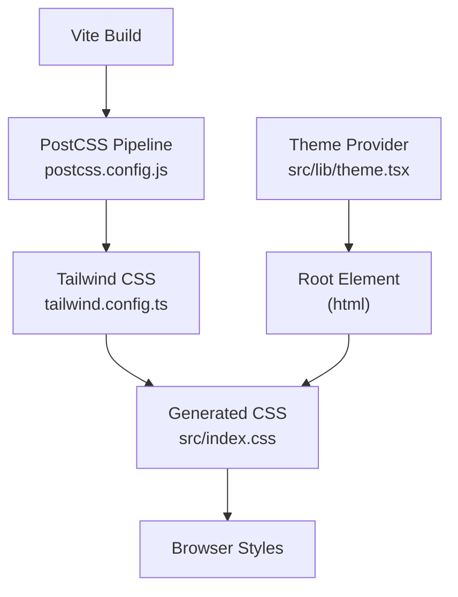
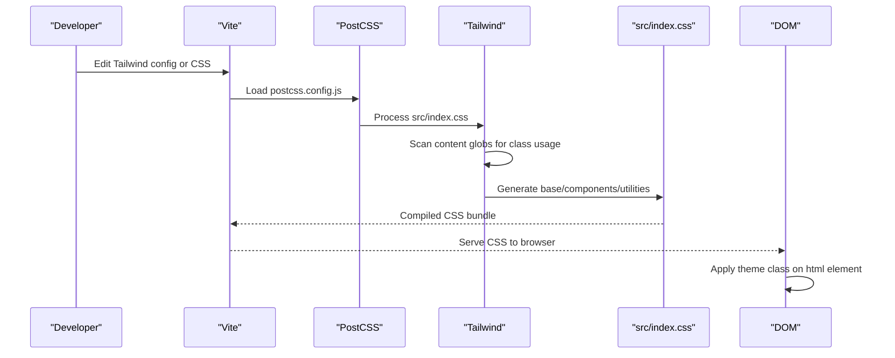
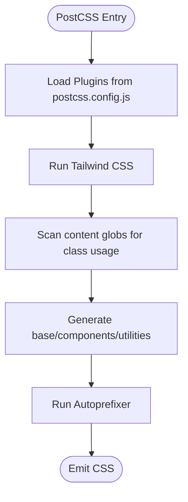
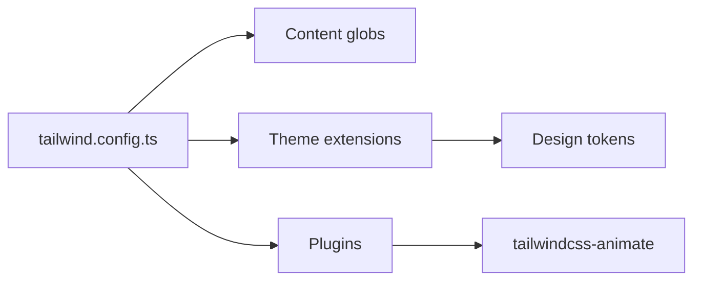
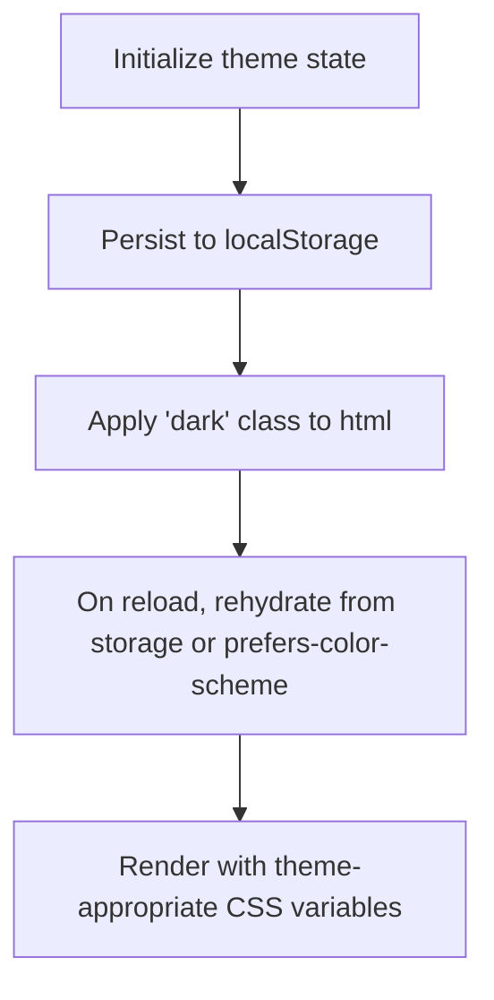
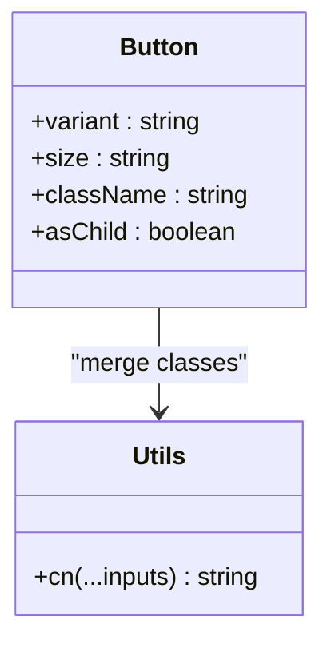
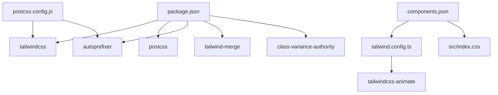

# Styling and PostCSS Configuration

<cite>
**Referenced Files in This Document**
- [postcss.config.js](file://postcss.config.js)
- [tailwind.config.ts](file://tailwind.config.ts)
- [package.json](file://package.json)
- [src/index.css](file://src/index.css)
- [src/App.css](file://src/App.css)
- [vite.config.ts](file://vite.config.ts)
- [src/lib/theme.tsx](file://src/lib/theme.tsx)
- [components.json](file://components.json)
- [src/lib/utils.ts](file://src/lib/utils.ts)
- [src/components/ui/button.tsx](file://src/components/ui/button.tsx)
- [src/components/ui/card.tsx](file://src/components/ui/card.tsx)
- [src/components/ui/dialog.tsx](file://src/components/ui/dialog.tsx)
</cite>

## Table of Contents
1. [Introduction](#introduction)
2. [Project Structure](#project-structure)
3. [Core Components](#core-components)
4. [Architecture Overview](#architecture-overview)
5. [Detailed Component Analysis](#detailed-component-analysis)
6. [Dependency Analysis](#dependency-analysis)
7. [Performance Considerations](#performance-considerations)
8. [Troubleshooting Guide](#troubleshooting-guide)
9. [Conclusion](#conclusion)
10. [Appendices](#appendices)

## Introduction
This document explains the styling architecture and PostCSS pipeline used in the project. It covers how Tailwind CSS integrates with PostCSS, how design tokens and themes are managed, and how component-specific styles are authored. It also provides practical guidance for customizing the build process, adding new PostCSS plugins, optimizing CSS output, and troubleshooting styling conflicts.

## Project Structure
The styling stack centers around Tailwind CSS and PostCSS, with Vite orchestrating the build. Key files:
- PostCSS configuration defines the plugin chain.
- Tailwind configuration defines design tokens, content scanning, and plugins.
- Global CSS layers define base styles, utilities, and animations.
- Theme provider toggles dark mode via a class on the root element.
- Component libraries use Tailwind classes and a shared utility function for merging classes.

**Diagram sources**
- [postcss.config.js](file://postcss.config.js#L1-L7)
- [tailwind.config.ts](file://tailwind.config.ts#L1-L86)
- [src/index.css](file://src/index.css#L1-L146)
- [src/lib/theme.tsx](file://src/lib/theme.tsx#L1-L36)

**Section sources**
- [postcss.config.js](file://postcss.config.js#L1-L7)
- [tailwind.config.ts](file://tailwind.config.ts#L1-L86)
- [src/index.css](file://src/index.css#L1-L146)
- [src/lib/theme.tsx](file://src/lib/theme.tsx#L1-L36)

## Core Components
- PostCSS pipeline: Tailwind CSS and Autoprefixer are configured as PostCSS plugins.
- Tailwind configuration: Defines content globs, design tokens (colors, typography, spacing), dark mode strategy, and additional plugins.
- Global CSS: Uses Tailwind layers to inject base styles, utilities, and animations; defines CSS variables for light/dark themes.
- Theme provider: Manages theme persistence and applies a class to the root element to enable dark mode.
- Utilities: A centralized class merging utility composes Tailwind classes safely.

**Section sources**
- [postcss.config.js](file://postcss.config.js#L1-L7)
- [tailwind.config.ts](file://tailwind.config.ts#L1-L86)
- [src/index.css](file://src/index.css#L1-L146)
- [src/lib/theme.tsx](file://src/lib/theme.tsx#L1-L36)
- [src/lib/utils.ts](file://src/lib/utils.ts#L1-L7)

## Architecture Overview
The styling pipeline transforms source CSS and component classes into optimized CSS delivered to the browser.

**Diagram sources**
- [postcss.config.js](file://postcss.config.js#L1-L7)
- [tailwind.config.ts](file://tailwind.config.ts#L1-L86)
- [src/index.css](file://src/index.css#L1-L146)
- [src/lib/theme.tsx](file://src/lib/theme.tsx#L1-L36)

## Detailed Component Analysis

### PostCSS Pipeline and Plugin Chain
- Plugins: Tailwind CSS and Autoprefixer are enabled in the PostCSS configuration.
- Purpose:
  - Tailwind CSS generates utility classes from the design system and scans content for class usage.
  - Autoprefixer adds vendor prefixes based on supported browsers.

**Diagram sources**
- [postcss.config.js](file://postcss.config.js#L1-L7)
- [tailwind.config.ts](file://tailwind.config.ts#L1-L86)

**Section sources**
- [postcss.config.js](file://postcss.config.js#L1-L7)
- [tailwind.config.ts](file://tailwind.config.ts#L1-L86)

### Tailwind CSS Integration and Design System
- Content scanning: Tailwind scans pages, components, app, and src directories for class usage.
- Dark mode: Uses a class strategy on the root element.
- Theme extension: Adds container, typography, spacing, colors, border radius, keyframes, and animations.
- Additional plugins: Includes a Tailwind animation plugin.

**Diagram sources**
- [tailwind.config.ts](file://tailwind.config.ts#L1-L86)

**Section sources**
- [tailwind.config.ts](file://tailwind.config.ts#L1-L86)

### Global Theme Management and CSS Variables
- CSS variables: Define light and dark theme tokens under base layers.
- Root class toggling: The theme provider toggles a class on the root element to switch modes.
- Layered styles: Base layer sets global resets and fonts; utilities layer adds reusable helpers.

**Diagram sources**
- [src/lib/theme.tsx](file://src/lib/theme.tsx#L1-L36)
- [src/index.css](file://src/index.css#L5-L90)

**Section sources**
- [src/lib/theme.tsx](file://src/lib/theme.tsx#L1-L36)
- [src/index.css](file://src/index.css#L5-L90)

### Component-Specific Styles and Utility Composition
- Variants and sizes: Components compose Tailwind classes using a variant system and a utility function to merge classes.
- Shared utilities: A centralized function merges and deduplicates Tailwind classes.
- UI primitives: Components apply base, variant, and size classes consistently.

**Diagram sources**
- [src/components/ui/button.tsx](file://src/components/ui/button.tsx#L1-L48)
- [src/lib/utils.ts](file://src/lib/utils.ts#L1-L7)

**Section sources**
- [src/components/ui/button.tsx](file://src/components/ui/button.tsx#L1-L48)
- [src/lib/utils.ts](file://src/lib/utils.ts#L1-L7)

### Example UI Components and Tailwind Usage
- Card: Demonstrates applying base, variant, and spacing classes.
- Dialog: Uses Tailwind utilities for layout, transitions, and responsive behavior.

**Section sources**
- [src/components/ui/card.tsx](file://src/components/ui/card.tsx#L1-L44)
- [src/components/ui/dialog.tsx](file://src/components/ui/dialog.tsx#L1-L96)

## Dependency Analysis
- PostCSS plugins: Tailwind CSS and Autoprefixer are declared in the PostCSS configuration.
- Tailwind dependencies: Installed as dev dependencies; Tailwind CSS and related packages are present.
- UI library configuration: The UI library configuration points to the Tailwind config and CSS file.

**Diagram sources**
- [package.json](file://package.json#L66-L87)
- [postcss.config.js](file://postcss.config.js#L1-L7)
- [tailwind.config.ts](file://tailwind.config.ts#L84-L84)
- [components.json](file://components.json#L6-L12)

**Section sources**
- [package.json](file://package.json#L66-L87)
- [postcss.config.js](file://postcss.config.js#L1-L7)
- [tailwind.config.ts](file://tailwind.config.ts#L84-L84)
- [components.json](file://components.json#L6-L12)

## Performance Considerations
- Purge and tree-shake: Tailwind’s content scanning ensures unused classes are removed during build. Keep content globs accurate to avoid accidental purging.
- CSS variables: Using CSS variables for theme tokens reduces duplication and improves maintainability.
- Autoprefixer: Ensures compatibility without bloating CSS with manual prefixes.
- Class merging: Using the utility function prevents redundant classes and keeps selectors concise.
- Build mode: Development vs production builds can alter output; confirm build scripts align with expectations.

[No sources needed since this section provides general guidance]

## Troubleshooting Guide
- Classes not applying:
  - Verify Tailwind layers are included in the global CSS.
  - Confirm content globs include the files where classes are used.
- Dark mode not switching:
  - Ensure the theme provider toggles the root class and persists the preference.
- Conflicting styles:
  - Prefer Tailwind utilities and avoid overriding base styles inline.
  - Use the utility function to merge classes and prevent duplicates.
- Build errors:
  - Confirm PostCSS plugins are installed and configured.
  - Validate Tailwind configuration and component library configuration.

**Section sources**
- [src/index.css](file://src/index.css#L1-L3)
- [tailwind.config.ts](file://tailwind.config.ts#L4-L5)
- [src/lib/theme.tsx](file://src/lib/theme.tsx#L19-L22)
- [postcss.config.js](file://postcss.config.js#L1-L7)
- [components.json](file://components.json#L6-L12)

## Conclusion
The project employs a clean, scalable styling architecture built on Tailwind CSS and PostCSS. The design system is centralized in Tailwind configuration, theme management is handled by a lightweight provider, and component styles are composed with a utility-first approach. Following the guidance here will help maintain consistency, optimize output, and troubleshoot styling issues effectively.

## Appendices

### Customizing the Build Process
- Add a new PostCSS plugin:
  - Install the plugin as a dev dependency.
  - Register it in the PostCSS configuration.
- Adjust Tailwind behavior:
  - Modify content globs to include new directories.
  - Extend theme tokens or add new utilities.
- Optimize CSS output:
  - Keep content globs precise to avoid unnecessary bloat.
  - Use the utility function to keep class lists minimal.

**Section sources**
- [postcss.config.js](file://postcss.config.js#L1-L7)
- [tailwind.config.ts](file://tailwind.config.ts#L4-L5)
- [src/lib/utils.ts](file://src/lib/utils.ts#L1-L7)

### Maintaining Consistent Design Tokens
- Centralize tokens in the Tailwind theme extension.
- Use CSS variables for theme-aware values.
- Keep naming consistent across components and utilities.

**Section sources**
- [tailwind.config.ts](file://tailwind.config.ts#L7-L82)
- [src/index.css](file://src/index.css#L5-L90)

### Responsive Design Patterns
- Use Tailwind’s responsive prefixes in component classes.
- Leverage container and spacing utilities for consistent layouts.
- Combine utility classes with component variants for scalable patterns.

**Section sources**
- [src/components/ui/button.tsx](file://src/components/ui/button.tsx#L10-L24)
- [src/components/ui/card.tsx](file://src/components/ui/card.tsx#L1-L44)