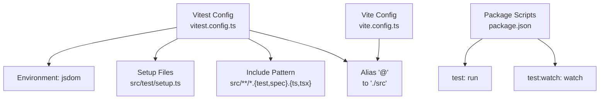
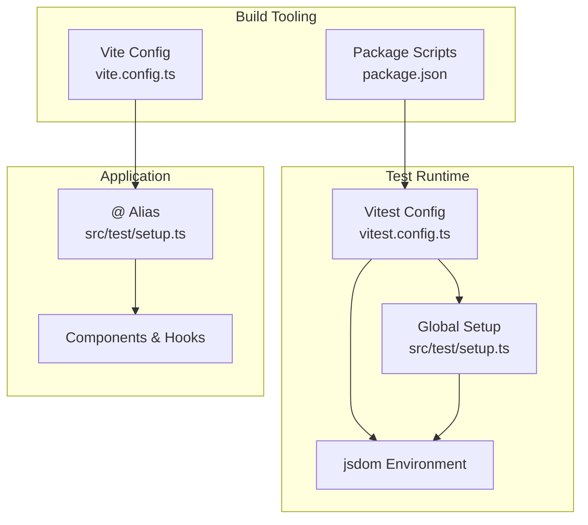
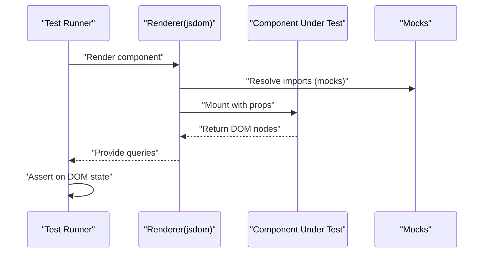
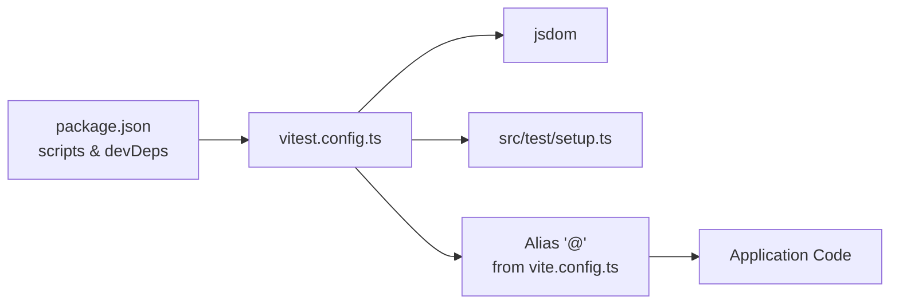

# Testing Setup and Vitest Configuration

<cite>
**Referenced Files in This Document**
- [vitest.config.ts](file://vitest.config.ts)
- [setup.ts](file://src/test/setup.ts)
- [example.test.ts](file://src/test/example.test.ts)
- [package.json](file://package.json)
- [vite.config.ts](file://vite.config.ts)
- [button.tsx](file://src/components/ui/button.tsx)
- [Navbar.tsx](file://src/components/Navbar.tsx)
- [use-mobile.tsx](file://src/hooks/use-mobile.tsx)
- [use-toast.ts](file://src/hooks/use-toast.ts)
</cite>

## Table of Contents
1. [Introduction](#introduction)
2. [Project Structure](#project-structure)
3. [Core Components](#core-components)
4. [Architecture Overview](#architecture-overview)
5. [Detailed Component Analysis](#detailed-component-analysis)
6. [Dependency Analysis](#dependency-analysis)
7. [Performance Considerations](#performance-considerations)
8. [Troubleshooting Guide](#troubleshooting-guide)
9. [Conclusion](#conclusion)
10. [Appendices](#appendices)

## Introduction
This document explains the testing framework setup using Vitest in this Vite + React + TypeScript project. It covers configuration, test environment initialization, mocking strategies, unit and component testing patterns, integration workflows, coverage configuration, performance testing, snapshot testing, CI readiness, test organization, debugging, and reliability practices. The goal is to help contributors write reliable, maintainable tests that scale with the application.

## Project Structure
The testing-related parts of the repository are organized as follows:
- Vitest configuration defines the test environment, plugin integration, include patterns, and aliases.
- A global setup file initializes DOM helpers and polyfills for browser APIs commonly used in components.
- Example tests demonstrate minimal passing tests.
- Package scripts expose commands to run tests in watch and run modes.
- Vite configuration provides the same alias and React plugin used by Vitest.

**Diagram sources**
- [vitest.config.ts](file://vitest.config.ts#L5-L16)
- [vite.config.ts](file://vite.config.ts#L16-L21)
- [package.json](file://package.json#L6-L14)

**Section sources**
- [vitest.config.ts](file://vitest.config.ts#L1-L17)
- [setup.ts](file://src/test/setup.ts#L1-L16)
- [example.test.ts](file://src/test/example.test.ts#L1-L8)
- [package.json](file://package.json#L6-L14)
- [vite.config.ts](file://vite.config.ts#L1-L22)

## Core Components
- Vitest configuration
  - Sets the test environment to jsdom for DOM APIs.
  - Enables global test APIs.
  - Loads a setup file for global polyfills and helpers.
  - Includes test files via glob pattern.
  - Resolves module aliases consistently with Vite.
- Global setup
  - Adds jest-dom matchers for assertions.
  - Provides a minimal matchMedia polyfill for responsive logic.
- Example test
  - Demonstrates a basic describe/it/expect test structure.

Practical implications:
- All tests run in a DOM-like environment, enabling component rendering and DOM queries.
- Aliasing ensures imports remain consistent between app and test code.
- The setup file centralizes environment preparation for all tests.

**Section sources**
- [vitest.config.ts](file://vitest.config.ts#L5-L16)
- [setup.ts](file://src/test/setup.ts#L1-L16)
- [example.test.ts](file://src/test/example.test.ts#L1-L8)

## Architecture Overview
The testing architecture integrates Vitest with Vite and React SWC, aligning aliases and plugins for a seamless developer experience. Tests are isolated per file and executed in jsdom with global setup applied.

**Diagram sources**
- [vite.config.ts](file://vite.config.ts#L16-L21)
- [vitest.config.ts](file://vitest.config.ts#L5-L16)
- [setup.ts](file://src/test/setup.ts#L1-L16)
- [package.json](file://package.json#L6-L14)

## Detailed Component Analysis

### Unit Testing Patterns
Recommended patterns for unit tests:
- Use describe blocks to group related tests.
- Use it for individual test cases with clear expectations.
- Prefer expect assertions aligned with @testing-library/jest-dom for DOM checks.
- Keep tests small, deterministic, and focused on a single behavior.

Example reference:
- See the minimal example test structure for guidance on organizing tests.

**Section sources**
- [example.test.ts](file://src/test/example.test.ts#L1-L8)

### Component Testing Approaches
For component tests:
- Render components under test using a testing renderer compatible with jsdom.
- Query rendered elements using testing-library queries.
- Mock external dependencies (e.g., hooks, assets, router) to isolate component behavior.
- Assert on visible UI changes and accessibility attributes.

Reference components:
- Button component demonstrates variants and slots suitable for UI testing.
- Navbar integrates routing, i18n, and theme toggles—good candidates for component tests.

**Diagram sources**
- [button.tsx](file://src/components/ui/button.tsx#L39-L45)
- [Navbar.tsx](file://src/components/Navbar.tsx#L13-L131)

**Section sources**
- [button.tsx](file://src/components/ui/button.tsx#L1-L48)
- [Navbar.tsx](file://src/components/Navbar.tsx#L1-L131)

### Integration Testing Workflows
Integration tests validate interactions between components and external systems:
- Simulate user interactions (clicks, input changes).
- Verify side effects (router navigation, theme changes, i18n updates).
- Use setup files to mock global browser APIs and third-party integrations.

Mocking strategies:
- Use Vitest mocks for functions and modules.
- Replace assets and images with stubs.
- Mock window.matchMedia for responsive behavior.

**Section sources**
- [setup.ts](file://src/test/setup.ts#L3-L15)

### Test Utilities and Helpers
- Global setup file:
  - Adds jest-dom matchers.
  - Polyfills matchMedia for responsive logic.
- Consider adding a render utility that wraps rendering with providers (e.g., theme, i18n) to avoid repeating provider setup in every test.

**Section sources**
- [setup.ts](file://src/test/setup.ts#L1-L16)

### Coverage Configuration
Coverage is not configured in the current setup. To enable coverage:
- Add a coverage option in the Vitest config.
- Configure include/exclude patterns to target source files while excluding generated or test files.
- Integrate with CI to enforce coverage thresholds.

Note: No coverage configuration exists yet in the repository.

**Section sources**
- [vitest.config.ts](file://vitest.config.ts#L7-L12)

### Snapshot Testing
Snapshot testing is not currently configured. To add snapshots:
- Use testing-library’s toMatchSnapshot or similar assertion patterns.
- Ensure deterministic output by normalizing dates, IDs, and randomized values.
- Keep snapshots updated alongside meaningful UI changes.

[No sources needed since this section provides general guidance]

### Performance Testing
Performance testing can be introduced alongside unit tests:
- Measure rendering performance using user timing APIs in jsdom-compatible environments.
- Benchmark expensive computations in pure functions.
- Track re-render counts using testing-library utilities where applicable.

[No sources needed since this section provides general guidance]

### Continuous Integration Setup
- Use the existing scripts to run tests in CI:
  - Run tests once: test
  - Watch mode for local development: test:watch
- Add steps to install dependencies and run tests in your CI pipeline.

**Section sources**
- [package.json](file://package.json#L6-L14)

### Test Organization
- Place tests adjacent to source files with .test.ts or .test.tsx suffixes.
- Group tests by feature folders if the project grows larger.
- Use descriptive filenames and nested describe blocks to improve readability.

[No sources needed since this section provides general guidance]

### Debugging Failed Tests
Common debugging tips:
- Run tests in watch mode to iterate quickly.
- Use console.log sparingly; prefer assertion messages to describe failures.
- Isolate failing tests and temporarily disable others to narrow scope.
- Verify global setup is not masking errors (e.g., matchMedia polyfill).

**Section sources**
- [package.json](file://package.json#L13-L13)
- [setup.ts](file://src/test/setup.ts#L3-L15)

### Maintaining Test Reliability
- Keep tests deterministic by avoiding real timers and network requests.
- Mock asynchronous operations and side effects.
- Regularly review and refactor flaky tests.
- Align test aliases and imports with the application to prevent path mismatches.

**Section sources**
- [vitest.config.ts](file://vitest.config.ts#L13-L16)

## Dependency Analysis
Vitest relies on jsdom for DOM APIs and integrates with React SWC via Vite. The alias configuration ensures consistent imports across tests and the application.

**Diagram sources**
- [package.json](file://package.json#L6-L14)
- [vitest.config.ts](file://vitest.config.ts#L5-L16)
- [vite.config.ts](file://vite.config.ts#L16-L21)
- [setup.ts](file://src/test/setup.ts#L1-L16)

**Section sources**
- [package.json](file://package.json#L66-L87)
- [vitest.config.ts](file://vitest.config.ts#L5-L16)
- [vite.config.ts](file://vite.config.ts#L16-L21)

## Performance Considerations
- Prefer unit tests for pure logic and component tests for UI behavior.
- Use lightweight mocks to avoid heavy setup overhead.
- Limit DOM queries to essential assertions to reduce test runtime.
- Run tests in parallel where safe; avoid shared mutable state between tests.

[No sources needed since this section provides general guidance]

## Troubleshooting Guide
- Tests fail due to missing DOM APIs:
  - Ensure the setup file is loaded and includes jest-dom and matchMedia polyfills.
- Path resolution issues:
  - Confirm the alias for "@" matches the Vite configuration.
- Flaky tests with timers or media queries:
  - Mock matchMedia and avoid real timers; use fake timers if needed.
- CI failures:
  - Use the provided scripts to run tests and ensure dependencies are installed.

**Section sources**
- [setup.ts](file://src/test/setup.ts#L1-L16)
- [vitest.config.ts](file://vitest.config.ts#L13-L16)
- [package.json](file://package.json#L6-L14)

## Conclusion
The project’s testing foundation is established with Vitest, jsdom, and a global setup file. By following the recommended patterns—unit and component testing, integration workflows, mocking strategies, and reliability practices—you can build a robust and scalable test suite. Extend coverage and CI integration as the project evolves to maintain quality and confidence in changes.

## Appendices

### Appendix A: Vitest Configuration Reference
- Environment: jsdom
- Globals enabled
- Setup file: src/test/setup.ts
- Include pattern: src/**/*.{test,spec}.{ts,tsx}
- Alias: @ -> ./src

**Section sources**
- [vitest.config.ts](file://vitest.config.ts#L5-L16)

### Appendix B: Example Test Reference
- Minimal example demonstrating describe/it/expect structure

**Section sources**
- [example.test.ts](file://src/test/example.test.ts#L1-L8)

### Appendix C: Component Examples for Testing
- Button component: suitable for variant and slot behavior tests
- Navbar component: suitable for routing, i18n, and theme interactions

**Section sources**
- [button.tsx](file://src/components/ui/button.tsx#L1-L48)
- [Navbar.tsx](file://src/components/Navbar.tsx#L1-L131)

### Appendix D: Hook Examples for Testing
- Responsive hook: useIsMobile depends on matchMedia; mock accordingly
- Toast hook: stateful logic with timeouts; use cleanup and fake timers

**Section sources**
- [use-mobile.tsx](file://src/hooks/use-mobile.tsx#L1-L20)
- [use-toast.ts](file://src/hooks/use-toast.ts#L1-L187)