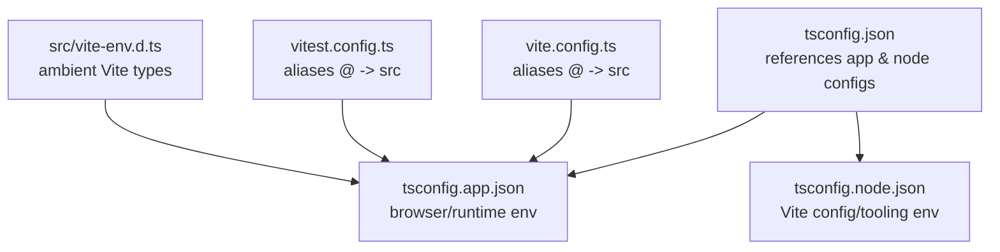
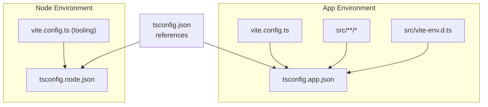
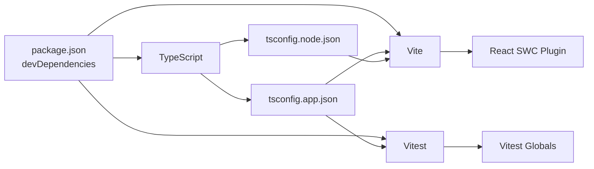

# TypeScript Configuration and Compilation

<cite>
**Referenced Files in This Document**
- [tsconfig.json](file://tsconfig.json)
- [tsconfig.app.json](file://tsconfig.app.json)
- [tsconfig.node.json](file://tsconfig.node.json)
- [vite.config.ts](file://vite.config.ts)
- [vitest.config.ts](file://vitest.config.ts)
- [package.json](file://package.json)
- [src/vite-env.d.ts](file://src/vite-env.d.ts)
- [src/App.tsx](file://src/App.tsx)
- [src/lib/utils.ts](file://src/lib/utils.ts)
- [src/test/example.test.ts](file://src/test/example.test.ts)
- [src/test/setup.ts](file://src/test/setup.ts)
- [eslint.config.js](file://eslint.config.js)
</cite>

## Table of Contents
1. [Introduction](#introduction)
2. [Project Structure](#project-structure)
3. [Core Components](#core-components)
4. [Architecture Overview](#architecture-overview)
5. [Detailed Component Analysis](#detailed-component-analysis)
6. [Dependency Analysis](#dependency-analysis)
7. [Performance Considerations](#performance-considerations)
8. [Troubleshooting Guide](#troubleshooting-guide)
9. [Conclusion](#conclusion)
10. [Appendices](#appendices)

## Introduction
This document explains the TypeScript configuration strategy across environments in this project. It covers the shared base configuration, app-specific settings, and node-specific settings. It also documents compiler options, path mapping, module resolution strategies, strictness and linting trade-offs, integration with Vite and Vitest, type definition management, ambient declarations, and build-time type checking. Guidance is included for migrating between TypeScript versions and troubleshooting common type-related issues.

## Project Structure
The project uses a multi-config TypeScript setup with a root composite configuration that references two environment-specific configs:
- Root composite config references app and node configs
- App config targets the browser/runtime environment and integrates with Vite’s bundler mode
- Node config targets Vite configuration and tooling scripts

**Diagram sources**
- [tsconfig.json](file://tsconfig.json#L1-L17)
- [tsconfig.app.json](file://tsconfig.app.json#L1-L32)
- [tsconfig.node.json](file://tsconfig.node.json#L1-L23)
- [vite.config.ts](file://vite.config.ts#L1-L22)
- [vitest.config.ts](file://vitest.config.ts#L1-L17)
- [src/vite-env.d.ts](file://src/vite-env.d.ts#L1-L2)

**Section sources**
- [tsconfig.json](file://tsconfig.json#L1-L17)
- [tsconfig.app.json](file://tsconfig.app.json#L1-L32)
- [tsconfig.node.json](file://tsconfig.node.json#L1-L23)
- [vite.config.ts](file://vite.config.ts#L1-L22)
- [vitest.config.ts](file://vitest.config.ts#L1-L17)
- [src/vite-env.d.ts](file://src/vite-env.d.ts#L1-L2)

## Core Components
- Root composite configuration
  - Declares project references to app and node configs
  - Establishes shared baseUrl and path mapping for the monorepo-like alias
  - Enables lenient compiler checks suitable for a fast DX
- App configuration
  - Targets modern ES runtime with DOM APIs
  - Uses bundler module resolution and isolated modules for Vite
  - Integrates JSX transform and Vitest globals for testing
  - Includes source folder and maintains lenient checks
- Node configuration
  - Targets Node runtime and tooling scripts
  - Enforces stricter checks and enables switch exhaustiveness
  - Includes Vite config file for tooling

Key integration points:
- Path alias @ resolves to src in both configs and Vite/Vitest configs
- Vite plugin for React SWC and JSX transform are aligned with app config
- Vitest globals are declared in app config types

**Section sources**
- [tsconfig.json](file://tsconfig.json#L1-L17)
- [tsconfig.app.json](file://tsconfig.app.json#L1-L32)
- [tsconfig.node.json](file://tsconfig.node.json#L1-L23)
- [vite.config.ts](file://vite.config.ts#L16-L20)
- [vitest.config.ts](file://vitest.config.ts#L13-L15)

## Architecture Overview
The TypeScript compilation pipeline is split by environment:
- App builds use Vite with bundler module resolution and isolated modules
- Node builds use Vite’s tooling with strict checks
- Shared path alias ensures consistent imports across environments

**Diagram sources**
- [tsconfig.json](file://tsconfig.json#L1-L17)
- [tsconfig.app.json](file://tsconfig.app.json#L1-L32)
- [tsconfig.node.json](file://tsconfig.node.json#L1-L23)
- [vite.config.ts](file://vite.config.ts#L1-L22)
- [src/vite-env.d.ts](file://src/vite-env.d.ts#L1-L2)

## Detailed Component Analysis

### Root Composite Configuration (tsconfig.json)
- Purpose: Compose app and node configs via references
- Path mapping: baseUrl and @ alias configured centrally
- Compiler options: Lenient checks to accelerate development
  - Disables implicit any, unused locals/parameters, and strict null checks
  - Skips library checks for faster incremental builds
  - Allows JavaScript files in the project

Recommendations:
- Keep references synchronized with actual config files
- Centralize path aliases here to avoid duplication
- Consider enabling strict mode in app config for stronger type safety

**Section sources**
- [tsconfig.json](file://tsconfig.json#L1-L17)

### App Configuration (tsconfig.app.json)
- Target and modules: ES2020 target with ESNext module and DOM libraries
- Module resolution: Bundler mode for Vite compatibility
- Build behavior: No emit, isolated modules, forced module detection
- JSX: React JSX transform
- Strictness: Lenient checks to reduce friction during development
- Types: Declares Vitest globals for test environment
- Path mapping: Same @ alias as root config

Integration highlights:
- Aligns with Vite’s React plugin and JSX transform
- Vitest globals enable type-safe tests without explicit imports

**Section sources**
- [tsconfig.app.json](file://tsconfig.app.json#L1-L32)

### Node Configuration (tsconfig.node.json)
- Target and modules: ES2022 target with ESNext module and ES2023 lib
- Module resolution: Bundler mode for Vite tooling
- Strictness: Strict checks enabled, including switch exhaustiveness
- Build behavior: No emit, isolated modules, forced module detection
- Scope: Includes Vite config file for tooling

**Section sources**
- [tsconfig.node.json](file://tsconfig.node.json#L1-L23)

### Vite Configuration and Path Aliasing
- Path alias: @ resolves to src in Vite config
- Plugins: React SWC plugin for fast JSX transform
- Environment: Development server settings and optional component tagger plugin

Impact on TypeScript:
- Ensures imports using @ resolve consistently with tsconfig paths
- JSX transform aligns with app config

**Section sources**
- [vite.config.ts](file://vite.config.ts#L16-L20)
- [vite.config.ts](file://vite.config.ts#L1-L22)

### Vitest Configuration and Testing Types
- Path alias: @ resolves to src in Vitest config
- Environment: jsdom, global setup, and test file inclusion
- Types: App config declares Vitest globals for test files

Impact on TypeScript:
- Tests benefit from typed APIs and globals
- Setup file augments window.matchMedia for DOM APIs

**Section sources**
- [vitest.config.ts](file://vitest.config.ts#L13-L15)
- [vitest.config.ts](file://vitest.config.ts#L1-L17)
- [tsconfig.app.json](file://tsconfig.app.json#L3-L3)
- [src/test/setup.ts](file://src/test/setup.ts#L1-L16)

### Ambient Declarations and Vite Environment
- Ambient reference: Vite client types are declared for browser-side code
- Usage: Applied in the application entry to enable Vite-specific types

**Section sources**
- [src/vite-env.d.ts](file://src/vite-env.d.ts#L1-L2)
- [src/App.tsx](file://src/App.tsx#L1-L45)

### Example: Using Path Aliases and Utilities
- Path alias usage: Import from @/components, @/lib, @/pages
- Utility typing: Tailored function signatures for utility functions

**Section sources**
- [src/App.tsx](file://src/App.tsx#L1-L45)
- [src/lib/utils.ts](file://src/lib/utils.ts#L1-L7)

### ESLint and TypeScript Integration
- ESLint uses TypeScript ESLint parser and recommended rulesets
- Globals and language options configured for browser environment
- Unused variable rule disabled to match project preferences

**Section sources**
- [eslint.config.js](file://eslint.config.js#L1-L27)

## Dependency Analysis
- TypeScript version pinned in dev dependencies
- Vite and React SWC plugin integrate with TS via bundler module resolution
- Vitest integrates with TS through app config types and Vitest globals
- Tailwind CSS config scans TS/TSX files for class usage

**Diagram sources**
- [package.json](file://package.json#L66-L88)
- [tsconfig.app.json](file://tsconfig.app.json#L1-L32)
- [tsconfig.node.json](file://tsconfig.node.json#L1-L23)
- [vite.config.ts](file://vite.config.ts#L1-L22)
- [vitest.config.ts](file://vitest.config.ts#L1-L17)

**Section sources**
- [package.json](file://package.json#L66-L88)
- [tsconfig.app.json](file://tsconfig.app.json#L1-L32)
- [tsconfig.node.json](file://tsconfig.node.json#L1-L23)
- [vite.config.ts](file://vite.config.ts#L1-L22)
- [vitest.config.ts](file://vitest.config.ts#L1-L17)

## Performance Considerations
- Skip library checks: Enabled in app and node configs to speed up incremental builds
- Isolated modules: Required for bundler mode and Vite
- No emit in app config: Relies on Vite to handle emission and type-checking is off by default in dev
- Lenient strictness: Reduces compile-time overhead in development
- Module resolution: Bundler mode avoids filesystem scanning for non-TS files

Recommendations:
- Keep skipLibCheck enabled for faster builds
- Consider enabling strict mode in app config for production builds
- Use targeted type checking in CI for stricter validation

[No sources needed since this section provides general guidance]

## Troubleshooting Guide
Common issues and resolutions:
- Path alias not resolved
  - Ensure @ alias is defined in both tsconfig and Vite/Vitest configs
  - Verify the alias points to the correct source directory
  - Confirm imports use the alias consistently
- Vite environment types missing
  - Ensure ambient Vite types are referenced in the app entry
- Vitest globals unresolved
  - Confirm Vitest globals are declared in app config types
  - Verify Vitest config includes the same alias
- Switch exhaustiveness errors
  - Enable noFallthroughCasesInSwitch in strict environments
- JSX transform mismatch
  - Align Vite plugin and app config JSX setting
- Type errors in tooling scripts
  - Ensure node config includes the relevant files and uses strict checks

**Section sources**
- [vite.config.ts](file://vite.config.ts#L16-L20)
- [vitest.config.ts](file://vitest.config.ts#L13-L15)
- [src/vite-env.d.ts](file://src/vite-env.d.ts#L1-L2)
- [tsconfig.app.json](file://tsconfig.app.json#L3-L3)
- [tsconfig.node.json](file://tsconfig.node.json#L19-L19)

## Conclusion
This project employs a clean, environment-separated TypeScript configuration strategy:
- A root composite config coordinates app and node configs
- App config emphasizes fast DX with bundler module resolution and lenient checks
- Node config enforces stricter checks for tooling and Vite config files
- Vite and Vitest are integrated via path aliases and ambient/global types
Adopting stricter checks in app config for production builds and ensuring consistent path aliasing across environments will improve long-term maintainability.

[No sources needed since this section summarizes without analyzing specific files]

## Appendices

### Appendix A: Compiler Options Reference
- Strictness toggles: strict, noImplicitAny, noUnusedLocals/Parameters, strictNullChecks, noFallthroughCasesInSwitch
- Module resolution: bundler for Vite compatibility
- Emit behavior: noEmit in app config; Vite handles emission
- JSX transform: react-jsx in app config
- Library checks: skipLibCheck enabled for performance

**Section sources**
- [tsconfig.app.json](file://tsconfig.app.json#L18-L28)
- [tsconfig.node.json](file://tsconfig.node.json#L15-L19)
- [tsconfig.json](file://tsconfig.json#L9-L14)

### Appendix B: Migration Guidance
- Version alignment
  - Keep TypeScript version aligned with devDependencies
  - Update project tooling (Vite, React SWC, Vitest) to compatible versions
- Strictness migration
  - Gradually enable strict mode in app config
  - Fix type errors incrementally; consider per-file exceptions if needed
- Path mapping migration
  - Centralize path aliases in root config and mirror in Vite/Vitest configs
  - Replace hardcoded relative imports with aliases
- Module resolution migration
  - Ensure bundler mode remains for Vite
  - Keep isolatedModules enabled for Vite

**Section sources**
- [package.json](file://package.json#L84-L84)
- [tsconfig.app.json](file://tsconfig.app.json#L10-L14)
- [vite.config.ts](file://vite.config.ts#L16-L20)

### Appendix C: Build-Time Type Checking
- Current setup
  - App config disables emit and relies on Vite for type-checking in dev
  - Node config remains strict for tooling
- Recommendations
  - Add a CI job to run type-checking separately for stricter validation
  - Consider enabling strict mode in app config for production builds

**Section sources**
- [tsconfig.app.json](file://tsconfig.app.json#L15-L15)
- [tsconfig.node.json](file://tsconfig.node.json#L16-L16)