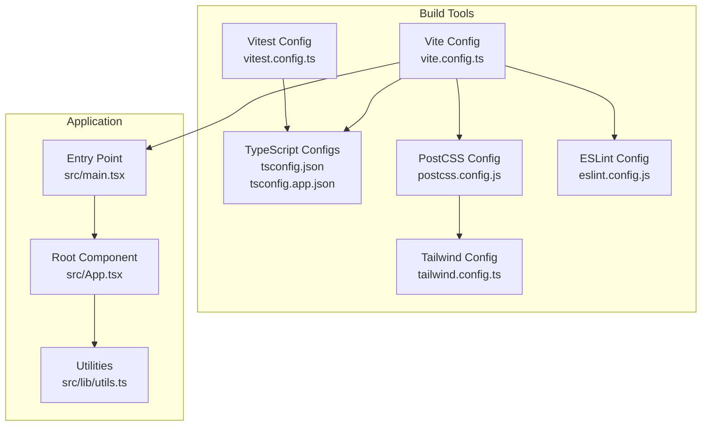
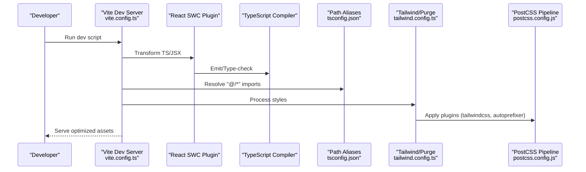
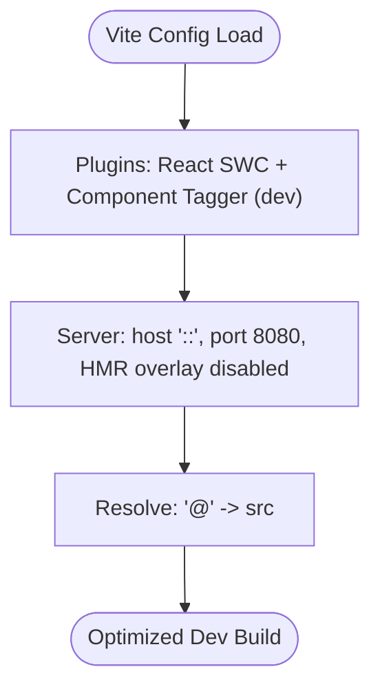
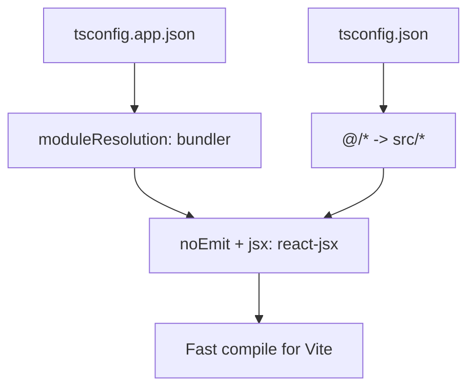
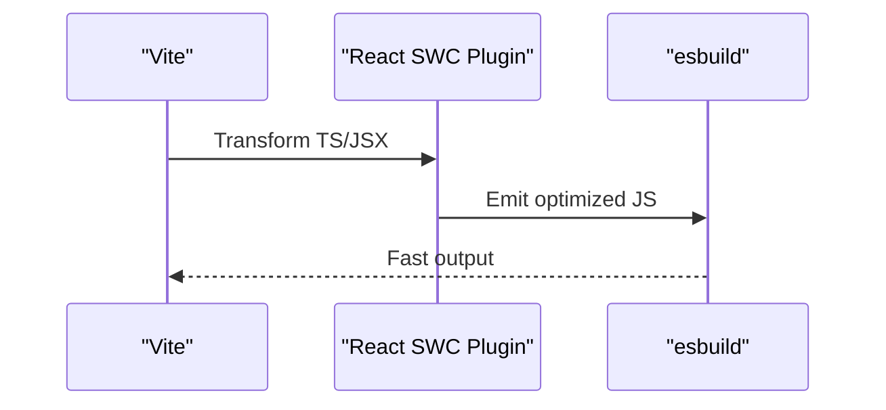
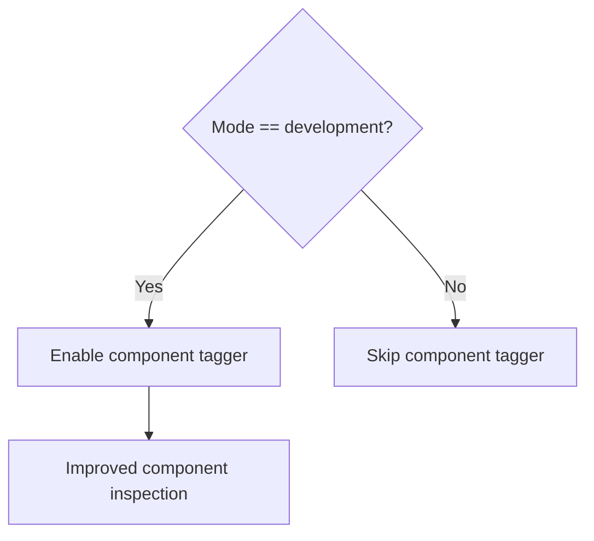
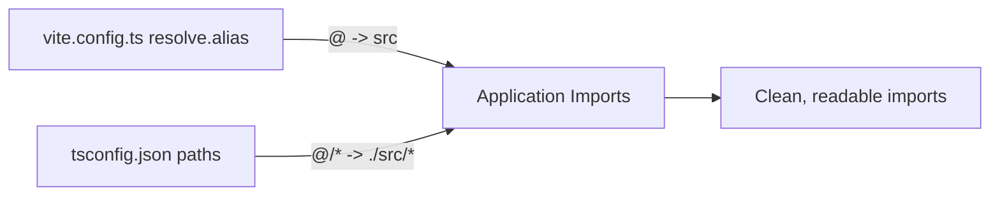
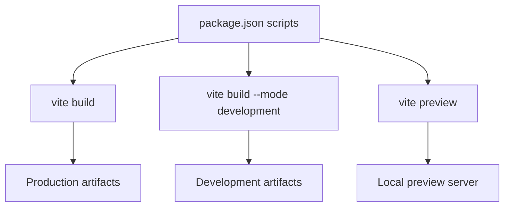
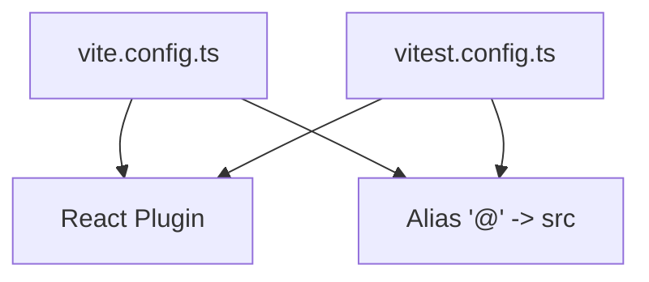
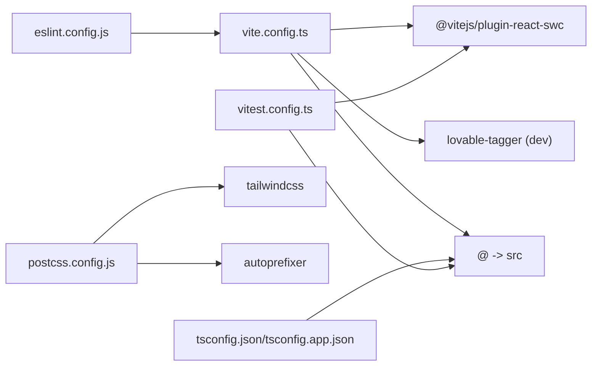

# Build Optimization

<cite>
**Referenced Files in This Document**
- [vite.config.ts](file://vite.config.ts)
- [package.json](file://package.json)
- [tsconfig.json](file://tsconfig.json)
- [tsconfig.app.json](file://tsconfig.app.json)
- [tailwind.config.ts](file://tailwind.config.ts)
- [postcss.config.js](file://postcss.config.js)
- [vitest.config.ts](file://vitest.config.ts)
- [eslint.config.js](file://eslint.config.js)
- [src/main.tsx](file://src/main.tsx)
- [src/App.tsx](file://src/App.tsx)
- [src/lib/utils.ts](file://src/lib/utils.ts)
- [README.md](file://README.md)
</cite>

## Table of Contents
1. [Introduction](#introduction)
2. [Project Structure](#project-structure)
3. [Core Components](#core-components)
4. [Architecture Overview](#architecture-overview)
5. [Detailed Component Analysis](#detailed-component-analysis)
6. [Dependency Analysis](#dependency-analysis)
7. [Performance Considerations](#performance-considerations)
8. [Troubleshooting Guide](#troubleshooting-guide)
9. [Conclusion](#conclusion)
10. [Appendices](#appendices)

## Introduction
This document explains the build optimization techniques used in this React application. It focuses on Vite configuration optimizations (plugins, alias resolution, and development server settings), TypeScript compilation optimizations, bundling and production build configurations, React SWC compiler usage, component tagging for development, path aliases, build performance metrics, bundle size analysis tools, and environment-specific optimizations for deployment preparation.

## Project Structure
The project follows a conventional React + TypeScript + Vite setup with Tailwind CSS for styling and Vitest for testing. Key build-related files include Vite configuration, TypeScript configurations, PostCSS/Tailwind setup, ESLint configuration, and test configuration. The application uses path aliases to simplify imports and improve maintainability.

**Diagram sources**
- [vite.config.ts](file://vite.config.ts#L1-L22)
- [tsconfig.json](file://tsconfig.json#L1-L17)
- [tsconfig.app.json](file://tsconfig.app.json#L1-L32)
- [postcss.config.js](file://postcss.config.js#L1-L7)
- [tailwind.config.ts](file://tailwind.config.ts#L1-L86)
- [eslint.config.js](file://eslint.config.js#L1-L27)
- [vitest.config.ts](file://vitest.config.ts#L1-L17)
- [src/main.tsx](file://src/main.tsx#L1-L6)
- [src/App.tsx](file://src/App.tsx#L1-L45)
- [src/lib/utils.ts](file://src/lib/utils.ts#L1-L7)

**Section sources**
- [vite.config.ts](file://vite.config.ts#L1-L22)
- [tsconfig.json](file://tsconfig.json#L1-L17)
- [tsconfig.app.json](file://tsconfig.app.json#L1-L32)
- [postcss.config.js](file://postcss.config.js#L1-L7)
- [tailwind.config.ts](file://tailwind.config.ts#L1-L86)
- [eslint.config.js](file://eslint.config.js#L1-L27)
- [vitest.config.ts](file://vitest.config.ts#L1-L17)
- [src/main.tsx](file://src/main.tsx#L1-L6)
- [src/App.tsx](file://src/App.tsx#L1-L45)
- [src/lib/utils.ts](file://src/lib/utils.ts#L1-L7)

## Core Components
- Vite configuration defines the development server, plugins, and path aliases. It integrates the React SWC plugin and conditionally loads a component tagger during development.
- TypeScript configurations enable bundler module resolution, strictness toggles, and path aliases for concise imports.
- Tailwind CSS and PostCSS handle styling optimization and purging.
- ESLint enforces code quality and React refresh rules.
- Vitest mirrors Vite’s configuration for tests, including aliases and React plugin.

Key build scripts include development, production build, development build, preview, linting, and test commands.

**Section sources**
- [vite.config.ts](file://vite.config.ts#L1-L22)
- [package.json](file://package.json#L6-L14)
- [tsconfig.json](file://tsconfig.json#L4-L15)
- [tsconfig.app.json](file://tsconfig.app.json#L10-L28)
- [tailwind.config.ts](file://tailwind.config.ts#L3-L5)
- [postcss.config.js](file://postcss.config.js#L1-L7)
- [eslint.config.js](file://eslint.config.js#L7-L26)
- [vitest.config.ts](file://vitest.config.ts#L5-L16)

## Architecture Overview
The build pipeline leverages Vite for fast development and optimized production builds. React SWC compiles TypeScript/JSX efficiently. Path aliases reduce import verbosity. Tailwind CSS generates utility classes with purge-based optimization. ESLint and Vitest support developer productivity and correctness.

**Diagram sources**
- [vite.config.ts](file://vite.config.ts#L7-L21)
- [tsconfig.json](file://tsconfig.json#L5-L8)
- [tsconfig.app.json](file://tsconfig.app.json#L10-L16)
- [tailwind.config.ts](file://tailwind.config.ts#L3-L5)
- [postcss.config.js](file://postcss.config.js#L1-L7)

## Detailed Component Analysis

### Vite Configuration Optimizations
- Plugins
  - React SWC plugin is enabled for fast JSX transformations and TypeScript compilation.
  - Component tagger plugin is conditionally loaded in development to annotate components for improved DX.
- Development Server
  - Host binding to "::" enables external access.
  - Port set to 8080.
  - HMR overlay disabled to streamline console output.
- Path Aliases
  - Alias "@" resolves to the src directory for clean imports across the app.

**Diagram sources**
- [vite.config.ts](file://vite.config.ts#L7-L21)

**Section sources**
- [vite.config.ts](file://vite.config.ts#L1-L22)

### TypeScript Compilation Optimizations
- Module Resolution
  - Bundler mode with explicit module resolution and module detection ensures compatibility with Vite’s esbuild-based pipeline.
- Strictness and Emit
  - No emit for app code aligns with Vite’s inlining and bundling strategy.
  - Loose strictness settings balance developer experience and performance.
- Path Aliases
  - baseUrl and paths ensure consistent imports using "@/*".

**Diagram sources**
- [tsconfig.json](file://tsconfig.json#L4-L8)
- [tsconfig.app.json](file://tsconfig.app.json#L10-L16)

**Section sources**
- [tsconfig.json](file://tsconfig.json#L1-L17)
- [tsconfig.app.json](file://tsconfig.app.json#L1-L32)

### React SWC Compiler Settings
- The project uses the React SWC plugin for rapid JSX/TypeScript compilation in development and production builds.
- SWC integrates with Vite’s esbuild-based pipeline to minimize transform overhead.

**Diagram sources**
- [vite.config.ts](file://vite.config.ts#L2-L2)
- [package.json](file://package.json#L74-L74)

**Section sources**
- [vite.config.ts](file://vite.config.ts#L2-L2)
- [package.json](file://package.json#L74-L74)

### Component Tagging for Development
- The component tagger plugin is included conditionally in development mode to annotate components, aiding debugging and inspection during local development.

**Diagram sources**
- [vite.config.ts](file://vite.config.ts#L15-L15)

**Section sources**
- [vite.config.ts](file://vite.config.ts#L4-L4)
- [vite.config.ts](file://vite.config.ts#L15-L15)

### Path Aliases
- Both Vite and TypeScript configs define the "@" alias mapped to the src directory.
- This reduces deep-relative imports and improves readability and maintainability.

**Diagram sources**
- [vite.config.ts](file://vite.config.ts#L16-L20)
- [tsconfig.json](file://tsconfig.json#L5-L8)
- [tsconfig.app.json](file://tsconfig.app.json#L25-L28)

**Section sources**
- [vite.config.ts](file://vite.config.ts#L16-L20)
- [tsconfig.json](file://tsconfig.json#L5-L8)
- [tsconfig.app.json](file://tsconfig.app.json#L25-L28)

### Production Build and Environment-Specific Optimizations
- Scripts
  - Production build: vite build
  - Development build: vite build --mode development
  - Preview: vite preview
- Environment
  - The Vite config supports mode-based behavior; component tagger is applied only in development.
- Deployment Preparation
  - The project targets modern browsers and uses esbuild-based bundling for speed.
  - Tailwind purges unused styles to reduce CSS size.

**Diagram sources**
- [package.json](file://package.json#L6-L14)
- [vite.config.ts](file://vite.config.ts#L7-L15)

**Section sources**
- [package.json](file://package.json#L6-L14)
- [vite.config.ts](file://vite.config.ts#L7-L15)

### Testing Configuration Alignment
- Vitest mirrors Vite’s configuration for React and path aliases, ensuring consistent transforms and imports during tests.

**Diagram sources**
- [vite.config.ts](file://vite.config.ts#L2-L2)
- [vite.config.ts](file://vite.config.ts#L16-L20)
- [vitest.config.ts](file://vitest.config.ts#L2-L2)
- [vitest.config.ts](file://vitest.config.ts#L13-L15)

**Section sources**
- [vitest.config.ts](file://vitest.config.ts#L1-L17)
- [vite.config.ts](file://vite.config.ts#L1-L22)

## Dependency Analysis
- Vite depends on React SWC plugin and optionally on the component tagger in development.
- TypeScript configurations depend on bundler module resolution and path aliases.
- Tailwind CSS relies on PostCSS plugins for processing and purging.
- ESLint and Vitest rely on shared configuration and path aliases.

**Diagram sources**
- [vite.config.ts](file://vite.config.ts#L2-L4)
- [vite.config.ts](file://vite.config.ts#L16-L20)
- [tsconfig.json](file://tsconfig.json#L5-L8)
- [tsconfig.app.json](file://tsconfig.app.json#L10-L16)
- [postcss.config.js](file://postcss.config.js#L1-L7)
- [eslint.config.js](file://eslint.config.js#L1-L27)
- [vitest.config.ts](file://vitest.config.ts#L2-L2)
- [vitest.config.ts](file://vitest.config.ts#L13-L15)

**Section sources**
- [vite.config.ts](file://vite.config.ts#L1-L22)
- [tsconfig.json](file://tsconfig.json#L1-L17)
- [tsconfig.app.json](file://tsconfig.app.json#L1-L32)
- [postcss.config.js](file://postcss.config.js#L1-L7)
- [eslint.config.js](file://eslint.config.js#L1-L27)
- [vitest.config.ts](file://vitest.config.ts#L1-L17)

## Performance Considerations
- Fast Transformations
  - React SWC plugin accelerates JSX/TypeScript compilation compared to Babel.
- Minimal Emit
  - TypeScript configurations avoid emitting separate files for app code, aligning with Vite’s in-memory transforms and bundling.
- Path Aliases
  - Reduce module resolution overhead and improve cache locality.
- Purge and Tailwind
  - Tailwind purges unused CSS, minimizing CSS payload.
- esbuild
  - Vite’s default bundler is esbuild, known for speed; ensure no conflicting plugins slow it down.
- HMR
  - Disabled overlay reduces noise and can slightly improve perceived responsiveness in development.

[No sources needed since this section provides general guidance]

## Troubleshooting Guide
- Component Tagging Not Active
  - Verify development mode is used; component tagger is only enabled in development.
- Path Aliases Not Resolving
  - Confirm both Vite and TypeScript configs define the "@" alias consistently.
- Slow Builds
  - Ensure no unnecessary plugins are active in production.
  - Keep TypeScript noEmit and bundler module resolution aligned with Vite.
- CSS Size Issues
  - Tailwind purge should remove unused styles; verify content globs in Tailwind config.
- Test Failures
  - Align Vitest configuration with Vite’s React plugin and alias settings.

**Section sources**
- [vite.config.ts](file://vite.config.ts#L15-L15)
- [vite.config.ts](file://vite.config.ts#L16-L20)
- [tsconfig.json](file://tsconfig.json#L5-L8)
- [tsconfig.app.json](file://tsconfig.app.json#L10-L16)
- [tailwind.config.ts](file://tailwind.config.ts#L3-L5)
- [vitest.config.ts](file://vitest.config.ts#L5-L16)

## Conclusion
This project leverages Vite, React SWC, Tailwind CSS, and TypeScript to achieve fast development and efficient production builds. Path aliases, bundler module resolution, and conditional component tagging enhance developer experience and performance. Aligning test configuration with Vite further streamlines the workflow. For production, rely on Vite’s defaults and Tailwind purging to keep bundles lean.

[No sources needed since this section summarizes without analyzing specific files]

## Appendices

### Appendix A: Build Scripts Reference
- dev: Start Vite dev server
- build: Production build
- build:dev: Development build with mode flag
- preview: Preview production build locally
- test: Run Vitest tests
- test:watch: Watch tests
- lint: Run ESLint

**Section sources**
- [package.json](file://package.json#L6-L14)

### Appendix B: Environment and Deployment Notes
- The project is designed for modern browsers and uses esbuild-based bundling.
- Deployment can be prepared locally via preview and published through the platform’s publishing workflow.

**Section sources**
- [README.md](file://README.md#L63-L74)