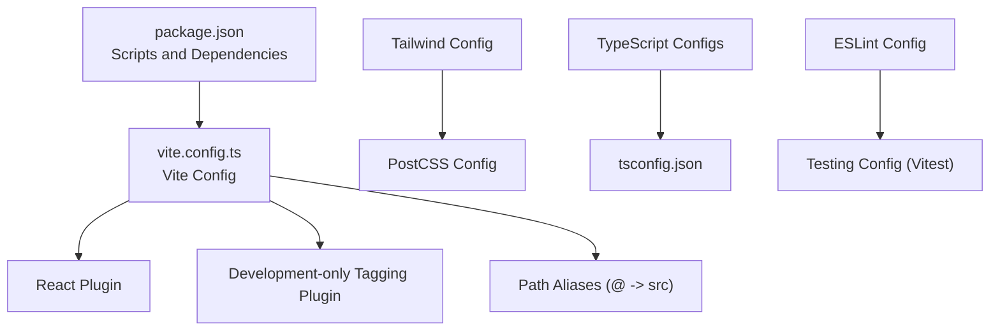
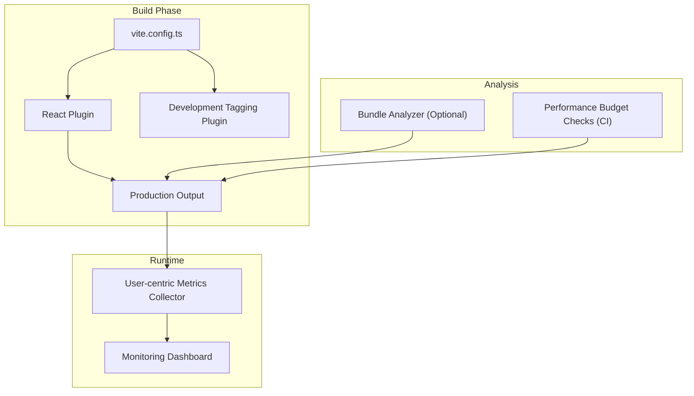
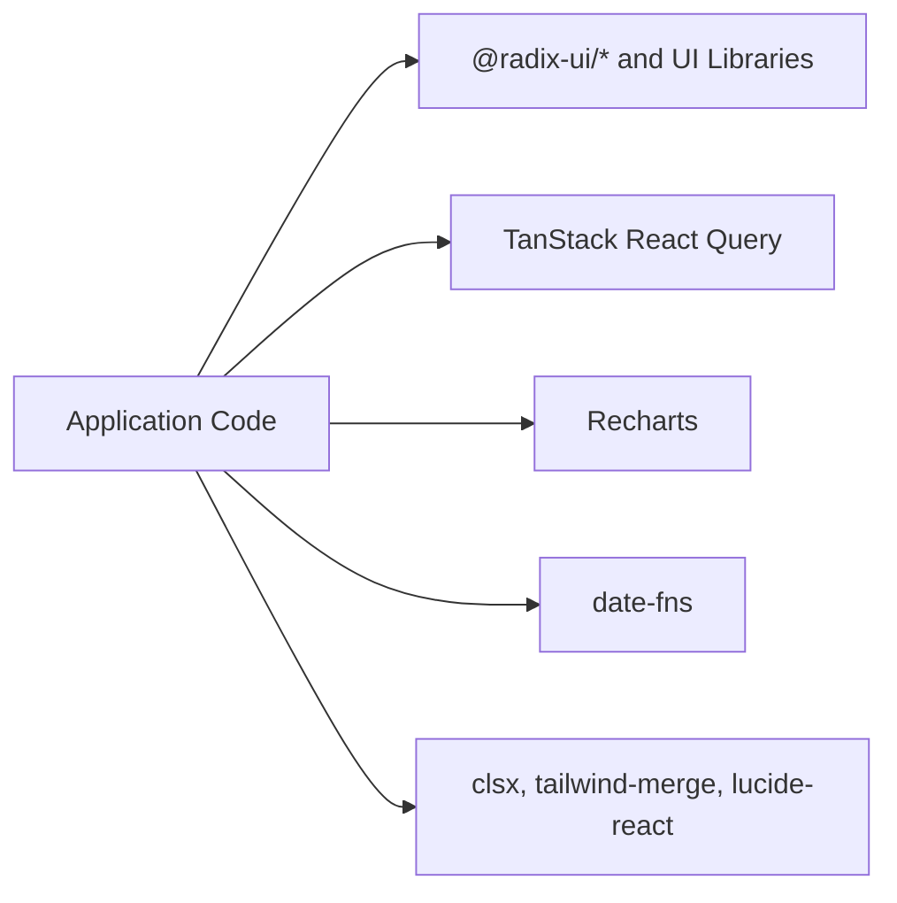

# Bundle Analysis and Monitoring

<cite>
**Referenced Files in This Document**
- [package.json](file://package.json)
- [vite.config.ts](file://vite.config.ts)
- [README.md](file://README.md)
- [eslint.config.js](file://eslint.config.js)
- [postcss.config.js](file://postcss.config.js)
- [tailwind.config.ts](file://tailwind.config.ts)
- [vitest.config.ts](file://vitest.config.ts)
- [tsconfig.json](file://tsconfig.json)
</cite>

## Table of Contents
1. [Introduction](#introduction)
2. [Project Structure](#project-structure)
3. [Core Components](#core-components)
4. [Architecture Overview](#architecture-overview)
5. [Detailed Component Analysis](#detailed-component-analysis)
6. [Dependency Analysis](#dependency-analysis)
7. [Performance Considerations](#performance-considerations)
8. [Troubleshooting Guide](#troubleshooting-guide)
9. [Conclusion](#conclusion)
10. [Appendices](#appendices)

## Introduction
This document provides comprehensive guidance for bundle analysis and performance monitoring tailored to the current project. It explains how to integrate bundle analysis tools, track bundle sizes, optimize dependencies, collect performance metrics, implement real-user monitoring, enforce performance budgets, and maintain performance over time. While the repository does not currently include dedicated performance monitoring or bundle analyzer tooling, the guidance below outlines practical steps to add these capabilities safely and effectively.

## Project Structure
The project is a Vite-powered React application configured with TypeScript, Tailwind CSS, and shadcn/ui components. Build-time tooling is minimal, with Vite managing bundling and development server features. The configuration supports component tagging via a development-only plugin and includes aliases for clean imports.

**Diagram sources**
- [vite.config.ts](file://vite.config.ts#L1-L22)
- [package.json](file://package.json#L1-L90)
- [tailwind.config.ts](file://tailwind.config.ts#L1-L86)
- [postcss.config.js](file://postcss.config.js#L1-L7)
- [tsconfig.json](file://tsconfig.json#L1-L16)
- [eslint.config.js](file://eslint.config.js#L1-L27)
- [vitest.config.ts](file://vitest.config.ts#L1-L17)

**Section sources**
- [vite.config.ts](file://vite.config.ts#L1-L22)
- [package.json](file://package.json#L1-L90)
- [README.md](file://README.md#L1-L74)

## Core Components
- Vite configuration defines the development server, plugin pipeline, and path aliases. The development-only component tagging plugin integrates with external tooling during local development.
- Package scripts provide standard commands for development, building, previewing, linting, and testing.
- Tailwind and PostCSS configure styling and CSS processing.
- TypeScript and ESLint/Vitest set up type checking, linting, and unit testing.

Key integration points for performance monitoring:
- Add a production build analyzer to inspect bundle composition and identify large dependencies.
- Integrate user-centric performance measurement collection in production builds.
- Enforce performance budgets via automated checks in CI.

**Section sources**
- [vite.config.ts](file://vite.config.ts#L1-L22)
- [package.json](file://package.json#L6-L14)
- [tailwind.config.ts](file://tailwind.config.ts#L1-L86)
- [postcss.config.js](file://postcss.config.js#L1-L7)
- [tsconfig.json](file://tsconfig.json#L1-L16)
- [eslint.config.js](file://eslint.config.js#L1-L27)
- [vitest.config.ts](file://vitest.config.ts#L1-L17)

## Architecture Overview
The build and runtime architecture centers on Vite’s plugin system and React compilation. For performance monitoring, we propose adding:
- A bundle analyzer plugin to visualize output bundles after production builds.
- A lightweight performance observer to capture user-centric metrics (e.g., Largest Contentful Paint, First Input Delay).
- Automated checks to compare bundle sizes against budgets and fail builds when thresholds are exceeded.

**Diagram sources**
- [vite.config.ts](file://vite.config.ts#L1-L22)

## Detailed Component Analysis

### Vite Configuration and Development Tagging
- The Vite config enables the React plugin and conditionally loads a development-only tagging plugin. This is a good place to add a production build analyzer plugin during release builds.
- Path aliases simplify imports and reduce bundle bloat caused by deep relative paths.

Recommendations:
- Add a production-only analyzer plugin to inspect output bundles.
- Keep the development-only tagging plugin for local iteration.

**Section sources**
- [vite.config.ts](file://vite.config.ts#L1-L22)

### Package Scripts and Dependencies
- Scripts include standard development, build, preview, lint, and test commands.
- Dependencies include React, Radix UI primitives, TanStack Query, Recharts, Tailwind-based UI libraries, and internationalization helpers.

Recommendations:
- Add a script to run the analyzer after production builds.
- Consider lazy-loading heavy dependencies and splitting vendor chunks to reduce initial bundle size.

**Section sources**
- [package.json](file://package.json#L6-L14)
- [package.json](file://package.json#L15-L64)

### Tailwind and PostCSS
- Tailwind scans component paths and generates utility classes.
- PostCSS and Autoprefixer process CSS for cross-browser compatibility.

Recommendations:
- Audit unused CSS in production builds to reduce payload.
- Consider purging Tailwind utilities in production to minimize CSS size.

**Section sources**
- [tailwind.config.ts](file://tailwind.config.ts#L1-L86)
- [postcss.config.js](file://postcss.config.js#L1-L7)

### TypeScript and Testing
- TypeScript configs centralize path mapping and compiler options.
- Vitest config sets up a DOM environment for tests.

Recommendations:
- Use performance budgets to gate pull requests in CI.
- Track bundle size regressions alongside test coverage.

**Section sources**
- [tsconfig.json](file://tsconfig.json#L1-L16)
- [vitest.config.ts](file://vitest.config.ts#L1-L17)

## Dependency Analysis
The project relies on a rich set of UI and utility dependencies. Large dependencies (e.g., charting, date/time utilities, UI libraries) can dominate bundle size. To optimize:

- Prefer tree-shakeable libraries and import only what is needed.
- Split large third-party modules into separate chunks.
- Lazy-load non-critical features to defer cost until use.

[No sources needed since this diagram shows conceptual dependency relationships]

## Performance Considerations
- Bundle size growth impacts time-to-interactive and perceived performance. Use the analyzer to identify large dependencies and refactor accordingly.
- Optimize images and fonts; leverage modern formats and compression.
- Minimize CSS and JS; ensure only necessary styles are shipped.
- Monitor user-centric metrics in production to detect regressions early.

[No sources needed since this section provides general guidance]

## Troubleshooting Guide
Common issues and resolutions:
- Unexpected large bundles: Run the analyzer to locate oversized modules; consider lazy loading or swapping libraries.
- Dev vs. prod differences: Verify analyzer runs only in production builds; confirm development-only plugin is disabled in production.
- CSS bloat: Confirm Tailwind purge settings and remove unused utilities.
- CI failures: Align budgets with team goals; adjust thresholds gradually.

**Section sources**
- [vite.config.ts](file://vite.config.ts#L15-L15)
- [tailwind.config.ts](file://tailwind.config.ts#L4-L5)

## Conclusion
By integrating a production build analyzer, collecting user-centric performance metrics, enforcing budgets, and maintaining optimization discipline, the project can sustain fast, reliable experiences. Start with small, incremental changes and automate checks to prevent regressions.

[No sources needed since this section summarizes without analyzing specific files]

## Appendices

### A. Recommended Tooling and Workflow
- Add a production-only analyzer plugin to inspect bundles after builds.
- Instrument runtime metrics collection to capture real-user performance signals.
- Set up automated performance budgets in CI to block PRs exceeding thresholds.
- Periodically review dependencies and refactor to keep bundle sizes healthy.

[No sources needed since this section provides general guidance]