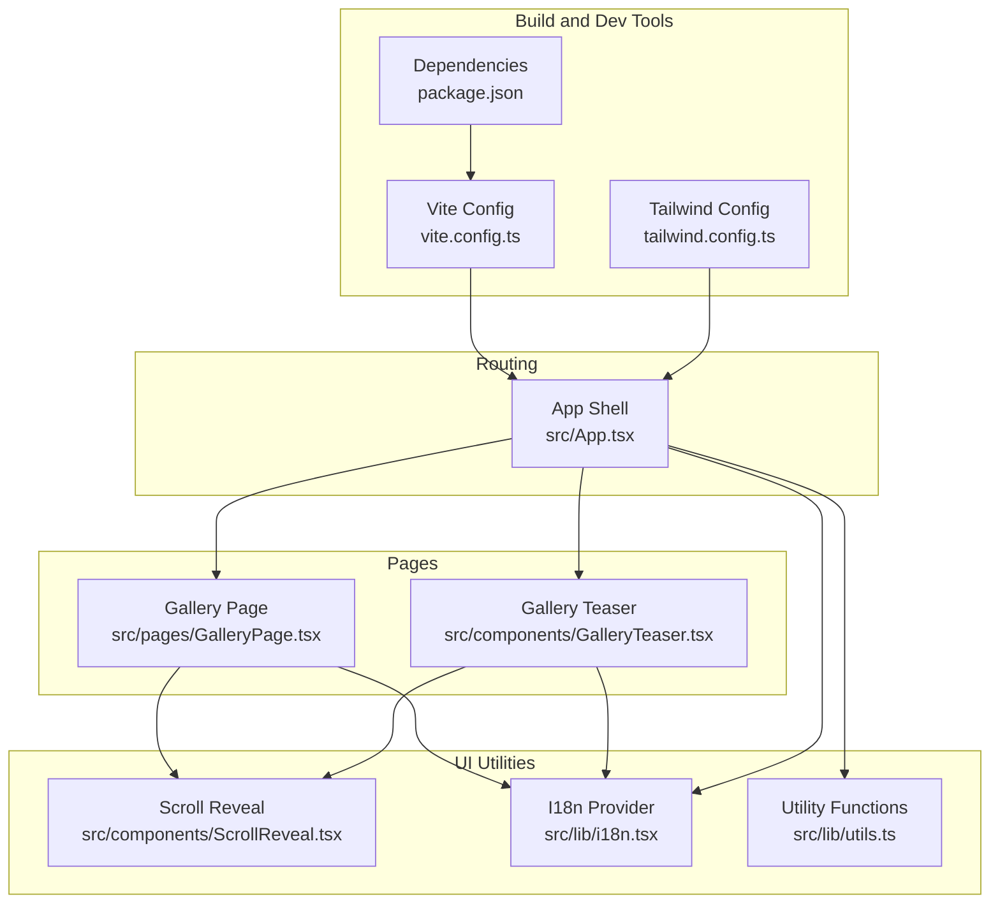
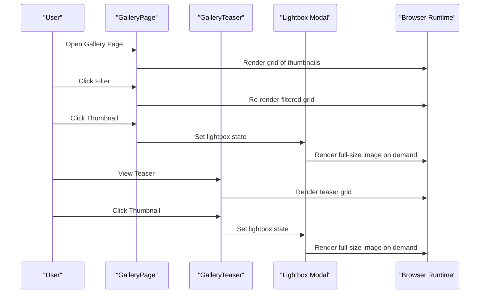
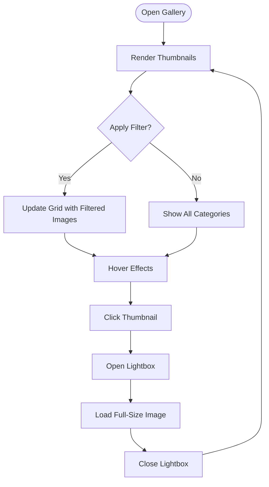
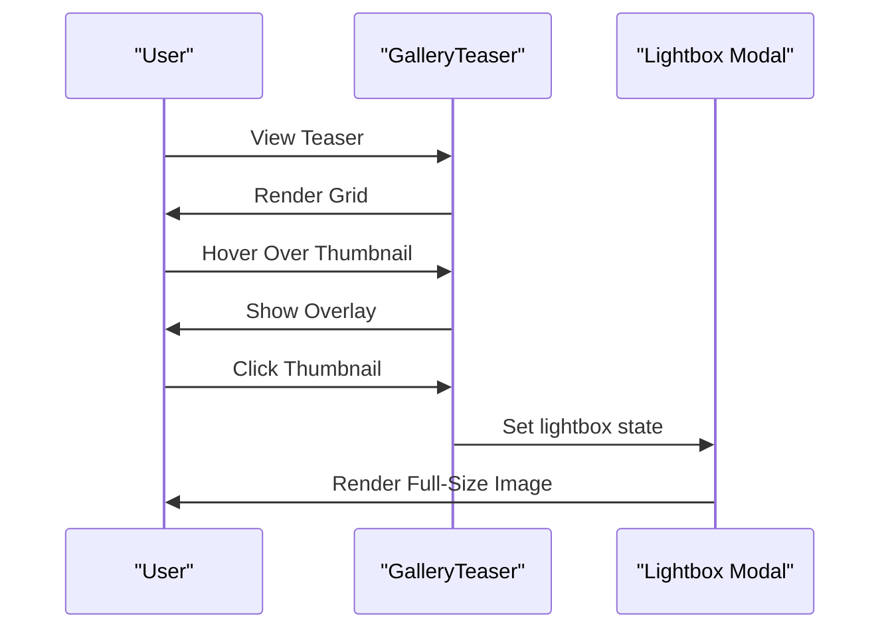
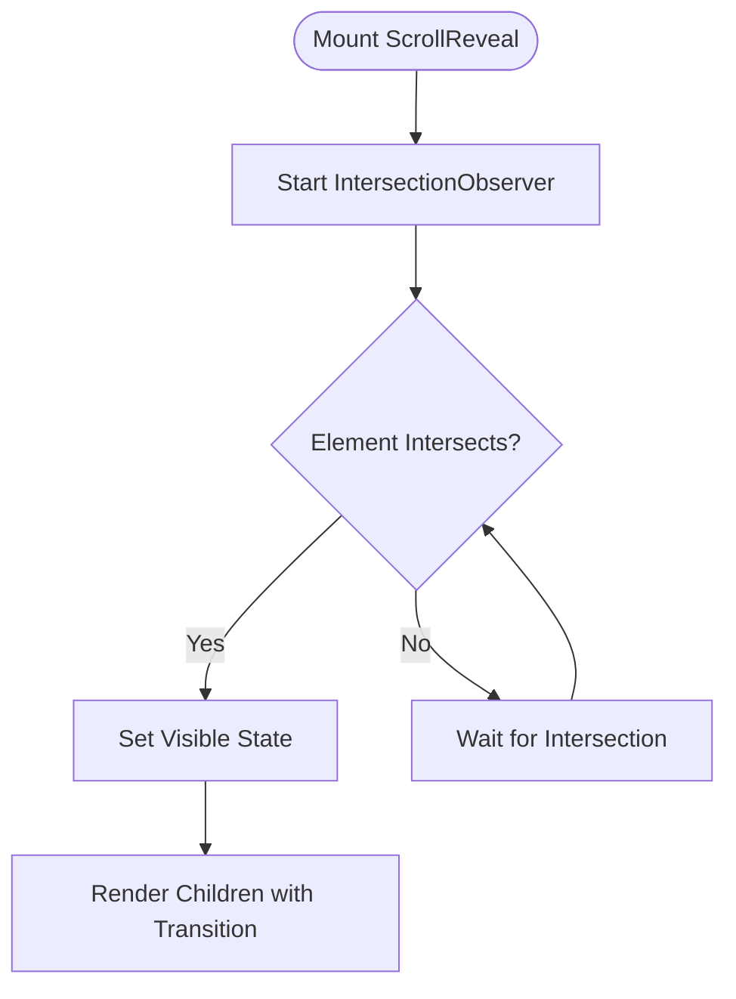
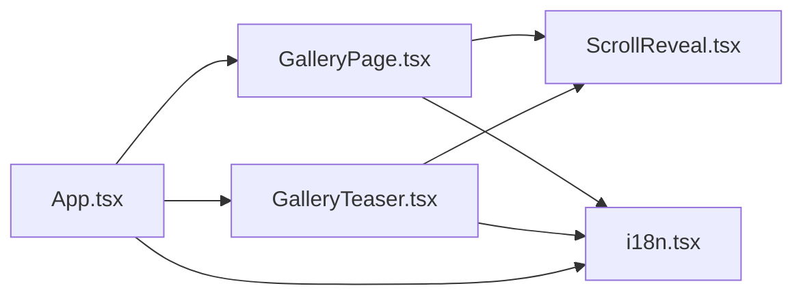

# Image Optimization

<cite>
**Referenced Files in This Document**
- [README.md](file://README.md)
- [package.json](file://package.json)
- [vite.config.ts](file://vite.config.ts)
- [tailwind.config.ts](file://tailwind.config.ts)
- [src/App.tsx](file://src/App.tsx)
- [src/pages/GalleryPage.tsx](file://src/pages/GalleryPage.tsx)
- [src/components/GalleryTeaser.tsx](file://src/components/GalleryTeaser.tsx)
- [src/components/ScrollReveal.tsx](file://src/components/ScrollReveal.tsx)
- [src/lib/i18n.tsx](file://src/lib/i18n.tsx)
- [src/lib/utils.ts](file://src/lib/utils.ts)
</cite>

## Table of Contents
1. [Introduction](#introduction)
2. [Project Structure](#project-structure)
3. [Core Components](#core-components)
4. [Architecture Overview](#architecture-overview)
5. [Detailed Component Analysis](#detailed-component-analysis)
6. [Dependency Analysis](#dependency-analysis)
7. [Performance Considerations](#performance-considerations)
8. [Troubleshooting Guide](#troubleshooting-guide)
9. [Conclusion](#conclusion)
10. [Appendices](#appendices)

## Introduction
This document provides a comprehensive guide to image optimization strategies and implementation for the project. It focuses on responsive image techniques, lazy loading, compression, gallery systems (thumbnails, lightbox, caching), fallbacks, alt text, progressive loading, CDN integration, format optimization (WebP, AVIF), performance monitoring, mobile-first approaches, and bandwidth optimization. The analysis is grounded in the current codebase and highlights areas for improvement and best practices aligned with the technologies used (React, Vite, Tailwind CSS).

## Project Structure
The project is a React application using Vite for bundling and Tailwind CSS for styling. Images are imported directly as static assets and rendered in gallery and teaser components. The routing is handled by React Router, and internationalization is provided by a custom provider.

**Diagram sources**
- [vite.config.ts](file://vite.config.ts#L1-L22)
- [package.json](file://package.json#L1-L90)
- [tailwind.config.ts](file://tailwind.config.ts#L1-L86)
- [src/App.tsx](file://src/App.tsx#L1-L45)
- [src/pages/GalleryPage.tsx](file://src/pages/GalleryPage.tsx#L1-L79)
- [src/components/GalleryTeaser.tsx](file://src/components/GalleryTeaser.tsx#L1-L56)
- [src/components/ScrollReveal.tsx](file://src/components/ScrollReveal.tsx#L1-L37)
- [src/lib/i18n.tsx](file://src/lib/i18n.tsx#L1-L173)
- [src/lib/utils.ts](file://src/lib/utils.ts#L1-L7)

**Section sources**
- [README.md](file://README.md#L53-L61)
- [package.json](file://package.json#L1-L90)
- [vite.config.ts](file://vite.config.ts#L1-L22)
- [tailwind.config.ts](file://tailwind.config.ts#L1-L86)
- [src/App.tsx](file://src/App.tsx#L1-L45)

## Core Components
- GalleryPage: Implements category filtering, grid layout, and lightbox modal for full-size viewing.
- GalleryTeaser: Provides a compact grid of images with a lightbox modal and hover effects.
- ScrollReveal: Uses IntersectionObserver to animate elements into view, enabling lazy loading behavior.
- I18n Provider: Centralized translation provider used across components.
- Utility functions: Tailwind merging and class composition helpers.

Key observations:
- Images are imported as static assets and rendered directly in img tags.
- Alt attributes are present but often empty in gallery components; they should describe the visual content.
- Lightbox opens on demand, reducing initial payload and deferring heavy image rendering.
- Responsive breakpoints are applied via Tailwind classes (e.g., md:grid-cols-3).

**Section sources**
- [src/pages/GalleryPage.tsx](file://src/pages/GalleryPage.tsx#L1-L79)
- [src/components/GalleryTeaser.tsx](file://src/components/GalleryTeaser.tsx#L1-L56)
- [src/components/ScrollReveal.tsx](file://src/components/ScrollReveal.tsx#L1-L37)
- [src/lib/i18n.tsx](file://src/lib/i18n.tsx#L1-L173)
- [src/lib/utils.ts](file://src/lib/utils.ts#L1-L7)

## Architecture Overview
The image delivery pipeline currently relies on Vite’s asset importing and bundling. On build, assets are emitted to the dist directory with hashed filenames. The gallery components render images directly from imported modules, while the lightbox defers rendering of larger images until needed.

**Diagram sources**
- [src/pages/GalleryPage.tsx](file://src/pages/GalleryPage.tsx#L25-L78)
- [src/components/GalleryTeaser.tsx](file://src/components/GalleryTeaser.tsx#L14-L55)

## Detailed Component Analysis

### GalleryPage
Responsibilities:
- Category filtering (all, rooms, lobby, spa, restaurant).
- Grid layout with responsive columns.
- Lightbox modal for full-size image display.

Optimization opportunities:
- Implement responsive breakpoints and srcset-like behavior using picture/sizes or multiple sizes per image.
- Add native lazy loading via loading="lazy".
- Provide descriptive alt text for accessibility and SEO.
- Introduce progressive loading with low-quality placeholders or blur-up effects.
- Consider WebP/AVIF formats and fallbacks for modern browsers.

**Diagram sources**
- [src/pages/GalleryPage.tsx](file://src/pages/GalleryPage.tsx#L25-L78)

**Section sources**
- [src/pages/GalleryPage.tsx](file://src/pages/GalleryPage.tsx#L14-L21)
- [src/pages/GalleryPage.tsx](file://src/pages/GalleryPage.tsx#L42-L54)
- [src/pages/GalleryPage.tsx](file://src/pages/GalleryPage.tsx#L56-L64)
- [src/pages/GalleryPage.tsx](file://src/pages/GalleryPage.tsx#L68-L73)

### GalleryTeaser
Responsibilities:
- Compact grid of images with hover overlays.
- Lightbox modal for full-size image display.

Optimization opportunities:
- Apply aspect-ratio utilities consistently.
- Add loading="lazy" and appropriate alt text.
- Implement placeholder or blur-up technique for perceived performance.
- Consider generating multiple sizes and using sizes/srcset equivalents.

**Diagram sources**
- [src/components/GalleryTeaser.tsx](file://src/components/GalleryTeaser.tsx#L14-L55)

**Section sources**
- [src/components/GalleryTeaser.tsx](file://src/components/GalleryTeaser.tsx#L12-L12)
- [src/components/GalleryTeaser.tsx](file://src/components/GalleryTeaser.tsx#L29-L41)
- [src/components/GalleryTeaser.tsx](file://src/components/GalleryTeaser.tsx#L44-L52)

### ScrollReveal (Lazy Loading Behavior)
Responsibilities:
- Animates elements into view using IntersectionObserver.
- Improves perceived performance by deferring offscreen rendering.

Optimization opportunities:
- Combine with native loading="lazy" for images.
- Use intersection observer thresholds and margins to preload images slightly before visibility.
- Consider debouncing or throttling for large grids.

**Diagram sources**
- [src/components/ScrollReveal.tsx](file://src/components/ScrollReveal.tsx#L10-L21)

**Section sources**
- [src/components/ScrollReveal.tsx](file://src/components/ScrollReveal.tsx#L14-L21)

### Alt Text and Accessibility
Current state:
- Some alt attributes are empty in gallery components.
- Other components include descriptive alt text.

Recommendations:
- Replace empty alt attributes with meaningful descriptions.
- Use concise, contextually relevant alt text for decorative images.
- For functional images (e.g., logos), include descriptive alt text.

**Section sources**
- [src/pages/GalleryPage.tsx](file://src/pages/GalleryPage.tsx#L59-L60)
- [src/pages/GalleryPage.tsx](file://src/pages/GalleryPage.tsx#L70-L71)
- [src/components/GalleryTeaser.tsx](file://src/components/GalleryTeaser.tsx#L35-L36)
- [src/components/GalleryTeaser.tsx](file://src/components/GalleryTeaser.tsx#L49-L50)

### Progressive Loading Techniques
Current state:
- No explicit placeholder or blur-up implementation.

Recommendations:
- Implement a blur-up technique using a tiny base64 blurred placeholder.
- Use a low-resolution proxy (LQIP) or pre-generated small thumbnails.
- Combine with IntersectionObserver to trigger placeholder-to-real-image transitions.

[No sources needed since this section provides general guidance]

### CDN Integration and Format Optimization
Current state:
- Images are bundled by Vite; no explicit CDN configuration.

Recommendations:
- Serve images from a CDN for global distribution and caching.
- Convert to WebP and AVIF where supported, with JPEG/PNG fallbacks.
- Use responsive image techniques (sizes/srcset equivalents) to deliver appropriately sized assets.

**Section sources**
- [vite.config.ts](file://vite.config.ts#L1-L22)
- [package.json](file://package.json#L15-L64)

### Performance Monitoring for Image Delivery
Recommendations:
- Track Largest Contentful Paint (LCP) contributions from images.
- Monitor First Input Delay (FID) and Time to Interactive (TTI) improvements after optimization.
- Use browser developer tools and Core Web Vitals reports to measure impact.

[No sources needed since this section provides general guidance]

## Dependency Analysis
The gallery components depend on:
- ScrollReveal for lazy loading behavior.
- I18n provider for localized labels.
- Tailwind utilities for responsive layouts.

**Diagram sources**
- [src/pages/GalleryPage.tsx](file://src/pages/GalleryPage.tsx#L1-L79)
- [src/components/GalleryTeaser.tsx](file://src/components/GalleryTeaser.tsx#L1-L56)
- [src/components/ScrollReveal.tsx](file://src/components/ScrollReveal.tsx#L1-L37)
- [src/lib/i18n.tsx](file://src/lib/i18n.tsx#L1-L173)
- [src/App.tsx](file://src/App.tsx#L1-L45)

**Section sources**
- [src/pages/GalleryPage.tsx](file://src/pages/GalleryPage.tsx#L1-L79)
- [src/components/GalleryTeaser.tsx](file://src/components/GalleryTeaser.tsx#L1-L56)
- [src/components/ScrollReveal.tsx](file://src/components/ScrollReveal.tsx#L1-L37)
- [src/lib/i18n.tsx](file://src/lib/i18n.tsx#L1-L173)
- [src/App.tsx](file://src/App.tsx#L1-L45)

## Performance Considerations
- Lazy loading: Combine IntersectionObserver with loading="lazy" to defer offscreen images.
- Compression: Optimize source images and leverage WebP/AVIF conversion.
- Responsive sizing: Deliver appropriately sized images to reduce bandwidth and improve LCP.
- Caching: Use CDN caching headers and cache-busting via hashed filenames.
- Rendering: Use aspect-ratio utilities and object-cover to prevent layout shifts.
- Mobile-first: Prefer smaller initial images and progressively enhance on higher bandwidth networks.

[No sources needed since this section provides general guidance]

## Troubleshooting Guide
Common issues and resolutions:
- Empty alt attributes: Replace with descriptive text to improve accessibility and SEO.
- Layout shifts: Ensure aspect ratios and fixed dimensions to avoid CLS regressions.
- Heavy lightbox images: Defer loading until modal opens; consider lazy-loading within the modal.
- Poor perceived performance: Implement blur-up or skeleton placeholders for images.
- Large bundle size: Audit images and enable compression and modern formats.

**Section sources**
- [src/pages/GalleryPage.tsx](file://src/pages/GalleryPage.tsx#L59-L60)
- [src/pages/GalleryPage.tsx](file://src/pages/GalleryPage.tsx#L70-L71)
- [src/components/GalleryTeaser.tsx](file://src/components/GalleryTeaser.tsx#L35-L36)
- [src/components/GalleryTeaser.tsx](file://src/components/GalleryTeaser.tsx#L49-L50)

## Conclusion
The project currently leverages static asset imports and basic responsive layouts for images. By integrating native lazy loading, progressive loading techniques, modern image formats (WebP/AVIF), CDN delivery, and descriptive alt text, significant improvements in performance, accessibility, and user experience can be achieved. The gallery components provide strong foundations for optimization—implementing the recommended strategies will yield measurable gains in Core Web Vitals and user satisfaction.

## Appendices
- Technologies used: React, Vite, Tailwind CSS, Radix UI, shadcn/ui.
- Build and preview scripts are available for development and testing.

**Section sources**
- [README.md](file://README.md#L53-L61)
- [package.json](file://package.json#L6-L14)
- [vite.config.ts](file://vite.config.ts#L1-L22)