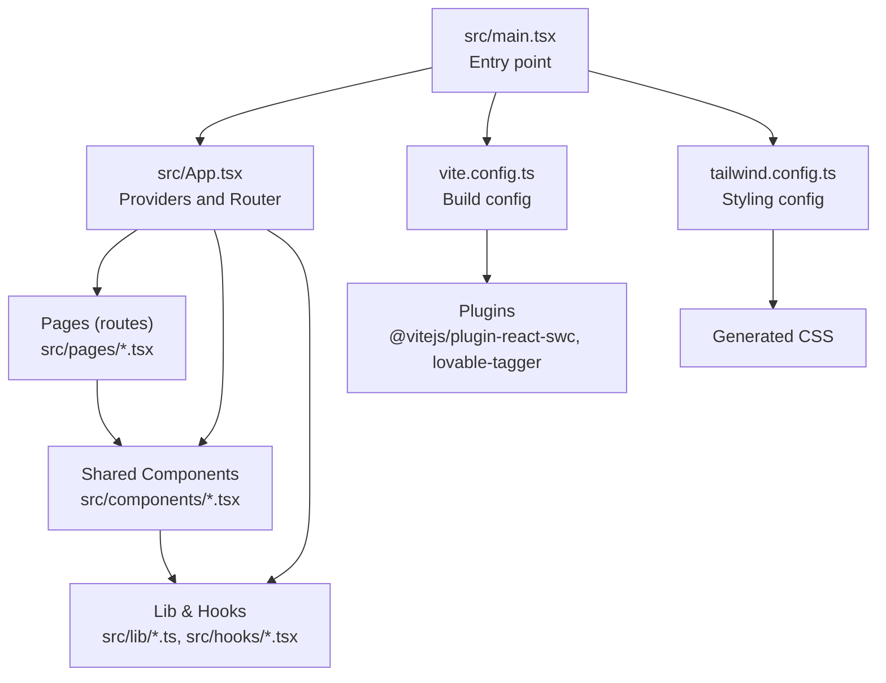
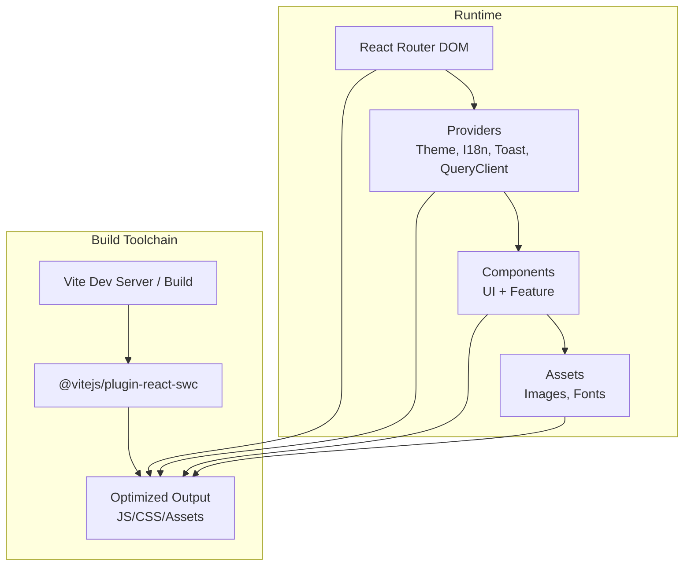
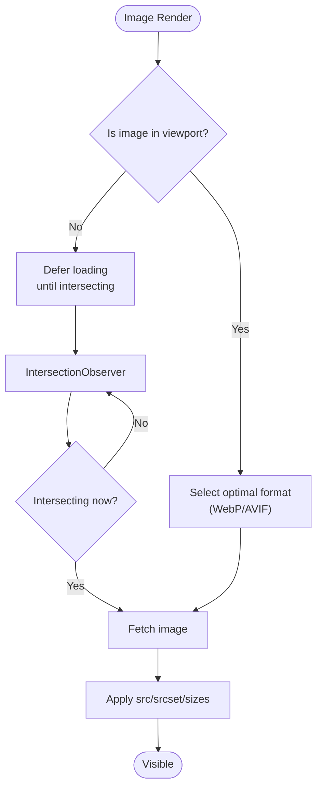
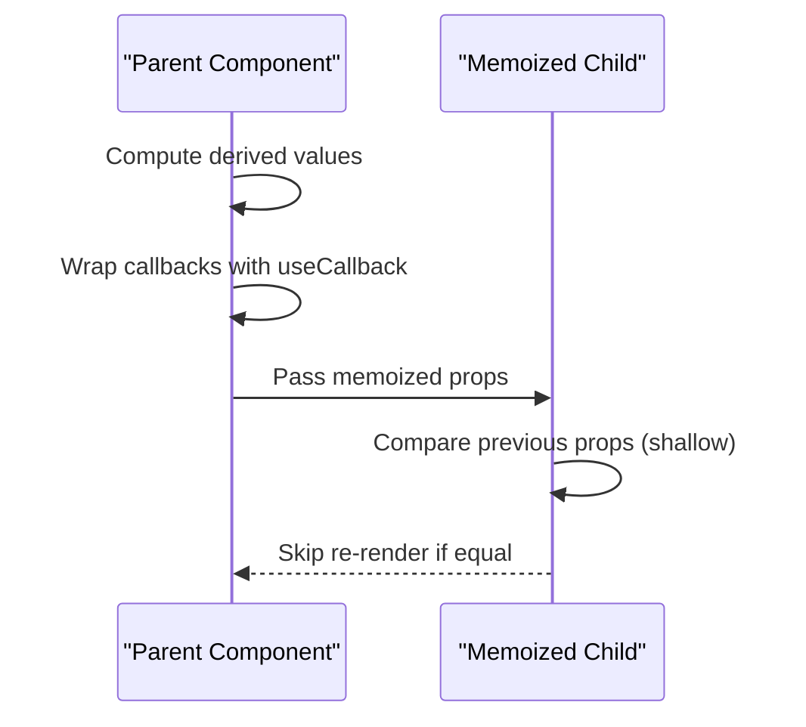
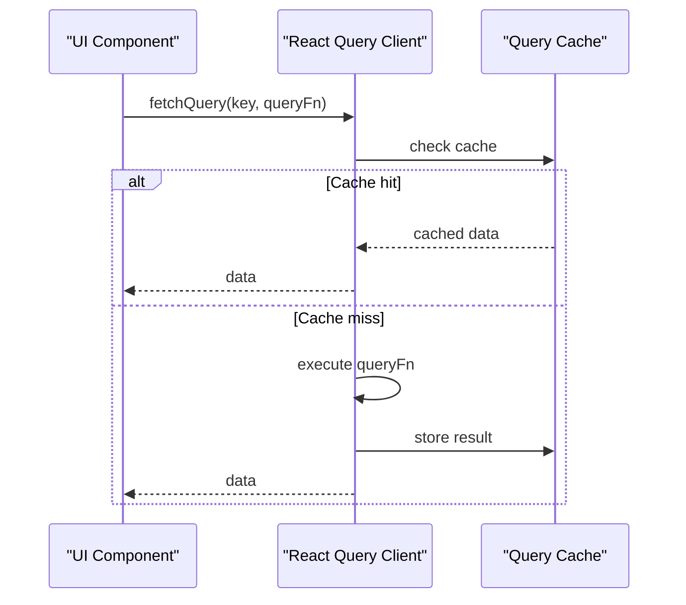
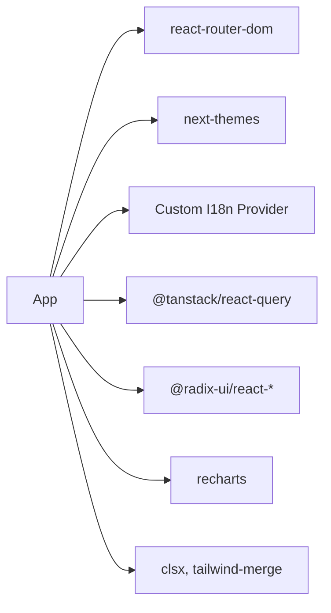

# Performance Optimization

<cite>
**Referenced Files in This Document**
- [package.json](file://package.json)
- [vite.config.ts](file://vite.config.ts)
- [tailwind.config.ts](file://tailwind.config.ts)
- [src/main.tsx](file://src/main.tsx)
- [src/App.tsx](file://src/App.tsx)
- [src/pages/Index.tsx](file://src/pages/Index.tsx)
- [src/components/Hero.tsx](file://src/components/Hero.tsx)
- [src/components/BookingWidget.tsx](file://src/components/BookingWidget.tsx)
- [src/components/ScrollReveal.tsx](file://src/components/ScrollReveal.tsx)
- [src/components/GalleryTeaser.tsx](file://src/components/GalleryTeaser.tsx)
- [src/lib/i18n.tsx](file://src/lib/i18n.tsx)
- [src/lib/theme.tsx](file://src/lib/theme.tsx)
- [src/lib/utils.ts](file://src/lib/utils.ts)
- [src/hooks/use-mobile.tsx](file://src/hooks/use-mobile.tsx)
</cite>

## Table of Contents
1. [Introduction](#introduction)
2. [Project Structure](#project-structure)
3. [Core Components](#core-components)
4. [Architecture Overview](#architecture-overview)
5. [Detailed Component Analysis](#detailed-component-analysis)
6. [Dependency Analysis](#dependency-analysis)
7. [Performance Considerations](#performance-considerations)
8. [Troubleshooting Guide](#troubleshooting-guide)
9. [Conclusion](#conclusion)
10. [Appendices](#appendices)

## Introduction
This document provides a comprehensive guide to performance optimization for the project. It focuses on build-time and runtime strategies, including bundle optimization, code splitting, lazy loading, image optimization, component memoization, rendering improvements, caching, CDN integration, and monitoring/profiling techniques. The guidance is grounded in the current project structure and technology stack (React, Vite, Radix UI, Recharts, Tailwind CSS, and React Router).

## Project Structure
The application is a single-page React application built with Vite. It uses React Router for routing, Radix UI primitives for accessible UI components, Recharts for data visualization, and Tailwind CSS for styling. Internationalization and theming are provided via local providers. The build pipeline is configured through Vite with SWC-based React plugin and optional component tagging in development.

**Diagram sources**
- [src/main.tsx](file://src/main.tsx#L1-L6)
- [src/App.tsx](file://src/App.tsx#L1-L45)
- [vite.config.ts](file://vite.config.ts#L1-L22)
- [tailwind.config.ts](file://tailwind.config.ts#L1-L86)

**Section sources**
- [src/main.tsx](file://src/main.tsx#L1-L6)
- [src/App.tsx](file://src/App.tsx#L1-L45)
- [vite.config.ts](file://vite.config.ts#L1-L22)
- [tailwind.config.ts](file://tailwind.config.ts#L1-L86)

## Core Components
- Providers and Routing: Application-wide providers (theme, i18n, tooltips, React Query) wrap routes. This centralizes cross-cutting concerns and enables efficient updates.
- Page Composition: Pages assemble domain-specific components. The home page composes multiple feature sections.
- UI Primitives: Shared components leverage Radix UI and shadcn/ui-like design tokens via Tailwind.
- Utilities and Hooks: Utility functions and hooks support styling, responsive logic, and internationalization.

Key performance-relevant observations:
- Providers are mounted once at the root, minimizing re-renders across the app.
- Components import assets directly; ensure bundler handles asset optimization.
- Some components use IntersectionObserver for animations; consider throttling and cleanup.

**Section sources**
- [src/App.tsx](file://src/App.tsx#L1-L45)
- [src/pages/Index.tsx](file://src/pages/Index.tsx#L1-L28)
- [src/components/Hero.tsx](file://src/components/Hero.tsx#L1-L53)
- [src/components/BookingWidget.tsx](file://src/components/BookingWidget.tsx#L1-L154)
- [src/components/ScrollReveal.tsx](file://src/components/ScrollReveal.tsx#L1-L37)
- [src/components/GalleryTeaser.tsx](file://src/components/GalleryTeaser.tsx#L1-L56)
- [src/lib/i18n.tsx](file://src/lib/i18n.tsx#L1-L173)
- [src/lib/theme.tsx](file://src/lib/theme.tsx#L1-L36)
- [src/lib/utils.ts](file://src/lib/utils.ts#L1-L7)
- [src/hooks/use-mobile.tsx](file://src/hooks/use-mobile.tsx#L1-L20)

## Architecture Overview
The runtime architecture centers on React rendering under Vite’s development server and optimized production builds. Providers encapsulate state and behavior, while routes render page-level components. UI primitives are thin wrappers around Radix components, styled with Tailwind.

**Diagram sources**
- [src/App.tsx](file://src/App.tsx#L1-L45)
- [vite.config.ts](file://vite.config.ts#L1-L22)

## Detailed Component Analysis

### Lazy Loading and Code Splitting
- Route-level code splitting: Split pages into separate chunks so only the requested route loads initially.
- Dynamic imports for heavy components: Defer expensive components until needed.
- Suspense boundaries: Wrap async routes/components to show fallbacks during load.

Implementation guidance:
- Use dynamic imports per route to achieve automatic chunking.
- For components like galleries or charts, load lazily when the user scrolls near them.

Benefits:
- Reduced initial JavaScript payload.
- Faster Time to Interactive (TTI) on slower networks.

**Section sources**
- [src/App.tsx](file://src/App.tsx#L8-L15)
- [src/pages/Index.tsx](file://src/pages/Index.tsx#L1-L28)

### Image Optimization
Current state:
- Images are imported directly and embedded as module assets. This simplifies bundling but can bloat the initial JS/CSS if many images are inlined.

Recommended optimizations:
- Use modern image formats (AVIF/WebP) with fallbacks.
- Implement responsive images with sizes and srcset attributes.
- Lazy-load offscreen images using IntersectionObserver.
- Preload critical above-the-fold images.
- Serve via a CDN with compression and caching headers.

**Diagram sources**
- [src/components/Hero.tsx](file://src/components/Hero.tsx#L4-L14)
- [src/components/GalleryTeaser.tsx](file://src/components/GalleryTeaser.tsx#L30-L41)
- [src/components/ScrollReveal.tsx](file://src/components/ScrollReveal.tsx#L14-L21)

**Section sources**
- [src/components/Hero.tsx](file://src/components/Hero.tsx#L4-L14)
- [src/components/GalleryTeaser.tsx](file://src/components/GalleryTeaser.tsx#L30-L41)
- [src/components/ScrollReveal.tsx](file://src/components/ScrollReveal.tsx#L14-L21)

### Component Memoization and Rendering Improvements
- Memoize stable props passed to child components to prevent unnecessary re-renders.
- Use React.memo for presentational components with shallow prop equality.
- Use useMemo for derived computations and expensive selectors.
- Use useCallback for event handlers and callbacks passed down to children.
- Avoid anonymous functions in render to reduce closure overhead.

Practical tips:
- Wrap components that render lists or charts with memoization.
- Cache translation keys and formatted strings when appropriate.
- Debounce or throttle frequent events (e.g., scroll, resize).

**Section sources**
- [src/components/BookingWidget.tsx](file://src/components/BookingWidget.tsx#L15-L39)
- [src/lib/i18n.tsx](file://src/lib/i18n.tsx#L159-L161)
- [src/hooks/use-mobile.tsx](file://src/hooks/use-mobile.tsx#L5-L18)

### State Management and Caching
- React Query is initialized at the root. Configure cache times, background refetch, and invalidation strategies to minimize redundant requests.
- Persist frequently changing UI state (theme, language) in localStorage to avoid re-computation on reload.

**Diagram sources**
- [src/App.tsx](file://src/App.tsx#L17-L17)

**Section sources**
- [src/App.tsx](file://src/App.tsx#L17-L17)
- [src/lib/theme.tsx](file://src/lib/theme.tsx#L13-L22)
- [src/lib/i18n.tsx](file://src/lib/i18n.tsx#L149-L157)

### Styling and Bundle Size
- Tailwind’s purge removes unused CSS, keeping styles lean.
- Use utility-first classes to avoid writing custom CSS and rely on generated bundles.

Recommendations:
- Keep content globs accurate to prevent dead CSS from being included.
- Prefer component-level animations over global CSS where possible.

**Section sources**
- [tailwind.config.ts](file://tailwind.config.ts#L4-L5)
- [src/lib/utils.ts](file://src/lib/utils.ts#L4-L6)

### Build Optimization and CDN Integration
- Production builds: Enable minification, tree-shaking, and asset optimization.
- Asset hashing: Ensure long-term caching with hashed filenames.
- CDN: Host static assets on a CDN with compression and caching policies.
- Subresource Integrity: Add SRI for external scripts if applicable.

**Section sources**
- [package.json](file://package.json#L6-L14)
- [vite.config.ts](file://vite.config.ts#L1-L22)

## Dependency Analysis
External libraries influence performance characteristics:
- UI primitives (Radix UI): Lightweight and accessible; ensure only used features are bundled.
- Charts (Recharts): Good for dashboards; consider lazy-loading charts when offscreen.
- i18n: In-memory translation map; keep keys small and avoid deep nesting.
- Theming: Local storage persistence avoids repeated computation.

**Diagram sources**
- [src/App.tsx](file://src/App.tsx#L1-L45)
- [package.json](file://package.json#L15-L64)

**Section sources**
- [package.json](file://package.json#L15-L64)
- [src/App.tsx](file://src/App.tsx#L1-L45)

## Performance Considerations

### Bundle Size Analysis
- Analyze the production build output to identify large dependencies and duplicated modules.
- Use source maps to trace bundle composition.
- Monitor for accidental large assets (e.g., oversized images or fonts).

Guidelines:
- Prefer tree-shakeable libraries and disable unused features.
- Split vendor and app bundles when beneficial.
- Audit third-party dependencies regularly.

**Section sources**
- [package.json](file://package.json#L6-L14)
- [vite.config.ts](file://vite.config.ts#L1-L22)

### Memory Management
- Clean up observers and listeners in effects to prevent leaks.
- Avoid retaining large arrays or objects in component state.
- Dispose of timers and intervals when components unmount.

**Section sources**
- [src/components/ScrollReveal.tsx](file://src/components/ScrollReveal.tsx#L14-L21)
- [src/hooks/use-mobile.tsx](file://src/hooks/use-mobile.tsx#L8-L16)

### Rendering Performance
- Virtualize long lists to limit DOM nodes.
- Use CSS transforms for animations to avoid layout thrashing.
- Batch state updates to reduce reflows.

**Section sources**
- [src/components/GalleryTeaser.tsx](file://src/components/GalleryTeaser.tsx#L29-L41)

### Runtime Performance Across Devices and Networks
- Adaptive image loading: Serve lower resolution on slower connections.
- Feature detection: Gracefully degrade animations or heavy features on low-end devices.
- Network awareness: Use service workers or HTTP caching headers to optimize offline and slow-connection scenarios.

**Section sources**
- [src/hooks/use-mobile.tsx](file://src/hooks/use-mobile.tsx#L3-L18)
- [src/components/ScrollReveal.tsx](file://src/components/ScrollReveal.tsx#L14-L21)

## Troubleshooting Guide

### Identifying Bottlenecks
- Use browser devtools to profile CPU and memory usage.
- Measure Largest Contentful Paint (LCP), First Input Delay (FID), and Cumulative Layout Shift (CLS).
- Inspect network requests for large payloads or missing caching.

### Monitoring and Profiling Techniques
- React DevTools Profiler: Identify components causing excessive renders.
- Lighthouse: Automated performance audits for Progressive Web App readiness.
- Web Vitals reporting: Track real-user metrics in production.

### Optimization Best Practices
- Keep critical path minimal: defer non-essential code and assets.
- Use code splitting for routes and heavy components.
- Optimize images and fonts; enable compression.
- Leverage caching and CDNs for static assets.
- Minimize re-renders with memoization and stable callbacks.

**Section sources**
- [src/components/ScrollReveal.tsx](file://src/components/ScrollReveal.tsx#L14-L21)
- [src/components/GalleryTeaser.tsx](file://src/components/GalleryTeaser.tsx#L30-L41)

## Conclusion
By combining build-time optimizations (code splitting, asset optimization, and CDN delivery) with runtime improvements (lazy loading, memoization, and efficient rendering), the application can achieve fast initial loads and smooth interactions across diverse devices and network conditions. Regular monitoring and iterative profiling will help sustain performance over time.

## Appendices

### Recommended Tools and Checks
- Build analyzer: Review bundle composition and identify bloat.
- Network throttling: Simulate 3G/4G conditions to validate perceived performance.
- Accessibility and UX: Ensure animations and transitions remain usable for motion-sensitive users.

[No sources needed since this section provides general guidance]