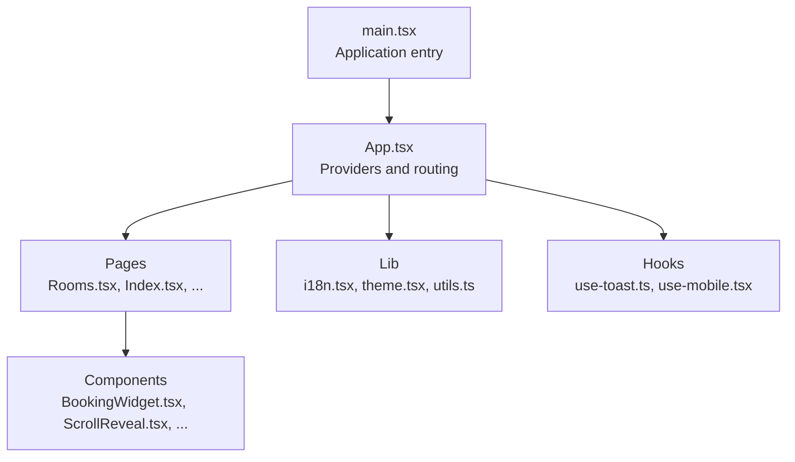
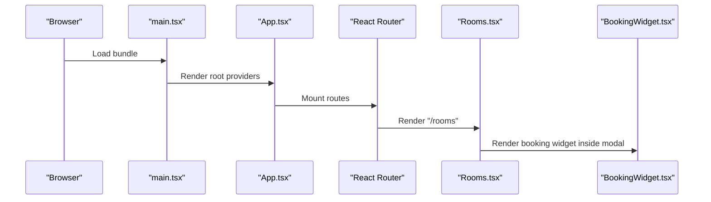
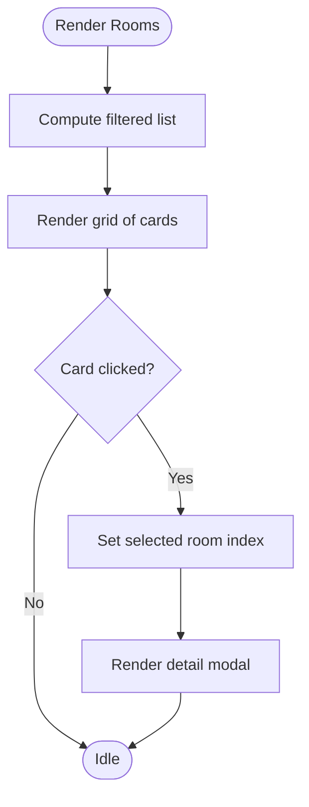
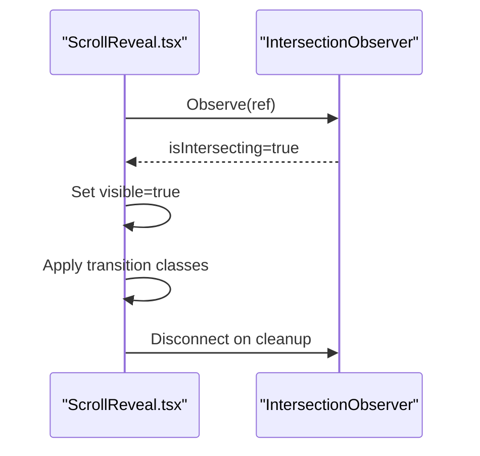
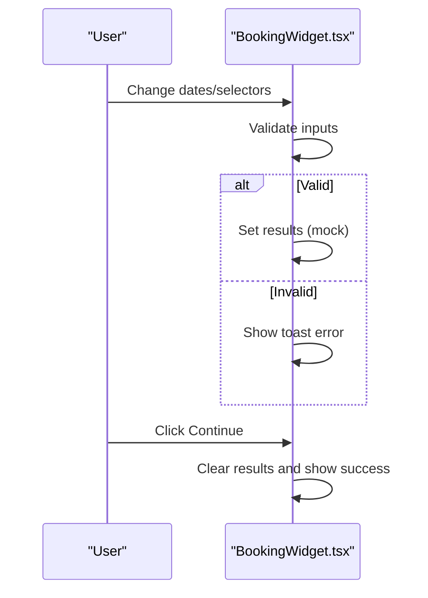
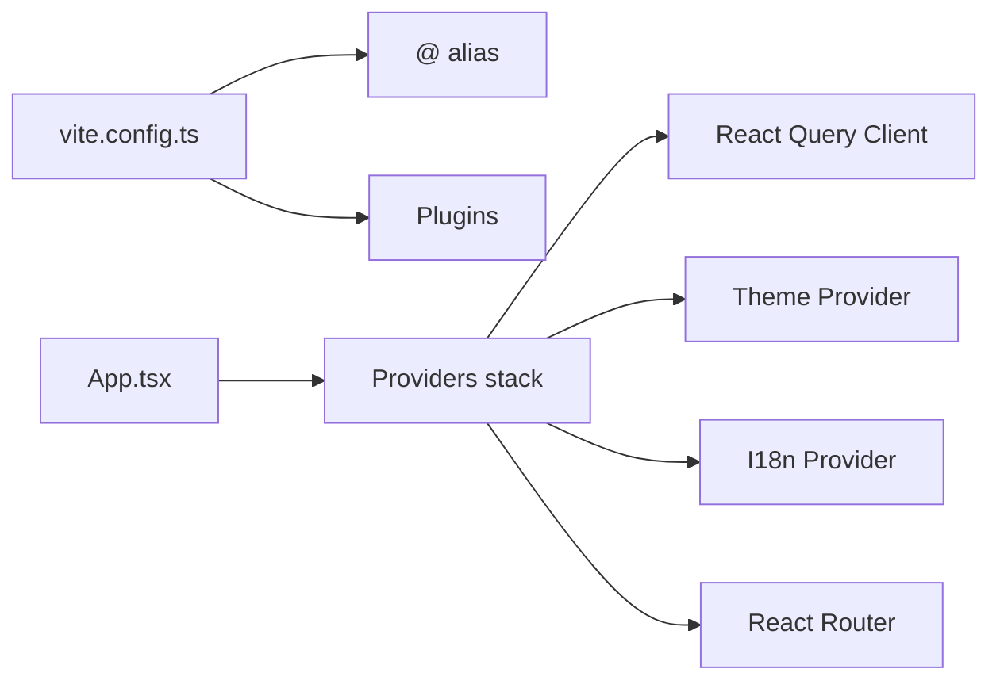

# Runtime Performance

<cite>
**Referenced Files in This Document**
- [App.tsx](file://src/App.tsx)
- [main.tsx](file://src/main.tsx)
- [vite.config.ts](file://vite.config.ts)
- [package.json](file://package.json)
- [Rooms.tsx](file://src/pages/Rooms.tsx)
- [BookingWidget.tsx](file://src/components/BookingWidget.tsx)
- [ScrollReveal.tsx](file://src/components/ScrollReveal.tsx)
- [AmenitiesSection.tsx](file://src/components/AmenitiesSection.tsx)
- [FeaturedRooms.tsx](file://src/components/FeaturedRooms.tsx)
- [i18n.tsx](file://src/lib/i18n.tsx)
- [theme.tsx](file://src/lib/theme.tsx)
- [utils.ts](file://src/lib/utils.ts)
- [use-toast.ts](file://src/hooks/use-toast.ts)
- [use-mobile.tsx](file://src/hooks/use-mobile.tsx)
</cite>

## Table of Contents
1. [Introduction](#introduction)
2. [Project Structure](#project-structure)
3. [Core Components](#core-components)
4. [Architecture Overview](#architecture-overview)
5. [Detailed Component Analysis](#detailed-component-analysis)
6. [Dependency Analysis](#dependency-analysis)
7. [Performance Considerations](#performance-considerations)
8. [Troubleshooting Guide](#troubleshooting-guide)
9. [Conclusion](#conclusion)

## Introduction
This document focuses on runtime performance optimization strategies for the frontend application. It covers component rendering optimizations, memoization techniques, efficient state management patterns, lazy loading and code splitting, dynamic imports, and practical examples for the room listing page, scroll reveal animations, and booking widget interactions. It also outlines performance monitoring approaches, React DevTools profiling, bottleneck identification, memory management, garbage collection optimization, and avoiding unnecessary re-renders.

## Project Structure
The application is a Vite + React TypeScript project with a clear separation of concerns:
- Pages under src/pages define route-level components (e.g., Rooms).
- Shared UI components live under src/components.
- Utilities and providers under src/lib (i18n, theme, shared helpers).
- Hooks under src/hooks.
- Application bootstrap under src/main.tsx and routing under src/App.tsx.
- Build tooling and aliases configured via vite.config.ts and package.json.

**Diagram sources**
- [main.tsx](file://src/main.tsx#L1-L6)
- [App.tsx](file://src/App.tsx#L1-L45)
- [Rooms.tsx](file://src/pages/Rooms.tsx#L1-L102)
- [BookingWidget.tsx](file://src/components/BookingWidget.tsx#L1-L154)
- [ScrollReveal.tsx](file://src/components/ScrollReveal.tsx#L1-L37)
- [i18n.tsx](file://src/lib/i18n.tsx#L1-L173)
- [theme.tsx](file://src/lib/theme.tsx#L1-L36)
- [utils.ts](file://src/lib/utils.ts#L1-L7)
- [use-toast.ts](file://src/hooks/use-toast.ts#L1-L187)
- [use-mobile.tsx](file://src/hooks/use-mobile.tsx#L1-L19)

**Section sources**
- [main.tsx](file://src/main.tsx#L1-L6)
- [App.tsx](file://src/App.tsx#L1-L45)
- [vite.config.ts](file://vite.config.ts#L1-L22)
- [package.json](file://package.json#L1-L90)

## Core Components
- Rooms page: Renders a grid of room cards, supports filtering, and opens a modal detail view. It uses a local state for filters and selection.
- BookingWidget: A self-contained form with date pickers, guest selectors, and availability search. It maintains internal state for dates, guests, rooms, promo code, and mock results.
- ScrollReveal: A reusable animation component leveraging IntersectionObserver to trigger fade-in and slide-up transitions when elements enter the viewport.
- i18n provider: Centralized translation lookup with a stable callback for keys and persisted language in localStorage.
- Theme provider: Manages light/dark theme with persisted preferences and DOM class toggling.
- Utilities: cn helper merges Tailwind classes efficiently.

Key performance implications:
- Rooms page computes a derived filtered list on render; repeated computations can be optimized.
- ScrollReveal uses IntersectionObserver; ensure proper disconnect to avoid leaks.
- BookingWidget holds multiple local states; consider consolidating and validating early to prevent unnecessary renders.
- i18n and theme providers encapsulate state and avoid prop drilling, reducing re-renders in child subtrees.

**Section sources**
- [Rooms.tsx](file://src/pages/Rooms.tsx#L1-L102)
- [BookingWidget.tsx](file://src/components/BookingWidget.tsx#L1-L154)
- [ScrollReveal.tsx](file://src/components/ScrollReveal.tsx#L1-L37)
- [i18n.tsx](file://src/lib/i18n.tsx#L1-L173)
- [theme.tsx](file://src/lib/theme.tsx#L1-L36)
- [utils.ts](file://src/lib/utils.ts#L1-L7)

## Architecture Overview
The app initializes providers at the root and routes to page components. Page components orchestrate local state and compose shared UI widgets.

**Diagram sources**
- [main.tsx](file://src/main.tsx#L1-L6)
- [App.tsx](file://src/App.tsx#L1-L45)
- [Rooms.tsx](file://src/pages/Rooms.tsx#L1-L102)
- [BookingWidget.tsx](file://src/components/BookingWidget.tsx#L1-L154)

## Detailed Component Analysis

### Room Listing Component (Rooms.tsx)
Rendering characteristics:
- Renders a fixed-size array of rooms with a grid layout.
- Applies a filter function on render to derive filtered results.
- Uses a modal detail view keyed by index; clicking a card sets the selected index.

Optimization opportunities:
- Memoize derived filtered list to avoid recomputation on every render.
- Use stable keys for list items; prefer a stable identifier (e.g., room key) instead of index when possible.
- Defer heavy image transformations or preloading strategies if images are large.
- Consider virtualizing long lists if the dataset grows.

**Diagram sources**
- [Rooms.tsx](file://src/pages/Rooms.tsx#L21-L102)

**Section sources**
- [Rooms.tsx](file://src/pages/Rooms.tsx#L1-L102)

### Scroll Reveal Animation (ScrollReveal.tsx)
Behavior:
- Uses IntersectionObserver to detect when the element enters the viewport.
- Maintains a local visibility state and applies CSS transitions with optional delay.

Performance considerations:
- Ensure the observer is disconnected on unmount to prevent memory leaks.
- Tune threshold and root margin for smoothness vs. overhead.
- Avoid excessive nested observers; batch animations when possible.

**Diagram sources**
- [ScrollReveal.tsx](file://src/components/ScrollReveal.tsx#L10-L37)

**Section sources**
- [ScrollReveal.tsx](file://src/components/ScrollReveal.tsx#L1-L37)

### Booking Widget Interactions (BookingWidget.tsx)
Behavior:
- Manages multiple local states for dates, guests, rooms, and promo code.
- Validates inputs before triggering a mock availability search.
- Displays results and continues booking flow.

Optimization opportunities:
- Consolidate related state updates to reduce re-renders.
- Validate early and short-circuit to avoid unnecessary work.
- Debounce or throttle expensive operations if extended to real APIs.
- Consider extracting date utilities to avoid repeated calculations.

**Diagram sources**
- [BookingWidget.tsx](file://src/components/BookingWidget.tsx#L15-L154)

**Section sources**
- [BookingWidget.tsx](file://src/components/BookingWidget.tsx#L1-L154)

### Additional Sections Using Scroll Reveal
- FeaturedRooms and AmenitiesSection both compose ScrollReveal to stagger animations. This pattern is lightweight and effective for perceived performance.

**Section sources**
- [FeaturedRooms.tsx](file://src/components/FeaturedRooms.tsx#L1-L64)
- [AmenitiesSection.tsx](file://src/components/AmenitiesSection.tsx#L1-L44)

## Dependency Analysis
Build-time and runtime dependencies influence performance:
- Vite with @vitejs/plugin-react-swc enables fast dev builds and optimized production bundles.
- Aliasing via @ resolves imports for concise paths.
- React Query is initialized at the root for caching and background updates.
- Lucide icons are tree-shaken; ensure only used icons are imported.
- Tailwind utilities are merged via cn for minimal class overhead.

**Diagram sources**
- [vite.config.ts](file://vite.config.ts#L1-L22)
- [App.tsx](file://src/App.tsx#L1-L45)

**Section sources**
- [vite.config.ts](file://vite.config.ts#L1-L22)
- [package.json](file://package.json#L1-L90)
- [App.tsx](file://src/App.tsx#L1-L45)

## Performance Considerations

### Component Rendering Optimizations
- Prefer stable keys for list items. In Rooms, use a stable room identifier instead of index to minimize reconciliation churn.
- Memoize derived data. Wrap the filtering computation with useMemo to avoid recalculating on every render.
- Keep render trees shallow and granular. Extract heavy subcomponents into smaller, focused units.

### Memoization Techniques
- Use useMemo for derived computations (e.g., filtered rooms).
- Use useCallback for event handlers passed down to children to prevent unnecessary prop changes.
- For frequently changing UI, consider separating concerns so only affected subtrees re-render.

### Efficient State Management Patterns
- Consolidate related state updates to reduce re-renders.
- Use controlled components with minimal local state; lift state up when beneficial.
- For global notifications, leverage a toast manager with bounded queues to avoid memory bloat.

### Lazy Loading and Code Splitting
- Split large pages or modals into separate chunks. For example, defer loading the modal detail content until the modal is opened.
- Dynamic imports for heavy widgets or sections that are not immediately needed.
- Use React.lazy and Suspense for route-level code splitting.

### Dynamic Imports
- Import heavy libraries conditionally when needed (e.g., analytics, heavy math utilities).
- Defer non-critical assets until after initial paint.

### Practical Examples

#### Optimizing Room Listing Component
- Memoize filtered list:
  - Wrap the filtering logic with useMemo and include filter as a dependency.
  - Ensure the allRooms constant is declared outside render or memoized to avoid recreating the array on each render.
- Improve keys:
  - Use a stable room key (e.g., room.key) instead of index for list items.
- Virtualization:
  - If the list grows significantly, consider a virtualized list library to render only visible items.

#### Scroll Reveal Animations
- Keep thresholds moderate to balance responsiveness and performance.
- Avoid stacking many observers; group animations where possible.
- Clean up observers on unmount to prevent memory leaks.

#### Booking Widget Interactions
- Validate inputs early and short-circuit to avoid unnecessary work.
- Consolidate state updates to reduce re-renders.
- Debounce or throttle network requests if integrated with a backend.

### Performance Monitoring and Profiling
- React DevTools Profiler:
  - Measure render durations and identify components that re-render excessively.
  - Focus on hot paths like list rendering and modal toggles.
- Lighthouse:
  - Audit Largest Contentful Paint (LCP), First Input Delay (FID), and Cumulative Layout Shift (CLS).
- Vercel Speed Insights or similar:
  - Monitor real-user metrics in production.
- Bundle analysis:
  - Use source-map-explorer or vite-bundle-analyzer to inspect bundle composition and identify oversized dependencies.

### Memory Management and Garbage Collection
- Unsubscribe observers and timers in useEffect cleanup.
- Avoid closures capturing large objects; pass primitives or stable references.
- Limit the number of toasts and ensure timely dismissal to prevent accumulation.
- Dispose of subscriptions promptly when components unmount.

### Preventing Unnecessary Re-renders
- Use React.memo for presentational components with stable props.
- Use useMemo and useCallback for expensive computations and handler functions.
- Normalize state shape to minimize deep equality checks.
- Avoid anonymous functions in render; define them outside or wrap with useCallback.

[No sources needed since this section provides general guidance]

## Troubleshooting Guide
Common issues and remedies:
- Excessive re-renders in lists:
  - Verify stable keys and memoized derived data.
- Stuttering animations:
  - Reduce observer thresholds or limit concurrent animations.
- Toast backlog:
  - Ensure toasts are dismissed and removed from state; avoid indefinite timeouts.
- Theme or i18n causing re-renders:
  - Confirm providers are not re-created on each render; keep provider boundaries stable.

**Section sources**
- [Rooms.tsx](file://src/pages/Rooms.tsx#L21-L102)
- [ScrollReveal.tsx](file://src/components/ScrollReveal.tsx#L10-L37)
- [use-toast.ts](file://src/hooks/use-toast.ts#L1-L187)
- [i18n.tsx](file://src/lib/i18n.tsx#L148-L173)
- [theme.tsx](file://src/lib/theme.tsx#L12-L36)

## Conclusion
Runtime performance hinges on mindful rendering, memoization, and state management. By applying memoization to derived data, ensuring stable keys, cleaning up observers, and deferring heavy work, you can achieve smooth interactions across the room listing, scroll reveals, and booking widget. Combine these practices with React DevTools profiling and bundle analysis to continuously monitor and improve performance.