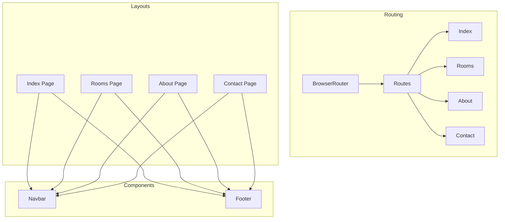
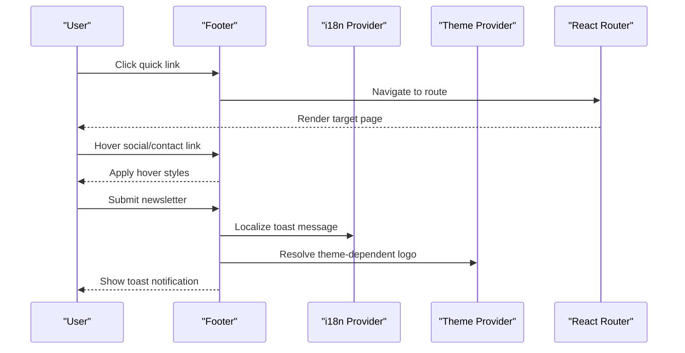
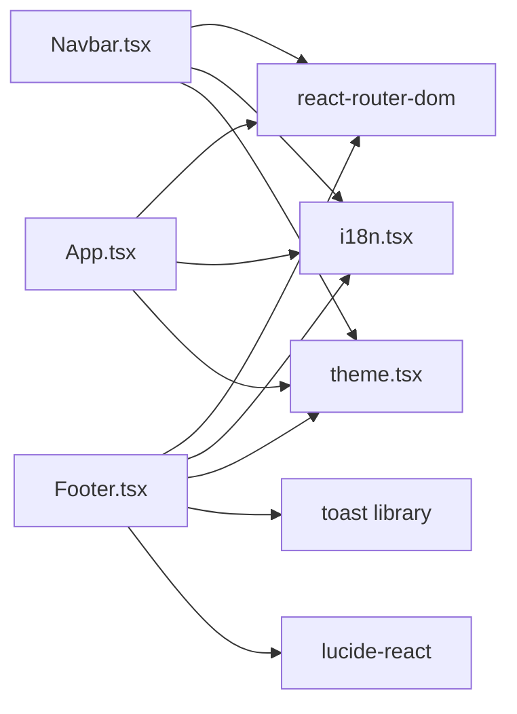

# Footer Navigation

<cite>
**Referenced Files in This Document**
- [Footer.tsx](file://src/components/Footer.tsx)
- [Navbar.tsx](file://src/components/Navbar.tsx)
- [App.tsx](file://src/App.tsx)
- [Index.tsx](file://src/pages/Index.tsx)
- [About.tsx](file://src/pages/About.tsx)
- [Contact.tsx](file://src/pages/Contact.tsx)
- [Rooms.tsx](file://src/pages/Rooms.tsx)
- [i18n.tsx](file://src/lib/i18n.tsx)
- [theme.tsx](file://src/lib/theme.tsx)
- [NavLink.tsx](file://src/components/NavLink.tsx)
- [robots.txt](file://public/robots.txt)
- [package.json](file://package.json)
</cite>

## Table of Contents
1. [Introduction](#introduction)
2. [Project Structure](#project-structure)
3. [Core Components](#core-components)
4. [Architecture Overview](#architecture-overview)
5. [Detailed Component Analysis](#detailed-component-analysis)
6. [Dependency Analysis](#dependency-analysis)
7. [Performance Considerations](#performance-considerations)
8. [Troubleshooting Guide](#troubleshooting-guide)
9. [Conclusion](#conclusion)
10. [Appendices](#appendices)

## Introduction
This document describes the footer navigation system used across the site. It explains the footer layout structure, link organization, newsletter subscription, social media presence, and contact information display. It also covers internal linking strategy, external link handling, accessibility features, responsive behavior, integration with the overall site navigation, SEO considerations, and content management practices.

## Project Structure
The footer is integrated into several page layouts and shares common internationalization and theming contexts. The routing configuration defines the internal pages linked from the footer.

**Diagram sources**
- [App.tsx](file://src/App.tsx#L19-L38)
- [Index.tsx](file://src/pages/Index.tsx#L12-L24)
- [Rooms.tsx](file://src/pages/Rooms.tsx#L21-L98)
- [About.tsx](file://src/pages/About.tsx#L7-L53)
- [Contact.tsx](file://src/pages/Contact.tsx#L9-L129)

**Section sources**
- [App.tsx](file://src/App.tsx#L19-L38)
- [Index.tsx](file://src/pages/Index.tsx#L12-L24)

## Core Components
The footer is composed of four primary sections:
- Brand area: logo, tagline, and social media icons
- Quick links: internal navigation to core pages
- Contact information: address, phone, and email
- Newsletter subscription: email capture form

It also displays a copyright notice and respects the current theme for logo visibility.

Key implementation patterns:
- Internal links use React Router’s Link for SPA navigation
- External links use anchor tags with appropriate protocols (tel:, mailto:)
- Social media links are presentational anchors with icon buttons
- Newsletter form uses controlled state and a toast notification upon submission
- Internationalization keys drive all visible text
- Theme-aware logo selection ensures readability in light/dark modes

**Section sources**
- [Footer.tsx](file://src/components/Footer.tsx#L13-L101)
- [i18n.tsx](file://src/lib/i18n.tsx#L104-L113)
- [theme.tsx](file://src/lib/theme.tsx#L12-L31)

## Architecture Overview
The footer participates in a shared layout pattern across pages. It relies on:
- Routing: internal navigation via React Router
- Localization: i18n provider for translatable strings
- Theming: theme provider for dynamic logo and color scheme
- Notifications: toast library for user feedback

**Diagram sources**
- [Footer.tsx](file://src/components/Footer.tsx#L13-L101)
- [i18n.tsx](file://src/lib/i18n.tsx#L148-L172)
- [theme.tsx](file://src/lib/theme.tsx#L12-L31)
- [App.tsx](file://src/App.tsx#L5-L6)

## Detailed Component Analysis

### Footer Layout and Sections
The footer uses a responsive grid:
- On small screens: stacked vertically
- On medium screens: two columns
- On large screens: four columns (brand, quick links, contact, newsletter)

Each column is semantically structured with headings and lists of links or information blocks.

Accessibility and UX:
- Links are styled for clear hover/focus affordances
- Newsletter input is marked as required
- Social media icons are interactive buttons with visible focus states
- Contact phone/email links use semantic protocols for native app integration

Internationalization:
- All visible text is driven by translation keys
- The tagline and section titles are localized
- Placeholder text for the newsletter is localized

Theming:
- Logo switches between black and white depending on theme
- Background and border classes provide contrast against the page content

**Section sources**
- [Footer.tsx](file://src/components/Footer.tsx#L25-L99)
- [i18n.tsx](file://src/lib/i18n.tsx#L104-L113)
- [theme.tsx](file://src/lib/theme.tsx#L12-L31)

### Internal Linking Strategy
The footer maintains a canonical set of internal pages:
- Home
- Rooms & Suites
- Amenities
- Gallery
- Offers
- About
- Contact

These are consistently mapped to routes and localized under navigation keys. The Navbar reuses the same navKeys and paths, ensuring alignment between top-level navigation and footer links.

Integration with overall navigation:
- Both Navbar and Footer use the same keys and paths
- The Navbar highlights the active page; the Footer does not require active state styling for internal links
- The “Book Now” call-to-action appears in the Navbar but not in the Footer

**Section sources**
- [Footer.tsx](file://src/components/Footer.tsx#L10-L11)
- [Footer.tsx](file://src/components/Footer.tsx#L54-L58)
- [Navbar.tsx](file://src/components/Navbar.tsx#L9-L11)
- [Navbar.tsx](file://src/components/Navbar.tsx#L33-L43)

### External Link Handling
External and semi-external links are handled as follows:
- Phone numbers use tel: protocol to enable click-to-call
- Email addresses use mailto: protocol to open default mail client
- Social media profiles are represented as placeholders with icon buttons
- Contact page includes additional external links (WhatsApp, Telegram) with proper target and rel attributes

Security and usability:
- External links open in new windows/tabs with rel="noopener noreferrer"
- Native protocols integrate with device capabilities (calls, emails)

**Section sources**
- [Footer.tsx](file://src/components/Footer.tsx#L67-L72)
- [Contact.tsx](file://src/pages/Contact.tsx#L96-L109)
- [Contact.tsx](file://src/pages/Contact.tsx#L110-L116)

### Newsletter Subscription
The newsletter form:
- Uses a controlled input bound to local state
- Requires a non-empty email address
- Submits via a button inside a form element
- Displays a localized toast message upon successful submission

User feedback:
- Toast notifications confirm submission
- Input placeholder is localized

**Section sources**
- [Footer.tsx](file://src/components/Footer.tsx#L76-L93)
- [Footer.tsx](file://src/components/Footer.tsx#L18-L23)
- [i18n.tsx](file://src/lib/i18n.tsx#L108-L112)

### Social Media and Contact Information
Social media:
- Icons are rendered as clickable buttons with consistent sizing and spacing
- Links are currently placeholders; update with real URLs as needed

Contact information:
- Address is displayed as static text
- Phone and email are presented as actionable links
- Additional contact channels (WhatsApp, Telegram) are available on the dedicated Contact page

**Section sources**
- [Footer.tsx](file://src/components/Footer.tsx#L37-L47)
- [Footer.tsx](file://src/components/Footer.tsx#L65-L73)
- [Contact.tsx](file://src/pages/Contact.tsx#L80-L124)

### Responsive Behavior
Responsive breakpoints:
- Mobile-first design with stacked layout on small screens
- Two-column layout on medium screens
- Four-column layout on large screens

Interactive elements:
- Mobile menu toggles in the Navbar; the Footer remains static
- Newsletter input and button stack vertically on narrow screens
- Hover states and transitions remain consistent across breakpoints

**Section sources**
- [Footer.tsx](file://src/components/Footer.tsx#L28-L94)

### Accessibility Features
Observed accessibility considerations:
- Semantic headings for each section
- Descriptive alt text for the logo image
- Focus-friendly interactive elements (buttons, links)
- Clear hover/focus visual indicators
- Proper labeling for form inputs (placeholder acts as hint; consider aria-labels for improved accessibility)

Areas to enhance:
- Add explicit aria-labels for social media buttons
- Ensure sufficient color contrast in both light and dark themes
- Consider adding skip links or landmark roles for screen reader users

**Section sources**
- [Footer.tsx](file://src/components/Footer.tsx#L31-L35)
- [Footer.tsx](file://src/components/Footer.tsx#L37-L47)
- [Footer.tsx](file://src/components/Footer.tsx#L79-L92)

### Integration with Overall Site Navigation
The Footer mirrors the Navbar’s internal navigation structure:
- Same navKeys and paths ensure consistency
- Localization keys align across components
- Theme-aware branding remains consistent

This alignment improves user orientation and reduces cognitive load when navigating between pages.

**Section sources**
- [Footer.tsx](file://src/components/Footer.tsx#L10-L11)
- [Navbar.tsx](file://src/components/Navbar.tsx#L9-L11)
- [Navbar.tsx](file://src/components/Navbar.tsx#L33-L43)

### Sitemap Functionality
Current implementation:
- No dedicated sitemap page or XML sitemap is generated
- All internal pages are defined in the routing configuration

Recommendations:
- Generate a static sitemap page listing all routes
- Consider an XML sitemap for SEO indexing
- Keep sitemap synchronized with route changes

**Section sources**
- [App.tsx](file://src/App.tsx#L27-L36)

## Dependency Analysis
The footer depends on:
- React Router for internal navigation
- i18n provider for localized strings
- Theme provider for theme-aware rendering
- Toast library for user feedback
- Lucide icons for social media and decorative elements

**Diagram sources**
- [Footer.tsx](file://src/components/Footer.tsx#L1-L8)
- [Navbar.tsx](file://src/components/Navbar.tsx#L1-L7)
- [App.tsx](file://src/App.tsx#L5-L7)

**Section sources**
- [Footer.tsx](file://src/components/Footer.tsx#L1-L8)
- [Navbar.tsx](file://src/components/Navbar.tsx#L1-L7)
- [App.tsx](file://src/App.tsx#L5-L7)

## Performance Considerations
- Footer renders frequently as part of page layouts; keep markup minimal
- Avoid heavy assets; logos are imported statically
- Use lazy loading for images if gallery content grows
- Minimize re-renders by keeping state scoped to the footer (e.g., newsletter input)

## Troubleshooting Guide
Common issues and resolutions:
- Links not working internally
  - Verify navKeys and paths match the routing configuration
  - Confirm that the Routes are mounted in the application shell

- Newsletter form not submitting
  - Ensure the input is required and the form handler prevents empty submissions
  - Check that the toast library is initialized in the app shell

- Social media links not opening
  - Replace placeholder anchors with real URLs
  - Ensure external links use target="_blank" and rel="noopener noreferrer" when appropriate

- Incorrect logo in dark mode
  - Confirm theme state persists and the logo selection logic is applied
  - Verify asset availability for both light and dark variants

- Missing translations
  - Add missing keys to the i18n translation map
  - Ensure the language is persisted in local storage

**Section sources**
- [Footer.tsx](file://src/components/Footer.tsx#L18-L23)
- [Footer.tsx](file://src/components/Footer.tsx#L37-L47)
- [Footer.tsx](file://src/components/Footer.tsx#L79-L92)
- [i18n.tsx](file://src/lib/i18n.tsx#L148-L172)
- [theme.tsx](file://src/lib/theme.tsx#L12-L31)

## Conclusion
The footer navigation system is a cohesive, theme-aware, and internationally localized component that integrates seamlessly with the site’s routing and layout. Its structure supports internal navigation, contact information, and newsletter subscription while maintaining responsive design and accessibility. Enhancements around sitemap generation, external link management, and accessibility can further improve SEO and user experience.

## Appendices

### Footer Content Organization Examples
- Brand area: logo, tagline, social icons
- Quick links: Home, Rooms & Suites, Amenities, Gallery, Offers, About, Contact
- Contact: Address, phone, email
- Newsletter: Input field with subscribe button

**Section sources**
- [Footer.tsx](file://src/components/Footer.tsx#L25-L99)
- [i18n.tsx](file://src/lib/i18n.tsx#L104-L113)

### SEO Considerations
- robots.txt allows indexing by major crawlers
- Internal links support crawlability; ensure all pages are routed
- Consider adding a sitemap page or XML sitemap
- Use semantic headings and concise link text for clarity

**Section sources**
- [robots.txt](file://public/robots.txt#L1-L15)
- [App.tsx](file://src/App.tsx#L27-L36)

### Footer Content Management
- Centralized localization keys in i18n.tsx
- Theme-aware assets and styles
- Controlled state for newsletter input
- Toast notifications for user feedback

**Section sources**
- [i18n.tsx](file://src/lib/i18n.tsx#L104-L113)
- [theme.tsx](file://src/lib/theme.tsx#L12-L31)
- [Footer.tsx](file://src/components/Footer.tsx#L18-L23)