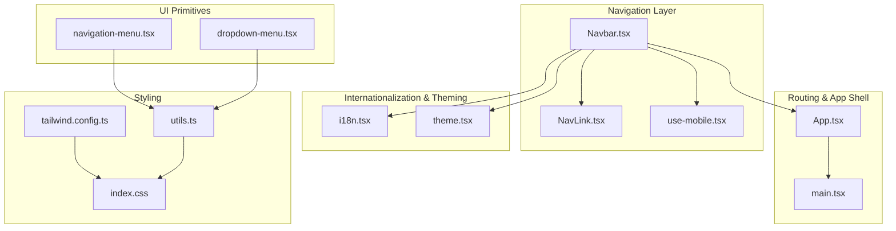
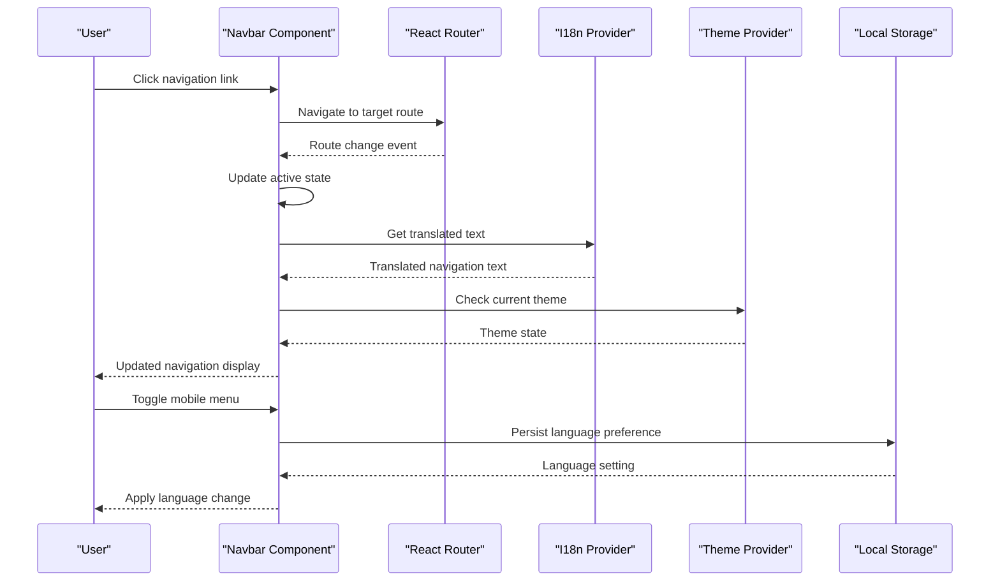
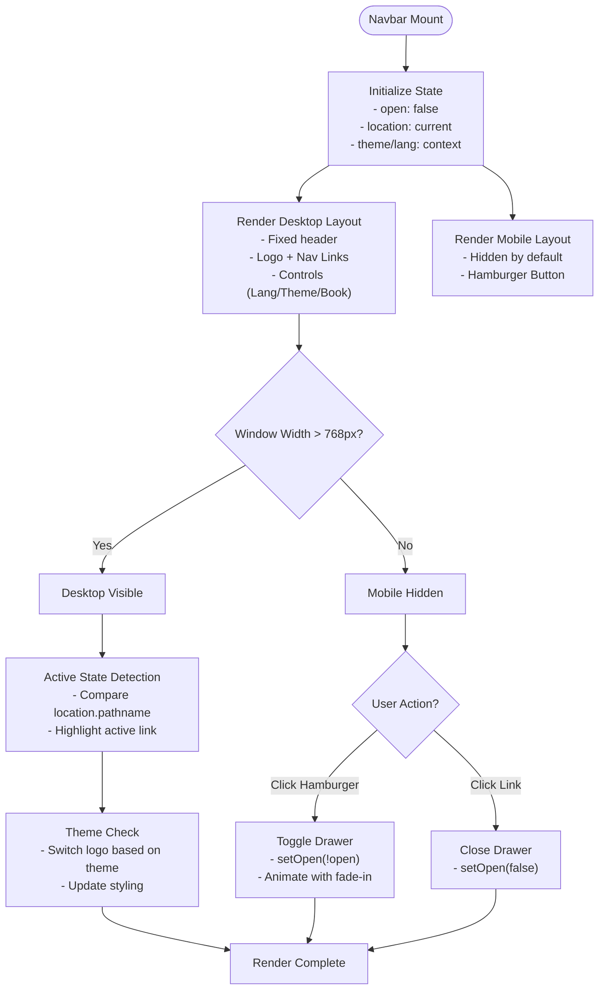
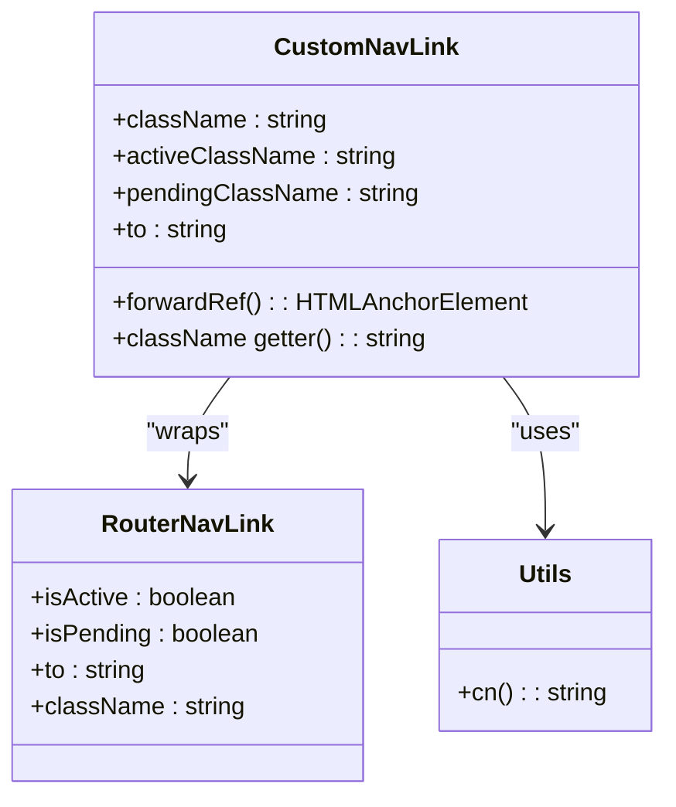
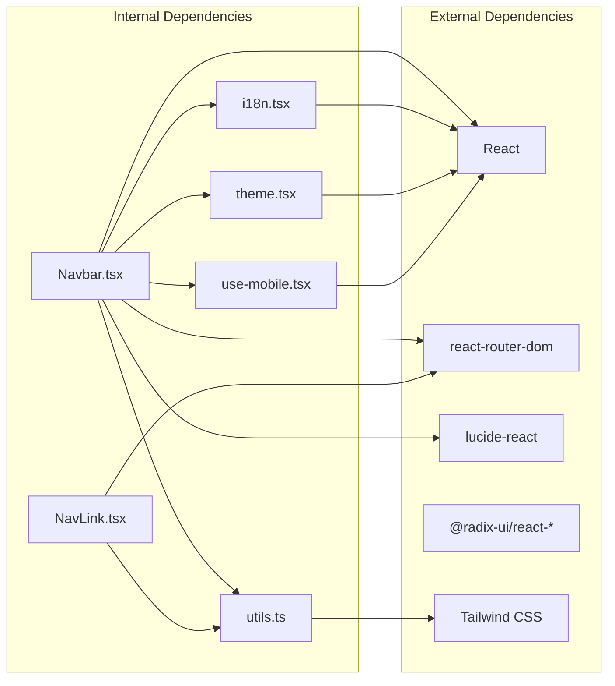

# Navigation Bar

<cite>
**Referenced Files in This Document**
- [Navbar.tsx](file://src/components/Navbar.tsx)
- [NavLink.tsx](file://src/components/NavLink.tsx)
- [use-mobile.tsx](file://src/hooks/use-mobile.tsx)
- [navigation-menu.tsx](file://src/components/ui/navigation-menu.tsx)
- [dropdown-menu.tsx](file://src/components/ui/dropdown-menu.tsx)
- [i18n.tsx](file://src/lib/i18n.tsx)
- [theme.tsx](file://src/lib/theme.tsx)
- [App.tsx](file://src/App.tsx)
- [main.tsx](file://src/main.tsx)
- [tailwind.config.ts](file://tailwind.config.ts)
- [utils.ts](file://src/lib/utils.ts)
- [index.css](file://src/index.css)
</cite>

## Table of Contents
1. [Introduction](#introduction)
2. [Project Structure](#project-structure)
3. [Core Components](#core-components)
4. [Architecture Overview](#architecture-overview)
5. [Detailed Component Analysis](#detailed-component-analysis)
6. [Dependency Analysis](#dependency-analysis)
7. [Performance Considerations](#performance-considerations)
8. [Troubleshooting Guide](#troubleshooting-guide)
9. [Conclusion](#conclusion)

## Introduction
This document provides comprehensive documentation for the navigation bar implementation and custom NavLink component. It covers the Navbar component structure, responsive design patterns, mobile navigation behavior, the NavLink component's active state detection and styling variants, accessibility features, integration with the routing system, active link highlighting, navigation state management, mobile-first design principles, hamburger menu implementation, and navigation performance optimization.

## Project Structure
The navigation system is composed of several key files:
- Navbar.tsx: Implements the main navigation bar with desktop and mobile layouts
- NavLink.tsx: Provides a custom NavLink wrapper for enhanced active/pending state handling
- use-mobile.tsx: Hook for detecting mobile viewport width
- navigation-menu.tsx: Radix UI navigation menu primitives for advanced dropdowns
- dropdown-menu.tsx: Radix UI dropdown menu primitives for contextual menus
- i18n.tsx: Internationalization provider and translation keys for navigation labels
- theme.tsx: Theme provider for light/dark mode support
- App.tsx: Application shell with routing configuration
- Tailwind CSS configuration and utility classes for responsive design
- Global styles for glass effects and animations

**Diagram sources**
- [Navbar.tsx](file://src/components/Navbar.tsx#L1-L133)
- [NavLink.tsx](file://src/components/NavLink.tsx#L1-L29)
- [use-mobile.tsx](file://src/hooks/use-mobile.tsx#L1-L20)
- [navigation-menu.tsx](file://src/components/ui/navigation-menu.tsx#L1-L121)
- [dropdown-menu.tsx](file://src/components/ui/dropdown-menu.tsx#L1-L180)
- [i18n.tsx](file://src/lib/i18n.tsx#L1-L173)
- [theme.tsx](file://src/lib/theme.tsx#L1-L36)
- [App.tsx](file://src/App.tsx#L1-L45)
- [main.tsx](file://src/main.tsx#L1-L6)
- [tailwind.config.ts](file://tailwind.config.ts#L1-L86)
- [utils.ts](file://src/lib/utils.ts#L1-L7)
- [index.css](file://src/index.css#L1-L146)

**Section sources**
- [Navbar.tsx](file://src/components/Navbar.tsx#L1-L133)
- [App.tsx](file://src/App.tsx#L1-L45)
- [tailwind.config.ts](file://tailwind.config.ts#L1-L86)

## Core Components
The navigation system consists of two primary components:

### Navbar Component
The Navbar component serves as the main navigation container with the following key features:
- Fixed positioning at the top of the page
- Responsive layout with desktop and mobile variants
- Brand/logo with theme-aware switching
- Navigation links with active state highlighting
- Language selector with persistent storage
- Theme toggle with system preference detection
- Call-to-action button for bookings
- Mobile hamburger menu with animated drawer

### Custom NavLink Component
The custom NavLink component provides enhanced active state detection:
- Wraps react-router-dom's NavLink with additional props
- Supports activeClassName and pendingClassName for flexible styling
- Uses forwardRef for DOM access
- Integrates with the cn utility for conditional class merging

**Section sources**
- [Navbar.tsx](file://src/components/Navbar.tsx#L13-L133)
- [NavLink.tsx](file://src/components/NavLink.tsx#L1-L29)

## Architecture Overview
The navigation architecture follows a layered approach with clear separation of concerns:

**Diagram sources**
- [Navbar.tsx](file://src/components/Navbar.tsx#L14-L17)
- [i18n.tsx](file://src/lib/i18n.tsx#L148-L173)
- [theme.tsx](file://src/lib/theme.tsx#L12-L36)

The architecture integrates with:
- React Router for navigation state management
- Context providers for i18n and theme state
- Local storage for persistence
- Tailwind CSS for responsive styling
- Radix UI for advanced interactive components

## Detailed Component Analysis

### Navbar Component Analysis
The Navbar component implements a sophisticated navigation system with multiple design patterns:

#### Desktop Navigation Pattern
Desktop navigation uses a flex layout with:
- Fixed height container (h-20)
- Responsive padding (px-4 lg:px-8)
- Gap-based spacing (gap-1)
- Active state highlighting using pathname comparison
- Hover effects with transition animations

#### Mobile Navigation Implementation
Mobile navigation employs a hamburger menu with:
- Breakpoint at 768px (lg breakpoint)
- Animated drawer with fade-in transition
- Full-width navigation links
- Persistent language selector
- Book now button with mobile styling

#### Brand/Logo Placement
The logo is implemented as a premium glass container:
- Glass effect with backdrop blur
- Theme-aware logo switching (black/white)
- Hover effects with brightness transitions
- Rounded corners with glass border styling

#### State Management
The component manages state through:
- useState for mobile menu open/close
- useLocation for active route detection
- Context hooks for i18n and theme
- Local storage for persistence

**Diagram sources**
- [Navbar.tsx](file://src/components/Navbar.tsx#L16-L133)
- [use-mobile.tsx](file://src/hooks/use-mobile.tsx#L3-L19)

**Section sources**
- [Navbar.tsx](file://src/components/Navbar.tsx#L1-L133)
- [use-mobile.tsx](file://src/hooks/use-mobile.tsx#L1-L20)

### Custom NavLink Component Analysis
The custom NavLink component provides enhanced functionality:

#### Active State Detection
The component wraps react-router-dom's NavLink to provide:
- isActive detection for active state styling
- isPending detection for loading states
- Custom activeClassName prop for styling variants
- pendingClassName prop for loading indicators

#### Styling Integration
Implementation uses:
- forwardRef for DOM access
- cn utility for conditional class merging
- Props forwarding for seamless integration

**Diagram sources**
- [NavLink.tsx](file://src/components/NavLink.tsx#L11-L24)
- [utils.ts](file://src/lib/utils.ts#L4-L6)

**Section sources**
- [NavLink.tsx](file://src/components/NavLink.tsx#L1-L29)
- [utils.ts](file://src/lib/utils.ts#L1-L7)

### Responsive Design Patterns
The navigation system implements mobile-first responsive design:

#### Breakpoint Strategy
- Mobile breakpoint: 768px (lg in Tailwind)
- Desktop layout: hidden below lg breakpoint
- Mobile layout: hidden above lg breakpoint

#### Glass Effect Implementation
The system uses CSS custom properties for glass effects:
- --glass-bg, --glass-border, --glass-shadow variables
- Dark/light mode variants
- Backdrop blur with saturation enhancement
- Multi-layered box shadows for depth

#### Animation System
- Fade-in animation for mobile drawer
- Smooth transitions for hover states
- Theme switching animations
- Responsive typography scaling

**Section sources**
- [Navbar.tsx](file://src/components/Navbar.tsx#L20-L133)
- [index.css](file://src/index.css#L92-L129)
- [tailwind.config.ts](file://tailwind.config.ts#L1-L86)

### Internationalization and Theming Integration
The navigation integrates with i18n and theme systems:

#### Translation Keys
Navigation labels are managed through:
- Translations for all supported languages (en, ru, uz)
- Context-based translation function
- Persistent language selection
- Dynamic text updates

#### Theme Awareness
The navbar adapts to theme changes:
- Logo switching between black/white
- Background and border styling adjustments
- Consistent theming across all components
- System preference detection

**Section sources**
- [i18n.tsx](file://src/lib/i18n.tsx#L5-L14)
- [i18n.tsx](file://src/lib/i18n.tsx#L148-L173)
- [theme.tsx](file://src/lib/theme.tsx#L12-L36)
- [Navbar.tsx](file://src/components/Navbar.tsx#L25-L30)

## Dependency Analysis
The navigation system has well-defined dependencies:

**Diagram sources**
- [Navbar.tsx](file://src/components/Navbar.tsx#L1-L8)
- [NavLink.tsx](file://src/components/NavLink.tsx#L1-L4)
- [i18n.tsx](file://src/lib/i18n.tsx#L1-L1)
- [theme.tsx](file://src/lib/theme.tsx#L1-L1)
- [utils.ts](file://src/lib/utils.ts#L1-L3)
- [use-mobile.tsx](file://src/hooks/use-mobile.tsx#L1-L3)

Key dependency relationships:
- Navbar depends on all state management hooks
- Custom NavLink depends only on react-router-dom and utility functions
- Both integrate with Tailwind CSS for styling
- No circular dependencies detected

**Section sources**
- [Navbar.tsx](file://src/components/Navbar.tsx#L1-L8)
- [NavLink.tsx](file://src/components/NavLink.tsx#L1-L4)

## Performance Considerations
The navigation system implements several performance optimizations:

### Rendering Optimizations
- Minimal re-renders through selective state management
- Memoized translation functions
- Efficient class name merging with cn utility
- Conditional rendering for mobile drawer

### Bundle Size Considerations
- Lazy loading of heavy components
- Tree-shaking enabled through modular imports
- Minimal external dependencies
- CSS-in-JS through Tailwind utilities

### Accessibility Features
- Proper ARIA labels for interactive elements
- Keyboard navigation support
- Focus management
- Screen reader compatibility
- Color contrast compliance

### Mobile Performance
- Hardware-accelerated animations
- CSS transforms instead of layout-affecting properties
- Optimized touch targets
- Reduced DOM complexity on mobile

## Troubleshooting Guide
Common issues and solutions:

### Active State Not Working
- Verify pathname comparison matches actual routes
- Check for trailing slashes in route definitions
- Ensure useLocation hook is properly imported

### Mobile Menu Issues
- Confirm breakpoint alignment with Tailwind configuration
- Check for CSS conflicts with global styles
- Verify event handlers are attached correctly

### Theme Switching Problems
- Ensure theme provider is properly wrapped around app
- Check local storage permissions
- Verify CSS custom properties are defined

### Internationalization Issues
- Confirm translation keys exist in i18n configuration
- Check language persistence in local storage
- Verify context provider wrapping order

**Section sources**
- [Navbar.tsx](file://src/components/Navbar.tsx#L14-L17)
- [i18n.tsx](file://src/lib/i18n.tsx#L148-L173)
- [theme.tsx](file://src/lib/theme.tsx#L12-L36)

## Conclusion
The navigation bar implementation demonstrates a comprehensive approach to modern web navigation with strong emphasis on:
- Mobile-first responsive design
- Enhanced user experience through glass effects and animations
- Internationalization and theming integration
- Performance optimization through efficient state management
- Accessibility compliance and cross-platform compatibility

The system provides a solid foundation for scalable navigation patterns while maintaining clean separation of concerns and extensible architecture for future enhancements.