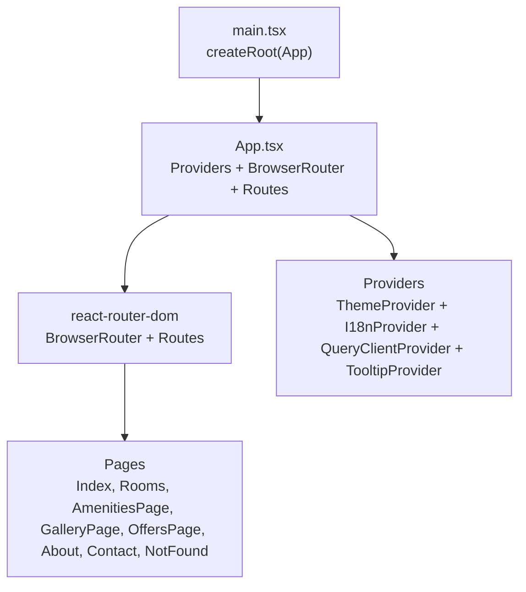
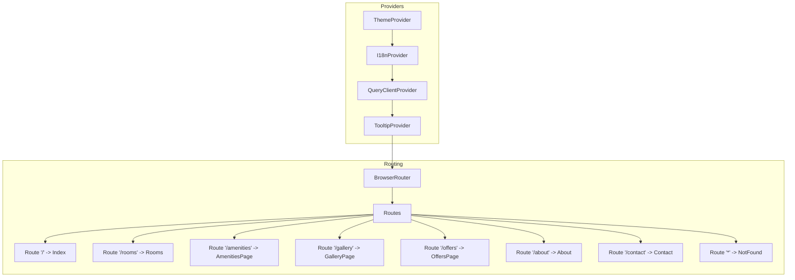
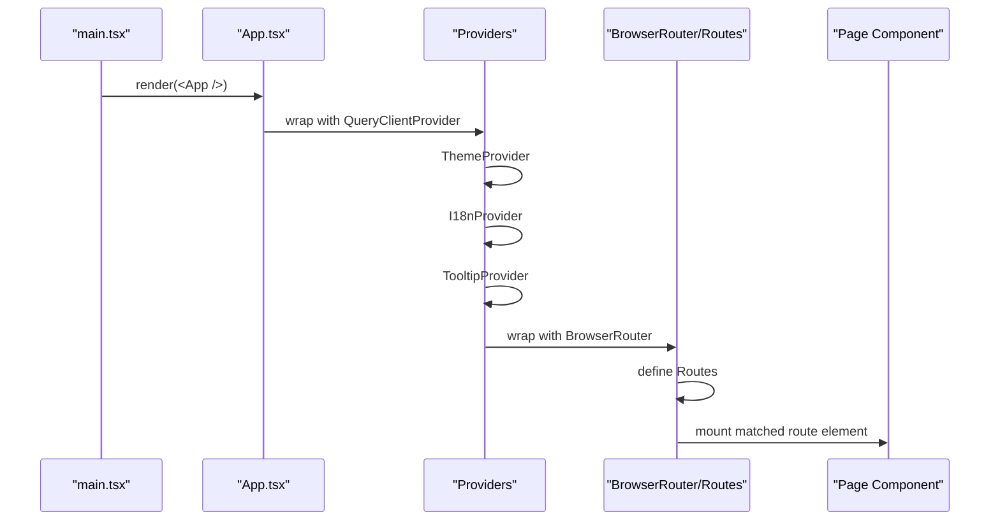
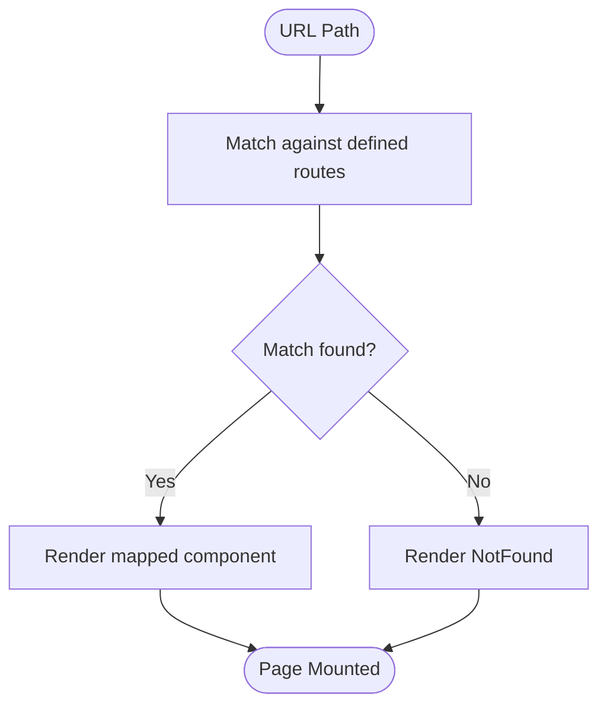
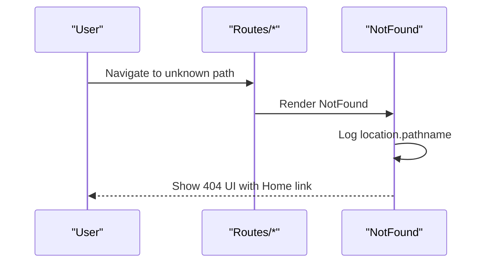
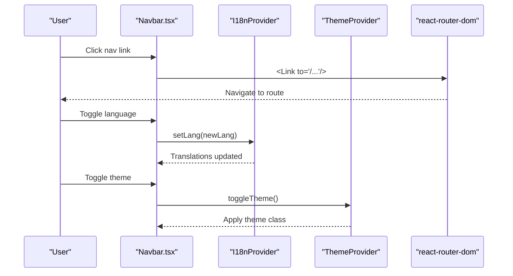
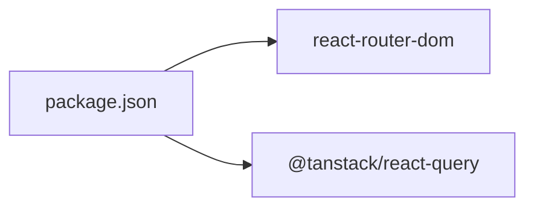

# Route Configuration

<cite>
**Referenced Files in This Document**
- [App.tsx](file://src/App.tsx)
- [main.tsx](file://src/main.tsx)
- [i18n.tsx](file://src/lib/i18n.tsx)
- [theme.tsx](file://src/lib/theme.tsx)
- [Navbar.tsx](file://src/components/Navbar.tsx)
- [Index.tsx](file://src/pages/Index.tsx)
- [Rooms.tsx](file://src/pages/Rooms.tsx)
- [AmenitiesPage.tsx](file://src/pages/AmenitiesPage.tsx)
- [GalleryPage.tsx](file://src/pages/GalleryPage.tsx)
- [OffersPage.tsx](file://src/pages/OffersPage.tsx)
- [About.tsx](file://src/pages/About.tsx)
- [Contact.tsx](file://src/pages/Contact.tsx)
- [NotFound.tsx](file://src/pages/NotFound.tsx)
- [package.json](file://package.json)
</cite>

## Table of Contents
1. [Introduction](#introduction)
2. [Project Structure](#project-structure)
3. [Core Components](#core-components)
4. [Architecture Overview](#architecture-overview)
5. [Detailed Component Analysis](#detailed-component-analysis)
6. [Dependency Analysis](#dependency-analysis)
7. [Performance Considerations](#performance-considerations)
8. [Troubleshooting Guide](#troubleshooting-guide)
9. [Conclusion](#conclusion)

## Introduction
This document explains the React Router DOM configuration and route definitions for the application. It covers the BrowserRouter setup, route hierarchy, URL-to-component mapping, and the provider hierarchy integration that enables theme, internationalization (i18n), and query providers to work seamlessly within the routing context. It also documents the catch-all NotFound route, navigation patterns, and considerations for future enhancements such as route protection and lazy loading.

## Project Structure
The routing is configured at the application root and wraps all pages. Providers are stacked to deliver theme, i18n, and query capabilities to routed components. The main entry point renders the root App component, which sets up routing and providers.

**Diagram sources**
- [main.tsx](file://src/main.tsx#L1-L6)
- [App.tsx](file://src/App.tsx#L1-L45)

**Section sources**
- [main.tsx](file://src/main.tsx#L1-L6)
- [App.tsx](file://src/App.tsx#L1-L45)

## Core Components
- BrowserRouter and Routes: The application uses a single BrowserRouter instance and a flat Routes list with explicit paths for each page plus a catch-all route.
- Provider hierarchy: ThemeProvider, I18nProvider, and QueryClientProvider wrap the router so that all pages inherit theme and i18n state and can use TanStack Query for caching and state management.
- Navigation: The Navbar component uses Link to navigate between routes and integrates with i18n and theme providers.

Key routing facts:
- Base URL is served from the root path "/".
- Explicit routes map to dedicated page components.
- Catch-all "*" maps to NotFound.

**Section sources**
- [App.tsx](file://src/App.tsx#L1-L45)
- [Navbar.tsx](file://src/components/Navbar.tsx#L1-L133)
- [NotFound.tsx](file://src/pages/NotFound.tsx#L1-L25)

## Architecture Overview
The routing architecture is a straightforward single-page application with a flat route tree. Providers are positioned outside the router to ensure they are available to all routed components.

**Diagram sources**
- [App.tsx](file://src/App.tsx#L1-L45)
- [i18n.tsx](file://src/lib/i18n.tsx#L1-L173)
- [theme.tsx](file://src/lib/theme.tsx#L1-L36)

## Detailed Component Analysis

### BrowserRouter and Provider Setup
- BrowserRouter is declared once at the root and contains the Routes collection.
- Providers are nested inside out: QueryClientProvider outermost, then ThemeProvider, then I18nProvider, then TooltipProvider, wrapping the router.
- This order ensures that:
  - QueryClientProvider initializes caching and background updates for all pages.
  - ThemeProvider applies theme preferences and toggles.
  - I18nProvider supplies translation keys and language switching.
  - TooltipProvider enables interactive tooltips across pages.

**Diagram sources**
- [main.tsx](file://src/main.tsx#L1-L6)
- [App.tsx](file://src/App.tsx#L1-L45)

**Section sources**
- [App.tsx](file://src/App.tsx#L1-L45)
- [i18n.tsx](file://src/lib/i18n.tsx#L1-L173)
- [theme.tsx](file://src/lib/theme.tsx#L1-L36)

### Route Definitions and URL-to-Component Mapping
- "/" → Index
- "/rooms" → Rooms
- "/amenities" → AmenitiesPage
- "/gallery" → GalleryPage
- "/offers" → OffersPage
- "/about" → About
- "/contact" → Contact
- "*" → NotFound

These routes are defined directly under a single Routes block, resulting in a flat route tree with no nested routes.

**Diagram sources**
- [App.tsx](file://src/App.tsx#L26-L36)

**Section sources**
- [App.tsx](file://src/App.tsx#L26-L36)

### Catch-All NotFound Route
- The "*" route renders NotFound, which logs the attempted path and displays a friendly 404 UI with a link back to the home page.
- NotFound uses react-router-dom’s useLocation hook to access the current pathname for logging.

**Diagram sources**
- [App.tsx](file://src/App.tsx#L35-L35)
- [NotFound.tsx](file://src/pages/NotFound.tsx#L1-L25)

**Section sources**
- [App.tsx](file://src/App.tsx#L35-L35)
- [NotFound.tsx](file://src/pages/NotFound.tsx#L1-L25)

### Navigation and Integration with Providers
- The Navbar component demonstrates navigation via Link and integrates with i18n and theme providers.
- It maintains an internal open state for mobile menu and uses location-aware highlighting for active links.
- The Navbar also exposes language switching and theme toggling, both powered by the i18n and theme providers.

**Diagram sources**
- [Navbar.tsx](file://src/components/Navbar.tsx#L1-L133)
- [i18n.tsx](file://src/lib/i18n.tsx#L148-L168)
- [theme.tsx](file://src/lib/theme.tsx#L12-L31)

**Section sources**
- [Navbar.tsx](file://src/components/Navbar.tsx#L1-L133)
- [i18n.tsx](file://src/lib/i18n.tsx#L148-L168)
- [theme.tsx](file://src/lib/theme.tsx#L12-L31)

### Route Parameters and Nested Routing Patterns
- Current configuration does not define any route parameters (e.g., ":id").
- There are no nested routes; all routes are top-level.
- No programmatic navigation is demonstrated in the provided files.

Implications:
- Parameterized routes (e.g., "/rooms/:id") and nested layouts would require adding Route nesting and potentially Outlet usage, which is not present here.
- Programmatic navigation (e.g., useNavigate) is not used in the provided files.

**Section sources**
- [App.tsx](file://src/App.tsx#L26-L36)
- [Navbar.tsx](file://src/components/Navbar.tsx#L1-L133)

### Route Protection Strategies
- No route guards or authentication checks are implemented in the provided files.
- To protect routes, consider adding a guard component or wrapper around specific Routes and checking authentication state before rendering.

[No sources needed since this section provides general guidance]

### Lazy Loading Considerations
- The current implementation imports all page components statically.
- For performance, especially as the app grows, consider lazy-loading routes using React.lazy and Suspense around the router to reduce initial bundle size.

[No sources needed since this section provides general guidance]

## Dependency Analysis
External dependencies relevant to routing and providers:
- react-router-dom: Provides BrowserRouter, Routes, Route, Link, and useLocation.
- @tanstack/react-query: Provides QueryClient and QueryClientProvider for caching and state management.

**Diagram sources**
- [package.json](file://package.json#L58-L44)

**Section sources**
- [package.json](file://package.json#L58-L44)

## Performance Considerations
- Flat route tree keeps navigation predictable and fast.
- Static imports of page components simplify bundling but increase initial payload.
- As the app scales, consider:
  - Code-splitting routes with lazy loading.
  - Using prefetching and background queries with TanStack Query to improve perceived performance.
  - Minimizing heavy computations in route components during initial render.

[No sources needed since this section provides general guidance]

## Troubleshooting Guide
- 404 handling: NotFound logs the attempted path and shows a fallback UI. Verify that the "*" route is placed last in the Routes list to act as a catch-all.
- Provider order: Ensure providers are ordered correctly (QueryClientProvider outermost, then ThemeProvider, then I18nProvider, then TooltipProvider) to avoid provider conflicts.
- Navigation: Confirm that Link targets match the defined routes and that Navbar language/theme toggles update state as expected.

**Section sources**
- [App.tsx](file://src/App.tsx#L1-L45)
- [NotFound.tsx](file://src/pages/NotFound.tsx#L1-L25)
- [Navbar.tsx](file://src/components/Navbar.tsx#L1-L133)

## Conclusion
The application uses a clean, flat routing configuration with BrowserRouter and a single Routes block. Providers are layered to support theme, i18n, and query functionality across all pages. The current setup is simple and effective for a small to medium-sized site. Future enhancements could include parameterized routes, nested layouts, route guards, and lazy loading to improve scalability and performance.