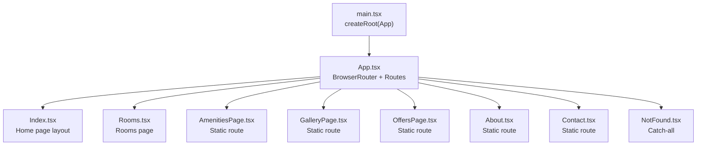
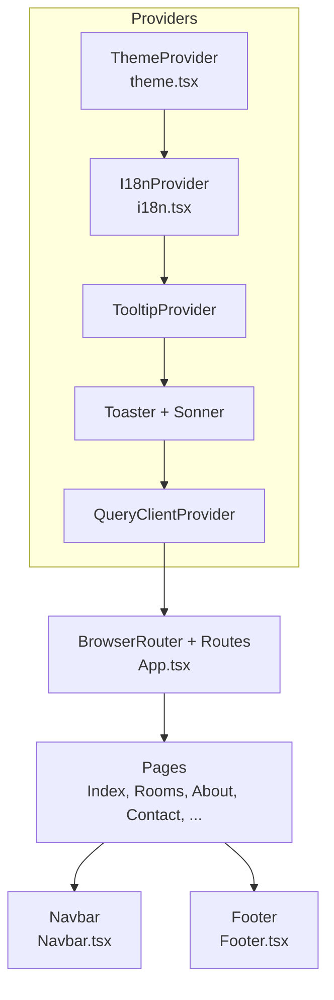
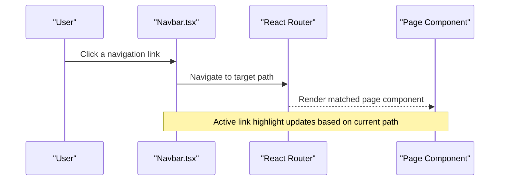
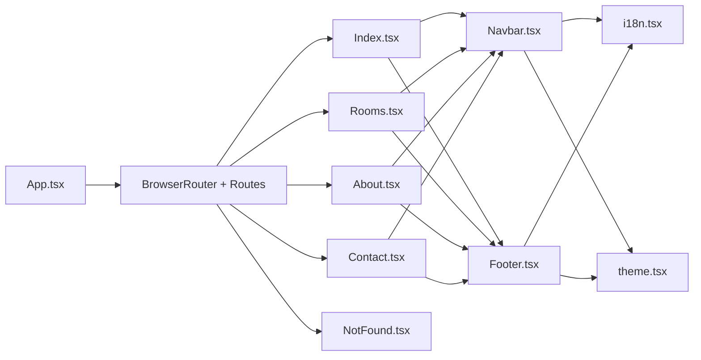

# Routing and Navigation

<cite>
**Referenced Files in This Document**
- [App.tsx](file://src/App.tsx)
- [main.tsx](file://src/main.tsx)
- [Navbar.tsx](file://src/components/Navbar.tsx)
- [Footer.tsx](file://src/components/Footer.tsx)
- [NavLink.tsx](file://src/components/NavLink.tsx)
- [Index.tsx](file://src/pages/Index.tsx)
- [NotFound.tsx](file://src/pages/NotFound.tsx)
- [Rooms.tsx](file://src/pages/Rooms.tsx)
- [About.tsx](file://src/pages/About.tsx)
- [Contact.tsx](file://src/pages/Contact.tsx)
- [i18n.tsx](file://src/lib/i18n.tsx)
- [theme.tsx](file://src/lib/theme.tsx)
</cite>

## Table of Contents
1. [Introduction](#introduction)
2. [Project Structure](#project-structure)
3. [Core Components](#core-components)
4. [Architecture Overview](#architecture-overview)
5. [Detailed Component Analysis](#detailed-component-analysis)
6. [Dependency Analysis](#dependency-analysis)
7. [Performance Considerations](#performance-considerations)
8. [Troubleshooting Guide](#troubleshooting-guide)
9. [Conclusion](#conclusion)
10. [Appendices](#appendices)

## Introduction
This document explains the client-side routing and navigation system used by the application. It covers the React Router DOM configuration, route definitions, navigation patterns, and the implementation of the navbar and footer. It also documents active link highlighting, responsive navigation behavior, programmatic navigation, route parameters, query string handling, SEO considerations, mobile navigation patterns, accessibility features, performance optimization, guidelines for adding new routes, protected routes, and error handling.

## Project Structure
The routing and navigation system centers around a single-page application built with React Router DOM. The application mounts the router at the root and defines static routes for each page. Navigation is implemented via two primary components: a responsive navbar and a footer with quick links. Internationalization and theme providers wrap the routing tree to support dynamic content and appearance.

**Diagram sources**
- [main.tsx](file://src/main.tsx#L1-L6)
- [App.tsx](file://src/App.tsx#L19-L42)

**Section sources**
- [main.tsx](file://src/main.tsx#L1-L6)
- [App.tsx](file://src/App.tsx#L1-L45)

## Core Components
- Router bootstrap: The application initializes React Router DOM and wraps the entire app in providers for theme, internationalization, tooltips, and global notifications.
- Route definitions: Static routes are declared under a single Routes block, mapping URL paths to page components. A catch-all route renders a dedicated 404 page.
- Navigation components:
  - Navbar: Desktop and mobile navigation with active link highlighting, language switching, theme toggle, and a “Book Now” call-to-action.
  - Footer: Quick links to main pages and newsletter subscription.
- Navigation utilities:
  - NavLink wrapper: A thin wrapper around react-router-dom’s NavLink that supports active/pending class names via a composable API.

Key implementation references:
- Router and routes: [App.tsx](file://src/App.tsx#L26-L36)
- Navbar: [Navbar.tsx](file://src/components/Navbar.tsx#L13-L132)
- Footer: [Footer.tsx](file://src/components/Footer.tsx#L13-L102)
- NavLink: [NavLink.tsx](file://src/components/NavLink.tsx#L11-L24)

**Section sources**
- [App.tsx](file://src/App.tsx#L1-L45)
- [Navbar.tsx](file://src/components/Navbar.tsx#L1-L133)
- [Footer.tsx](file://src/components/Footer.tsx#L1-L103)
- [NavLink.tsx](file://src/components/NavLink.tsx#L1-L29)

## Architecture Overview
The routing architecture is a flat, static route configuration. Providers are layered around the router to supply theme and i18n contexts. Pages are self-contained and import the shared Navbar and Footer.

**Diagram sources**
- [App.tsx](file://src/App.tsx#L19-L42)
- [theme.tsx](file://src/lib/theme.tsx#L12-L30)
- [i18n.tsx](file://src/lib/i18n.tsx#L148-L167)
- [Navbar.tsx](file://src/components/Navbar.tsx#L13-L132)
- [Footer.tsx](file://src/components/Footer.tsx#L13-L102)

## Detailed Component Analysis

### Router Configuration and Route Definitions
- Router initialization: The application uses a single BrowserRouter mounted at the root.
- Route table: Routes are defined statically under a single Routes block. Paths include home, rooms, amenities, gallery, offers, about, contact, and a catch-all for 404.
- Provider order: Theme provider, i18n provider, tooltip provider, and notification providers wrap the router.

Implementation references:
- Router and routes: [App.tsx](file://src/App.tsx#L26-L36)
- Provider composition: [App.tsx](file://src/App.tsx#L20-L41)

**Section sources**
- [App.tsx](file://src/App.tsx#L1-L45)

### Navbar Implementation and Active Link Highlighting
- Navigation keys and paths: A shared tuple of navigation keys and a matching tuple of paths ensures consistency between labels and URLs.
- Active link detection: On desktop, the current path is compared against each route path to apply an active style.
- Responsive behavior:
  - Desktop: Horizontal links with hover and active states.
  - Mobile: Collapsible drawer triggered by a hamburger menu; clicking a link closes the drawer.
- Additional controls:
  - Language switcher: Renders three language options; selection updates the i18n context and persists language preference.
  - Theme toggle: Switches between light and dark themes and persists the preference.
  - “Book Now”: A link to a section anchor on the home page.

Implementation references:
- Keys and paths: [Navbar.tsx](file://src/components/Navbar.tsx#L9-L11)
- Active link logic: [Navbar.tsx](file://src/components/Navbar.tsx#L35-L46)
- Mobile drawer: [Navbar.tsx](file://src/components/Navbar.tsx#L94-L129)
- Language and theme controls: [Navbar.tsx](file://src/components/Navbar.tsx#L50-L72)
- i18n and theme hooks: [i18n.tsx](file://src/lib/i18n.tsx#L148-L167), [theme.tsx](file://src/lib/theme.tsx#L12-L30)

**Diagram sources**
- [Navbar.tsx](file://src/components/Navbar.tsx#L35-L46)
- [App.tsx](file://src/App.tsx#L27-L35)

**Section sources**
- [Navbar.tsx](file://src/components/Navbar.tsx#L1-L133)
- [i18n.tsx](file://src/lib/i18n.tsx#L1-L173)
- [theme.tsx](file://src/lib/theme.tsx#L1-L36)

### Footer Navigation and Internal Linking Strategies
- Quick links: The footer renders the same set of navigation keys and paths as the navbar, ensuring consistent internal linking.
- Newsletter: A form collects email input and triggers a toast notification upon submission.
- External links: Social media links use external URLs.

Implementation references:
- Quick links rendering: [Footer.tsx](file://src/components/Footer.tsx#L54-L58)
- Newsletter form: [Footer.tsx](file://src/components/Footer.tsx#L80-L92)

**Section sources**
- [Footer.tsx](file://src/components/Footer.tsx#L1-L103)

### Programmatic Navigation, Route Parameters, and Query Strings
- Programmatic navigation: The navbar uses Link to navigate internally. There is no explicit programmatic navigation (e.g., useNavigate) in the provided files.
- Route parameters: No route parameters are defined in the current route table.
- Query strings: No query string handling is present in the provided files.

Guidelines for future additions:
- To add programmatic navigation, import the router hook and call the navigation function after performing checks or async work.
- To add route parameters, define a parameterized path in the route table and read the parameter in the page component.
- To handle query strings, read the current location and parse the search string in the page component.

References:
- Router and routes: [App.tsx](file://src/App.tsx#L27-L35)
- Navbar Link usage: [Navbar.tsx](file://src/components/Navbar.tsx#L36-L44)

**Section sources**
- [App.tsx](file://src/App.tsx#L1-L45)
- [Navbar.tsx](file://src/components/Navbar.tsx#L1-L133)

### Navigation Patterns and UX Behaviors
- Active link highlighting: Implemented via path comparison on desktop and a mobile drawer that closes on click.
- Responsive breakpoints: Desktop layout uses large screens; mobile layout collapses into a drawer.
- Accessibility:
  - Buttons include aria-label attributes for menu and theme toggle.
  - Links use semantic anchor elements.
- Internationalization: Navigation labels are translated via the i18n provider.

References:
- Active link logic: [Navbar.tsx](file://src/components/Navbar.tsx#L35-L46)
- Mobile drawer: [Navbar.tsx](file://src/components/Navbar.tsx#L94-L129)
- Accessibility labels: [Navbar.tsx](file://src/components/Navbar.tsx#L84-L89), [Navbar.tsx](file://src/components/Navbar.tsx#L68-L72)

**Section sources**
- [Navbar.tsx](file://src/components/Navbar.tsx#L1-L133)
- [i18n.tsx](file://src/lib/i18n.tsx#L1-L173)

### SEO Considerations
- Static routes: The current route table is static and predictable, aiding crawlers.
- Canonical paths: Ensure canonical URLs align with the defined routes.
- Meta tags: Add meta tags per page if needed (not shown in the provided files).
- Sitemap: Consider generating a sitemap for static routes.

[No sources needed since this section provides general guidance]

### Mobile Navigation Patterns
- Hamburger menu toggles a glass-themed drawer with vertical links.
- Clicking a link closes the drawer and navigates to the target page.
- Language selector is also available inside the mobile drawer.

References:
- Drawer toggle: [Navbar.tsx](file://src/components/Navbar.tsx#L83-L89)
- Drawer content: [Navbar.tsx](file://src/components/Navbar.tsx#L94-L129)

**Section sources**
- [Navbar.tsx](file://src/components/Navbar.tsx#L1-L133)

### Accessibility Features
- ARIA labels for interactive elements (menu, theme toggle).
- Focus-friendly buttons and links styled with accessible contrast.
- Keyboard navigable links and buttons.

References:
- ARIA labels: [Navbar.tsx](file://src/components/Navbar.tsx#L68-L72), [Navbar.tsx](file://src/components/Navbar.tsx#L84-L89)

**Section sources**
- [Navbar.tsx](file://src/components/Navbar.tsx#L1-L133)

### Protected Routes and Authentication
- Current implementation: No authentication guards are present in the provided files.
- Recommended pattern:
  - Wrap sensitive routes with a guard component that checks authentication state and redirects unauthenticated users.
  - Alternatively, use a route loader to pre-validate access before rendering.

[No sources needed since this section provides general guidance]

### Error Handling and 404 Behavior
- Catch-all route: Any unmatched path renders the NotFound page.
- Logging: The NotFound page logs the attempted path to the console for diagnostics.

References:
- Catch-all route: [App.tsx](file://src/App.tsx#L35)
- NotFound page: [NotFound.tsx](file://src/pages/NotFound.tsx#L4-L24)

**Section sources**
- [App.tsx](file://src/App.tsx#L1-L45)
- [NotFound.tsx](file://src/pages/NotFound.tsx#L1-L25)

## Dependency Analysis
The routing system has minimal coupling:
- Pages depend on shared Navbar and Footer.
- Navbar and Footer depend on i18n and theme hooks.
- Router depends on route definitions and page components.

**Diagram sources**
- [App.tsx](file://src/App.tsx#L26-L36)
- [Index.tsx](file://src/pages/Index.tsx#L1-L28)
- [Rooms.tsx](file://src/pages/Rooms.tsx#L1-L102)
- [About.tsx](file://src/pages/About.tsx#L1-L57)
- [Contact.tsx](file://src/pages/Contact.tsx#L1-L133)
- [Navbar.tsx](file://src/components/Navbar.tsx#L13-L132)
- [Footer.tsx](file://src/components/Footer.tsx#L13-L102)
- [i18n.tsx](file://src/lib/i18n.tsx#L148-L167)
- [theme.tsx](file://src/lib/theme.tsx#L12-L30)

**Section sources**
- [App.tsx](file://src/App.tsx#L1-L45)
- [Index.tsx](file://src/pages/Index.tsx#L1-L28)
- [Rooms.tsx](file://src/pages/Rooms.tsx#L1-L102)
- [About.tsx](file://src/pages/About.tsx#L1-L57)
- [Contact.tsx](file://src/pages/Contact.tsx#L1-L133)
- [Navbar.tsx](file://src/components/Navbar.tsx#L1-L133)
- [Footer.tsx](file://src/components/Footer.tsx#L1-L103)
- [i18n.tsx](file://src/lib/i18n.tsx#L1-L173)
- [theme.tsx](file://src/lib/theme.tsx#L1-L36)

## Performance Considerations
- Lazy loading: Consider lazy-loading heavy pages to reduce initial bundle size.
- Route-based code splitting: Split bundles per route to improve load times.
- Minimize re-renders: Keep navigation components lightweight; avoid unnecessary state in Navbar/Footer.
- Avoid deep nesting: Keep route depth shallow to simplify caching and SSR if adopted later.

[No sources needed since this section provides general guidance]

## Troubleshooting Guide
- 404 page behavior: The NotFound page logs the attempted path and renders a friendly message with a link back to the home page.
- Console diagnostics: Use the logged path to verify incorrect links or misconfigured routes.
- Navigation not working:
  - Verify the target path exists in the route table.
  - Ensure the Link component uses the correct path.
  - Confirm that the page component is imported and exported correctly.

References:
- NotFound logging: [NotFound.tsx](file://src/pages/NotFound.tsx#L7-L9)
- Route table: [App.tsx](file://src/App.tsx#L27-L35)

**Section sources**
- [NotFound.tsx](file://src/pages/NotFound.tsx#L1-L25)
- [App.tsx](file://src/App.tsx#L1-L45)

## Conclusion
The application employs a straightforward, flat routing model with React Router DOM and a consistent navigation experience across desktop and mobile. The navbar and footer provide reliable internal linking, while i18n and theme providers enable dynamic content and appearance. Future enhancements can include programmatic navigation, route parameters, query string handling, protected routes, and performance optimizations such as lazy loading.

## Appendices

### Adding New Routes
- Define a new page component under the pages directory.
- Register the route in the Routes block with the desired path.
- Update navigation arrays in Navbar and Footer to reflect the new link.
- Ensure the new page imports Navbar and Footer to maintain consistent navigation.

References:
- Route registration: [App.tsx](file://src/App.tsx#L27-L35)
- Navigation arrays: [Navbar.tsx](file://src/components/Navbar.tsx#L9-L11), [Footer.tsx](file://src/components/Footer.tsx#L10-L11)

**Section sources**
- [App.tsx](file://src/App.tsx#L1-L45)
- [Navbar.tsx](file://src/components/Navbar.tsx#L1-L133)
- [Footer.tsx](file://src/components/Footer.tsx#L1-L103)

### Implementing Protected Routes
- Create a guard component that checks authentication state and conditionally renders the route or redirects.
- Wrap sensitive routes with the guard or use a route loader for pre-validation.

[No sources needed since this section provides general guidance]

### Handling Navigation Errors
- Use the NotFound page for unmatched routes.
- Log the attempted path for diagnostics.
- Provide a clear link back to the home page.

References:
- NotFound page: [NotFound.tsx](file://src/pages/NotFound.tsx#L4-L24)

**Section sources**
- [NotFound.tsx](file://src/pages/NotFound.tsx#L1-L25)