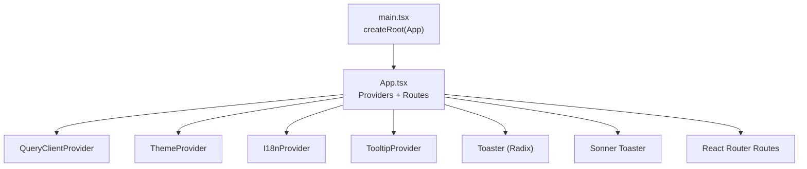
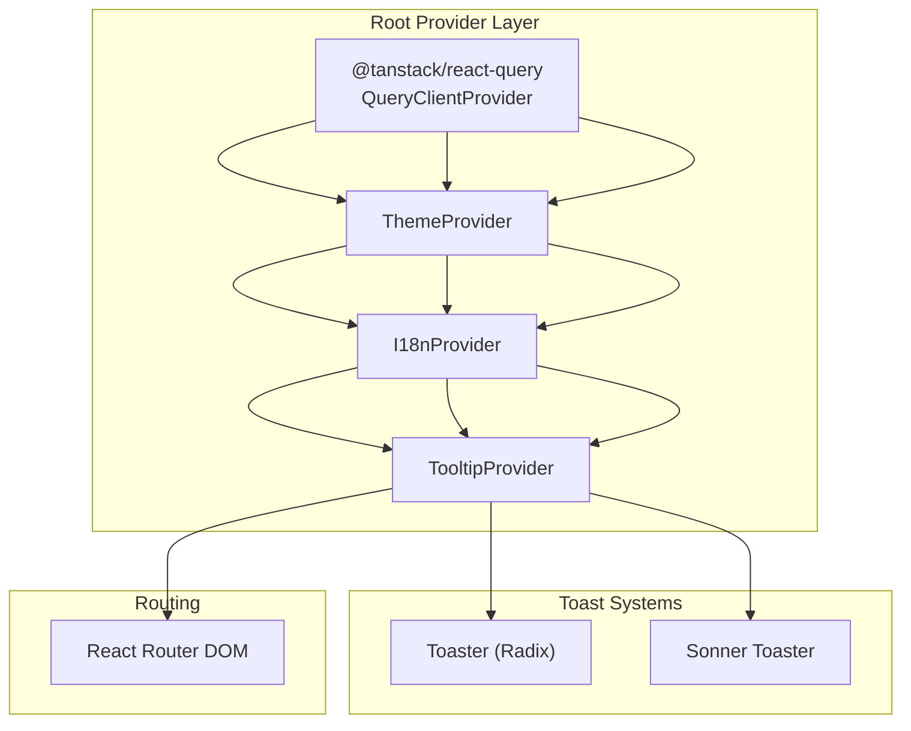
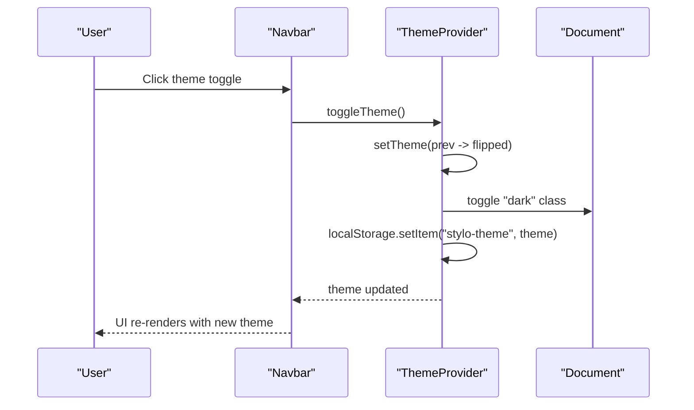
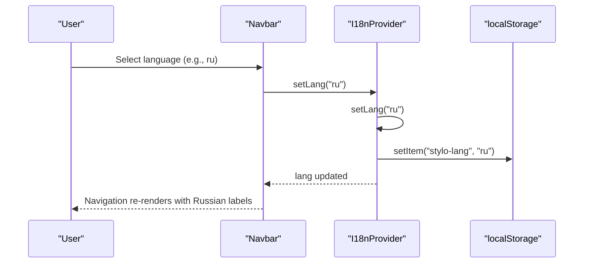
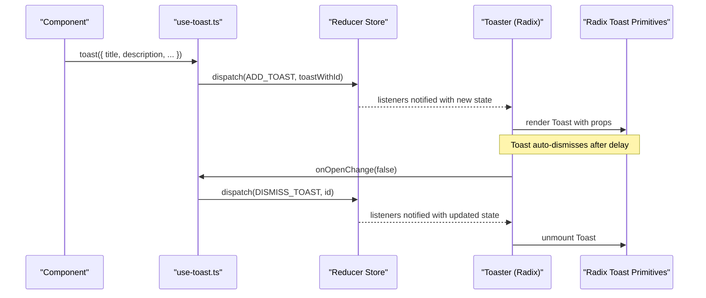
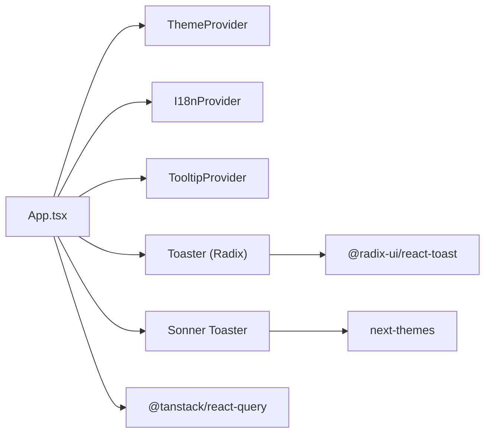

# Context Providers

<cite>
**Referenced Files in This Document**
- [theme.tsx](file://src/lib/theme.tsx)
- [i18n.tsx](file://src/lib/i18n.tsx)
- [use-toast.ts](file://src/hooks/use-toast.ts)
- [use-toast.ts (UI wrapper)](file://src/components/ui/use-toast.ts)
- [toaster.tsx](file://src/components/ui/toaster.tsx)
- [sonner.tsx](file://src/components/ui/sonner.tsx)
- [toast.tsx](file://src/components/ui/toast.tsx)
- [App.tsx](file://src/App.tsx)
- [main.tsx](file://src/main.tsx)
- [Navbar.tsx](file://src/components/Navbar.tsx)
- [Index.tsx](file://src/pages/Index.tsx)
- [index.css](file://src/index.css)
- [package.json](file://src/package.json)
</cite>

## Table of Contents
1. [Introduction](#introduction)
2. [Project Structure](#project-structure)
3. [Core Components](#core-components)
4. [Architecture Overview](#architecture-overview)
5. [Detailed Component Analysis](#detailed-component-analysis)
6. [Dependency Analysis](#dependency-analysis)
7. [Performance Considerations](#performance-considerations)
8. [Troubleshooting Guide](#troubleshooting-guide)
9. [Conclusion](#conclusion)
10. [Appendices](#appendices)

## Introduction
This document explains the React Context providers architecture used in the application, focusing on:
- ThemeProvider for light/dark mode management
- I18nProvider for internationalization supporting English, Russian, and Uzbek
- A custom toast hook system built on a Redux-like reducer pattern

It covers provider hierarchy, context consumption patterns, state persistence mechanisms, examples of usage across components, configuration options, performance considerations, error boundaries, provider ordering requirements, context isolation, and debugging approaches.

## Project Structure
The application initializes providers at the root level and composes them to wrap the routing tree. Providers are organized under dedicated libraries and UI modules.

**Diagram sources**
- [main.tsx](file://src/main.tsx#L1-L6)
- [App.tsx](file://src/App.tsx#L1-L45)

**Section sources**
- [main.tsx](file://src/main.tsx#L1-L6)
- [App.tsx](file://src/App.tsx#L1-L45)

## Core Components
- ThemeProvider: Manages theme state and persists it to local storage. Applies a class to the document root for Tailwind-based dark mode.
- I18nProvider: Manages language selection and resolves translations via a centralized dictionary.
- Custom Toast Hook System: A global toast manager with a reducer, action types, and a small memory store for toast lifecycle.

Key usage examples:
- Navbar consumes both Theme and I18n contexts to render localized navigation and theme toggle.
- The app mounts two toast systems: a Radix-based Toaster and a Sonner-based Toaster.

**Section sources**
- [theme.tsx](file://src/lib/theme.tsx#L1-L36)
- [i18n.tsx](file://src/lib/i18n.tsx#L1-L173)
- [use-toast.ts](file://src/hooks/use-toast.ts#L1-L187)
- [use-toast.ts (UI wrapper)](file://src/components/ui/use-toast.ts#L1-L4)
- [toaster.tsx](file://src/components/ui/toaster.tsx#L1-L25)
- [sonner.tsx](file://src/components/ui/sonner.tsx#L1-L28)
- [toast.tsx](file://src/components/ui/toast.tsx#L1-L112)
- [Navbar.tsx](file://src/components/Navbar.tsx#L1-L133)
- [App.tsx](file://src/App.tsx#L1-L45)

## Architecture Overview
Provider hierarchy and interactions:

Provider ordering requirements:
- ThemeProvider must wrap I18nProvider so that theme-dependent assets (e.g., logo colors) reflect the current theme when I18nProvider renders.
- TooltipProvider should wrap toast systems to ensure tooltips work inside toasts.
- QueryClientProvider should be the outermost provider to enable query caching and optimistic updates across the app.

**Diagram sources**
- [App.tsx](file://src/App.tsx#L19-L42)

**Section sources**
- [App.tsx](file://src/App.tsx#L1-L45)

## Detailed Component Analysis

### ThemeProvider
Responsibilities:
- Initialize theme from local storage or prefers-color-scheme media query
- Persist theme changes to local storage
- Apply/remove a class on the document root for Tailwind dark mode
- Expose a toggle function to switch between light and dark

Context value structure:
- theme: "light" | "dark"
- toggleTheme(): function to flip theme

Persistence mechanism:
- Reads "stylo-theme" from localStorage on mount
- Writes "stylo-theme" to localStorage on each theme change
- Uses document.documentElement.classList to toggle "dark"

Consumption pattern:
- Navbar reads theme and toggles it on click
- Styles adapt via CSS custom properties and Tailwind dark utility class

**Diagram sources**
- [theme.tsx](file://src/lib/theme.tsx#L12-L31)
- [Navbar.tsx](file://src/components/Navbar.tsx#L65-L72)

**Section sources**
- [theme.tsx](file://src/lib/theme.tsx#L1-L36)
- [index.css](file://src/index.css#L42-L75)
- [Navbar.tsx](file://src/components/Navbar.tsx#L1-L133)

### I18nProvider
Responsibilities:
- Initialize language from local storage or default to English
- Persist language changes to local storage
- Provide translation function t(key) with fallback to key itself
- Expose setLang(lang) to change language

Supported languages:
- en: English
- ru: Russian
- uz: Uzbek

Translation dictionary:
- Centralized mapping of keys to language-specific strings
- Keys follow dot notation for semantic grouping (e.g., nav.home, hero.title)

Context value structure:
- lang: "en" | "ru" | "uz"
- setLang(lang): function to change language
- t(key): function to resolve translation

Usage pattern:
- Navbar renders navigation labels using t(`nav.${key}`)
- Language switcher buttons call setLang on click

**Diagram sources**
- [i18n.tsx](file://src/lib/i18n.tsx#L148-L168)
- [Navbar.tsx](file://src/components/Navbar.tsx#L50-L63)

**Section sources**
- [i18n.tsx](file://src/lib/i18n.tsx#L1-L173)
- [Navbar.tsx](file://src/components/Navbar.tsx#L1-L133)

### Custom Toast Hook System
Overview:
- A global toast manager implemented with a reducer and a memory store
- Provides a simple imperative toast() function and a reactive useToast() hook
- Supports adding, updating, dismissing, and removing toasts
- Limits concurrent toasts and schedules removal after a delay

Context value structure:
- toasts: array of toast objects with id, title, description, action, and open state
- toast(props): imperative function returning { id, dismiss, update }
- dismiss(id?): function to dismiss a specific or all toasts

Implementation highlights:
- Action types: ADD_TOAST, UPDATE_TOAST, DISMISS_TOAST, REMOVE_TOAST
- Memory store with listeners to notify subscribers
- Unique id generation per toast
- Toast viewport and Radix primitives for rendering

Integration:
- Toaster (Radix) consumes useToast() to render toasts
- Sonner Toaster consumes next-themes to align with theme and provides its own toast() function

**Diagram sources**
- [use-toast.ts](file://src/hooks/use-toast.ts#L137-L164)
- [toaster.tsx](file://src/components/ui/toaster.tsx#L4-L24)
- [toast.tsx](file://src/components/ui/toast.tsx#L1-L112)

**Section sources**
- [use-toast.ts](file://src/hooks/use-toast.ts#L1-L187)
- [use-toast.ts (UI wrapper)](file://src/components/ui/use-toast.ts#L1-L4)
- [toaster.tsx](file://src/components/ui/toaster.tsx#L1-L25)
- [sonner.tsx](file://src/components/ui/sonner.tsx#L1-L28)
- [toast.tsx](file://src/components/ui/toast.tsx#L1-L112)

### Provider Configuration Options
- ThemeProvider
  - No explicit props; derives initial theme from localStorage or system preference
  - Persists theme to localStorage
- I18nProvider
  - No explicit props; derives initial language from localStorage
  - Persists language to localStorage
- Toaster (Radix)
  - Consumes state from useToast(); no props required
- Sonner Toaster
  - Consumes theme from next-themes; accepts optional props forwarded to the underlying component

**Section sources**
- [theme.tsx](file://src/lib/theme.tsx#L12-L31)
- [i18n.tsx](file://src/lib/i18n.tsx#L148-L168)
- [sonner.tsx](file://src/components/ui/sonner.tsx#L6-L25)
- [toaster.tsx](file://src/components/ui/toaster.tsx#L4-L24)

### Context Consumption Patterns
- Navbar demonstrates dual-context consumption:
  - useTheme() for theme-aware UI and logo switching
  - useI18n() for localized text and language switching
- Pages and components can consume any provider context as needed; the root composition ensures availability.

**Section sources**
- [Navbar.tsx](file://src/components/Navbar.tsx#L13-L133)
- [Index.tsx](file://src/pages/Index.tsx#L1-L28)

### State Persistence Mechanisms
- Theme persistence:
  - Local storage key: "stylo-theme"
  - Applied via document class for Tailwind dark mode
- Internationalization persistence:
  - Local storage key: "stylo-lang"
- Toast persistence:
  - In-memory store; no persistence across page reloads
  - Toasts are ephemeral and removed after a configured delay

**Section sources**
- [theme.tsx](file://src/lib/theme.tsx#L13-L22)
- [i18n.tsx](file://src/lib/i18n.tsx#L149-L157)
- [use-toast.ts](file://src/hooks/use-toast.ts#L53-L69)

### Error Boundaries
- No explicit React error boundaries are present in the analyzed files.
- Consider wrapping critical sections (e.g., routes) with an error boundary if needed.

**Section sources**
- [App.tsx](file://src/App.tsx#L1-L45)

### Provider Ordering Requirements
- ThemeProvider must wrap I18nProvider to ensure theme-sensitive rendering during initial I18n resolution.
- TooltipProvider should wrap toast systems to ensure tooltips render correctly within toasts.
- QueryClientProvider should be outermost to enable caching and optimistic updates.

**Section sources**
- [App.tsx](file://src/App.tsx#L19-L42)

### Context Isolation
- Each provider maintains its own isolated state:
  - ThemeContext: theme state
  - I18nContext: lang and translation function
  - ToastContext: toasts array and imperative actions
- Consumers access only the context they need, minimizing cross-provider coupling.

**Section sources**
- [theme.tsx](file://src/lib/theme.tsx#L5-L10)
- [i18n.tsx](file://src/lib/i18n.tsx#L136-L146)
- [use-toast.ts](file://src/hooks/use-toast.ts#L49-L51)

### Debugging Approaches
- Theme debugging:
  - Inspect document class list for "dark" presence
  - Verify localStorage "stylo-theme" value
- Internationalization debugging:
  - Inspect localStorage "stylo-lang" value
  - Log translation keys and returned values
- Toast debugging:
  - Monitor useToast() state in devtools
  - Confirm action dispatches and reducer transitions
  - Check toast viewport and primitive rendering

**Section sources**
- [theme.tsx](file://src/lib/theme.tsx#L19-L22)
- [i18n.tsx](file://src/lib/i18n.tsx#L149-L161)
- [use-toast.ts](file://src/hooks/use-toast.ts#L166-L184)

## Dependency Analysis
External dependencies relevant to providers:
- next-themes: integrates with Sonner Toaster for theme-aware toast rendering
- @radix-ui/react-toast: primitives for the Radix Toaster
- @tanstack/react-query: query client provider enabling caching and optimistic updates

**Diagram sources**
- [App.tsx](file://src/App.tsx#L1-L45)
- [sonner.tsx](file://src/components/ui/sonner.tsx#L1-L28)
- [toaster.tsx](file://src/components/ui/toaster.tsx#L1-L25)
- [package.json](file://src/package.json#L52-L64)

**Section sources**
- [package.json](file://src/package.json#L15-L90)

## Performance Considerations
- ThemeProvider
  - Minimal re-renders: only updates when theme changes; class toggle is efficient
  - Initial hydration uses localStorage and media query to avoid layout shifts
- I18nProvider
  - Translation lookup is O(1) via object access
  - useCallback prevents unnecessary re-renders of consumers
- Toast Hook System
  - Reducer-based state management minimizes re-renders
  - Limiting concurrent toasts reduces DOM overhead
  - Toast removal scheduled via timers; ensure cleanup on unmount

[No sources needed since this section provides general guidance]

## Troubleshooting Guide
- Theme not persisting
  - Verify "stylo-theme" exists in localStorage
  - Check document class list for "dark"
- Language not changing
  - Verify "stylo-lang" in localStorage
  - Ensure setLang is called and t(key) resolves to expected value
- Toasts not appearing
  - Confirm Toaster (Radix) is mounted and consuming useToast()
  - Ensure Sonner Toaster is imported and configured
- Conflicting themes
  - Ensure next-themes theme aligns with ThemeProvider class on document

**Section sources**
- [theme.tsx](file://src/lib/theme.tsx#L13-L22)
- [i18n.tsx](file://src/lib/i18n.tsx#L149-L161)
- [toaster.tsx](file://src/components/ui/toaster.tsx#L4-L24)
- [sonner.tsx](file://src/components/ui/sonner.tsx#L6-L25)

## Conclusion
The application’s provider architecture cleanly separates concerns:
- ThemeProvider manages appearance state and persistence
- I18nProvider manages language state and translations
- The custom toast system provides a lightweight, predictable way to surface ephemeral feedback

With proper provider ordering and isolation, the system remains maintainable and performant. For production, consider adding error boundaries around critical routes and ensuring consistent theme handling across toast systems.

[No sources needed since this section summarizes without analyzing specific files]

## Appendices

### Context Value Reference
- ThemeContext
  - theme: "light" | "dark"
  - toggleTheme(): function
- I18nContext
  - lang: "en" | "ru" | "uz"
  - setLang(lang): function
  - t(key): function
- ToastContext (via useToast())
  - toasts: array of toast objects
  - toast(props): function
  - dismiss(id?): function

**Section sources**
- [theme.tsx](file://src/lib/theme.tsx#L5-L10)
- [i18n.tsx](file://src/lib/i18n.tsx#L136-L146)
- [use-toast.ts](file://src/hooks/use-toast.ts#L166-L184)