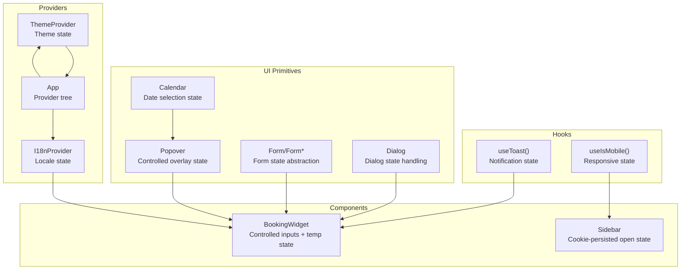
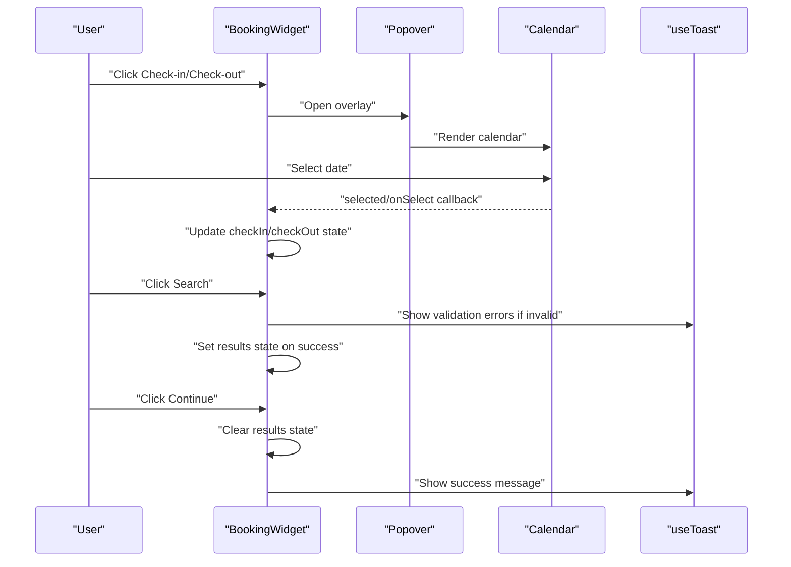
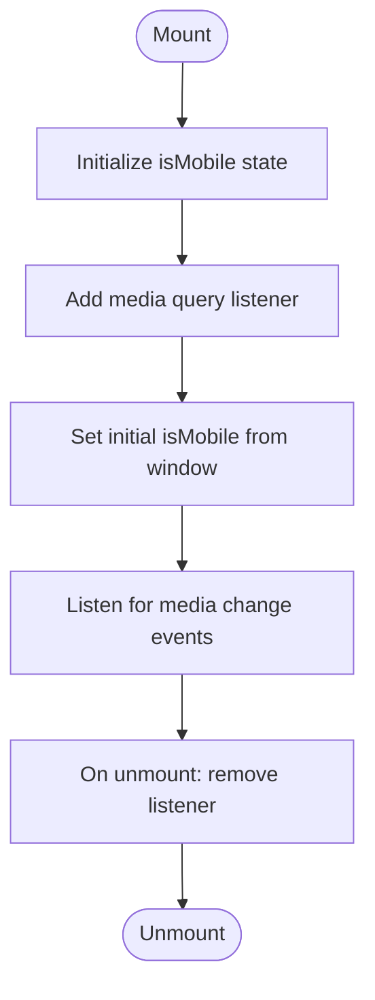
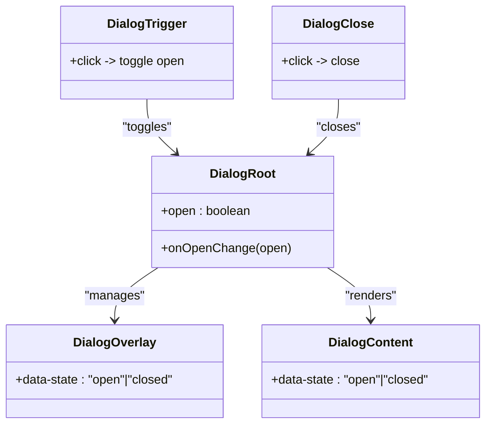
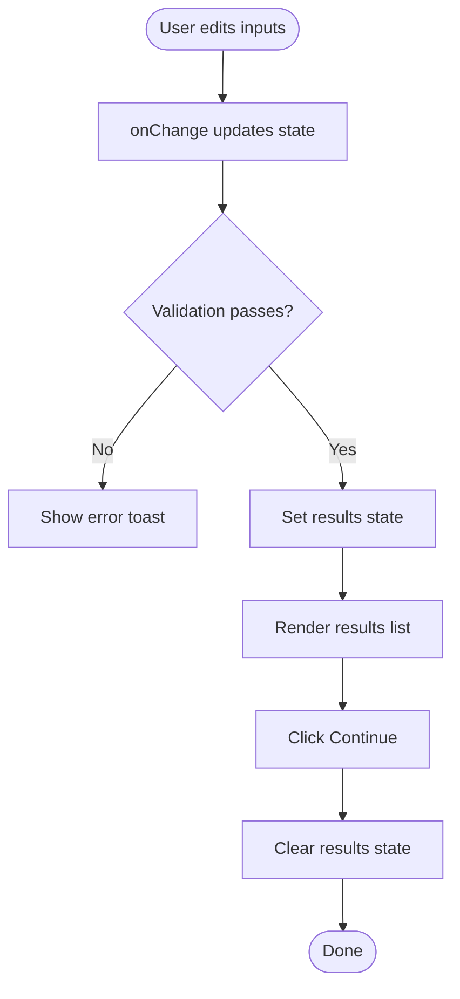
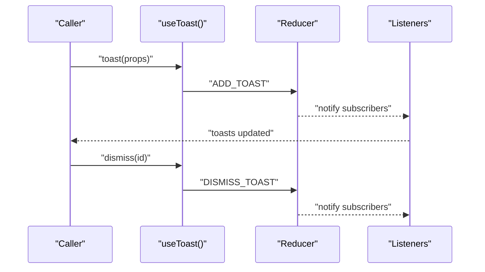
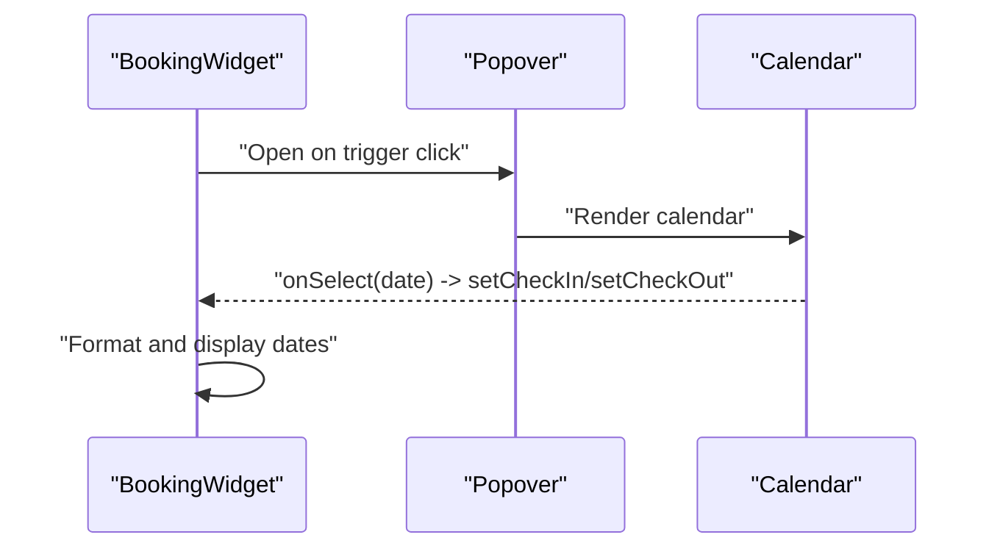
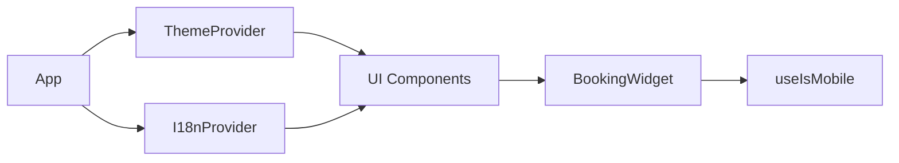
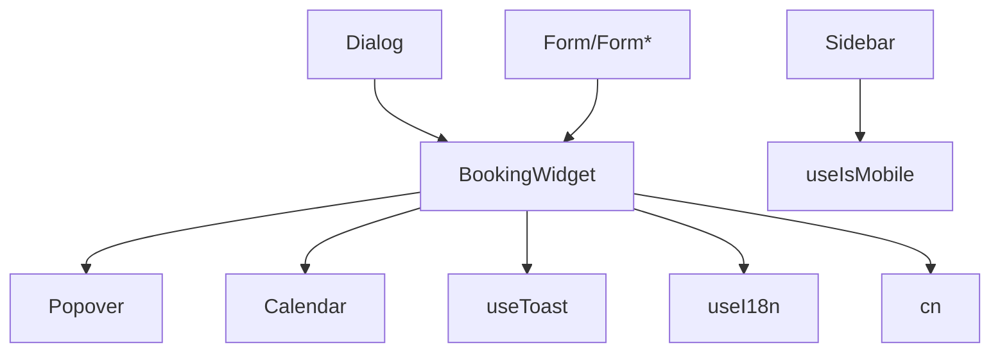

# Local State Patterns

<cite>
**Referenced Files in This Document**
- [use-mobile.tsx](file://src/hooks/use-mobile.tsx)
- [BookingWidget.tsx](file://src/components/BookingWidget.tsx)
- [dialog.tsx](file://src/components/ui/dialog.tsx)
- [form.tsx](file://src/components/ui/form.tsx)
- [use-toast.ts](file://src/hooks/use-toast.ts)
- [i18n.tsx](file://src/lib/i18n.tsx)
- [popover.tsx](file://src/components/ui/popover.tsx)
- [calendar.tsx](file://src/components/ui/calendar.tsx)
- [utils.ts](file://src/lib/utils.ts)
- [App.tsx](file://src/App.tsx)
- [sidebar.tsx](file://src/components/ui/sidebar.tsx)
- [theme.tsx](file://src/lib/theme.tsx)
</cite>

## Table of Contents
1. [Introduction](#introduction)
2. [Project Structure](#project-structure)
3. [Core Components](#core-components)
4. [Architecture Overview](#architecture-overview)
5. [Detailed Component Analysis](#detailed-component-analysis)
6. [Dependency Analysis](#dependency-analysis)
7. [Performance Considerations](#performance-considerations)
8. [Troubleshooting Guide](#troubleshooting-guide)
9. [Conclusion](#conclusion)

## Introduction
This document explains local state management patterns and custom hooks in the project, focusing on:
- Responsive state via a custom hook
- Dialog state handling in UI components
- Form state management in the booking widget
- useState patterns, controlled vs uncontrolled components, and state update strategies
- Examples of local state persistence, temporary state management, and component communication
- Hook composition, state normalization, and cleanup patterns
- Performance considerations for frequent state updates, memoization techniques, and state debugging approaches

## Project Structure
The project organizes state-related concerns across:
- Custom hooks for responsive behavior and toast notifications
- UI primitives for dialogs, forms, popovers, and calendars
- A booking widget that demonstrates controlled inputs and temporary state
- Internationalization and theming providers that influence component behavior
- Utility helpers for class merging

**Diagram sources**
- [use-mobile.tsx](file://src/hooks/use-mobile.tsx#L1-L20)
- [use-toast.ts](file://src/hooks/use-toast.ts#L1-L187)
- [dialog.tsx](file://src/components/ui/dialog.tsx#L1-L96)
- [form.tsx](file://src/components/ui/form.tsx#L1-L130)
- [popover.tsx](file://src/components/ui/popover.tsx#L1-L30)
- [calendar.tsx](file://src/components/ui/calendar.tsx#L1-L55)
- [BookingWidget.tsx](file://src/components/BookingWidget.tsx#L1-L154)
- [sidebar.tsx](file://src/components/ui/sidebar.tsx#L40-L76)
- [i18n.tsx](file://src/lib/i18n.tsx#L148-L173)
- [theme.tsx](file://src/lib/theme.tsx#L12-L35)
- [App.tsx](file://src/App.tsx#L1-L45)

**Section sources**
- [App.tsx](file://src/App.tsx#L1-L45)
- [utils.ts](file://src/lib/utils.ts#L1-L7)

## Core Components
- useIsMobile: Provides responsive state derived from media queries and cleans up listeners on unmount.
- useToast: Centralized toast notification state with a reducer, memory state, and listener pattern.
- BookingWidget: Demonstrates controlled inputs, temporary results state, and validation-driven state updates.
- Dialog: Radix UI-backed dialog exposing open/close state via Root/Overlay/Content.
- Form/Form*: Abstractions around react-hook-form for normalized field state and accessibility attributes.
- Popover/Calendar: Controlled overlay and date selection state integrated with booking inputs.
- I18nProvider/ThemeProvider: Provider-level state influencing component behavior and rendering.

**Section sources**
- [use-mobile.tsx](file://src/hooks/use-mobile.tsx#L1-L20)
- [use-toast.ts](file://src/hooks/use-toast.ts#L1-L187)
- [BookingWidget.tsx](file://src/components/BookingWidget.tsx#L1-L154)
- [dialog.tsx](file://src/components/ui/dialog.tsx#L1-L96)
- [form.tsx](file://src/components/ui/form.tsx#L1-L130)
- [popover.tsx](file://src/components/ui/popover.tsx#L1-L30)
- [calendar.tsx](file://src/components/ui/calendar.tsx#L1-L55)
- [i18n.tsx](file://src/lib/i18n.tsx#L148-L173)
- [theme.tsx](file://src/lib/theme.tsx#L12-L35)

## Architecture Overview
Local state flows through React’s component model with hooks and UI primitives:
- Providers manage global-like state (locale, theme).
- Custom hooks encapsulate cross-cutting concerns (responsive checks, notifications).
- UI components expose controlled state (e.g., dialog open, popover content visibility).
- The booking widget composes multiple controlled inputs and temporary state to orchestrate availability search and results display.

**Diagram sources**
- [BookingWidget.tsx](file://src/components/BookingWidget.tsx#L15-L154)
- [popover.tsx](file://src/components/ui/popover.tsx#L1-L30)
- [calendar.tsx](file://src/components/ui/calendar.tsx#L1-L55)
- [use-toast.ts](file://src/hooks/use-toast.ts#L137-L164)

## Detailed Component Analysis

### Responsive State with useIsMobile
- Purpose: Derive mobile/desktop state from window matchMedia and inner width.
- Pattern: Initialize state, attach media query listener in effect, set current state, and clean up on unmount.
- Composition: Used by components like Sidebar to toggle mobile-specific behavior.

**Diagram sources**
- [use-mobile.tsx](file://src/hooks/use-mobile.tsx#L5-L19)

**Section sources**
- [use-mobile.tsx](file://src/hooks/use-mobile.tsx#L1-L20)
- [sidebar.tsx](file://src/components/ui/sidebar.tsx#L40-L76)

### Dialog State Handling
- Dialog exposes Root/Overlay/Content/Portal primitives. Open state is managed internally and propagated via data attributes.
- DialogOverlay and DialogContent use forwardRef and Portal to render overlays and content in a portal.
- DialogTrigger opens/closes the dialog; DialogClose provides a close control.

**Diagram sources**
- [dialog.tsx](file://src/components/ui/dialog.tsx#L7-L52)

**Section sources**
- [dialog.tsx](file://src/components/ui/dialog.tsx#L1-L96)

### Form State Management in the Booking Widget
- Controlled components: Inputs for guests, rooms, and promo code are controlled via useState and onChange handlers.
- Temporary state: results state holds mock availability until cleared.
- Validation-driven updates: handleSearch validates inputs and triggers toasts for errors or sets results on success.

**Diagram sources**
- [BookingWidget.tsx](file://src/components/BookingWidget.tsx#L17-L44)

**Section sources**
- [BookingWidget.tsx](file://src/components/BookingWidget.tsx#L1-L154)

### Toast Notifications and Temporary State
- useToast manages a reducer-based memory state with listeners. It supports adding, updating, dismissing, and removing toasts.
- Temporary state: toast messages appear for a while and are dismissed automatically or manually.
- Persistence: Not applicable for toasts; they are ephemeral UI notifications.

**Diagram sources**
- [use-toast.ts](file://src/hooks/use-toast.ts#L71-L122)
- [use-toast.ts](file://src/hooks/use-toast.ts#L166-L184)

**Section sources**
- [use-toast.ts](file://src/hooks/use-toast.ts#L1-L187)

### Popover and Calendar Integration
- Popover provides Root/Trigger/Content with Portal rendering.
- Calendar integrates with controlled state via selected/onSelect callbacks.
- In the booking widget, Popover wraps Calendar to present date pickers for check-in and check-out.

**Diagram sources**
- [popover.tsx](file://src/components/ui/popover.tsx#L1-L30)
- [calendar.tsx](file://src/components/ui/calendar.tsx#L1-L55)
- [BookingWidget.tsx](file://src/components/BookingWidget.tsx#L52-L81)

**Section sources**
- [popover.tsx](file://src/components/ui/popover.tsx#L1-L30)
- [calendar.tsx](file://src/components/ui/calendar.tsx#L1-L55)
- [BookingWidget.tsx](file://src/components/BookingWidget.tsx#L1-L154)

### Hook Composition and Provider State
- I18nProvider and ThemeProvider demonstrate provider-level state with persistence to localStorage and media query preferences.
- useIsMobile is composed within components (e.g., Sidebar) to adapt behavior based on device type.
- App composes providers to establish global contexts.

**Diagram sources**
- [App.tsx](file://src/App.tsx#L19-L42)
- [i18n.tsx](file://src/lib/i18n.tsx#L148-L173)
- [theme.tsx](file://src/lib/theme.tsx#L12-L35)
- [use-mobile.tsx](file://src/hooks/use-mobile.tsx#L5-L19)
- [BookingWidget.tsx](file://src/components/BookingWidget.tsx#L1-L154)

**Section sources**
- [App.tsx](file://src/App.tsx#L1-L45)
- [i18n.tsx](file://src/lib/i18n.tsx#L148-L173)
- [theme.tsx](file://src/lib/theme.tsx#L12-L35)
- [use-mobile.tsx](file://src/hooks/use-mobile.tsx#L1-L20)

## Dependency Analysis
- BookingWidget depends on:
  - Popover and Calendar for controlled overlays and date selection
  - useToast for validation feedback
  - useI18n for localized strings
  - cn utility for class merging
- Dialog and Form primitives are consumed by higher-level components and hooks
- useIsMobile is used by Sidebar to manage persistent open state via cookies

**Diagram sources**
- [BookingWidget.tsx](file://src/components/BookingWidget.tsx#L1-L154)
- [popover.tsx](file://src/components/ui/popover.tsx#L1-L30)
- [calendar.tsx](file://src/components/ui/calendar.tsx#L1-L55)
- [use-toast.ts](file://src/hooks/use-toast.ts#L1-L187)
- [i18n.tsx](file://src/lib/i18n.tsx#L148-L173)
- [utils.ts](file://src/lib/utils.ts#L4-L6)
- [dialog.tsx](file://src/components/ui/dialog.tsx#L1-L96)
- [form.tsx](file://src/components/ui/form.tsx#L1-L130)
- [sidebar.tsx](file://src/components/ui/sidebar.tsx#L40-L76)
- [use-mobile.tsx](file://src/hooks/use-mobile.tsx#L1-L20)

**Section sources**
- [BookingWidget.tsx](file://src/components/BookingWidget.tsx#L1-L154)
- [popover.tsx](file://src/components/ui/popover.tsx#L1-L30)
- [calendar.tsx](file://src/components/ui/calendar.tsx#L1-L55)
- [use-toast.ts](file://src/hooks/use-toast.ts#L1-L187)
- [i18n.tsx](file://src/lib/i18n.tsx#L148-L173)
- [utils.ts](file://src/lib/utils.ts#L1-L7)
- [dialog.tsx](file://src/components/ui/dialog.tsx#L1-L96)
- [form.tsx](file://src/components/ui/form.tsx#L1-L130)
- [sidebar.tsx](file://src/components/ui/sidebar.tsx#L40-L76)
- [use-mobile.tsx](file://src/hooks/use-mobile.tsx#L1-L20)

## Performance Considerations
- Frequent state updates:
  - Debounce or batch updates when possible (e.g., avoid rapid re-renders during drag or scroll).
  - Normalize state shape to minimize deep comparisons and unnecessary renders.
- Memoization:
  - Use useMemo for derived values computed from large datasets.
  - Use useCallback for event handlers passed to child components to prevent prop drift.
- Rendering costs:
  - Keep controlled components lightweight; defer heavy computations to effects or background threads.
  - Limit re-renders by splitting state into smaller chunks and updating only what is necessary.
- Toasts:
  - The toast system maintains a small queue and uses timeouts; avoid excessive toast bursts to reduce UI churn.
- Utilities:
  - Prefer cn for conditional class merging to avoid expensive DOM mutations.

[No sources needed since this section provides general guidance]

## Troubleshooting Guide
- Dialog does not close:
  - Ensure DialogTrigger toggles open state and DialogClose invokes closing behavior.
  - Verify Overlay and Content are rendered via Portal and that data-state attributes reflect open/closed.
- Popover not opening:
  - Confirm Trigger is wired to Root and Portal is rendering content.
  - Check that Calendar onSelect updates the intended state in the parent.
- Toast not appearing:
  - Confirm Toaster is mounted in the app tree and useToast is called within a provider.
  - Verify that ADD_TOAST action is dispatched and listeners are registered.
- Responsive behavior not updating:
  - Confirm media query listener is attached and cleaned up on unmount.
  - Ensure useIsMobile is used consistently across components.

**Section sources**
- [dialog.tsx](file://src/components/ui/dialog.tsx#L1-L96)
- [popover.tsx](file://src/components/ui/popover.tsx#L1-L30)
- [calendar.tsx](file://src/components/ui/calendar.tsx#L1-L55)
- [use-toast.ts](file://src/hooks/use-toast.ts#L137-L164)
- [use-mobile.tsx](file://src/hooks/use-mobile.tsx#L5-L19)
- [App.tsx](file://src/App.tsx#L1-L45)

## Conclusion
This project demonstrates robust local state patterns:
- Responsive state via a custom hook with proper cleanup
- Dialog state handled through Radix UI primitives
- Controlled inputs in the booking widget with validation and temporary state
- Provider-level state for locale and theme
- A centralized toast system for ephemeral notifications

Adopting these patterns ensures predictable, maintainable, and performant UI state management across components.