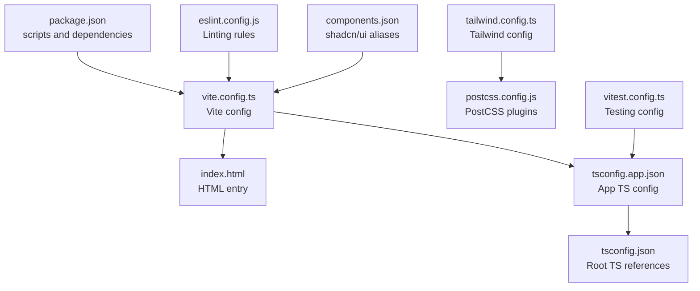
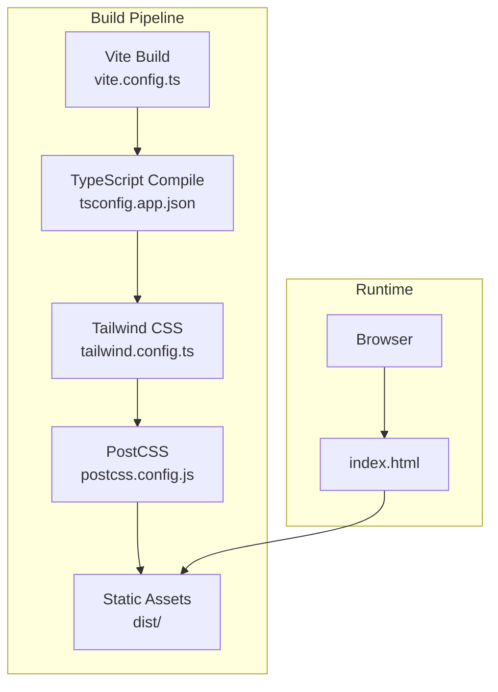
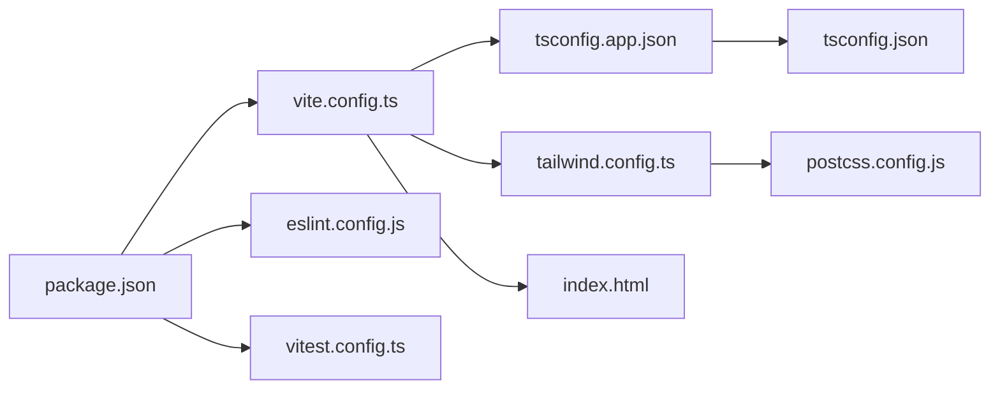

# Deployment and Production

<cite>
**Referenced Files in This Document**
- [package.json](file://package.json)
- [vite.config.ts](file://vite.config.ts)
- [tailwind.config.ts](file://tailwind.config.ts)
- [postcss.config.js](file://postcss.config.js)
- [index.html](file://index.html)
- [README.md](file://README.md)
- [tsconfig.json](file://tsconfig.json)
- [tsconfig.app.json](file://tsconfig.app.json)
- [tsconfig.node.json](file://tsconfig.node.json)
- [eslint.config.js](file://eslint.config.js)
- [vitest.config.ts](file://vitest.config.ts)
- [components.json](file://components.json)
</cite>

## Table of Contents
1. [Introduction](#introduction)
2. [Project Structure](#project-structure)
3. [Core Components](#core-components)
4. [Architecture Overview](#architecture-overview)
5. [Detailed Component Analysis](#detailed-component-analysis)
6. [Dependency Analysis](#dependency-analysis)
7. [Performance Considerations](#performance-considerations)
8. [Troubleshooting Guide](#troubleshooting-guide)
9. [Conclusion](#conclusion)
10. [Appendices](#appendices)

## Introduction
This document provides comprehensive guidance for deploying and operating the frontend application in production. It covers build optimization, environment configuration, deployment preparation, hosting options, CDN integration, performance monitoring, asset optimization, deployment automation, environment variables, security considerations, error tracking, rollback procedures, monitoring setup, maintenance tasks, scaling, backups, disaster recovery, and troubleshooting for common deployment issues.

## Project Structure
The project is a Vite-based React application configured with TypeScript and Tailwind CSS. Build-time configuration is centralized in Vite, while styling and CSS tooling are handled by Tailwind and PostCSS. The HTML entry point defines metadata and preloaded resources. TypeScript configurations split app and node environments. Testing is configured with Vitest and JSDOM.

**Diagram sources**
- [package.json](file://package.json#L1-L90)
- [vite.config.ts](file://vite.config.ts#L1-L22)
- [index.html](file://index.html#L1-L37)
- [tsconfig.app.json](file://tsconfig.app.json#L1-L32)
- [tailwind.config.ts](file://tailwind.config.ts#L1-L86)
- [postcss.config.js](file://postcss.config.js#L1-L7)
- [tsconfig.json](file://tsconfig.json#L1-L17)
- [eslint.config.js](file://eslint.config.js#L1-L27)
- [vitest.config.ts](file://vitest.config.ts#L1-L17)
- [components.json](file://components.json#L1-L21)

**Section sources**
- [package.json](file://package.json#L1-L90)
- [vite.config.ts](file://vite.config.ts#L1-L22)
- [index.html](file://index.html#L1-L37)
- [tsconfig.app.json](file://tsconfig.app.json#L1-L32)
- [tailwind.config.ts](file://tailwind.config.ts#L1-L86)
- [postcss.config.js](file://postcss.config.js#L1-L7)
- [tsconfig.json](file://tsconfig.json#L1-L17)
- [eslint.config.js](file://eslint.config.js#L1-L27)
- [vitest.config.ts](file://vitest.config.ts#L1-L17)
- [components.json](file://components.json#L1-L21)

## Core Components
- Build and Dev Server
  - Vite handles development server and production builds. The server configuration exposes host and port, and disables overlay for HMR in development.
  - Scripts for building, previewing, and testing are defined in package.json.
- Styling and CSS Tooling
  - Tailwind CSS is configured with content globs covering components and pages, plus theme extensions for fonts, colors, radii, and animations.
  - PostCSS applies Tailwind and Autoprefixer.
- TypeScript Configuration
  - Root tsconfig references app and node configs. App config targets ES2020 with bundler module resolution and JSX transform for React.
  - Node config targets ES2023 for Vite config.
- Testing and Linting
  - ESLint configuration extends recommended rulesets and adds React Hooks and React Refresh plugins.
  - Vitest config sets up JSDOM environment and includes test files under src.
- UI Library Integration
  - shadcn/ui aliases are defined in components.json to streamline imports.

**Section sources**
- [vite.config.ts](file://vite.config.ts#L7-L21)
- [package.json](file://package.json#L6-L14)
- [tailwind.config.ts](file://tailwind.config.ts#L3-L85)
- [postcss.config.js](file://postcss.config.js#L1-L7)
- [tsconfig.json](file://tsconfig.json#L1-L17)
- [tsconfig.app.json](file://tsconfig.app.json#L1-L32)
- [tsconfig.node.json](file://tsconfig.node.json#L1-L23)
- [eslint.config.js](file://eslint.config.js#L1-L27)
- [vitest.config.ts](file://vitest.config.ts#L1-L17)
- [components.json](file://components.json#L1-L21)

## Architecture Overview
The production build pipeline integrates Vite, TypeScript, Tailwind CSS, and PostCSS. Assets are processed during build, and the resulting static assets are served by a web server or CDN.

**Diagram sources**
- [vite.config.ts](file://vite.config.ts#L1-L22)
- [tsconfig.app.json](file://tsconfig.app.json#L1-L32)
- [tailwind.config.ts](file://tailwind.config.ts#L1-L86)
- [postcss.config.js](file://postcss.config.js#L1-L7)
- [index.html](file://index.html#L1-L37)

## Detailed Component Analysis

### Build and Asset Optimization
- Build Commands
  - Use the production build script to generate optimized static assets for deployment.
  - Preview the production build locally before deploying to validate performance and correctness.
- Asset Processing
  - Vite bundles JavaScript/TypeScript and resolves aliases defined in the Vite config.
  - Tailwind scans components and pages to include only used styles, minimizing CSS size.
  - PostCSS runs Tailwind and Autoprefixer to normalize and optimize CSS.
- Optimization Recommendations
  - Enable minification and chunk splitting via Vite defaults for production builds.
  - Keep Tailwind content globs precise to avoid unnecessary CSS inclusion.
  - Prefer lazy-loading heavy components and images to improve initial load time.
  - Use a CDN for static assets to reduce origin server load and latency.

**Section sources**
- [package.json](file://package.json#L6-L14)
- [vite.config.ts](file://vite.config.ts#L1-L22)
- [tailwind.config.ts](file://tailwind.config.ts#L5-L5)
- [postcss.config.js](file://postcss.config.js#L1-L7)

### Environment Configuration and Variables
- Environment Modes
  - Vite supports development and production modes. The development script runs the dev server; a dedicated development build script is available.
- Environment Variables
  - Define environment variables per deployment target (development, staging, production) using Vite’s environment variable loading conventions.
  - Keep secrets out of client-side code; expose only public configuration via environment variables.
- Configuration Files
  - Vite config supports mode-specific plugins and settings. The current config enables a component tagger plugin in development.

**Section sources**
- [package.json](file://package.json#L6-L14)
- [vite.config.ts](file://vite.config.ts#L7-L15)

### Hosting Options and CDN Integration
- Static Hosting
  - Serve the generated dist folder from any static hosting provider or CDN.
- CDN Benefits
  - Use a CDN to cache static assets globally, reduce latency, and offload bandwidth from the origin server.
- Custom Domains
  - Configure custom domains through the platform’s domain settings.

**Section sources**
- [README.md](file://README.md#L63-L73)

### Performance Monitoring Setup
- Observability
  - Integrate browser performance APIs and logging to track Core Web Vitals and runtime errors.
  - Use a monitoring service to collect metrics and set up alerts for performance regressions.
- Pre-deployment Validation
  - Run performance checks locally using the preview script and validate bundle sizes.

**Section sources**
- [package.json](file://package.json#L11-L11)
- [README.md](file://README.md#L63-L73)

### Deployment Automation
- CI/CD Workflow
  - Automate linting, testing, building, and publishing to a CDN or static host.
  - Gate deployments on passing tests and successful builds.
- Versioning and Rollout
  - Tag releases and maintain immutable artifacts for easy rollback.

**Section sources**
- [eslint.config.js](file://eslint.config.js#L1-L27)
- [vitest.config.ts](file://vitest.config.ts#L1-L17)
- [package.json](file://package.json#L6-L14)

### Security Considerations
- Content Security Policy (CSP)
  - Enforce a strict CSP to mitigate XSS risks.
- Subresource Integrity (SRI)
  - Use SRI for third-party scripts loaded from CDNs.
- HTTPS and TLS
  - Ensure all traffic is served over HTTPS with modern TLS settings.
- Secret Management
  - Never commit secrets; manage them via secure secret stores or environment managers.

**Section sources**
- [index.html](file://index.html#L1-L37)

### Error Tracking Implementation
- Client-Side Error Reporting
  - Integrate an error tracking service to capture unhandled exceptions and user-reported issues.
- Logging
  - Centralize logs and correlate with user sessions and performance metrics.

**Section sources**
- [index.html](file://index.html#L1-L37)

### Rollback Procedures
- Artifact Storage
  - Store previous builds and assets for quick rollback.
- Canary Releases
  - Gradually shift traffic to the new version and monitor metrics; revert if anomalies appear.
- Immutable Deployments
  - Use unique asset filenames or content hashes to enable safe rollbacks.

**Section sources**
- [package.json](file://package.json#L6-L14)

### Monitoring Setup and Maintenance Tasks
- Metrics Collection
  - Track page load times, error rates, and user engagement.
- Maintenance
  - Regularly update dependencies, audit security, and review Tailwind content globs for unused styles.

**Section sources**
- [tailwind.config.ts](file://tailwind.config.ts#L5-L5)
- [eslint.config.js](file://eslint.config.js#L1-L27)

### Scaling Considerations
- Horizontal Scaling
  - Serve static assets from a CDN and scale origin servers behind a load balancer.
- Caching Strategies
  - Implement long-term caching for immutable assets and short-term caching for dynamic content.
- Database and Backend
  - Offload static assets to CDN; keep backend APIs stateless and horizontally scalable.

**Section sources**
- [README.md](file://README.md#L63-L73)

### Backup Strategies and Disaster Recovery Planning
- Backups
  - Back up source code, configuration, and immutable build artifacts.
- DR Plan
  - Maintain a documented plan to restore from backups and redeploy latest known good build.

**Section sources**
- [README.md](file://README.md#L63-L73)

## Dependency Analysis
The build pipeline depends on Vite for bundling, TypeScript for type safety, Tailwind CSS for styling, and PostCSS for vendor prefixing. Testing and linting integrate with the build process to ensure quality.

**Diagram sources**
- [package.json](file://package.json#L1-L90)
- [vite.config.ts](file://vite.config.ts#L1-L22)
- [eslint.config.js](file://eslint.config.js#L1-L27)
- [vitest.config.ts](file://vitest.config.ts#L1-L17)
- [tsconfig.app.json](file://tsconfig.app.json#L1-L32)
- [tsconfig.json](file://tsconfig.json#L1-L17)
- [tailwind.config.ts](file://tailwind.config.ts#L1-L86)
- [postcss.config.js](file://postcss.config.js#L1-L7)
- [index.html](file://index.html#L1-L37)

**Section sources**
- [package.json](file://package.json#L1-L90)
- [vite.config.ts](file://vite.config.ts#L1-L22)
- [eslint.config.js](file://eslint.config.js#L1-L27)
- [vitest.config.ts](file://vitest.config.ts#L1-L17)
- [tsconfig.app.json](file://tsconfig.app.json#L1-L32)
- [tsconfig.json](file://tsconfig.json#L1-L17)
- [tailwind.config.ts](file://tailwind.config.ts#L1-L86)
- [postcss.config.js](file://postcss.config.js#L1-L7)
- [index.html](file://index.html#L1-L37)

## Performance Considerations
- Bundle Size
  - Keep dependencies lean; remove unused components and libraries.
- Lazy Loading
  - Split routes and components to defer loading non-critical code.
- CSS Optimization
  - Tailwind purges unused styles; keep content globs accurate.
- Image Optimization
  - Resize and compress images; use modern formats (AVIF/WEBP) when supported.
- Network
  - Enable compression and use a CDN for global distribution.

[No sources needed since this section provides general guidance]

## Troubleshooting Guide
- Build Failures
  - Verify TypeScript configuration and module resolution settings.
  - Ensure Tailwind content globs match component locations.
- Dev Server Issues
  - Confirm host and port settings and firewall rules.
- Testing Failures
  - Check Vitest environment and setup files.
- Linting Errors
  - Review ESLint configuration and disable only recommended rules that conflict with project style.

**Section sources**
- [tsconfig.app.json](file://tsconfig.app.json#L1-L32)
- [tailwind.config.ts](file://tailwind.config.ts#L5-L5)
- [vite.config.ts](file://vite.config.ts#L8-L14)
- [vitest.config.ts](file://vitest.config.ts#L7-L12)
- [eslint.config.js](file://eslint.config.js#L20-L24)

## Conclusion
This guide outlines a practical path to deploy and operate the application in production. By leveraging Vite’s optimized build, Tailwind’s scoped styling, and a CDN-backed static hosting model, you can achieve fast, reliable delivery. Combine automated testing and linting, robust monitoring, and a clear rollback strategy to maintain stability as you scale.

[No sources needed since this section summarizes without analyzing specific files]

## Appendices
- Example Production Build Command
  - Use the production build script to generate optimized assets for deployment.
- Asset Optimization Checklist
  - Minify JS/CSS, enable long-term caching, lazy-load non-critical assets, and compress images.
- Deployment Automation Checklist
  - Run lint, tests, and build; publish to CDN/static host; configure custom domain and SSL.

**Section sources**
- [package.json](file://package.json#L6-L14)
- [README.md](file://README.md#L63-L73)