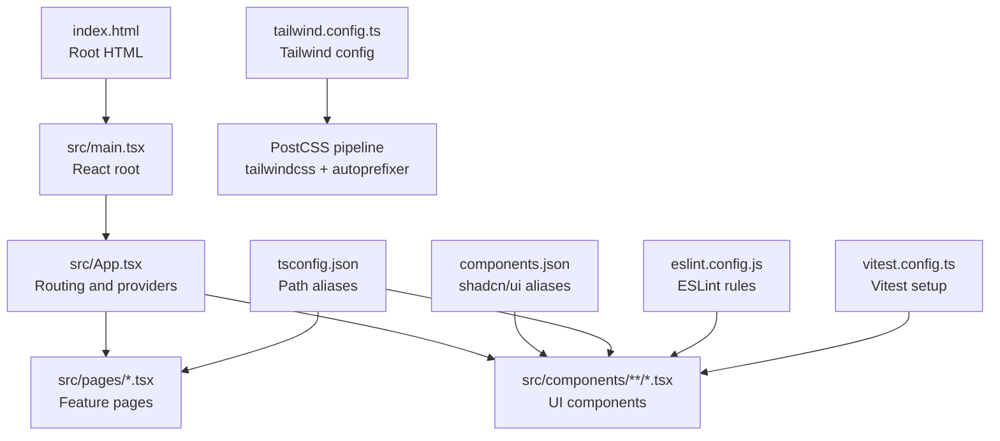
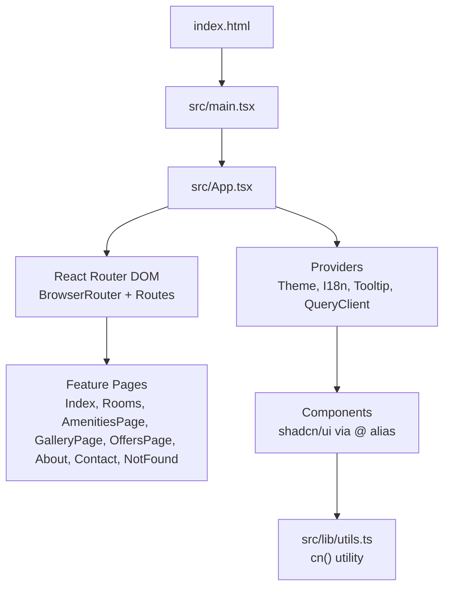

# Getting Started

<cite>
**Referenced Files in This Document**
- [README.md](file://README.md)
- [package.json](file://package.json)
- [vite.config.ts](file://vite.config.ts)
- [tailwind.config.ts](file://tailwind.config.ts)
- [postcss.config.js](file://postcss.config.js)
- [components.json](file://components.json)
- [tsconfig.json](file://tsconfig.json)
- [index.html](file://index.html)
- [src/main.tsx](file://src/main.tsx)
- [src/App.tsx](file://src/App.tsx)
- [src/pages/Index.tsx](file://src/pages/Index.tsx)
- [src/lib/utils.ts](file://src/lib/utils.ts)
- [eslint.config.js](file://eslint.config.js)
- [vitest.config.ts](file://vitest.config.ts)
- [src/test/setup.ts](file://src/test/setup.ts)
</cite>

## Table of Contents
1. [Introduction](#introduction)
2. [Prerequisites](#prerequisites)
3. [Installation](#installation)
4. [Development Server](#development-server)
5. [Project Structure](#project-structure)
6. [Available Scripts](#available-scripts)
7. [Build Processes](#build-processes)
8. [Accessing the Application](#accessing-the-application)
9. [Making Initial Modifications](#making-initial-modifications)
10. [Environment Configuration](#environment-configuration)
11. [Architecture Overview](#architecture-overview)
12. [Troubleshooting](#troubleshooting)
13. [Conclusion](#conclusion)

## Introduction
Welcome to Stylo Residence Luxe. This guide helps you set up the development environment, run the local server with hot reload, explore the project structure, and make your first changes. The project is a modern React application with TypeScript, Vite, Tailwind CSS, and shadcn/ui components.

## Prerequisites
- Node.js 16 or later with npm
- A modern web browser
- A code editor (VS Code recommended)

Why these matter:
- Node.js and npm are required to install dependencies and run scripts.
- Vite (used by this project) targets modern JavaScript environments and benefits from recent Node.js versions.

**Section sources**
- [README.md](file://README.md#L21-L22)

## Installation
Follow these steps to prepare your local environment:

1. Clone the repository using your project’s Git URL.
2. Open a terminal in the project directory.
3. Install dependencies:
   - Run the install script defined in the project.
4. Start the development server with hot reload.

What you will do:
- Clone the repo.
- Navigate to the project folder.
- Install dependencies.
- Launch the dev server.

Where to find instructions:
- See the step-by-step commands in the project’s README.

**Section sources**
- [README.md](file://README.md#L23-L37)

## Development Server
Start the local development server with automatic reloading:

- Use the development script to launch the Vite dev server.
- The server runs on port 8080 and listens on all network interfaces.
- Hot Module Replacement (HMR) is enabled without the overlay.

How it works:
- Vite serves the app and refreshes the browser when you save changes.
- The configuration disables the HMR overlay to keep console logs visible.

**Section sources**
- [package.json](file://package.json#L6-L14)
- [vite.config.ts](file://vite.config.ts#L7-L14)

## Project Structure
High-level layout of the most important parts:

- Public assets and HTML shell
  - Static files under the public directory and the root HTML file.
- Source code
  - Entry point renders the React root.
  - App shell configures routing, theming, internationalization, and global providers.
  - Feature pages and reusable UI components organized by domain.
- Styling and design system
  - Tailwind CSS configured with a content path scanning components and pages.
  - PostCSS pipeline includes Tailwind and Autoprefixer.
  - shadcn/ui configuration defines aliases for components, utils, and hooks.
- Tooling
  - TypeScript configuration with path aliases.
  - ESLint configuration for TypeScript and React.
  - Vitest configuration for unit tests with JSDOM.

**Diagram sources**
- [index.html](file://index.html#L1-L37)
- [src/main.tsx](file://src/main.tsx#L1-L6)
- [src/App.tsx](file://src/App.tsx#L1-L45)
- [tailwind.config.ts](file://tailwind.config.ts#L1-L86)
- [postcss.config.js](file://postcss.config.js#L1-L7)
- [components.json](file://components.json#L1-L21)
- [tsconfig.json](file://tsconfig.json#L1-L17)
- [eslint.config.js](file://eslint.config.js#L1-L27)
- [vitest.config.ts](file://vitest.config.ts#L1-L17)

**Section sources**
- [index.html](file://index.html#L1-L37)
- [src/main.tsx](file://src/main.tsx#L1-L6)
- [src/App.tsx](file://src/App.tsx#L1-L45)
- [tailwind.config.ts](file://tailwind.config.ts#L1-L86)
- [postcss.config.js](file://postcss.config.js#L1-L7)
- [components.json](file://components.json#L1-L21)
- [tsconfig.json](file://tsconfig.json#L1-L17)
- [eslint.config.js](file://eslint.config.js#L1-L27)
- [vitest.config.ts](file://vitest.config.ts#L1-L17)

## Available Scripts
The project defines the following npm scripts:

- dev: Start the Vite development server with hot reload.
- build: Build the production bundle.
- build:dev: Build with development mode.
- lint: Run ESLint across the project.
- preview: Preview the production build locally.
- test: Run Vitest tests once.
- test:watch: Run Vitest in watch mode.

How to use:
- Run the development script to start the server.
- Use the build scripts to produce optimized bundles.
- Use lint to check code quality.
- Use test and test:watch for unit testing.

**Section sources**
- [package.json](file://package.json#L6-L14)

## Build Processes
Production builds are handled by Vite:

- The build script creates an optimized static site.
- The preview script serves the built assets locally for verification.
- The build:dev script allows building with development mode settings.

What happens during a production build:
- Vite bundles and optimizes assets.
- CSS is processed via PostCSS (Tailwind and Autoprefixer).
- The output is ready for deployment to static hosting or a CDN.

**Section sources**
- [package.json](file://package.json#L8-L9)
- [postcss.config.js](file://postcss.config.js#L1-L7)

## Accessing the Application
Once the development server is running:

- Open your browser to http://localhost:8080.
- The app loads the root route and navigates through the pages defined in the router.
- The index page composes multiple sections (hero, featured rooms, testimonials, etc.).

**Section sources**
- [vite.config.ts](file://vite.config.ts#L8-L14)
- [src/App.tsx](file://src/App.tsx#L27-L36)
- [src/pages/Index.tsx](file://src/pages/Index.tsx#L12-L25)

## Making Initial Modifications
Start with small changes to verify your setup:

- Change the title or meta description in the root HTML file.
- Modify a component in the pages directory (for example, update the index page composition).
- Adjust Tailwind classes in a component to see styles update instantly.
- Add a new page route in the router and create a matching page component.

Tip:
- Use the path alias @ to import from src consistently.

**Section sources**
- [index.html](file://index.html#L6-L9)
- [src/pages/Index.tsx](file://src/pages/Index.tsx#L1-L28)
- [tsconfig.json](file://tsconfig.json#L6-L8)

## Environment Configuration
Key configuration files and their roles:

- Vite
  - Server host and port, HMR settings, plugin chain, and path alias resolution.
- Tailwind
  - Content paths scan for class usage, theme extensions, and plugins.
- PostCSS
  - Enables Tailwind and Autoprefixer.
- shadcn/ui
  - Aliases for components, utils, UI primitives, lib, and hooks.
- TypeScript
  - Path aliases and compiler options.
- ESLint
  - Recommended base rules plus React Hooks and React Refresh rules.
- Vitest
  - JSDOM environment, global setup, and include patterns.

**Section sources**
- [vite.config.ts](file://vite.config.ts#L7-L21)
- [tailwind.config.ts](file://tailwind.config.ts#L1-L86)
- [postcss.config.js](file://postcss.config.js#L1-L7)
- [components.json](file://components.json#L1-L21)
- [tsconfig.json](file://tsconfig.json#L1-L17)
- [eslint.config.js](file://eslint.config.js#L1-L27)
- [vitest.config.ts](file://vitest.config.ts#L1-L17)

## Architecture Overview
The runtime architecture ties together the entry point, routing, providers, and pages:

**Diagram sources**
- [index.html](file://index.html#L32-L36)
- [src/main.tsx](file://src/main.tsx#L1-L6)
- [src/App.tsx](file://src/App.tsx#L1-L45)
- [src/pages/Index.tsx](file://src/pages/Index.tsx#L1-L28)
- [src/lib/utils.ts](file://src/lib/utils.ts#L1-L7)

**Section sources**
- [index.html](file://index.html#L32-L36)
- [src/main.tsx](file://src/main.tsx#L1-L6)
- [src/App.tsx](file://src/App.tsx#L1-L45)
- [src/pages/Index.tsx](file://src/pages/Index.tsx#L1-L28)
- [src/lib/utils.ts](file://src/lib/utils.ts#L1-L7)

## Troubleshooting
Common setup issues and fixes:

- Node.js version mismatch
  - Ensure Node.js 16+ is installed. Some toolchains require newer versions.
- Port conflicts
  - The server binds to port 8080. If it is in use, change the port in the Vite configuration.
- Missing dependencies
  - Re-run the install script to fetch all dependencies.
- HMR overlay
  - HMR overlay is disabled in the Vite config. If you need to debug HMR, enable it temporarily.
- TypeScript path aliases
  - Verify the baseUrl and paths in the TypeScript configuration match your imports.
- Tailwind content paths
  - Ensure Tailwind scans the correct directories so styles are generated.
- ESLint errors
  - Fix lint warnings or adjust rules in the ESLint configuration.
- Vitest environment
  - Tests run in JSDOM. If you encounter window.matchMedia errors, confirm the setup file is loaded.

**Section sources**
- [README.md](file://README.md#L21-L22)
- [vite.config.ts](file://vite.config.ts#L8-L14)
- [tsconfig.json](file://tsconfig.json#L4-L8)
- [tailwind.config.ts](file://tailwind.config.ts#L5-L5)
- [eslint.config.js](file://eslint.config.js#L20-L24)
- [vitest.config.ts](file://vitest.config.ts#L7-L11)
- [src/test/setup.ts](file://src/test/setting.ts#L1-L16)

## Conclusion
You now have the essentials to run Stylo Residence Luxe locally, understand the project structure, and make your first changes. Use the development server for rapid iteration, the build scripts for production, and the configuration files to tailor the environment to your needs. For deeper customization, explore the pages, components, and provider stack documented above.