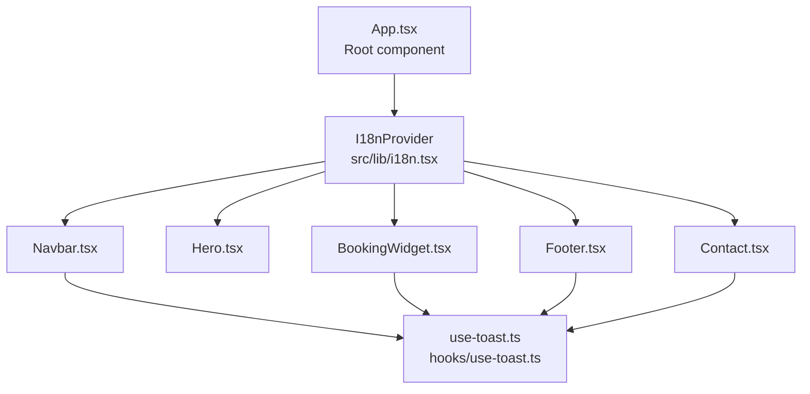
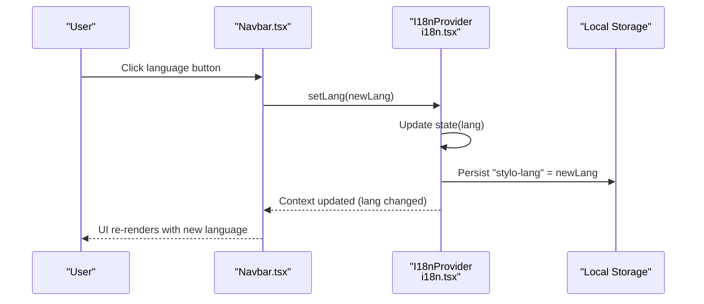
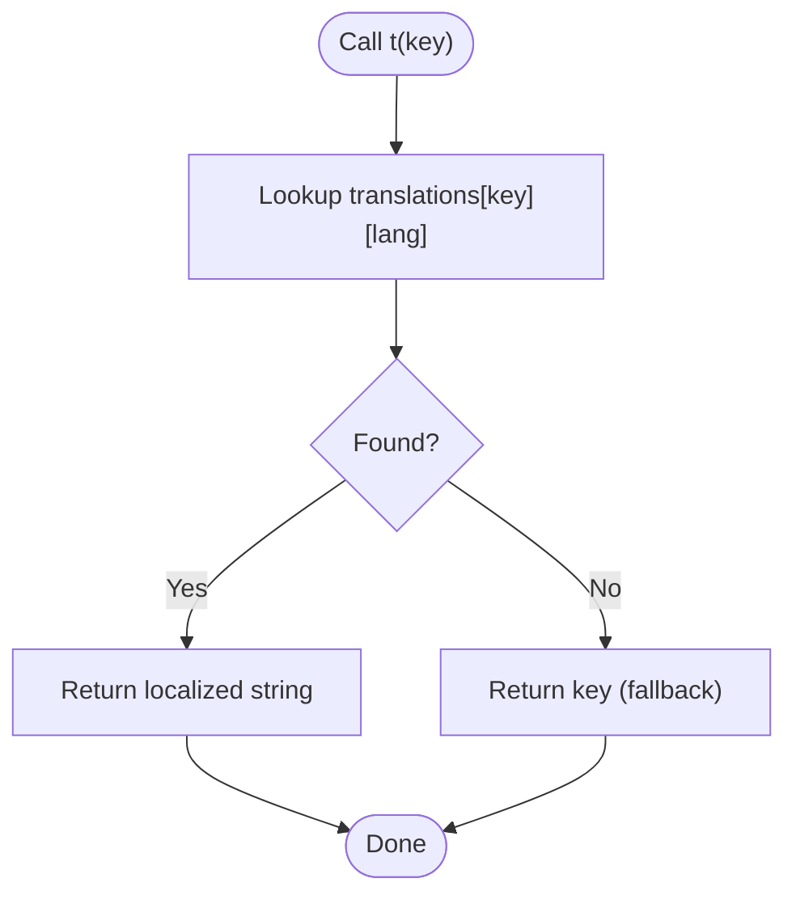
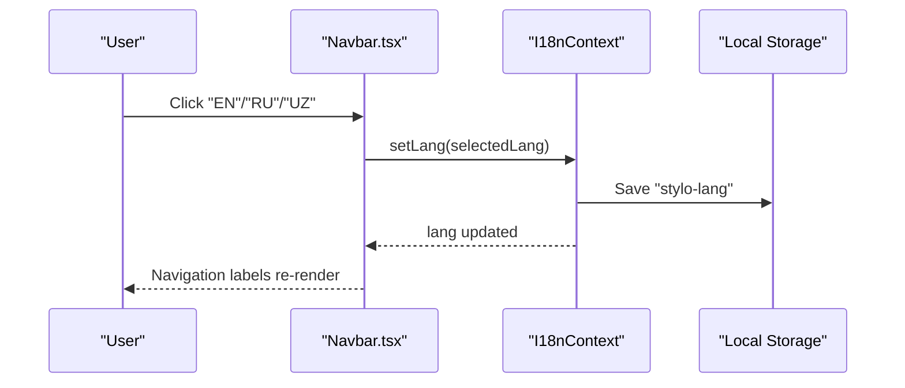
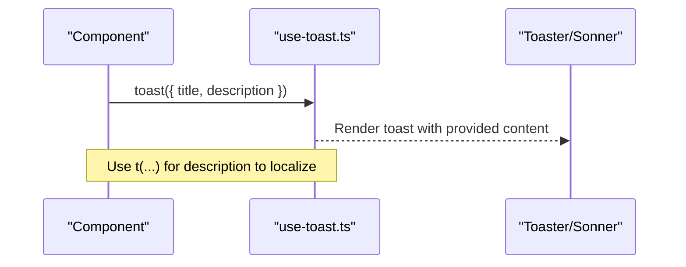
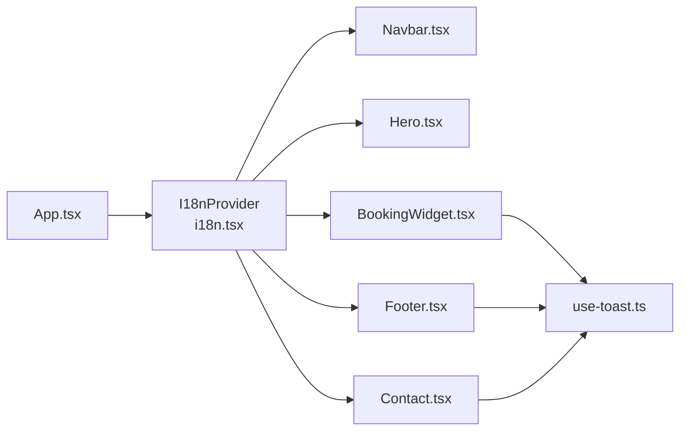

# Internationalization (i18n)

<cite>
**Referenced Files in This Document**
- [i18n.tsx](file://src/lib/i18n.tsx)
- [App.tsx](file://src/App.tsx)
- [Navbar.tsx](file://src/components/Navbar.tsx)
- [Hero.tsx](file://src/components/Hero.tsx)
- [BookingWidget.tsx](file://src/components/BookingWidget.tsx)
- [Footer.tsx](file://src/components/Footer.tsx)
- [Contact.tsx](file://src/pages/Contact.tsx)
- [use-toast.ts](file://src/hooks/use-toast.ts)
- [use-toast.ts (UI wrapper)](file://src/components/ui/use-toast.ts)
</cite>

## Table of Contents
1. [Introduction](#introduction)
2. [Project Structure](#project-structure)
3. [Core Components](#core-components)
4. [Architecture Overview](#architecture-overview)
5. [Detailed Component Analysis](#detailed-component-analysis)
6. [Dependency Analysis](#dependency-analysis)
7. [Performance Considerations](#performance-considerations)
8. [Troubleshooting Guide](#troubleshooting-guide)
9. [Conclusion](#conclusion)
10. [Appendices](#appendices)

## Introduction
This document explains the internationalization (i18n) system used in the project, which supports English, Russian, and Uzbek. It covers the translation key architecture, language switching mechanism, locale persistence, the i18n provider, translation functions, and how translations are integrated with React components, toast notifications, and form submissions. It also provides practical guidance for adding new translations, managing translation keys, and maintaining the system effectively.

## Project Structure
The i18n system is implemented as a lightweight React context provider located under the library folder and consumed by UI components and pages. The provider is initialized at the application root so that all components can access the current language and translation function.

**Diagram sources**
- [App.tsx](file://src/App.tsx#L19-L42)
- [i18n.tsx](file://src/lib/i18n.tsx#L148-L168)
- [Navbar.tsx](file://src/components/Navbar.tsx#L13-L133)
- [Hero.tsx](file://src/components/Hero.tsx#L6-L52)
- [BookingWidget.tsx](file://src/components/BookingWidget.tsx#L15-L154)
- [Footer.tsx](file://src/components/Footer.tsx#L13-L103)
- [Contact.tsx](file://src/pages/Contact.tsx#L9-L133)
- [use-toast.ts](file://src/hooks/use-toast.ts#L137-L187)

**Section sources**
- [App.tsx](file://src/App.tsx#L1-L45)
- [i18n.tsx](file://src/lib/i18n.tsx#L1-L173)

## Core Components
- I18nProvider: Creates and manages the language state, persists the selected language in local storage, and exposes a translation function.
- useI18n: A hook that returns the current language, setter for language, and the translation function.
- Translation keys: A centralized object mapping dot-notation keys to language-specific strings.

Key behaviors:
- Language initialization reads a persisted value from local storage; defaults to English if none exists.
- The translation function returns localized text for a given key or falls back to the key itself if missing.
- Language switching updates state and persists the new selection.

**Section sources**
- [i18n.tsx](file://src/lib/i18n.tsx#L3-L173)

## Architecture Overview
The i18n provider is mounted at the application root and wraps all routes and UI components. Components consume the translation function to render localized text and use the language setter to switch languages. Toast notifications integrate with translations for user feedback.

**Diagram sources**
- [Navbar.tsx](file://src/components/Navbar.tsx#L50-L63)
- [i18n.tsx](file://src/lib/i18n.tsx#L148-L168)

## Detailed Component Analysis

### I18nProvider and Translation Function
- Exposes lang, setLang, and t to consumers.
- Initializes lang from local storage or defaults to English.
- Provides a simple lookup from translation keys to localized strings.
- No dynamic loading is implemented; translations are bundled statically.

**Diagram sources**
- [i18n.tsx](file://src/lib/i18n.tsx#L159-L161)

**Section sources**
- [i18n.tsx](file://src/lib/i18n.tsx#L136-L173)

### Language Switching in Navbar
- Renders three language buttons using the Lang union.
- Calls setLang on click to change the active language.
- Persists the selection automatically via the provider.

**Diagram sources**
- [Navbar.tsx](file://src/components/Navbar.tsx#L50-L63)
- [i18n.tsx](file://src/lib/i18n.tsx#L148-L168)

**Section sources**
- [Navbar.tsx](file://src/components/Navbar.tsx#L1-L133)
- [i18n.tsx](file://src/lib/i18n.tsx#L1-L173)

### Translation Usage in UI Components
- Hero: Uses translation keys for headline, subtitle, and call-to-action buttons.
- Footer: Uses translation keys for tagline, quick links, contact info, newsletter, and rights.
- BookingWidget: Uses translation keys for labels, placeholders, and toast messages.
- Contact page: Uses translation keys for form labels, submit button, and success message.

These components consistently call t with hierarchical keys (e.g., nav.*, hero.*, footer.*, booking.*, contact.*) to render localized content.

**Section sources**
- [Hero.tsx](file://src/components/Hero.tsx#L6-L52)
- [Footer.tsx](file://src/components/Footer.tsx#L13-L103)
- [BookingWidget.tsx](file://src/components/BookingWidget.tsx#L15-L154)
- [Contact.tsx](file://src/pages/Contact.tsx#L9-L133)

### Toast Notifications and Translations
- Toasts are triggered from components (e.g., BookingWidget, Footer, Contact).
- The translation function is used to localize toast descriptions while titles can remain static or be translated similarly.
- The toast system is independent of i18n but benefits from consistent localization.

**Diagram sources**
- [BookingWidget.tsx](file://src/components/BookingWidget.tsx#L27-L44)
- [Footer.tsx](file://src/components/Footer.tsx#L18-L23)
- [Contact.tsx](file://src/pages/Contact.tsx#L13-L18)
- [use-toast.ts](file://src/hooks/use-toast.ts#L137-L187)

**Section sources**
- [use-toast.ts](file://src/hooks/use-toast.ts#L1-L187)
- [use-toast.ts (UI wrapper)](file://src/components/ui/use-toast.ts#L1-L4)

## Dependency Analysis
- App mounts I18nProvider at the root, ensuring global availability.
- Components depend on useI18n to render localized text.
- Toasts depend on the toast hook; translation keys can be applied to descriptions.

**Diagram sources**
- [App.tsx](file://src/App.tsx#L19-L42)
- [i18n.tsx](file://src/lib/i18n.tsx#L148-L168)
- [Navbar.tsx](file://src/components/Navbar.tsx#L13-L133)
- [Hero.tsx](file://src/components/Hero.tsx#L6-L52)
- [BookingWidget.tsx](file://src/components/BookingWidget.tsx#L15-L154)
- [Footer.tsx](file://src/components/Footer.tsx#L13-L103)
- [Contact.tsx](file://src/pages/Contact.tsx#L9-L133)
- [use-toast.ts](file://src/hooks/use-toast.ts#L137-L187)

**Section sources**
- [App.tsx](file://src/App.tsx#L1-L45)
- [i18n.tsx](file://src/lib/i18n.tsx#L1-L173)

## Performance Considerations
- Static translation object: Fast lookups; no network requests or runtime parsing.
- Context updates: Changing language triggers re-renders for consumers; keep the provider close to the root to minimize unnecessary re-renders.
- Local storage: One read on mount and one write on change; negligible overhead.
- Recommendations:
  - Keep translation keys concise and hierarchical to avoid deep nesting.
  - Avoid rendering large amounts of text inside frequently re-rendered lists without memoization.
  - Consider lazy-loading translations for very large applications if performance becomes a concern.

[No sources needed since this section provides general guidance]

## Troubleshooting Guide
Common issues and resolutions:
- Missing translation key:
  - Symptom: Key string appears instead of localized text.
  - Resolution: Add the key to the translation object with entries for all supported languages.
  - Reference: Translation fallback behavior.
    - [i18n.tsx](file://src/lib/i18n.tsx#L159-L161)
- Language does not persist:
  - Symptom: Language resets after refresh.
  - Resolution: Ensure local storage key is present and readable; verify provider initialization.
  - Reference: Persistence on language change.
    - [i18n.tsx](file://src/lib/i18n.tsx#L148-L168)
- Toast not localized:
  - Symptom: Toast shows English text despite active non-English language.
  - Resolution: Wrap toast descriptions with the translation function.
  - References:
    - [BookingWidget.tsx](file://src/components/BookingWidget.tsx#L43)
    - [Footer.tsx](file://src/components/Footer.tsx#L22)
    - [Contact.tsx](file://src/pages/Contact.tsx#L17)
- Incorrect language switching:
  - Symptom: UI does not reflect new language immediately.
  - Resolution: Confirm setLang is called and context consumers re-render; verify provider is mounted at root.
  - References:
    - [Navbar.tsx](file://src/components/Navbar.tsx#L50-L63)
    - [App.tsx](file://src/App.tsx#L20-L41)

**Section sources**
- [i18n.tsx](file://src/lib/i18n.tsx#L148-L168)
- [BookingWidget.tsx](file://src/components/BookingWidget.tsx#L43)
- [Footer.tsx](file://src/components/Footer.tsx#L22)
- [Contact.tsx](file://src/pages/Contact.tsx#L17)
- [Navbar.tsx](file://src/components/Navbar.tsx#L50-L63)
- [App.tsx](file://src/App.tsx#L20-L41)

## Conclusion
The project’s i18n system is a minimal, effective solution that provides fast, predictable localization across the UI. It relies on a central translation object, a React context provider, and a simple translation function. By following the key naming conventions and integrating translations into toasts and forms, teams can maintain consistent multilingual support with low complexity.

[No sources needed since this section summarizes without analyzing specific files]

## Appendices

### Adding New Translations
Steps:
1. Choose a hierarchical key following existing patterns (e.g., feature.area).
2. Add the key to the translation object with values for all supported languages.
3. Consume the key in components via the translation function.
4. Verify persistence and rendering across languages.

References:
- Translation object structure and keys.
  - [i18n.tsx](file://src/lib/i18n.tsx#L5-L134)

**Section sources**
- [i18n.tsx](file://src/lib/i18n.tsx#L5-L134)

### Managing Translation Keys
- Naming convention: Use dot-separated segments to group related strings (e.g., nav.home, hero.title).
- Keep keys stable and descriptive; avoid changing keys mid-development to prevent orphaned strings.
- Group by feature or page to simplify maintenance.

References:
- Example keys across components.
  - [Navbar.tsx](file://src/components/Navbar.tsx#L35-L45)
  - [Hero.tsx](file://src/components/Hero.tsx#L23-L27)
  - [Footer.tsx](file://src/components/Footer.tsx#L54-L58)

**Section sources**
- [Navbar.tsx](file://src/components/Navbar.tsx#L35-L45)
- [Hero.tsx](file://src/components/Hero.tsx#L23-L27)
- [Footer.tsx](file://src/components/Footer.tsx#L54-L58)

### Pluralization and Formatting
- Current implementation: Uses simple string replacement; no pluralization or ICU-style formatting.
- Recommendations for future enhancements:
  - Introduce a pluralization helper for languages with complex plural rules.
  - Use a formatting library for dates, currencies, and numbers.
  - Centralize formatting logic to avoid duplication.

[No sources needed since this section provides general guidance]

### Best Practices for Maintenance
- Centralize all text strings in the translation object; avoid inline strings in components.
- Review and update translations after UI changes.
- Keep language files aligned across features; coordinate with translators.
- Document key categories and ownership to streamline updates.

[No sources needed since this section provides general guidance]