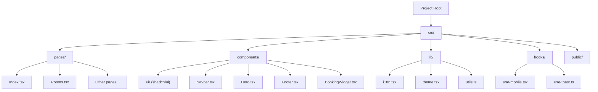
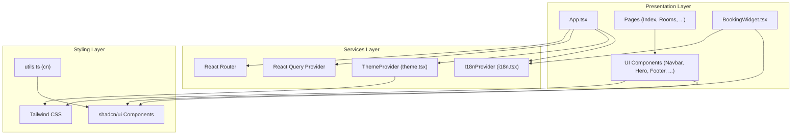
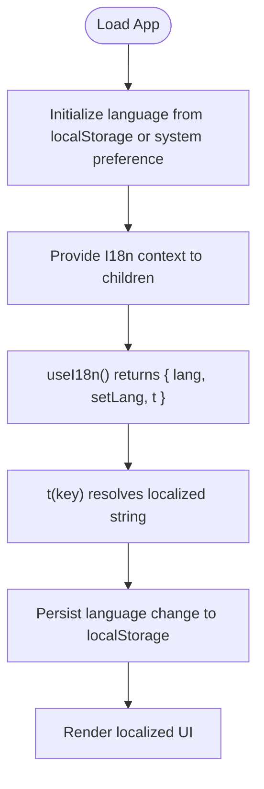
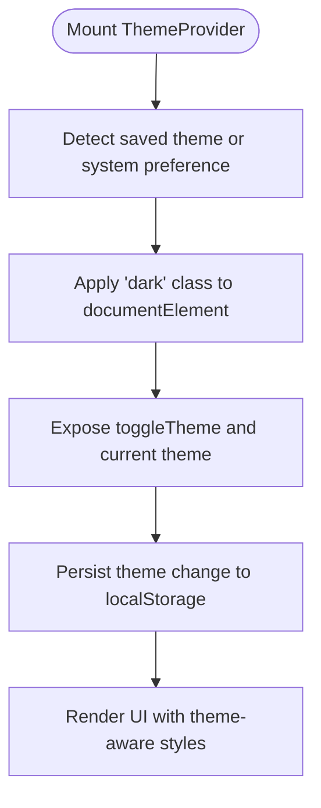
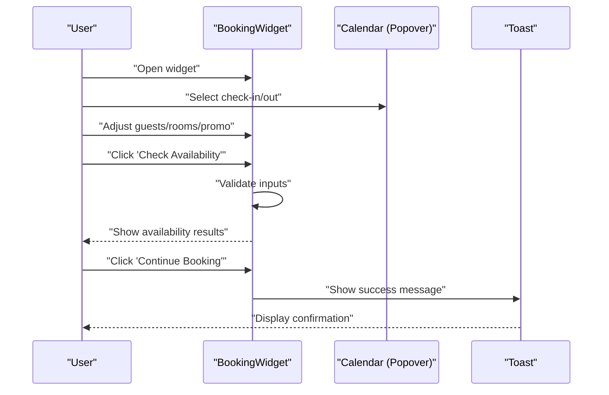
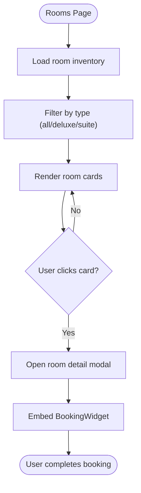
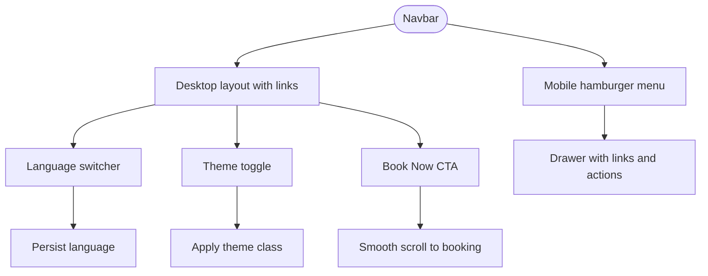
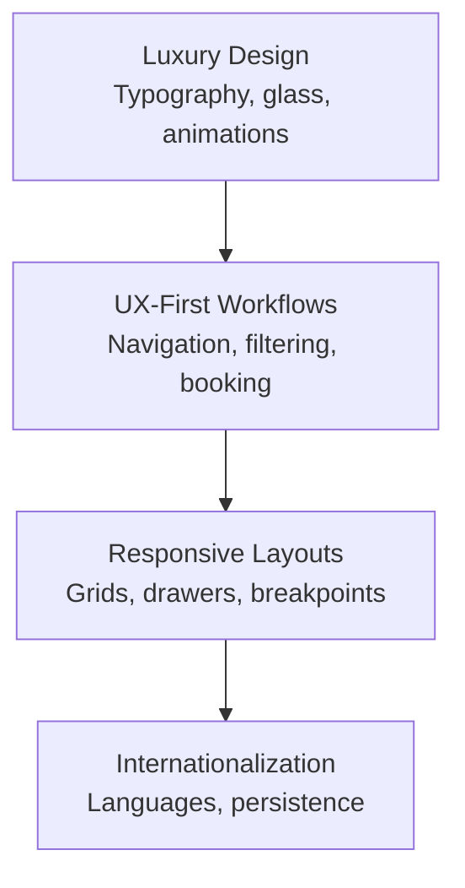
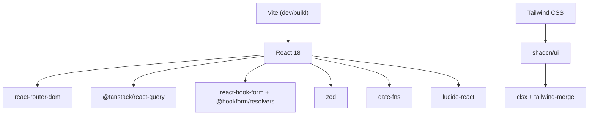

# Project Overview

<cite>
**Referenced Files in This Document**
- [README.md](file://README.md)
- [package.json](file://package.json)
- [vite.config.ts](file://vite.config.ts)
- [tailwind.config.ts](file://tailwind.config.ts)
- [components.json](file://components.json)
- [src/main.tsx](file://src/main.tsx)
- [src/App.tsx](file://src/App.tsx)
- [src/lib/i18n.tsx](file://src/lib/i18n.tsx)
- [src/lib/theme.tsx](file://src/lib/theme.tsx)
- [src/lib/utils.ts](file://src/lib/utils.ts)
- [src/pages/Index.tsx](file://src/pages/Index.tsx)
- [src/pages/Rooms.tsx](file://src/pages/Rooms.tsx)
- [src/components/Navbar.tsx](file://src/components/Navbar.tsx)
- [src/components/Hero.tsx](file://src/components/Hero.tsx)
- [src/components/Footer.tsx](file://src/components/Footer.tsx)
- [src/components/BookingWidget.tsx](file://src/components/BookingWidget.tsx)
</cite>

## Table of Contents
1. [Introduction](#introduction)
2. [Project Structure](#project-structure)
3. [Core Components](#core-components)
4. [Architecture Overview](#architecture-overview)
5. [Detailed Component Analysis](#detailed-component-analysis)
6. [Dependency Analysis](#dependency-analysis)
7. [Performance Considerations](#performance-considerations)
8. [Troubleshooting Guide](#troubleshooting-guide)
9. [Conclusion](#conclusion)

## Introduction
Stylo Residence Luxe is a modern, responsive hotel booking platform designed to deliver a premium digital experience for luxury hotel guests. The project emphasizes elegance, clarity, and seamless usability across devices, while supporting multiple languages to serve an international clientele. Built with contemporary web technologies, it combines a polished UI with robust functionality to streamline the guest journey from discovery to booking.

Key goals:
- Provide a luxurious, visually cohesive interface that reflects the brand’s sophistication.
- Enable effortless browsing and booking of accommodations with a powerful yet intuitive widget.
- Deliver a fully responsive experience optimized for desktop, tablet, and mobile.
- Support internationalization to serve global guests with localized content and interactions.

Technology stack highlights:
- React 18 for component-driven UI and concurrent features.
- TypeScript for type safety and maintainable codebases.
- Vite for fast builds, instant HMR, and optimized development ergonomics.
- Tailwind CSS for utility-first styling and consistent design tokens.
- shadcn/ui for accessible, styled components that integrate cleanly with Tailwind.
- Additional libraries for routing, theming, forms, date handling, and notifications.

Target audience:
- Affluent travelers seeking high-end accommodations.
- International guests who value localized content and a seamless booking experience.
- Business and leisure travelers who appreciate elegant design and reliable functionality.

Business value:
- Elevates brand perception through a sophisticated digital presence.
- Increases conversion by simplifying the booking process with a prominent, integrated widget.
- Enhances accessibility and inclusivity via multilingual support and theme switching.
- Reduces bounce rates with a responsive, visually engaging experience.

## Project Structure
The project follows a feature-centric structure under src/, with clear separation of concerns:
- src/components: Reusable UI building blocks (including shadcn/ui wrappers).
- src/components/ui: Styled shadcn/ui primitives wired to Tailwind.
- src/hooks: Custom hooks for cross-cutting concerns (e.g., mobile detection, toast).
- src/lib: Cross-cutting services (internationalization, theme, utilities).
- src/pages: Page-level components organized by route.
- Public assets: Static resources such as robots.txt and images.

**Diagram sources**
- [src/pages/Index.tsx](file://src/pages/Index.tsx#L1-L28)
- [src/pages/Rooms.tsx](file://src/pages/Rooms.tsx#L1-L102)
- [src/components/Navbar.tsx](file://src/components/Navbar.tsx#L1-L133)
- [src/components/Hero.tsx](file://src/components/Hero.tsx#L1-L53)
- [src/components/Footer.tsx](file://src/components/Footer.tsx#L1-L103)
- [src/components/BookingWidget.tsx](file://src/components/BookingWidget.tsx#L1-L154)
- [src/lib/i18n.tsx](file://src/lib/i18n.tsx#L1-L173)
- [src/lib/theme.tsx](file://src/lib/theme.tsx#L1-L36)
- [src/lib/utils.ts](file://src/lib/utils.ts#L1-L7)

**Section sources**
- [README.md](file://README.md#L53-L61)
- [package.json](file://package.json#L1-L90)
- [vite.config.ts](file://vite.config.ts#L1-L22)
- [tailwind.config.ts](file://tailwind.config.ts#L1-L86)
- [components.json](file://components.json#L1-L21)

## Core Components
- Application shell and routing: The root App composes providers for theming, internationalization, tooltips, React Query, and React Router, then renders routes to dedicated pages.
- Internationalization provider: Centralized translation keys and language switching with persistence in local storage.
- Theme provider: Light/dark theme management with system preference detection and persistence.
- Page composition: Index aggregates hero, trust indicators, featured rooms, amenities, gallery teaser, offers, testimonials, location, and footer.
- Room catalog: Rooms page displays room cards with filtering, modal details, and an integrated booking widget.
- Navigation and branding: Navbar includes language selector, theme toggle, and responsive mobile drawer.
- Booking experience: Hero and room detail modals embed a feature-rich booking widget with date selection, occupancy controls, promo code, availability search, and mock results.

Practical examples:
- Multilingual navigation: Switch languages at runtime to see navigation labels update instantly.
- Dark/light mode: Toggle theme to match user preference; persists across sessions.
- Room filtering: Filter rooms by type (all/deluxe/suite) and view details in a modal.
- Booking flow: Select dates, guests, rooms, apply promo code, check availability, and receive a success message.

**Section sources**
- [src/App.tsx](file://src/App.tsx#L1-L45)
- [src/main.tsx](file://src/main.tsx#L1-L6)
- [src/lib/i18n.tsx](file://src/lib/i18n.tsx#L1-L173)
- [src/lib/theme.tsx](file://src/lib/theme.tsx#L1-L36)
- [src/pages/Index.tsx](file://src/pages/Index.tsx#L1-L28)
- [src/pages/Rooms.tsx](file://src/pages/Rooms.tsx#L1-L102)
- [src/components/Navbar.tsx](file://src/components/Navbar.tsx#L1-L133)
- [src/components/Hero.tsx](file://src/components/Hero.tsx#L1-L53)
- [src/components/BookingWidget.tsx](file://src/components/BookingWidget.tsx#L1-L154)

## Architecture Overview
The application adopts a layered architecture:
- Presentation layer: React components and pages.
- Services layer: Providers for i18n, theme, and UI state.
- Routing layer: React Router for SPA navigation.
- Styling layer: Tailwind CSS with shadcn/ui primitives.

**Diagram sources**
- [src/App.tsx](file://src/App.tsx#L1-L45)
- [src/lib/i18n.tsx](file://src/lib/i18n.tsx#L1-L173)
- [src/lib/theme.tsx](file://src/lib/theme.tsx#L1-L36)
- [src/lib/utils.ts](file://src/lib/utils.ts#L1-L7)
- [src/components/Navbar.tsx](file://src/components/Navbar.tsx#L1-L133)
- [src/components/Hero.tsx](file://src/components/Hero.tsx#L1-L53)
- [src/components/BookingWidget.tsx](file://src/components/BookingWidget.tsx#L1-L154)

## Detailed Component Analysis

### Internationalization (I18n) System
The i18n provider centralizes translations and exposes a simple hook for resolving localized strings. It supports three languages and persists the current language in local storage. Keys are grouped by functional areas (navigation, hero, booking, trust, rooms, amenities, gallery, offers, testimonials, location, footer, about, contact).

**Diagram sources**
- [src/lib/i18n.tsx](file://src/lib/i18n.tsx#L148-L173)

**Section sources**
- [src/lib/i18n.tsx](file://src/lib/i18n.tsx#L1-L173)

### Theme Management
The theme provider manages light/dark mode, detects system preference, persists user choice, and applies a class to the root element for Tailwind variants.

**Diagram sources**
- [src/lib/theme.tsx](file://src/lib/theme.tsx#L12-L31)

**Section sources**
- [src/lib/theme.tsx](file://src/lib/theme.tsx#L1-L36)

### Booking Widget Workflow
The booking widget orchestrates date selection, occupancy controls, promo code entry, availability search, and result presentation. It validates inputs and communicates with the user via toast notifications.

**Diagram sources**
- [src/components/BookingWidget.tsx](file://src/components/BookingWidget.tsx#L1-L154)

**Section sources**
- [src/components/BookingWidget.tsx](file://src/components/BookingWidget.tsx#L1-L154)

### Room Catalog and Filtering
The Rooms page presents a grid of room cards with filtering by type. Clicking a card opens a modal with detailed information and the booking widget.

**Diagram sources**
- [src/pages/Rooms.tsx](file://src/pages/Rooms.tsx#L21-L101)

**Section sources**
- [src/pages/Rooms.tsx](file://src/pages/Rooms.tsx#L1-L102)

### Navigation and Responsive Behavior
The Navbar integrates language switching, theme toggle, and a responsive mobile drawer. It adapts to screen sizes and maintains active state based on routing.

**Diagram sources**
- [src/components/Navbar.tsx](file://src/components/Navbar.tsx#L1-L133)

**Section sources**
- [src/components/Navbar.tsx](file://src/components/Navbar.tsx#L1-L133)

### Conceptual Overview
The site’s design philosophy centers on luxury, responsiveness, and user experience:
- Luxury: Serif typography, restrained color palette, premium glass containers, and subtle animations.
- Responsiveness: Flexible grids, adaptive layouts, and a mobile-first drawer.
- User Experience: Clear CTAs, prominent booking widget, smooth transitions, and accessible controls.

[No sources needed since this diagram shows conceptual workflow, not actual code structure]

## Dependency Analysis
The project leverages a modern ecosystem with clear boundaries:
- Build and tooling: Vite with React plugin and path aliases.
- Styling: Tailwind CSS with custom theme tokens and shadcn/ui integration.
- State and data: React Query for caching and optimistic updates.
- Forms and validation: React Hook Form with Zod resolvers.
- Routing: React Router DOM for SPA navigation.
- Icons and UI: Lucide icons and shadcn/ui components.
- Utilities: clsx and tailwind-merge for class composition.

**Diagram sources**
- [package.json](file://package.json#L15-L88)
- [vite.config.ts](file://vite.config.ts#L1-L22)
- [tailwind.config.ts](file://tailwind.config.ts#L1-L86)
- [components.json](file://components.json#L1-L21)

**Section sources**
- [package.json](file://package.json#L1-L90)
- [vite.config.ts](file://vite.config.ts#L1-L22)
- [tailwind.config.ts](file://tailwind.config.ts#L1-L86)
- [components.json](file://components.json#L1-L21)

## Performance Considerations
- Bundle size and lazy loading: Consider code-splitting for heavy pages and components to reduce initial payload.
- Image optimization: Serve appropriately sized images and leverage modern formats for faster loading.
- CSS hygiene: Keep Tailwind purging enabled to remove unused styles in production.
- Virtualization: For large lists (e.g., room galleries), consider virtualizing to improve rendering performance.
- Caching: Use React Query effectively to cache API responses and avoid redundant network requests.
- Fonts: Preload critical fonts and optimize fallbacks to prevent layout shifts.

[No sources needed since this section provides general guidance]

## Troubleshooting Guide
Common issues and resolutions:
- Language not persisting: Verify local storage key and ensure the i18n provider wraps the app root.
- Theme not applying: Confirm the theme provider is mounted and the 'dark' class is toggled on the root element.
- Booking widget errors: Validate date selections and occupancy constraints; ensure toast messages display appropriate feedback.
- Routing issues: Confirm routes are defined and nested within the router provider.

**Section sources**
- [src/lib/i18n.tsx](file://src/lib/i18n.tsx#L148-L173)
- [src/lib/theme.tsx](file://src/lib/theme.tsx#L19-L22)
- [src/components/BookingWidget.tsx](file://src/components/BookingWidget.tsx#L25-L44)

## Conclusion
Stylo Residence Luxe delivers a premium, internationalized, and responsive hotel booking experience powered by a modern React stack. Its architecture balances clean separation of concerns with a cohesive design system, enabling a delightful user journey from discovery to reservation. By combining elegant visuals, robust functionality, and thoughtful localization, the platform serves luxury travelers with clarity, confidence, and convenience.