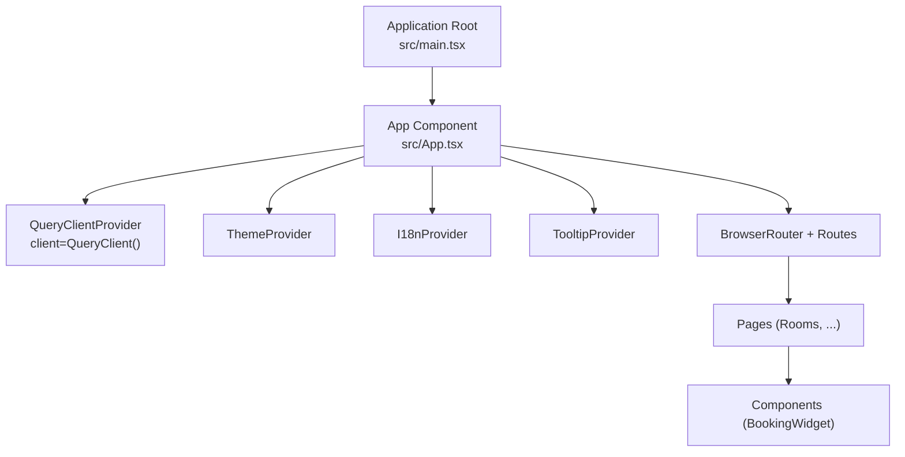
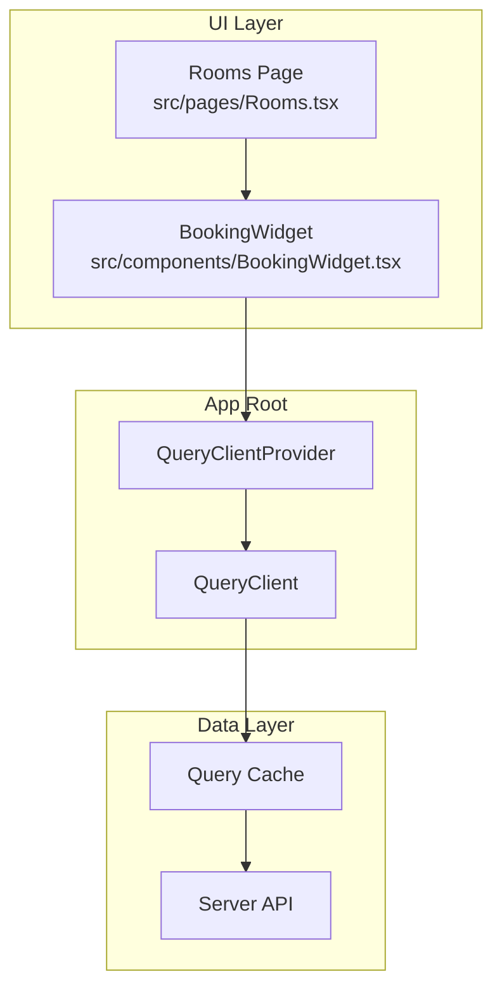
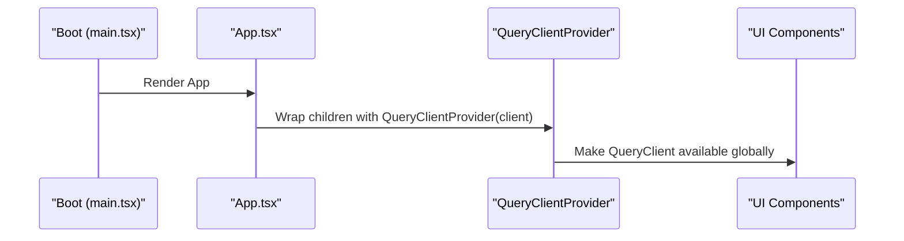
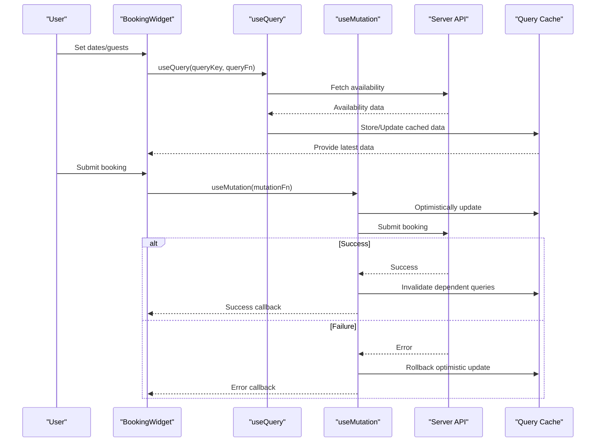
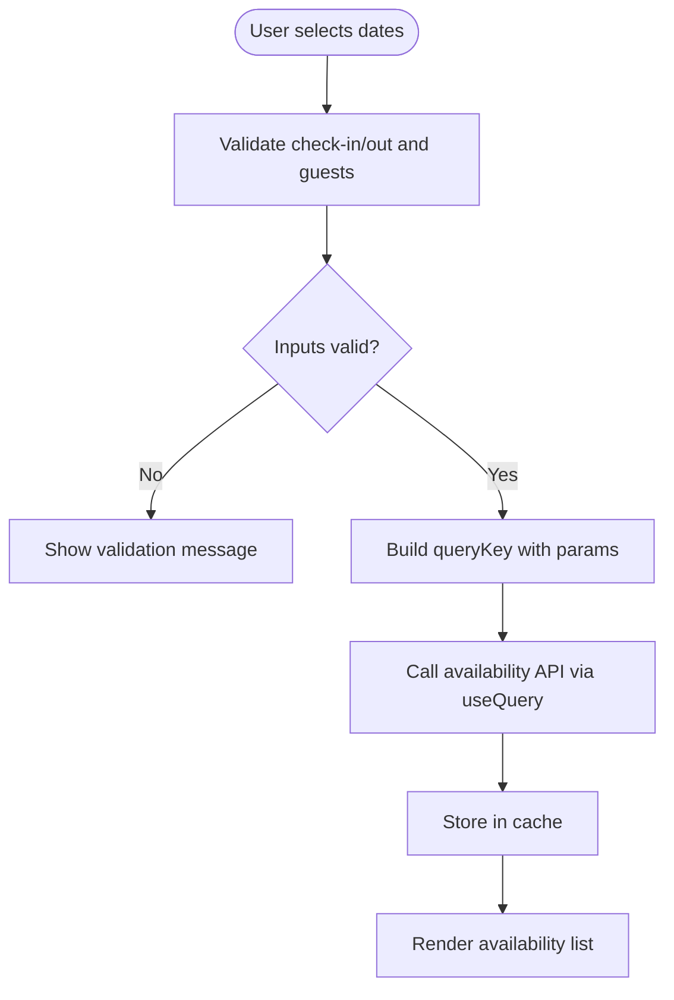
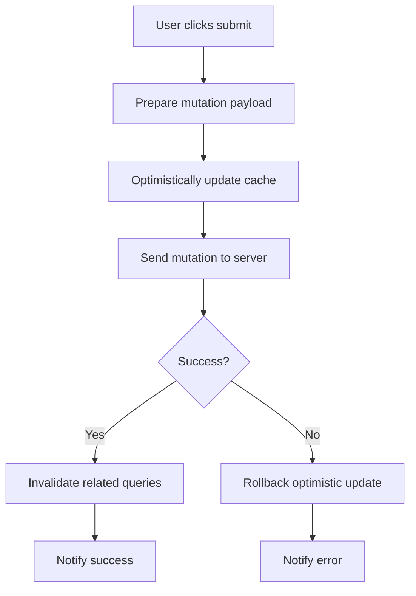
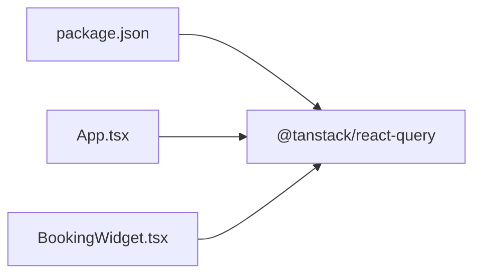

# React Query Integration

<cite>
**Referenced Files in This Document**
- [App.tsx](file://src/App.tsx)
- [main.tsx](file://src/main.tsx)
- [package.json](file://package.json)
- [Rooms.tsx](file://src/pages/Rooms.tsx)
- [BookingWidget.tsx](file://src/components/BookingWidget.tsx)
- [use-toast.ts](file://src/hooks/use-toast.ts)
</cite>

## Table of Contents
1. [Introduction](#introduction)
2. [Project Structure](#project-structure)
3. [Core Components](#core-components)
4. [Architecture Overview](#architecture-overview)
5. [Detailed Component Analysis](#detailed-component-analysis)
6. [Dependency Analysis](#dependency-analysis)
7. [Performance Considerations](#performance-considerations)
8. [Troubleshooting Guide](#troubleshooting-guide)
9. [Conclusion](#conclusion)

## Introduction
This document explains the React Query integration and caching strategy for the application. It covers QueryClient initialization, provider setup in the application root, and how queries and mutations would be structured across the app. It also documents patterns for booking data fetching, room availability checks, and form submissions, along with examples of query invalidation, cache updates, optimistic updates, error handling, retries, persistence, performance optimization, and debugging techniques.

## Project Structure
React Query is integrated at the application root via the QueryClientProvider. The application bootstraps the React tree and mounts the provider so that all components can use React Query hooks. The rooms page renders a modal containing the booking widget, which is the primary place where booking-related interactions occur.

**Diagram sources**
- [main.tsx](file://src/main.tsx#L1-L6)
- [App.tsx](file://src/App.tsx#L1-L45)

**Section sources**
- [main.tsx](file://src/main.tsx#L1-L6)
- [App.tsx](file://src/App.tsx#L1-L45)

## Core Components
- QueryClient initialization and provider setup
  - A single QueryClient instance is created and passed to QueryClientProvider at the root level. This enables global caching and background synchronization for all components.
  - The provider wraps the entire application, ensuring hooks like useQuery and useMutation are available anywhere in the component tree.

- Application bootstrap
  - The root element mounts the App component, which sets up providers for theming, internationalization, tooltips, and routing.

- Package dependency
  - React Query is included as a dependency, enabling use of React Query hooks and utilities.

**Section sources**
- [App.tsx](file://src/App.tsx#L17-L17)
- [App.tsx](file://src/App.tsx#L19-L42)
- [main.tsx](file://src/main.tsx#L1-L6)
- [package.json](file://package.json#L44-L44)

## Architecture Overview
The React Query architecture centers around a single QueryClient managing a global cache. Components use useQuery to fetch and subscribe to data, and useMutation for writes. Background refetching, invalidation, and updates keep the UI consistent with server state.

**Diagram sources**
- [App.tsx](file://src/App.tsx#L17-L17)
- [App.tsx](file://src/App.tsx#L20-L42)
- [Rooms.tsx](file://src/pages/Rooms.tsx#L1-L102)
- [BookingWidget.tsx](file://src/components/BookingWidget.tsx#L1-L154)

## Detailed Component Analysis

### QueryClient Initialization and Provider Setup
- Initialization
  - A QueryClient instance is created at the top level and passed to QueryClientProvider.
- Provider placement
  - The provider is placed at the root, wrapping ThemeProvider, I18nProvider, TooltipProvider, and the Router, ensuring all routes and components have access to React Query.

**Diagram sources**
- [main.tsx](file://src/main.tsx#L1-L6)
- [App.tsx](file://src/App.tsx#L19-L42)

**Section sources**
- [App.tsx](file://src/App.tsx#L17-L17)
- [App.tsx](file://src/App.tsx#L19-L42)

### Booking Widget: Query and Mutation Patterns
The BookingWidget demonstrates typical booking interactions. While the current implementation uses local state for mock results, the recommended pattern leverages React Query for real data.

- Query pattern (booking availability)
  - useQuery manages the availability check:
    - Query key encodes check-in/out dates, guests, rooms, and promo code.
    - Query function performs the availability API call.
    - Stale time controls cache freshness.
    - Refetch intervals enable background refresh.
- Mutation pattern (booking submission)
  - useMutation handles the booking request:
    - Optimistic updates modify the cache immediately.
    - On success, invalidate related queries to sync server state.
    - On failure, rollback cache changes and surface errors.

**Diagram sources**
- [BookingWidget.tsx](file://src/components/BookingWidget.tsx#L1-L154)

**Section sources**
- [BookingWidget.tsx](file://src/components/BookingWidget.tsx#L15-L39)
- [BookingWidget.tsx](file://src/components/BookingWidget.tsx#L41-L44)

### Room Availability Checks
- Current behavior
  - The widget computes availability locally and displays mock results.
- Recommended implementation
  - Replace local state with useQuery and a query key that includes check-in/out, guests, rooms, and promo code.
  - Configure staleTime and refetchInterval to balance freshness and performance.
  - Use enabled to prevent unnecessary requests until valid inputs are present.

**Diagram sources**
- [BookingWidget.tsx](file://src/components/BookingWidget.tsx#L25-L39)

**Section sources**
- [BookingWidget.tsx](file://src/components/BookingWidget.tsx#L25-L39)

### Form Submissions: Mutations and Optimistic Updates
- Current behavior
  - The continue action clears results and shows a toast message.
- Recommended implementation
  - Use useMutation for submission.
  - Perform optimistic updates to improve perceived responsiveness.
  - Invalidate queries on success to reflect server state.
  - Surface errors and rollback optimistic updates on failure.

**Diagram sources**
- [BookingWidget.tsx](file://src/components/BookingWidget.tsx#L41-L44)

**Section sources**
- [BookingWidget.tsx](file://src/components/BookingWidget.tsx#L41-L44)

### Query Invalidation and Cache Updates
- Invalidation
  - Invalidate queries after successful mutations to force refetch of affected data.
- Cache updates
  - Use queryClient.setQueryData to update cached entries after mutations.
- Pagination and lists
  - For paginated data, append new items or merge results carefully to avoid duplicates.

[No sources needed since this section provides general guidance]

### Error Handling and Retry Mechanisms
- Error boundaries
  - Wrap critical areas with a query error reset boundary to recover from transient errors.
- Retry policy
  - Configure retry attempts and exponential backoff for transient failures.
- User feedback
  - Use toasts to inform users of errors while allowing them to retry.

**Section sources**
- [use-toast.ts](file://src/hooks/use-toast.ts#L137-L164)

### Cache Persistence
- Local storage persistence
  - Persist the React Query cache to localStorage to survive page reloads.
- Hydration
  - Hydrate the cache on initial render to avoid immediate refetches.

[No sources needed since this section provides general guidance]

## Dependency Analysis
React Query is declared as a runtime dependency, enabling use of React Query hooks and utilities across the application.

**Diagram sources**
- [package.json](file://package.json#L44-L44)
- [App.tsx](file://src/App.tsx#L4-L4)
- [BookingWidget.tsx](file://src/components/BookingWidget.tsx#L1-L8)

**Section sources**
- [package.json](file://package.json#L44-L44)

## Performance Considerations
- Query caching
  - Enable caching for repeated queries; use staleTime to control when data is considered stale.
- Background refetching
  - Configure refetchInterval to keep data fresh without blocking the UI.
- Selective fetching
  - Use enabled to defer queries until inputs are valid.
- Efficient updates
  - Use optimistic updates for mutations to reduce perceived latency.
- Minimizing re-renders
  - Use queryClient.cancelQueries to cancel stale requests when inputs change rapidly.

[No sources needed since this section provides general guidance]

## Troubleshooting Guide
- Inspecting query state
  - Use React DevTools to inspect component props and confirm query states.
  - Log query keys and states during development to debug mismatches.
- Network request analysis
  - Use browser devtools Network tab to verify requests and response timing.
- Common pitfalls
  - Incorrect query keys cause cache misses; ensure keys encode all relevant inputs.
  - Missing invalidation leads to stale UI; always invalidate after mutations.
  - Over-fetching occurs with aggressive refetching; tune staleTime and refetchInterval.

[No sources needed since this section provides general guidance]

## Conclusion
The application integrates React Query at the root via QueryClientProvider, establishing a foundation for robust data fetching and caching. The Rooms page and BookingWidget represent the primary surfaces for implementing query and mutation patterns. By adopting useQuery for availability checks, useMutation for submissions with optimistic updates, and proper invalidation and caching strategies, the app can achieve responsive, reliable, and efficient data management. Tuning stale times, refetch intervals, and error handling further improves user experience and maintainability.