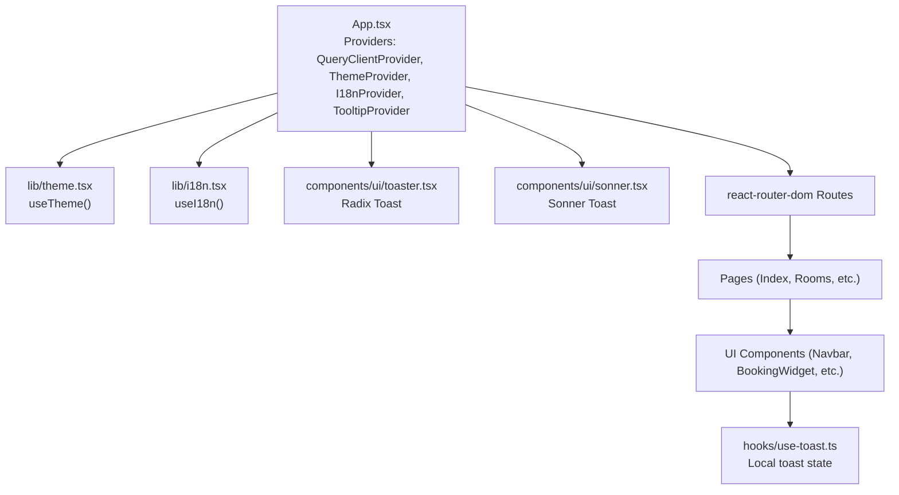
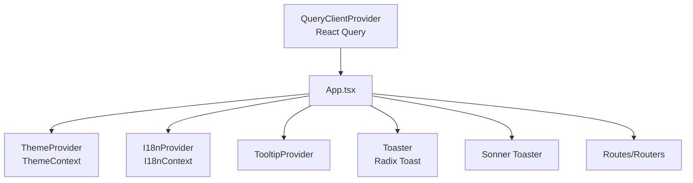
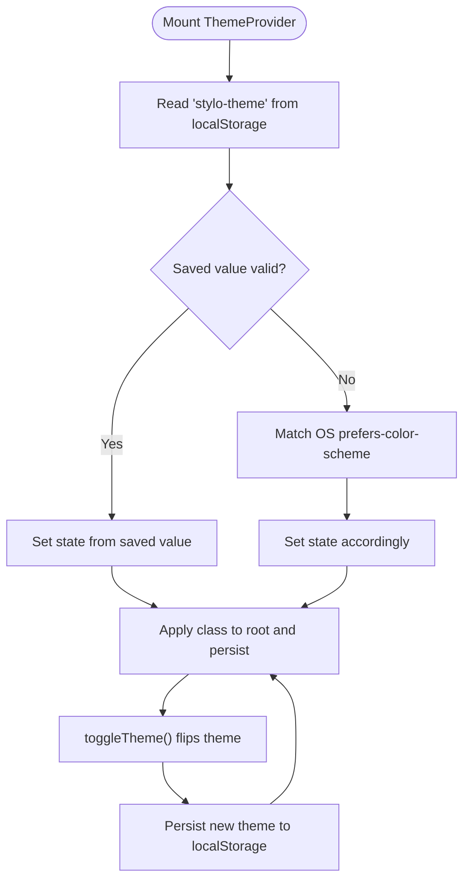
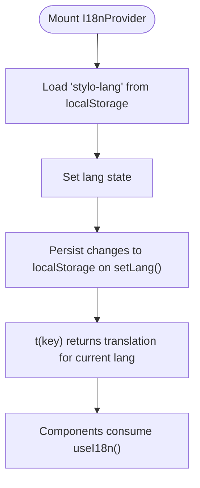
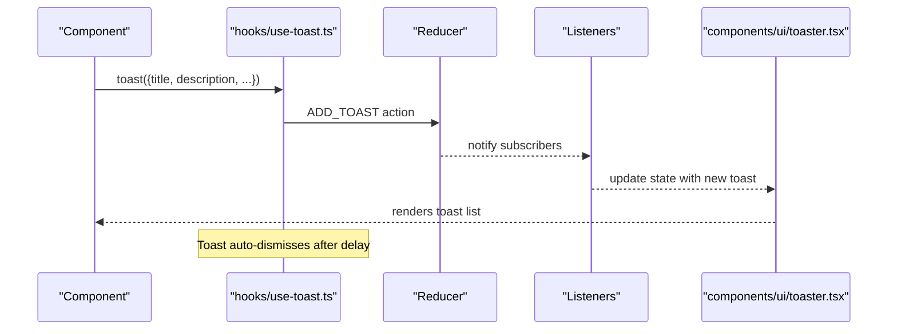
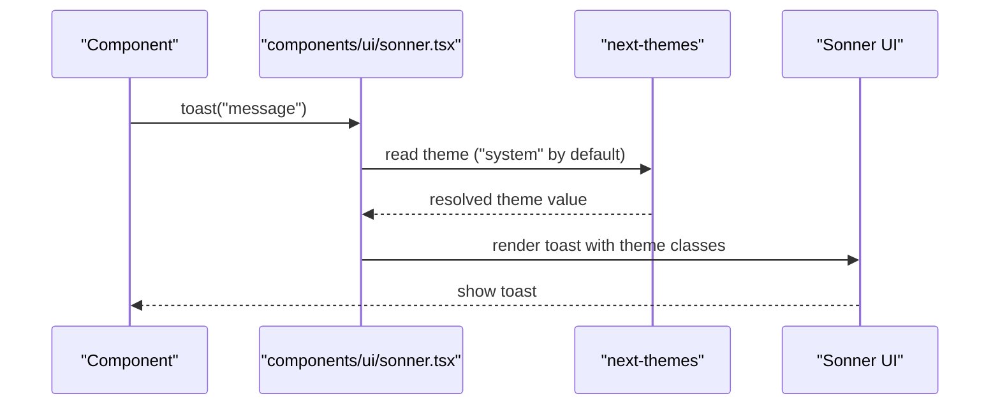
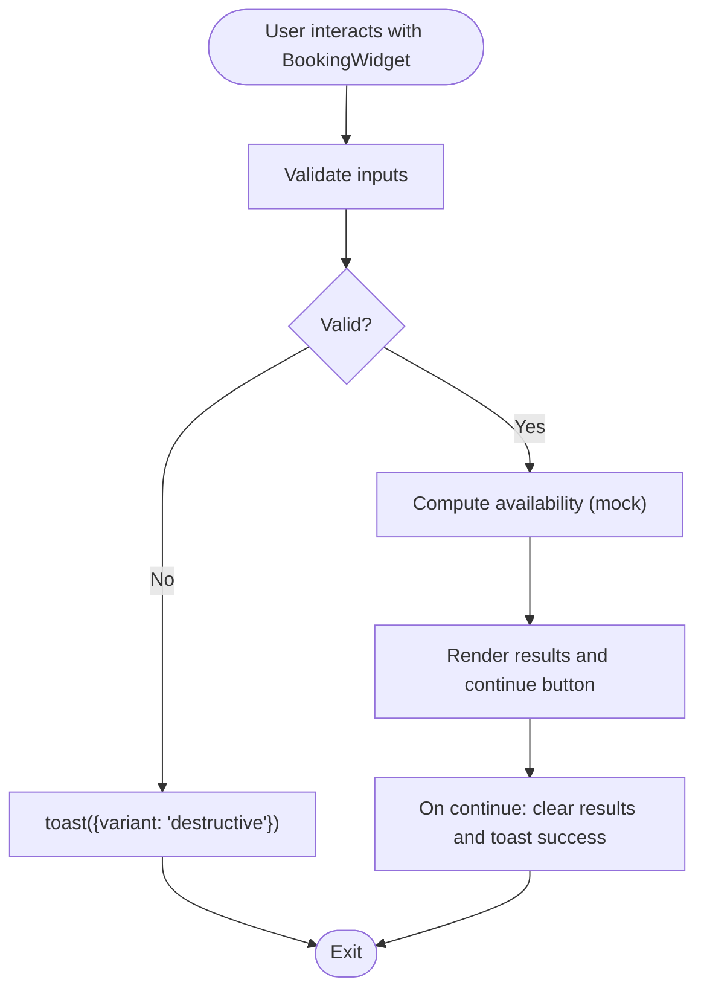
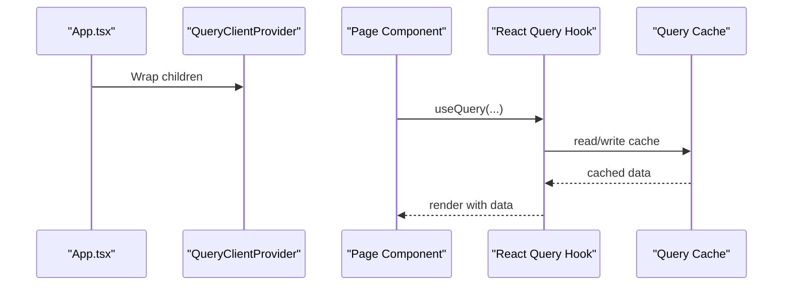
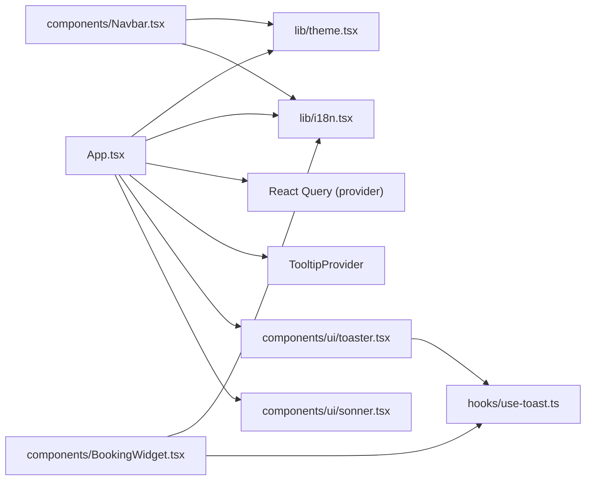

# State Management

<cite>
**Referenced Files in This Document**
- [App.tsx](file://src/App.tsx)
- [main.tsx](file://src/main.tsx)
- [theme.tsx](file://src/lib/theme.tsx)
- [i18n.tsx](file://src/lib/i18n.tsx)
- [use-toast.ts](file://src/hooks/use-toast.ts)
- [toaster.tsx](file://src/components/ui/toaster.tsx)
- [sonner.tsx](file://src/components/ui/sonner.tsx)
- [toast.tsx](file://src/components/ui/toast.tsx)
- [Navbar.tsx](file://src/components/Navbar.tsx)
- [BookingWidget.tsx](file://src/components/BookingWidget.tsx)
- [Index.tsx](file://src/pages/Index.tsx)
- [package.json](file://package.json)
</cite>

## Table of Contents
1. [Introduction](#introduction)
2. [Project Structure](#project-structure)
3. [Core Components](#core-components)
4. [Architecture Overview](#architecture-overview)
5. [Detailed Component Analysis](#detailed-component-analysis)
6. [Dependency Analysis](#dependency-analysis)
7. [Performance Considerations](#performance-considerations)
8. [Troubleshooting Guide](#troubleshooting-guide)
9. [Conclusion](#conclusion)

## Introduction
This document explains the state management architecture of the application, focusing on:
- Provider hierarchy and global contexts for theme, internationalization (i18n), and toast notifications
- Local state management strategies within components
- Integration of React Query for caching and synchronization
- State persistence mechanisms and error handling
- Debugging approaches and best practices for organizing state, avoiding prop drilling, and maintaining consistency

## Project Structure
The application initializes providers at the root level and composes UI and page components beneath them. Providers encapsulate cross-cutting concerns and expose hooks for consumption.

**Diagram sources**
- [App.tsx](file://src/App.tsx#L1-L45)
- [theme.tsx](file://src/lib/theme.tsx#L1-L36)
- [i18n.tsx](file://src/lib/i18n.tsx#L1-L173)
- [toaster.tsx](file://src/components/ui/toaster.tsx#L1-L25)
- [sonner.tsx](file://src/components/ui/sonner.tsx#L1-L28)
- [Index.tsx](file://src/pages/Index.tsx#L1-L28)

**Section sources**
- [App.tsx](file://src/App.tsx#L1-L45)
- [main.tsx](file://src/main.tsx#L1-L6)

## Core Components
- Theme provider: Manages light/dark theme selection, persists to local storage, and applies a class to the root element.
- Internationalization provider: Centralizes language selection and translation lookup, persisted to local storage.
- Toast providers: Two complementary systems:
  - Radix-based toast via a custom hook and a Toaster component
  - Sonner toast integrated with theme awareness
- React Query: Provides caching and synchronization infrastructure for data-fetching scenarios.

Key hooks and providers:
- Theme: useTheme()
- i18n: useI18n()
- Toast: useToast(), toast() from hooks/use-toast.ts
- Sonner: Toaster, toast from components/ui/sonner.tsx

**Section sources**
- [theme.tsx](file://src/lib/theme.tsx#L1-L36)
- [i18n.tsx](file://src/lib/i18n.tsx#L1-L173)
- [use-toast.ts](file://src/hooks/use-toast.ts#L1-L187)
- [toaster.tsx](file://src/components/ui/toaster.tsx#L1-L25)
- [sonner.tsx](file://src/components/ui/sonner.tsx#L1-L28)
- [App.tsx](file://src/App.tsx#L1-L45)

## Architecture Overview
The provider hierarchy establishes global state and UI primitives:
- QueryClientProvider wraps the entire app to enable React Query caching and synchronization.
- ThemeProvider and I18nProvider provide theme and language state to the whole tree.
- TooltipProvider enables tooltips across the app.
- Toaster and Sonner provide distinct toast experiences.

**Diagram sources**
- [App.tsx](file://src/App.tsx#L1-L45)

**Section sources**
- [App.tsx](file://src/App.tsx#L1-L45)

## Detailed Component Analysis

### Theme Context
- Purpose: Manage theme state and persist to local storage; apply a class to the root element for styling.
- State: theme (light/dark), toggleTheme().
- Persistence: Reads initial preference from local storage or OS setting; writes changes to local storage.
- Consumers: Components like Navbar conditionally render assets based on theme.

**Diagram sources**
- [theme.tsx](file://src/lib/theme.tsx#L12-L31)

**Section sources**
- [theme.tsx](file://src/lib/theme.tsx#L1-L36)
- [Navbar.tsx](file://src/components/Navbar.tsx#L1-L133)

### Internationalization Context
- Purpose: Provide language state and translation function across the app.
- State: lang, setLang(lang), t(key).
- Persistence: Persists language selection to local storage.
- Consumers: Components render localized strings using t(key).

**Diagram sources**
- [i18n.tsx](file://src/lib/i18n.tsx#L148-L168)

**Section sources**
- [i18n.tsx](file://src/lib/i18n.tsx#L1-L173)
- [Navbar.tsx](file://src/components/Navbar.tsx#L1-L133)

### Toast Notification State (Radix-based)
- Purpose: Provide a global toast queue with controlled concurrency and lifecycle.
- State: toasts array with id, title, description, action, and open state.
- Concurrency: Limits concurrent toasts and schedules removal after a delay.
- Subscription pattern: useToast() subscribes to a global reducer via a listener array.
- Consumers: Components call toast() to enqueue notifications.

**Diagram sources**
- [use-toast.ts](file://src/hooks/use-toast.ts#L128-L184)
- [toaster.tsx](file://src/components/ui/toaster.tsx#L1-L25)

**Section sources**
- [use-toast.ts](file://src/hooks/use-toast.ts#L1-L187)
- [toaster.tsx](file://src/components/ui/toaster.tsx#L1-L25)

### Sonner Toast Integration
- Purpose: Provide a modern toast experience with theme-aware styling and minimal configuration.
- Integration: Uses next-themes to mirror system theme and applies Tailwind-based class names.

**Diagram sources**
- [sonner.tsx](file://src/components/ui/sonner.tsx#L1-L28)

**Section sources**
- [sonner.tsx](file://src/components/ui/sonner.tsx#L1-L28)

### Local State Management Strategies
- Example: BookingWidget maintains local state for dates, guests, rooms, promo code, and availability results.
- Validation: Performs inline checks and triggers toasts for invalid inputs.
- UX: Clears results after continuation and shows success feedback via toast.

**Diagram sources**
- [BookingWidget.tsx](file://src/components/BookingWidget.tsx#L1-L154)

**Section sources**
- [BookingWidget.tsx](file://src/components/BookingWidget.tsx#L1-L154)

### React Query Integration
- Purpose: Provide caching, background updates, and synchronization for data-fetching needs.
- Setup: A single QueryClient is created at the root and provided to the app.
- Usage: While no explicit queries are shown in the current code, the provider is present to support future data-fetching patterns.

**Diagram sources**
- [App.tsx](file://src/App.tsx#L17-L42)
- [package.json](file://package.json#L44-L44)

**Section sources**
- [App.tsx](file://src/App.tsx#L1-L45)
- [package.json](file://package.json#L1-L90)

## Dependency Analysis
- Provider stack: App.tsx composes QueryClientProvider, ThemeProvider, I18nProvider, TooltipProvider, and routers.
- Component dependencies:
  - Navbar consumes useTheme() and useI18n()
  - BookingWidget consumes useI18n() and toast() from hooks/use-toast.ts
  - Toaster composes Radix toast primitives and uses hooks/use-toast.ts
  - Sonner Toaster integrates with next-themes for theme-aware rendering

**Diagram sources**
- [App.tsx](file://src/App.tsx#L1-L45)
- [Navbar.tsx](file://src/components/Navbar.tsx#L1-L133)
- [BookingWidget.tsx](file://src/components/BookingWidget.tsx#L1-L154)
- [use-toast.ts](file://src/hooks/use-toast.ts#L1-L187)
- [toaster.tsx](file://src/components/ui/toaster.tsx#L1-L25)
- [sonner.tsx](file://src/components/ui/sonner.tsx#L1-L28)

**Section sources**
- [App.tsx](file://src/App.tsx#L1-L45)
- [Navbar.tsx](file://src/components/Navbar.tsx#L1-L133)
- [BookingWidget.tsx](file://src/components/BookingWidget.tsx#L1-L154)
- [use-toast.ts](file://src/hooks/use-toast.ts#L1-L187)
- [toaster.tsx](file://src/components/ui/toaster.tsx#L1-L25)
- [sonner.tsx](file://src/components/ui/sonner.tsx#L1-L28)

## Performance Considerations
- Minimize re-renders:
  - Keep global contexts shallow; avoid passing large objects through providers unnecessarily.
  - Use memoization for translation keys and derived values in consumers.
- Toast performance:
  - Limit concurrent toasts to reduce DOM churn.
  - Avoid frequent heavy computations inside toast callbacks.
- Theme/i18n:
  - Persist to localStorage sparingly; batch updates when possible.
- React Query:
  - Configure cache times and invalidation strategies appropriate to data volatility.
  - Use query keys that reflect the specificity of data to prevent unnecessary refetches.

## Troubleshooting Guide
- Toast not appearing:
  - Ensure Toaster or Sonner Toaster is rendered at or above the consuming component.
  - Verify that toast() is called from a component within the provider tree.
- Theme not applying:
  - Confirm the theme class is applied to the root element and local storage persists the value.
  - Check for conflicting CSS overrides.
- i18n not switching:
  - Ensure setLang() is invoked and the value is persisted to local storage.
  - Verify translation keys exist in the dictionary.
- Debugging state:
  - Add logging around dispatch actions in the toast reducer to observe state transitions.
  - Temporarily log theme and language state in components to confirm provider propagation.

**Section sources**
- [use-toast.ts](file://src/hooks/use-toast.ts#L128-L184)
- [theme.tsx](file://src/lib/theme.tsx#L19-L22)
- [i18n.tsx](file://src/lib/i18n.tsx#L149-L161)
- [toaster.tsx](file://src/components/ui/toaster.tsx#L1-L25)
- [sonner.tsx](file://src/components/ui/sonner.tsx#L1-L28)

## Conclusion
The application employs a clean provider hierarchy to centralize theme, i18n, and toast state while enabling local component state for UI interactions. React Query is provisioned for future data-fetching needs. By following the outlined patterns—avoiding prop drilling, leveraging hooks, persisting user preferences, and carefully managing toast concurrency—the system remains maintainable and responsive. Extending the architecture with React Query will further improve caching and synchronization for dynamic content.